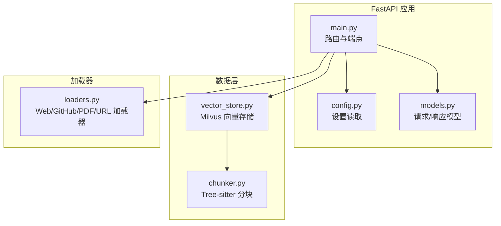
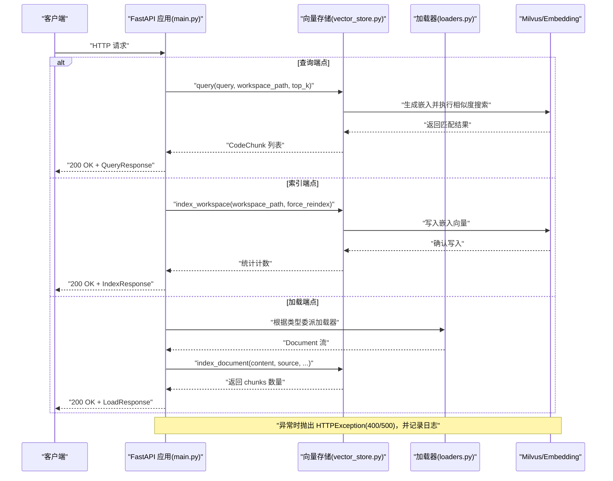
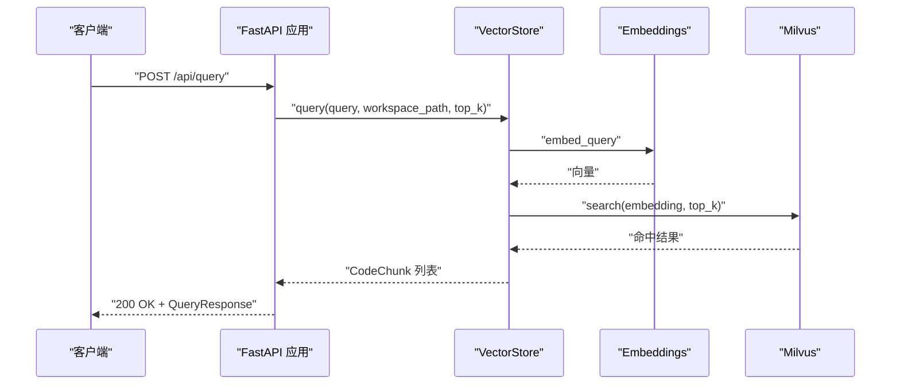
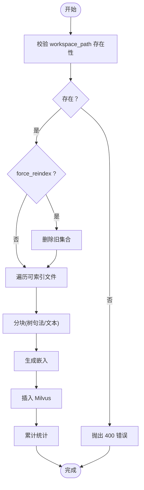
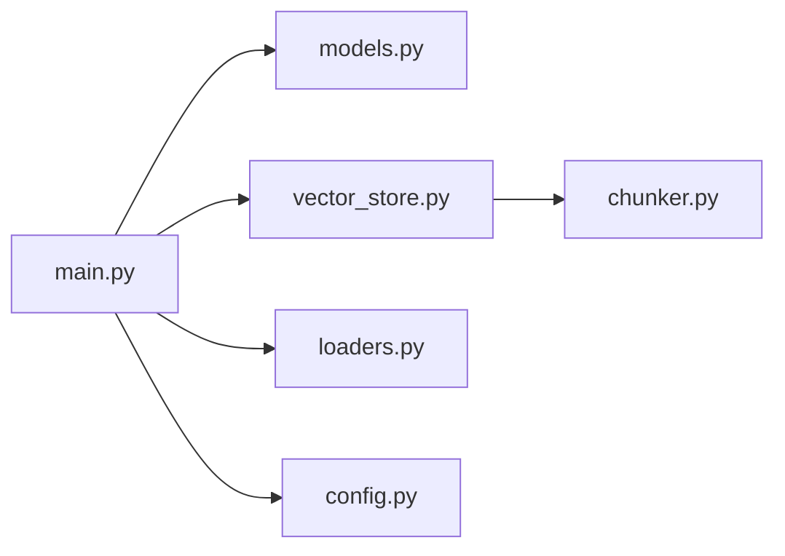

# API端点参考

<cite>
**本文引用的文件**
- [backend-rag/app/main.py](file://backend-rag/app/main.py)
- [backend-rag/app/models.py](file://backend-rag/app/models.py)
- [backend-rag/app/vector_store.py](file://backend-rag/app/vector_store.py)
- [backend-rag/app/loaders.py](file://backend-rag/app/loaders.py)
- [backend-rag/app/chunker.py](file://backend-rag/app/chunker.py)
- [backend-rag/app/config.py](file://backend-rag/app/config.py)
- [backend-rag/pyproject.toml](file://backend-rag/pyproject.toml)
- [backend-rag/.env.example](file://backend-rag/.env.example)
- [QUICK_START.md](file://QUICK_START.md)
</cite>

## 目录
1. [简介](#简介)
2. [项目结构](#项目结构)
3. [核心组件](#核心组件)
4. [架构总览](#架构总览)
5. [详细端点说明](#详细端点说明)
6. [依赖关系分析](#依赖关系分析)
7. [性能与容量规划](#性能与容量规划)
8. [故障排查指南](#故障排查指南)
9. [结论](#结论)
10. [附录](#附录)

## 简介
本文件为 RAG 服务的完整 API 参考，覆盖所有 REST 端点，包括：
- 语义检索：/api/query
- 工作区索引：/api/index
- 多源加载：/api/load/web、/api/load/github、/api/load/pdf、/api/load/url
- 健康检查：/health
- 根路径：/

同时，文档解释了请求/响应模型（来自 models.py 的 Pydantic 类）、参数说明、使用示例、错误处理机制（HTTP 400/500）、以及安全注意事项（认证、速率限制建议）。为便于集成，提供了 curl 示例与 Python 客户端调用思路。

## 项目结构
后端 RAG 服务采用 Python + FastAPI 构建，核心模块如下：
- 应用入口与路由：app/main.py
- 数据模型（Pydantic）：app/models.py
- 向量存储与检索：app/vector_store.py
- 文档加载器：app/loaders.py
- 代码分块策略：app/chunker.py
- 配置管理：app/config.py
- 依赖声明：pyproject.toml
- 环境变量示例：.env.example
- 快速开始与端口说明：QUICK_START.md

图表来源
- [backend-rag/app/main.py](file://backend-rag/app/main.py#L1-L120)
- [backend-rag/app/models.py](file://backend-rag/app/models.py#L1-L88)
- [backend-rag/app/vector_store.py](file://backend-rag/app/vector_store.py#L1-L120)
- [backend-rag/app/chunker.py](file://backend-rag/app/chunker.py#L1-L120)
- [backend-rag/app/loaders.py](file://backend-rag/app/loaders.py#L1-L120)
- [backend-rag/app/config.py](file://backend-rag/app/config.py#L1-L51)

章节来源
- [backend-rag/app/main.py](file://backend-rag/app/main.py#L1-L120)
- [QUICK_START.md](file://QUICK_START.md#L57-L73)

## 核心组件
- 请求/响应模型（Pydantic）
  - 查询请求/响应：QueryRequest、QueryResponse
  - 索引请求/响应：IndexRequest、IndexResponse
  - 健康检查响应：HealthResponse
  - 加载器请求/响应：WebCrawlRequest、GitHubRepoRequest、PDFLoadRequest、URLLoadRequest、LoadResponse
- 向量存储与检索
  - VectorStore：工作区集合与全局集合、查询、索引、健康检查
  - 分块器：Tree-sitter AST 分块与文本回退
- 加载器
  - WebPageLoader：静态/JS 渲染页面抓取、链接爬取
  - GitHubRepoLoader：浅克隆、模式过滤、私有仓库支持
  - PDFLoader：文本与表格抽取
  - URLLoader：自动类型检测与委派

章节来源
- [backend-rag/app/models.py](file://backend-rag/app/models.py#L1-L88)
- [backend-rag/app/vector_store.py](file://backend-rag/app/vector_store.py#L1-L120)
- [backend-rag/app/chunker.py](file://backend-rag/app/chunker.py#L1-L120)
- [backend-rag/app/loaders.py](file://backend-rag/app/loaders.py#L1-L120)

## 架构总览
下图展示了从客户端到服务端各组件的交互流程，以及错误处理与日志记录位置。

图表来源
- [backend-rag/app/main.py](file://backend-rag/app/main.py#L65-L343)
- [backend-rag/app/vector_store.py](file://backend-rag/app/vector_store.py#L377-L435)
- [backend-rag/app/loaders.py](file://backend-rag/app/loaders.py#L1-L120)

## 详细端点说明

### GET /health
- 功能：健康检查，验证向量存储连接状态
- 请求：无
- 响应：HealthResponse
  - 字段：status、version、chroma_connected
- 错误：无特定错误码；若 Milvus 不可用，返回非健康状态
- 使用示例
  - curl：curl http://localhost:8000/health
  - Python：requests.get("http://localhost:8000/health")

章节来源
- [backend-rag/app/main.py](file://backend-rag/app/main.py#L55-L63)
- [backend-rag/app/models.py](file://backend-rag/app/models.py#L41-L46)
- [backend-rag/app/vector_store.py](file://backend-rag/app/vector_store.py#L448-L457)

### GET /
- 功能：根路径返回服务元信息与可用端点列表
- 请求：无
- 响应：包含名称、版本、文档地址、健康端点及各端点说明
- 使用示例
  - curl：curl http://localhost:8000/
  - Python：requests.get("http://localhost:8000/")

章节来源
- [backend-rag/app/main.py](file://backend-rag/app/main.py#L122-L139)

### POST /api/query
- 功能：对指定工作区执行语义搜索，返回最相关的代码片段
- 请求体：QueryRequest
  - 字段：
    - query: 搜索关键词或问题描述
    - workspace_path: 要检索的工作区绝对路径
    - top_k: 返回结果数量，默认 5，范围 1..20
- 响应体：QueryResponse
  - 字段：
    - chunks: CodeChunk 列表
      - content: 片段内容
      - file_path: 来源文件路径
      - start_line/end_line: 行号范围
      - score: 相似度分数
      - metadata: 额外元数据（语言、节点类型等）
- 错误：
  - 500：内部异常（例如向量存储或嵌入失败）
- 使用示例
  - curl：curl -X POST http://localhost:8000/api/query -H "Content-Type: application/json" -d '{"query":"如何实现登录逻辑","workspace_path":"/home/user/project","top_k":5}'
  - Python：见“附录”中的调用思路
- 语义搜索流程（概念）
  - 生成查询向量
  - 在 Milvus 中按余弦距离检索 top_k
  - 将命中结果转换为 CodeChunk 并返回

图表来源
- [backend-rag/app/main.py](file://backend-rag/app/main.py#L65-L90)
- [backend-rag/app/vector_store.py](file://backend-rag/app/vector_store.py#L377-L435)

章节来源
- [backend-rag/app/main.py](file://backend-rag/app/main.py#L65-L90)
- [backend-rag/app/models.py](file://backend-rag/app/models.py#L5-L25)
- [backend-rag/app/vector_store.py](file://backend-rag/app/vector_store.py#L377-L435)

### POST /api/index
- 功能：对工作区进行索引，将代码文件切分为片段并生成嵌入存入 Milvus
- 请求体：IndexRequest
  - 字段：
    - workspace_path: 绝对路径
    - force_reindex: 是否强制重建索引（删除旧集合后重建）
- 响应体：IndexResponse
  - 字段：success、message、files_indexed、chunks_created
- 错误：
  - 400：工作区路径不存在等参数错误
  - 500：索引过程异常
- 使用示例
  - curl：curl -X POST http://localhost:8000/api/index -H "Content-Type: application/json" -d '{"workspace_path":"/home/user/project","force_reindex":false}'
  - Python：见“附录”中的调用思路
- 索引流程（概念）
  - 遍历工作区文件（忽略目录与扩展名）
  - 使用 Tree-sitter 或文本回退进行分块
  - 生成嵌入并插入 Milvus
  - 返回统计信息

图表来源
- [backend-rag/app/main.py](file://backend-rag/app/main.py#L92-L120)
- [backend-rag/app/vector_store.py](file://backend-rag/app/vector_store.py#L121-L204)
- [backend-rag/app/chunker.py](file://backend-rag/app/chunker.py#L104-L160)

章节来源
- [backend-rag/app/main.py](file://backend-rag/app/main.py#L92-L120)
- [backend-rag/app/models.py](file://backend-rag/app/models.py#L27-L39)
- [backend-rag/app/vector_store.py](file://backend-rag/app/vector_store.py#L121-L204)
- [backend-rag/app/chunker.py](file://backend-rag/app/chunker.py#L104-L160)

### POST /api/load/web
- 功能：抓取网页并索引，支持静态与 JS 渲染页面
- 请求体：WebCrawlRequest
  - 字段：
    - urls: 待抓取 URL 列表
    - max_depth: 抓取深度（0 表示仅单页）
    - use_playwright: 是否使用 Playwright 处理 JS 渲染
    - same_domain_only: 是否仅同域链接
- 响应体：LoadResponse
  - 字段：success、message、documents_loaded、chunks_created、sources
- 错误：500 内部异常
- 使用示例
  - curl：curl -X POST http://localhost:8000/api/load/web -H "Content-Type: application/json" -d '{"urls":["https://example.com"],"use_playwright":true,"max_depth":1,"same_domain_only":true}'
  - Python：见“附录”中的调用思路

章节来源
- [backend-rag/app/main.py](file://backend-rag/app/main.py#L143-L190)
- [backend-rag/app/models.py](file://backend-rag/app/models.py#L50-L56)
- [backend-rag/app/loaders.py](file://backend-rag/app/loaders.py#L40-L120)

### POST /api/load/github
- 功能：克隆并索引 GitHub 仓库
- 请求体：GitHubRepoRequest
  - 字段：
    - repo_url: 仓库 URL
    - branch: 分支，默认 main
    - include_patterns/exclude_patterns: 文件模式过滤
- 响应体：LoadResponse
- 错误：500 内部异常
- 使用示例
  - curl：curl -X POST http://localhost:8000/api/load/github -H "Content-Type: application/json" -d '{"repo_url":"https://github.com/user/repo","branch":"main","include_patterns":["*"],"exclude_patterns":["node_modules/*",".git/*"]}'
  - Python：见“附录”中的调用思路

章节来源
- [backend-rag/app/main.py](file://backend-rag/app/main.py#L192-L239)
- [backend-rag/app/models.py](file://backend-rag/app/models.py#L58-L67)
- [backend-rag/app/loaders.py](file://backend-rag/app/loaders.py#L182-L310)

### POST /api/load/pdf
- 功能：加载本地或远程 PDF，并索引
- 请求体：PDFLoadRequest
  - 字段：
    - file_paths: 本地 PDF 路径列表
    - urls: 远程 PDF URL 列表
- 响应体：LoadResponse
- 错误：500 内部异常
- 使用示例
  - curl：curl -X POST http://localhost:8000/api/load/pdf -H "Content-Type: application/json" -d '{"file_paths":["/path/a.pdf"],"urls":["https://example.com/b.pdf"]}'
  - Python：见“附录”中的调用思路

章节来源
- [backend-rag/app/main.py](file://backend-rag/app/main.py#L241-L296)
- [backend-rag/app/models.py](file://backend-rag/app/models.py#L69-L73)
- [backend-rag/app/loaders.py](file://backend-rag/app/loaders.py#L312-L402)

### POST /api/load/url
- 功能：自动识别 URL 类型并加载（网页、GitHub 仓库、PDF）
- 请求体：URLLoadRequest
  - 字段：
    - url: 待加载 URL
    - use_playwright: 是否使用 Playwright
- 响应体：LoadResponse
- 错误：500 内部异常
- 使用示例
  - curl：curl -X POST http://localhost:8000/api/load/url -H "Content-Type: application/json" -d '{"url":"https://github.com/user/repo","use_playwright":false}'
  - Python：见“附录”中的调用思路

章节来源
- [backend-rag/app/main.py](file://backend-rag/app/main.py#L298-L343)
- [backend-rag/app/models.py](file://backend-rag/app/models.py#L75-L80)
- [backend-rag/app/loaders.py](file://backend-rag/app/loaders.py#L404-L462)

## 依赖关系分析
- FastAPI 应用依赖：
  - 模型定义（Pydantic）用于请求/响应校验
  - 向量存储（Milvus）用于检索与索引
  - 加载器（Web/GitHub/PDF/URL）用于多源内容抽取
  - 配置（Settings）用于环境变量注入
- 关键耦合点：
  - /api/query 与 /api/index 共享 VectorStore
  - 所有加载端点共享 VectorStore.index_document
  - 分块器与嵌入模型由配置驱动

图表来源
- [backend-rag/app/main.py](file://backend-rag/app/main.py#L1-L120)
- [backend-rag/app/models.py](file://backend-rag/app/models.py#L1-L88)
- [backend-rag/app/vector_store.py](file://backend-rag/app/vector_store.py#L1-L120)
- [backend-rag/app/chunker.py](file://backend-rag/app/chunker.py#L1-L120)
- [backend-rag/app/loaders.py](file://backend-rag/app/loaders.py#L1-L120)
- [backend-rag/app/config.py](file://backend-rag/app/config.py#L1-L51)

章节来源
- [backend-rag/app/main.py](file://backend-rag/app/main.py#L1-L120)
- [backend-rag/pyproject.toml](file://backend-rag/pyproject.toml#L1-L67)

## 性能与容量规划
- 向量检索
  - Milvus 使用 IVF_FLAT 索引，余弦距离度量，nprobe 参数控制召回精度与速度
  - top_k 越大，检索耗时越高；默认值可在配置中调整
- 分块策略
  - Tree-sitter AST 分块优先保留函数/类等逻辑边界；不支持的语言回退为文本分块
  - 可通过 MAX_CHUNK_SIZE 和 CHUNK_OVERLAP 调整分块大小与重叠
- 嵌入模型
  - 默认 embedding 模型维度为 1536；需确保 OpenAI API Key 正确配置
- 索引规模
  - 大型工作区建议先清理不需要的目录（如 node_modules、.git），以减少索引时间
- 并发与限流
  - 当前未内置速率限制；建议在网关或反向代理层实施限流策略

章节来源
- [backend-rag/app/vector_store.py](file://backend-rag/app/vector_store.py#L90-L118)
- [backend-rag/app/chunker.py](file://backend-rag/app/chunker.py#L1-L120)
- [backend-rag/app/config.py](file://backend-rag/app/config.py#L9-L40)

## 故障排查指南
- 常见错误与定位
  - 400：索引端点传入无效路径；检查 workspace_path 是否存在
  - 500：查询/索引/加载过程中异常；查看服务日志，确认 Milvus 连接、OpenAI Key、网络可达性
- 健康检查
  - 使用 /health 确认 Milvus 连接状态
- 日志
  - 应用启动与关闭日志、各端点异常日志均输出到标准日志
- 环境变量
  - 确保 OPENAI_API_KEY、MILVUS_*、GITHUB_TOKEN 等已正确配置

章节来源
- [backend-rag/app/main.py](file://backend-rag/app/main.py#L55-L90)
- [backend-rag/app/vector_store.py](file://backend-rag/app/vector_store.py#L448-L457)
- [.env.example](file://backend-rag/.env.example#L1-L28)

## 结论
本 API 提供了从工作区代码到外部文档的统一语义检索能力。通过清晰的请求/响应模型、可配置的分块与嵌入策略，以及多源加载器，用户可以快速构建智能问答与上下文检索场景。建议结合网关层实施认证与限流，确保生产环境的安全与稳定。

## 附录

### 请求/响应模型字段与验证规则
- QueryRequest
  - query: 必填字符串
  - workspace_path: 必填字符串
  - top_k: 默认 5，范围 1..20
- IndexRequest
  - workspace_path: 必填字符串
  - force_reindex: 布尔，默认 false
- QueryResponse
  - chunks: CodeChunk 列表
- IndexResponse
  - success: 布尔
  - message: 字符串
  - files_indexed: 整数
  - chunks_created: 整数
- HealthResponse
  - status: 字符串
  - version: 字符串
  - chroma_connected: 布尔
- WebCrawlRequest
  - urls: 字符串数组
  - max_depth: 默认 0，范围 0..3
  - use_playwright: 布尔
  - same_domain_only: 布尔
- GitHubRepoRequest
  - repo_url: 必填字符串
  - branch: 默认 main
  - include_patterns: 默认 ["*"]
  - exclude_patterns: 默认排除 node_modules、.git、__pycache__ 等
- PDFLoadRequest
  - file_paths: 字符串数组
  - urls: 字符串数组
- URLLoadRequest
  - url: 必填字符串
  - use_playwright: 布尔
- LoadResponse
  - success: 布尔
  - message: 字符串
  - documents_loaded: 整数
  - chunks_created: 整数
  - sources: 字符串数组

章节来源
- [backend-rag/app/models.py](file://backend-rag/app/models.py#L1-L88)

### curl 示例
- 查询
  - curl -X POST http://localhost:8000/api/query -H "Content-Type: application/json" -d '{"query":"如何实现登录逻辑","workspace_path":"/home/user/project","top_k":5}'
- 索引
  - curl -X POST http://localhost:8000/api/index -H "Content-Type: application/json" -d '{"workspace_path":"/home/user/project","force_reindex":false}'
- 加载网页
  - curl -X POST http://localhost:8000/api/load/web -H "Content-Type: application/json" -d '{"urls":["https://example.com"],"use_playwright":true,"max_depth":1,"same_domain_only":true}'
- 加载 GitHub
  - curl -X POST http://localhost:8000/api/load/github -H "Content-Type: application/json" -d '{"repo_url":"https://github.com/user/repo","branch":"main","include_patterns":["*"],"exclude_patterns":["node_modules/*",".git/*"]}'
- 加载 PDF
  - curl -X POST http://localhost:8000/api/load/pdf -H "Content-Type: application/json" -d '{"file_paths":["/path/a.pdf"],"urls":["https://example.com/b.pdf"]}'
- 加载任意 URL
  - curl -X POST http://localhost:8000/api/load/url -H "Content-Type: application/json" -d '{"url":"https://github.com/user/repo","use_playwright":false}'

### Python 客户端调用思路
- 使用 requests 或 httpx 发送 HTTP 请求
- 对于 JSON 请求体，使用 json=... 传递 Pydantic 模型序列化后的字典
- 对于响应，解析为对应 Pydantic 模型（如 QueryResponse.model_validate(...)）
- 错误处理：捕获 HTTPException 或 500 异常，记录 detail 并提示用户

章节来源
- [backend-rag/app/main.py](file://backend-rag/app/main.py#L65-L343)
- [backend-rag/app/models.py](file://backend-rag/app/models.py#L1-L88)

### 安全与速率限制建议
- 认证
  - 当前端点未内置鉴权；建议在反向代理或 API 网关层添加 API Key/Token 校验
- 速率限制
  - 在网关层限制每 IP/Key 的 QPS，避免突发流量导致 Milvus 或嵌入服务过载
- 传输安全
  - 建议启用 HTTPS，保护敏感参数与响应内容
- 最小权限
  - Milvus 用户仅授予必要权限；GitHub Token 仅用于私有仓库访问

章节来源
- [backend-rag/app/main.py](file://backend-rag/app/main.py#L45-L53)
- [backend-rag/app/config.py](file://backend-rag/app/config.py#L9-L22)