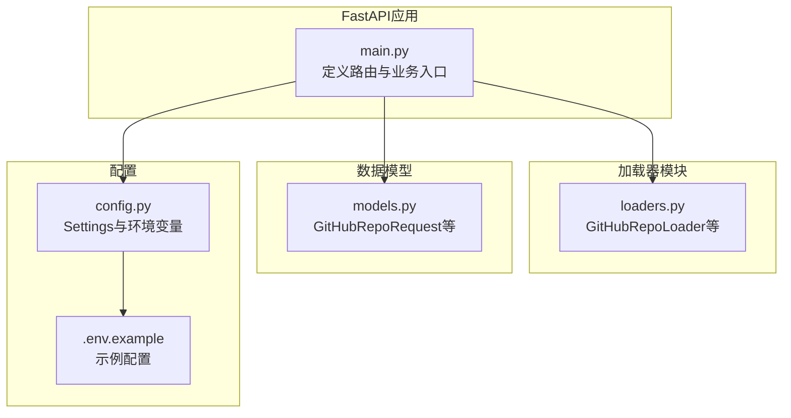
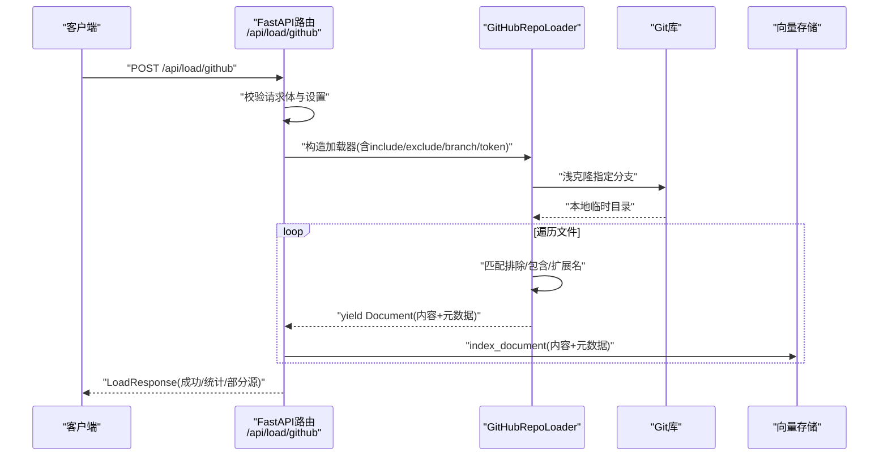
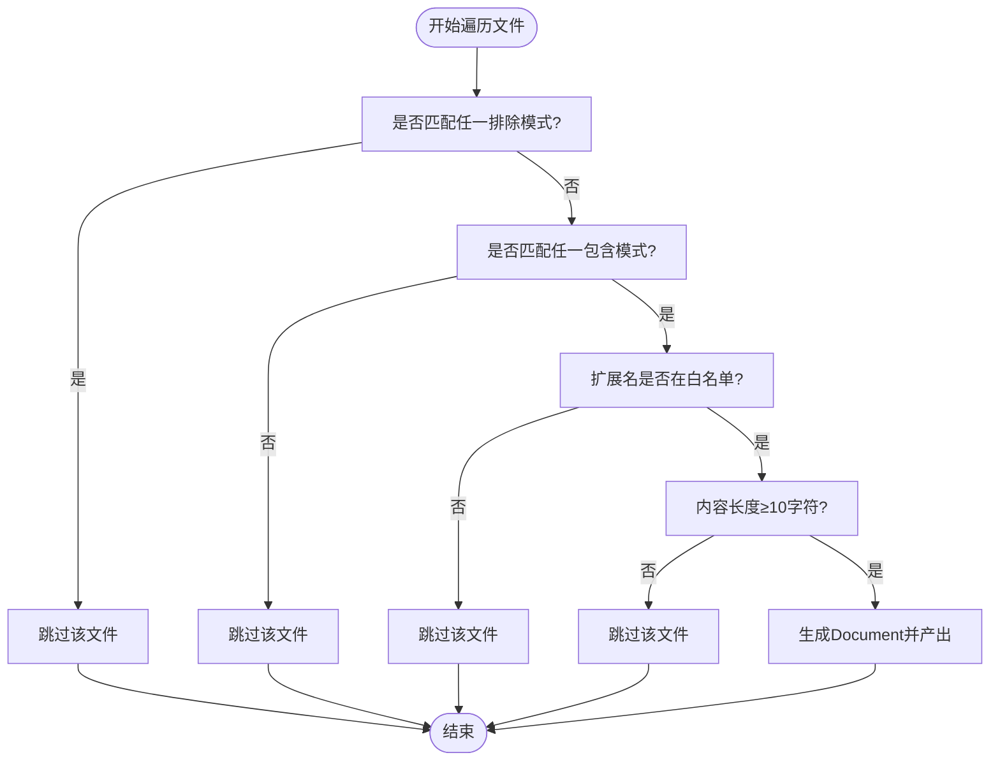
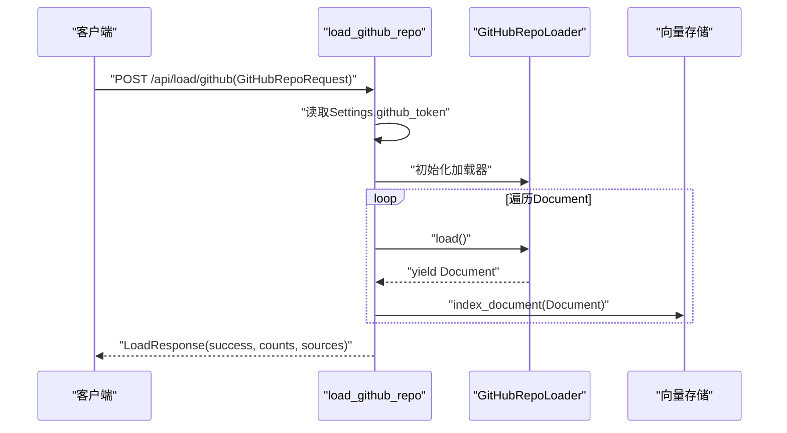
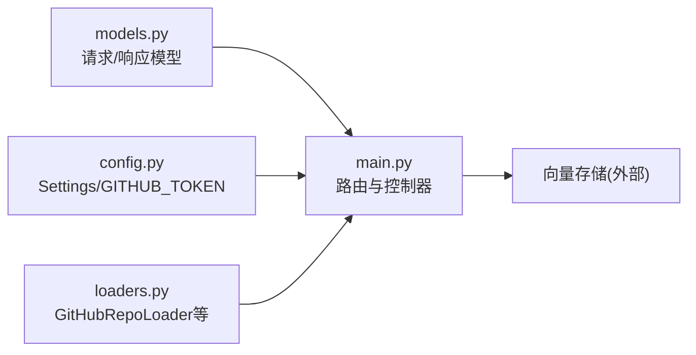

# GitHub仓库加载

<cite>
**本文引用的文件**
- [backend-rag/app/main.py](file://backend-rag/app/main.py)
- [backend-rag/app/loaders.py](file://backend-rag/app/loaders.py)
- [backend-rag/app/models.py](file://backend-rag/app/models.py)
- [backend-rag/app/config.py](file://backend-rag/app/config.py)
- [backend-rag/.env.example](file://backend-rag/.env.example)
</cite>

## 目录
1. [简介](#简介)
2. [项目结构](#项目结构)
3. [核心组件](#核心组件)
4. [架构总览](#架构总览)
5. [详细组件分析](#详细组件分析)
6. [依赖关系分析](#依赖关系分析)
7. [性能考量](#性能考量)
8. [故障排查指南](#故障排查指南)
9. [结论](#结论)
10. [附录](#附录)

## 简介
本文件面向POST /api/load/github端点，提供从请求模型到加载流程、过滤逻辑、认证机制、性能优化与异常处理的完整说明。重点覆盖：
- 请求模型GitHubRepoRequest中repo_url、branch、include_patterns、exclude_patterns的用途与配置方法
- 如何通过github_token实现私有仓库认证
- Git浅克隆（shallow clone）机制及其对性能的影响
- 文件遍历过程中的扩展名与通配符模式过滤逻辑
- 加载特定代码库子集的使用示例
- Document元数据中owner、repo、branch等字段的生成规则
- 克隆失败、权限不足等异常处理策略与最佳实践

## 项目结构
后端RAG服务采用FastAPI框架，GitHub仓库加载能力由独立的加载器模块实现，并通过统一的API入口暴露。

图表来源
- [backend-rag/app/main.py](file://backend-rag/app/main.py#L192-L239)
- [backend-rag/app/loaders.py](file://backend-rag/app/loaders.py#L182-L310)
- [backend-rag/app/models.py](file://backend-rag/app/models.py#L58-L88)
- [backend-rag/app/config.py](file://backend-rag/app/config.py#L6-L22)
- [backend-rag/.env.example](file://backend-rag/.env.example#L1-L28)

章节来源
- [backend-rag/app/main.py](file://backend-rag/app/main.py#L192-L239)
- [backend-rag/app/loaders.py](file://backend-rag/app/loaders.py#L182-L310)
- [backend-rag/app/models.py](file://backend-rag/app/models.py#L58-L88)
- [backend-rag/app/config.py](file://backend-rag/app/config.py#L6-L22)
- [backend-rag/.env.example](file://backend-rag/.env.example#L1-L28)

## 核心组件
- FastAPI路由：POST /api/load/github，负责接收请求、调用加载器、写入向量库并返回结果。
- GitHubRepoLoader：解析URL、浅克隆仓库、按模式与扩展名过滤文件、生成Document对象。
- GitHubRepoRequest：定义请求体字段及默认值。
- Settings：从环境变量读取GITHUB_TOKEN用于私有仓库访问。

章节来源
- [backend-rag/app/main.py](file://backend-rag/app/main.py#L192-L239)
- [backend-rag/app/loaders.py](file://backend-rag/app/loaders.py#L182-L310)
- [backend-rag/app/models.py](file://backend-rag/app/models.py#L58-L88)
- [backend-rag/app/config.py](file://backend-rag/app/config.py#L6-L22)

## 架构总览
下图展示从客户端到加载器再到向量库的整体流程。

图表来源
- [backend-rag/app/main.py](file://backend-rag/app/main.py#L192-L239)
- [backend-rag/app/loaders.py](file://backend-rag/app/loaders.py#L212-L288)
- [backend-rag/app/config.py](file://backend-rag/app/config.py#L20-L22)

## 详细组件分析

### 请求模型：GitHubRepoRequest
- 字段说明
  - repo_url：必填，支持多种格式（HTTPS或SSH），用于解析仓库所有者与名称。
  - branch：可选，默认“main”，指定要克隆的分支。
  - include_patterns：可选，默认“*”，支持通配符，决定哪些文件会被包含。
  - exclude_patterns：可选，默认包含常见构建产物与缓存目录，决定哪些文件会被排除。
- 默认行为
  - include_patterns默认为“*”，即默认包含所有文件。
  - exclude_patterns默认包含node_modules、.git、__pycache__、*.min.js/css、dist/build、.venv/venv等，避免索引无关或大体积文件。

章节来源
- [backend-rag/app/models.py](file://backend-rag/app/models.py#L58-L88)

### 认证与私有仓库：github_token
- 获取方式
  - 从Settings中读取GITHUB_TOKEN环境变量；若未设置则不带令牌进行克隆。
- 使用方式
  - 当存在github_token时，将HTTPS URL替换为“https://<token>@”形式，从而在浅克隆阶段完成认证。
- 安全建议
  - 建议仅授予最小必要权限的个人访问令牌（PAT），并限制其作用域与过期时间。

章节来源
- [backend-rag/app/config.py](file://backend-rag/app/config.py#L20-L22)
- [backend-rag/.env.example](file://backend-rag/.env.example#L11-L12)
- [backend-rag/app/main.py](file://backend-rag/app/main.py#L205-L210)
- [backend-rag/app/loaders.py](file://backend-rag/app/loaders.py#L228-L233)

### 浅克隆（shallow clone）机制与性能影响
- 实现细节
  - 使用depth=1进行浅克隆，仅下载最新提交，不包含历史提交树。
- 性能收益
  - 显著减少网络传输与磁盘占用，缩短克隆时间，适合大规模仓库的快速索引。
- 注意事项
  - 若后续需要历史信息，需调整为完整克隆；当前实现默认浅克隆。

章节来源
- [backend-rag/app/loaders.py](file://backend-rag/app/loaders.py#L236-L241)

### 文件过滤逻辑：扩展名与通配符模式
- 过滤顺序
  1) 排除模式（exclude_patterns）优先，命中即跳过。
  2) 包含模式（include_patterns）次之，未命中则跳过。
  3) 扩展名白名单（CODE_EXTENSIONS）再次，不在白名单则跳过。
  4) 内容长度阈值（至少10个非空白字符）最后，不足则跳过。
- 扩展名白名单
  - 覆盖Python、JavaScript、TypeScript、C/C++、Java、Go、Rust、Ruby、PHP、Swift、Kotlin、Scala、Markdown、纯文本、JSON/YAML/TOML等常用类型。
- 通配符语法
  - 使用fnmatch进行匹配，支持“*”、“?”、“[]”等标准通配符。

图表来源
- [backend-rag/app/loaders.py](file://backend-rag/app/loaders.py#L246-L281)

章节来源
- [backend-rag/app/loaders.py](file://backend-rag/app/loaders.py#L188-L193)
- [backend-rag/app/loaders.py](file://backend-rag/app/loaders.py#L246-L281)

### 文档元数据：owner、repo、branch等字段生成规则
- 生成来源
  - owner、repo：从repo_url解析得到。
  - branch：来自请求参数。
  - file_path：相对路径。
  - extension：文件扩展名。
- 元数据用途
  - 支持检索时按仓库、分支、扩展名等维度筛选与溯源。

章节来源
- [backend-rag/app/loaders.py](file://backend-rag/app/loaders.py#L274-L281)

### API端点：POST /api/load/github
- 请求体：GitHubRepoRequest
- 行为
  - 构造GitHubRepoLoader并执行load()
  - 将每个Document写入向量存储，累计统计文档数与分块数
  - 返回LoadResponse，其中sources最多返回前20条
- 错误处理
  - 捕获异常并记录日志，向上抛出HTTP 500错误

图表来源
- [backend-rag/app/main.py](file://backend-rag/app/main.py#L192-L239)
- [backend-rag/app/loaders.py](file://backend-rag/app/loaders.py#L212-L288)

章节来源
- [backend-rag/app/main.py](file://backend-rag/app/main.py#L192-L239)

## 依赖关系分析
- 组件耦合
  - main.py依赖models.py定义的请求模型与响应模型，依赖loaders.py实现具体加载逻辑，依赖config.py读取配置。
  - loaders.py内部依赖git与fnmatch进行克隆与匹配，输出Document供上层使用。
- 外部依赖
  - GitPython用于浅克隆
  - fnmatch用于通配符匹配
  - httpx/BeautifulSoup/Playwright用于网页加载（与GitHub加载同属加载器体系）

图表来源
- [backend-rag/app/main.py](file://backend-rag/app/main.py#L1-L343)
- [backend-rag/app/models.py](file://backend-rag/app/models.py#L1-L88)
- [backend-rag/app/config.py](file://backend-rag/app/config.py#L6-L22)
- [backend-rag/app/loaders.py](file://backend-rag/app/loaders.py#L1-L462)

章节来源
- [backend-rag/app/main.py](file://backend-rag/app/main.py#L1-L343)
- [backend-rag/app/models.py](file://backend-rag/app/models.py#L1-L88)
- [backend-rag/app/config.py](file://backend-rag/app/config.py#L6-L22)
- [backend-rag/app/loaders.py](file://backend-rag/app/loaders.py#L1-L462)

## 性能考量
- 浅克隆（depth=1）
  - 显著降低网络与磁盘开销，适合快速索引；如需完整历史请调整实现。
- 过滤策略
  - 通过exclude_patterns与include_patterns在源头减少IO与编码负担。
  - 扩展名白名单缩小扫描范围，避免二进制或大体积文件。
- 内容长度阈值
  - 忽略极短内容，减少无效分块与向量库压力。
- 建议
  - 对大型仓库，优先使用精确的include/exclude模式，避免“/**”这类宽泛匹配导致的遍历成本。
  - 合理设置branch，避免不必要的主干分支历史。

[本节为通用性能建议，无需列出章节来源]

## 故障排查指南
- 克隆失败
  - 现象：日志记录“Failed to clone repository”
  - 可能原因：网络超时、URL格式错误、无权限访问、分支不存在
  - 处理建议：检查repo_url格式、确认分支存在、验证GITHUB_TOKEN权限、重试或改为完整克隆
- 权限不足
  - 现象：私有仓库无法克隆或返回403/401
  - 处理建议：确保GITHUB_TOKEN有效且具备访问私有仓库权限；令牌有效期与作用域需正确配置
- URL格式错误
  - 现象：日志记录“Invalid GitHub URL”
  - 处理建议：使用标准HTTPS或SSH格式，例如https://github.com/<owner>/<repo>或git@github.com:<owner>/<repo>.git
- 文件读取异常
  - 现象：日志警告“Failed to read <path>”
  - 处理建议：检查文件编码、权限与大小；当前实现忽略读取异常并继续处理其他文件
- 异常传播
  - 所有加载器异常均被上层捕获并转换为HTTP 500错误，便于客户端识别服务端问题

章节来源
- [backend-rag/app/loaders.py](file://backend-rag/app/loaders.py#L218-L221)
- [backend-rag/app/loaders.py](file://backend-rag/app/loaders.py#L286-L288)
- [backend-rag/app/loaders.py](file://backend-rag/app/loaders.py#L283-L285)
- [backend-rag/app/main.py](file://backend-rag/app/main.py#L236-L239)

## 结论
POST /api/load/github端点通过浅克隆与多层过滤策略，实现了对GitHub仓库的高效索引。借助include/exclude模式与扩展名白名单，可在保证覆盖率的同时显著降低资源消耗。通过GITHUB_TOKEN支持私有仓库访问；遇到克隆失败或权限问题时，应优先检查URL格式、令牌有效性与网络连通性。建议结合仓库规模与索引目标，精细化配置过滤模式以提升索引效率与检索质量。

[本节为总结性内容，无需列出章节来源]

## 附录

### 使用示例（概念性说明）
- 加载主分支全部代码
  - 请求体：repo_url为仓库URL，branch为“main”，include_patterns使用默认“*”，exclude_patterns使用默认排除列表
- 仅加载特定语言文件
  - include_patterns：["*.py", "*.js"]
  - exclude_patterns：保持默认，自动排除node_modules、dist等
- 仅加载某子目录
  - include_patterns：["src/**"]
  - exclude_patterns：["**/test/**"]（排除测试目录）
- 私有仓库
  - 在环境变量中设置GITHUB_TOKEN，或在Settings中提供；加载器会自动注入到克隆URL中

[本节为使用示例说明，无需列出章节来源]