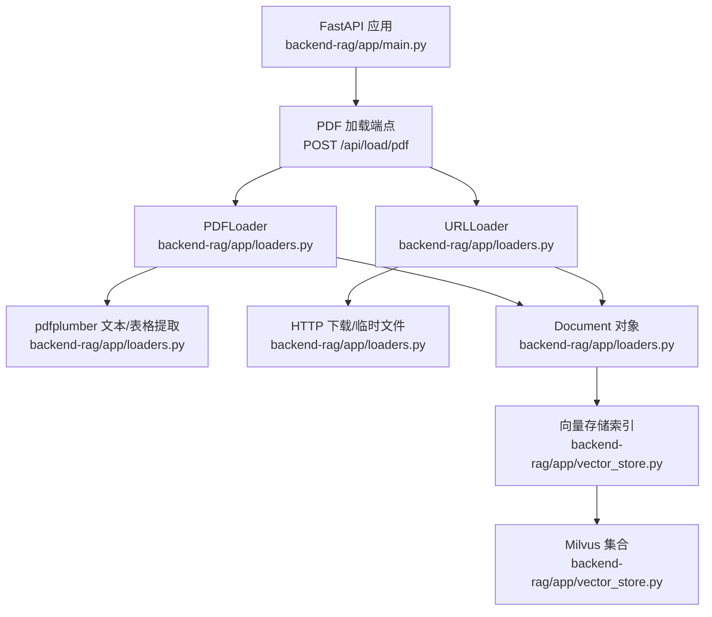
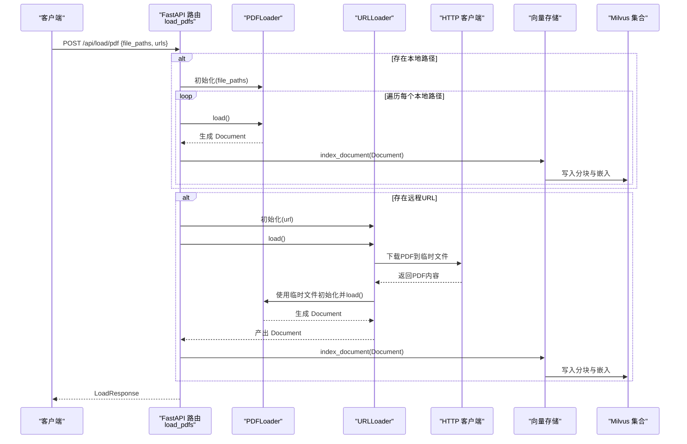
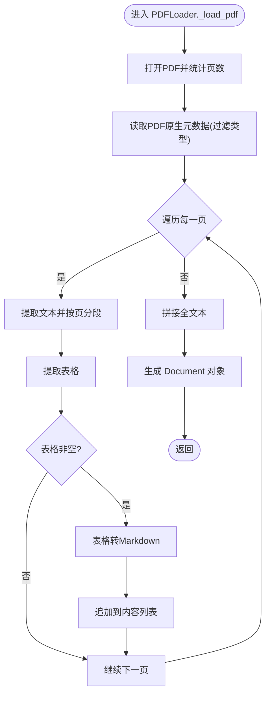
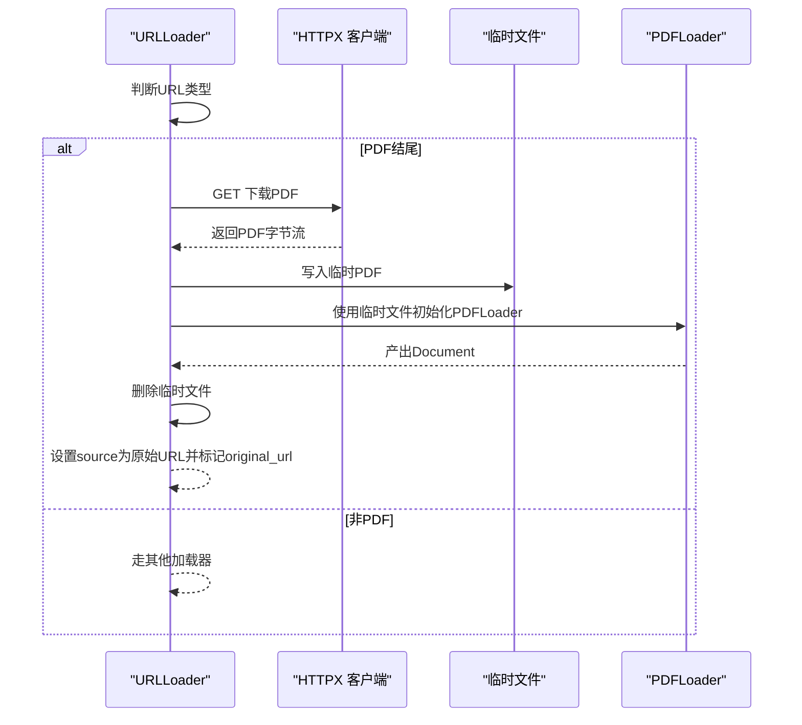
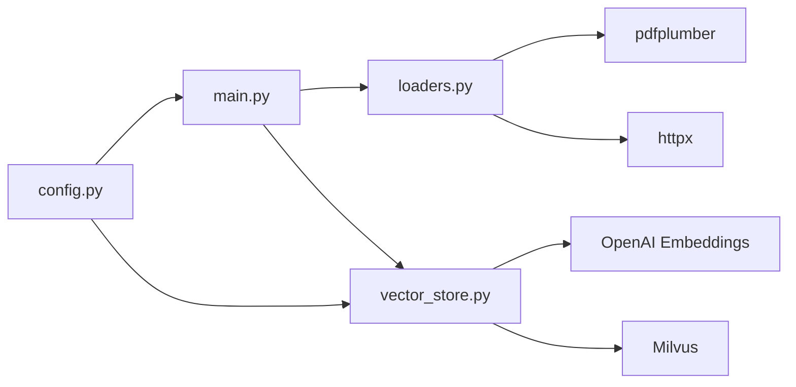

# PDF文件加载

<cite>
**本文引用的文件**
- [main.py](file://backend-rag/app/main.py)
- [models.py](file://backend-rag/app/models.py)
- [loaders.py](file://backend-rag/app/loaders.py)
- [vector_store.py](file://backend-rag/app/vector_store.py)
- [config.py](file://backend-rag/app/config.py)
- [pyproject.toml](file://backend-rag/pyproject.toml)
</cite>

## 目录
1. [简介](#简介)
2. [项目结构](#项目结构)
3. [核心组件](#核心组件)
4. [架构总览](#架构总览)
5. [详细组件分析](#详细组件分析)
6. [依赖关系分析](#依赖关系分析)
7. [性能考量](#性能考量)
8. [故障排查指南](#故障排查指南)
9. [结论](#结论)
10. [附录](#附录)

## 简介
本文件为 POST /api/load/pdf 端点的详细API文档，聚焦以下目标：
- 解释 PDFLoadRequest 请求模型中 file_paths 与 urls 两个参数的使用场景，说明如何同时加载本地与远程PDF文件。
- 阐述 pdfplumber 在文本与表格提取中的应用，特别是表格转Markdown的格式化逻辑。
- 描述元数据提取机制（页数统计与PDF原生属性保留策略）。
- 提供处理大型PDF或多页文档的最佳实践，指出内存消耗风险与应对措施。
- 涵盖文件不存在、下载失败或解析错误的异常处理，并建议对扫描件启用OCR的扩展方案。

## 项目结构
后端RAG服务采用FastAPI作为入口，PDF加载能力由独立的加载器模块提供，并通过统一的向量存储进行索引。与PDF加载直接相关的关键文件如下：
- 后端入口与路由：backend-rag/app/main.py
- 请求/响应模型定义：backend-rag/app/models.py
- 加载器实现（PDF/Web/GitHub/URL自动检测）：backend-rag/app/loaders.py
- 向量存储与分块索引：backend-rag/app/vector_store.py
- 应用配置与环境变量：backend-rag/app/config.py
- 依赖声明（含pdfplumber等）：backend-rag/pyproject.toml

图表来源
- [main.py](file://backend-rag/app/main.py#L241-L296)
- [loaders.py](file://backend-rag/app/loaders.py#L312-L462)
- [vector_store.py](file://backend-rag/app/vector_store.py#L241-L288)

章节来源
- [main.py](file://backend-rag/app/main.py#L241-L296)
- [loaders.py](file://backend-rag/app/loaders.py#L312-L462)
- [vector_store.py](file://backend-rag/app/vector_store.py#L241-L288)

## 核心组件
- PDFLoadRequest：包含 file_paths 与 urls 两个字段，分别用于本地PDF路径列表与远程PDF URL列表。
- PDFLoader：负责从本地PDF文件中提取文本与表格，并生成Document对象；支持可选的OCR参数（见“扩展方案”）。
- URLLoader：自动识别URL类型，当为PDF时先下载到临时文件再交由PDFLoader处理。
- 向量存储：将每个Document按分块策略生成嵌入并写入Milvus集合，便于后续检索。

章节来源
- [models.py](file://backend-rag/app/models.py#L69-L87)
- [loaders.py](file://backend-rag/app/loaders.py#L312-L462)
- [vector_store.py](file://backend-rag/app/vector_store.py#L241-L288)

## 架构总览
POST /api/load/pdf 的调用流程如下：
- 接收请求体（PDFLoadRequest），分别处理本地与远程PDF。
- 本地PDF：直接实例化PDFLoader并逐个加载。
- 远程PDF：实例化URLLoader，自动识别为PDF后下载至临时文件，再由PDFLoader加载。
- 将每个Document交由向量存储进行分块与嵌入索引。

图表来源
- [main.py](file://backend-rag/app/main.py#L241-L296)
- [loaders.py](file://backend-rag/app/loaders.py#L312-L462)
- [vector_store.py](file://backend-rag/app/vector_store.py#L241-L288)

## 详细组件分析

### PDFLoadRequest 请求模型
- 字段说明
  - file_paths: 本地PDF文件路径数组。若为空则跳过本地加载。
  - urls: 远程PDF URL数组。若为空则跳过远程加载。
- 使用场景
  - 同时传入两者可实现“本地+远程”混合加载。
  - 仅传入 file_paths 可离线批量加载本地PDF。
  - 仅传入 urls 可在线批量下载并加载PDF。

章节来源
- [models.py](file://backend-rag/app/models.py#L69-L73)

### PDFLoader 文本与表格提取
- 文本提取
  - 打开PDF后统计页数并记录到元数据。
  - 遍历每一页，提取纯文本并按“页标题”分段拼接。
- 表格提取
  - 使用页面级表格提取接口获取二维表结构。
  - 将表格转换为Markdown格式字符串，追加到内容末尾。
- 元数据保留
  - 基础元数据：文件路径、文件名、页数。
  - PDF原生元数据：仅保留字符串/整数/浮点类型的键值对，避免不可序列化字段。
- 输出
  - 生成一个Document对象，包含content、source、source_type、title与metadata。

图表来源
- [loaders.py](file://backend-rag/app/loaders.py#L340-L402)

章节来源
- [loaders.py](file://backend-rag/app/loaders.py#L340-L402)

### URLLoader 远程PDF下载与处理
- 类型识别
  - 若URL包含github.com且为仓库根，则走GitHub加载分支。
  - 若URL以.pdf结尾，则走远程PDF下载分支。
  - 其他情况走网页加载分支。
- 远程PDF下载
  - 使用HTTP客户端下载PDF到临时文件，确保跟随重定向与超时控制。
  - 交由PDFLoader加载，完成后删除临时文件。
  - 设置Document的source为原始URL，并在metadata中标记 original_url。

图表来源
- [loaders.py](file://backend-rag/app/loaders.py#L420-L462)

章节来源
- [loaders.py](file://backend-rag/app/loaders.py#L420-L462)

### 向量存储索引与分块
- 分块策略
  - 将Document内容按最大长度与重叠策略进行切分，优先在段落或句号处断开，保证语义完整性。
- 嵌入与写入
  - 使用OpenAI嵌入模型生成向量，写入Milvus集合（全局集合global_documents）。
  - 记录source、source_type、title与chunk_index等字段，便于后续检索与溯源。
- 返回值
  - index_document返回该Document被切分为多少个分块，便于上层统计。

章节来源
- [vector_store.py](file://backend-rag/app/vector_store.py#L241-L322)
- [vector_store.py](file://backend-rag/app/vector_store.py#L323-L376)

### 端点行为与错误处理
- 成功路径
  - 本地与远程PDF均成功加载并索引，返回LoadResponse，包含成功标志、消息、已加载文档数、创建分块数与来源列表。
- 异常处理
  - 本地文件不存在：记录警告并跳过该路径。
  - 远程下载失败：记录错误并抛出HTTP 500。
  - PDF解析异常：记录错误并继续处理其他文档。
  - 其他未捕获异常：统一记录日志并返回HTTP 500。

章节来源
- [main.py](file://backend-rag/app/main.py#L241-L296)
- [loaders.py](file://backend-rag/app/loaders.py#L328-L342)
- [loaders.py](file://backend-rag/app/loaders.py#L445-L462)

## 依赖关系分析
- FastAPI路由依赖加载器与向量存储。
- 加载器依赖pdfplumber进行PDF解析，依赖httpx进行远程下载。
- 向量存储依赖Milvus与OpenAI嵌入模型。
- 配置通过环境变量注入，影响嵌入模型、Milvus连接与分块策略。

图表来源
- [main.py](file://backend-rag/app/main.py#L1-L60)
- [loaders.py](file://backend-rag/app/loaders.py#L1-L40)
- [vector_store.py](file://backend-rag/app/vector_store.py#L1-L40)
- [config.py](file://backend-rag/app/config.py#L1-L51)
- [pyproject.toml](file://backend-rag/pyproject.toml#L1-L40)

章节来源
- [pyproject.toml](file://backend-rag/pyproject.toml#L1-L40)

## 性能考量
- 大型PDF与多页文档
  - PDFLoader按页提取文本与表格，内存占用主要取决于PDF页数与表格复杂度。
  - 建议：限制单次请求的urls数量与file_paths数量；对超大PDF分批处理。
- 分块策略
  - 向量存储默认最大分块长度与重叠长度可通过环境变量配置，适当增大可提升召回但增加嵌入计算与存储成本。
- 并发与资源
  - FastAPI默认基于异步IO；如需并发下载远程PDF，可在上层调用时并行发起请求，但注意服务器资源上限。
- 临时文件管理
  - 远程PDF下载使用临时文件并在完成后删除，避免磁盘泄漏；请确保系统有足够磁盘空间。

章节来源
- [vector_store.py](file://backend-rag/app/vector_store.py#L289-L322)
- [config.py](file://backend-rag/app/config.py#L35-L40)
- [loaders.py](file://backend-rag/app/loaders.py#L445-L462)

## 故障排查指南
- 文件不存在
  - 现象：本地路径不存在时记录警告并跳过。
  - 处理：检查file_paths是否正确，确认文件权限与路径大小写。
- 下载失败
  - 现象：远程PDF下载抛出HTTP异常并返回500。
  - 处理：检查网络连通性、URL有效性、重定向与超时设置；必要时添加代理或调整超时。
- 解析错误
  - 现象：PDF解析异常会记录错误并继续处理其他文档。
  - 处理：尝试使用不同PDF版本或修复损坏文件；对扫描件启用OCR（见“扩展方案”）。
- 索引失败
  - 现象：Milvus连接或写入异常。
  - 处理：检查Milvus服务状态、认证信息与网络；确认集合存在且索引已建立。

章节来源
- [loaders.py](file://backend-rag/app/loaders.py#L328-L342)
- [loaders.py](file://backend-rag/app/loaders.py#L445-L462)
- [vector_store.py](file://backend-rag/app/vector_store.py#L448-L457)

## 结论
POST /api/load/pdf 提供了灵活的本地与远程PDF加载能力，结合pdfplumber的文本与表格提取、以及向量存储的分块索引，能够快速构建面向PDF的语义检索服务。通过合理的分块策略与资源控制，可在保证性能的同时处理大规模文档。对于扫描件等非文本PDF，建议扩展OCR能力以提升可用性。

## 附录

### API定义与示例
- 端点：POST /api/load/pdf
- 请求体：PDFLoadRequest
  - file_paths: 本地PDF文件路径数组（可选）
  - urls: 远程PDF URL数组（可选）
- 响应体：LoadResponse
  - success: 布尔值
  - message: 描述性信息
  - documents_loaded: 已加载文档数
  - chunks_created: 创建分块总数
  - sources: 来源列表（最多展示部分）

章节来源
- [models.py](file://backend-rag/app/models.py#L69-L87)
- [main.py](file://backend-rag/app/main.py#L241-L296)

### 扩展方案：扫描件OCR
- 当前实现
  - PDFLoader构造函数支持 use_ocr 参数，但当前加载流程未显式启用。
- 建议实现
  - 在PDFLoader内部，当检测到PDF为扫描版（例如无可提取文本或表格稀疏）时，可调用OCR后将结果合并回内容。
  - 可引入OCR库（如第三方OCR服务或本地OCR引擎），并将OCR输出转换为可检索的文本与表格Markdown。
- 注意事项
  - OCR会显著增加处理时间与资源消耗，建议按需启用并设置超时与重试策略。
  - 对于图像质量较差的扫描件，建议预处理（去噪、二值化）后再OCR。

章节来源
- [loaders.py](file://backend-rag/app/loaders.py#L318-L327)