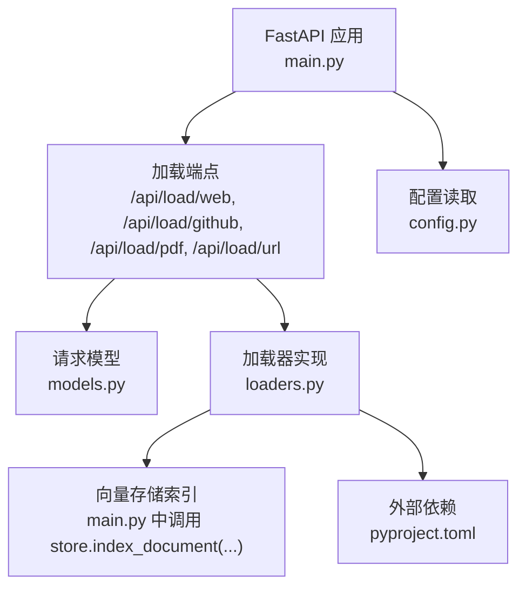
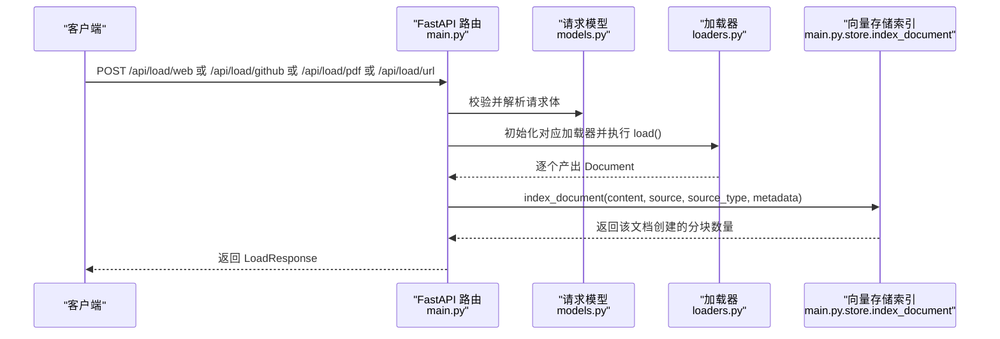
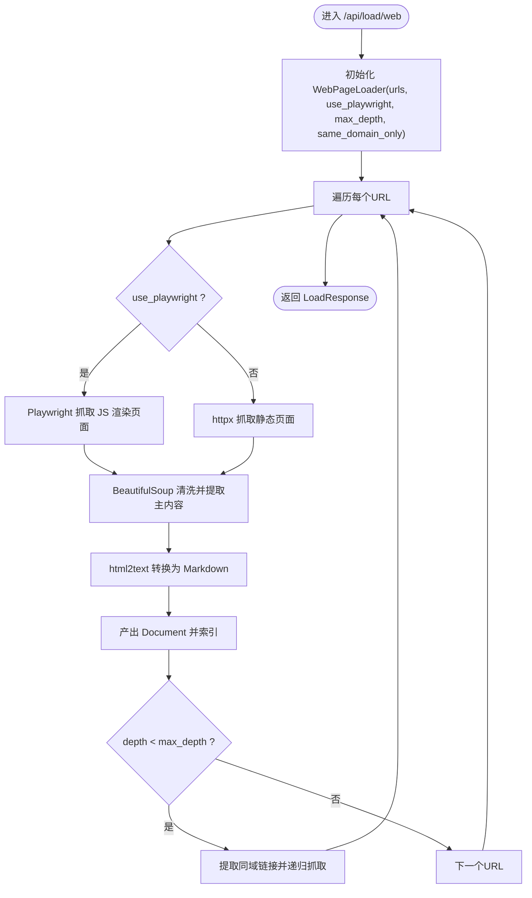
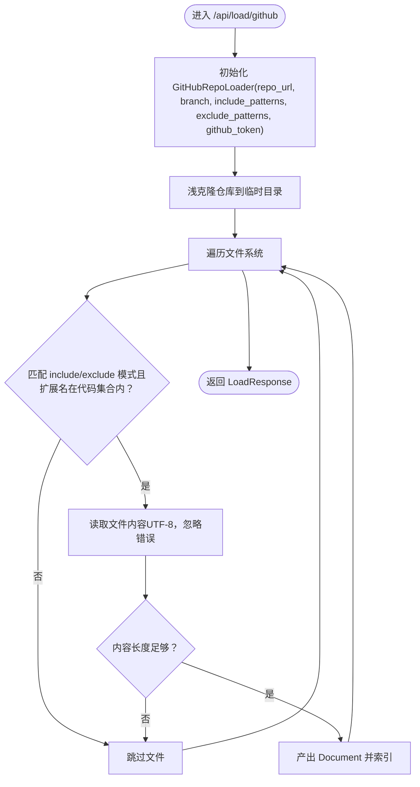
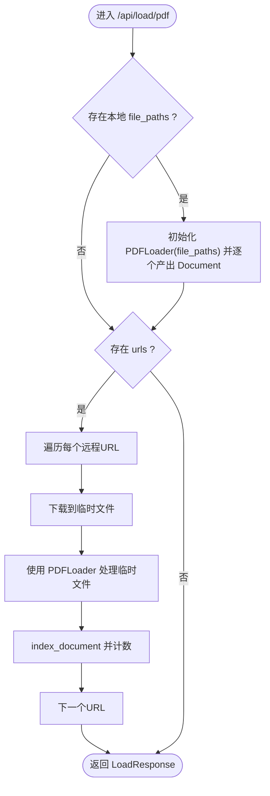
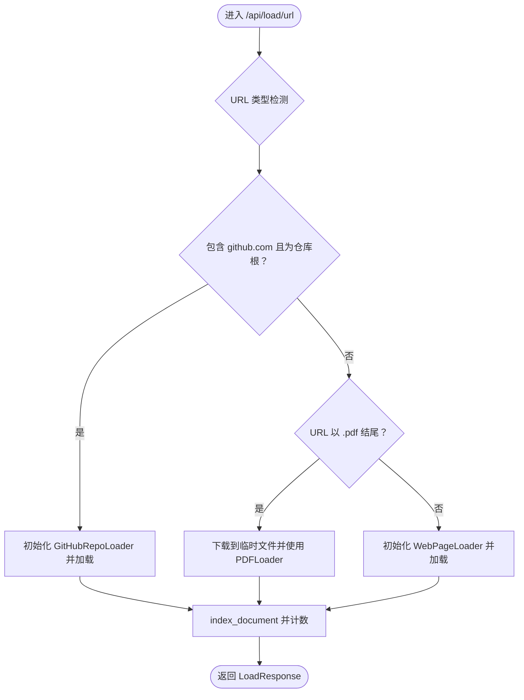
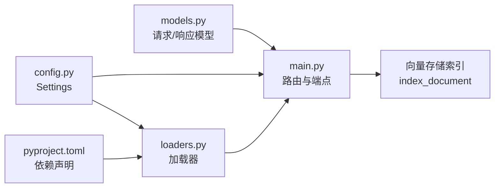

# 加载端点

<cite>
**本文引用的文件**
- [main.py](file://backend-rag/app/main.py)
- [models.py](file://backend-rag/app/models.py)
- [loaders.py](file://backend-rag/app/loaders.py)
- [config.py](file://backend-rag/app/config.py)
- [pyproject.toml](file://backend-rag/pyproject.toml)
</cite>

## 目录
1. [简介](#简介)
2. [项目结构](#项目结构)
3. [核心组件](#核心组件)
4. [架构总览](#架构总览)
5. [详细组件分析](#详细组件分析)
6. [依赖关系分析](#依赖关系分析)
7. [性能考量](#性能考量)
8. [故障排查指南](#故障排查指南)
9. [结论](#结论)
10. [附录](#附录)

## 简介
本文件面向数据加载相关API端点的综合文档，覆盖以下四个端点：
- POST /api/load/web：网页爬取与索引
- POST /api/load/github：GitHub仓库加载与索引
- POST /api/load/pdf：PDF文件加载与索引
- POST /api/load/url：URL自动识别加载（支持网页、GitHub、PDF）

文档将逐一说明各端点的请求模型参数、统一响应结构、典型使用方式、错误处理策略与性能注意事项，并解释URLLoader的自动类型检测机制及Playwright在JavaScript渲染页面抓取中的应用。

## 项目结构
后端RAG服务采用FastAPI框架，加载逻辑集中在Python模块中：
- 路由与端点定义：backend-rag/app/main.py
- 请求/响应模型：backend-rag/app/models.py
- 数据加载器实现：backend-rag/app/loaders.py
- 配置与环境变量：backend-rag/app/config.py
- 依赖声明：backend-rag/pyproject.toml

图表来源
- [main.py](file://backend-rag/app/main.py#L122-L343)
- [models.py](file://backend-rag/app/models.py#L48-L88)
- [loaders.py](file://backend-rag/app/loaders.py#L1-L462)
- [config.py](file://backend-rag/app/config.py#L1-L51)
- [pyproject.toml](file://backend-rag/pyproject.toml#L1-L67)

章节来源
- [main.py](file://backend-rag/app/main.py#L122-L343)
- [models.py](file://backend-rag/app/models.py#L48-L88)
- [loaders.py](file://backend-rag/app/loaders.py#L1-L462)
- [config.py](file://backend-rag/app/config.py#L1-L51)
- [pyproject.toml](file://backend-rag/pyproject.toml#L1-L67)

## 核心组件
- 请求模型
  - WebCrawlRequest：用于网页爬取请求，包含urls、max_depth、use_playwright、same_domain_only等字段。
  - GitHubRepoRequest：用于GitHub仓库加载请求，包含repo_url、branch、include_patterns、exclude_patterns等字段。
  - PDFLoadRequest：用于PDF加载请求，包含file_paths、urls两个列表字段。
  - URLLoadRequest：用于URL自动识别加载请求，包含url、use_playwright字段。
- 统一响应结构
  - LoadResponse：包含success、message、documents_loaded、chunks_created、sources字段，用于所有加载端点的统一返回。
- 加载器
  - WebPageLoader：支持静态HTML与JavaScript渲染页面（Playwright），可按深度爬取并提取主内容。
  - GitHubRepoLoader：浅克隆仓库，按模式过滤文件，仅索引常见代码扩展名。
  - PDFLoader：从本地或远程PDF提取文本与表格，生成结构化内容。
  - URLLoader：根据URL自动判断类型（GitHub仓库、PDF、网页），并选择对应加载器。

章节来源
- [models.py](file://backend-rag/app/models.py#L48-L88)
- [loaders.py](file://backend-rag/app/loaders.py#L40-L462)
- [main.py](file://backend-rag/app/main.py#L143-L343)

## 架构总览
下图展示四个加载端点的调用流程与内部组件交互。

图表来源
- [main.py](file://backend-rag/app/main.py#L143-L343)
- [models.py](file://backend-rag/app/models.py#L48-L88)
- [loaders.py](file://backend-rag/app/loaders.py#L40-L462)

## 详细组件分析

### Web 爬取：POST /api/load/web
- 功能要点
  - 支持静态HTML与JavaScript渲染页面（通过Playwright）
  - 可按max_depth控制爬取深度；same_domain_only限制同域链接
  - 将HTML转换为干净的Markdown后进行索引
- 关键参数
  - urls：要爬取的URL列表
  - max_depth：最大爬取深度（0表示单页）
  - use_playwright：是否启用Playwright抓取JS渲染页面
  - same_domain_only：是否仅限同域链接
- 使用示例
  - 单页抓取：将max_depth设为0，same_domain_only设为true
  - 多页抓取：设置合理的max_depth（如1或2），并开启use_playwright以处理动态内容
- 错误处理
  - 单个URL失败不会中断整体流程，记录警告日志并继续下一个URL
- 性能建议
  - 合理设置max_depth，避免无界爬取导致资源消耗过大
  - 对于大量URL，建议分批提交
  - 开启use_playwright会显著增加资源占用，仅在必要时启用

图表来源
- [main.py](file://backend-rag/app/main.py#L143-L186)
- [loaders.py](file://backend-rag/app/loaders.py#L40-L170)

章节来源
- [main.py](file://backend-rag/app/main.py#L143-L186)
- [models.py](file://backend-rag/app/models.py#L50-L56)
- [loaders.py](file://backend-rag/app/loaders.py#L40-L170)

### GitHub 仓库：POST /api/load/github
- 功能要点
  - 浅克隆指定分支的仓库（提升速度）
  - 基于include/exclude模式过滤文件，仅索引常见代码扩展名
  - 支持私有仓库（通过配置的GITHUB_TOKEN）
- 关键参数
  - repo_url：GitHub仓库URL（支持多种格式）
  - branch：目标分支，默认main
  - include_patterns：包含模式，默认匹配全部
  - exclude_patterns：排除模式，默认忽略常见目录与压缩文件
- 使用示例
  - 私有仓库：确保设置GITHUB_TOKEN环境变量
  - 指定分支：如需加载develop分支，设置branch为develop
  - 过滤特定文件：通过include/exclude模式仅索引所需文件
- 错误处理
  - URL无效或无法克隆时记录错误日志并跳过
  - 文件读取异常会记录警告并继续
- 性能建议
  - 使用浅克隆减少网络与磁盘开销
  - 合理设置exclude_patterns，避免索引无关文件

图表来源
- [main.py](file://backend-rag/app/main.py#L192-L239)
- [loaders.py](file://backend-rag/app/loaders.py#L182-L310)
- [config.py](file://backend-rag/app/config.py#L20-L22)

章节来源
- [main.py](file://backend-rag/app/main.py#L192-L239)
- [models.py](file://backend-rag/app/models.py#L58-L67)
- [loaders.py](file://backend-rag/app/loaders.py#L182-L310)
- [config.py](file://backend-rag/app/config.py#L20-L22)

### PDF 加载：POST /api/load/pdf
- 功能要点
  - 支持本地PDF文件与远程PDF URL
  - 提取每页文本与表格，保留结构信息
  - 将PDF元数据写入Document.metadata
- 关键参数
  - file_paths：本地PDF文件路径列表
  - urls：远程PDF URL列表
- 使用示例
  - 本地文件：提供file_paths数组
  - 远程文件：提供urls数组，内部将先下载到临时文件再处理
- 错误处理
  - 文件不存在或无法读取时记录警告并跳过
  - 下载远程PDF失败时记录错误并继续其他URL
- 性能建议
  - 大型PDF可能耗时较长，建议分批处理
  - 远程PDF下载超时时间已设置，可根据网络状况调整

图表来源
- [main.py](file://backend-rag/app/main.py#L241-L296)
- [loaders.py](file://backend-rag/app/loaders.py#L312-L402)
- [loaders.py](file://backend-rag/app/loaders.py#L445-L462)

章节来源
- [main.py](file://backend-rag/app/main.py#L241-L296)
- [models.py](file://backend-rag/app/models.py#L69-L73)
- [loaders.py](file://backend-rag/app/loaders.py#L312-L402)
- [loaders.py](file://backend-rag/app/loaders.py#L445-L462)

### URL 自动识别：POST /api/load/url
- 功能要点
  - 自动识别URL类型：GitHub仓库、PDF、网页
  - 对应使用GitHubRepoLoader、PDFLoader或WebPageLoader
  - 支持use_playwright以处理JS渲染页面
- 关键参数
  - url：待加载的URL
  - use_playwright：是否启用Playwright
- 类型检测机制
  - 若URL包含github.com且指向仓库根（非文件），则视为GitHub仓库
  - 若URL以.pdf结尾，则视为PDF并先行下载
  - 其他情况视为网页
- 使用示例
  - GitHub仓库：直接传入仓库根URL
  - PDF：传入PDF URL
  - 网页：传入普通网页URL，必要时开启use_playwright
- 错误处理
  - 类型判断失败或加载异常时记录错误并返回统一错误响应
- 性能建议
  - 对于动态网站，优先开启use_playwright但注意资源消耗
  - PDF下载与解析可能较慢，建议分批提交

图表来源
- [main.py](file://backend-rag/app/main.py#L298-L343)
- [loaders.py](file://backend-rag/app/loaders.py#L404-L462)

章节来源
- [main.py](file://backend-rag/app/main.py#L298-L343)
- [models.py](file://backend-rag/app/models.py#L75-L79)
- [loaders.py](file://backend-rag/app/loaders.py#L404-L462)

## 依赖关系分析
- 端点到模型
  - 四个加载端点均使用对应的请求模型进行参数校验与解析
- 端点到加载器
  - Web端点使用WebPageLoader
  - GitHub端点使用GitHubRepoLoader
  - PDF端点使用PDFLoader（本地）与URLLoader（远程）
  - URL端点使用URLLoader
- 加载器到存储
  - 所有加载器产出的Document都会调用store.index_document进行索引
- 配置依赖
  - GitHub私有仓库加载依赖GITHUB_TOKEN
  - 向量存储连接信息来自配置（Milvus）

图表来源
- [models.py](file://backend-rag/app/models.py#L48-L88)
- [main.py](file://backend-rag/app/main.py#L122-L343)
- [loaders.py](file://backend-rag/app/loaders.py#L1-L462)
- [config.py](file://backend-rag/app/config.py#L1-L51)
- [pyproject.toml](file://backend-rag/pyproject.toml#L1-L67)

章节来源
- [models.py](file://backend-rag/app/models.py#L48-L88)
- [main.py](file://backend-rag/app/main.py#L122-L343)
- [loaders.py](file://backend-rag/app/loaders.py#L1-L462)
- [config.py](file://backend-rag/app/config.py#L1-L51)
- [pyproject.toml](file://backend-rag/pyproject.toml#L1-L67)

## 性能考量
- 爬取与渲染
  - WebPageLoader在use_playwright开启时会启动Chromium浏览器实例，资源消耗较高，建议仅对必须的动态页面启用
  - 控制max_depth与same_domain_only可有效降低带宽与CPU消耗
- 仓库加载
  - 使用浅克隆（depth=1）显著减少网络与磁盘IO
  - 合理设置include/exclude模式，避免扫描无关目录
- PDF处理
  - 大PDF文件解析耗时长，建议分批处理
  - 远程PDF下载超时已设置，可根据网络状况调整
- 存储索引
  - index_document会将内容切分为固定大小的块并建立嵌入，注意内存与磁盘空间
  - 可通过配置项调整分块大小与重叠长度

[本节为通用性能建议，不直接分析具体文件]

## 故障排查指南
- 常见错误与定位
  - 网页抓取失败：检查URL有效性、网络连通性、是否需要use_playwright
  - GitHub加载失败：确认GITHUB_TOKEN配置正确，仓库URL格式是否被支持
  - PDF加载失败：确认本地文件存在或远程URL可达，下载超时或解析异常
  - URL自动识别失败：确认URL格式与类型，必要时直接使用专用端点
- 日志与返回
  - 端点捕获异常并返回HTTP 500，同时记录详细错误日志
  - LoadResponse包含documents_loaded与chunks_created，便于评估处理结果
- 环境与依赖
  - 确认依赖安装完整（Playwright、GitPython、pdfplumber等）
  - 确认Milvus连接信息与向量存储可用

章节来源
- [main.py](file://backend-rag/app/main.py#L143-L343)
- [loaders.py](file://backend-rag/app/loaders.py#L106-L146)
- [loaders.py](file://backend-rag/app/loaders.py#L212-L288)
- [loaders.py](file://backend-rag/app/loaders.py#L328-L402)
- [loaders.py](file://backend-rag/app/loaders.py#L419-L462)
- [pyproject.toml](file://backend-rag/pyproject.toml#L1-L67)

## 结论
本文件系统梳理了四个数据加载端点的功能、参数、响应结构与实现要点，并结合加载器的内部机制解释了URL自动识别与Playwright的应用场景。通过合理配置参数与遵循性能建议，可在保证质量的同时高效完成网页、GitHub仓库与PDF的加载与索引。

[本节为总结性内容，不直接分析具体文件]

## 附录

### 请求模型与响应结构一览
- WebCrawlRequest
  - 字段：urls、max_depth、use_playwright、same_domain_only
- GitHubRepoRequest
  - 字段：repo_url、branch、include_patterns、exclude_patterns
- PDFLoadRequest
  - 字段：file_paths、urls
- URLLoadRequest
  - 字段：url、use_playwright
- LoadResponse
  - 字段：success、message、documents_loaded、chunks_created、sources

章节来源
- [models.py](file://backend-rag/app/models.py#L50-L87)

### 端点与加载器映射
- /api/load/web → WebPageLoader
- /api/load/github → GitHubRepoLoader
- /api/load/pdf → PDFLoader（本地）/ URLLoader（远程）
- /api/load/url → URLLoader

章节来源
- [main.py](file://backend-rag/app/main.py#L143-L343)
- [loaders.py](file://backend-rag/app/loaders.py#L40-L462)