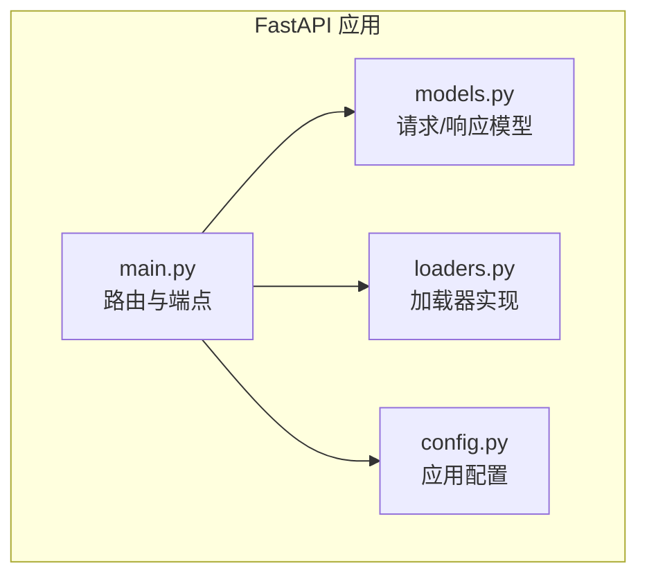
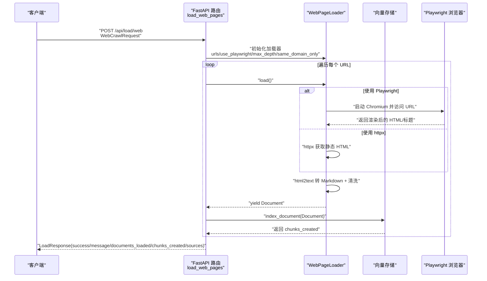
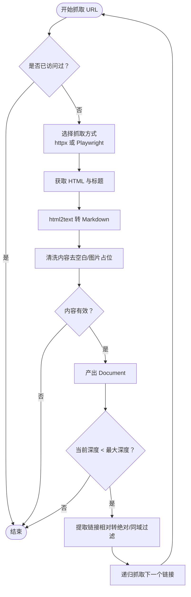
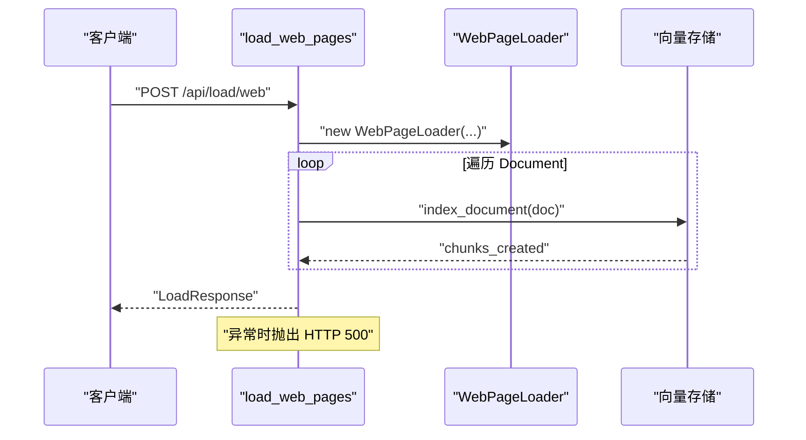
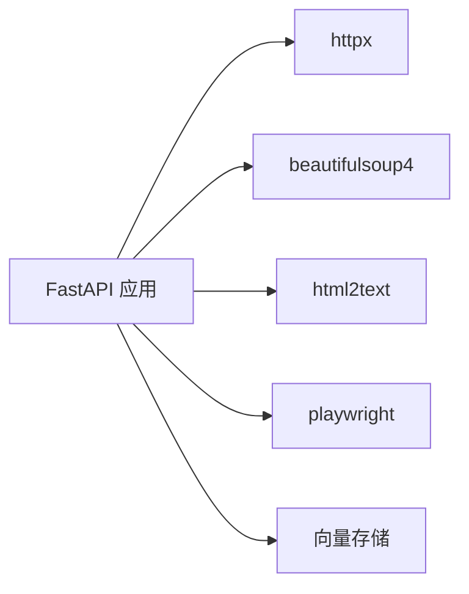

# 网页加载

<cite>
**本文引用的文件**
- [main.py](file://backend-rag/app/main.py)
- [loaders.py](file://backend-rag/app/loaders.py)
- [models.py](file://backend-rag/app/models.py)
- [config.py](file://backend-rag/app/config.py)
- [pyproject.toml](file://backend-rag/pyproject.toml)
</cite>

## 目录
1. [简介](#简介)
2. [项目结构](#项目结构)
3. [核心组件](#核心组件)
4. [架构总览](#架构总览)
5. [详细组件分析](#详细组件分析)
6. [依赖关系分析](#依赖关系分析)
7. [性能考虑](#性能考虑)
8. [故障排查指南](#故障排查指南)
9. [结论](#结论)

## 简介
本文件为 POST /api/load/web 端点的详细 API 文档，面向前端与集成开发者，解释 WebCrawlRequest 请求模型中 urls、max_depth、use_playwright、same_domain_only 参数的作用与配置方式；说明 LoadResponse 统一响应结构的字段含义；提供使用 Playwright 抓取 JavaScript 渲染页面的实践示例；阐述爬取深度与同域限制的使用场景；并描述 HTML 到 Markdown 的转换流程（html2text）及内容清洗策略；最后覆盖错误处理机制与性能优化建议。

## 项目结构
后端采用 Python FastAPI 应用，提供多类数据加载端点，其中 /api/load/web 负责抓取网页并索引。网页抓取由 WebPageLoader 实现，支持静态 HTML 与 JavaScript 渲染页面（通过 Playwright），并可按深度爬取链接，最终将 HTML 转换为 Markdown 并写入向量数据库。

图表来源
- [main.py](file://backend-rag/app/main.py#L143-L185)
- [models.py](file://backend-rag/app/models.py#L50-L87)
- [loaders.py](file://backend-rag/app/loaders.py#L40-L179)
- [config.py](file://backend-rag/app/config.py#L1-L51)

章节来源
- [main.py](file://backend-rag/app/main.py#L143-L185)
- [pyproject.toml](file://backend-rag/pyproject.toml#L1-L38)

## 核心组件
- WebCrawlRequest：定义网页抓取请求参数，包含 urls、max_depth、use_playwright、same_domain_only。
- LoadResponse：统一的加载响应结构，包含 success、message、documents_loaded、chunks_created、sources。
- WebPageLoader：负责抓取网页、提取链接、HTML 到 Markdown 转换、内容清洗与递归爬取。
- FastAPI 路由：/api/load/web 接收 WebCrawlRequest，调用 WebPageLoader 并返回 LoadResponse。

章节来源
- [models.py](file://backend-rag/app/models.py#L50-L87)
- [loaders.py](file://backend-rag/app/loaders.py#L40-L179)
- [main.py](file://backend-rag/app/main.py#L143-L185)

## 架构总览
POST /api/load/web 的调用链路如下：
- 客户端发送 WebCrawlRequest 至 /api/load/web
- FastAPI 路由解析请求，构造 WebPageLoader
- WebPageLoader 逐个抓取 URL，必要时使用 Playwright 渲染 JS
- 将 HTML 转换为 Markdown 并清洗，生成 Document
- 将 Document 写入向量存储，统计 documents_loaded 与 chunks_created
- 返回 LoadResponse

图表来源
- [main.py](file://backend-rag/app/main.py#L143-L185)
- [loaders.py](file://backend-rag/app/loaders.py#L40-L179)

## 详细组件分析

### WebCrawlRequest 请求模型
- 字段说明
  - urls：要抓取的 URL 列表
  - max_depth：最大爬取深度（0 表示仅单页）
  - use_playwright：是否使用 Playwright 抓取 JavaScript 渲染页面
  - same_domain_only：是否仅抓取同域链接
- 配置要点
  - max_depth 建议设置为 0~3，避免过度爬取导致资源耗尽
  - use_playwright 仅在页面存在动态渲染时启用
  - same_domain_only 可防止跨站爬取，提高安全性与稳定性

章节来源
- [models.py](file://backend-rag/app/models.py#L50-L56)

### LoadResponse 统一响应结构
- 字段说明
  - success：布尔值，表示本次加载是否成功
  - message：字符串，简要描述结果
  - documents_loaded：本次加载生成的文档数量
  - chunks_created：写入向量存储的分块数量
  - sources：已加载的源 URL 列表（前端可据此展示来源）

章节来源
- [models.py](file://backend-rag/app/models.py#L81-L87)

### WebPageLoader 加载器
- 关键行为
  - 初始化：保存 urls、use_playwright、max_depth、same_domain_only，并准备 html2text 转换器
  - load：遍历 urls，从深度 0 开始递归抓取
  - _load_url：去重访问、抓取页面、HTML 转 Markdown、清洗、产出 Document
  - _fetch_with_httpx：静态页面抓取，移除脚本/样式/导航/页脚/页头等元素，提取主体内容
  - _fetch_with_playwright：JS 页面抓取，等待 networkidle 后获取渲染内容
  - _extract_links：从 HTML 中提取链接，处理相对路径与同域过滤
  - _clean_content：清理 Markdown 输出，去除空白行与图片占位符
- 性能与安全
  - visited 去重避免重复抓取
  - same_domain_only 限制爬取范围
  - max_depth 控制递归深度
  - links 提取上限（每页最多 50 个链接）

图表来源
- [loaders.py](file://backend-rag/app/loaders.py#L40-L179)

章节来源
- [loaders.py](file://backend-rag/app/loaders.py#L40-L179)

### FastAPI 路由 /api/load/web
- 功能
  - 接收 WebCrawlRequest
  - 构造 WebPageLoader
  - 遍历加载器产出的 Document，写入向量存储并统计 documents_loaded 与 chunks_created
  - 返回 LoadResponse
- 错误处理
  - 捕获异常并记录日志，向上抛出 HTTP 500

图表来源
- [main.py](file://backend-rag/app/main.py#L143-L185)

章节来源
- [main.py](file://backend-rag/app/main.py#L143-L185)

## 依赖关系分析
- 运行时依赖
  - httpx：HTTP 客户端，用于静态页面抓取
  - beautifulsoup4：HTML 解析与元素剔除
  - html2text：HTML 到 Markdown 转换
  - playwright：Chromium 浏览器驱动，用于 JS 渲染页面抓取
- FastAPI 应用
  - 路由注册与中间件（CORS）
  - 健康检查与根端点
  - 多个加载端点（/api/load/web、/api/load/github、/api/load/pdf、/api/load/url）

图表来源
- [pyproject.toml](file://backend-rag/pyproject.toml#L1-L38)
- [main.py](file://backend-rag/app/main.py#L1-L63)

章节来源
- [pyproject.toml](file://backend-rag/pyproject.toml#L1-L38)
- [main.py](file://backend-rag/app/main.py#L1-L63)

## 性能考虑
- 控制爬取深度
  - max_depth 建议不超过 2，避免指数级增长导致资源耗尽
  - 对大型站点优先使用 same_domain_only 限定范围
- 降低浏览器开销
  - 仅在页面存在动态渲染时开启 use_playwright
  - Playwright 启动 Chromium 有额外内存与 CPU 开销，应谨慎使用
- 限制链接数量
  - 每页最多提取 50 个链接，减少无效跳转
- 内容清洗
  - 移除脚本/样式/导航/页脚/页头等非正文元素，减少后续处理负担
  - 清理 Markdown 输出中的空白行与图片占位，提升索引质量

章节来源
- [loaders.py](file://backend-rag/app/loaders.py#L106-L145)
- [loaders.py](file://backend-rag/app/loaders.py#L147-L179)

## 故障排查指南
- 网络请求失败
  - httpx 抛出异常：检查 URL 可达性、超时设置、User-Agent 是否被拒绝
  - Playwright 启动失败：确认系统已安装 Chromium 且环境变量可用
- 解析异常
  - HTML 解析失败：确认页面返回的是 HTML 文档，必要时开启 use_playwright
  - Markdown 转换异常：检查 html2text 配置与输入 HTML 结构
- 跨域与权限
  - same_domain_only 导致未抓取到外部链接：根据需求调整该选项
  - GitHub 私有仓库：需配置 GITHUB_TOKEN（见配置项）
- 响应与日志
  - FastAPI 路由捕获异常并返回 HTTP 500，可在服务端查看日志定位问题

章节来源
- [loaders.py](file://backend-rag/app/loaders.py#L106-L145)
- [loaders.py](file://backend-rag/app/loaders.py#L147-L179)
- [main.py](file://backend-rag/app/main.py#L187-L189)
- [config.py](file://backend-rag/app/config.py#L1-L51)

## 结论
POST /api/load/web 提供了灵活的网页抓取能力，支持静态与 JavaScript 渲染页面，具备深度控制与同域限制，能够将 HTML 转换为 Markdown 并写入向量存储。合理配置 max_depth、use_playwright 与 same_domain_only，可平衡抓取广度与性能；配合内容清洗与异常处理，可获得稳定可靠的索引结果。