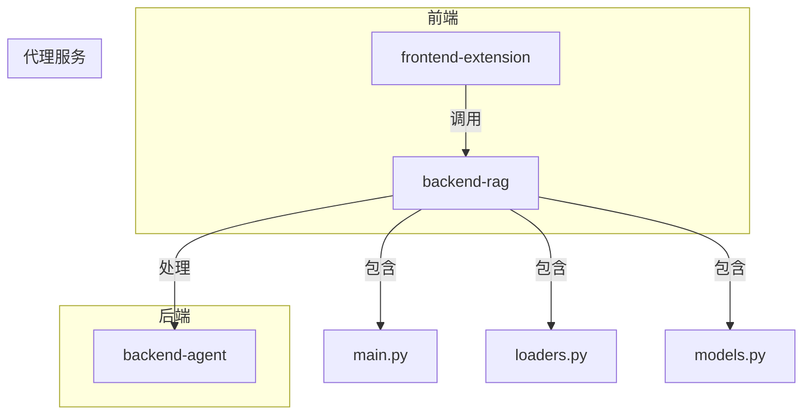
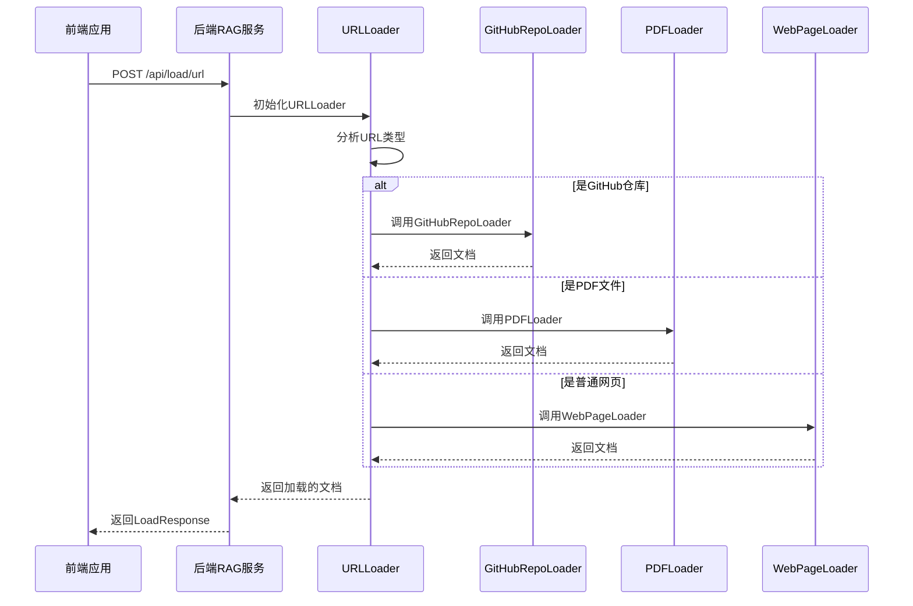
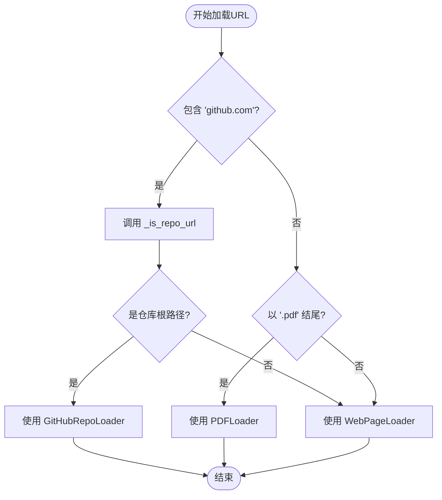
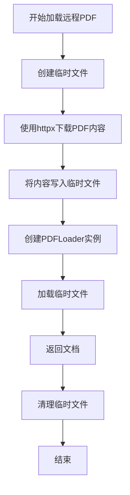
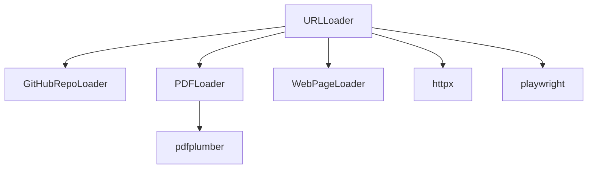

# 通用URL自动识别加载

<cite>
**本文档引用的文件**   
- [main.py](file://backend-rag/app/main.py)
- [loaders.py](file://backend-rag/app/loaders.py)
- [models.py](file://backend-rag/app/models.py)
</cite>

## 目录
1. [简介](#简介)
2. [项目结构](#项目结构)
3. [核心组件](#核心组件)
4. [架构概述](#架构概述)
5. [详细组件分析](#详细组件分析)
6. [依赖分析](#依赖分析)
7. [性能考虑](#性能考虑)
8. [故障排除指南](#故障排除指南)
9. [结论](#结论)

## 简介
本文档详细介绍了 `POST /api/load/url` 端点的实现，重点阐述了 `URLLoader` 的自动类型检测机制。该机制通过分析URL特征来判断其是GitHub仓库、PDF文件还是普通网页。文档将深入解析 `_is_repo_url` 的判断逻辑，即如何通过路径层级分析来区分仓库主页与文件链接。同时，文档将解释 `use_playwright` 参数在动态页面抓取中的作用，并展示从远程PDF下载到临时文件再加载的完整流程。此外，文档还将提供混合内容源的调用示例，并涵盖类型识别错误的边界情况。

## 项目结构
项目结构清晰地分为前端、后端和代理服务三个主要部分。后端RAG服务（`backend-rag`）是本API的核心，其中 `app/main.py` 定义了所有API端点，`app/loaders.py` 实现了各种数据加载器，而 `app/models.py` 则定义了请求和响应的数据模型。

**图源**
- [main.py](file://backend-rag/app/main.py)
- [loaders.py](file://backend-rag/app/loaders.py)
- [models.py](file://backend-rag/app/models.py)

## 核心组件
`URLLoader` 是实现自动类型检测的核心组件。它根据URL的特征，自动选择并调用 `GitHubRepoLoader`、`PDFLoader` 或 `WebPageLoader` 来处理不同类型的资源。`use_playwright` 参数允许用户在加载JavaScript渲染的动态页面时，使用Playwright引擎来获取完整的页面内容。

**节源**
- [loaders.py](file://backend-rag/app/loaders.py#L404-L461)

## 架构概述
系统架构采用分层设计，前端通过API调用后端RAG服务。后端服务接收到 `POST /api/load/url` 请求后，由 `URLLoader` 进行类型判断，并路由到相应的具体加载器进行处理。处理完成后，结果被索引并返回给前端。

**图源**
- [main.py](file://backend-rag/app/main.py#L298-L342)
- [loaders.py](file://backend-rag/app/loaders.py#L420-L436)

## 详细组件分析

### URLLoader 自动类型检测分析
`URLLoader` 的 `load` 方法是自动类型检测的入口。它首先检查URL是否包含 "github.com" 并通过 `_is_repo_url` 方法判断其是否为仓库根路径。如果不是，则检查URL是否以 ".pdf" 结尾以判断是否为PDF文件。如果以上都不是，则默认使用 `WebPageLoader` 处理为普通网页。

#### 类型检测逻辑图

**图源**
- [loaders.py](file://backend-rag/app/loaders.py#L420-L436)

### _is_repo_url 路径层级分析
`_is_repo_url` 方法通过解析URL的路径部分来判断其是否为GitHub仓库的根路径。它将路径分割成多个部分，并检查其长度。如果路径部分的数量为2（如 `/owner/repo`）或3且第三个部分为空（如 `/owner/repo/`），则认为是仓库根路径；否则，它可能是一个文件或目录的链接。

**节源**
- [loaders.py](file://backend-rag/app/loaders.py#L438-L443)

### use_playwright 动态页面抓取
`use_playwright` 参数在 `WebPageLoader` 中起着关键作用。当该参数为 `True` 时，加载器会使用Playwright引擎来启动一个无头浏览器，等待页面的JavaScript完全执行并渲染出最终的DOM，然后抓取内容。这对于加载由JavaScript动态生成内容的现代网页至关重要。

**节源**
- [loaders.py](file://backend-rag/app/loaders.py#L47-L50)
- [loaders.py](file://backend-rag/app/loaders.py#L75-L76)

### 远程PDF加载流程
当URL指向一个远程PDF时，`_load_remote_pdf` 方法会被调用。该方法首先使用 `httpx` 客户端下载PDF文件到一个临时文件中，然后创建一个 `PDFLoader` 实例来加载这个临时文件的内容。加载完成后，临时文件会被自动清理。

**图源**
- [loaders.py](file://backend-rag/app/loaders.py#L445-L460)

## 依赖分析
`URLLoader` 依赖于 `GitHubRepoLoader`、`PDFLoader` 和 `WebPageLoader` 来完成具体的加载任务。它通过组合这些具体的加载器来实现统一的接口。同时，它依赖 `httpx` 进行HTTP请求，依赖 `playwright` 进行浏览器自动化，并依赖 `pdfplumber` 来解析PDF文件。

**图源**
- [loaders.py](file://backend-rag/app/loaders.py)

## 性能考虑
*   **Playwright开销**：使用 `use_playwright` 会显著增加加载时间，因为它需要启动浏览器进程。应仅在必要时使用。
*   **临时文件**：加载远程PDF需要下载整个文件，这会消耗网络带宽和磁盘I/O。
*   **类型检测**：自动类型检测逻辑简单高效，不会成为性能瓶颈。

## 故障排除指南
*   **类型识别错误**：如果一个非标准的GitHub链接（如带有查询参数的链接）被错误识别，可以尝试手动指定加载器。对于伪装成PDF的HTML页面，系统会将其识别为网页并使用 `WebPageLoader` 加载。
*   **复杂页面兼容性**：对于JavaScript渲染的复杂页面，如果 `use_playwright=False` 时内容不完整，应设置 `use_playwright=True`。
*   **网络问题**：确保服务能够访问外部网络，特别是对于GitHub和远程PDF的下载。

**节源**
- [main.py](file://backend-rag/app/main.py#L340-L342)
- [loaders.py](file://backend-rag/app/loaders.py#L450-L452)

## 结论
`POST /api/load/url` 端点通过 `URLLoader` 实现了一个强大且灵活的自动加载机制。它能够智能地识别多种内容源，并通过参数化配置（如 `use_playwright`）来处理复杂的加载场景。这种设计极大地简化了客户端的调用，使其能够以统一的方式处理各种类型的URL资源。