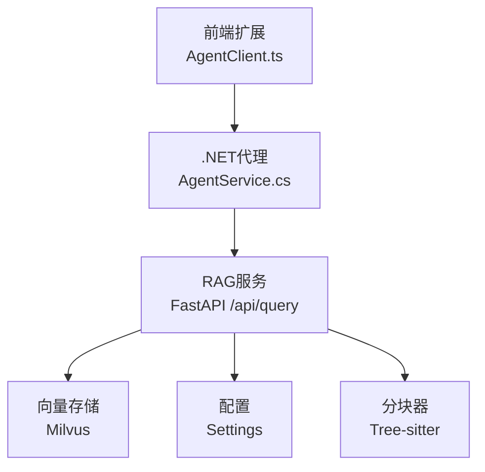
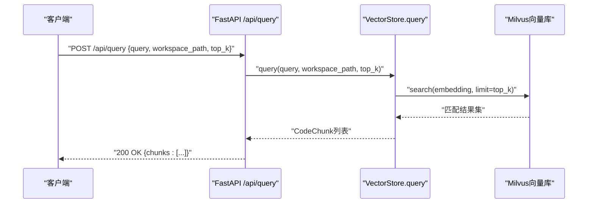
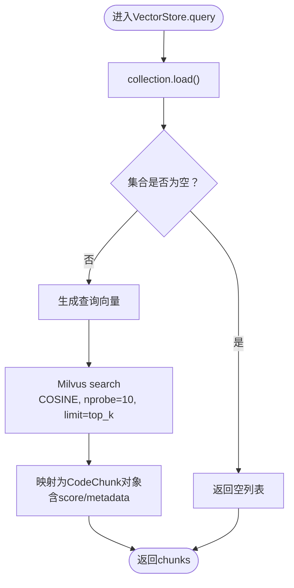
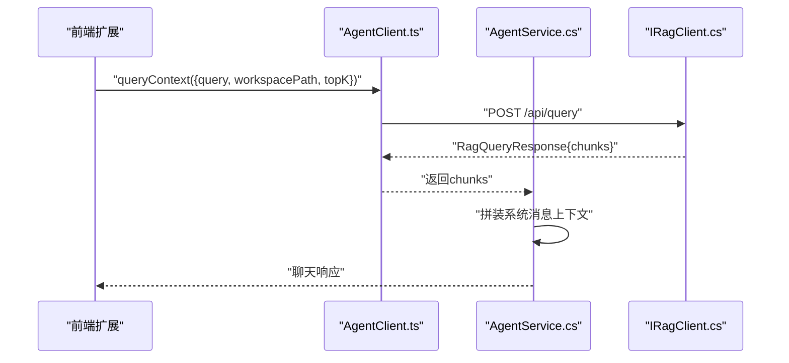
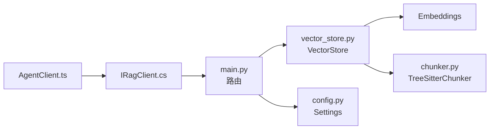

# 查询端点

<cite>
**本文引用的文件**
- [backend-rag/app/main.py](file://backend-rag/app/main.py)
- [backend-rag/app/models.py](file://backend-rag/app/models.py)
- [backend-rag/app/vector_store.py](file://backend-rag/app/vector_store.py)
- [backend-rag/app/chunker.py](file://backend-rag/app/chunker.py)
- [backend-rag/app/config.py](file://backend-rag/app/config.py)
- [backend-agent/Services/IRagClient.cs](file://backend-agent/Services/IRagClient.cs)
- [backend-agent/Models/ChatModels.cs](file://backend-agent/Models/ChatModels.cs)
- [backend-agent/Services/AgentService.cs](file://backend-agent/Services/AgentService.cs)
- [frontend-extension/src/services/AgentClient.ts](file://frontend-extension/src/services/AgentClient.ts)
- [frontend-extension/src/core/types.ts](file://frontend-extension/src/core/types.ts)
- [QUICK_START.md](file://QUICK_START.md)
</cite>

## 目录
1. [简介](#简介)
2. [项目结构](#项目结构)
3. [核心组件](#核心组件)
4. [架构总览](#架构总览)
5. [详细组件分析](#详细组件分析)
6. [依赖关系分析](#依赖关系分析)
7. [性能考量](#性能考量)
8. [故障排查指南](#故障排查指南)
9. [结论](#结论)
10. [附录](#附录)

## 简介
本文件面向RAG服务的语义搜索能力，聚焦于POST /api/query端点的实现机制与使用方式。内容涵盖：
- 请求模型QueryRequest的字段语义与校验规则
- 响应模型QueryResponse中CodeChunk数据结构的字段定义
- 与向量数据库的相似性检索流程
- 错误处理机制（如HTTP 500）
- curl命令示例与Python客户端调用思路
- 在智能代码问答场景中的实际应用

## 项目结构
RAG服务采用Python FastAPI实现，提供语义检索与索引能力；.NET后端代理通过Refit接口调用RAG服务，前端扩展通过Axios调用.NET代理，最终由RAG服务对接Milvus完成向量检索。

图表来源
- [backend-rag/app/main.py](file://backend-rag/app/main.py#L65-L90)
- [backend-rag/app/vector_store.py](file://backend-rag/app/vector_store.py#L377-L435)
- [backend-rag/app/config.py](file://backend-rag/app/config.py#L6-L51)
- [backend-rag/app/chunker.py](file://backend-rag/app/chunker.py#L60-L120)
- [backend-agent/Services/IRagClient.cs](file://backend-agent/Services/IRagClient.cs#L1-L14)
- [backend-agent/Services/AgentService.cs](file://backend-agent/Services/AgentService.cs#L119-L145)
- [frontend-extension/src/services/AgentClient.ts](file://frontend-extension/src/services/AgentClient.ts#L31-L39)

章节来源
- [QUICK_START.md](file://QUICK_START.md#L58-L73)

## 核心组件
- FastAPI应用与路由：定义了健康检查、查询、索引及加载等端点，其中POST /api/query用于语义检索。
- 请求/响应模型：QueryRequest与QueryResponse，以及CodeChunk字段定义。
- 向量存储：基于Milvus，支持按工作区集合检索，提供query方法执行相似性检索。
- 分块器：Tree-sitter AST驱动的代码分块，确保逻辑边界完整性。
- 配置：从环境变量读取OpenAI密钥、Milvus连接信息、默认top_k等。

章节来源
- [backend-rag/app/main.py](file://backend-rag/app/main.py#L65-L90)
- [backend-rag/app/models.py](file://backend-rag/app/models.py#L5-L25)
- [backend-rag/app/vector_store.py](file://backend-rag/app/vector_store.py#L377-L435)
- [backend-rag/app/chunker.py](file://backend-rag/app/chunker.py#L60-L120)
- [backend-rag/app/config.py](file://backend-rag/app/config.py#L6-L51)

## 架构总览
POST /api/query的调用链路如下：
- 客户端（前端或.NET代理）发送查询请求到RAG服务
- FastAPI路由解析请求体为QueryRequest
- 调用VectorStore.query执行向量检索
- 返回QueryResponse包含CodeChunk列表

图表来源
- [backend-rag/app/main.py](file://backend-rag/app/main.py#L65-L90)
- [backend-rag/app/vector_store.py](file://backend-rag/app/vector_store.py#L377-L435)

## 详细组件分析

### POST /api/query 端点
- 功能：对指定工作区执行语义检索，返回最相关的代码片段。
- 请求体：QueryRequest
  - query：必填，检索关键词或问题描述
  - workspace_path：必填，要检索的工作区路径
  - top_k：可选，默认值来自配置，范围限制在1~20之间
- 响应体：QueryResponse
  - chunks：CodeChunk数组，每个元素包含内容、文件路径、行号范围、相似度分数与元数据
- 异常处理：内部异常统一捕获并返回HTTP 500

章节来源
- [backend-rag/app/main.py](file://backend-rag/app/main.py#L65-L90)
- [backend-rag/app/models.py](file://backend-rag/app/models.py#L5-L25)
- [backend-rag/app/config.py](file://backend-rag/app/config.py#L35-L40)

### 请求模型与校验规则
- QueryRequest字段
  - query：字符串，必填
  - workspace_path：字符串，必填
  - top_k：整数，默认5，最小1，最大20
- 解析与默认值
  - 若请求未提供top_k，则使用配置中的default_top_k
- 业务语义
  - workspace_path用于确定Milvus集合名称，从而限定检索范围

章节来源
- [backend-rag/app/models.py](file://backend-rag/app/models.py#L5-L10)
- [backend-rag/app/main.py](file://backend-rag/app/main.py#L77-L83)
- [backend-rag/app/config.py](file://backend-rag/app/config.py#L35-L40)

### 响应模型与CodeChunk字段
- QueryResponse
  - chunks：CodeChunk列表
- CodeChunk
  - content：代码片段文本
  - file_path：源文件路径
  - start_line / end_line：片段起止行号
  - score：相似度分数
  - metadata：附加元数据（如语言、节点类型等）

章节来源
- [backend-rag/app/models.py](file://backend-rag/app/models.py#L12-L25)
- [backend-rag/app/vector_store.py](file://backend-rag/app/vector_store.py#L377-L435)

### 向量检索流程与Milvus交互
- 集合命名：根据workspace_path生成唯一集合名，避免跨工作区污染
- 连接与索引：首次访问时建立Milvus连接并创建集合，设置COSINE距离与IVF_FLAT索引
- 检索参数：使用COSINE相似度，nprobe控制召回质量与性能权衡
- 输出字段：返回content、file_path、start_line、end_line、language等，转换为CodeChunk对象

图表来源
- [backend-rag/app/vector_store.py](file://backend-rag/app/vector_store.py#L377-L435)

章节来源
- [backend-rag/app/vector_store.py](file://backend-rag/app/vector_store.py#L377-L435)

### 分块策略与索引准备
- 分块器：Tree-sitter AST优先，按函数/类等逻辑单元切分；不支持语言回退到按行的文本分块
- 索引过程：遍历工作区文件，过滤忽略目录与扩展，生成嵌入并写入Milvus
- 影响检索质量的关键因素：分块大小、重叠、语言支持与AST解析稳定性

章节来源
- [backend-rag/app/chunker.py](file://backend-rag/app/chunker.py#L60-L120)
- [backend-rag/app/vector_store.py](file://backend-rag/app/vector_store.py#L121-L204)

### 错误处理机制
- /api/query
  - 捕获异常并记录日志，返回HTTP 500
- /api/index
  - 对非法输入抛出400，其他异常返回500
- 健康检查
  - /health返回服务状态与向量库连通性

章节来源
- [backend-rag/app/main.py](file://backend-rag/app/main.py#L65-L90)
- [backend-rag/app/main.py](file://backend-rag/app/main.py#L92-L120)
- [backend-rag/app/main.py](file://backend-rag/app/main.py#L55-L63)
- [backend-rag/app/vector_store.py](file://backend-rag/app/vector_store.py#L448-L457)

### 客户端集成与调用示例

#### curl命令示例
- 发送查询请求
  - 方法：POST
  - 路径：/api/query
  - 头部：Content-Type: application/json
  - 示例请求体字段：query、workspace_path、top_k
- 响应：包含chunks数组，每项为CodeChunk对象

章节来源
- [backend-rag/app/main.py](file://backend-rag/app/main.py#L65-L90)
- [backend-rag/app/models.py](file://backend-rag/app/models.py#L5-L25)

#### Python客户端调用思路
- 使用requests或httpx发送POST请求至RAG服务
- 请求体字段与响应结构与Pydantic模型一致
- 处理HTTP 500错误并提示用户重试或检查日志

章节来源
- [backend-rag/app/models.py](file://backend-rag/app/models.py#L5-L25)
- [backend-rag/app/main.py](file://backend-rag/app/main.py#L65-L90)

#### .NET代理侧调用
- 接口定义：IRagClient.QueryAsync映射到POST /api/query
- 代理实现：AgentService.GetRagContextAsync调用RAG服务，组装上下文供LLM推理

图表来源
- [frontend-extension/src/services/AgentClient.ts](file://frontend-extension/src/services/AgentClient.ts#L31-L39)
- [backend-agent/Services/IRagClient.cs](file://backend-agent/Services/IRagClient.cs#L1-L14)
- [backend-agent/Services/AgentService.cs](file://backend-agent/Services/AgentService.cs#L119-L145)
- [backend-agent/Models/ChatModels.cs](file://backend-agent/Models/ChatModels.cs#L32-L49)

章节来源
- [frontend-extension/src/services/AgentClient.ts](file://frontend-extension/src/services/AgentClient.ts#L31-L39)
- [backend-agent/Services/IRagClient.cs](file://backend-agent/Services/IRagClient.cs#L1-L14)
- [backend-agent/Services/AgentService.cs](file://backend-agent/Services/AgentService.cs#L119-L145)
- [backend-agent/Models/ChatModels.cs](file://backend-agent/Models/ChatModels.cs#L32-L49)

## 依赖关系分析
- FastAPI路由依赖VectorStore单例与Settings配置
- VectorStore依赖Milvus连接、Embeddings模型与分块器
- .NET代理通过Refit接口调用RAG服务，前端通过Axios封装调用

图表来源
- [backend-rag/app/main.py](file://backend-rag/app/main.py#L65-L90)
- [backend-rag/app/vector_store.py](file://backend-rag/app/vector_store.py#L42-L120)
- [backend-rag/app/chunker.py](file://backend-rag/app/chunker.py#L60-L120)
- [backend-rag/app/config.py](file://backend-rag/app/config.py#L6-L51)
- [backend-agent/Services/IRagClient.cs](file://backend-agent/Services/IRagClient.cs#L1-L14)
- [frontend-extension/src/services/AgentClient.ts](file://frontend-extension/src/services/AgentClient.ts#L31-L39)

章节来源
- [backend-rag/app/main.py](file://backend-rag/app/main.py#L65-L90)
- [backend-rag/app/vector_store.py](file://backend-rag/app/vector_store.py#L42-L120)
- [backend-rag/app/chunker.py](file://backend-rag/app/chunker.py#L60-L120)
- [backend-rag/app/config.py](file://backend-rag/app/config.py#L6-L51)
- [backend-agent/Services/IRagClient.cs](file://backend-agent/Services/IRagClient.cs#L1-L14)
- [frontend-extension/src/services/AgentClient.ts](file://frontend-extension/src/services/AgentClient.ts#L31-L39)

## 性能考量
- top_k与nprobe：较大的top_k会增加Milvus扫描规模；nprobe影响召回与延迟的平衡
- 分块大小与重叠：过小导致上下文碎片化，过大可能降低检索精度；重叠有助于跨边界上下文衔接
- 集合数量：按工作区隔离集合，避免跨域干扰；集合过多会增加管理成本
- 嵌入模型：选择合适的维度与模型以平衡质量与延迟

[本节为通用建议，无需特定文件来源]

## 故障排查指南
- HTTP 500错误
  - 检查RAG服务日志定位异常
  - 确认Milvus连接参数与可用性
  - 确认OpenAI API Key与网络连通
- 无结果
  - 确认工作区已索引且集合非空
  - 调整query表述或增大top_k
- 400错误
  - 检查workspace_path是否存在或权限是否正确
  - 检查top_k是否在允许范围内

章节来源
- [backend-rag/app/main.py](file://backend-rag/app/main.py#L65-L90)
- [backend-rag/app/main.py](file://backend-rag/app/main.py#L92-L120)
- [backend-rag/app/vector_store.py](file://backend-rag/app/vector_store.py#L128-L131)
- [backend-rag/app/vector_store.py](file://backend-rag/app/vector_store.py#L377-L435)

## 结论
POST /api/query通过语义嵌入与Milvus相似性检索，为智能代码问答提供高质量上下文。请求模型严格约束参数范围，响应模型清晰表达代码片段的结构化信息。结合.NET代理与前端扩展，可在VS Code环境中实现流畅的“检索-对话”闭环。

[本节为总结性内容，无需特定文件来源]

## 附录

### API定义摘要
- 端点：POST /api/query
- 请求体：QueryRequest
  - query：字符串，必填
  - workspace_path：字符串，必填
  - top_k：整数，1~20，默认来自配置
- 响应体：QueryResponse
  - chunks：CodeChunk[]
    - content：字符串
    - file_path：字符串
    - start_line / end_line：整数
    - score：浮点数
    - metadata：字典（可选）

章节来源
- [backend-rag/app/models.py](file://backend-rag/app/models.py#L5-L25)
- [backend-rag/app/main.py](file://backend-rag/app/main.py#L65-L90)
- [backend-rag/app/vector_store.py](file://backend-rag/app/vector_store.py#L377-L435)

### 智能代码问答应用场景
- 用户提问“如何实现X功能”，代理先调用RAG查询相关代码片段，将上下文注入LLM，再生成回答与工具调用建议
- 通过workspace_path限定检索范围，确保上下文与当前项目一致

章节来源
- [backend-agent/Services/AgentService.cs](file://backend-agent/Services/AgentService.cs#L119-L145)
- [backend-agent/Models/ChatModels.cs](file://backend-agent/Models/ChatModels.cs#L32-L49)