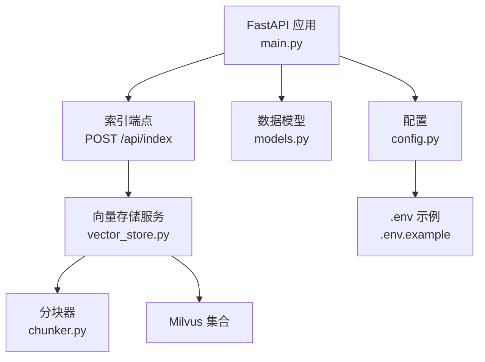
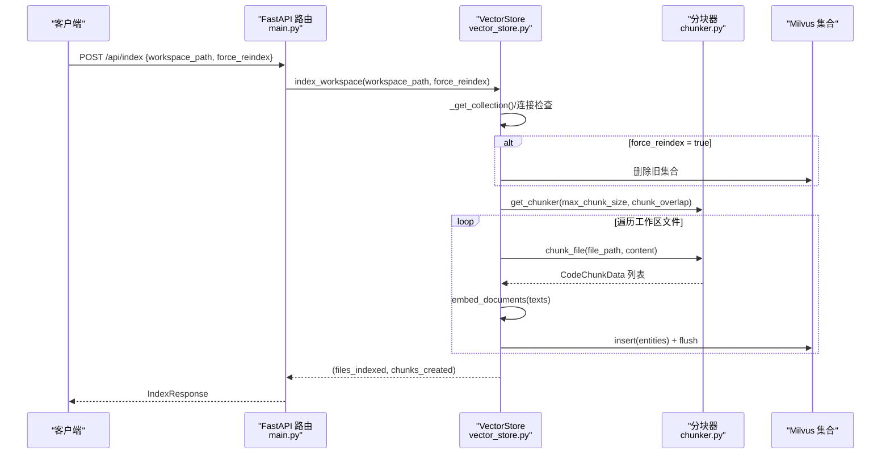
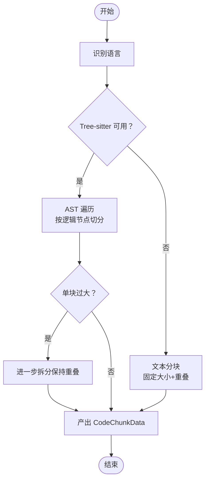
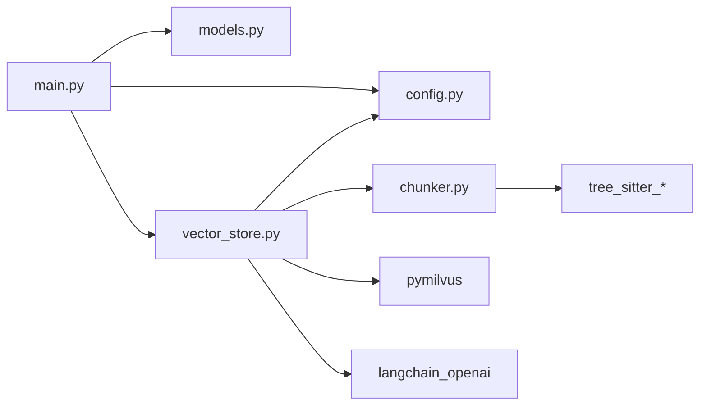

# 索引端点

<cite>
**本文引用的文件**
- [main.py](file://backend-rag/app/main.py)
- [models.py](file://backend-rag/app/models.py)
- [vector_store.py](file://backend-rag/app/vector_store.py)
- [chunker.py](file://backend-rag/app/chunker.py)
- [config.py](file://backend-rag/app/config.py)
- [.env.example](file://backend-rag/.env.example)
</cite>

## 目录
1. [简介](#简介)
2. [项目结构](#项目结构)
3. [核心组件](#核心组件)
4. [架构总览](#架构总览)
5. [详细组件分析](#详细组件分析)
6. [依赖关系分析](#依赖关系分析)
7. [性能考量](#性能考量)
8. [故障排查指南](#故障排查指南)
9. [结论](#结论)
10. [附录](#附录)

## 简介
本文件围绕 POST /api/index 端点展开，系统性说明其功能、请求模型 IndexRequest 与响应模型 IndexResponse 的字段含义，以及该端点如何调用 vector_store.py 中的 index_workspace 方法完成代码库分块与向量化存储。文档还提供实际的 curl 请求示例，解释 force_reindex 参数在“增量更新”与“完全重建”之间的权衡，并给出可能触发的 HTTP 400/500 错误及解决方案。最后结合系统架构，阐述索引过程在整个 RAG 流程中的关键作用。

## 项目结构
后端 RAG 服务采用 FastAPI 提供 REST 接口，核心逻辑集中在 app 目录：
- 路由与端点：在 main.py 中定义 /api/index 等接口
- 数据模型：在 models.py 中定义 IndexRequest/IndexResponse 等 Pydantic 模型
- 向量存储：在 vector_store.py 中封装 Milvus 存取、集合管理、嵌入生成与查询
- 分块策略：在 chunker.py 中基于 Tree-sitter 的 AST 分块与文本回退分块
- 配置：在 config.py 中读取 .env 环境变量，控制嵌入模型、Milvus 连接、分块参数等

图表来源
- [main.py](file://backend-rag/app/main.py#L92-L120)
- [vector_store.py](file://backend-rag/app/vector_store.py#L121-L204)
- [chunker.py](file://backend-rag/app/chunker.py#L104-L163)
- [models.py](file://backend-rag/app/models.py#L27-L39)
- [config.py](file://backend-rag/app/config.py#L1-L51)
- [.env.example](file://backend-rag/.env.example#L1-L28)

章节来源
- [main.py](file://backend-rag/app/main.py#L92-L120)
- [models.py](file://backend-rag/app/models.py#L27-L39)
- [vector_store.py](file://backend-rag/app/vector_store.py#L121-L204)
- [chunker.py](file://backend-rag/app/chunker.py#L104-L163)
- [config.py](file://backend-rag/app/config.py#L1-L51)
- [.env.example](file://backend-rag/.env.example#L1-L28)

## 核心组件
- 索引端点：接收 IndexRequest，调用 get_vector_store().index_workspace，返回 IndexResponse
- 请求模型 IndexRequest：包含 workspace_path（工作区路径）与 force_reindex（是否强制重建）
- 响应模型 IndexResponse：包含 success、message、files_indexed、chunks_created
- 向量存储 VectorStore：负责 Milvus 连接、集合创建/复用、分块与嵌入、批量插入
- 分块器 TreeSitterChunker：按语言与 AST 逻辑单元进行分块，支持回退到文本分块
- 配置 Settings：从 .env 读取 OPENAI_API_KEY、MILVUS_*、MAX_CHUNK_SIZE、CHUNK_OVERLAP 等

章节来源
- [main.py](file://backend-rag/app/main.py#L92-L120)
- [models.py](file://backend-rag/app/models.py#L27-L39)
- [vector_store.py](file://backend-rag/app/vector_store.py#L121-L204)
- [chunker.py](file://backend-rag/app/chunker.py#L104-L163)
- [config.py](file://backend-rag/app/config.py#L1-L51)

## 架构总览
POST /api/index 的调用链如下：
- 客户端发送 JSON 请求至 /api/index
- FastAPI 路由解析 IndexRequest
- 调用 get_vector_store() 获取 VectorStore 单例
- 调用 index_workspace(workspace_path, force_reindex)
- 返回 IndexResponse 给客户端

图表来源
- [main.py](file://backend-rag/app/main.py#L92-L120)
- [vector_store.py](file://backend-rag/app/vector_store.py#L121-L204)
- [chunker.py](file://backend-rag/app/chunker.py#L104-L163)

## 详细组件分析

### 端点：POST /api/index
- 功能：对指定工作区执行语义索引，遍历可索引文件，分块并生成嵌入，写入 Milvus
- 请求体：IndexRequest
  - workspace_path：工作区绝对或相对路径
  - force_reindex：布尔值，true 表示删除旧集合后重建；false 表示增量处理（若集合不存在则创建）
- 响应体：IndexResponse
  - success：布尔值
  - message：简要说明
  - files_indexed：本次索引处理的文件数量
  - chunks_created：本次索引创建的向量片段数量
- 错误处理：
  - 当 workspace_path 不存在时抛出 ValueError，映射为 HTTP 400
  - 其他异常映射为 HTTP 500

章节来源
- [main.py](file://backend-rag/app/main.py#L92-L120)
- [models.py](file://backend-rag/app/models.py#L27-L39)

### 请求模型 IndexRequest 与响应模型 IndexResponse
- IndexRequest 字段
  - workspace_path：工作区根目录路径
  - force_reindex：是否强制重建索引
- IndexResponse 字段
  - success：操作是否成功
  - message：操作摘要信息
  - files_indexed：已处理文件数
  - chunks_created：已创建向量片段数

章节来源
- [models.py](file://backend-rag/app/models.py#L27-L39)

### VectorStore.index_workspace 实现要点
- 集合命名：以 workspace_path 的哈希生成唯一集合名，避免跨工作区冲突
- 强制重建：当 force_reindex 为真时，先删除旧集合再重新创建
- 文件过滤：忽略常见目录（如 node_modules、.git、__pycache__ 等），仅索引预设扩展名
- 分块与嵌入：通过 get_chunker 获取 Tree-sitter 分块器，对每个文件生成 CodeChunkData，再批量生成嵌入
- 写入 Milvus：构造实体列表（id、embedding、content、file_path、start_line、end_line、node_type、language），插入并 flush
- 返回统计：返回 files_indexed 与 chunks_created

章节来源
- [vector_store.py](file://backend-rag/app/vector_store.py#L121-L204)

### 分块器 TreeSitterChunker 工作流
- 语言识别：根据文件扩展名确定语言
- AST 分块：优先使用 Tree-sitter 解析 AST，按函数/类等逻辑节点切分
- 回退策略：若无法初始化或不支持该语言，则按文本行进行固定大小与重叠的切分
- 输出：生成 CodeChunkData（content、file_path、start_line、end_line、node_type、language）

图表来源
- [chunker.py](file://backend-rag/app/chunker.py#L104-L163)

章节来源
- [chunker.py](file://backend-rag/app/chunker.py#L104-L163)

### force_reindex 参数的权衡
- 增量更新（默认）：若集合存在且 force_reindex=false，则继续写入新文件片段；适合日常增量维护
- 完全重建（force_reindex=true）：删除旧集合后重建，适用于分块策略变更、嵌入模型调整、集合损坏等情况
- 影响范围：重建会消耗更多时间与资源，但能确保索引一致性与质量

章节来源
- [vector_store.py](file://backend-rag/app/vector_store.py#L139-L147)

### curl 使用示例（本地工作区）
以下示例展示如何为本地工作区建立语义索引。请根据实际运行环境替换 rag_api_url，并确保 .env 中的 OPENAI_API_KEY 和 Milvus 连接参数正确。

- 基本索引（增量模式）
  - curl -X POST "rag_api_url/api/index" -H "Content-Type: application/json" -d '{"workspace_path":"./my-project","force_reindex":false}'
- 强制重建
  - curl -X POST "rag_api_url/api/index" -H "Content-Type: application/json" -d '{"workspace_path":"./my-project","force_reindex":true}'

提示
- workspace_path 必须指向一个存在的目录
- 若返回 400，请检查路径是否存在或权限是否足够
- 若返回 500，请检查 Milvus 连接、OpenAI API Key、网络连通性

章节来源
- [main.py](file://backend-rag/app/main.py#L92-L120)
- [.env.example](file://backend-rag/.env.example#L1-L28)

### 在 RAG 流程中的关键作用
- 索引阶段：将代码库转换为向量片段，建立语义检索基础
- 查询阶段：POST /api/query 基于已索引的 Milvus 执行相似度检索，返回相关代码片段
- 二者配合：索引质量直接影响查询召回与相关性，force_reindex 可用于修复索引问题

章节来源
- [main.py](file://backend-rag/app/main.py#L65-L90)
- [vector_store.py](file://backend-rag/app/vector_store.py#L377-L435)

## 依赖关系分析
- main.py 依赖 models.py（请求/响应模型）、config.py（设置）、vector_store.py（向量存储）
- vector_store.py 依赖 chunker.py（分块）、config.py（设置）、pymilvus（Milvus SDK）、langchain_openai（嵌入）
- chunker.py 依赖 tree_sitter_*（Tree-sitter 语言绑定）与 dataclasses、typing

图表来源
- [main.py](file://backend-rag/app/main.py#L1-L40)
- [models.py](file://backend-rag/app/models.py#L1-L40)
- [config.py](file://backend-rag/app/config.py#L1-L51)
- [vector_store.py](file://backend-rag/app/vector_store.py#L1-L40)
- [chunker.py](file://backend-rag/app/chunker.py#L1-L40)

章节来源
- [main.py](file://backend-rag/app/main.py#L1-L40)
- [vector_store.py](file://backend-rag/app/vector_store.py#L1-L40)
- [chunker.py](file://backend-rag/app/chunker.py#L1-L40)
- [config.py](file://backend-rag/app/config.py#L1-L51)

## 性能考量
- 分块参数
  - MAX_CHUNK_SIZE：影响嵌入维度与检索粒度，过大可能导致上下文稀释，过小增加片段数量与存储开销
  - CHUNK_OVERLAP：保留相邻片段的重叠有助于跨边界语义连续性
- 集合与索引
  - Milvus 使用 IVF_FLAT 索引，nlist 控制倒排表数量，影响检索速度与内存占用
- 并发与吞吐
  - 批量插入 entities 并 flush，建议在大规模索引时评估 flush 频率与 Milvus 性能
- 网络与外部依赖
  - OpenAI 嵌入 API 的速率限制与可用性会影响整体索引速度

章节来源
- [config.py](file://backend-rag/app/config.py#L35-L40)
- [vector_store.py](file://backend-rag/app/vector_store.py#L90-L118)

## 故障排查指南
- HTTP 400：工作区路径不存在或无效
  - 现象：端点捕获 ValueError 并返回 400
  - 处理：确认 workspace_path 指向真实存在的目录，检查权限
- HTTP 500：内部异常
  - 现象：端点捕获 Exception 并返回 500
  - 常见原因：
    - Milvus 连接失败或不可用
    - OpenAI 嵌入 API Key 缺失或无效
    - 文件读取异常（编码问题、权限不足）
    - Tree-sitter 未安装或语言绑定缺失导致 AST 分块失败，回落到文本分块但仍需关注日志
- 建议排查步骤
  - 检查 .env 中 OPENAI_API_KEY、MILVUS_*、MAX_CHUNK_SIZE、CHUNK_OVERLAP 是否正确
  - 使用 /health 端点验证 Milvus 连接状态
  - 查看服务日志定位具体异常堆栈

章节来源
- [main.py](file://backend-rag/app/main.py#L92-L120)
- [vector_store.py](file://backend-rag/app/vector_store.py#L121-L204)
- [.env.example](file://backend-rag/.env.example#L1-L28)

## 结论
POST /api/index 是 RAG 系统的“知识构建”入口，通过 VectorStore 将代码库转化为 Milvus 中的向量片段，为后续语义检索奠定基础。IndexRequest 的 workspace_path 与 force_reindex 明确了索引范围与重建策略；IndexResponse 提供了可追踪的统计指标。合理配置分块参数与 Milvus 索引，可在性能与召回之间取得平衡；遇到错误时，依据端点的错误映射与日志快速定位问题。

## 附录
- 环境变量参考
  - OPENAI_API_KEY：OpenAI 嵌入 API 密钥
  - MILVUS_HOST/PORT/USER/PASSWORD/DB_NAME：Milvus 连接参数
  - MAX_CHUNK_SIZE/CHUNK_OVERLAP：分块大小与重叠
  - DEFAULT_TOP_K：查询默认返回条数
  - HOST/PORT/DEBUG：服务监听与调试开关
- curl 示例（替换 rag_api_url 为实际地址）
  - 增量索引：{"workspace_path":"./my-project","force_reindex":false}
  - 强制重建：{"workspace_path":"./my-project","force_reindex":true}

章节来源
- [.env.example](file://backend-rag/.env.example#L1-L28)
- [main.py](file://backend-rag/app/main.py#L92-L120)