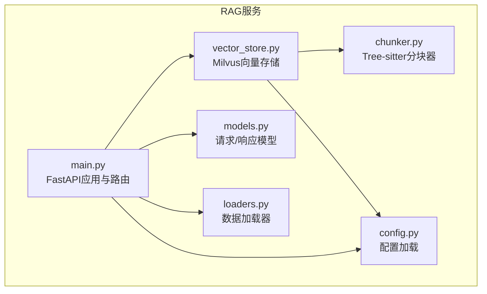
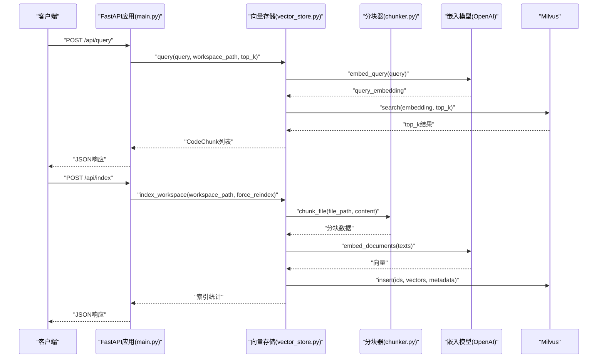
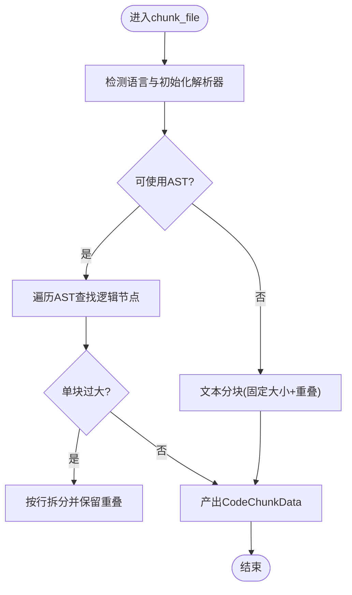
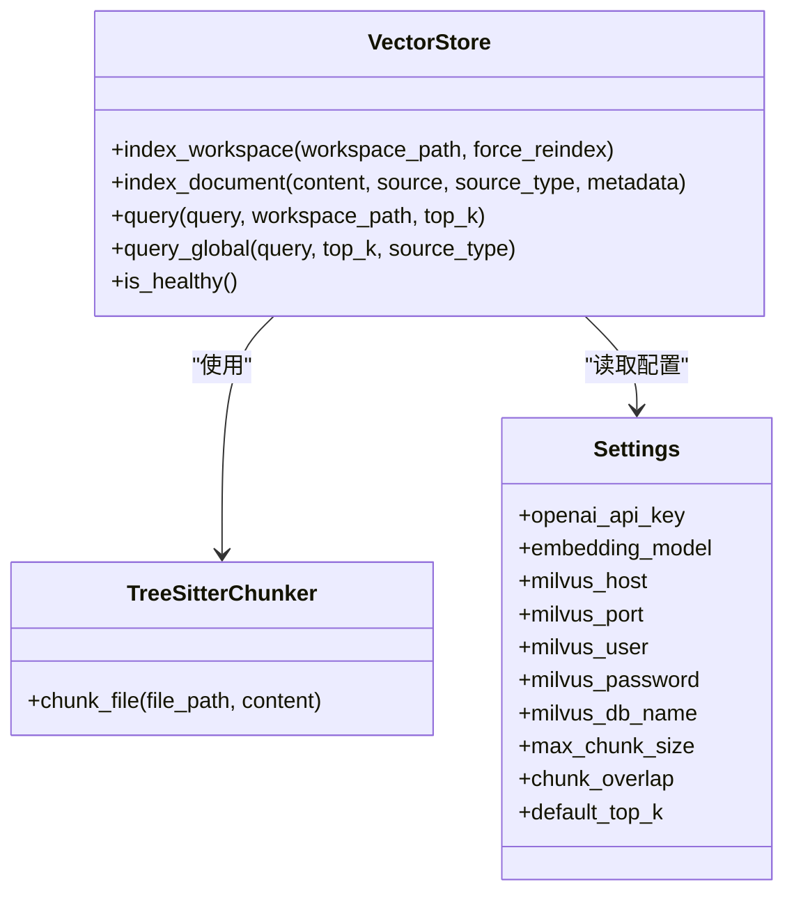
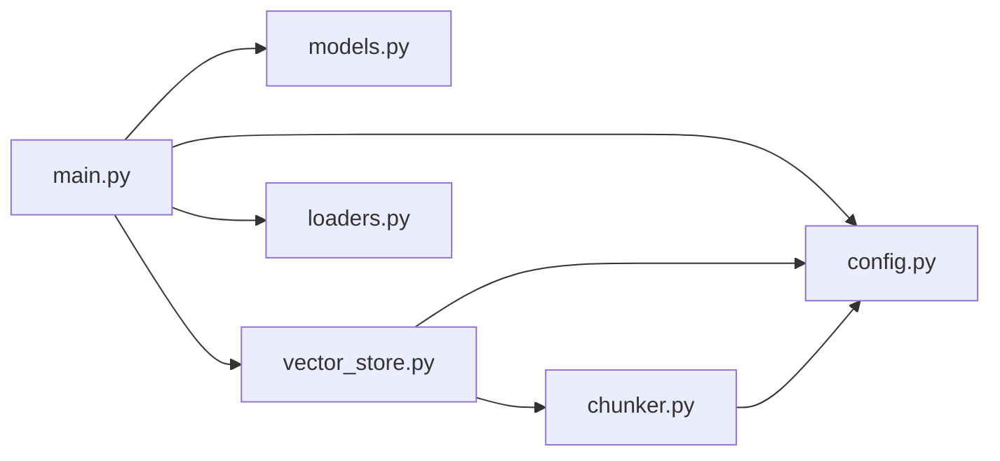

# RAG服务

<cite>
**本文引用的文件列表**
- [main.py](file://backend-rag/app/main.py)
- [chunker.py](file://backend-rag/app/chunker.py)
- [vector_store.py](file://backend-rag/app/vector_store.py)
- [config.py](file://backend-rag/app/config.py)
- [models.py](file://backend-rag/app/models.py)
- [loaders.py](file://backend-rag/app/loaders.py)
- [pyproject.toml](file://backend-rag/pyproject.toml)
- [.env.example](file://backend-rag/.env.example)
- [evaluate_recall.py](file://backend-rag/scripts/evaluate_recall.py)
- [test_chunker.py](file://backend-rag/tests/test_chunker.py)
- [QUICK_START.md](file://QUICK_START.md)
</cite>

## 目录
1. [简介](#简介)
2. [项目结构](#项目结构)
3. [核心组件](#核心组件)
4. [架构总览](#架构总览)
5. [详细组件分析](#详细组件分析)
6. [依赖关系分析](#依赖关系分析)
7. [性能考虑](#性能考虑)
8. [故障排查指南](#故障排查指南)
9. [结论](#结论)
10. [附录](#附录)

## 简介
本文件系统化梳理了Python RAG服务的架构与实现，聚焦以下关键点：
- FastAPI应用入口：端点设计、请求/响应模型、CORS与生命周期管理
- 代码分块策略：基于Tree-sitter的语法感知分块与文本回退策略
- 向量存储集成：Milvus索引构建、相似性搜索与集合命名规则
- 配置管理：环境变量驱动的嵌入模型、分块参数与Milvus连接信息
- 查询流程：从接收查询到语义检索再到返回相关代码片段
- 性能优化：批量处理、缓存策略与索引调优建议
- 实际示例：API使用方法与预期行为

## 项目结构
后端RAG服务位于backend-rag目录，采用模块化组织：
- 应用入口与路由：app/main.py
- 分块器：app/chunker.py
- 向量存储：app/vector_store.py
- 配置：app/config.py
- 数据模型：app/models.py
- 加载器：app/loaders.py
- 依赖声明：pyproject.toml
- 示例环境变量：.env.example
- 评估脚本：scripts/evaluate_recall.py
- 测试：tests/test_chunker.py
- 快速开始与端口说明：QUICK_START.md

图表来源
- [main.py](file://backend-rag/app/main.py#L1-L120)
- [chunker.py](file://backend-rag/app/chunker.py#L1-L120)
- [vector_store.py](file://backend-rag/app/vector_store.py#L1-L120)
- [config.py](file://backend-rag/app/config.py#L1-L51)
- [models.py](file://backend-rag/app/models.py#L1-L88)
- [loaders.py](file://backend-rag/app/loaders.py#L1-L120)

章节来源
- [pyproject.toml](file://backend-rag/pyproject.toml#L1-L67)
- [QUICK_START.md](file://QUICK_START.md#L1-L93)

## 核心组件
- FastAPI应用与路由：提供健康检查、查询、索引、加载等端点，并启用CORS与生命周期日志
- 配置管理：通过Pydantic Settings从环境变量读取OpenAI、Milvus、GitHub、Chunking、Retrieval等参数
- 代码分块：Tree-sitter解析AST，按函数/类等逻辑单元切分；不支持语言或失败时回退为文本分块
- 向量存储：Milvus集合按工作区路径生成唯一名称，建立IVF_FLAT索引，支持代码与外部文档两类集合
- 加载器：网页爬虫、GitHub仓库克隆、PDF提取、统一URL自动识别加载

章节来源
- [main.py](file://backend-rag/app/main.py#L55-L120)
- [config.py](file://backend-rag/app/config.py#L1-L51)
- [chunker.py](file://backend-rag/app/chunker.py#L60-L120)
- [vector_store.py](file://backend-rag/app/vector_store.py#L42-L120)
- [loaders.py](file://backend-rag/app/loaders.py#L1-L120)

## 架构总览
RAG服务整体交互如下：
- 客户端发送查询或索引请求至FastAPI端点
- 应用层根据请求类型调用向量存储或加载器
- 向量存储负责分块、嵌入、Milvus索引与相似性搜索
- 返回结构化的代码片段或加载统计

图表来源
- [main.py](file://backend-rag/app/main.py#L65-L120)
- [vector_store.py](file://backend-rag/app/vector_store.py#L121-L205)
- [chunker.py](file://backend-rag/app/chunker.py#L104-L163)

## 详细组件分析

### FastAPI应用入口（main.py）
- 生命周期：启动时记录Milvus连接信息，关闭时输出日志
- 路由：
  - GET /health：健康检查，返回服务状态与Milvus连通性
  - POST /api/query：语义检索，返回相关代码片段
  - POST /api/index：索引工作区，支持强制重建
  - POST /api/load/web、/api/load/github、/api/load/pdf、/api/load/url：加载外部内容
- CORS：允许任意来源、方法与头
- 错误处理：捕获异常并返回HTTP 500；部分端点返回400

章节来源
- [main.py](file://backend-rag/app/main.py#L28-L120)
- [main.py](file://backend-rag/app/main.py#L122-L343)

### 代码分块策略（chunker.py）
- 语言映射：支持Python、JavaScript/TypeScript、C#/Java/Go/Rust/Ruby/PHP/C/C++等
- AST优先：Tree-sitter解析AST，按函数/类/接口等逻辑节点切分
- 回退策略：不支持语言或解析失败时，按固定大小与重叠进行文本分块
- 单例：全局共享分块器实例，避免重复初始化

图表来源
- [chunker.py](file://backend-rag/app/chunker.py#L104-L163)
- [chunker.py](file://backend-rag/app/chunker.py#L172-L220)
- [chunker.py](file://backend-rag/app/chunker.py#L221-L268)

章节来源
- [chunker.py](file://backend-rag/app/chunker.py#L1-L120)
- [chunker.py](file://backend-rag/app/chunker.py#L120-L220)
- [chunker.py](file://backend-rag/app/chunker.py#L220-L280)
- [test_chunker.py](file://backend-rag/tests/test_chunker.py#L1-L88)

### 向量存储集成（vector_store.py）
- 连接与懒加载：首次使用时建立Milvus连接与嵌入模型实例
- 集合命名：以工作区路径哈希生成唯一集合名，避免跨项目冲突
- 索引字段：包含主键id、向量embedding、内容content、源文件路径与行列号、节点类型与语言等
- 搜索参数：Cosine距离，nprobe默认较小以平衡速度与召回
- 工作区索引：遍历可索引扩展名与忽略目录，按分块器切分并批量插入
- 外部文档索引：统一schema，支持标题、来源类型、chunk_index等元数据
- 健康检查：尝试列出集合判断连通性

图表来源
- [vector_store.py](file://backend-rag/app/vector_store.py#L42-L120)
- [vector_store.py](file://backend-rag/app/vector_store.py#L121-L205)
- [vector_store.py](file://backend-rag/app/vector_store.py#L206-L322)
- [vector_store.py](file://backend-rag/app/vector_store.py#L323-L435)
- [chunker.py](file://backend-rag/app/chunker.py#L274-L280)
- [config.py](file://backend-rag/app/config.py#L1-L51)

章节来源
- [vector_store.py](file://backend-rag/app/vector_store.py#L1-L120)
- [vector_store.py](file://backend-rag/app/vector_store.py#L120-L205)
- [vector_store.py](file://backend-rag/app/vector_store.py#L206-L322)
- [vector_store.py](file://backend-rag/app/vector_store.py#L323-L435)

### 配置管理（config.py）
- 关键配置项：
  - OpenAI：API密钥、嵌入模型名称
  - Milvus：主机、端口、用户、密码、数据库名
  - GitHub：私有仓库访问令牌
  - 服务器：主机、端口、调试模式
  - 分块：最大块大小、重叠长度
  - 检索：默认返回条数
- 环境变量：从.env文件加载，大小写不敏感

章节来源
- [config.py](file://backend-rag/app/config.py#L1-L51)
- [.env.example](file://backend-rag/.env.example#L1-L28)

### 数据模型（models.py）
- 查询请求/响应：包含查询语句、工作区路径、返回数量
- 索引请求/响应：包含成功标志、消息、已索引文件数、创建分块数
- 健康检查响应：包含状态、版本与数据库连通性
- 加载器模型：网页爬取、GitHub仓库、PDF、统一URL加载的请求与响应

章节来源
- [models.py](file://backend-rag/app/models.py#L1-L88)

### 加载器（loaders.py）
- 网页加载：支持静态HTML与Playwright渲染，可按深度爬取同域链接，HTML转Markdown
- GitHub仓库：浅克隆指定分支，按模式过滤文件，读取内容并生成文档
- PDF加载：提取文本与表格，保留页码与元数据
- 统一URL加载：自动识别类型并选择对应加载器

章节来源
- [loaders.py](file://backend-rag/app/loaders.py#L1-L120)
- [loaders.py](file://backend-rag/app/loaders.py#L120-L220)
- [loaders.py](file://backend-rag/app/loaders.py#L220-L320)
- [loaders.py](file://backend-rag/app/loaders.py#L320-L462)

## 依赖关系分析
- 应用入口依赖配置、模型与向量存储；同时依赖加载器用于外部内容加载
- 向量存储依赖分块器与配置；使用LangChain OpenAI嵌入模型
- 分块器依赖Tree-sitter解析库；未安装时回退文本分块
- 依赖清单来自pyproject.toml

图表来源
- [main.py](file://backend-rag/app/main.py#L1-L60)
- [vector_store.py](file://backend-rag/app/vector_store.py#L1-L40)
- [chunker.py](file://backend-rag/app/chunker.py#L1-L40)
- [config.py](file://backend-rag/app/config.py#L1-L30)
- [pyproject.toml](file://backend-rag/pyproject.toml#L1-L67)

章节来源
- [pyproject.toml](file://backend-rag/pyproject.toml#L1-L67)

## 性能考虑
- 批量处理
  - 索引阶段：对多段文本一次性调用嵌入模型生成向量，减少往返开销
  - Milvus插入：按批flush，避免频繁落盘
- 缓存策略
  - 配置与嵌入模型实例采用懒加载与缓存，避免重复初始化
  - 分块器为单例，减少Tree-sitter解析器重复创建
- 索引调优
  - Milvus索引类型：IVF_FLAT，适合中小规模数据；nlist可根据数据量调整
  - Cosine距离与nprobe：nprobe越大召回越高但延迟增加，需权衡
  - 分块大小与重叠：增大重叠有助于上下文连续性，但会增加索引体量
- 并发与资源
  - FastAPI异步上下文管理；加载器中网络请求与文件IO可能成为瓶颈
  - 建议在高并发场景下限制同时索引任务数量

章节来源
- [vector_store.py](file://backend-rag/app/vector_store.py#L121-L205)
- [vector_store.py](file://backend-rag/app/vector_store.py#L323-L435)
- [chunker.py](file://backend-rag/app/chunker.py#L274-L280)
- [config.py](file://backend-rag/app/config.py#L34-L40)

## 故障排查指南
- 健康检查失败
  - 检查Milvus连接参数与网络可达性
  - 使用健康端点确认连通性
- 查询无结果
  - 确认集合是否已索引且非空
  - 检查top_k设置与nprobe参数
- 分块异常
  - 若Tree-sitter不可用或解析失败，系统回退到文本分块
  - 调整分块大小与重叠参数
- 加载失败
  - 网页：检查Playwright可用性与网络超时
  - GitHub：检查令牌权限与分支名称
  - PDF：确认文件存在与可读

章节来源
- [main.py](file://backend-rag/app/main.py#L55-L90)
- [vector_store.py](file://backend-rag/app/vector_store.py#L383-L435)
- [vector_store.py](file://backend-rag/app/vector_store.py#L448-L457)
- [loaders.py](file://backend-rag/app/loaders.py#L106-L146)
- [loaders.py](file://backend-rag/app/loaders.py#L226-L288)
- [loaders.py](file://backend-rag/app/loaders.py#L340-L402)

## 结论
该RAG服务以FastAPI为入口，结合Tree-sitter语法感知分块与Milvus向量检索，实现了面向代码的语义检索能力。通过环境变量集中配置、模块化组件与清晰的数据模型，系统具备良好的可维护性与扩展性。建议在生产环境中进一步完善缓存、限流与监控，并根据数据规模调优Milvus索引参数与分块策略。

## 附录

### API使用示例（请求/响应）
- 健康检查
  - 请求：GET /health
  - 响应：包含状态与数据库连通性
- 查询
  - 请求体：包含查询语句、工作区路径、返回数量
  - 响应：包含相关代码片段列表
- 索引工作区
  - 请求体：包含工作区路径、是否强制重建
  - 响应：包含成功标志、消息、已索引文件数、创建分块数
- 加载外部内容
  - 网页：传入URL列表、是否使用Playwright、爬取深度等
  - GitHub：传入仓库URL、分支、包含/排除模式
  - PDF：传入本地路径或远程URL
  - 统一URL：自动识别类型并加载

章节来源
- [models.py](file://backend-rag/app/models.py#L1-L88)
- [main.py](file://backend-rag/app/main.py#L122-L343)

### 配置项说明
- OpenAI：OPENAI_API_KEY、EMBEDDING_MODEL
- Milvus：MILVUS_HOST、MILVUS_PORT、MILVUS_USER、MILVUS_PASSWORD、MILVUS_DB_NAME
- GitHub：GITHUB_TOKEN
- 服务器：HOST、PORT、DEBUG
- 分块：MAX_CHUNK_SIZE、CHUNK_OVERLAP
- 检索：DEFAULT_TOP_K

章节来源
- [config.py](file://backend-rag/app/config.py#L1-L51)
- [.env.example](file://backend-rag/.env.example#L1-L28)

### 评估与测试
- 评估脚本：基于RAGAS计算召回与精度，支持阈值判定
- 测试用例：覆盖语言映射、文本回退、大块拆分等场景

章节来源
- [evaluate_recall.py](file://backend-rag/scripts/evaluate_recall.py#L1-L120)
- [evaluate_recall.py](file://backend-rag/scripts/evaluate_recall.py#L120-L240)
- [test_chunker.py](file://backend-rag/tests/test_chunker.py#L1-L88)