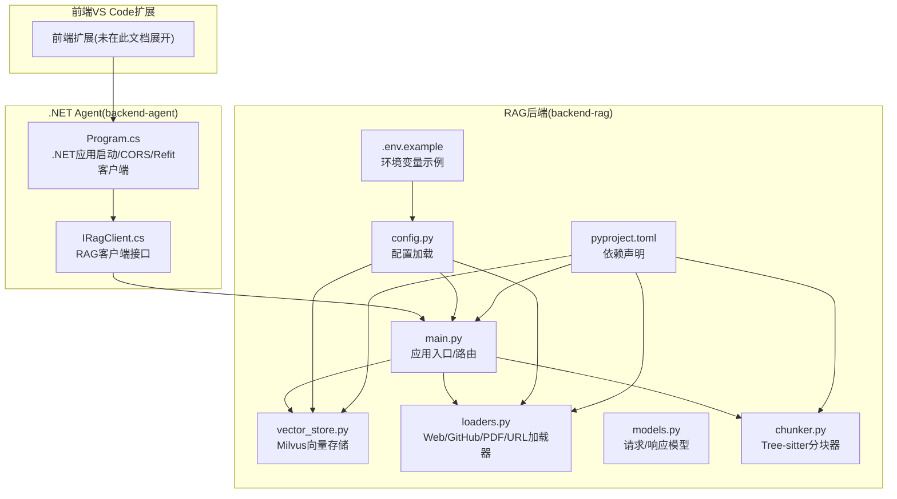
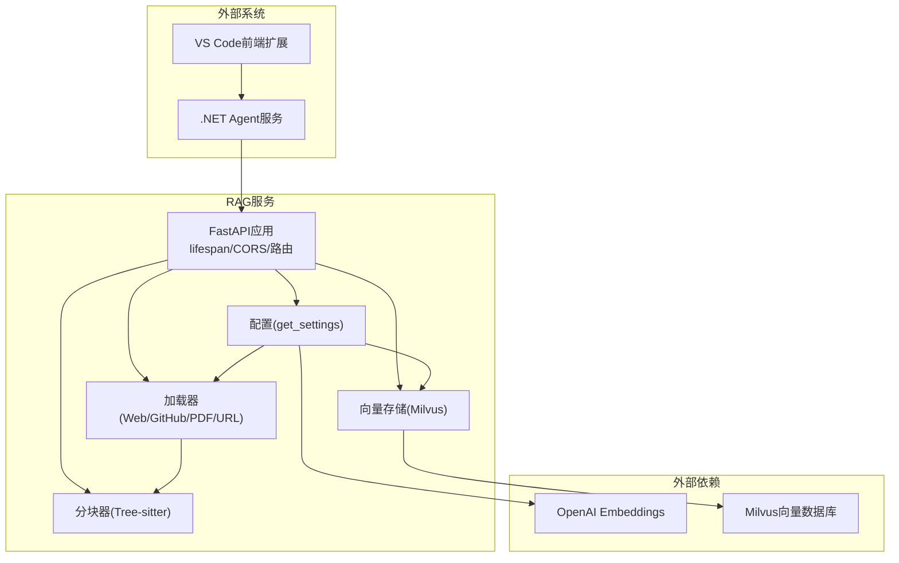
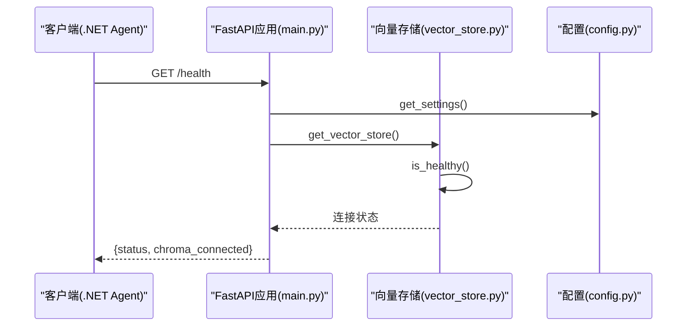
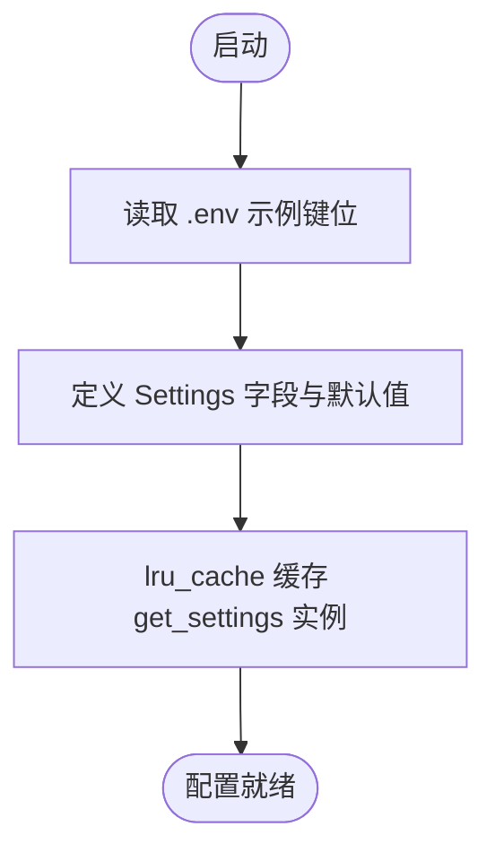
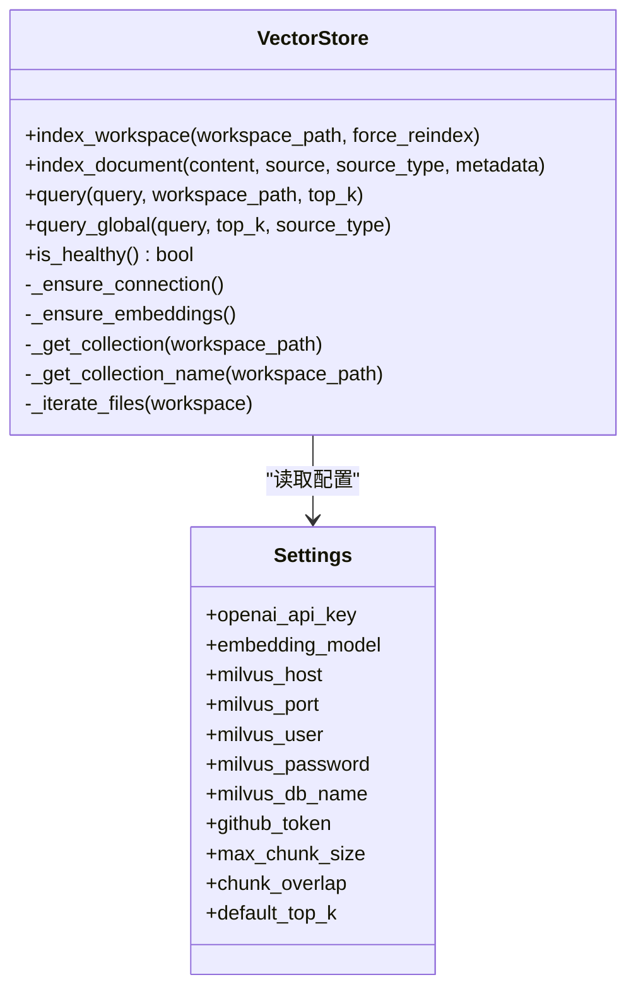
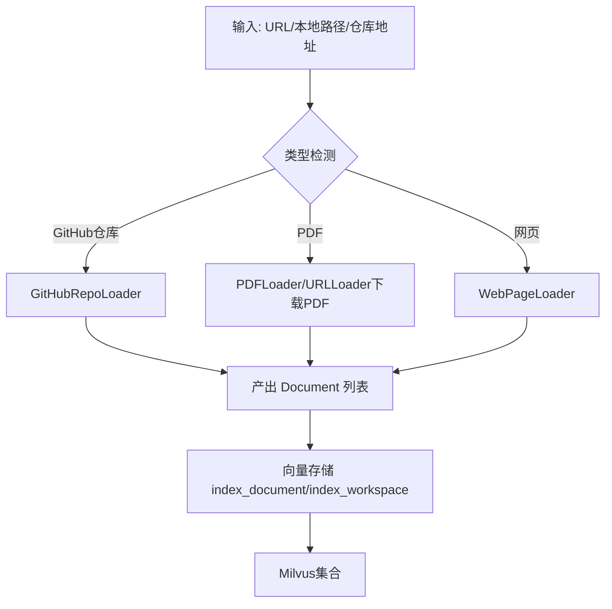
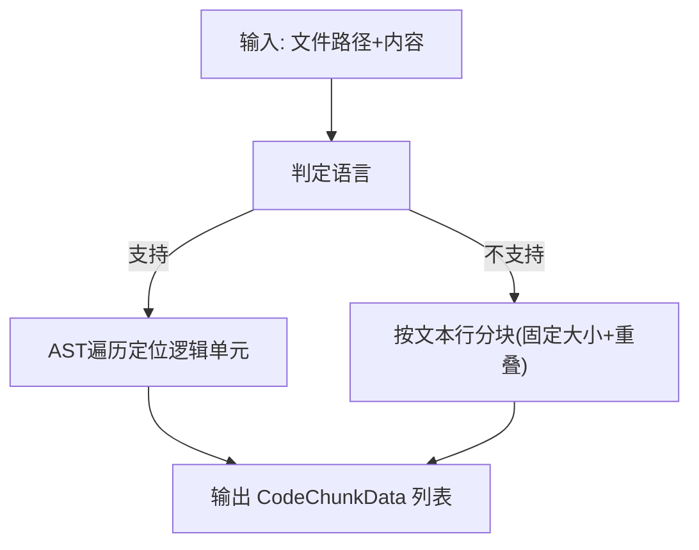
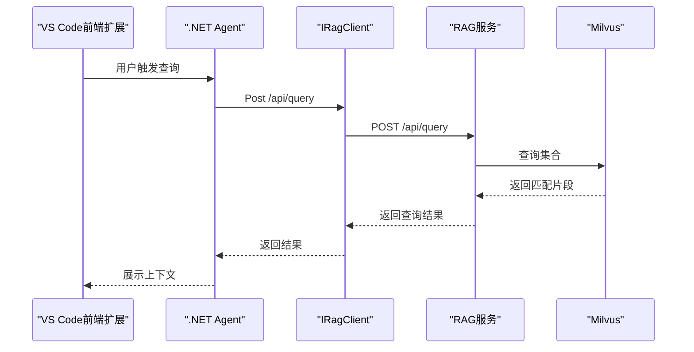
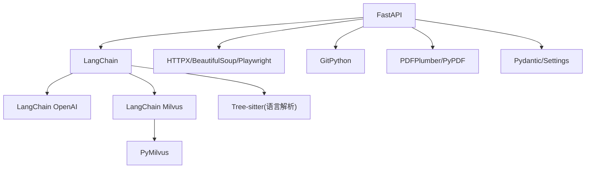
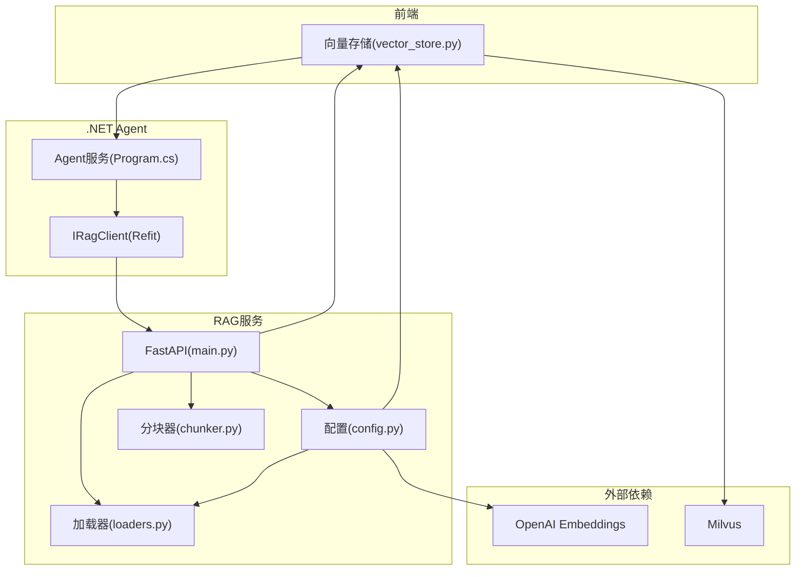

# RAG服务架构

<cite>
**本文引用的文件**
- [backend-rag/app/main.py](file://backend-rag/app/main.py)
- [backend-rag/app/config.py](file://backend-rag/app/config.py)
- [backend-rag/app/vector_store.py](file://backend-rag/app/vector_store.py)
- [backend-rag/app/loaders.py](file://backend-rag/app/loaders.py)
- [backend-rag/app/models.py](file://backend-rag/app/models.py)
- [backend-rag/app/chunker.py](file://backend-rag/app/chunker.py)
- [backend-rag/pyproject.toml](file://backend-rag/pyproject.toml)
- [backend-rag/.env.example](file://backend-rag/.env.example)
- [backend-agent/Program.cs](file://backend-agent/Program.cs)
- [backend-agent/Services/IRagClient.cs](file://backend-agent/Services/IRagClient.cs)
- [QUICK_START.md](file://QUICK_START.md)
</cite>

## 目录
1. [简介](#简介)
2. [项目结构](#项目结构)
3. [核心组件](#核心组件)
4. [架构总览](#架构总览)
5. [详细组件分析](#详细组件分析)
6. [依赖分析](#依赖分析)
7. [性能考量](#性能考量)
8. [故障排查指南](#故障排查指南)
9. [结论](#结论)
10. [附录](#附录)

## 简介
本架构文档聚焦于基于 FastAPI 的 RAG 服务（backend-rag），系统性阐述应用入口与生命周期管理、配置加载机制、跨域支持、健康检查端点、多数据源加载器与统一索引流程，以及与前端扩展与 .NET Agent 的协作关系。同时给出系统上下文图，覆盖部署拓扑、依赖服务（Milvus、OpenAI）、安全与敏感路径处理建议。

## 项目结构
RAG 服务位于 backend-rag 子目录，采用“按功能模块”组织方式：
- 应用入口与路由：app/main.py
- 配置管理：app/config.py
- 向量存储与检索：app/vector_store.py
- 数据加载器：app/loaders.py
- 请求/响应模型：app/models.py
- 代码分块器：app/chunker.py
- 依赖声明：pyproject.toml
- 环境变量示例：.env.example
- 前端 VS Code 扩展与 .NET Agent 协同：位于根目录其他子树

图表来源
- [backend-rag/app/main.py](file://backend-rag/app/main.py#L1-L120)
- [backend-rag/app/config.py](file://backend-rag/app/config.py#L1-L51)
- [backend-rag/app/vector_store.py](file://backend-rag/app/vector_store.py#L1-L120)
- [backend-rag/app/loaders.py](file://backend-rag/app/loaders.py#L1-L120)
- [backend-rag/app/models.py](file://backend-rag/app/models.py#L1-L88)
- [backend-rag/app/chunker.py](file://backend-rag/app/chunker.py#L1-L120)
- [backend-rag/pyproject.toml](file://backend-rag/pyproject.toml#L1-L67)
- [backend-rag/.env.example](file://backend-rag/.env.example#L1-L28)
- [backend-agent/Program.cs](file://backend-agent/Program.cs#L1-L67)
- [backend-agent/Services/IRagClient.cs](file://backend-agent/Services/IRagClient.cs#L1-L14)

章节来源
- [backend-rag/app/main.py](file://backend-rag/app/main.py#L1-L120)
- [backend-rag/app/config.py](file://backend-rag/app/config.py#L1-L51)
- [backend-rag/pyproject.toml](file://backend-rag/pyproject.toml#L1-L67)

## 核心组件
- 应用入口与生命周期：使用 FastAPI 的 lifespan 管理启动/关闭阶段，记录日志并连接 Milvus。
- 配置管理：通过 Pydantic Settings 从 .env 加载环境变量，提供缓存实例 get_settings。
- 跨域支持：全局启用 CORS，允许任意来源/方法/头。
- 健康检查：/health 检查 Milvus 连接状态。
- 多数据源加载器：WebPageLoader、GitHubRepoLoader、PDFLoader、URLLoader；统一产出 Document 并写入向量库。
- 向量存储：Milvus，按工作区隔离集合，支持全局文档集合；提供查询与索引能力。
- 分块策略：Tree-sitter AST 优先，回退文本分块，支持重叠拼接。
- .NET Agent 协同：通过 Refit 客户端调用 RAG 服务的 /api/query 与 /health。

章节来源
- [backend-rag/app/main.py](file://backend-rag/app/main.py#L28-L63)
- [backend-rag/app/config.py](file://backend-rag/app/config.py#L6-L51)
- [backend-rag/app/vector_store.py](file://backend-rag/app/vector_store.py#L42-L120)
- [backend-rag/app/loaders.py](file://backend-rag/app/loaders.py#L21-L120)
- [backend-rag/app/chunker.py](file://backend-rag/app/chunker.py#L60-L120)
- [backend-agent/Program.cs](file://backend-agent/Program.cs#L22-L31)
- [backend-agent/Services/IRagClient.cs](file://backend-agent/Services/IRagClient.cs#L1-L14)

## 架构总览
RAG 服务作为独立 FastAPI 应用，对外提供查询与索引接口，内部通过加载器将多种来源内容标准化为 Document，经分块器切分为可嵌入的片段，再由 Embedding 模型生成向量并写入 Milvus。.NET Agent 通过 Refit 客户端访问 RAG 服务，形成“前端扩展 -> .NET Agent -> RAG 服务”的链路。

图表来源
- [backend-rag/app/main.py](file://backend-rag/app/main.py#L28-L120)
- [backend-rag/app/config.py](file://backend-rag/app/config.py#L6-L51)
- [backend-rag/app/vector_store.py](file://backend-rag/app/vector_store.py#L42-L120)
- [backend-rag/app/loaders.py](file://backend-rag/app/loaders.py#L1-L120)
- [backend-rag/app/chunker.py](file://backend-rag/app/chunker.py#L60-L120)
- [backend-agent/Program.cs](file://backend-agent/Program.cs#L22-L31)

## 详细组件分析

### 应用入口与生命周期管理（main.py）
- 使用 lifespan 在启动前读取配置并记录 Milvus 连接信息，在关闭时输出清理日志。
- 全局启用 CORS，允许任意来源、凭证、方法与头，便于前端调试与跨域访问。
- 提供根路径返回 API 信息与可用端点列表。
- 健康检查端点 /health 返回服务状态与 Milvus 可用性（兼容旧字段名）。

图表来源
- [backend-rag/app/main.py](file://backend-rag/app/main.py#L55-L63)
- [backend-rag/app/vector_store.py](file://backend-rag/app/vector_store.py#L448-L457)
- [backend-rag/app/config.py](file://backend-rag/app/config.py#L47-L51)

章节来源
- [backend-rag/app/main.py](file://backend-rag/app/main.py#L28-L63)
- [backend-rag/app/main.py](file://backend-rag/app/main.py#L122-L139)
- [backend-rag/app/main.py](file://backend-rag/app/main.py#L55-L63)

### 配置管理机制（config.py 与 .env）
- Settings 类定义了 OpenAI、Milvus、GitHub、评估、服务器、分块与检索等参数，默认值来自环境变量。
- get_settings 使用缓存，避免重复解析 .env 文件。
- .env.example 提供默认键位，包括 OPENAI_API_KEY、MILVUS_*、GITHUB_TOKEN、HOST/PORT、MAX_CHUNK_SIZE、CHUNK_OVERLAP、DEFAULT_TOP_K 等。

图表来源
- [backend-rag/app/config.py](file://backend-rag/app/config.py#L6-L51)
- [backend-rag/.env.example](file://backend-rag/.env.example#L1-L28)

章节来源
- [backend-rag/app/config.py](file://backend-rag/app/config.py#L6-L51)
- [backend-rag/.env.example](file://backend-rag/.env.example#L1-L28)

### 向量存储与检索（vector_store.py）
- 连接策略：延迟初始化 Milvus 连接与 Embedding 模型，首次使用时建立连接。
- 集合命名：按工作区路径生成唯一集合名，避免冲突；支持强制重建。
- 索引策略：遍历工作区中可索引扩展名与忽略目录，使用分块器切分，生成嵌入并批量插入 Milvus。
- 查询策略：按 COSINE 距离检索，支持按 source_type 过滤；返回 CodeChunk 结构化结果。
- 健康检查：尝试列出集合判断连接可用性。

图表来源
- [backend-rag/app/vector_store.py](file://backend-rag/app/vector_store.py#L42-L205)
- [backend-rag/app/vector_store.py](file://backend-rag/app/vector_store.py#L206-L388)
- [backend-rag/app/vector_store.py](file://backend-rag/app/vector_store.py#L389-L457)
- [backend-rag/app/config.py](file://backend-rag/app/config.py#L6-L51)

章节来源
- [backend-rag/app/vector_store.py](file://backend-rag/app/vector_store.py#L42-L205)
- [backend-rag/app/vector_store.py](file://backend-rag/app/vector_store.py#L206-L388)
- [backend-rag/app/vector_store.py](file://backend-rag/app/vector_store.py#L389-L457)

### 数据加载器与统一索引（loaders.py）
- Document 抽象：统一 content/source/source_type/metadata 字段。
- WebPageLoader：支持静态与 Playwright 渲染页面，HTML 转 Markdown，可按深度爬取同域链接。
- GitHubRepoLoader：浅克隆仓库，按模式与扩展名筛选文件，支持私有仓库 Token。
- PDFLoader：提取文本与表格，保留元信息。
- URLLoader：自动识别类型，分别委托对应加载器；远程 PDF 先下载至临时文件再处理。
- 统一索引：各加载器产出 Document，交由向量存储 index_document 或 index_workspace 写入 Milvus。

图表来源
- [backend-rag/app/loaders.py](file://backend-rag/app/loaders.py#L1-L120)
- [backend-rag/app/loaders.py](file://backend-rag/app/loaders.py#L182-L311)
- [backend-rag/app/loaders.py](file://backend-rag/app/loaders.py#L312-L403)
- [backend-rag/app/loaders.py](file://backend-rag/app/loaders.py#L404-L462)

章节来源
- [backend-rag/app/loaders.py](file://backend-rag/app/loaders.py#L21-L120)
- [backend-rag/app/loaders.py](file://backend-rag/app/loaders.py#L182-L311)
- [backend-rag/app/loaders.py](file://backend-rag/app/loaders.py#L312-L403)
- [backend-rag/app/loaders.py](file://backend-rag/app/loaders.py#L404-L462)

### 代码分块器（chunker.py）
- 语言映射与节点类型：根据扩展名确定语言，按语言选择逻辑单元（函数、类等）进行 AST 分块。
- 回退策略：当 Tree-sitter 不可用或解析失败时，按文本行进行固定大小与重叠的分块。
- 输出：CodeChunkData 包含内容、起止行、节点类型与语言，供向量存储使用。

图表来源
- [backend-rag/app/chunker.py](file://backend-rag/app/chunker.py#L25-L58)
- [backend-rag/app/chunker.py](file://backend-rag/app/chunker.py#L104-L163)
- [backend-rag/app/chunker.py](file://backend-rag/app/chunker.py#L221-L268)

章节来源
- [backend-rag/app/chunker.py](file://backend-rag/app/chunker.py#L60-L120)
- [backend-rag/app/chunker.py](file://backend-rag/app/chunker.py#L104-L163)
- [backend-rag/app/chunker.py](file://backend-rag/app/chunker.py#L221-L268)

### .NET Agent 协同与健康检查
- .NET Agent 通过 Refit 接口 IRagClient 调用 RAG 服务的 /api/query 与 /health。
- .NET 应用启动时注册 CORS 策略，允许前端与 VS Code WebView 访问。
- RAG 服务 /health 返回服务状态与 Milvus 可用性，用于 .NET Agent 的健康监测。

图表来源
- [backend-agent/Services/IRagClient.cs](file://backend-agent/Services/IRagClient.cs#L1-L14)
- [backend-agent/Program.cs](file://backend-agent/Program.cs#L22-L31)
- [backend-rag/app/main.py](file://backend-rag/app/main.py#L65-L90)
- [backend-rag/app/vector_store.py](file://backend-rag/app/vector_store.py#L377-L435)

章节来源
- [backend-agent/Program.cs](file://backend-agent/Program.cs#L22-L31)
- [backend-agent/Services/IRagClient.cs](file://backend-agent/Services/IRagClient.cs#L1-L14)
- [backend-rag/app/main.py](file://backend-rag/app/main.py#L65-L90)

## 依赖分析
- 语言与框架：FastAPI、Pydantic、Pydantic Settings、Uvicorn。
- 向量与嵌入：LangChain、LangChain OpenAI、PyMilvus、LangChain Milvus。
- 解析与抓取：BeautifulSoup、html2text、Playwright、GitPython、PyPDF、PDFPlumber。
- 文档处理：Unstructured、Markdown。
- 开发工具：pytest、ruff、mypy。

图表来源
- [backend-rag/pyproject.toml](file://backend-rag/pyproject.toml#L1-L67)

章节来源
- [backend-rag/pyproject.toml](file://backend-rag/pyproject.toml#L1-L67)

## 性能考量
- 分块策略：Tree-sitter AST 优先，减少语义断裂；固定大小与重叠确保上下文连续性。
- 向量检索：COSINE 距离，IVF_FLAT 索引，nprobe 参数可权衡精度与速度。
- 索引批量：批量插入与 flush，降低网络往返开销。
- 连接懒加载：Milvus 与 Embedding 模型仅在首次使用时初始化，减少冷启动成本。
- 爬虫与下载：限制链接数量、同域过滤、超时控制，避免资源浪费。

[本节为通用性能讨论，无需具体文件分析]

## 故障排查指南
- 健康检查失败
  - 现象：/health 返回不可用。
  - 排查：确认 Milvus 地址/端口/凭据配置正确；检查网络连通性；查看日志。
  - 参考：[backend-rag/app/main.py](file://backend-rag/app/main.py#L55-L63)、[backend-rag/app/vector_store.py](file://backend-rag/app/vector_store.py#L448-L457)
- 索引异常
  - 现象：/api/index 返回错误或无结果。
  - 排查：确认工作区路径存在且包含可索引文件；检查分块大小与重叠设置；查看日志警告。
  - 参考：[backend-rag/app/vector_store.py](file://backend-rag/app/vector_store.py#L121-L205)
- 查询无结果
  - 现象：/api/query 返回空列表。
  - 排查：确认集合已加载；检查 top_k 设置；验证查询语句与索引内容相关性。
  - 参考：[backend-rag/app/vector_store.py](file://backend-rag/app/vector_store.py#L377-L435)
- 跨域问题
  - 现象：前端无法访问 /api/*。
  - 排查：确认 CORS 已启用；检查来源与方法是否被允许。
  - 参考：[backend-rag/app/main.py](file://backend-rag/app/main.py#L45-L53)
- 配置缺失
  - 现象：启动时报错或行为异常。
  - 排查：核对 .env 中 OPENAI_API_KEY、MILVUS_*、GITHUB_TOKEN 等键位。
  - 参考：[backend-rag/.env.example](file://backend-rag/.env.example#L1-L28)、[backend-rag/app/config.py](file://backend-rag/app/config.py#L6-L51)

章节来源
- [backend-rag/app/main.py](file://backend-rag/app/main.py#L45-L53)
- [backend-rag/app/main.py](file://backend-rag/app/main.py#L55-L63)
- [backend-rag/app/vector_store.py](file://backend-rag/app/vector_store.py#L121-L205)
- [backend-rag/app/vector_store.py](file://backend-rag/app/vector_store.py#L377-L435)
- [backend-rag/.env.example](file://backend-rag/.env.example#L1-L28)
- [backend-rag/app/config.py](file://backend-rag/app/config.py#L6-L51)

## 结论
本 RAG 服务以 FastAPI 为核心，结合 Pydantic 配置、Tree-sitter 分块与 Milvus 向量存储，实现了从多源数据到语义检索的完整闭环。通过统一的 Document 抽象与懒加载策略，系统具备良好的扩展性与运行效率。.NET Agent 通过 Refit 客户端与健康检查端点，与 RAG 服务形成稳定协作。建议在生产环境中收紧 CORS 策略、强化密钥管理与敏感路径过滤，并结合监控指标持续优化检索质量与性能。

[本节为总结性内容，无需具体文件分析]

## 附录

### 系统上下文图（RAG服务与外部组件）

图表来源
- [backend-rag/app/main.py](file://backend-rag/app/main.py#L28-L120)
- [backend-rag/app/config.py](file://backend-rag/app/config.py#L6-L51)
- [backend-rag/app/vector_store.py](file://backend-rag/app/vector_store.py#L42-L120)
- [backend-rag/app/loaders.py](file://backend-rag/app/loaders.py#L1-L120)
- [backend-rag/app/chunker.py](file://backend-rag/app/chunker.py#L60-L120)
- [backend-agent/Program.cs](file://backend-agent/Program.cs#L22-L31)
- [backend-agent/Services/IRagClient.cs](file://backend-agent/Services/IRagClient.cs#L1-L14)

### 部署拓扑与端口
- .NET Agent API：5000
- Python RAG API：8000
- 前端 VS Code 扩展通过 .NET Agent 访问 RAG 服务

章节来源
- [QUICK_START.md](file://QUICK_START.md#L57-L64)

### 安全与敏感路径建议
- API 密钥管理：通过环境变量注入 OPENAI_API_KEY、MILVUS_*、GITHUB_TOKEN；避免硬编码与日志泄露。
- CORS 收敛：生产环境限定允许来源与方法，避免通配符。
- 敏感路径过滤：对 /api/load/* 等写入接口进行鉴权与速率限制；对 /health 保持最小权限暴露。
- 日志脱敏：避免输出完整请求体与密钥字段。

[本节为通用安全建议，无需具体文件分析]