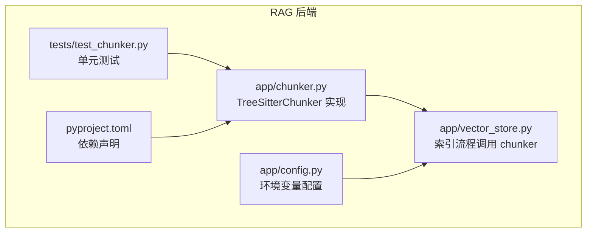
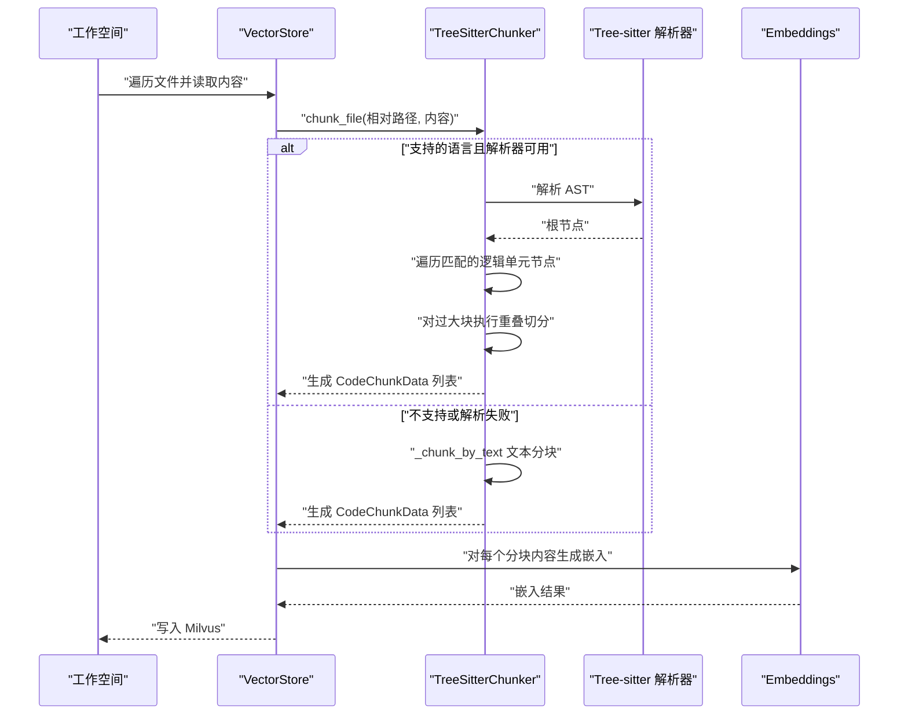
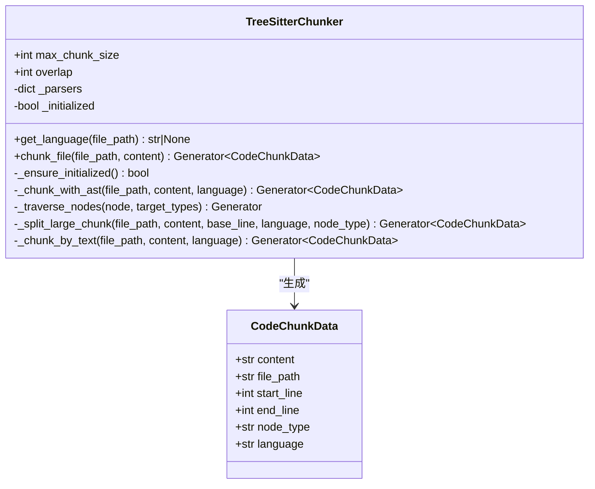
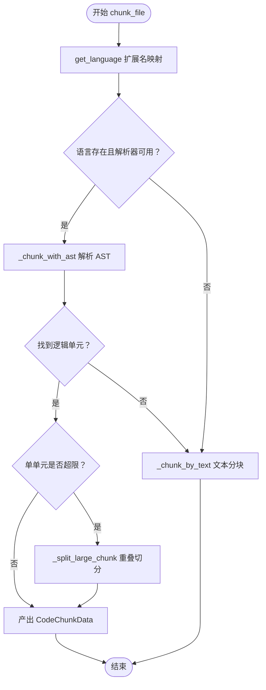
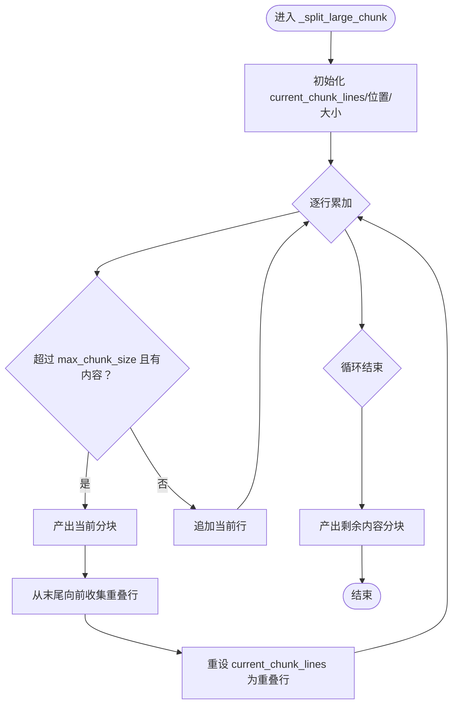
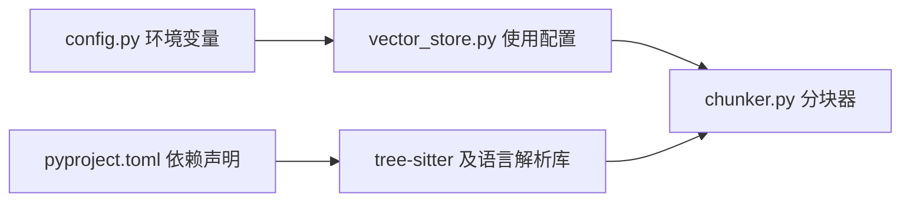

# 代码分块策略

<cite>
**本文引用的文件**
- [chunker.py](file://backend-rag/app/chunker.py)
- [test_chunker.py](file://backend-rag/tests/test_chunker.py)
- [config.py](file://backend-rag/app/config.py)
- [vector_store.py](file://backend-rag/app/vector_store.py)
- [pyproject.toml](file://backend-rag/pyproject.toml)
</cite>

## 目录
1. [简介](#简介)
2. [项目结构](#项目结构)
3. [核心组件](#核心组件)
4. [架构总览](#架构总览)
5. [详细组件分析](#详细组件分析)
6. [依赖关系分析](#依赖关系分析)
7. [性能考量](#性能考量)
8. [故障排查指南](#故障排查指南)
9. [结论](#结论)
10. [附录](#附录)

## 简介
本文件系统化记录了基于 Tree-sitter 的代码分块实现（TreeSitterChunker），重点解释：
- 如何通过 AST 感知分块，优先按函数、类等逻辑单元进行切分，从而优于基于字符长度的简单切分；
- TreeSitterChunker 如何依据文件扩展名映射语言，并利用预定义的 CHUNK_NODE_TYPES 识别逻辑单元；
- 当 AST 解析不可用时的降级策略（_chunk_by_text）；
- 大代码块的分割机制（_split_large_chunk）与重叠策略以保持上下文连贯性；
- 通过测试用例路径展示 Python 函数与 TypeScript 类的分块过程；
- 提供性能优化建议：合理设置 max_chunk_size 和 overlap 参数，以及处理不支持语言的回退方案。

## 项目结构
该功能位于后端 RAG 子模块中，核心文件为 chunker.py，配合配置与向量存储模块共同完成代码分块与嵌入索引流程。

图表来源
- [chunker.py](file://backend-rag/app/chunker.py#L1-L279)
- [config.py](file://backend-rag/app/config.py#L1-L51)
- [vector_store.py](file://backend-rag/app/vector_store.py#L150-L205)
- [test_chunker.py](file://backend-rag/tests/test_chunker.py#L1-L87)
- [pyproject.toml](file://backend-rag/pyproject.toml#L1-L67)

章节来源
- [chunker.py](file://backend-rag/app/chunker.py#L1-L279)
- [config.py](file://backend-rag/app/config.py#L1-L51)
- [vector_store.py](file://backend-rag/app/vector_store.py#L150-L205)
- [test_chunker.py](file://backend-rag/tests/test_chunker.py#L1-L87)
- [pyproject.toml](file://backend-rag/pyproject.toml#L1-L67)

## 核心组件
- TreeSitterChunker：主分块器，负责语言检测、AST 分块、大块拆分与文本降级分块。
- CodeChunkData：分块数据结构，包含内容、起止行号、节点类型、语言等元信息。
- 配置项：max_chunk_size、chunk_overlap 由环境变量注入，影响分块大小与重叠策略。
- 依赖：tree-sitter 及各语言解析库在运行时懒加载初始化。

章节来源
- [chunker.py](file://backend-rag/app/chunker.py#L14-L23)
- [chunker.py](file://backend-rag/app/chunker.py#L60-L115)
- [config.py](file://backend-rag/app/config.py#L34-L40)
- [pyproject.toml](file://backend-rag/pyproject.toml#L15-L18)

## 架构总览
下图展示了从工作空间索引到分块与嵌入的整体流程，其中分块阶段由 TreeSitterChunker 完成。

图表来源
- [vector_store.py](file://backend-rag/app/vector_store.py#L150-L205)
- [chunker.py](file://backend-rag/app/chunker.py#L104-L163)

## 详细组件分析

### TreeSitterChunker 类
- 语言映射：通过扩展名到语言字符串的映射表确定语言。
- AST 分块：解析源码为 AST，遍历目标节点类型集合，按逻辑单元输出分块；若单个单元过大，则进入“大块拆分”。
- 重叠策略：每次产出一个分块后，从当前块末尾向前取不超过 overlap 字节的行作为下一个分块的开头，确保上下文连续。
- 降级策略：当语言不在支持列表、解析器未初始化成功或解析异常时，回退到按行的文本分块。

图表来源
- [chunker.py](file://backend-rag/app/chunker.py#L60-L279)

章节来源
- [chunker.py](file://backend-rag/app/chunker.py#L60-L115)
- [chunker.py](file://backend-rag/app/chunker.py#L116-L163)
- [chunker.py](file://backend-rag/app/chunker.py#L164-L171)
- [chunker.py](file://backend-rag/app/chunker.py#L172-L219)
- [chunker.py](file://backend-rag/app/chunker.py#L221-L268)
- [chunker.py](file://backend-rag/app/chunker.py#L270-L279)

### AST 感知分块与降级策略
- AST 分块流程：解析为 AST 后，遍历节点类型集合，按节点起止行拼接内容；若超过阈值则进入“大块拆分”。
- 降级策略：当语言未知、解析器未初始化或解析异常时，转为按行的文本分块，并保留相同的重叠策略。

图表来源
- [chunker.py](file://backend-rag/app/chunker.py#L104-L163)
- [chunker.py](file://backend-rag/app/chunker.py#L172-L219)
- [chunker.py](file://backend-rag/app/chunker.py#L221-L268)

章节来源
- [chunker.py](file://backend-rag/app/chunker.py#L104-L163)
- [chunker.py](file://backend-rag/app/chunker.py#L172-L219)
- [chunker.py](file://backend-rag/app/chunker.py#L221-L268)

### 大块分割与重叠策略
- 大块分割：将过大的逻辑单元按行累加，超过 max_chunk_size 即产出一个分块，并计算重叠行作为下一分块的开头。
- 重叠策略：从当前块末尾向前累计行，直到累计字节数达到 overlap 上限为止，形成重叠窗口。

图表来源
- [chunker.py](file://backend-rag/app/chunker.py#L172-L219)

章节来源
- [chunker.py](file://backend-rag/app/chunker.py#L172-L219)

### 具体示例：Python 函数与 TypeScript 类的分块
- Python 示例：测试用例通过 chunk_file 对包含函数与类的 Python 代码进行分块，断言返回多个分块且起止行有效。
- TypeScript 示例：测试用例通过扩展名映射到 typescript，结合 CHUNK_NODE_TYPES 中的类声明等节点类型，可按类与方法等逻辑单元进行分块。

章节来源
- [test_chunker.py](file://backend-rag/tests/test_chunker.py#L20-L48)
- [chunker.py](file://backend-rag/app/chunker.py#L45-L57)
- [chunker.py](file://backend-rag/app/chunker.py#L116-L163)

## 依赖关系分析
- 运行时依赖：tree-sitter 及各语言解析库（python、javascript、typescript）在首次使用时懒加载初始化。
- 配置依赖：max_chunk_size 与 chunk_overlap 来自环境变量，通过 Settings 注入到向量存储模块，进而影响分块行为。
- 调用链：VectorStore 在索引工作空间时调用 chunker.chunk_file，将分块结果用于嵌入与 Milvus 写入。

图表来源
- [pyproject.toml](file://backend-rag/pyproject.toml#L15-L18)
- [config.py](file://backend-rag/app/config.py#L34-L40)
- [vector_store.py](file://backend-rag/app/vector_store.py#L150-L205)
- [chunker.py](file://backend-rag/app/chunker.py#L72-L97)

章节来源
- [pyproject.toml](file://backend-rag/pyproject.toml#L15-L18)
- [config.py](file://backend-rag/app/config.py#L34-L40)
- [vector_store.py](file://backend-rag/app/vector_store.py#L150-L205)
- [chunker.py](file://backend-rag/app/chunker.py#L72-L97)

## 性能考量
- 合理设置 max_chunk_size
  - 建议值：根据下游嵌入模型与检索系统的吞吐能力设定。较大的分块可减少分块数量但可能降低检索精度；较小的分块更易定位精确片段，但会增加向量数量与索引开销。
  - 参考路径：[config.py](file://backend-rag/app/config.py#L34-L40)，[vector_store.py](file://backend-rag/app/vector_store.py#L150-L205)
- 合理设置 overlap
  - 建议值：通常设置为 max_chunk_size 的 10%~20%，以保证跨分块边界时的上下文连续性。
  - 参考路径：[chunker.py](file://backend-rag/app/chunker.py#L172-L219)
- 语言支持与解析器初始化
  - 若 tree-sitter 未安装或导入失败，将自动回退到文本分块；建议在部署环境中确保依赖齐全，避免频繁降级导致分块质量下降。
  - 参考路径：[chunker.py](file://backend-rag/app/chunker.py#L72-L97)
- 大块拆分成本
  - 对于超大函数或类，大块拆分会多次产出分块并计算重叠，注意控制 max_chunk_size 以平衡内存与 CPU 开销。
  - 参考路径：[chunker.py](file://backend-rag/app/chunker.py#L172-L219)

## 故障排查指南
- Tree-sitter 初始化失败
  - 现象：日志出现导入错误或初始化异常，随后回退到文本分块。
  - 排查：确认依赖已安装，检查运行环境与权限。
  - 参考路径：[chunker.py](file://backend-rag/app/chunker.py#L72-L97)
- AST 解析异常
  - 现象：解析抛出异常，记录警告并回退到文本分块。
  - 排查：检查源码语法、编码格式与文件大小限制。
  - 参考路径：[chunker.py](file://backend-rag/app/chunker.py#L160-L163)
- 不支持语言
  - 现象：扩展名未映射到语言，直接进入文本分块。
  - 排查：确认扩展名是否在映射表中，必要时扩展映射表。
  - 参考路径：[chunker.py](file://backend-rag/app/chunker.py#L25-L42)
- 测试验证
  - 使用测试用例验证语言映射、Python 文件分块、文本降级与大块拆分行为。
  - 参考路径：[test_chunker.py](file://backend-rag/tests/test_chunker.py#L10-L87)

章节来源
- [chunker.py](file://backend-rag/app/chunker.py#L72-L97)
- [chunker.py](file://backend-rag/app/chunker.py#L160-L163)
- [test_chunker.py](file://backend-rag/tests/test_chunker.py#L10-L87)

## 结论
TreeSitterChunker 通过 AST 感知分块，优先遵循函数、类等逻辑单元边界，显著优于固定长度的字符切分。其设计包含完善的降级策略与重叠机制，既保证检索精度又维持上下文连贯。配合合理的 max_chunk_size 与 overlap 设置，可在不同规模与类型的代码库中取得良好效果。

## 附录
- 关键实现路径参考
  - 语言映射与节点类型：[chunker.py](file://backend-rag/app/chunker.py#L25-L57)
  - 主分块入口与降级：[chunker.py](file://backend-rag/app/chunker.py#L104-L115)
  - AST 分块与遍历：[chunker.py](file://backend-rag/app/chunker.py#L116-L163)
  - 大块拆分与重叠：[chunker.py](file://backend-rag/app/chunker.py#L172-L219)
  - 文本降级分块：[chunker.py](file://backend-rag/app/chunker.py#L221-L268)
  - 配置注入与使用：[config.py](file://backend-rag/app/config.py#L34-L40)，[vector_store.py](file://backend-rag/app/vector_store.py#L150-L205)
  - 依赖声明：[pyproject.toml](file://backend-rag/pyproject.toml#L15-L18)
  - 测试用例：[test_chunker.py](file://backend-rag/tests/test_chunker.py#L10-L87)