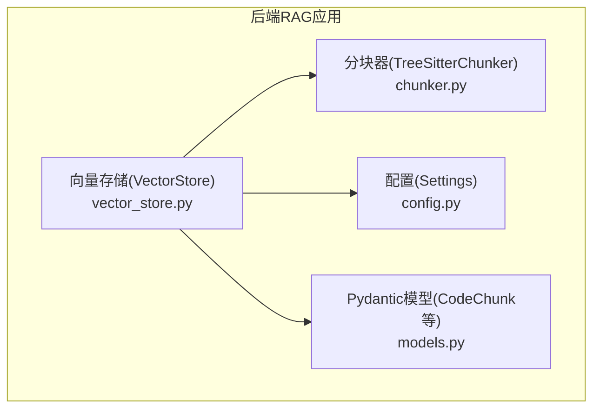
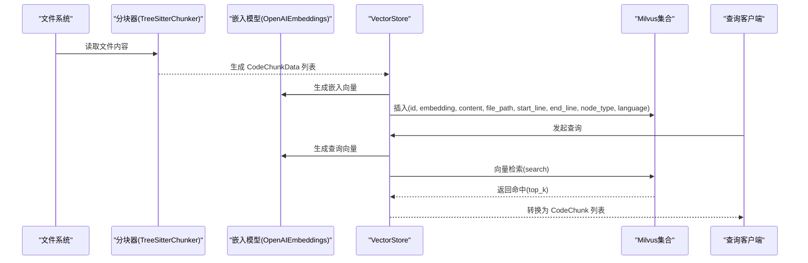
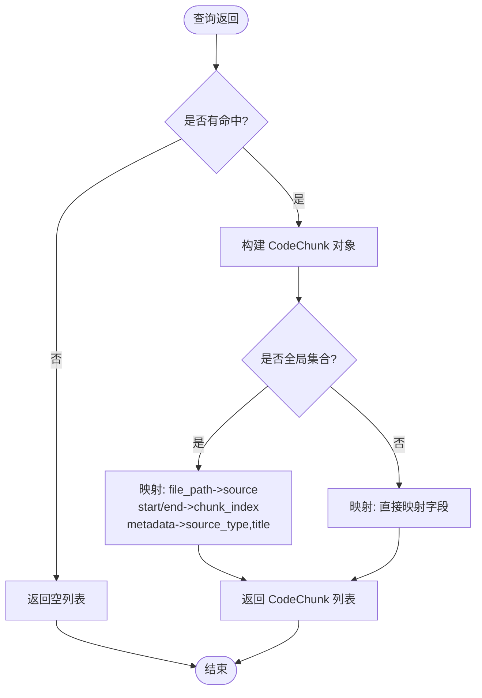
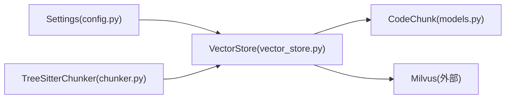

# 向量存储数据模型

<cite>
**本文引用的文件**
- [vector_store.py](file://backend-rag/app/vector_store.py)
- [models.py](file://backend-rag/app/models.py)
- [chunker.py](file://backend-rag/app/chunker.py)
- [config.py](file://backend-rag/app/config.py)
- [test_chunker.py](file://backend-rag/tests/test_chunker.py)
</cite>

## 目录
1. [引言](#引言)
2. [项目结构](#项目结构)
3. [核心组件](#核心组件)
4. [架构总览](#架构总览)
5. [详细组件分析](#详细组件分析)
6. [依赖关系分析](#依赖关系分析)
7. [性能考量](#性能考量)
8. [故障排查指南](#故障排查指南)
9. [结论](#结论)
10. [附录](#附录)

## 引言
本文件系统化梳理向量存储中的数据模型设计，聚焦 VectorStore 类在 Milvus 中使用的集合 Schema，明确工作区集合（workspace_xxx）与全局文档集合（global_documents）的字段定义、数据类型与用途；解释 CodeChunk 实体如何映射到 Milvus 字段，包括 id、embedding、content、file_path、start_line、end_line、node_type、language 等字段的语义；阐述全局文档集合特有字段 source、source_type、title、chunk_index 的设计目的；说明主键设计策略（基于路径+行号或哈希 ID）、向量维度（1536）的选择依据，以及各 VARCHAR 字段长度限制的合理性；最后结合 models.py 中的 CodeChunk Pydantic 模型，阐明从 Milvus 查询结果到业务对象的转换过程。

## 项目结构
- 后端 RAG 应用位于 backend-rag/app，包含向量存储、分块器、模型定义与配置。
- 向量存储模块负责：
  - 基于 Milvus 的工作区集合与全局集合的 Schema 定义与索引创建
  - 文档与代码片段的嵌入生成与插入
  - 查询与结果转换为业务对象
- 分块器模块提供 AST 与文本两种分块策略，输出 CodeChunkData，供向量存储写入使用。
- 配置模块提供嵌入模型、Milvus 连接参数、分块参数等运行时设置。
- Pydantic 模型定义了业务层的数据契约，用于查询响应与请求。

图表来源
- [vector_store.py](file://backend-rag/app/vector_store.py#L42-L469)
- [chunker.py](file://backend-rag/app/chunker.py#L1-L280)
- [models.py](file://backend-rag/app/models.py#L1-L88)
- [config.py](file://backend-rag/app/config.py#L1-L51)

章节来源
- [vector_store.py](file://backend-rag/app/vector_store.py#L42-L119)
- [chunker.py](file://backend-rag/app/chunker.py#L1-L280)
- [models.py](file://backend-rag/app/models.py#L1-L88)
- [config.py](file://backend-rag/app/config.py#L1-L51)

## 核心组件
- VectorStore：封装 Milvus 连接、集合管理、索引创建、嵌入生成、批量写入、查询与结果转换。
- TreeSitterChunker：基于 AST 的代码分块器，输出 CodeChunkData（含 content、file_path、start_line、end_line、node_type、language）。
- CodeChunk：Pydantic 模型，承载检索结果的业务对象（content、file_path、start_line、end_line、score、metadata）。
- Settings：统一读取环境变量，提供嵌入模型、Milvus 连接参数、分块参数等。

章节来源
- [vector_store.py](file://backend-rag/app/vector_store.py#L42-L469)
- [chunker.py](file://backend-rag/app/chunker.py#L14-L267)
- [models.py](file://backend-rag/app/models.py#L12-L20)
- [config.py](file://backend-rag/app/config.py#L6-L51)

## 架构总览
下图展示从代码文件到 Milvus 集合，再到查询返回业务对象的整体流程。

图表来源
- [vector_store.py](file://backend-rag/app/vector_store.py#L121-L204)
- [vector_store.py](file://backend-rag/app/vector_store.py#L377-L435)
- [chunker.py](file://backend-rag/app/chunker.py#L104-L163)

## 详细组件分析

### 工作区集合（workspace_xxx）Schema 设计
- 集合命名策略：以工作区路径的哈希值作为后缀，确保唯一性且可复现。
- 主键设计：VARCHAR 类型的 id，采用“相对路径:起始行-结束行”的组合策略，保证同一文件内不同片段的唯一性，便于定位原始代码范围。
- 字段与类型：
  - id: VARCHAR(256)，主键
  - embedding: FLOAT_VECTOR(1536)，Cosine 距离度量
  - content: VARCHAR(65535)，代码片段文本
  - file_path: VARCHAR(512)，相对路径字符串
  - start_line: INT64，起始行号（1 基）
  - end_line: INT64，结束行号（1 基）
  - node_type: VARCHAR(64)，AST 节点类型或“text_chunk”
  - language: VARCHAR(32)，语言标识
- 索引策略：IVF_FLAT，nlist=1024，Cosine 度量，nprobe 参数在查询时控制召回质量与性能权衡。
- 写入流程：分块器生成 CodeChunkData，向量存储生成 id、embedding，并按字段顺序组织 entities 批量插入。

字段长度合理性说明
- id(256)：足以容纳“相对路径:起始行-结束行”组合，避免截断导致重复。
- content(65535)：满足大多数代码片段大小，配合分块器的 max_chunk_size 控制。
- file_path(512)：覆盖常见项目路径长度。
- node_type(64)：AST 节点类型字符串长度上限。
- language(32)：语言标识字符串长度上限。

章节来源
- [vector_store.py](file://backend-rag/app/vector_store.py#L77-L119)
- [vector_store.py](file://backend-rag/app/vector_store.py#L121-L196)
- [chunker.py](file://backend-rag/app/chunker.py#L14-L267)
- [config.py](file://backend-rag/app/config.py#L35-L40)

### 全局文档集合（global_documents）Schema 设计
- 集合命名：固定为 global_documents。
- 主键设计：VARCHAR 类型的 id，采用“源哈希:分片索引”的组合策略，确保跨源文档的唯一性与可重入性。
- 字段与类型：
  - id: VARCHAR(512)，主键
  - embedding: FLOAT_VECTOR(1536)，Cosine 距离度量
  - content: VARCHAR(65535)，外部文档片段文本
  - source: VARCHAR(1024)，来源标识（如 URL、文件路径、仓库地址）
  - source_type: VARCHAR(32)，来源类型（如 web、pdf、github）
  - title: VARCHAR(512)，标题
  - chunk_index: INT64，分片序号，用于还原原始文档顺序
- 索引策略：与工作区集合一致，IVF_FLAT + Cosine + nlist=1024。
- 写入流程：对输入文本进行分块（考虑段落/句子边界），生成 embedding 与 id，批量插入。

字段长度合理性说明
- id(512)：源哈希+索引组合，兼顾可读性与唯一性。
- content(65535)：满足长文档分块后的文本长度。
- source(1024)：允许较长的 URL 或本地路径。
- source_type(32)：来源类型枚举字符串长度上限。
- title(512)：标题长度上限。
- chunk_index(INT64)：支持大文档的分片编号。

章节来源
- [vector_store.py](file://backend-rag/app/vector_store.py#L206-L239)
- [vector_store.py](file://backend-rag/app/vector_store.py#L241-L288)

### CodeChunk 实体映射与查询结果转换
- CodeChunk 字段：
  - content：检索返回的文本内容
  - file_path：工作区集合中对应 file_path；全局集合中映射为 source
  - start_line / end_line：工作区集合中直接映射；全局集合中映射为 chunk_index
  - score：检索距离（Cosine 下越小越相似，但向量服务内部已按相似度处理）
  - metadata：附加元信息（工作区集合包含 node_type、language；全局集合包含 source_type、title）
- 映射规则：
  - 工作区集合查询：output_fields 包含 content、file_path、start_line、end_line、node_type、language，直接填充到 CodeChunk。
  - 全局集合查询：output_fields 包含 content、source、source_type、title、chunk_index，其中 file_path 映射为 source，start_line/end_line 映射为 chunk_index，metadata 映射为 source_type/title。
- 注意：Cosine 距离在 Milvus 中越小越相似，向量服务内部将其作为相似度使用，最终 score 为浮点相似度。

图表来源
- [vector_store.py](file://backend-rag/app/vector_store.py#L377-L435)
- [vector_store.py](file://backend-rag/app/vector_store.py#L323-L376)
- [models.py](file://backend-rag/app/models.py#L12-L20)

章节来源
- [vector_store.py](file://backend-rag/app/vector_store.py#L323-L435)
- [models.py](file://backend-rag/app/models.py#L12-L20)

### 分块器与主键生成策略
- 分块器（TreeSitterChunker）：
  - 优先使用 AST（tree-sitter）按函数、类等逻辑单元分块，提升语义完整性
  - 不支持语言回退到文本分块，按行与字符数控制 chunk 大小与重叠
  - 输出 CodeChunkData，包含 content、file_path、start_line、end_line、node_type、language
- 主键生成：
  - 工作区集合：id = “相对路径:起始行-结束行”，确保同一文件片段唯一
  - 全局集合：id = “源哈希:分片索引”，确保跨源文档唯一
- 行号语义：start_line/end_line 为 1 基，与分块器生成保持一致

章节来源
- [chunker.py](file://backend-rag/app/chunker.py#L14-L267)
- [vector_store.py](file://backend-rag/app/vector_store.py#L172-L186)
- [vector_store.py](file://backend-rag/app/vector_store.py#L268-L269)
- [test_chunker.py](file://backend-rag/tests/test_chunker.py#L1-L87)

### 向量维度与索引选择
- 向量维度：1536，对应 text-embedding-3-small 模型输出维度，由配置项 embedding_model 与 Settings 提供。
- 索引类型：IVF_FLAT，nlist=1024，Cosine 距离度量；查询时通过 nprobe 控制召回质量与性能。
- 选择依据：
  - 维度与嵌入模型匹配，保证检索效果与兼容性
  - IVF_FLAT 在中小规模数据上实现简单、稳定，适合开发与演示场景
  - nlist 与 nprobe 需结合数据规模与延迟要求调优

章节来源
- [vector_store.py](file://backend-rag/app/vector_store.py#L50-L50)
- [vector_store.py](file://backend-rag/app/vector_store.py#L110-L116)
- [vector_store.py](file://backend-rag/app/vector_store.py#L230-L236)
- [config.py](file://backend-rag/app/config.py#L10-L12)

## 依赖关系分析
- VectorStore 依赖：
  - 配置：Settings 提供 embedding_model、milvus_*、max_chunk_size、chunk_overlap、default_top_k
  - 分块器：TreeSitterChunker 生成 CodeChunkData
  - Pydantic：CodeChunk 作为业务对象
- 分块器依赖：
  - tree-sitter 语言解析库（若不可用则回退文本分块）
- 查询链路：
  - VectorStore.query / query_global -> Milvus search -> 返回命中 -> 转换为 CodeChunk

图表来源
- [config.py](file://backend-rag/app/config.py#L6-L51)
- [chunker.py](file://backend-rag/app/chunker.py#L60-L115)
- [vector_store.py](file://backend-rag/app/vector_store.py#L42-L119)
- [models.py](file://backend-rag/app/models.py#L12-L20)

章节来源
- [config.py](file://backend-rag/app/config.py#L6-L51)
- [chunker.py](file://backend-rag/app/chunker.py#L60-L115)
- [vector_store.py](file://backend-rag/app/vector_store.py#L42-L119)
- [models.py](file://backend-rag/app/models.py#L12-L20)

## 性能考量
- 向量维度与模型：1536 维度与 text-embedding-3-small 模型匹配，兼顾精度与资源占用。
- 索引参数：IVF_FLAT + nlist=1024，nprobe 可在查询时调整以平衡召回率与延迟。
- 分块策略：AST 优先可减少无关上下文，提高检索相关性；文本分块时的重叠有助于上下文连续性。
- 写入批量化：entities 批量插入，flush 提升吞吐；建议根据 Milvus 配置与硬件资源调优批量大小。
- 健康检查：is_healthy 通过连接与列举集合验证 Milvus 可用性。

章节来源
- [vector_store.py](file://backend-rag/app/vector_store.py#L377-L435)
- [vector_store.py](file://backend-rag/app/vector_store.py#L448-L457)
- [config.py](file://backend-rag/app/config.py#L35-L40)

## 故障排查指南
- Milvus 连接失败：检查 Settings 中 milvus_host/port/user/password/db_name 是否正确；确认 is_healthy 返回 True。
- 集合不存在或未创建：首次使用会自动创建集合与索引；若异常，清理缓存集合字典后重试。
- 查询无结果：确认集合是否已加载（load）且存在实体（num_entities > 0）；检查查询向量生成是否成功。
- 结果转换异常：核对 output_fields 与 CodeChunk 字段映射关系；全局集合需注意 file_path/source 与 start/end_line/chunk_index 的映射。
- 分块器不可用：若 tree-sitter 解析库缺失，将回退到文本分块；可通过日志观察初始化状态。

章节来源
- [vector_store.py](file://backend-rag/app/vector_store.py#L52-L67)
- [vector_store.py](file://backend-rag/app/vector_store.py#L377-L435)
- [chunker.py](file://backend-rag/app/chunker.py#L72-L98)

## 结论
本数据模型围绕 VectorStore 的两类集合（workspace_xxx 与 global_documents）展开，明确了字段定义、数据类型与用途，并将 CodeChunk 实体与 Milvus 字段建立清晰映射关系。主键设计兼顾唯一性与可定位性，向量维度与索引策略与嵌入模型相匹配。通过分块器与查询结果转换流程，实现了从代码/文档到可解释检索结果的完整闭环。后续可在大规模场景下评估替换为更高效的索引类型（如 HNSW 或 GPU 加速）与动态 nprobe 调参策略。

## 附录

### 字段定义与用途对照表
- 工作区集合（workspace_xxx）
  - id：VARCHAR(256)，主键，格式为“相对路径:起始行-结束行”
  - embedding：FLOAT_VECTOR(1536)，Cosine 度量
  - content：VARCHAR(65535)，代码片段文本
  - file_path：VARCHAR(512)，相对路径
  - start_line / end_line：INT64，1 基行号
  - node_type：VARCHAR(64)，AST 节点类型或“text_chunk”
  - language：VARCHAR(32)，语言标识
- 全局文档集合（global_documents）
  - id：VARCHAR(512)，主键，格式为“源哈希:分片索引”
  - embedding：FLOAT_VECTOR(1536)，Cosine 度量
  - content：VARCHAR(65535)，文档片段文本
  - source：VARCHAR(1024)，来源标识
  - source_type：VARCHAR(32)，来源类型
  - title：VARCHAR(512)，标题
  - chunk_index：INT64，分片序号

章节来源
- [vector_store.py](file://backend-rag/app/vector_store.py#L95-L104)
- [vector_store.py](file://backend-rag/app/vector_store.py#L217-L225)