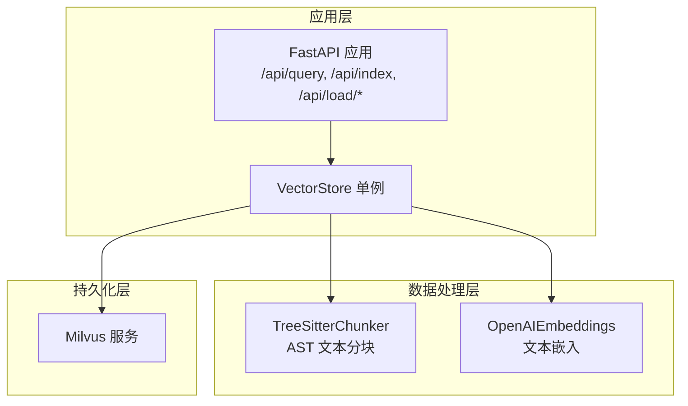
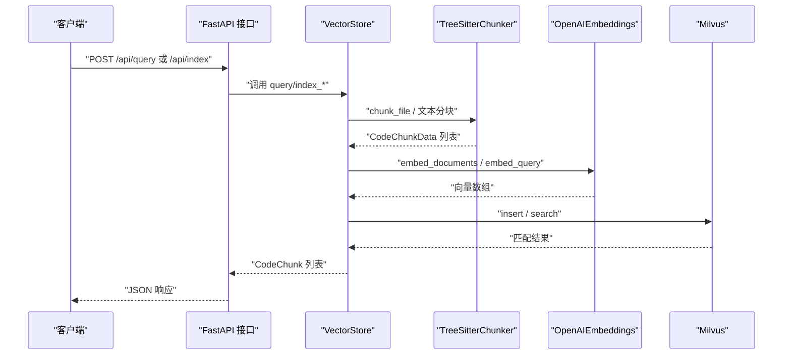
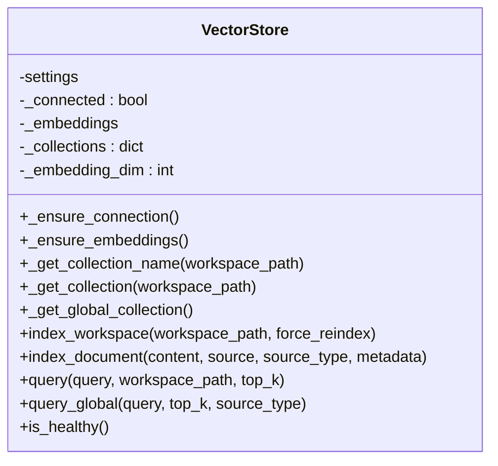
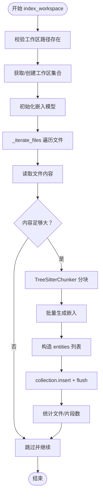
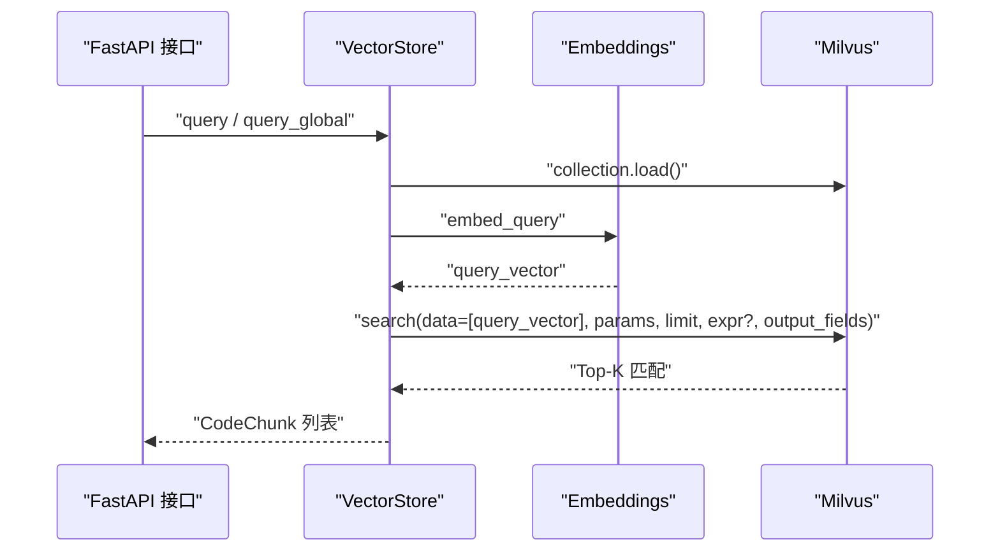
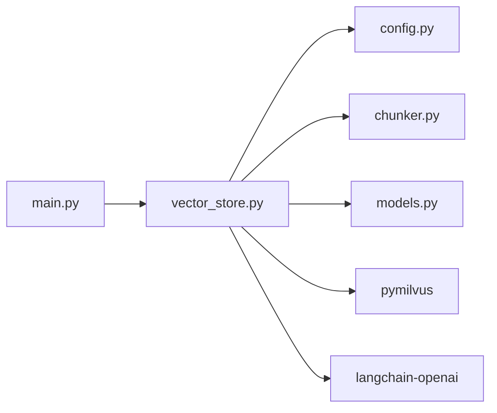

# 向量存储机制

<cite>
**本文引用的文件**
- [backend-rag/app/vector_store.py](file://backend-rag/app/vector_store.py)
- [backend-rag/app/chunker.py](file://backend-rag/app/chunker.py)
- [backend-rag/app/config.py](file://backend-rag/app/config.py)
- [backend-rag/app/models.py](file://backend-rag/app/models.py)
- [backend-rag/app/main.py](file://backend-rag/app/main.py)
- [backend-rag/pyproject.toml](file://backend-rag/pyproject.toml)
- [backend-rag/.env.example](file://backend-rag/.env.example)
</cite>

## 目录
1. [简介](#简介)
2. [项目结构](#项目结构)
3. [核心组件](#核心组件)
4. [架构总览](#架构总览)
5. [详细组件分析](#详细组件分析)
6. [依赖关系分析](#依赖关系分析)
7. [性能考虑](#性能考虑)
8. [故障排查指南](#故障排查指南)
9. [结论](#结论)
10. [附录](#附录)

## 简介
本文件系统化文档化基于 Milvus 的向量存储实现，重点围绕 VectorStore 类如何使用 Milvus 作为持久化层，覆盖以下主题：
- 如何通过 _get_collection 和 _get_global_collection 为不同工作区与外部文档创建独立集合
- index_workspace 与 index_document 的数据处理链路：文件遍历、内容读取、分块、嵌入生成、Milvus 插入
- 查询机制 query 与 query_global 的语义搜索流程及返回的 CodeChunk 对象
- 集合 Schema 设计、索引参数（IVF_FLAT、COSINE）、性能调优建议
- 健康检查 is_healthy 与连接管理 _ensure_connection 的实现

## 项目结构
后端 RAG 服务采用 FastAPI 提供接口，向量存储位于 backend-rag/app/vector_store.py，配合分块器、配置与模型定义共同完成代码与文档的向量化检索。

图表来源
- [backend-rag/app/main.py](file://backend-rag/app/main.py#L65-L119)
- [backend-rag/app/vector_store.py](file://backend-rag/app/vector_store.py#L121-L204)
- [backend-rag/app/chunker.py](file://backend-rag/app/chunker.py#L104-L163)

章节来源
- [backend-rag/app/main.py](file://backend-rag/app/main.py#L65-L119)
- [backend-rag/app/vector_store.py](file://backend-rag/app/vector_store.py#L121-L204)
- [backend-rag/app/chunker.py](file://backend-rag/app/chunker.py#L104-L163)

## 核心组件
- VectorStore：封装 Milvus 连接、集合管理、分块、嵌入、索引与查询逻辑
- TreeSitterChunker：基于 AST 的代码分块器，支持多种语言的逻辑边界分块
- Settings：从环境变量加载的配置项，包括 Milvus 连接信息、嵌入模型、分块参数等
- CodeChunk：查询结果的统一数据模型

章节来源
- [backend-rag/app/vector_store.py](file://backend-rag/app/vector_store.py#L42-L51)
- [backend-rag/app/chunker.py](file://backend-rag/app/chunker.py#L14-L23)
- [backend-rag/app/config.py](file://backend-rag/app/config.py#L6-L20)
- [backend-rag/app/models.py](file://backend-rag/app/models.py#L12-L20)

## 架构总览
VectorStore 将“文件/文档”转换为“代码片段或文本片段”，生成向量嵌入后写入 Milvus；查询时同样生成查询向量，执行语义相似度搜索并返回标准化的 CodeChunk 结果。

图表来源
- [backend-rag/app/main.py](file://backend-rag/app/main.py#L65-L119)
- [backend-rag/app/vector_store.py](file://backend-rag/app/vector_store.py#L121-L204)
- [backend-rag/app/chunker.py](file://backend-rag/app/chunker.py#L104-L163)

## 详细组件分析

### VectorStore 类与集合管理
- 连接管理：_ensure_connection 在首次使用时建立 Milvus 连接，并记录日志
- 集合命名：_get_collection_name 使用工作区路径的哈希生成稳定集合名，避免路径过长问题
- 工作区集合：_get_collection 为每个工作区创建独立集合，字段包含主键 id、向量 embedding、内容 content、文件路径 file_path、行号 start_line/end_line、节点类型 node_type、语言 language
- 全局集合：_get_global_collection 为外部文档创建全局集合，字段包含 id、embedding、content、source、source_type、title、chunk_index
- 索引策略：对 embedding 字段使用 IVF_FLAT + COSINE，nlist 默认 1024；nprobe 可在查询时调整以平衡速度与召回
- 嵌入维度：固定为 1536（对应 text-embedding-3-small）

图表来源
- [backend-rag/app/vector_store.py](file://backend-rag/app/vector_store.py#L42-L51)
- [backend-rag/app/vector_store.py](file://backend-rag/app/vector_store.py#L77-L119)
- [backend-rag/app/vector_store.py](file://backend-rag/app/vector_store.py#L206-L239)

章节来源
- [backend-rag/app/vector_store.py](file://backend-rag/app/vector_store.py#L52-L67)
- [backend-rag/app/vector_store.py](file://backend-rag/app/vector_store.py#L77-L119)
- [backend-rag/app/vector_store.py](file://backend-rag/app/vector_store.py#L206-L239)

### 集合 Schema 与索引参数
- 工作区集合 Schema（字段与长度限制）
  - id：VARCHAR 主键，最大长度 256
  - embedding：FLOAT_VECTOR，维度 1536
  - content：VARCHAR，最大长度 65535
  - file_path：VARCHAR，最大长度 512
  - start_line / end_line：INT64
  - node_type：VARCHAR，最大长度 64
  - language：VARCHAR，最大长度 32
- 全局集合 Schema（字段与长度限制）
  - id：VARCHAR 主键，最大长度 512
  - embedding：FLOAT_VECTOR，维度 1536
  - content：VARCHAR，最大长度 65535
  - source：VARCHAR，最大长度 1024
  - source_type：VARCHAR，最大长度 32
  - title：VARCHAR，最大长度 512
  - chunk_index：INT64
- 索引参数
  - index_type：IVF_FLAT
  - metric_type：COSINE
  - params：nlist=1024（训练/构建时 nlist 建议与数据规模匹配）
  - 查询时 search_params：metric_type=COSINE，nprobe=10（可按需调大提升召回）

章节来源
- [backend-rag/app/vector_store.py](file://backend-rag/app/vector_store.py#L95-L115)
- [backend-rag/app/vector_store.py](file://backend-rag/app/vector_store.py#L217-L235)
- [backend-rag/app/vector_store.py](file://backend-rag/app/vector_store.py#L339-L342)
- [backend-rag/app/vector_store.py](file://backend-rag/app/vector_store.py#L397-L400)

### 数据处理流程：index_workspace
- 文件遍历：_iterate_files 递归扫描工作区，忽略指定目录，仅处理可索引扩展名
- 内容读取：UTF-8 读取，忽略错误字符；跳过极小文件
- 分块：使用 TreeSitterChunker.chunk_file 获取 CodeChunkData 列表
- 嵌入：OpenAIEmbeddings.embed_documents 批量生成向量
- 插入：构造 entities（id、embedding、content、file_path、start_line、end_line、node_type、language），插入 Milvus 并 flush
- 统计：累计已处理文件数与生成的代码片段数

图表来源
- [backend-rag/app/vector_store.py](file://backend-rag/app/vector_store.py#L121-L204)
- [backend-rag/app/vector_store.py](file://backend-rag/app/vector_store.py#L436-L447)
- [backend-rag/app/chunker.py](file://backend-rag/app/chunker.py#L104-L163)

章节来源
- [backend-rag/app/vector_store.py](file://backend-rag/app/vector_store.py#L121-L204)
- [backend-rag/app/vector_store.py](file://backend-rag/app/vector_store.py#L436-L447)
- [backend-rag/app/chunker.py](file://backend-rag/app/chunker.py#L104-L163)

### 数据处理流程：index_document
- 文本分块：_split_text 按段落/句子边界进行重叠分块
- 嵌入：embed_documents 批量生成向量
- 插入：构造 entities（id、embedding、content、source、source_type、title、chunk_index），插入 Milvus 并 flush
- 返回：返回生成的片段数量

章节来源
- [backend-rag/app/vector_store.py](file://backend-rag/app/vector_store.py#L241-L288)
- [backend-rag/app/vector_store.py](file://backend-rag/app/vector_store.py#L289-L321)

### 查询机制：query 与 query_global
- 加载集合：collection.load 确保集合可用
- 空集合处理：若 num_entities==0，直接返回空列表
- 生成查询向量：embed_query
- 搜索参数：metric_type=COSINE，nprobe=10（可调）
- 过滤：query_global 支持按 source_type 过滤表达式
- 输出字段：query 返回 content、file_path、start_line、end_line、node_type、language；query_global 返回 content、source、source_type、title、chunk_index
- 结果映射：将 Milvus 命中结果转换为 CodeChunk，其中距离即为相似度分数

图表来源
- [backend-rag/app/vector_store.py](file://backend-rag/app/vector_store.py#L377-L435)
- [backend-rag/app/vector_store.py](file://backend-rag/app/vector_store.py#L323-L376)
- [backend-rag/app/models.py](file://backend-rag/app/models.py#L12-L20)

章节来源
- [backend-rag/app/vector_store.py](file://backend-rag/app/vector_store.py#L377-L435)
- [backend-rag/app/vector_store.py](file://backend-rag/app/vector_store.py#L323-L376)
- [backend-rag/app/models.py](file://backend-rag/app/models.py#L12-L20)

### 健康检查与连接管理
- is_healthy：确保连接后尝试列出集合，异常则判定不健康
- _ensure_connection：延迟连接，使用配置中的主机、端口、用户、密码、数据库名

章节来源
- [backend-rag/app/vector_store.py](file://backend-rag/app/vector_store.py#L448-L457)
- [backend-rag/app/vector_store.py](file://backend-rag/app/vector_store.py#L52-L67)
- [backend-rag/app/config.py](file://backend-rag/app/config.py#L13-L19)

## 依赖关系分析
- 外部库
  - pymilvus：Milvus 客户端（连接、集合、字段、索引、搜索）
  - langchain-openai：OpenAIEmbeddings 嵌入模型
  - tree-sitter：AST 解析与分块
- 内部模块
  - config：Settings 读取环境变量
  - chunker：TreeSitterChunker 提供分块能力
  - models：CodeChunk 作为统一输出模型
  - main：FastAPI 路由调用 VectorStore

图表来源
- [backend-rag/app/vector_store.py](file://backend-rag/app/vector_store.py#L10-L23)
- [backend-rag/app/main.py](file://backend-rag/app/main.py#L1-L26)

章节来源
- [backend-rag/app/vector_store.py](file://backend-rag/app/vector_store.py#L10-L23)
- [backend-rag/pyproject.toml](file://backend-rag/pyproject.toml#L8-L20)
- [backend-rag/app/main.py](file://backend-rag/app/main.py#L1-L26)

## 性能考虑
- 索引参数
  - nlist：控制倒排表数量，越大越精细但内存与构建时间更高；建议与数据规模匹配
  - nprobe：查询时探测的倒排表数量，越大召回越高但耗时增加；默认 10 可按需调大
  - metric_type：COSINE 适合归一化后的向量，与 OpenAIEmbeddings 输出兼容
- 分块策略
  - max_chunk_size 与 chunk_overlap：影响召回粒度与上下文连续性，需结合任务权衡
  - AST 分块优先于纯文本分块，能更好地保留逻辑单元
- 写入优化
  - 批量插入 entities，减少网络往返
  - flush 在写入后触发，保证可见性；生产环境可评估批量 flush 策略
- 查询优化
  - 预先 load 集合并检查 num_entities，避免无效查询
  - 适当增大 nprobe 提升召回，同时监控延迟
- 环境配置
  - OPENAI_API_KEY、MILVUS_*、MAX_CHUNK_SIZE、CHUNK_OVERLAP、DEFAULT_TOP_K 等通过 .env 控制

章节来源
- [backend-rag/app/vector_store.py](file://backend-rag/app/vector_store.py#L110-L115)
- [backend-rag/app/vector_store.py](file://backend-rag/app/vector_store.py#L339-L342)
- [backend-rag/app/vector_store.py](file://backend-rag/app/vector_store.py#L397-L400)
- [backend-rag/app/chunker.py](file://backend-rag/app/chunker.py#L60-L71)
- [backend-rag/app/config.py](file://backend-rag/app/config.py#L6-L20)
- [backend-rag/.env.example](file://backend-rag/.env.example#L1-L27)

## 故障排查指南
- 连接失败
  - 检查 Milvus 地址、端口、用户、密码、数据库名是否正确
  - 使用 is_healthy 快速验证连接状态
- 查询无结果
  - 确认集合已创建且有实体（num_entities>0）
  - 检查查询向量生成是否成功
  - 适当增大 nprobe 提升召回
- 写入异常
  - 检查文件编码与大小过滤逻辑
  - 确认 entities 字段顺序与 Schema 一致
- 健康检查
  - main.py 中 /health 调用 is_healthy，返回 chroma_connected（兼容字段名）

章节来源
- [backend-rag/app/vector_store.py](file://backend-rag/app/vector_store.py#L448-L457)
- [backend-rag/app/main.py](file://backend-rag/app/main.py#L55-L63)

## 结论
VectorStore 通过 Milvus 实现了面向代码与外部文档的语义检索能力。其设计要点包括：
- 以工作区为单位的集合隔离，以及全局集合用于外部文档
- 基于 AST 的分块与 OpenAI 嵌入，兼顾语义与逻辑边界
- 明确的 Schema 与 IVF_FLAT+COSINE 索引策略，便于性能调优
- 清晰的查询与写入流程，支持灵活的过滤与排序

通过合理设置分块参数、索引参数与查询参数，可在准确率与性能之间取得良好平衡。

## 附录
- 环境变量示例与默认值参考 .env.example
- 依赖包清单参考 pyproject.toml

章节来源
- [backend-rag/.env.example](file://backend-rag/.env.example#L1-L27)
- [backend-rag/pyproject.toml](file://backend-rag/pyproject.toml#L8-L20)