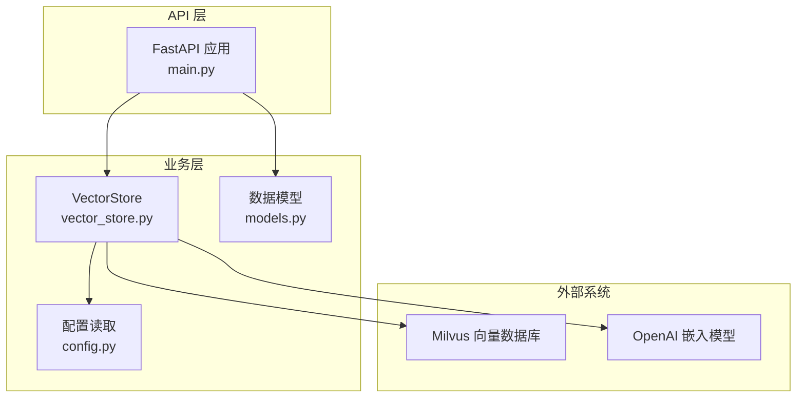
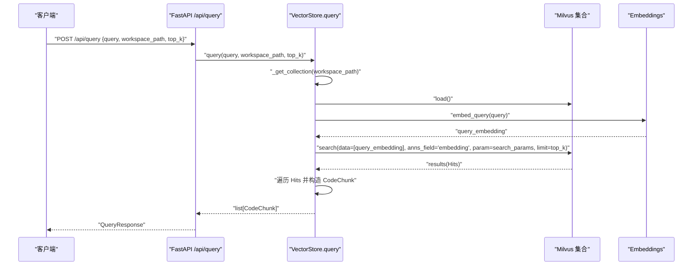
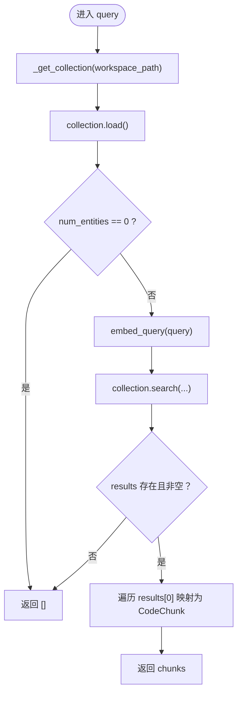
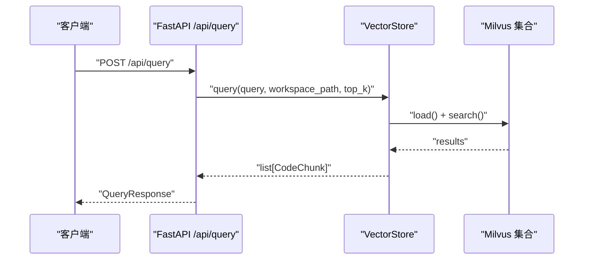
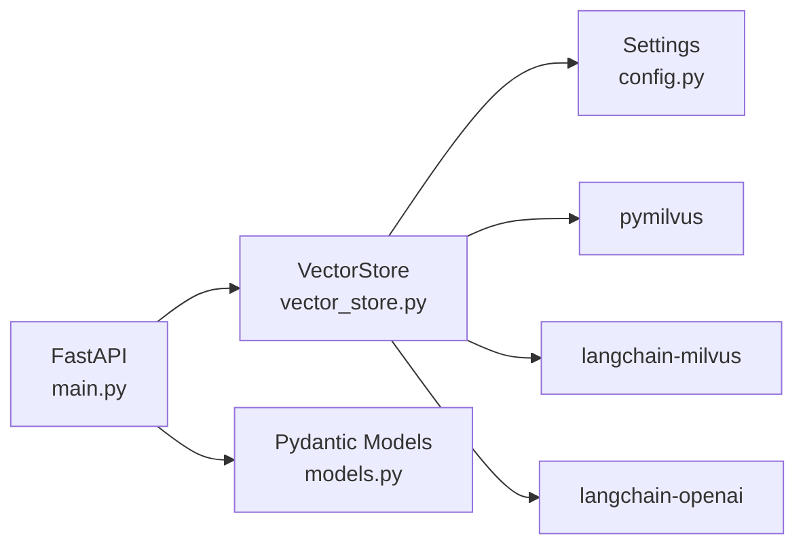

# 查询接口

<cite>
**本文引用的文件**
- [vector_store.py](file://backend-rag/app/vector_store.py)
- [main.py](file://backend-rag/app/main.py)
- [models.py](file://backend-rag/app/models.py)
- [config.py](file://backend-rag/app/config.py)
- [pyproject.toml](file://backend-rag/pyproject.toml)
- [.env.example](file://backend-rag/.env.example)
- [chunker.py](file://backend-rag/app/chunker.py)
</cite>

## 目录
1. [简介](#简介)
2. [项目结构](#项目结构)
3. [核心组件](#核心组件)
4. [架构总览](#架构总览)
5. [详细组件分析](#详细组件分析)
6. [依赖关系分析](#依赖关系分析)
7. [性能考量](#性能考量)
8. [故障排查指南](#故障排查指南)
9. [结论](#结论)
10. [附录](#附录)

## 简介
本文件系统性文档化向量存储的查询能力，重点解析两个查询方法：
- query：按工作区路径定位特定 Milvus 集合，加载集合到内存，使用 COSINE 相似度在 embedding 字段上执行近似最近邻搜索（ANN），并把 Milvus 返回的命中结果转换为 CodeChunk 对象。
- query_global：在全局文档集合上进行查询，支持通过 source_type 构建过滤表达式（expr）进行筛选。

同时，本文说明 search_params 中 nprobe 参数对查询性能与召回精度的影响，以及异常处理、空结果处理（num_entities 检查）、性能考量（如 load() 调用的必要性）等关键点，并提供典型查询场景与优化建议。

## 项目结构
后端 RAG 服务采用 FastAPI 提供 API，向量存储由 Milvus 实现，嵌入模型来自 OpenAI。查询流程从 API 层进入，经由向量存储层完成 Milvus 查询与结果转换。



图表来源
- [main.py](file://backend-rag/app/main.py#L65-L90)
- [vector_store.py](file://backend-rag/app/vector_store.py#L377-L435)
- [config.py](file://backend-rag/app/config.py#L1-L51)

章节来源
- [main.py](file://backend-rag/app/main.py#L65-L90)
- [vector_store.py](file://backend-rag/app/vector_store.py#L377-L435)
- [config.py](file://backend-rag/app/config.py#L1-L51)

## 核心组件
- VectorStore：封装 Milvus 连接、集合管理、索引创建、查询与结果转换。
- FastAPI 接口：/api/query 调用 VectorStore.query；/api/load/* 系列接口用于加载外部文档到全局集合。
- 数据模型：QueryRequest、QueryResponse、CodeChunk 定义请求与响应结构。

章节来源
- [vector_store.py](file://backend-rag/app/vector_store.py#L42-L119)
- [main.py](file://backend-rag/app/main.py#L65-L90)
- [models.py](file://backend-rag/app/models.py#L5-L25)

## 架构总览
下图展示查询链路：API 接收请求，生成 top_k，调用 VectorStore.query；VectorStore 获取集合、加载、生成查询向量、执行 Milvus ANN 搜索，再将命中结果映射为 CodeChunk 返回。



图表来源
- [main.py](file://backend-rag/app/main.py#L65-L90)
- [vector_store.py](file://backend-rag/app/vector_store.py#L377-L435)

## 详细组件分析

### query 方法：工作区集合查询
- 集合定位与创建
  - 通过工作区路径生成唯一集合名（基于哈希），若不存在则创建集合并建立 COSINE 度量的 IVF_FLAT 索引。
- 加载集合到内存
  - 在查询前调用 load()，确保集合已加载，避免后续搜索失败或性能异常。
- 生成查询向量
  - 使用嵌入模型生成查询文本的向量表示。
- 执行 ANN 搜索
  - 使用 COSINE 度量，search_params 包含 metric_type 和 nprobe。
- 结果转换
  - 将 Milvus 的命中结果映射为 CodeChunk，字段包括 content、file_path、start_line、end_line、score、metadata。
  - 对于 COSINE 度量，Milvus 返回的距离值即为相似度（越大越相关），直接转换为 score。
- 异常与空结果处理
  - 捕获异常并记录错误日志，返回空列表。
  - 若集合实体数为 0，则直接返回空列表。



图表来源
- [vector_store.py](file://backend-rag/app/vector_store.py#L377-L435)

章节来源
- [vector_store.py](file://backend-rag/app/vector_store.py#L377-L435)

### query_global 方法：全局文档集合查询
- 全局集合管理
  - 全局集合名为固定字符串，schema 包含 source、source_type、title 等字段，同样使用 COSINE 度量与 IVF_FLAT 索引。
- 过滤表达式（expr）
  - 当传入 source_type 时，动态构建 expr 为字符串表达式，仅检索指定来源类型的数据。
- 加载与空结果
  - 同样先 load()，再检查 num_entities，为空则返回 []。
- 搜索与结果映射
  - 使用相同的 COSINE 度量与 nprobe 参数，输出字段包含 content、source、source_type、title、chunk_index。
  - 将命中结果映射为 CodeChunk，score 来自 hit.distance。

```mermaid
flowchart TD
Start(["进入 query_global"]) --> GetGCOL["_get_global_collection()"]
GetGCOL --> Load["collection.load()"]
Load --> CheckEmpty{"num_entities == 0 ?"}
CheckEmpty --> |是| ReturnEmpty["返回 []"]
CheckEmpty --> |否| Embed["embed_query(query)"]
Embed --> Expr{"是否提供 source_type ?"}
Expr --> |是| BuildExpr["expr = f'source_type == \"{source_type}\"'"]
Expr --> |否| NoExpr["expr = None"]
BuildExpr --> Search["collection.search(..., expr=expr, ... )"]
NoExpr --> Search
Search --> HasResults{"results 存在且非空？"}
HasResults --> |否| ReturnEmpty
HasResults --> |是| Map["遍历 results[0] 映射为 CodeChunk"]
Map --> Return["返回 chunks"]
```

图表来源
- [vector_store.py](file://backend-rag/app/vector_store.py#L323-L376)

章节来源
- [vector_store.py](file://backend-rag/app/vector_store.py#L323-L376)

### API 层对接
- /api/query
  - 从请求体读取 query、workspace_path、top_k（默认取配置），调用 VectorStore.query 并返回 QueryResponse。
- /api/load/*
  - 提供多种加载入口，最终都会调用 VectorStore.index_document 将内容分块并写入全局集合。



图表来源
- [main.py](file://backend-rag/app/main.py#L65-L90)
- [vector_store.py](file://backend-rag/app/vector_store.py#L377-L435)

章节来源
- [main.py](file://backend-rag/app/main.py#L65-L90)
- [vector_store.py](file://backend-rag/app/vector_store.py#L323-L376)

## 依赖关系分析
- 外部依赖
  - Milvus：pymilvus、langchain-milvus
  - 嵌入模型：langchain-openai
  - FastAPI：提供 API 服务
- 内部依赖
  - VectorStore 依赖配置（host/port/user/password/db_name）、嵌入模型、集合 schema 与索引参数。
  - API 层依赖 VectorStore 单例与数据模型。



图表来源
- [vector_store.py](file://backend-rag/app/vector_store.py#L42-L119)
- [config.py](file://backend-rag/app/config.py#L1-L51)
- [pyproject.toml](file://backend-rag/pyproject.toml#L1-L38)
- [main.py](file://backend-rag/app/main.py#L65-L90)
- [models.py](file://backend-rag/app/models.py#L5-L25)

章节来源
- [pyproject.toml](file://backend-rag/pyproject.toml#L1-L38)
- [vector_store.py](file://backend-rag/app/vector_store.py#L42-L119)
- [config.py](file://backend-rag/app/config.py#L1-L51)
- [main.py](file://backend-rag/app/main.py#L65-L90)
- [models.py](file://backend-rag/app/models.py#L5-L25)

## 性能考量

### nprobe 参数对性能与精度的影响
- nprobe 控制扫描的倒排表簇数量，直接影响召回与延迟：
  - 较小 nprobe：更快但召回可能不足，易漏掉高分候选。
  - 较大 nprobe：召回更充分，但搜索耗时增加。
- 默认值与建议
  - 当前实现中 nprobe 设为固定值，适合通用场景；在高并发或大规模集合上可考虑动态调整或按业务阈值调参。
- 与索引类型的关系
  - IVF_FLAT 为多候选簇检索，nprobe 是关键超参；若切换为其他索引类型（如 HNSW 或 ANNOY），nprobe 的含义与效果会不同。

章节来源
- [vector_store.py](file://backend-rag/app/vector_store.py#L397-L400)
- [vector_store.py](file://backend-rag/app/vector_store.py#L339-L342)

### load() 调用的必要性
- 在查询前调用 load() 可确保集合已加载到内存，避免因未加载导致的搜索失败或性能抖动。
- 对于冷启动或长时间未访问的集合，load() 是必要的预热步骤。

章节来源
- [vector_store.py](file://backend-rag/app/vector_store.py#L388-L391)
- [vector_store.py](file://backend-rag/app/vector_store.py#L333-L336)

### num_entities 空集合检查
- 在加载集合后检查 num_entities 是否为 0，若为空则直接返回空结果，避免无效搜索与资源浪费。

章节来源
- [vector_store.py](file://backend-rag/app/vector_store.py#L388-L391)
- [vector_store.py](file://backend-rag/app/vector_store.py#L333-L336)

### COSINE 相似度与距离值
- Milvus 的 COSINE 度量下，返回的距离值即为相似度（数值越大越相关），无需额外转换即可作为 score 使用。

章节来源
- [vector_store.py](file://backend-rag/app/vector_store.py#L414-L417)
- [vector_store.py](file://backend-rag/app/vector_store.py#L364-L364)

### 嵌入模型与维度
- 默认嵌入维度与模型来自配置，需与 Milvus 集合 embedding 字段维度一致，否则会导致插入/查询失败。

章节来源
- [vector_store.py](file://backend-rag/app/vector_store.py#L48-L51)
- [config.py](file://backend-rag/app/config.py#L9-L12)

## 故障排查指南

### 常见问题与处理
- Milvus 连接失败
  - 检查环境变量与配置项（host/port/user/password/db_name），确认服务可达。
- 集合未创建或未加载
  - 确认集合命名规则与首次查询触发的自动创建逻辑；必要时手动触发索引创建。
- 查询无结果
  - 检查 num_entities 是否为 0；确认已加载集合；核对查询语句与 source_type 过滤条件。
- 嵌入模型不可用
  - 确认 OPENAI_API_KEY 设置正确；检查网络连通性与模型可用性。
- 性能不达标
  - 调整 nprobe；评估集合规模与索引参数；监控 Milvus 集群状态。

章节来源
- [config.py](file://backend-rag/app/config.py#L9-L19)
- [.env.example](file://backend-rag/.env.example#L1-L27)
- [vector_store.py](file://backend-rag/app/vector_store.py#L377-L435)
- [vector_store.py](file://backend-rag/app/vector_store.py#L323-L376)

## 结论
- query 与 query_global 均采用 COSINE 度量与 IVF_FLAT 索引，通过 nprobe 控制召回与性能平衡。
- 查询前的 load() 与 num_entities 检查是保障稳定性的关键步骤。
- Milvus 返回的距离值在 COSINE 下即为相似度，可直接映射为 score。
- 建议在生产环境中结合业务场景动态调优 nprobe，并完善监控与告警。

## 附录

### API 定义与示例路径
- 查询接口
  - POST /api/query
  - 请求体字段：query、workspace_path、top_k
  - 响应体字段：chunks（list[CodeChunk]）
  - 示例路径：[main.py](file://backend-rag/app/main.py#L65-L90)
- 全局文档查询
  - 查询参数：query、top_k、可选 source_type
  - 示例路径：[vector_store.py](file://backend-rag/app/vector_store.py#L323-L376)
- 加载接口（用于填充全局集合）
  - POST /api/load/web、/api/load/github、/api/load/pdf、/api/load/url
  - 示例路径：[main.py](file://backend-rag/app/main.py#L143-L343)

章节来源
- [main.py](file://backend-rag/app/main.py#L65-L90)
- [main.py](file://backend-rag/app/main.py#L143-L343)
- [vector_store.py](file://backend-rag/app/vector_store.py#L323-L376)

### 关键实现路径参考
- 查询方法实现：[vector_store.py](file://backend-rag/app/vector_store.py#L377-L435)
- 全局查询方法实现：[vector_store.py](file://backend-rag/app/vector_store.py#L323-L376)
- 配置读取：[config.py](file://backend-rag/app/config.py#L1-L51)
- 数据模型定义：[models.py](file://backend-rag/app/models.py#L5-L25)
- 依赖声明：[pyproject.toml](file://backend-rag/pyproject.toml#L1-L38)
- 环境变量示例：[.env.example](file://backend-rag/.env.example#L1-L27)
- 分块器（用于理解数据结构）：[chunker.py](file://backend-rag/app/chunker.py#L14-L23)