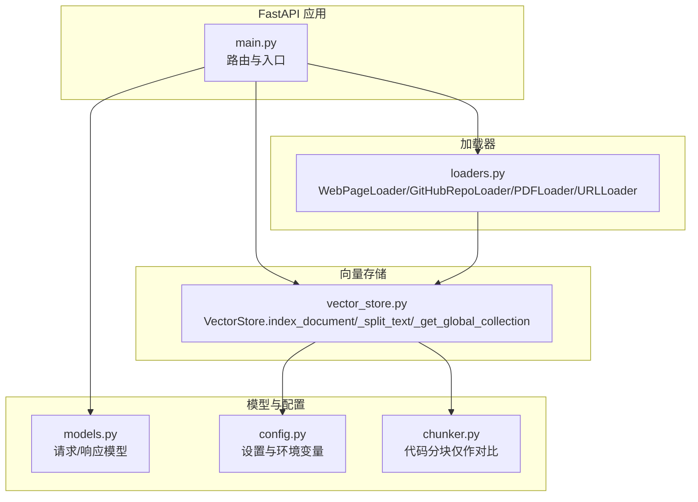
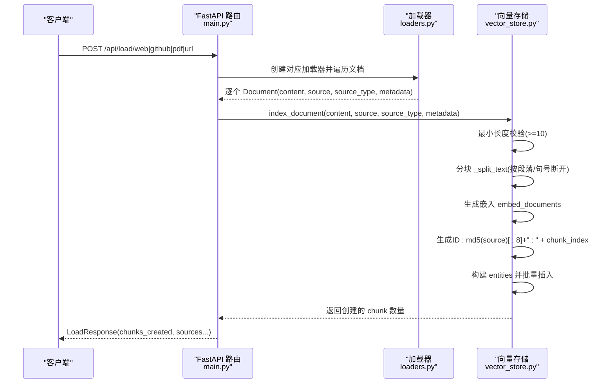
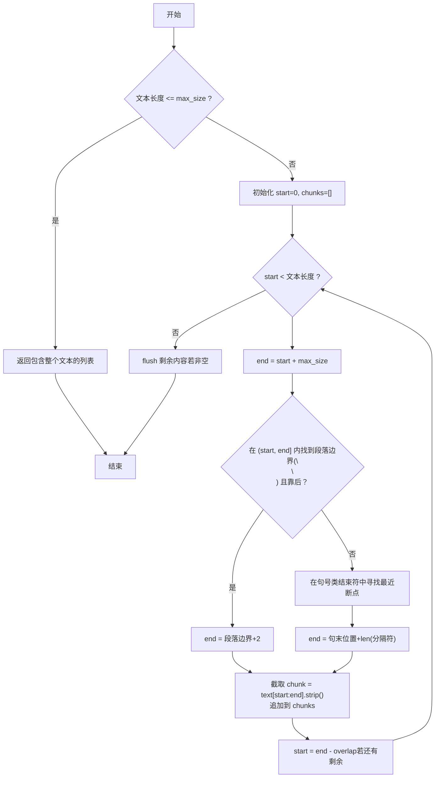
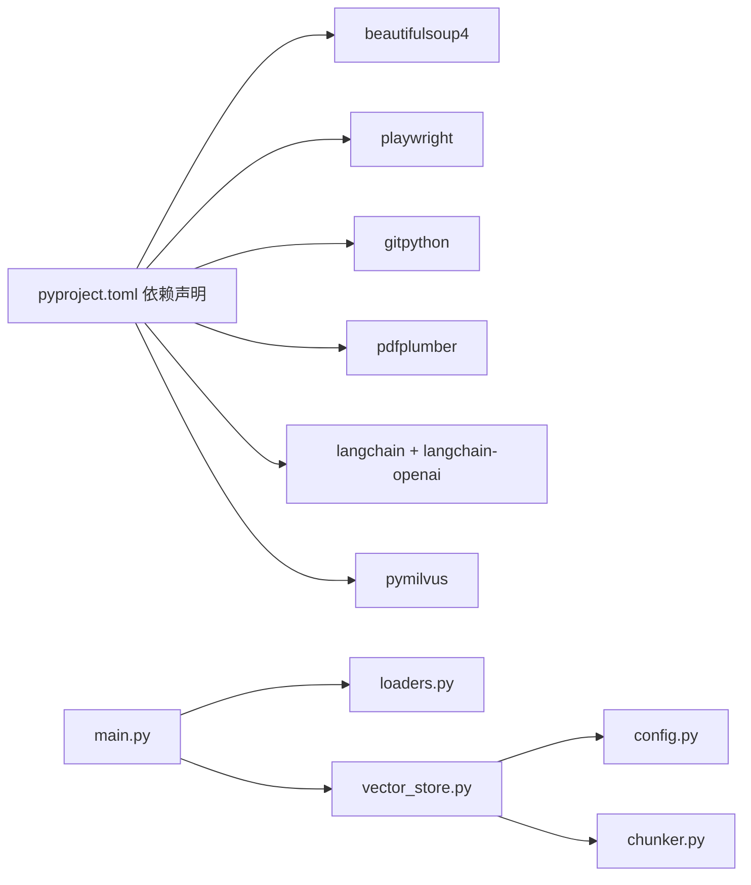

# 外部文档索引

<cite>
**本文引用的文件列表**
- [main.py](file://backend-rag/app/main.py)
- [vector_store.py](file://backend-rag/app/vector_store.py)
- [loaders.py](file://backend-rag/app/loaders.py)
- [models.py](file://backend-rag/app/models.py)
- [config.py](file://backend-rag/app/config.py)
- [chunker.py](file://backend-rag/app/chunker.py)
- [pyproject.toml](file://backend-rag/pyproject.toml)
</cite>

## 目录
1. [简介](#简介)
2. [项目结构](#项目结构)
3. [核心组件](#核心组件)
4. [架构总览](#架构总览)
5. [详细组件分析](#详细组件分析)
6. [依赖关系分析](#依赖关系分析)
7. [性能考量](#性能考量)
8. [故障排查指南](#故障排查指南)
9. [结论](#结论)

## 简介
本文件围绕“外部文档索引”能力进行系统化文档化，重点聚焦于 index_document 方法的实现细节与工作流程。该方法用于处理非代码文档（如网页、PDF、GitHub 文件等）的索引请求，包含以下关键点：
- 输入 content 的最小长度校验（默认阈值为 10 字符）
- 通过 _get_global_collection 获取全局文档集合，该集合使用独立的 schema 存储 source、source_type 和 title 等扩展元数据
- 文本分块算法 _split_text 的工作原理：优先在段落边界（\n\n）分割，其次在句子结束符（. 、。、; 、! 、? ）处断开，确保语义完整性
- ID 生成策略：基于 source 生成 8 位 MD5 哈希并与 chunk_index 组合形成唯一标识
- 元数据处理逻辑：title 的提取与截断（500 字符限制）
- 向量生成、entities 构建与批量插入流程
- 返回值：创建的 chunk 数量
- 错误处理、日志记录与性能考量（如大文档的流式处理建议）

## 项目结构
后端 RAG 服务采用 FastAPI 提供 REST 接口，加载器负责从不同来源抓取内容，向量存储模块负责分块、嵌入、持久化与检索。外部文档索引主要通过统一的加载器接口与 index_document 流程完成。

图表来源
- [main.py](file://backend-rag/app/main.py#L141-L343)
- [loaders.py](file://backend-rag/app/loaders.py#L1-L462)
- [vector_store.py](file://backend-rag/app/vector_store.py#L1-L469)
- [models.py](file://backend-rag/app/models.py#L1-L88)
- [config.py](file://backend-rag/app/config.py#L1-L51)
- [chunker.py](file://backend-rag/app/chunker.py#L1-L280)

章节来源
- [main.py](file://backend-rag/app/main.py#L141-L343)
- [loaders.py](file://backend-rag/app/loaders.py#L1-L462)
- [vector_store.py](file://backend-rag/app/vector_store.py#L1-L469)
- [models.py](file://backend-rag/app/models.py#L1-L88)
- [config.py](file://backend-rag/app/config.py#L1-L51)
- [chunker.py](file://backend-rag/app/chunker.py#L1-L280)

## 核心组件
- FastAPI 路由层：提供 /api/load/* 与 /api/index 等端点，调用加载器与向量存储模块
- 加载器层：WebPageLoader、GitHubRepoLoader、PDFLoader、URLLoader 将外部内容转换为 Document 对象（含 content、source、source_type、metadata）
- 向量存储层：VectorStore.index_document 负责对外部文档执行分块、嵌入、ID 生成、entities 构建与批量插入，并返回 chunk 数量
- 配置层：Settings 提供 embedding 模型、Milvus 连接参数、分块大小与重叠等可调参数

章节来源
- [main.py](file://backend-rag/app/main.py#L141-L343)
- [loaders.py](file://backend-rag/app/loaders.py#L1-L462)
- [vector_store.py](file://backend-rag/app/vector_store.py#L1-L469)
- [config.py](file://backend-rag/app/config.py#L1-L51)

## 架构总览
下图展示外部文档从加载到索引的整体流程，包括最小长度校验、分块、嵌入、ID 生成与批量插入。

图表来源
- [main.py](file://backend-rag/app/main.py#L141-L343)
- [loaders.py](file://backend-rag/app/loaders.py#L1-L462)
- [vector_store.py](file://backend-rag/app/vector_store.py#L241-L322)

## 详细组件分析

### index_document 方法实现细节
- 输入与最小长度校验
  - 参数：content、source、source_type、metadata
  - 校验：若 content 去除空白后长度小于 10，则直接返回 0，避免空或极短内容进入后续流程
- 全局集合获取
  - 通过 _get_global_collection 获取名为 “global_documents” 的集合；若不存在则按扩展 schema 创建，字段包含 id、embedding、content、source、source_type、title、chunk_index
- 文本分块
  - 使用 _split_text 按 max_chunk_size 与 chunk_overlap 进行分块
  - 断点优先级：段落边界（\n\n）、其次句号类结束符（. 、。、; 、! 、? ），并在必要时回退到换行符
- 向量生成
  - 使用 LangChain OpenAIEmbeddings 对每个 chunk 生成向量
- ID 生成策略
  - 基于 source 计算 8 位 MD5 哈希，再与 chunk_index 组合形成唯一 id（例如 “<hash>:0”, “<hash>:1”…）
- 元数据处理
  - title 来自 metadata.get("title")，若无则为空字符串；随后截断至 500 字符
- 批量插入
  - 构造 entities 列表（ids、embeddings、chunks、source、source_type、title、chunk_index）
  - 调用 collection.insert 批量写入并 flush
- 返回值
  - 返回创建的 chunk 数量（即插入的实体数）

章节来源
- [vector_store.py](file://backend-rag/app/vector_store.py#L241-L322)

### 文本分块算法 _split_text 工作原理
- 输入：text、max_size、overlap
- 输出：分块后的字符串列表
- 算法要点：
  - 若文本长度不超过 max_size，直接返回包含整个文本的列表
  - 循环推进窗口，先尝试在段落边界（\n\n）处断开，若断点距离窗口起始位置较近则不打断
  - 若未找到段落边界，则在句号类结束符（. 、。、; 、! 、? ）中寻找最近断点
  - 若仍未找到，则回退到换行符断开
  - 每次移动 start 时考虑 overlap，保证相邻块有重叠以提升检索连续性
- 复杂度：线性扫描，时间复杂度 O(n)，空间复杂度 O(n)

图表来源
- [vector_store.py](file://backend-rag/app/vector_store.py#L289-L321)

章节来源
- [vector_store.py](file://backend-rag/app/vector_store.py#L289-L321)

### 全局文档集合 schema 与扩展元数据
- 集合名称：global_documents
- 字段定义（来自扩展 schema）：
  - id：主键，VARCHAR，最大长度 512
  - embedding：FLOAT_VECTOR，维度与 embedding 模型一致
  - content：VARCHAR，最大长度 65535
  - source：VARCHAR，最大长度 1024
  - source_type：VARCHAR，最大长度 32
  - title：VARCHAR，最大长度 512
  - chunk_index：INT64
- 作用：承载来自网页、PDF、GitHub 文件等外部来源的文档，便于统一检索与过滤

章节来源
- [vector_store.py](file://backend-rag/app/vector_store.py#L206-L239)

### 加载器与 index_document 的协作
- WebPageLoader：抓取网页 HTML，支持静态与 JS 渲染，转换为 Markdown，产出 Document（source_type="web"）
- GitHubRepoLoader：克隆仓库（浅克隆），筛选文件类型与模式，读取内容，产出 Document（source_type="github"）
- PDFLoader：解析 PDF 文本与表格，产出 Document（source_type="pdf"）
- URLLoader：自动识别 URL 类型，委派给对应加载器，远程 PDF 先下载再解析
- main.py 中各 /api/load/* 端点会逐个调用 store.index_document，聚合 documents_loaded 与 chunks_created

章节来源
- [loaders.py](file://backend-rag/app/loaders.py#L1-L462)
- [main.py](file://backend-rag/app/main.py#L141-L343)

### 向量生成、entities 构建与批量插入
- 向量生成：使用 Settings.embedding_model 与 OpenAIEmbeddings 生成嵌入
- entities 构建：按列组织（ids、embeddings、content、source、source_type、title、chunk_index）
- 批量插入：collection.insert(entities) 后 flush，确保可见性
- 查询路径：VectorStore.query_global 支持按 source_type 过滤检索

章节来源
- [vector_store.py](file://backend-rag/app/vector_store.py#L241-L322)
- [config.py](file://backend-rag/app/config.py#L1-L51)

## 依赖关系分析
- FastAPI 路由依赖加载器与向量存储
- 加载器依赖第三方库（BeautifulSoup、Playwright、GitPython、pdfplumber 等）
- 向量存储依赖 Milvus 与 LangChain OpenAIEmbeddings
- 配置通过 pydantic-settings 从环境变量注入

图表来源
- [pyproject.toml](file://backend-rag/pyproject.toml#L1-L67)
- [main.py](file://backend-rag/app/main.py#L141-L343)
- [loaders.py](file://backend-rag/app/loaders.py#L1-L462)
- [vector_store.py](file://backend-rag/app/vector_store.py#L1-L469)
- [config.py](file://backend-rag/app/config.py#L1-L51)
- [chunker.py](file://backend-rag/app/chunker.py#L1-L280)

章节来源
- [pyproject.toml](file://backend-rag/pyproject.toml#L1-L67)
- [main.py](file://backend-rag/app/main.py#L141-L343)
- [loaders.py](file://backend-rag/app/loaders.py#L1-L462)
- [vector_store.py](file://backend-rag/app/vector_store.py#L1-L469)
- [config.py](file://backend-rag/app/config.py#L1-L51)
- [chunker.py](file://backend-rag/app/chunker.py#L1-L280)

## 性能考量
- 分块策略
  - 优先段落边界与句号类结束符，减少跨语义单元切分带来的信息断裂
  - 通过 overlap（默认 200）提升检索连续性，但会增加向量数量与存储开销
- 向量生成
  - 批量 embed_documents 优于逐条生成，降低网络往返与模型调用开销
- 插入与索引
  - collection.flush 在每次插入后执行，确保可见性；对于大批量可考虑分批 flush 以平衡延迟与一致性
- 大文档处理建议
  - 对超长文档（如长 PDF 或网页）建议采用流式分块与分批插入，避免单次内存压力
  - 可结合 overlap 与 max_chunk_size 调整，权衡召回质量与存储成本
- 索引与查询
  - Milvus IVF_FLAT 索引参数可依据数据规模与查询延迟目标调整 nlist
  - query_global 支持按 source_type 过滤，减少无关域内的检索范围

章节来源
- [vector_store.py](file://backend-rag/app/vector_store.py#L241-L322)
- [config.py](file://backend-rag/app/config.py#L35-L40)

## 故障排查指南
- 常见错误与处理
  - Milvus 连接失败：检查 MILVUS_HOST、MILVUS_PORT、MILVUS_USER、MILVUS_PASSWORD、MILVUS_DB_NAME
  - OpenAI Embedding 失败：检查 OPENAI_API_KEY 与 EMBEDDING_MODEL
  - 加载器异常：WebPageLoader/URLLoader 抛出网络或解析异常；GitHubRepoLoader 抛出克隆或读取异常；PDFLoader 抛出解析异常
  - index_document 返回 0：通常因 content 长度不足（<10）或分块结果为空
- 日志定位
  - FastAPI 层：各 /api/load/* 端点捕获异常并记录错误日志
  - VectorStore 层：index_document 成功与失败均记录日志，query_global 与 query 也记录异常
- 建议排查步骤
  - 确认环境变量与依赖安装完整
  - 检查 source 与 content 是否有效
  - 调整 MAX_CHUNK_SIZE 与 CHUNK_OVERLAP 观察效果
  - 对超长文档分批处理并观察中间结果

章节来源
- [main.py](file://backend-rag/app/main.py#L141-L343)
- [vector_store.py](file://backend-rag/app/vector_store.py#L323-L469)
- [loaders.py](file://backend-rag/app/loaders.py#L1-L462)
- [config.py](file://backend-rag/app/config.py#L1-L51)

## 结论
外部文档索引通过统一的加载器与 index_document 流程，实现了对网页、PDF、GitHub 文件等多种来源的标准化处理。其核心优势在于：
- 明确的最小长度校验与健壮的分块策略，兼顾语义完整性与检索连续性
- 基于 source 的稳定 ID 生成与扩展 schema 的元数据存储，便于后续检索与溯源
- 批量嵌入与插入，配合 Milvus 索引，满足高效检索需求
在实际部署中，建议根据业务场景调整分块参数、索引参数与批处理策略，以获得最佳的召回质量与吞吐表现。