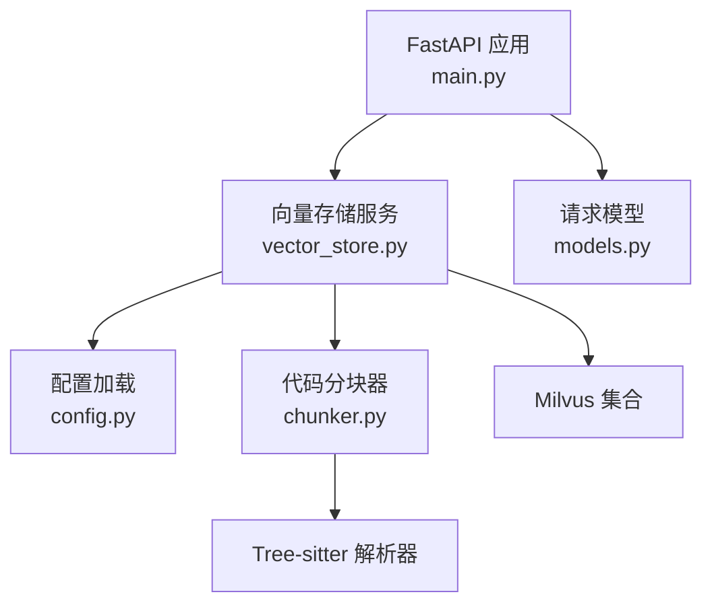
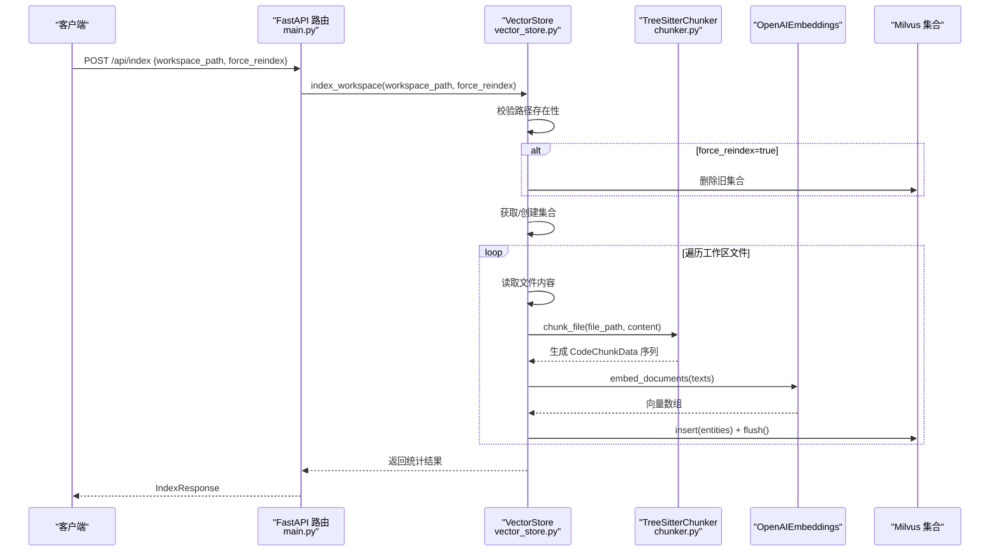
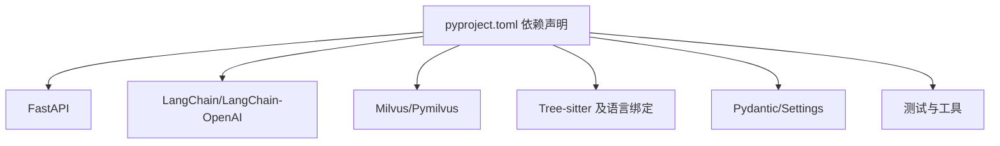

# 工作区索引

<cite>
**本文引用的文件列表**
- [main.py](file://backend-rag/app/main.py)
- [vector_store.py](file://backend-rag/app/vector_store.py)
- [chunker.py](file://backend-rag/app/chunker.py)
- [models.py](file://backend-rag/app/models.py)
- [config.py](file://backend-rag/app/config.py)
- [pyproject.toml](file://backend-rag/pyproject.toml)
- [test_chunker.py](file://backend-rag/tests/test_chunker.py)
</cite>

## 目录
1. [简介](#简介)
2. [项目结构](#项目结构)
3. [核心组件](#核心组件)
4. [架构总览](#架构总览)
5. [详细组件分析](#详细组件分析)
6. [依赖关系分析](#依赖关系分析)
7. [性能考量](#性能考量)
8. [故障排查指南](#故障排查指南)
9. [结论](#结论)

## 简介
本文件围绕“工作区索引”流程进行深入文档化，聚焦于 index_workspace 方法的完整执行路径。内容覆盖：
- 参数校验与工作区存在性检查
- 基于工作区路径生成集合名、获取或创建 Milvus 集合
- force_reindex 触发的集合重建机制
- 递归遍历工作区目录、按扩展名与忽略目录进行过滤
- 文件内容读取与 TreeSitterChunker 的语义化分块（AST 优先，文本回退）
- 向量化与 Milvus 批量插入、flush 操作
- 错误处理、进度统计与日志记录

## 项目结构
后端 RAG 服务采用 FastAPI 提供 REST 接口，向量存储基于 Milvus，使用 LangChain OpenAIEmbeddings 生成向量，代码分块由 Tree-sitter 实现 AST 语义化切分。

图表来源
- [main.py](file://backend-rag/app/main.py#L92-L120)
- [vector_store.py](file://backend-rag/app/vector_store.py#L42-L119)
- [chunker.py](file://backend-rag/app/chunker.py#L60-L115)
- [config.py](file://backend-rag/app/config.py#L6-L22)

章节来源
- [main.py](file://backend-rag/app/main.py#L92-L120)
- [vector_store.py](file://backend-rag/app/vector_store.py#L42-L119)
- [chunker.py](file://backend-rag/app/chunker.py#L60-L115)
- [config.py](file://backend-rag/app/config.py#L6-L22)

## 核心组件
- FastAPI 路由：提供 /api/index 入口，调用向量存储服务的 index_workspace
- VectorStore：负责 Milvus 连接、集合管理、工作区遍历、分块、向量化与批量写入
- TreeSitterChunker：根据文件扩展名识别语言，优先使用 AST 分块，失败时回退到文本分块
- 配置与模型：环境变量驱动的设置、请求/响应模型定义

章节来源
- [main.py](file://backend-rag/app/main.py#L92-L120)
- [vector_store.py](file://backend-rag/app/vector_store.py#L121-L204)
- [chunker.py](file://backend-rag/app/chunker.py#L60-L115)
- [models.py](file://backend-rag/app/models.py#L27-L39)
- [config.py](file://backend-rag/app/config.py#L6-L22)

## 架构总览
下图展示从 API 到 Milvus 的端到端索引流程。

图表来源
- [main.py](file://backend-rag/app/main.py#L92-L120)
- [vector_store.py](file://backend-rag/app/vector_store.py#L121-L204)
- [chunker.py](file://backend-rag/app/chunker.py#L104-L115)

## 详细组件分析

### index_workspace 方法执行路径
- 参数校验与路径存在性检查：将传入字符串转换为 Path 并判断是否存在，不存在则抛出错误
- 集合命名与获取：以工作区路径的哈希生成集合名；若集合不存在则创建，包含主键 id、向量 embedding、内容 content、源文件路径 file_path、起止行号、节点类型 node_type、语言 language 等字段，并建立 COSINE 度量的 IVF_FLAT 索引
- force_reindex 重建机制：当 force_reindex 为真时，先断开连接、删除集合，再重新创建
- 文件遍历与过滤：使用 rglob 递归遍历，忽略目录集合中的常见目录，仅处理扩展名在可索引集合内的文件
- 内容读取与分块：读取 UTF-8 文本（忽略解码错误），跳过极小文件；相对路径用于 ID 生成；调用 get_chunker 返回的单例分块器进行 chunk_file
- 向量化与实体构造：从 CodeChunkData 中提取文本，调用 OpenAIEmbeddings.embed_documents 生成向量；构造 entities 列表（id、embedding、content、file_path、start_line、end_line、node_type、language）
- 批量插入与刷新：collection.insert(entities) 后立即 flush，保证可见性
- 统计与日志：累计已处理文件数与分块总数，输出调试与信息日志

章节来源
- [vector_store.py](file://backend-rag/app/vector_store.py#L121-L204)
- [vector_store.py](file://backend-rag/app/vector_store.py#L436-L447)

### _get_collection 与集合重建
- 集合命名：对 workspace_path 做 MD5 截断，前缀 workspace_，确保唯一且稳定
- 集合创建：字段定义包含主键 id、FLOAT_VECTOR embedding、VARCHAR content、VARCHAR file_path、INT64 start_line/end_line、VARCHAR node_type/language
- 索引参数：COSINE 度量、IVF_FLAT、nlist=1024
- 强制重建：删除已有集合并清空缓存，避免后续复用旧句柄

章节来源
- [vector_store.py](file://backend-rag/app/vector_store.py#L77-L119)
- [vector_store.py](file://backend-rag/app/vector_store.py#L139-L147)

### _iterate_files 文件遍历与过滤
- 递归遍历：rglob("*") 遍历所有条目
- 忽略目录：若路径部件包含 IGNORED_DIRS 中任一项，则跳过
- 扩展名过滤：仅接受 INDEXABLE_EXTENSIONS 中的小写扩展名
- 输出：逐个产出满足条件的文件路径

章节来源
- [vector_store.py](file://backend-rag/app/vector_store.py#L436-L447)

### TreeSitterChunker 语义化分块
- 语言识别：依据扩展名映射到 Tree-sitter 语言标识
- 初始化策略：首次使用时动态导入对应语言解析器，初始化失败则记录告警并回退文本分块
- AST 分块：遍历根节点，收集目标节点类型（函数、类等）作为逻辑单元；若单块过大则进一步按行拆分并保留重叠
- 文本回退：当 AST 失败或无逻辑单元时，按最大长度与重叠进行行级切分
- 生成数据：返回 CodeChunkData（content、file_path、start_line、end_line、node_type、language）

章节来源
- [chunker.py](file://backend-rag/app/chunker.py#L25-L57)
- [chunker.py](file://backend-rag/app/chunker.py#L60-L115)
- [chunker.py](file://backend-rag/app/chunker.py#L116-L163)
- [chunker.py](file://backend-rag/app/chunker.py#L172-L220)
- [chunker.py](file://backend-rag/app/chunker.py#L221-L268)

### 向量化与 Milvus 插入
- 向量化：从分块序列提取 content 列表，调用 OpenAIEmbeddings.embed_documents 生成向量
- 实体构造：按字段顺序组织 entities（id、embedding、content、file_path、start_line、end_line、node_type、language）
- 批量写入：collection.insert(entities)，随后 flush 保证持久化
- 查询对比：查询路径中同样使用 embed_query 生成查询向量，Cosine 度量检索

章节来源
- [vector_store.py](file://backend-rag/app/vector_store.py#L167-L190)
- [vector_store.py](file://backend-rag/app/vector_store.py#L377-L409)

### API 入口与请求模型
- /api/index：接收 IndexRequest（workspace_path、force_reindex），调用 VectorStore.index_workspace，返回 IndexResponse（success、message、files_indexed、chunks_created）
- 请求模型：定义了 workspace_path、force_reindex 字段及其描述

章节来源
- [main.py](file://backend-rag/app/main.py#L92-L120)
- [models.py](file://backend-rag/app/models.py#L27-L39)

## 依赖关系分析
- FastAPI 依赖：uvicorn、pydantic、pydantic-settings
- 向量与数据库：langchain、langchain-openai、langchain-milvus、pymilvus
- 语法解析：tree-sitter 及多语言绑定
- 测试与工具：pytest、ruff、mypy

图表来源
- [pyproject.toml](file://backend-rag/pyproject.toml#L8-L38)

章节来源
- [pyproject.toml](file://backend-rag/pyproject.toml#L8-L38)

## 性能考量
- 分块大小与重叠：通过配置项 MAX_CHUNK_SIZE 与 CHUNK_OVERLAP 控制，影响召回与存储成本
- 向量维度：embedding_model 默认 text-embedding-3-small，维度固定，影响 Milvus 索引参数与内存占用
- 索引参数：IVF_FLAT nlist=1024，适合中小规模数据；大规模场景可考虑其他索引类型
- IO 与解析：文件读取与 Tree-sitter 解析为 CPU/IO 密集；建议在高并发场景配合异步与限流
- 批量写入：每文件 flush 一次，保证一致性但可能影响吞吐；可评估批量 flush 策略

[本节为通用指导，不直接分析具体文件]

## 故障排查指南
- 路径不存在：index_workspace 在路径不存在时抛出错误；请确认 workspace_path 是否正确
- Tree-sitter 缺失：初始化失败会回退到文本分块；若需 AST 分块，请安装对应语言绑定
- 文件读取异常：读取时忽略解码错误并跳过；若出现大量警告，检查文件编码与权限
- Milvus 连接问题：_ensure_connection 会在首次使用时建立连接；确认环境变量与网络连通
- 查询无结果：集合为空时返回空列表；确认是否已完成索引或集合被重建

章节来源
- [vector_store.py](file://backend-rag/app/vector_store.py#L128-L131)
- [chunker.py](file://backend-rag/app/chunker.py#L72-L98)
- [vector_store.py](file://backend-rag/app/vector_store.py#L153-L158)
- [vector_store.py](file://backend-rag/app/vector_store.py#L52-L67)
- [vector_store.py](file://backend-rag/app/vector_store.py#L387-L391)

## 结论
工作区索引流程以 index_workspace 为核心，串联了路径校验、集合管理、文件遍历、语义分块、向量化与 Milvus 插入等关键步骤。通过 force_reindex 可实现安全重建，借助 Tree-sitter AST 与文本回退策略兼顾准确性与鲁棒性。建议在生产环境中结合配置参数与监控指标持续优化索引与查询性能。