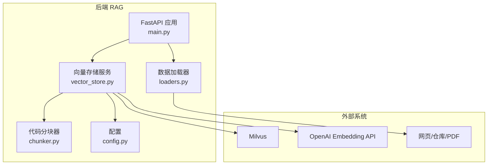
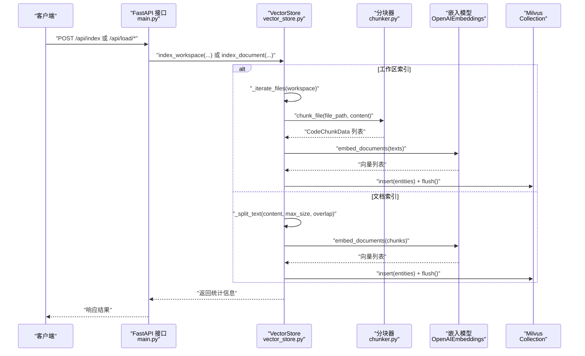
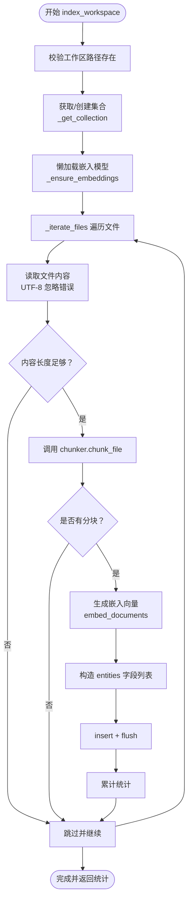
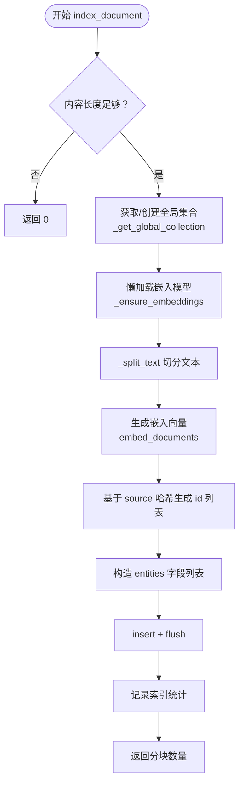
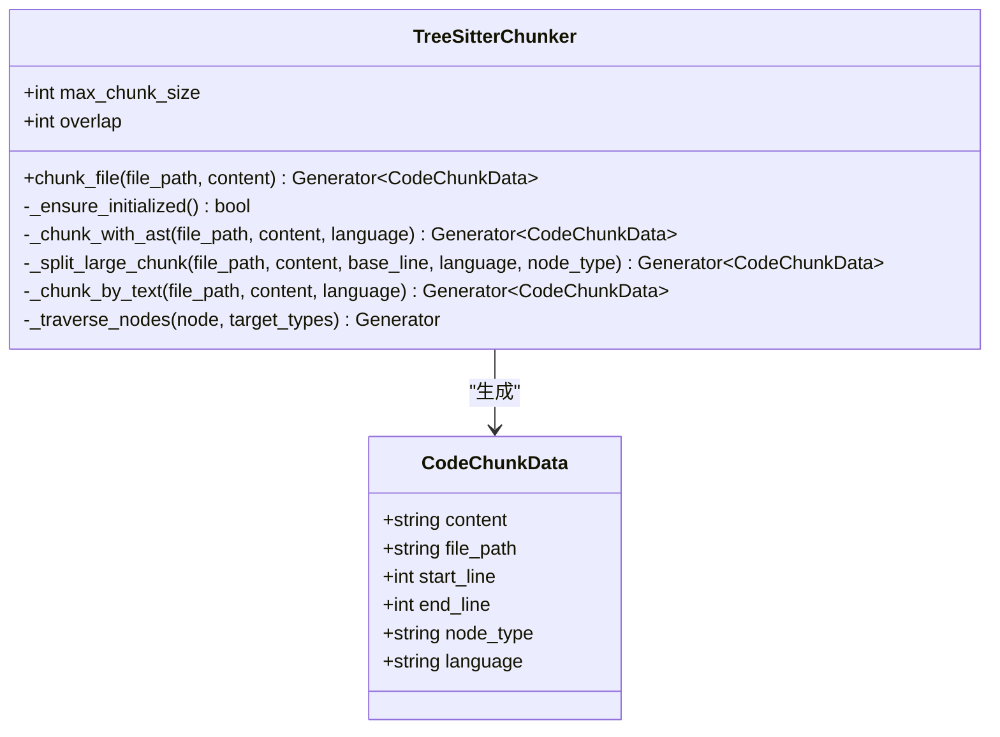
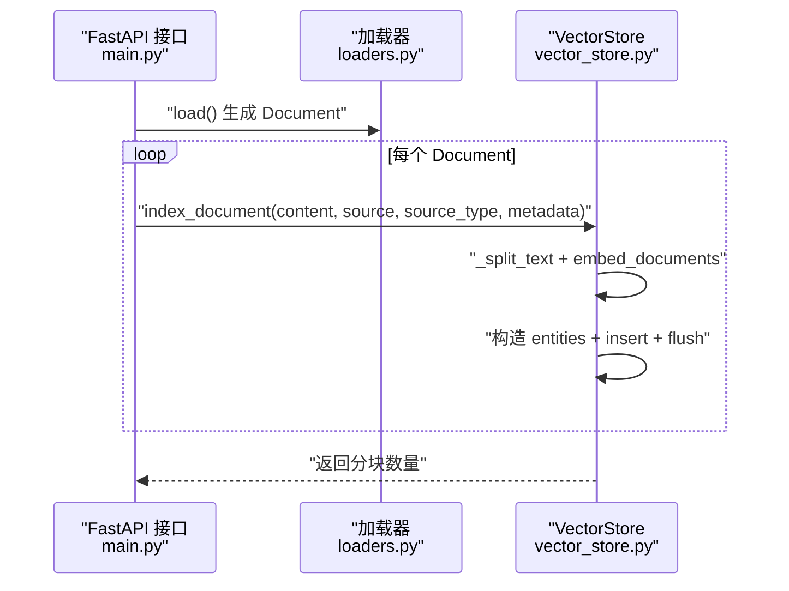
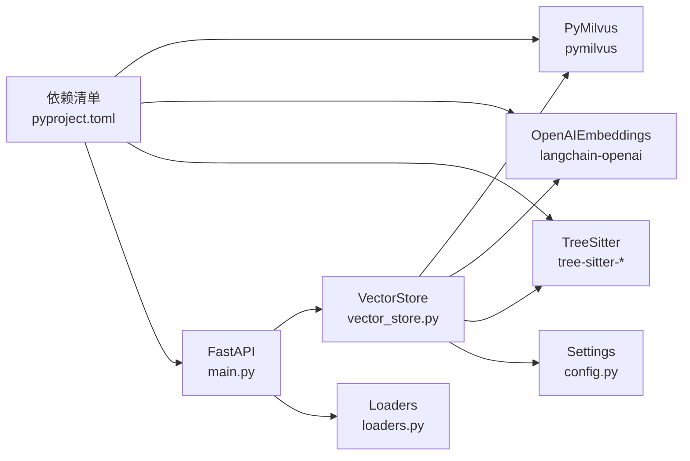

# 索引机制

<cite>
**本文引用的文件**
- [backend-rag/app/vector_store.py](file://backend-rag/app/vector_store.py)
- [backend-rag/app/chunker.py](file://backend-rag/app/chunker.py)
- [backend-rag/app/main.py](file://backend-rag/app/main.py)
- [backend-rag/app/config.py](file://backend-rag/app/config.py)
- [backend-rag/app/loaders.py](file://backend-rag/app/loaders.py)
- [backend-rag/pyproject.toml](file://backend-rag/pyproject.toml)
</cite>

## 目录
1. [简介](#简介)
2. [项目结构](#项目结构)
3. [核心组件](#核心组件)
4. [架构总览](#架构总览)
5. [详细组件分析](#详细组件分析)
6. [依赖关系分析](#依赖关系分析)
7. [性能考量](#性能考量)
8. [故障排查指南](#故障排查指南)
9. [结论](#结论)

## 简介
本文件系统性文档化向量存储的索引流程，重点覆盖以下两个核心方法：
- index_workspace：遍历工作区目录，过滤可索引文件类型与忽略目录，读取文件内容并使用代码分块器进行分块，生成嵌入向量，构建 Milvus 所需的 entities 数据结构，执行批量插入与 flush 操作；同时说明 force_reindex 参数如何触发集合重建。
- index_document：针对外部文档（网页、PDF、GitHub 文件等）进行文本分块策略、ID 生成机制（基于 source 哈希）与元数据处理；阐述 _lazy 初始化模式在连接与嵌入模型中的应用，以及错误处理与日志记录策略。

## 项目结构
后端 RAG 服务采用模块化设计，关键模块如下：
- vector_store.py：Milvus 向量存储封装，包含工作区索引与文档索引两大入口，以及分块、嵌入、集合管理、查询等能力。
- chunker.py：Tree-sitter 驱动的代码分块器，支持按 AST 逻辑边界分块，回退到按文本行分块。
- main.py：FastAPI 应用入口，提供健康检查、查询、工作区索引与多类加载器接口。
- loaders.py：统一的数据加载器，负责从网页、GitHub 仓库、PDF 等来源提取文档并转换为统一的 Document 结构。
- config.py：应用配置，包括 Milvus 连接参数、OpenAI 嵌入模型、分块大小与重叠、默认检索 top_k 等。
- pyproject.toml：依赖声明，涵盖 FastAPI、LangChain、PyMilvus、Tree-Sitter、Playwright、PDF 处理等。

图表来源
- [backend-rag/app/main.py](file://backend-rag/app/main.py#L1-L120)
- [backend-rag/app/vector_store.py](file://backend-rag/app/vector_store.py#L1-L120)
- [backend-rag/app/chunker.py](file://backend-rag/app/chunker.py#L1-L60)
- [backend-rag/app/loaders.py](file://backend-rag/app/loaders.py#L1-L60)
- [backend-rag/app/config.py](file://backend-rag/app/config.py#L1-L51)

章节来源
- [backend-rag/app/main.py](file://backend-rag/app/main.py#L1-L120)
- [backend-rag/app/vector_store.py](file://backend-rag/app/vector_store.py#L1-L120)
- [backend-rag/app/chunker.py](file://backend-rag/app/chunker.py#L1-L60)
- [backend-rag/app/loaders.py](file://backend-rag/app/loaders.py#L1-L60)
- [backend-rag/app/config.py](file://backend-rag/app/config.py#L1-L51)

## 核心组件
- VectorStore：封装 Milvus 连接、集合创建/复用、嵌入模型懒加载、工作区索引与文档索引、查询与健康检查。
- TreeSitterChunker：基于 Tree-sitter 的 AST 分块器，优先按语言逻辑单元切分，不支持时回退到按行分块。
- 加载器（WebPageLoader、GitHubRepoLoader、PDFLoader、URLLoader）：统一产出 Document 对象，供 index_document 使用。
- 配置 Settings：集中管理 Milvus、OpenAI、分块与检索等参数。

章节来源
- [backend-rag/app/vector_store.py](file://backend-rag/app/vector_store.py#L42-L120)
- [backend-rag/app/chunker.py](file://backend-rag/app/chunker.py#L60-L120)
- [backend-rag/app/loaders.py](file://backend-rag/app/loaders.py#L21-L60)
- [backend-rag/app/config.py](file://backend-rag/app/config.py#L6-L51)

## 架构总览
下图展示从 API 到 Milvus 的索引路径，包括工作区索引与文档索引两条主线。

图表来源
- [backend-rag/app/main.py](file://backend-rag/app/main.py#L92-L120)
- [backend-rag/app/main.py](file://backend-rag/app/main.py#L143-L190)
- [backend-rag/app/vector_store.py](file://backend-rag/app/vector_store.py#L121-L204)
- [backend-rag/app/vector_store.py](file://backend-rag/app/vector_store.py#L241-L288)
- [backend-rag/app/chunker.py](file://backend-rag/app/chunker.py#L104-L115)

## 详细组件分析

### index_workspace 流程详解
- 目录遍历与过滤
  - 使用递归遍历工作区根目录，跳过被 IGNORED_DIRS 中列出的目录，仅对 INDEXABLE_EXTENSIONS 中的扩展名进行处理。
  - 对每个文件读取 UTF-8 文本，忽略解码错误；跳过长度小于阈值的内容。
- 分块策略
  - 通过 get_chunker 获取 TreeSitterChunker 实例，调用 chunk_file 以 AST 优先的方式进行分块；若无法解析或语言不受支持，则回退到按行分块。
- 嵌入与 Milvus 写入
  - 从分块结果提取文本列表，调用 OpenAIEmbeddings.embed_documents 生成向量。
  - 构造 entities 列表，字段顺序与集合 schema 一致：id、embedding、content、file_path、start_line、end_line、node_type、language。
  - 调用 collection.insert 批量写入并立即 flush。
- force_reindex 行为
  - 若传入 force_reindex=True，先确保连接建立，删除已存在的集合，清空内存缓存，从而强制重建集合与索引。
- 统计与日志
  - 记录成功索引的文件数与分块总数；对异常进行警告并继续处理下一个文件。

图表来源
- [backend-rag/app/vector_store.py](file://backend-rag/app/vector_store.py#L121-L204)
- [backend-rag/app/vector_store.py](file://backend-rag/app/vector_store.py#L436-L447)
- [backend-rag/app/chunker.py](file://backend-rag/app/chunker.py#L104-L115)

章节来源
- [backend-rag/app/vector_store.py](file://backend-rag/app/vector_store.py#L121-L204)
- [backend-rag/app/vector_store.py](file://backend-rag/app/vector_store.py#L436-L447)
- [backend-rag/app/chunker.py](file://backend-rag/app/chunker.py#L104-L115)

### index_document 流程详解
- 输入与预处理
  - 接收 content、source、source_type 与可选 metadata；跳过过短内容。
- 文本分块策略
  - 使用 _split_text 将长文本按最大长度与重叠进行切分；优先在段落或句号处断开，保证语义完整性。
- ID 生成与元数据
  - 基于 source 的 MD5 前缀生成唯一前缀，结合 chunk 索引形成全局唯一 id。
  - 元数据中保留 source、source_type、title（截断）与 chunk_index。
- 嵌入与 Milvus 写入
  - 生成向量列表，构造 entities 并写入全局集合 global_documents，随后 flush。
- 错误处理与日志
  - 对异常进行记录并返回 0 块，避免中断整体流程。

图表来源
- [backend-rag/app/vector_store.py](file://backend-rag/app/vector_store.py#L241-L288)
- [backend-rag/app/vector_store.py](file://backend-rag/app/vector_store.py#L289-L322)

章节来源
- [backend-rag/app/vector_store.py](file://backend-rag/app/vector_store.py#L241-L288)
- [backend-rag/app/vector_store.py](file://backend-rag/app/vector_store.py#L289-L322)

### 分块器 TreeSitterChunker
- AST 优先分块
  - 根据文件扩展名映射语言，初始化对应 Tree-sitter 解析器；若不可用则回退到文本分块。
  - 遍历 AST 中的目标节点类型（函数、类、接口等），按逻辑单元切分；超过阈值再进一步按行拆分并保留重叠。
- 文本回退分块
  - 按行累加，超过 max_chunk_size 即输出一个分块，并计算重叠行用于下一个分块的开头。
- 输出结构
  - 生成 CodeChunkData，包含 content、file_path、start_line、end_line、node_type、language。

图表来源
- [backend-rag/app/chunker.py](file://backend-rag/app/chunker.py#L60-L120)
- [backend-rag/app/chunker.py](file://backend-rag/app/chunker.py#L121-L220)
- [backend-rag/app/chunker.py](file://backend-rag/app/chunker.py#L221-L280)

章节来源
- [backend-rag/app/chunker.py](file://backend-rag/app/chunker.py#L60-L120)
- [backend-rag/app/chunker.py](file://backend-rag/app/chunker.py#L121-L220)
- [backend-rag/app/chunker.py](file://backend-rag/app/chunker.py#L221-L280)

### 外部文档加载与 index_document 集成
- 加载器职责
  - WebPageLoader：抓取静态或 JS 渲染页面，清理 HTML，转为 Markdown，产出 Document。
  - GitHubRepoLoader：浅克隆仓库，按模式与扩展名筛选文件，读取内容为 Document。
  - PDFLoader：提取文本与表格，产出 Document。
  - URLLoader：自动识别类型并委派至对应加载器。
- 与 index_document 的衔接
  - FastAPI 接口在加载完成后调用 VectorStore.index_document，传入 content、source、source_type、metadata，实现统一的向量化入库流程。

图表来源
- [backend-rag/app/main.py](file://backend-rag/app/main.py#L143-L190)
- [backend-rag/app/main.py](file://backend-rag/app/main.py#L192-L239)
- [backend-rag/app/main.py](file://backend-rag/app/main.py#L241-L291)
- [backend-rag/app/main.py](file://backend-rag/app/main.py#L298-L343)
- [backend-rag/app/loaders.py](file://backend-rag/app/loaders.py#L40-L180)
- [backend-rag/app/loaders.py](file://backend-rag/app/loaders.py#L182-L288)
- [backend-rag/app/loaders.py](file://backend-rag/app/loaders.py#L312-L402)
- [backend-rag/app/loaders.py](file://backend-rag/app/loaders.py#L404-L462)
- [backend-rag/app/vector_store.py](file://backend-rag/app/vector_store.py#L241-L288)

章节来源
- [backend-rag/app/main.py](file://backend-rag/app/main.py#L143-L190)
- [backend-rag/app/main.py](file://backend-rag/app/main.py#L192-L239)
- [backend-rag/app/main.py](file://backend-rag/app/main.py#L241-L291)
- [backend-rag/app/main.py](file://backend-rag/app/main.py#L298-L343)
- [backend-rag/app/loaders.py](file://backend-rag/app/loaders.py#L40-L180)
- [backend-rag/app/loaders.py](file://backend-rag/app/loaders.py#L182-L288)
- [backend-rag/app/loaders.py](file://backend-rag/app/loaders.py#L312-L402)
- [backend-rag/app/loaders.py](file://backend-rag/app/loaders.py#L404-L462)
- [backend-rag/app/vector_store.py](file://backend-rag/app/vector_store.py#L241-L288)

### _lazy 初始化模式与错误处理
- 连接懒加载（_ensure_connection）
  - 在首次需要时才建立 Milvus 连接，避免无谓的连接开销；连接参数来自 Settings。
- 嵌入模型懒加载（_ensure_embeddings）
  - 在首次需要时才实例化 OpenAIEmbeddings，避免不必要的初始化成本。
- 错误处理与日志
  - 工作区索引循环中对单文件异常进行警告并继续；查询与全局查询捕获异常并记录错误日志，返回空结果或健康检查失败状态。

章节来源
- [backend-rag/app/vector_store.py](file://backend-rag/app/vector_store.py#L52-L76)
- [backend-rag/app/vector_store.py](file://backend-rag/app/vector_store.py#L121-L204)
- [backend-rag/app/vector_store.py](file://backend-rag/app/vector_store.py#L323-L376)
- [backend-rag/app/vector_store.py](file://backend-rag/app/vector_store.py#L377-L435)

## 依赖关系分析
- 向量存储依赖
  - Milvus：连接、集合创建/索引、搜索与写入。
  - OpenAIEmbeddings：生成文本向量。
  - TreeSitter：AST 解析与分块。
  - LangChain：嵌入模型封装与工具链。
- FastAPI 依赖
  - 提供统一的 HTTP 接口，协调加载器与向量存储。
- 配置依赖
  - Settings 提供所有运行时参数，包括 Milvus 凭据、嵌入模型、分块参数、默认 top_k 等。

图表来源
- [backend-rag/app/vector_store.py](file://backend-rag/app/vector_store.py#L1-L40)
- [backend-rag/app/config.py](file://backend-rag/app/config.py#L6-L51)
- [backend-rag/app/main.py](file://backend-rag/app/main.py#L1-L60)
- [backend-rag/app/loaders.py](file://backend-rag/app/loaders.py#L1-L40)
- [backend-rag/pyproject.toml](file://backend-rag/pyproject.toml#L1-L40)

章节来源
- [backend-rag/app/vector_store.py](file://backend-rag/app/vector_store.py#L1-L40)
- [backend-rag/app/config.py](file://backend-rag/app/config.py#L6-L51)
- [backend-rag/app/main.py](file://backend-rag/app/main.py#L1-L60)
- [backend-rag/app/loaders.py](file://backend-rag/app/loaders.py#L1-L40)
- [backend-rag/pyproject.toml](file://backend-rag/pyproject.toml#L1-L40)

## 性能考量
- 分块策略
  - AST 优先分块可提升语义完整性，但解析成本较高；对不受支持语言回退文本分块，兼顾性能与可用性。
  - 合理设置 max_chunk_size 与 chunk_overlap，在召回质量与向量数量之间取得平衡。
- 批量写入与 flush
  - 每个文件写入后立即 flush，确保可见性；在高吞吐场景可考虑批量 flush 优化，但需权衡一致性与延迟。
- 连接与模型懒加载
  - 避免不必要的连接与模型初始化，减少冷启动开销。
- 忽略目录与扩展名
  - 通过 IGNORED_DIRS 与 INDEXABLE_EXTENSIONS 缩小扫描范围，降低 I/O 与解析压力。

## 故障排查指南
- Milvus 连接失败
  - 检查 Settings 中的主机、端口、用户、密码、数据库名是否正确；确认 _ensure_connection 是否被调用。
- 嵌入模型初始化失败
  - 确认 OPENAI_API_KEY 与 EMBEDDING_MODEL 设置；检查 _ensure_embeddings 是否被调用。
- 工作区索引无结果
  - 确认工作区路径存在且包含可索引文件；检查 IGNORED_DIRS 与 INDEXABLE_EXTENSIONS 是否符合预期。
- 文档索引异常
  - 观察 _split_text 的断点逻辑是否导致分块过多或过少；检查 source 哈希与 id 生成是否冲突。
- 查询无结果
  - 确认集合已 load，且 num_entities > 0；检查索引类型与 metric_type 是否匹配。

章节来源
- [backend-rag/app/vector_store.py](file://backend-rag/app/vector_store.py#L52-L76)
- [backend-rag/app/vector_store.py](file://backend-rag/app/vector_store.py#L121-L204)
- [backend-rag/app/vector_store.py](file://backend-rag/app/vector_store.py#L241-L288)
- [backend-rag/app/vector_store.py](file://backend-rag/app/vector_store.py#L377-L435)

## 结论
本文围绕 VectorStore 的两个核心索引方法，系统梳理了工作区与外部文档的索引流程、分块策略、嵌入生成、Milvus 写入与 flush、force_reindex 的集合重建机制，以及 _lazy 初始化与错误处理实践。通过模块化的加载器与统一的 Document 结构，实现了从多源数据到向量索引的一致化处理，为后续检索与问答提供了高质量基础。