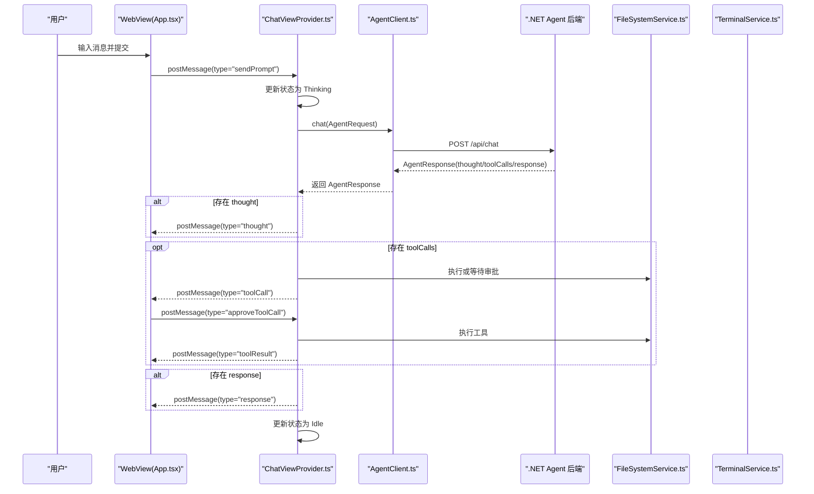
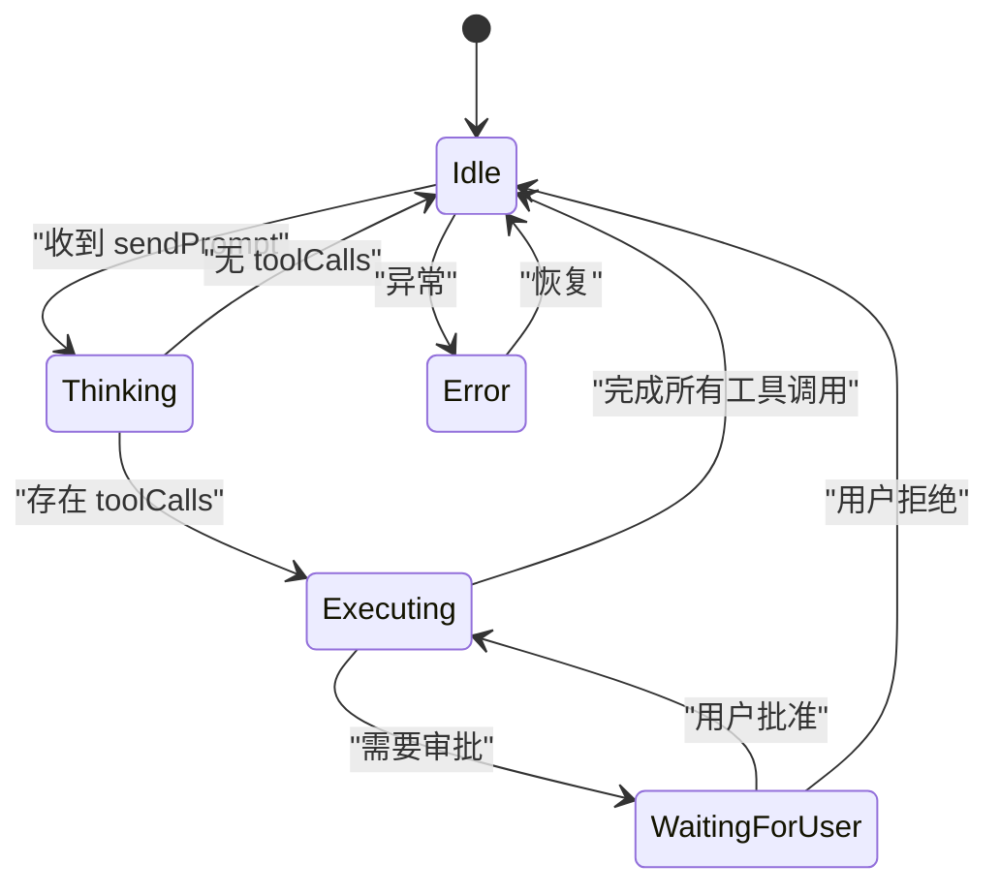
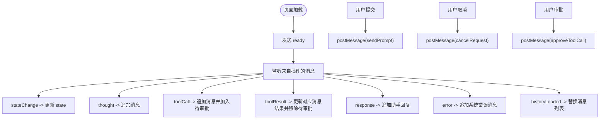
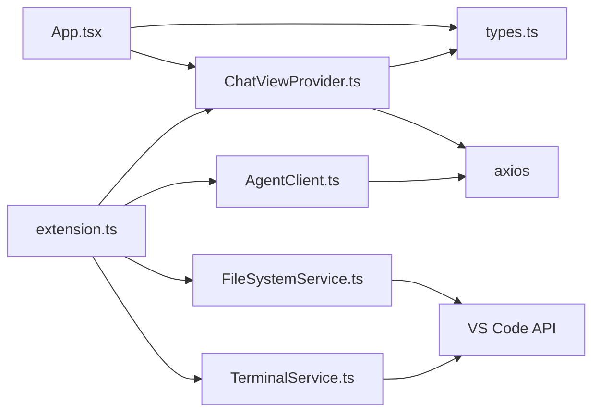

# 前端架构

<cite>
**本文引用的文件**
- [extension.ts](file://frontend-extension/src/extension.ts)
- [ChatViewProvider.ts](file://frontend-extension/src/core/ChatViewProvider.ts)
- [types.ts](file://frontend-extension/src/core/types.ts)
- [App.tsx](file://frontend-extension/src/webview/App.tsx)
- [AgentClient.ts](file://frontend-extension/src/services/AgentClient.ts)
- [FileSystemService.ts](file://frontend-extension/src/services/FileSystemService.ts)
- [TerminalService.ts](file://frontend-extension/src/services/TerminalService.ts)
- [main.tsx](file://frontend-extension/src/webview/main.tsx)
- [index.html](file://frontend-extension/src/webview/index.html)
- [styles.css](file://frontend-extension/src/webview/styles.css)
- [vite.config.ts](file://frontend-extension/vite.config.ts)
- [package.json](file://frontend-extension/package.json)
</cite>

## 目录
1. [引言](#引言)
2. [项目结构](#项目结构)
3. [核心组件](#核心组件)
4. [架构总览](#架构总览)
5. [详细组件分析](#详细组件分析)
6. [依赖关系分析](#依赖关系分析)
7. [性能考虑](#性能考虑)
8. [故障排查指南](#故障排查指南)
9. [结论](#结论)
10. [附录](#附录)

## 引言
本文件面向 VS Code 插件前端扩展，系统性解析其架构设计与实现要点，重点覆盖：
- 插件生命周期管理（extension.ts）
- 聊天界面 WebView 实现（App.tsx）
- 核心通信机制与消息协议（types.ts）
- ChatViewProvider 如何管理 UI 状态与消息流
- AgentClient 如何封装对 .NET Agent API 的 HTTP 调用
- 组件间依赖关系与事件通信模式（VS Code postMessage 机制）
- TypeScript 类型系统如何保障类型安全
- Vite 配置对构建优化的支持
- 前后端交互示例：发送 ChatRequest 并处理响应
- 错误处理、加载状态与用户反馈机制的设计

## 项目结构
前端扩展采用“VS Code 插件 + React WebView”的双层架构：
- 插件层：负责注册 Webview 提供者、命令、配置监听与服务实例注入
- WebView 层：基于 React 的聊天界面，通过 VS Code 的 postMessage 与插件层通信

```mermaid
graph TB
subgraph "VS Code 插件层"
EXT["extension.ts<br/>激活/停用与命令注册"]
CVP["ChatViewProvider.ts<br/>Webview 生命周期与消息路由"]
AGC["AgentClient.ts<br/>Agent/RAG API 客户端"]
FSS["FileSystemService.ts<br/>文件系统工具"]
TS["TerminalService.ts<br/>终端执行工具"]
end
subgraph "WebView 层"
APP["App.tsx<br/>聊天界面与状态管理"]
MAIN["main.tsx<br/>入口渲染"]
HTML["index.html<br/>根节点挂载"]
CSS["styles.css<br/>主题样式"]
end
EXT --> CVP
CVP --> AGC
CVP --> FSS
CVP --> TS
CVP <- --> APP
APP --> MAIN
MAIN --> HTML
HTML --> CSS
```

图表来源
- [extension.ts](file://frontend-extension/src/extension.ts#L1-L74)
- [ChatViewProvider.ts](file://frontend-extension/src/core/ChatViewProvider.ts#L1-L325)
- [AgentClient.ts](file://frontend-extension/src/services/AgentClient.ts#L1-L61)
- [FileSystemService.ts](file://frontend-extension/src/services/FileSystemService.ts#L1-L133)
- [TerminalService.ts](file://frontend-extension/src/services/TerminalService.ts#L1-L100)
- [App.tsx](file://frontend-extension/src/webview/App.tsx#L1-L312)
- [main.tsx](file://frontend-extension/src/webview/main.tsx#L1-L12)
- [index.html](file://frontend-extension/src/webview/index.html#L1-L13)
- [styles.css](file://frontend-extension/src/webview/styles.css#L1-L258)

章节来源
- [package.json](file://frontend-extension/package.json#L1-L100)
- [vite.config.ts](file://frontend-extension/vite.config.ts#L1-L29)

## 核心组件
- 插件入口与生命周期：在激活时初始化 AgentClient、文件系统与终端服务，并注册 Webview 提供者与命令；监听配置变更动态更新 API 地址；停用时释放终端资源。
- Webview 提供者：负责 WebView 生命周期、HTML 注入、消息接收与分发、状态机驱动的消息流与工具调用执行。
- 类型系统：使用 Zod 对消息协议进行运行时校验，确保前后端消息契约一致。
- Agent 客户端：封装对 .NET Agent API 与 Python RAG API 的 HTTP 请求，支持健康检查与超时控制。
- 文件与终端服务：为工具调用提供文件读写与命令执行能力。
- WebView 界面：React 组件负责消息渲染、输入框、状态指示器、审批按钮与取消请求等交互。

章节来源
- [extension.ts](file://frontend-extension/src/extension.ts#L1-L74)
- [ChatViewProvider.ts](file://frontend-extension/src/core/ChatViewProvider.ts#L1-L325)
- [types.ts](file://frontend-extension/src/core/types.ts#L1-L151)
- [AgentClient.ts](file://frontend-extension/src/services/AgentClient.ts#L1-L61)
- [FileSystemService.ts](file://frontend-extension/src/services/FileSystemService.ts#L1-L133)
- [TerminalService.ts](file://frontend-extension/src/services/TerminalService.ts#L1-L100)
- [App.tsx](file://frontend-extension/src/webview/App.tsx#L1-L312)

## 架构总览
下图展示从用户输入到后端响应的完整链路，包括消息协议、状态机与工具调用流程。



图表来源
- [App.tsx](file://frontend-extension/src/webview/App.tsx#L144-L175)
- [ChatViewProvider.ts](file://frontend-extension/src/core/ChatViewProvider.ts#L83-L149)
- [AgentClient.ts](file://frontend-extension/src/services/AgentClient.ts#L31-L39)
- [FileSystemService.ts](file://frontend-extension/src/services/FileSystemService.ts#L1-L133)
- [TerminalService.ts](file://frontend-extension/src/services/TerminalService.ts#L1-L100)

## 详细组件分析

### 插件生命周期管理（extension.ts）
- 激活阶段
  - 读取配置项（Agent/RAG API 地址），创建 AgentClient、文件系统与终端服务实例
  - 注册 Webview 提供者，启用 retainContextWhenHidden 以保持上下文
  - 注册命令：打开侧边栏、清空历史
  - 监听配置变更，动态更新 AgentClient 的 baseURL
- 停用阶段
  - 释放终端资源

章节来源
- [extension.ts](file://frontend-extension/src/extension.ts#L1-L74)
- [package.json](file://frontend-extension/package.json#L14-L47)

### ChatViewProvider：状态机与消息流
职责与流程
- 生命周期
  - resolveWebviewView 设置 webview 选项、注入 CSP 与 HTML，绑定消息监听
- 状态机
  - 内部维护 AgentState：Idle、Thinking、Executing、WaitingForUser、Error
  - 通过 _setState 推送 stateChange 到 WebView
- 消息路由
  - ready：回传历史与当前状态
  - sendPrompt：记录用户消息，设置 Thinking，调用 AgentClient.chat，按响应推送 thought/toolCalls/response
  - cancelRequest：中止当前请求，恢复 Idle
  - approveToolCall：根据用户选择执行或拒绝工具调用
- 工具调用执行
  - 支持 list_files/read_file/write_file/execute_command 四类工具
  - 若需要审批，进入 WaitingForUser 状态；否则直接执行并返回结果
- 历史管理
  - 维护对话历史，清空历史时同步通知 WebView



图表来源
- [ChatViewProvider.ts](file://frontend-extension/src/core/ChatViewProvider.ts#L1-L325)

章节来源
- [ChatViewProvider.ts](file://frontend-extension/src/core/ChatViewProvider.ts#L1-L325)

### WebView（App.tsx）：UI 状态与消息渲染
- 状态管理
  - messages：聊天消息列表（含 user/assistant/system/thought/tool）
  - state：AgentState，用于显示加载与提示
  - pendingApprovals：待审批工具调用集合
- 事件通信
  - 初始化时向插件发送 ready
  - 监听来自插件的消息：stateChange、thought、toolCall、toolResult、response、error、historyLoaded
  - 用户交互：提交消息、取消请求、审批工具调用
- 渲染逻辑
  - 根据消息角色渲染不同样式
  - 工具调用显示参数与结果，支持审批按钮
  - 自动滚动到底部，输入框禁用时态



图表来源
- [App.tsx](file://frontend-extension/src/webview/App.tsx#L1-L312)

章节来源
- [App.tsx](file://frontend-extension/src/webview/App.tsx#L1-L312)

### AgentClient：封装对 .NET Agent API 的 HTTP 调用
- 功能
  - chat：POST /api/chat，返回 AgentResponse
  - queryContext：POST /api/query，返回 RagQueryResponse
  - healthCheck：分别探测 Agent 与 RAG 服务健康状态
  - updateConfig：动态更新 baseURL
- 超时与安全
  - Agent API 超时 2 分钟，RAG API 超时 30 秒
  - 使用 axios 实例化，统一 Content-Type

```mermaid
classDiagram
class AgentClient {
-_agentApi
-_ragApi
+constructor(agentApiUrl, ragApiUrl)
+updateConfig(agentApiUrl, ragApiUrl)
+chat(request) AgentResponse
+queryContext(request) RagQueryResponse
+healthCheck() {agent : boolean, rag : boolean}
}
```

图表来源
- [AgentClient.ts](file://frontend-extension/src/services/AgentClient.ts#L1-L61)

章节来源
- [AgentClient.ts](file://frontend-extension/src/services/AgentClient.ts#L1-L61)

### 类型系统（types.ts）：消息协议与数据模型
- 消息协议
  - WebviewToExtensionMessageSchema：sendPrompt/cancelRequest/approveToolCall/ready
  - ExtensionToWebviewMessageSchema：stateChange/thought/toolCall/toolResult/response/error/historyLoaded
  - 使用 Zod 运行时校验，确保消息字段与类型一致
- 数据模型
  - AgentState：枚举状态
  - ToolCall/ToolResult：工具调用与结果
  - AgentRequest/AgentResponse：Agent API 请求/响应
  - ConversationMessage：对话消息
  - RagQueryRequest/RagQueryResponse/CodeChunk：RAG 查询相关

```mermaid
classDiagram
class AgentState {
<<enum>>
"Idle"
"Thinking"
"Executing"
"WaitingForUser"
"Error"
}
class WebviewToExtensionMessage {
<<union>>
"sendPrompt"
"cancelRequest"
"approveToolCall"
"ready"
}
class ExtensionToWebviewMessage {
<<union>>
"stateChange"
"thought"
"toolCall"
"toolResult"
"response"
"error"
"historyLoaded"
}
class ToolCall {
+id : string
+name : string
+arguments : Record
+requiresApproval : boolean
}
class ToolResult {
+callId : string
+success : boolean
+result : unknown
+error : string
}
class AgentRequest {
+prompt : string
+context : string
+workspacePath : string
+conversationHistory : ConversationMessage[]
}
class AgentResponse {
+thought : string
+toolCalls : ToolCall[]
+response : string
+done : boolean
}
WebviewToExtensionMessage --> AgentState : "stateChange"
ExtensionToWebviewMessage --> AgentState : "stateChange"
ExtensionToWebviewMessage --> ToolCall : "toolCall"
ExtensionToWebviewMessage --> ToolResult : "toolResult"
ExtensionToWebviewMessage --> AgentResponse : "response"
AgentClient --> AgentRequest : "chat"
AgentClient --> AgentResponse : "chat"
```

图表来源
- [types.ts](file://frontend-extension/src/core/types.ts#L1-L151)

章节来源
- [types.ts](file://frontend-extension/src/core/types.ts#L1-L151)

### Vite 配置与构建优化（vite.config.ts）
- 入口与输出
  - 单页入口：src/webview/index.html
  - 输出目录：dist/webview，Rollup 输出命名规则为 [name].js
- 别名
  - @、@core、@services、@webview，便于模块导入
- 插件
  - React 插件，提升开发体验

章节来源
- [vite.config.ts](file://frontend-extension/vite.config.ts#L1-L29)
- [package.json](file://frontend-extension/package.json#L68-L77)

### 前后端交互示例：发送 ChatRequest 并处理响应
- 发送 ChatRequest
  - WebView 触发 submit，postMessage(type='sendPrompt')
  - ChatViewProvider 记录用户消息，设置 Thinking，调用 AgentClient.chat
- 处理响应
  - 若包含 thought：推送 thought 到 WebView
  - 若包含 toolCalls：推送 toolCall，等待审批或直接执行，完成后推送 toolResult
  - 若包含 response：推送 response 到 WebView
  - 异常：推送 error 并进入 Error 状态

章节来源
- [App.tsx](file://frontend-extension/src/webview/App.tsx#L144-L175)
- [ChatViewProvider.ts](file://frontend-extension/src/core/ChatViewProvider.ts#L83-L149)
- [AgentClient.ts](file://frontend-extension/src/services/AgentClient.ts#L31-L39)

### 组件间依赖关系与事件通信模式
- 依赖关系
  - extension.ts 依赖 ChatViewProvider、AgentClient、FileSystemService、TerminalService
  - ChatViewProvider 依赖 types.ts 中的消息协议与状态定义
  - App.tsx 依赖 types.ts 中的消息协议与状态定义
  - AgentClient 依赖 axios
  - FileSystemService/ TerminalService 依赖 VS Code API
- 事件通信
  - WebView 通过 acquireVsCodeApi().postMessage 与插件通信
  - 插件通过 webview.postMessage 与 WebView 通信
  - 使用 Zod Schema 校验消息格式，避免类型不匹配导致的运行时错误

章节来源
- [extension.ts](file://frontend-extension/src/extension.ts#L1-L74)
- [ChatViewProvider.ts](file://frontend-extension/src/core/ChatViewProvider.ts#L1-L325)
- [App.tsx](file://frontend-extension/src/webview/App.tsx#L1-L312)
- [types.ts](file://frontend-extension/src/core/types.ts#L1-L151)

## 依赖关系分析
- 模块耦合
  - ChatViewProvider 与 AgentClient 解耦，通过接口抽象（AgentRequest/AgentResponse）隔离网络细节
  - 工具调用通过 FileSystemService 与 TerminalService 抽象，便于替换与测试
- 外部依赖
  - axios：HTTP 客户端
  - zod：消息协议校验
  - react/react-dom：UI 渲染
  - vite + @vitejs/plugin-react：构建与开发服务器



图表来源
- [extension.ts](file://frontend-extension/src/extension.ts#L1-L74)
- [ChatViewProvider.ts](file://frontend-extension/src/core/ChatViewProvider.ts#L1-L325)
- [AgentClient.ts](file://frontend-extension/src/services/AgentClient.ts#L1-L61)
- [FileSystemService.ts](file://frontend-extension/src/services/FileSystemService.ts#L1-L133)
- [TerminalService.ts](file://frontend-extension/src/services/TerminalService.ts#L1-L100)
- [App.tsx](file://frontend-extension/src/webview/App.tsx#L1-L312)
- [types.ts](file://frontend-extension/src/core/types.ts#L1-L151)

章节来源
- [package.json](file://frontend-extension/package.json#L78-L99)

## 性能考虑
- 构建优化
  - Vite 单页入口与 Rollup 输出命名，减少包体积与加载时间
  - 开发环境热更新与生产环境压缩打包
- 网络请求
  - Agent API 长耗时请求设置较长超时，RAG API 设置较短超时，避免阻塞
  - 健康检查异步探测，不影响主流程
- UI 交互
  - WebView 使用 retainContextWhenHidden，隐藏时保留状态，减少重建成本
  - 消息列表按需更新，避免全量重渲染

[本节为通用建议，无需列出具体文件来源]

## 故障排查指南
- 无法连接后端
  - 检查配置项 alagent.agentApiUrl 与 alagent.ragApiUrl 是否正确
  - 在插件激活时打印日志确认 baseURL 已更新
  - 使用 healthCheck 检查服务可用性
- 请求被取消
  - 确认 WebView 状态为非 Idle 时禁止提交
  - cancelRequest 会触发 AbortController.abort，确保后续状态回到 Idle
- 工具调用未执行
  - 若 requiresApproval 为真，需等待用户审批后再执行
  - 审批拒绝会返回失败结果并恢复 Idle
- 文件/命令执行失败
  - 文件大小限制、路径解析、权限问题可能导致异常
  - 终端命令超时默认 30 秒，必要时调整工作目录

章节来源
- [extension.ts](file://frontend-extension/src/extension.ts#L57-L68)
- [ChatViewProvider.ts](file://frontend-extension/src/core/ChatViewProvider.ts#L140-L149)
- [FileSystemService.ts](file://frontend-extension/src/services/FileSystemService.ts#L65-L83)
- [TerminalService.ts](file://frontend-extension/src/services/TerminalService.ts#L13-L59)

## 结论
该前端扩展通过清晰的分层与强类型协议，实现了 VS Code 插件与 WebView 的稳定通信。ChatViewProvider 将状态机与消息流解耦，AgentClient 将网络细节抽象化，WebView 则专注于用户交互与反馈。配合 Vite 的构建优化与 Zod 的运行时校验，整体具备良好的可维护性与扩展性。

[本节为总结性内容，无需列出具体文件来源]

## 附录
- WebView 入口与挂载
  - main.tsx 负责渲染根组件
  - index.html 提供挂载点
  - styles.css 使用 VS Code 主题变量，适配暗色/亮色主题
- 构建脚本
  - package.json 中定义了构建与监听脚本，分别构建插件与 WebView

章节来源
- [main.tsx](file://frontend-extension/src/webview/main.tsx#L1-L12)
- [index.html](file://frontend-extension/src/webview/index.html#L1-L13)
- [styles.css](file://frontend-extension/src/webview/styles.css#L1-L258)
- [package.json](file://frontend-extension/package.json#L68-L77)