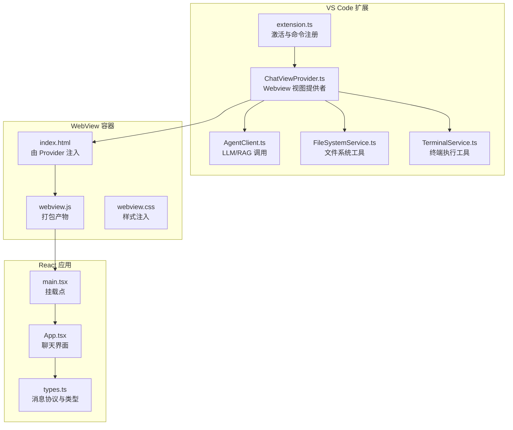
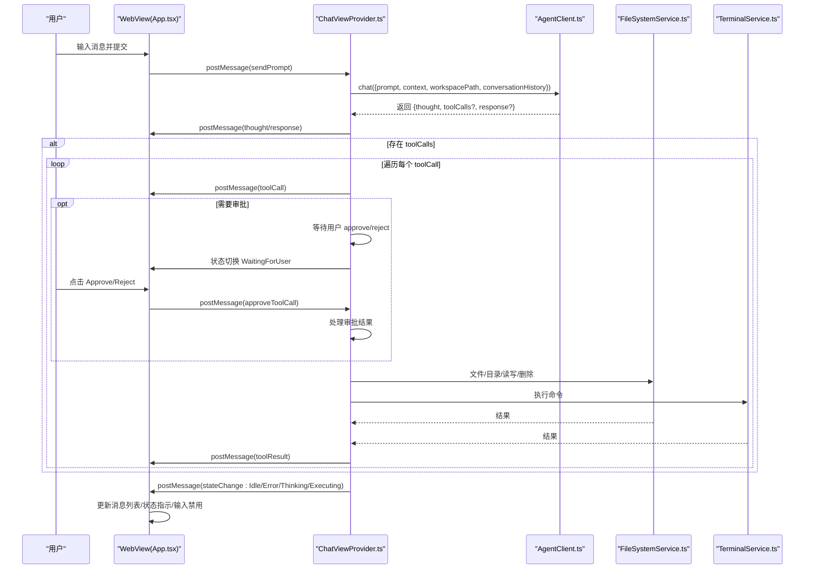
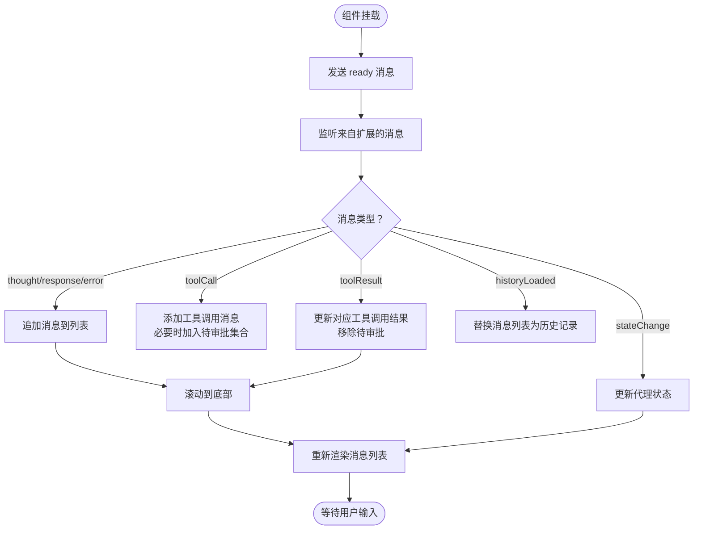
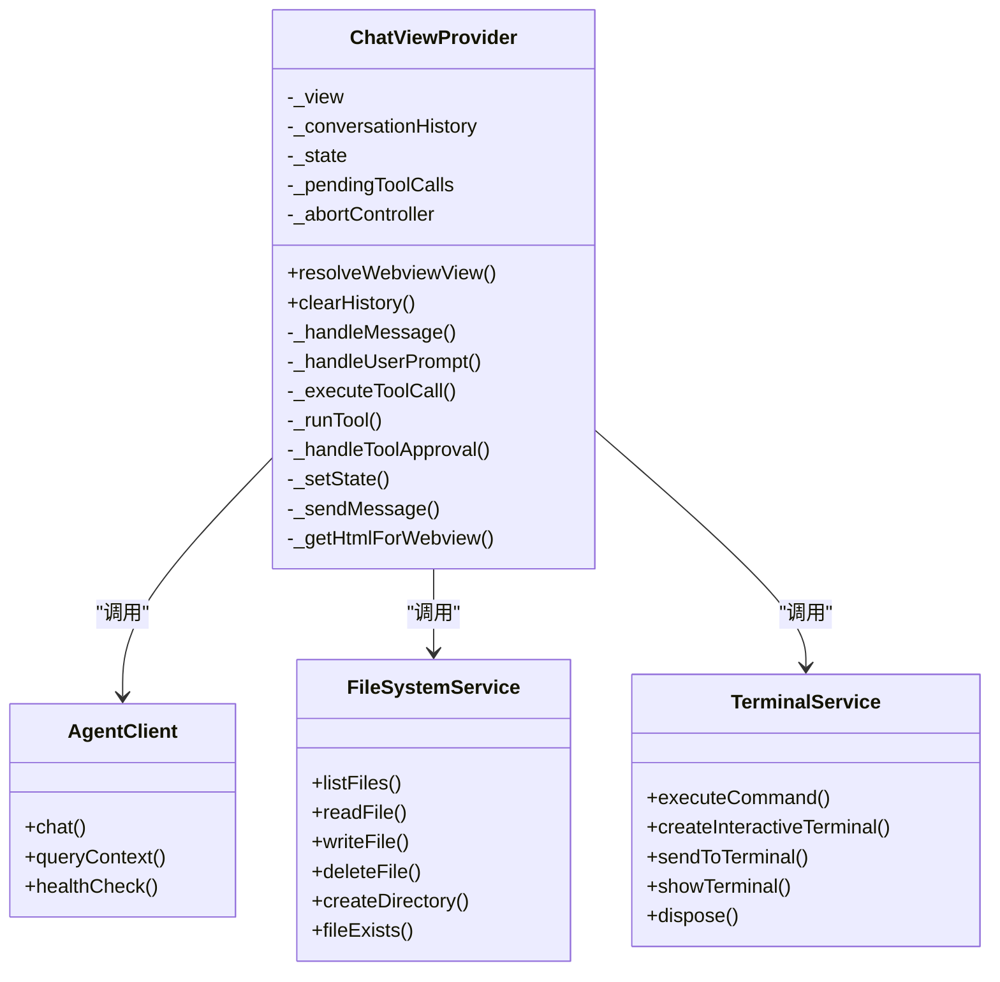
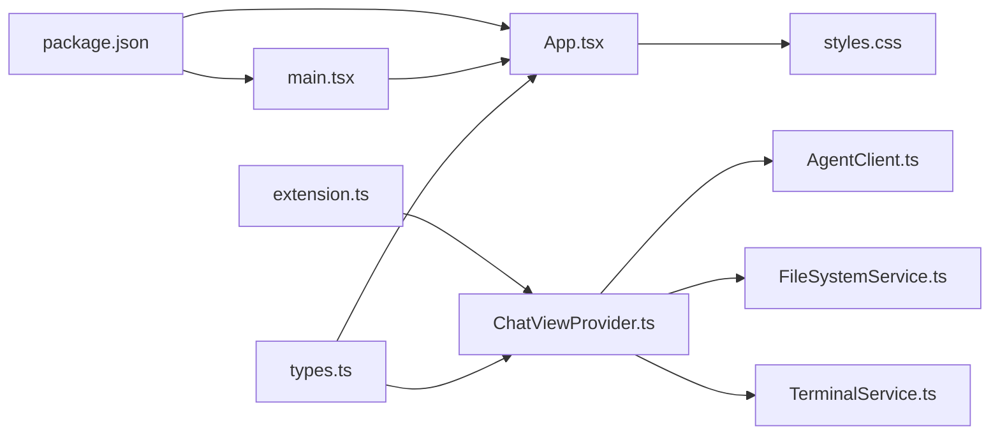

# 前端组件结构

<cite>
**本文引用的文件**
- [frontend-extension/src/webview/App.tsx](file://frontend-extension/src/webview/App.tsx)
- [frontend-extension/src/webview/main.tsx](file://frontend-extension/src/webview/main.tsx)
- [frontend-extension/src/webview/styles.css](file://frontend-extension/src/webview/styles.css)
- [frontend-extension/src/core/ChatViewProvider.ts](file://frontend-extension/src/core/ChatViewProvider.ts)
- [frontend-extension/src/core/types.ts](file://frontend-extension/src/core/types.ts)
- [frontend-extension/src/services/AgentClient.ts](file://frontend-extension/src/services/AgentClient.ts)
- [frontend-extension/src/services/FileSystemService.ts](file://frontend-extension/src/services/FileSystemService.ts)
- [frontend-extension/src/services/TerminalService.ts](file://frontend-extension/src/services/TerminalService.ts)
- [frontend-extension/src/extension.ts](file://frontend-extension/src/extension.ts)
- [frontend-extension/package.json](file://frontend-extension/package.json)
</cite>

## 目录
1. [简介](#简介)
2. [项目结构](#项目结构)
3. [核心组件](#核心组件)
4. [架构总览](#架构总览)
5. [详细组件分析](#详细组件分析)
6. [依赖分析](#依赖分析)
7. [性能考虑](#性能考虑)
8. [故障排查指南](#故障排查指南)
9. [结论](#结论)
10. [附录](#附录)

## 简介
本文件聚焦于基于 React 的聊天界面（App.tsx）的 UI 布局与状态管理机制，系统性解析 ChatViewProvider 如何作为核心状态容器，管理对话历史、加载状态与用户交互逻辑；阐述组件生命周期、响应式更新机制以及与 VS Code WebView 环境的集成方式；结合样式与实际代码路径，展示消息列表渲染、输入框处理与动态样式应用；最后总结组件拆分最佳实践与性能优化策略。

## 项目结构
前端扩展采用“VS Code 扩展 + WebView + React 应用”的三层结构：
- 扩展入口：注册 Webview 视图、命令与配置监听，负责服务实例化与视图提供者绑定。
- 视图提供者：在 WebView 中注入 HTML、脚本与样式，桥接扩展侧业务逻辑与 Webview 侧 UI。
- React 应用：在 WebView 内部渲染聊天界面，通过消息协议与扩展侧通信。

图表来源
- [frontend-extension/src/extension.ts](file://frontend-extension/src/extension.ts#L1-L74)
- [frontend-extension/src/core/ChatViewProvider.ts](file://frontend-extension/src/core/ChatViewProvider.ts#L1-L120)
- [frontend-extension/src/webview/main.tsx](file://frontend-extension/src/webview/main.tsx#L1-L12)
- [frontend-extension/src/webview/App.tsx](file://frontend-extension/src/webview/App.tsx#L1-L60)
- [frontend-extension/src/core/types.ts](file://frontend-extension/src/core/types.ts#L1-L90)

章节来源
- [frontend-extension/src/extension.ts](file://frontend-extension/src/extension.ts#L1-L74)
- [frontend-extension/src/core/ChatViewProvider.ts](file://frontend-extension/src/core/ChatViewProvider.ts#L1-L120)
- [frontend-extension/src/webview/main.tsx](file://frontend-extension/src/webview/main.tsx#L1-L12)
- [frontend-extension/src/webview/App.tsx](file://frontend-extension/src/webview/App.tsx#L1-L60)
- [frontend-extension/src/core/types.ts](file://frontend-extension/src/core/types.ts#L1-L90)

## 核心组件
- App.tsx：React 聊天界面，负责消息渲染、输入处理、状态指示与工具调用审批交互。
- ChatViewProvider.ts：VS Code Webview 视图提供者，承载对话历史、状态机与工具执行流程，向 WebView 发送消息驱动 UI 更新。
- main.tsx：React 应用挂载入口，将 App 渲染到 DOM。
- styles.css：VS Code 主题变量驱动的样式体系，统一消息气泡、工具调用、输入区与滚动条风格。
- types.ts：定义消息协议（双向）、状态枚举、工具调用/结果结构等，使用 Zod 进行运行时校验。
- AgentClient.ts、FileSystemService.ts、TerminalService.ts：扩展侧服务，分别负责 LLM/RAG 请求、文件系统操作与终端命令执行。
- extension.ts：扩展激活逻辑，注册视图、命令与配置变更监听。

章节来源
- [frontend-extension/src/webview/App.tsx](file://frontend-extension/src/webview/App.tsx#L1-L312)
- [frontend-extension/src/core/ChatViewProvider.ts](file://frontend-extension/src/core/ChatViewProvider.ts#L1-L325)
- [frontend-extension/src/webview/main.tsx](file://frontend-extension/src/webview/main.tsx#L1-L12)
- [frontend-extension/src/webview/styles.css](file://frontend-extension/src/webview/styles.css#L1-L258)
- [frontend-extension/src/core/types.ts](file://frontend-extension/src/core/types.ts#L1-L151)
- [frontend-extension/src/services/AgentClient.ts](file://frontend-extension/src/services/AgentClient.ts#L1-L61)
- [frontend-extension/src/services/FileSystemService.ts](file://frontend-extension/src/services/FileSystemService.ts#L1-L133)
- [frontend-extension/src/services/TerminalService.ts](file://frontend-extension/src/services/TerminalService.ts#L1-L100)
- [frontend-extension/src/extension.ts](file://frontend-extension/src/extension.ts#L1-L74)

## 架构总览
下图展示了从用户输入到消息渲染与工具调用的完整链路，包括 VS Code WebView 生命周期、消息协议与状态机流转。

图表来源
- [frontend-extension/src/webview/App.tsx](file://frontend-extension/src/webview/App.tsx#L140-L210)
- [frontend-extension/src/core/ChatViewProvider.ts](file://frontend-extension/src/core/ChatViewProvider.ts#L55-L170)
- [frontend-extension/src/services/AgentClient.ts](file://frontend-extension/src/services/AgentClient.ts#L31-L40)
- [frontend-extension/src/services/FileSystemService.ts](file://frontend-extension/src/services/FileSystemService.ts#L1-L133)
- [frontend-extension/src/services/TerminalService.ts](file://frontend-extension/src/services/TerminalService.ts#L1-L100)

## 详细组件分析

### App.tsx：聊天界面与状态管理
- 状态容器
  - 对话消息数组、输入值、代理状态、待审批集合、滚动锚点与输入框引用。
- 生命周期与响应式更新
  - 初始化订阅 WebView 消息事件，接收扩展侧状态变更与消息推送；首次渲染后发送 ready；卸载时移除监听。
  - 使用副作用在消息列表变化时自动滚动到底部。
- 消息渲染
  - 根据角色渲染不同样式的消息气泡；工具调用消息包含参数与结果展示；支持审批按钮。
- 用户交互
  - 表单提交、键盘快捷键（回车发送）、取消请求、审批工具调用。
- 动态样式
  - 通过类名映射不同角色与状态，配合 styles.css 实现 VS Code 主题适配。

图表来源
- [frontend-extension/src/webview/App.tsx](file://frontend-extension/src/webview/App.tsx#L43-L142)
- [frontend-extension/src/webview/App.tsx](file://frontend-extension/src/webview/App.tsx#L144-L210)
- [frontend-extension/src/webview/App.tsx](file://frontend-extension/src/webview/App.tsx#L210-L310)

章节来源
- [frontend-extension/src/webview/App.tsx](file://frontend-extension/src/webview/App.tsx#L1-L312)

### ChatViewProvider.ts：核心状态容器与工具执行编排
- 视图初始化
  - 设置 WebView 选项、注入 HTML、启用脚本与本地资源根、设置 CSP。
- 消息协议处理
  - ready：发送历史与当前状态给 WebView。
  - sendPrompt：记录用户消息、进入 Thinking 状态、调用 AgentClient.chat、按需发送 thought、遍历 toolCalls 并执行、最终发送 response、回到 Idle。
  - cancelRequest：中止当前请求，回到 Idle。
  - approveToolCall：根据审批结果继续执行或返回失败结果，维护待审批集合与状态机。
- 工具执行
  - toolCall -> toolResult：根据工具名称路由到 FileSystemService 或 TerminalService，捕获异常并回传错误信息。
- 状态机
  - Idle、Thinking、Executing、WaitingForUser、Error，通过 stateChange 推送给 WebView。

图表来源
- [frontend-extension/src/core/ChatViewProvider.ts](file://frontend-extension/src/core/ChatViewProvider.ts#L1-L325)
- [frontend-extension/src/services/AgentClient.ts](file://frontend-extension/src/services/AgentClient.ts#L1-L61)
- [frontend-extension/src/services/FileSystemService.ts](file://frontend-extension/src/services/FileSystemService.ts#L1-L133)
- [frontend-extension/src/services/TerminalService.ts](file://frontend-extension/src/services/TerminalService.ts#L1-L100)

章节来源
- [frontend-extension/src/core/ChatViewProvider.ts](file://frontend-extension/src/core/ChatViewProvider.ts#L1-L325)

### main.tsx：React 应用挂载
- 创建根节点并渲染 App，在 StrictMode 下保证开发期行为一致。
- 引入全局样式以确保 WebView 环境下的主题一致性。

章节来源
- [frontend-extension/src/webview/main.tsx](file://frontend-extension/src/webview/main.tsx#L1-L12)

### styles.css：动态样式与主题适配
- 使用 VS Code 主题变量（字体、字号、背景、前景、按钮、输入、滚动条等），使界面与编辑器风格一致。
- 消息气泡按角色区分（用户、助手、思考、工具、系统），工具调用包含参数块与结果标签。
- 输入区与按钮采用统一的边框、悬停与禁用态样式，滚动条自定义。

章节来源
- [frontend-extension/src/webview/styles.css](file://frontend-extension/src/webview/styles.css#L1-L258)

### 类型与消息协议：types.ts
- AgentState：代理状态机枚举。
- WebviewToExtensionMessageSchema：从 WebView 到扩展的消息协议（发送提示、取消请求、审批工具调用、ready）。
- ExtensionToWebviewMessageSchema：从扩展到 WebView 的消息协议（状态变更、思考、工具调用、工具结果、最终回复、错误、历史加载）。
- 工具调用/结果、对话消息、RAG 查询等数据结构。

章节来源
- [frontend-extension/src/core/types.ts](file://frontend-extension/src/core/types.ts#L1-L151)

### 服务层：AgentClient、FileSystemService、TerminalService
- AgentClient：封装 LLM/RAG API 调用，支持超时与健康检查。
- FileSystemService：文件系统操作（列出、读取、写入、删除、创建目录、存在性检查），路径解析到工作区根。
- TerminalService：跨平台命令执行（子进程），带超时与输出缓冲，支持交互式终端。

章节来源
- [frontend-extension/src/services/AgentClient.ts](file://frontend-extension/src/services/AgentClient.ts#L1-L61)
- [frontend-extension/src/services/FileSystemService.ts](file://frontend-extension/src/services/FileSystemService.ts#L1-L133)
- [frontend-extension/src/services/TerminalService.ts](file://frontend-extension/src/services/TerminalService.ts#L1-L100)

### VS Code 扩展入口：extension.ts
- 激活时读取配置，初始化 AgentClient、FileSystemService、TerminalService。
- 注册 Webview 视图提供者，保留上下文隐藏时保持状态。
- 注册命令：打开聊天视图、清空历史。
- 监听配置变更，动态更新 Agent/RAG API 地址。

章节来源
- [frontend-extension/src/extension.ts](file://frontend-extension/src/extension.ts#L1-L74)

## 依赖分析
- 组件耦合
  - App.tsx 仅依赖 types.ts 的消息协议与 VS Code API；与 ChatViewProvider 解耦，通过 postMessage 通信。
  - ChatViewProvider 依赖 AgentClient、FileSystemService、TerminalService，承担业务编排与状态机。
- 外部依赖
  - React 生态：React、ReactDOM。
  - 网络：axios。
  - 类型校验：zod。
  - VS Code WebView UI Toolkit。
- 构建与脚本
  - Vite 打包 WebView 资源，esbuild 打包扩展主程序；支持 watch 开发模式。

图表来源
- [frontend-extension/src/core/types.ts](file://frontend-extension/src/core/types.ts#L1-L151)
- [frontend-extension/src/webview/App.tsx](file://frontend-extension/src/webview/App.tsx#L1-L60)
- [frontend-extension/src/core/ChatViewProvider.ts](file://frontend-extension/src/core/ChatViewProvider.ts#L1-L120)
- [frontend-extension/src/services/AgentClient.ts](file://frontend-extension/src/services/AgentClient.ts#L1-L61)
- [frontend-extension/src/services/FileSystemService.ts](file://frontend-extension/src/services/FileSystemService.ts#L1-L133)
- [frontend-extension/src/services/TerminalService.ts](file://frontend-extension/src/services/TerminalService.ts#L1-L100)
- [frontend-extension/src/webview/main.tsx](file://frontend-extension/src/webview/main.tsx#L1-L12)
- [frontend-extension/src/webview/styles.css](file://frontend-extension/src/webview/styles.css#L1-L258)
- [frontend-extension/src/extension.ts](file://frontend-extension/src/extension.ts#L1-L74)
- [frontend-extension/package.json](file://frontend-extension/package.json#L68-L99)

章节来源
- [frontend-extension/src/extension.ts](file://frontend-extension/src/extension.ts#L1-L74)
- [frontend-extension/src/core/ChatViewProvider.ts](file://frontend-extension/src/core/ChatViewProvider.ts#L1-L120)
- [frontend-extension/src/webview/App.tsx](file://frontend-extension/src/webview/App.tsx#L1-L60)
- [frontend-extension/src/core/types.ts](file://frontend-extension/src/core/types.ts#L1-L151)
- [frontend-extension/package.json](file://frontend-extension/package.json#L68-L99)

## 性能考虑
- 虚拟滚动
  - 当消息数量增长时，建议引入虚拟滚动（例如 react-window 或 react-virtualized）以降低 DOM 节点数量与重排成本。
- 防抖输入
  - 对输入框的实时预览或自动补全场景可引入防抖，减少不必要的状态更新与渲染。
- 事件与回调
  - 将高频回调（如输入框 onChange）用 useCallback 包裹，避免子组件不必要重渲染。
- 状态粒度
  - 将消息列表与输入值拆分为独立状态，避免无关状态导致的 UI 重绘。
- 图片/长文本
  - 对长文本内容使用折叠或懒加载策略，减少首屏压力。
- 缓存与去重
  - 工具调用结果可做缓存，避免重复执行相同命令或读取相同文件。
- 取消请求
  - 使用 AbortController 在用户取消时中断网络请求与长时间执行的任务，释放资源。

## 故障排查指南
- WebView 无法加载
  - 检查 CSP 与脚本/样式 URI 是否正确注入；确认 Provider 的 HTML 生成与 nonce 设置。
- 消息不显示
  - 确认扩展侧已发送 historyLoaded 与 stateChange；检查 WebView 是否收到 ready 并回发。
- 工具调用无响应
  - 检查 approveToolCall 是否被触发；确认 _pendingToolCalls 中是否存在对应 callId；查看工具执行日志与错误回传。
- 输入不可用
  - 检查代理状态是否为 Idle；确认输入框禁用条件与按钮禁用逻辑。
- 样式异常
  - 确认 styles.css 已注入；检查 VS Code 主题变量是否可用；核对类名与选择器。

章节来源
- [frontend-extension/src/core/ChatViewProvider.ts](file://frontend-extension/src/core/ChatViewProvider.ts#L290-L325)
- [frontend-extension/src/webview/App.tsx](file://frontend-extension/src/webview/App.tsx#L144-L210)
- [frontend-extension/src/webview/styles.css](file://frontend-extension/src/webview/styles.css#L1-L258)

## 结论
该聊天界面以 App.tsx 为核心 UI 层，通过消息协议与 ChatViewProvider 解耦，后者承担状态机与工具执行编排。整体架构清晰、职责明确：扩展侧专注业务与工具调用，WebView 侧专注渲染与交互。通过 VS Code WebView 的生命周期与 CSP 安全模型，实现了安全可控的前端体验。建议后续引入虚拟滚动与输入防抖等性能优化，并持续完善错误处理与日志追踪。

## 附录
- 组件拆分最佳实践
  - 将消息项抽象为 MessageItem 组件，工具调用项抽象为 ToolCallItem，输入区抽象为 InputArea，状态指示抽象为 StateIndicator。
  - 将工具执行结果与审批逻辑抽取为独立 Hook，便于复用与测试。
- 关键代码路径参考
  - App.tsx：消息渲染与交互逻辑位于 [frontend-extension/src/webview/App.tsx](file://frontend-extension/src/webview/App.tsx#L200-L310)
  - ChatViewProvider.ts：状态机与工具执行位于 [frontend-extension/src/core/ChatViewProvider.ts](file://frontend-extension/src/core/ChatViewProvider.ts#L90-L210)
  - 消息协议定义位于 [frontend-extension/src/core/types.ts](file://frontend-extension/src/core/types.ts#L1-L90)
  - 样式主题变量与消息样式位于 [frontend-extension/src/webview/styles.css](file://frontend-extension/src/webview/styles.css#L1-L200)