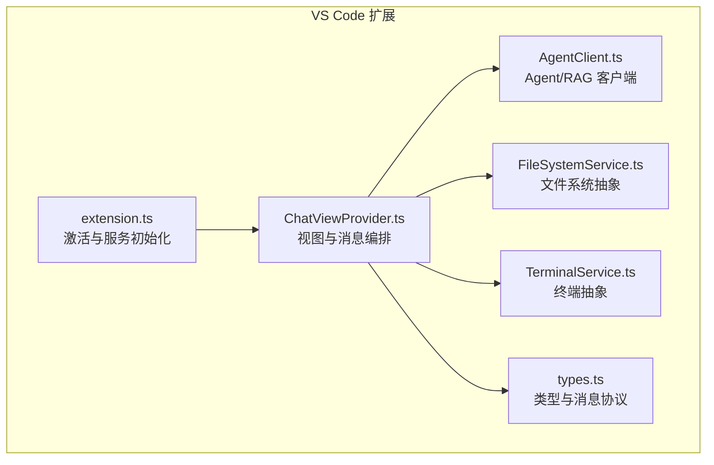
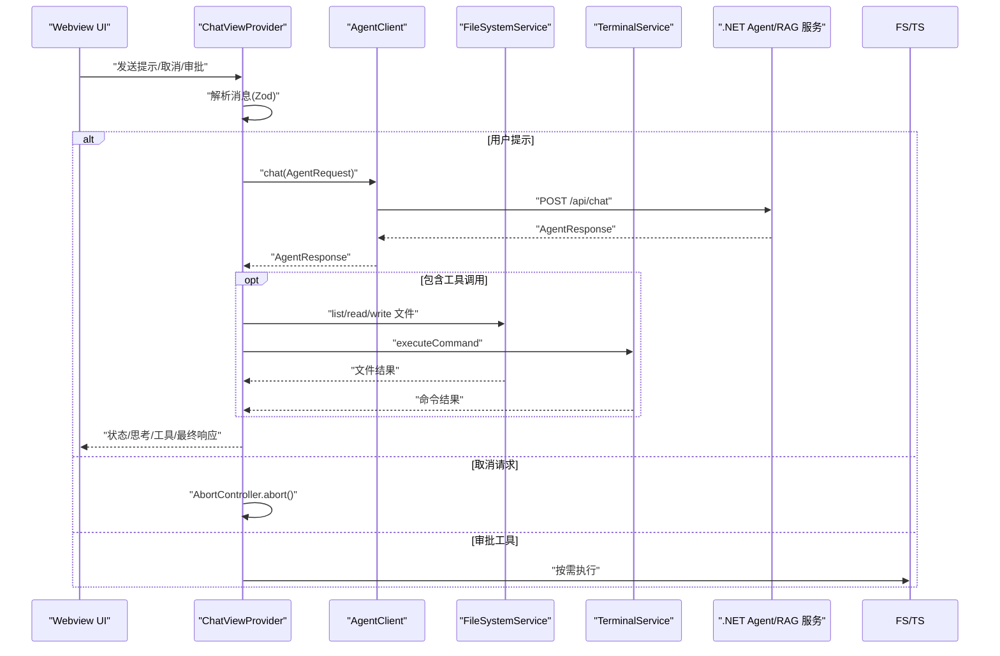
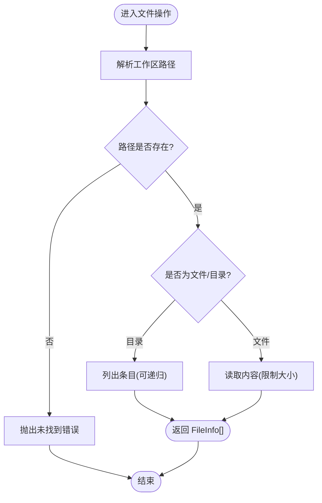
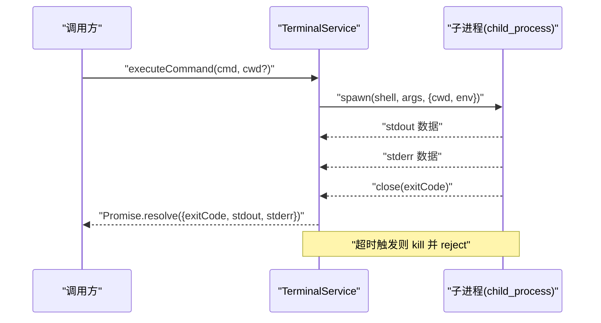
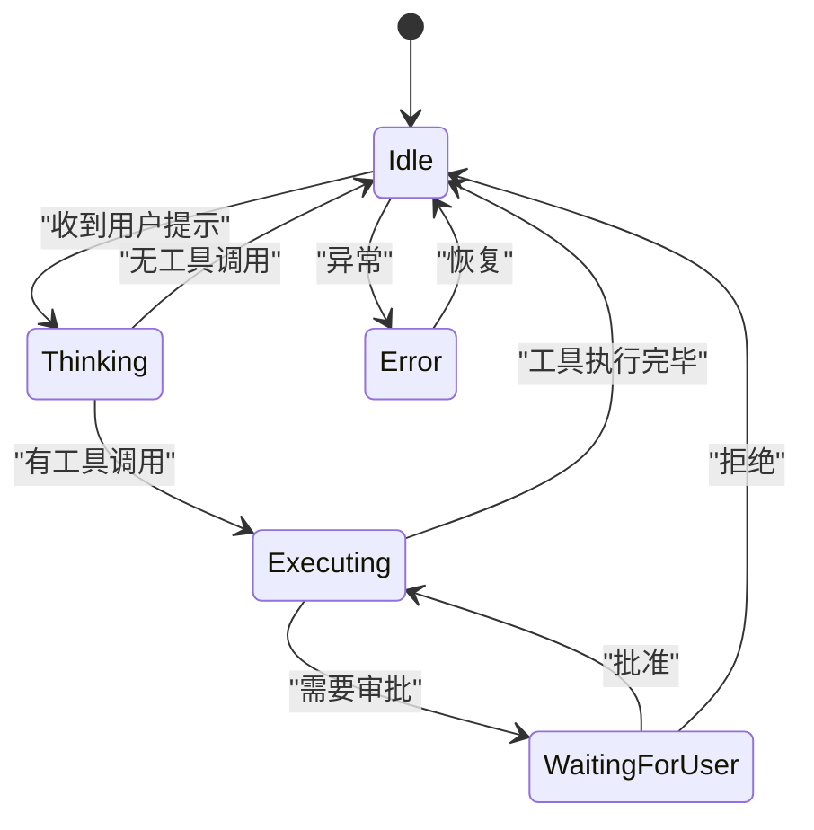
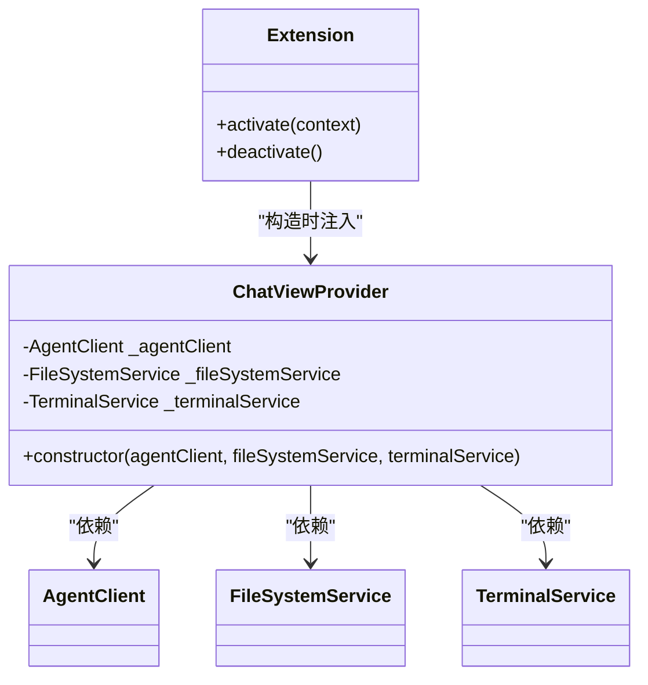
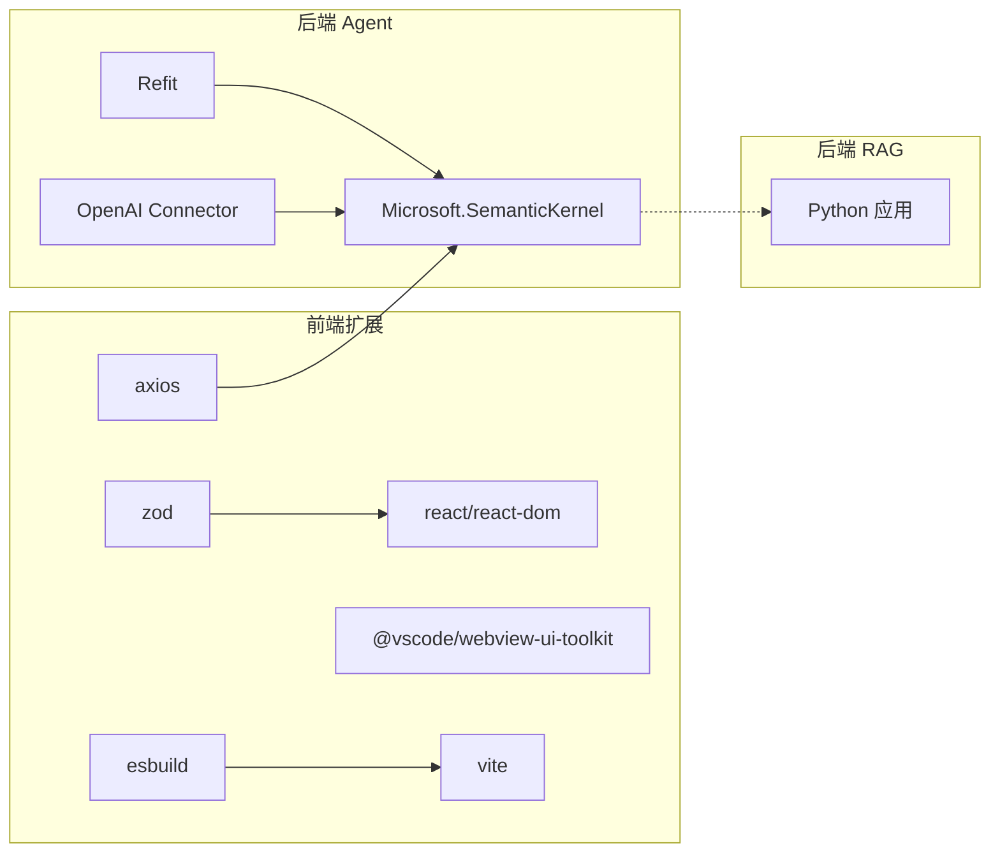

# 服务集成与依赖

<cite>
**本文引用的文件**
- [AgentClient.ts](file://frontend-extension/src/services/AgentClient.ts)
- [FileSystemService.ts](file://frontend-extension/src/services/FileSystemService.ts)
- [TerminalService.ts](file://frontend-extension/src/services/TerminalService.ts)
- [types.ts](file://frontend-extension/src/core/types.ts)
- [ChatViewProvider.ts](file://frontend-extension/src/core/ChatViewProvider.ts)
- [extension.ts](file://frontend-extension/src/extension.ts)
- [package.json](file://frontend-extension/package.json)
- [vite.config.ts](file://frontend-extension/vite.config.ts)
- [tsconfig.json](file://frontend-extension/tsconfig.json)
- [Program.cs](file://backend-agent/Program.cs)
- [ChatController.cs](file://backend-agent/Controllers/ChatController.cs)
- [ChatModels.cs](file://backend-agent/Models/ChatModels.cs)
- [IAgentService.cs](file://backend-agent/Services/IAgentService.cs)
- [AgentService.cs](file://backend-agent/Services/AgentService.cs)
- [IRagClient.cs](file://backend-agent/Services/IRagClient.cs)
- [FileSystemTools.cs](file://backend-agent/Tools/FileSystemTools.cs)
- [CodeAnalysisTools.cs](file://backend-agent/Tools/CodeAnalysisTools.cs)
</cite>

## 目录
1. [引言](#引言)
2. [项目结构](#项目结构)
3. [核心组件](#核心组件)
4. [架构总览](#架构总览)
5. [详细组件分析](#详细组件分析)
6. [依赖关系分析](#依赖关系分析)
7. [性能考量](#性能考量)
8. [故障排查指南](#故障排查指南)
9. [结论](#结论)
10. [附录](#附录)

## 引言
本文件系统性阐述前端服务层的设计与集成方式，重点围绕以下目标：
- AgentClient 如何基于 TypeScript 接口（types.ts）实现类型安全的 REST API 调用，封装对 .NET Agent 服务与 RAG 服务的请求逻辑；
- FileSystemService 与 TerminalService 如何抽象 VS Code API 与 Node 子进程，提供统一的文件操作与终端控制接口；
- 服务间的依赖注入模式及其实现机制；
- 通过实际调用示例展示服务如何被组件调用并处理异步响应；
- 服务层的可测试性设计，包括 mock 策略与单元测试覆盖；
- 错误边界处理、权限校验与用户体验一致性。

## 项目结构
前端扩展采用“核心协议 + 服务层 + 视图提供者 + 扩展入口”的分层组织：
- 核心协议：定义消息协议、工具调用与响应模型（types.ts）
- 服务层：AgentClient、FileSystemService、TerminalService
- 视图提供者：ChatViewProvider，负责与 webview 通信、状态机与工具执行编排
- 扩展入口：extension.ts，初始化服务并注册视图与命令



图表来源
- [extension.ts](file://frontend-extension/src/extension.ts#L1-L74)
- [ChatViewProvider.ts](file://frontend-extension/src/core/ChatViewProvider.ts#L1-L325)
- [AgentClient.ts](file://frontend-extension/src/services/AgentClient.ts#L1-L61)
- [FileSystemService.ts](file://frontend-extension/src/services/FileSystemService.ts#L1-L133)
- [TerminalService.ts](file://frontend-extension/src/services/TerminalService.ts#L1-L100)
- [types.ts](file://frontend-extension/src/core/types.ts#L1-L151)

章节来源
- [extension.ts](file://frontend-extension/src/extension.ts#L1-L74)
- [vite.config.ts](file://frontend-extension/vite.config.ts#L1-L28)
- [tsconfig.json](file://frontend-extension/tsconfig.json#L1-L29)
- [package.json](file://frontend-extension/package.json#L1-L100)

## 核心组件
- AgentClient：封装对 .NET Agent 与 RAG 服务的 REST 调用，提供聊天、上下文检索与健康检查能力；基于 axios 实例化两个客户端，分别指向不同后端服务，并通过 Zod Schema 对消息进行运行时校验。
- FileSystemService：抽象本地文件系统操作，屏蔽 VS Code 工作区路径解析与常见异常（如路径不存在、目录/文件类型不匹配、大小限制等），提供列表、读取、写入、删除、创建目录与存在性判断等方法。
- TerminalService：抽象子进程执行与交互终端，支持跨平台 shell（Windows 使用 PowerShell，类 Unix 使用 bash），提供命令执行、交互式终端创建与输出缓冲管理，并设置超时保护。
- ChatViewProvider：作为 VS Code Webview 的提供者，负责消息路由、状态机转换、工具调用审批与执行、历史记录维护以及与 AgentClient、FileSystemService、TerminalService 的协作。
- 类型与消息协议（types.ts）：定义 Webview 与扩展之间的消息类型、Agent 状态机、工具调用与结果、Agent/RAG 请求/响应模型，确保前后端数据契约一致。

章节来源
- [AgentClient.ts](file://frontend-extension/src/services/AgentClient.ts#L1-L61)
- [FileSystemService.ts](file://frontend-extension/src/services/FileSystemService.ts#L1-L133)
- [TerminalService.ts](file://frontend-extension/src/services/TerminalService.ts#L1-L100)
- [ChatViewProvider.ts](file://frontend-extension/src/core/ChatViewProvider.ts#L1-L325)
- [types.ts](file://frontend-extension/src/core/types.ts#L1-L151)

## 架构总览
下图展示了前端服务层在 VS Code 扩展中的角色与交互关系，以及与后端 Agent/RAG 服务的调用链路。



图表来源
- [ChatViewProvider.ts](file://frontend-extension/src/core/ChatViewProvider.ts#L45-L280)
- [AgentClient.ts](file://frontend-extension/src/services/AgentClient.ts#L31-L60)
- [FileSystemService.ts](file://frontend-extension/src/services/FileSystemService.ts#L13-L133)
- [TerminalService.ts](file://frontend-extension/src/services/TerminalService.ts#L13-L60)
- [types.ts](file://frontend-extension/src/core/types.ts#L1-L151)

## 详细组件分析

### AgentClient：类型安全的 REST 客户端
- 设计要点
  - 基于 axios 创建两个实例，分别指向 Agent 与 RAG 服务，设置默认 baseURL、超时与 Content-Type 头；
  - 提供 chat 与 queryContext 方法，返回强类型响应对象；
  - 提供 updateConfig 动态更新 baseURL；
  - 提供 healthCheck 并行探测两个服务健康状态。
- 类型安全
  - 请求/响应类型来自 types.ts（AgentRequest、AgentResponse、RagQueryRequest、RagQueryResponse），在调用处自动推断；
  - 消息协议使用 Zod Schema 进行运行时校验，避免类型不匹配导致的运行时错误。
- 错误处理
  - 健康检查捕获异常并返回布尔结果，不影响主流程；
  - 调用方应处理网络异常与超时，避免阻塞 UI。
- 性能特性
  - 不同服务设置不同超时，避免长对话阻塞 RAG 查询；
  - 并行健康检查提升可用性感知速度。

```mermaid
classDiagram
class AgentClient {
-AxiosInstance _agentApi
-AxiosInstance _ragApi
+constructor(agentApiUrl, ragApiUrl)
+updateConfig(agentApiUrl, ragApiUrl) void
+chat(request) Promise~AgentResponse~
+queryContext(request) Promise~RagQueryResponse~
+healthCheck() Promise~{agent : boolean, rag : boolean}~
}
```

图表来源
- [AgentClient.ts](file://frontend-extension/src/services/AgentClient.ts#L1-L61)
- [types.ts](file://frontend-extension/src/core/types.ts#L110-L151)

章节来源
- [AgentClient.ts](file://frontend-extension/src/services/AgentClient.ts#L1-L61)
- [types.ts](file://frontend-extension/src/core/types.ts#L1-L151)

### FileSystemService：文件系统抽象
- 设计要点
  - 统一工作区路径解析，支持相对路径与绝对路径；
  - 列表、读取、写入、删除、创建目录、存在性判断等方法；
  - 输入校验与异常抛出，保证调用者明确错误原因；
  - 读取文件前进行大小限制（例如最大 1MB），防止内存压力。
- 错误处理
  - 路径不存在、类型不匹配、无工作区打开等场景均抛出明确错误；
  - 调用方应在上层捕获并反馈给用户或 UI。
- 性能与可用性
  - 递归列出时跳过常见隐藏目录与缓存目录，减少 IO；
  - 写入前确保目录存在，避免多次失败重试。



图表来源
- [FileSystemService.ts](file://frontend-extension/src/services/FileSystemService.ts#L13-L133)

章节来源
- [FileSystemService.ts](file://frontend-extension/src/services/FileSystemService.ts#L1-L133)

### TerminalService：终端与命令执行抽象
- 设计要点
  - 跨平台 shell 选择（Windows 使用 PowerShell，类 Unix 使用 bash）；
  - 子进程 stdout/stderr 累积与超时控制（默认 30 秒）；
  - 交互式终端创建与复用，支持向指定终端发送文本并显示。
- 错误处理
  - 子进程 error 事件直接 reject，便于上层统一处理；
  - 超时 kill 子进程，避免僵尸进程。
- 性能与可用性
  - 默认工作目录优先使用 VS Code 工作区根目录，减少路径歧义；
  - 输出缓冲 Map 用于后续调试与日志收集。



图表来源
- [TerminalService.ts](file://frontend-extension/src/services/TerminalService.ts#L13-L60)

章节来源
- [TerminalService.ts](file://frontend-extension/src/services/TerminalService.ts#L1-L100)

### ChatViewProvider：消息编排与状态机
- 设计要点
  - 作为 WebviewViewProvider，负责 HTML 注入、消息接收与路由；
  - 使用 Zod Schema 解析 webview 发来的消息，保证类型安全；
  - 维护会话历史、状态机（Idle/Thinking/Executing/WaitingForUser/Error）与待审批工具集合；
  - 将 AgentResponse 中的 thought、toolCalls、response 分阶段推送至 webview。
- 工具执行编排
  - 支持审批前置工具（requiresApproval），等待用户确认后再执行；
  - 针对 list_files、read_file、write_file、execute_command 四类工具分别委托给 FileSystemService 或 TerminalService；
  - 将工具结果写入会话历史，保持上下文连贯。
- 错误处理
  - 捕获 AgentClient 调用异常并上报错误消息；
  - 工具执行异常也转换为标准化的 ToolResult 并通知 UI。
- 用户体验一致性
  - 通过状态变更与历史加载消息，确保 UI 与扩展侧状态同步；
  - 支持取消请求（AbortController），避免长时间阻塞。



图表来源
- [ChatViewProvider.ts](file://frontend-extension/src/core/ChatViewProvider.ts#L1-L325)
- [types.ts](file://frontend-extension/src/core/types.ts#L1-L151)

章节来源
- [ChatViewProvider.ts](file://frontend-extension/src/core/ChatViewProvider.ts#L1-L325)
- [types.ts](file://frontend-extension/src/core/types.ts#L1-L151)

### 依赖注入模式与实现机制
- 依赖注入方式
  - 扩展入口通过构造函数参数注入 AgentClient、FileSystemService、TerminalService，形成“构造器注入”；
  - ChatViewProvider 在构造函数中接收三个服务实例，作为其内部依赖；
  - 该模式属于“显式依赖”，无需容器框架即可实现清晰的依赖关系与可替换性。
- 实现机制
  - extension.ts 初始化配置与服务实例，然后将服务实例传入 ChatViewProvider；
  - ChatViewProvider 仅通过接口方法调用，不关心具体实现细节；
  - 通过 updateConfig 动态更新 AgentClient 的 baseURL，体现“可配置依赖”的灵活性。
- 优点
  - 易于测试：可在测试中以 mock 服务替换真实实现；
  - 易于扩展：新增服务只需在 ChatViewProvider 构造函数中声明并注入；
  - 易于维护：依赖关系清晰，耦合度低。



图表来源
- [extension.ts](file://frontend-extension/src/extension.ts#L1-L74)
- [ChatViewProvider.ts](file://frontend-extension/src/core/ChatViewProvider.ts#L24-L30)
- [AgentClient.ts](file://frontend-extension/src/services/AgentClient.ts#L1-L61)
- [FileSystemService.ts](file://frontend-extension/src/services/FileSystemService.ts#L1-L133)
- [TerminalService.ts](file://frontend-extension/src/services/TerminalService.ts#L1-L100)

章节来源
- [extension.ts](file://frontend-extension/src/extension.ts#L1-L74)
- [ChatViewProvider.ts](file://frontend-extension/src/core/ChatViewProvider.ts#L24-L30)

### 实际调用示例与异步响应处理
- 典型调用链
  - 用户在 webview 发送提示，ChatViewProvider 解析消息后调用 AgentClient.chat；
  - AgentClient 将请求体映射为 AgentRequest（来自 types.ts），并发起 HTTP 请求；
  - 后端返回 AgentResponse，包含 thought、toolCalls、response 与 done 字段；
  - ChatViewProvider 将 thought 与 response 逐步推送至 webview，并在需要时执行工具调用。
- 异步响应处理
  - 所有网络与文件/命令操作均为 Promise，使用 async/await 编排；
  - 工具执行可能需要用户审批，采用 Map 记录待审批项并在审批后继续；
  - 取消请求通过 AbortController 中断长轮询或长时间任务。
- 错误边界
  - ChatViewProvider 捕获异常并发送 error 消息，同时将状态置为 Error；
  - AgentClient 的健康检查与网络异常均被上层 UI 及配置更新所感知。

章节来源
- [ChatViewProvider.ts](file://frontend-extension/src/core/ChatViewProvider.ts#L83-L149)
- [AgentClient.ts](file://frontend-extension/src/services/AgentClient.ts#L31-L60)
- [types.ts](file://frontend-extension/src/core/types.ts#L110-L151)

### 可测试性设计与 mock 策略
- 测试策略
  - 使用构造器注入，便于在测试中以 mock 服务替换真实实现；
  - 对 AgentClient 的 chat 与 queryContext 返回值进行 stub，验证 ChatViewProvider 的分支逻辑；
  - 对 FileSystemService 的 readFile/listFiles/writeFile/deleteFile 进行 mock，验证工具执行路径；
  - 对 TerminalService 的 executeCommand 进行 spy，验证命令参数与超时行为。
- 单元测试覆盖建议
  - ChatViewProvider：消息解析、状态机转换、工具执行与审批、错误上报；
  - AgentClient：请求体映射、响应解析、健康检查、超时与异常；
  - FileSystemService：路径解析、大小限制、异常场景（不存在、类型不匹配）；
  - TerminalService：跨平台 shell 选择、超时与错误处理。
- mock 策略
  - 使用 jest 或 vitest 的 mock 函数模拟网络与文件系统；
  - 使用 AbortController 的 abort 行为模拟取消请求；
  - 使用临时目录与内存存储模拟文件系统，避免磁盘副作用。

[本节为通用测试指导，不直接分析具体文件，故无章节来源]

## 依赖关系分析
- 前端依赖
  - axios：HTTP 客户端，用于 AgentClient；
  - zod：类型与消息协议校验；
  - @vscode/webview-ui-toolkit、react/react-dom：webview UI 基础；
  - esbuild、vite：构建工具链。
- 后端依赖
  - Microsoft.SemanticKernel 与 OpenAI Connector：Agent 服务核心能力；
  - Refit：简化 HTTP 客户端定义；
  - ASP.NET Core：控制器与中间件；
  - 自定义工具：文件系统与命令执行工具。
- 依赖关系可视化



图表来源
- [package.json](file://frontend-extension/package.json#L78-L99)
- [Program.cs](file://backend-agent/Program.cs#L1-L66)

章节来源
- [package.json](file://frontend-extension/package.json#L1-L100)
- [Program.cs](file://backend-agent/Program.cs#L1-L66)

## 性能考量
- 超时与并发
  - AgentClient 为 LLM 调用设置较长超时，RAG 设置较短超时，避免阻塞；
  - 健康检查并行探测，快速感知服务可用性。
- I/O 优化
  - FileSystemService 跳过常见隐藏目录与缓存目录，减少无效遍历；
  - TerminalService 设置命令超时，避免长时间占用资源。
- UI 响应
  - ChatViewProvider 分阶段推送 thought 与 response，避免一次性渲染大文本；
  - 使用状态机驱动 UI 更新，降低不必要的重绘。

[本节提供一般性建议，不直接分析具体文件，故无章节来源]

## 故障排查指南
- Agent/RAG 不可用
  - 使用 AgentClient.healthCheck 检查服务健康状态；
  - 检查 extension.ts 中的配置项（agentApiUrl、ragApiUrl）是否正确；
  - 查看后端 Program.cs 是否已启动并暴露 /health。
- 文件操作失败
  - FileSystemService 抛出的错误信息明确指出路径问题或大小限制；
  - 确认 VS Code 是否已打开工作区，否则无法解析相对路径。
- 命令执行超时或失败
  - TerminalService 默认 30 秒超时，必要时调整工作目录；
  - Windows 使用 PowerShell，类 Unix 使用 bash，确认 shell 可用。
- 消息协议异常
  - ChatViewProvider 使用 Zod Schema 校验消息，若报错请检查 webview 发送的消息结构是否符合 types.ts 定义。

章节来源
- [AgentClient.ts](file://frontend-extension/src/services/AgentClient.ts#L41-L60)
- [extension.ts](file://frontend-extension/src/extension.ts#L14-L21)
- [FileSystemService.ts](file://frontend-extension/src/services/FileSystemService.ts#L13-L133)
- [TerminalService.ts](file://frontend-extension/src/services/TerminalService.ts#L13-L60)
- [types.ts](file://frontend-extension/src/core/types.ts#L1-L151)
- [Program.cs](file://backend-agent/Program.cs#L60-L66)

## 结论
本服务层通过类型安全的协议（Zod + TypeScript）、清晰的服务边界与构造器注入，实现了与 VS Code 生态与后端 Agent/RAG 服务的稳定集成。AgentClient 提供了强类型的 REST 调用封装，FileSystemService 与 TerminalService 抽象了文件与命令执行，ChatViewProvider 则承担了消息编排与状态机控制。整体设计具备良好的可测试性、可维护性与用户体验一致性。

[本节为总结性内容，不直接分析具体文件，故无章节来源]

## 附录
- 关键类型与消息协议参考
  - WebviewToExtensionMessageSchema 与 ExtensionToWebviewMessageSchema：定义消息类型与负载结构；
  - AgentState：状态机枚举；
  - ToolCall/ToolResult：工具调用与结果；
  - AgentRequest/AgentResponse：Agent 服务请求/响应；
  - RagQueryRequest/RagQueryResponse：RAG 服务请求/响应。
- 后端服务参考
  - Program.cs：服务注册与健康检查端点；
  - ChatController.cs：Agent API 控制器；
  - IAgentService/AgentService：Agent 服务接口与实现；
  - IRagClient：RAG 客户端接口；
  - FileSystemTools/CodeAnalysisTools：Agent 工具集。

章节来源
- [types.ts](file://frontend-extension/src/core/types.ts#L1-L151)
- [Program.cs](file://backend-agent/Program.cs#L1-L66)
- [ChatController.cs](file://backend-agent/Controllers/ChatController.cs#L1-L200)
- [IAgentService.cs](file://backend-agent/Services/IAgentService.cs#L1-L200)
- [AgentService.cs](file://backend-agent/Services/AgentService.cs#L1-L200)
- [IRagClient.cs](file://backend-agent/Services/IRagClient.cs#L1-L200)
- [FileSystemTools.cs](file://backend-agent/Tools/FileSystemTools.cs#L1-L200)
- [CodeAnalysisTools.cs](file://backend-agent/Tools/CodeAnalysisTools.cs#L1-L200)