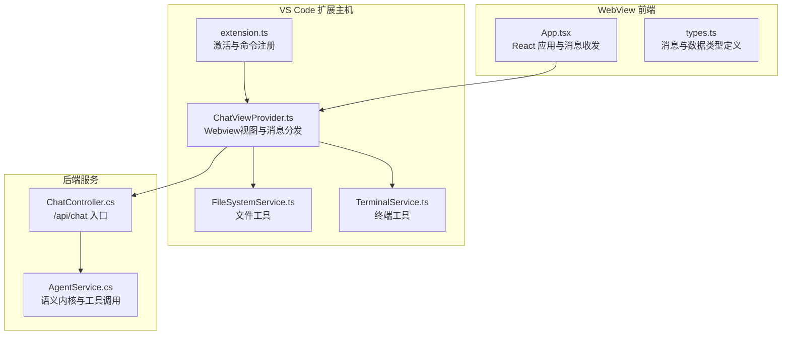
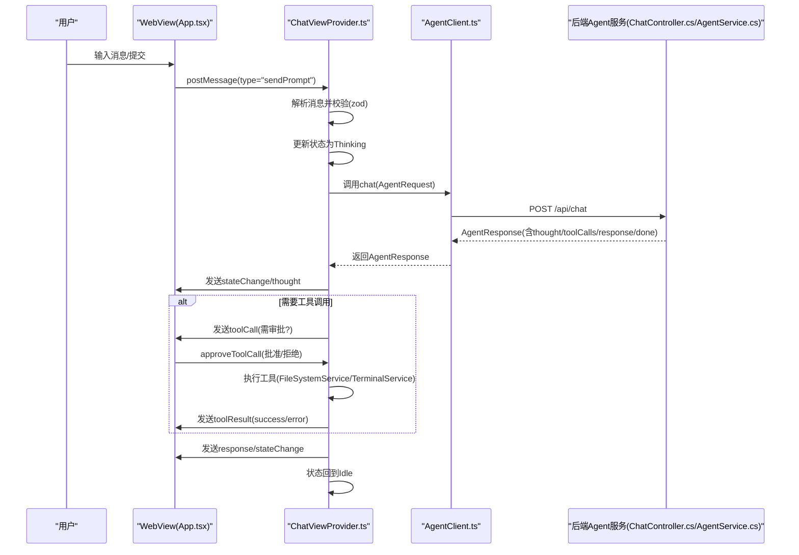
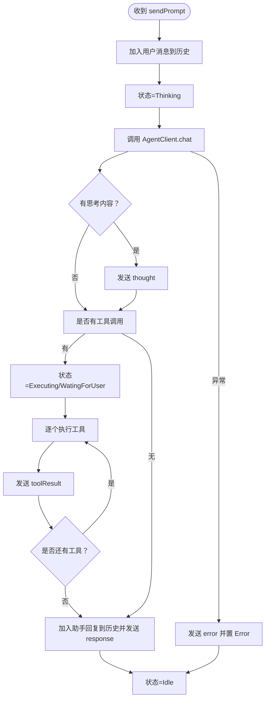
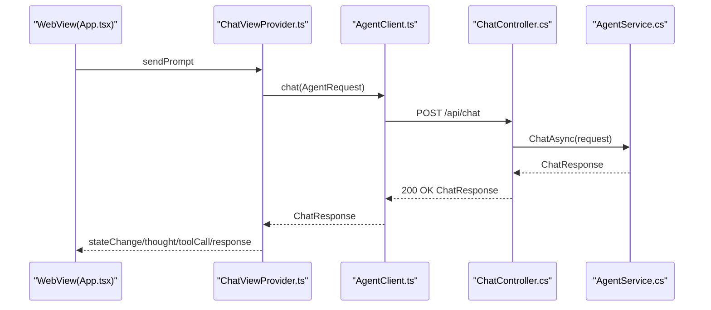
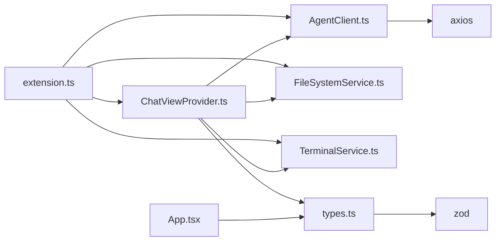

# 消息通信机制

<cite>
**本文引用的文件**
- [extension.ts](file://frontend-extension/src/extension.ts)
- [ChatViewProvider.ts](file://frontend-extension/src/core/ChatViewProvider.ts)
- [App.tsx](file://frontend-extension/src/webview/App.tsx)
- [AgentClient.ts](file://frontend-extension/src/services/AgentClient.ts)
- [types.ts](file://frontend-extension/src/core/types.ts)
- [FileSystemService.ts](file://frontend-extension/src/services/FileSystemService.ts)
- [TerminalService.ts](file://frontend-extension/src/services/TerminalService.ts)
- [package.json](file://frontend-extension/package.json)
- [ChatController.cs](file://backend-agent/Controllers/ChatController.cs)
- [AgentService.cs](file://backend-agent/Services/AgentService.cs)
</cite>

## 目录
1. [引言](#引言)
2. [项目结构](#项目结构)
3. [核心组件](#核心组件)
4. [架构总览](#架构总览)
5. [详细组件分析](#详细组件分析)
6. [依赖关系分析](#依赖关系分析)
7. [性能考量](#性能考量)
8. [故障排查指南](#故障排查指南)
9. [结论](#结论)

## 引言
本文件聚焦于VS Code扩展中前端WebView与扩展主机之间的消息通信机制，系统性梳理从用户输入到后端/api/chat的完整链路，覆盖双向消息协议、类型校验、序列化与反序列化、超时与取消、错误反馈与重试策略等关键环节，并提供调试技巧与最佳实践。

## 项目结构
前端扩展采用“扩展主机 + WebView”双层架构：
- 扩展主机侧负责注册视图、监听命令、维护会话状态、协调工具执行（文件系统、终端）。
- WebView侧负责UI渲染、事件收集、与扩展主机通过postMessage进行消息交换。
- 后端Agent服务通过HTTP接口提供对话能力，前端通过AgentClient封装Axios请求。



图表来源
- [extension.ts](file://frontend-extension/src/extension.ts#L1-L74)
- [ChatViewProvider.ts](file://frontend-extension/src/core/ChatViewProvider.ts#L1-L325)
- [App.tsx](file://frontend-extension/src/webview/App.tsx#L1-L312)
- [types.ts](file://frontend-extension/src/core/types.ts#L1-L151)
- [ChatController.cs](file://backend-agent/Controllers/ChatController.cs#L1-L45)
- [AgentService.cs](file://backend-agent/Services/AgentService.cs#L1-L180)

章节来源
- [extension.ts](file://frontend-extension/src/extension.ts#L1-L74)
- [package.json](file://frontend-extension/package.json#L1-L100)

## 核心组件
- 扩展入口与命令：在激活时初始化AgentClient、文件系统与终端服务，注册Webview视图与命令（打开聊天、清空历史），监听配置变更动态更新后端地址。
- ChatViewProvider：实现WebviewViewProvider，负责HTML注入、消息接收与分发、状态机管理、工具调用执行与结果回传。
- AgentClient：基于Axios封装Agent/RAG API客户端，统一超时、基础URL与健康检查。
- App（WebView）：React应用，负责UI渲染、事件收集、向扩展主机发送消息、接收并展示来自扩展主机的消息。
- 类型系统：使用Zod对消息协议进行编译期与运行时校验，确保消息结构安全。
- 工具服务：FileSystemService与TerminalService在扩展主机侧执行具体操作，并通过消息返回结果或错误。

章节来源
- [extension.ts](file://frontend-extension/src/extension.ts#L1-L74)
- [ChatViewProvider.ts](file://frontend-extension/src/core/ChatViewProvider.ts#L1-L325)
- [AgentClient.ts](file://frontend-extension/src/services/AgentClient.ts#L1-L61)
- [App.tsx](file://frontend-extension/src/webview/App.tsx#L1-L312)
- [types.ts](file://frontend-extension/src/core/types.ts#L1-L151)
- [FileSystemService.ts](file://frontend-extension/src/services/FileSystemService.ts#L1-L133)
- [TerminalService.ts](file://frontend-extension/src/services/TerminalService.ts#L1-L100)

## 架构总览
下图展示了从用户输入到后端API的完整消息链路与状态流转。



图表来源
- [App.tsx](file://frontend-extension/src/webview/App.tsx#L136-L180)
- [ChatViewProvider.ts](file://frontend-extension/src/core/ChatViewProvider.ts#L55-L149)
- [AgentClient.ts](file://frontend-extension/src/services/AgentClient.ts#L31-L40)
- [ChatController.cs](file://backend-agent/Controllers/ChatController.cs#L20-L44)
- [AgentService.cs](file://backend-agent/Services/AgentService.cs#L46-L117)

## 详细组件分析

### VS Code扩展主机与WebView的双向通信
- 协议与类型
  - Webview -> 扩展主机：sendPrompt、cancelRequest、approveToolCall、ready
  - 扩展主机 -> WebView：stateChange、thought、toolCall、toolResult、response、error、historyLoaded
  - 使用Zod Schema对消息进行严格校验，避免类型不匹配导致的运行时错误
- 通信通道
  - WebView通过window.acquireVsCodeApi()提供的postMessage发送消息
  - 扩展主机通过webviewView.webview.postMessage发送消息
  - 双方均以JSON对象作为载体，遵循统一的type+payload结构
- 生命周期
  - WebView首次加载时发送ready，扩展主机收到后回传历史与当前状态
  - 用户提交消息后，扩展主机进入Thinking状态；工具调用期间进入Executing或WaitingForUser

章节来源
- [types.ts](file://frontend-extension/src/core/types.ts#L7-L91)
- [App.tsx](file://frontend-extension/src/webview/App.tsx#L48-L142)
- [ChatViewProvider.ts](file://frontend-extension/src/core/ChatViewProvider.ts#L43-L81)

### extension.ts如何监听用户命令并触发WebView消息传递
- 命令注册
  - 打开聊天：切换到扩展侧边栏对应视图
  - 清空历史：调用ChatViewProvider.clearHistory，同时通知WebView清空历史
- 配置变更
  - 监听alagent.*配置变化，动态更新AgentClient的baseURL，无需重启即可生效
- 视图注册
  - retainContextWhenHidden保持WebView上下文，提升交互体验

章节来源
- [extension.ts](file://frontend-extension/src/extension.ts#L43-L68)
- [ChatViewProvider.ts](file://frontend-extension/src/core/ChatViewProvider.ts#L282-L288)
- [package.json](file://frontend-extension/package.json#L37-L66)

### ChatViewProvider如何协调UI事件与后台服务调用
- 消息分发
  - ready：回传历史与状态
  - sendPrompt：构建AgentRequest并调用AgentClient.chat，同时设置AbortController用于取消
  - cancelRequest：abort并回到Idle
  - approveToolCall：根据批准与否执行工具或返回拒绝结果
- 状态机
  - Idle、Thinking、Executing、WaitingForUser、Error五态流转，每态变化通过stateChange消息通知UI
- 工具执行
  - 对于需要审批的工具，先发送toolCall给WebView，等待approveToolCall后再执行
  - 不需要审批的工具直接执行，结果通过toolResult回传
- 错误处理
  - 统一捕获异常，发送error消息并置为Error态



图表来源
- [ChatViewProvider.ts](file://frontend-extension/src/core/ChatViewProvider.ts#L83-L149)
- [ChatViewProvider.ts](file://frontend-extension/src/core/ChatViewProvider.ts#L151-L243)
- [ChatViewProvider.ts](file://frontend-extension/src/core/ChatViewProvider.ts#L245-L268)

章节来源
- [ChatViewProvider.ts](file://frontend-extension/src/core/ChatViewProvider.ts#L55-L149)
- [ChatViewProvider.ts](file://frontend-extension/src/core/ChatViewProvider.ts#L151-L268)

### AgentClient封装的HTTP请求逻辑
- 客户端创建
  - 分别为Agent与RAG创建Axios实例，设置baseURL、timeout、Content-Type
  - Agent超时较长（约2分钟），RAG较短（约30秒）
- 请求方法
  - chat：POST /api/chat，参数为AgentRequest，返回AgentResponse
  - queryContext：POST /api/query，参数为RagQueryRequest，返回RagQueryResponse
  - healthCheck：分别GET /health检测可用性
- 配置更新
  - updateConfig动态修改baseURL，支持热切换后端地址
- 认证与拦截
  - 当前实现未显式添加认证头或请求拦截器；如需认证，可在Axios实例上增加拦截器
- 错误重试
  - 当前未实现自动重试；如需增强可靠性，可在调用处或Axios拦截器中增加指数退避重试

```mermaid
classDiagram
class AgentClient {
-_agentApi : AxiosInstance
-_ragApi : AxiosInstance
+constructor(agentApiUrl, ragApiUrl)
+updateConfig(agentApiUrl, ragApiUrl)
+chat(request) : Promise~AgentResponse~
+queryContext(request) : Promise~RagQueryResponse~
+healthCheck() : Promise~{agent : boolean, rag : boolean}~
}
```

图表来源
- [AgentClient.ts](file://frontend-extension/src/services/AgentClient.ts#L1-L61)

章节来源
- [AgentClient.ts](file://frontend-extension/src/services/AgentClient.ts#L1-L61)

### 从用户输入到调用后端/api/chat的完整链路
- WebView侧
  - 用户输入提交后，App.tsx通过postMessage发送sendPrompt
  - WebView在ready时向扩展主机同步历史与状态
- 扩展主机侧
  - ChatViewProvider解析消息并校验，进入Thinking态
  - 构造AgentRequest（prompt/context/workspacePath/conversationHistory），调用AgentClient.chat
  - 将后端返回的thought、toolCalls、response按顺序通过消息回传
- 后端服务
  - ChatController接收请求，委托AgentService处理
  - AgentService整合RAG上下文、历史消息，调用语义内核生成响应，自动处理工具调用
  - 返回AgentResponse给前端



图表来源
- [App.tsx](file://frontend-extension/src/webview/App.tsx#L144-L163)
- [ChatViewProvider.ts](file://frontend-extension/src/core/ChatViewProvider.ts#L83-L139)
- [AgentClient.ts](file://frontend-extension/src/services/AgentClient.ts#L31-L34)
- [ChatController.cs](file://backend-agent/Controllers/ChatController.cs#L20-L44)
- [AgentService.cs](file://backend-agent/Services/AgentService.cs#L46-L117)

章节来源
- [App.tsx](file://frontend-extension/src/webview/App.tsx#L136-L180)
- [ChatViewProvider.ts](file://frontend-extension/src/core/ChatViewProvider.ts#L83-L139)
- [AgentClient.ts](file://frontend-extension/src/services/AgentClient.ts#L31-L34)
- [ChatController.cs](file://backend-agent/Controllers/ChatController.cs#L20-L44)
- [AgentService.cs](file://backend-agent/Services/AgentService.cs#L46-L117)

### 通信过程中的序列化、超时处理与异常反馈
- 序列化与反序列化
  - 双向均为JSON对象，WebView通过window.postMessage发送，扩展主机通过webviewView.webview.postMessage发送
  - 使用Zod Schema在接收端进行结构校验，避免类型不一致引发的异常
- 超时处理
  - AgentClient对Agent API设置较长超时，适合长对话与工具调用
  - TerminalService对子进程命令执行设置30秒超时，防止阻塞
  - ChatViewProvider使用AbortController支持用户取消请求
- 异常反馈
  - 扩展主机捕获异常后发送error消息并置为Error态
  - 后端控制器捕获异常并返回500或499（取消）

章节来源
- [types.ts](file://frontend-extension/src/core/types.ts#L7-L91)
- [App.tsx](file://frontend-extension/src/webview/App.tsx#L111-L121)
- [ChatViewProvider.ts](file://frontend-extension/src/core/ChatViewProvider.ts#L140-L149)
- [TerminalService.ts](file://frontend-extension/src/services/TerminalService.ts#L54-L59)
- [ChatController.cs](file://backend-agent/Controllers/ChatController.cs#L33-L44)

## 依赖关系分析
- 组件耦合
  - extension.ts依赖ChatViewProvider、AgentClient、FileSystemService、TerminalService
  - ChatViewProvider依赖AgentClient、FileSystemService、TerminalService与types
  - App.tsx依赖types与acquireVsCodeApi桥接
  - AgentClient依赖Axios与types
- 外部依赖
  - axios用于HTTP请求
  - zod用于消息协议校验
  - VS Code Webview API用于postMessage与CSP
- 潜在循环依赖
  - 当前结构清晰，无明显循环依赖



图表来源
- [extension.ts](file://frontend-extension/src/extension.ts#L1-L74)
- [ChatViewProvider.ts](file://frontend-extension/src/core/ChatViewProvider.ts#L1-L30)
- [AgentClient.ts](file://frontend-extension/src/services/AgentClient.ts#L1-L24)
- [types.ts](file://frontend-extension/src/core/types.ts#L1-L10)
- [App.tsx](file://frontend-extension/src/webview/App.tsx#L1-L12)

章节来源
- [extension.ts](file://frontend-extension/src/extension.ts#L1-L74)
- [ChatViewProvider.ts](file://frontend-extension/src/core/ChatViewProvider.ts#L1-L30)
- [AgentClient.ts](file://frontend-extension/src/services/AgentClient.ts#L1-L24)
- [types.ts](file://frontend-extension/src/core/types.ts#L1-L10)
- [App.tsx](file://frontend-extension/src/webview/App.tsx#L1-L12)

## 性能考量
- 请求超时与并发
  - Agent API较长超时适合复杂推理；如需并发多轮对话，建议在调用侧增加队列或节流
- 工具调用成本
  - 文件读写与命令执行可能耗时，建议在UI层显示进度与取消按钮
- WebSocket替代
  - 若后端支持，可考虑WebSocket以降低HTTP开销与延迟
- 缓存与增量
  - 对重复查询可引入本地缓存，减少往返

## 故障排查指南
- 无法连接后端
  - 使用AgentClient.healthCheck确认Agent/RAG服务可用
  - 检查alagent.agentApiUrl/alagent.ragApiUrl配置是否正确
- 消息格式错误
  - 确认WebView与扩展主机的消息类型与payload结构一致
  - 在接收端打印原始消息并检查Schema校验错误
- 请求被取消
  - 确认AbortController是否被正确abort
  - 检查后端是否返回499（取消）
- 工具调用失败
  - 查看toolResult.error，定位具体错误原因（权限、路径、命令）
- 调试技巧
  - 在WebView侧监听window.message并记录所有消息
  - 在扩展主机侧打印收到的消息与状态变化
  - 使用VS Code开发者工具查看WebView控制台
  - 临时提高日志级别，便于定位异常

章节来源
- [extension.ts](file://frontend-extension/src/extension.ts#L57-L68)
- [ChatViewProvider.ts](file://frontend-extension/src/core/ChatViewProvider.ts#L43-L53)
- [App.tsx](file://frontend-extension/src/webview/App.tsx#L136-L142)
- [ChatController.cs](file://backend-agent/Controllers/ChatController.cs#L33-L44)

## 结论
该消息通信体系通过严格的类型校验与清晰的状态机设计，实现了从用户输入到后端API的可靠链路。扩展主机与WebView之间通过postMessage进行解耦通信，AgentClient封装了HTTP细节，ChatViewProvider协调UI与后台服务。为进一步增强鲁棒性，可在AgentClient中增加认证与重试策略，并在工具执行层面细化错误分类与提示。