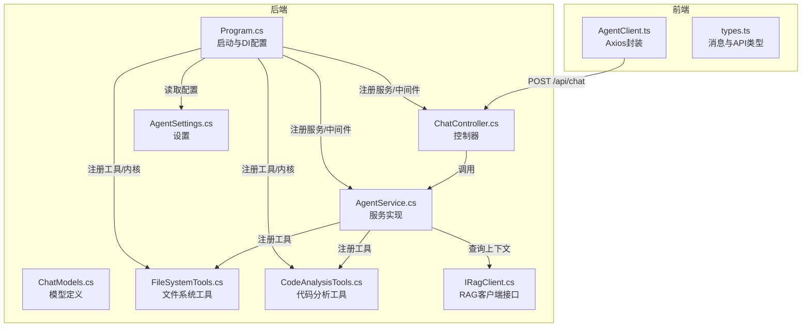
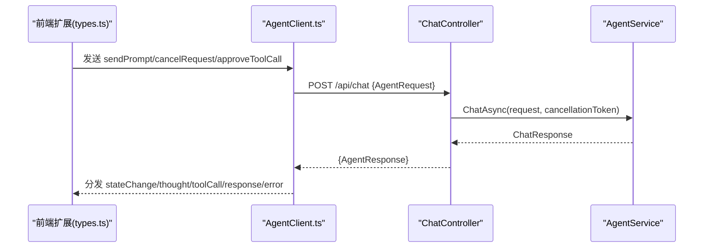
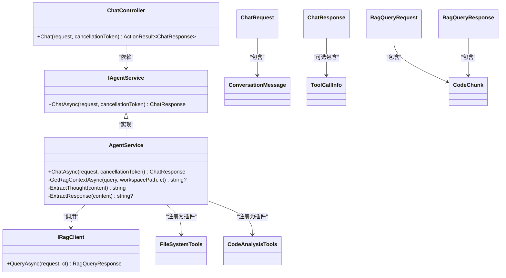
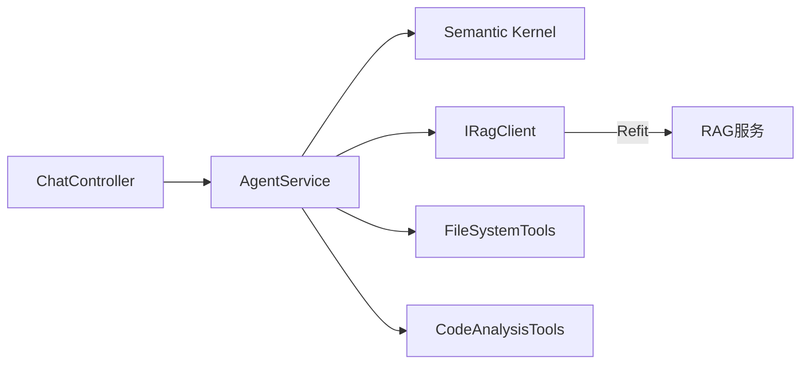

# API端点参考

<cite>
**本文引用的文件**
- [ChatController.cs](file://backend-agent/Controllers/ChatController.cs)
- [ChatModels.cs](file://backend-agent/Models/ChatModels.cs)
- [IAgentService.cs](file://backend-agent/Services/IAgentService.cs)
- [AgentService.cs](file://backend-agent/Services/AgentService.cs)
- [IRagClient.cs](file://backend-agent/Services/IRagClient.cs)
- [AgentSettings.cs](file://backend-agent/Services/AgentSettings.cs)
- [Program.cs](file://backend-agent/Program.cs)
- [FileSystemTools.cs](file://backend-agent/Tools/FileSystemTools.cs)
- [CodeAnalysisTools.cs](file://backend-agent/Tools/CodeAnalysisTools.cs)
- [AgentClient.ts](file://frontend-extension/src/services/AgentClient.ts)
- [types.ts](file://frontend-extension/src/core/types.ts)
- [appsettings.json](file://backend-agent/appsettings.json)
- [appsettings.Development.json](file://backend-agent/appsettings.Development.json)
</cite>

## 目录
1. [简介](#简介)
2. [项目结构](#项目结构)
3. [核心组件](#核心组件)
4. [架构总览](#架构总览)
5. [详细组件分析](#详细组件分析)
6. [依赖关系分析](#依赖关系分析)
7. [性能与超时](#性能与超时)
8. [故障排查指南](#故障排查指南)
9. [结论](#结论)
10. [附录](#附录)

## 简介
本文件为后端推理引擎的API文档，聚焦于/api/chat端点。内容涵盖：
- HTTP方法与路由：POST /api/chat
- 请求头要求与请求体结构（基于ChatRequest模型）
- 响应格式（基于ChatResponse模型）
- 字段数据类型、约束条件与语义说明（Prompt、ConversationHistory、Thought、ToolCalls等）
- 错误处理机制（500服务器错误与499客户端取消）
- curl示例与请求/响应载荷示例
- 与前端扩展通信流程的集成方式
- 超时处理与取消令牌的使用

## 项目结构
后端推理引擎由ASP.NET Core控制器、服务层、工具插件与配置组成；前端通过Axios封装AgentClient调用后端API。



图表来源
- [ChatController.cs](file://backend-agent/Controllers/ChatController.cs#L1-L45)
- [AgentService.cs](file://backend-agent/Services/AgentService.cs#L1-L180)
- [ChatModels.cs](file://backend-agent/Models/ChatModels.cs#L1-L50)
- [FileSystemTools.cs](file://backend-agent/Tools/FileSystemTools.cs#L1-L151)
- [CodeAnalysisTools.cs](file://backend-agent/Tools/CodeAnalysisTools.cs#L1-L252)
- [Program.cs](file://backend-agent/Program.cs#L1-L67)
- [AgentSettings.cs](file://backend-agent/Services/AgentSettings.cs#L1-L10)
- [IRagClient.cs](file://backend-agent/Services/IRagClient.cs#L1-L14)
- [AgentClient.ts](file://frontend-extension/src/services/AgentClient.ts#L1-L44)
- [types.ts](file://frontend-extension/src/core/types.ts#L1-L151)

章节来源
- [Program.cs](file://backend-agent/Program.cs#L1-L67)
- [ChatController.cs](file://backend-agent/Controllers/ChatController.cs#L1-L45)
- [AgentService.cs](file://backend-agent/Services/AgentService.cs#L1-L180)
- [ChatModels.cs](file://backend-agent/Models/ChatModels.cs#L1-L50)
- [AgentSettings.cs](file://backend-agent/Services/AgentSettings.cs#L1-L10)
- [IRagClient.cs](file://backend-agent/Services/IRagClient.cs#L1-L14)
- [AgentClient.ts](file://frontend-extension/src/services/AgentClient.ts#L1-L44)
- [types.ts](file://frontend-extension/src/core/types.ts#L1-L151)

## 核心组件
- 控制器：接收HTTP请求，调用服务层，返回标准响应或错误码
- 服务层：构建对话历史、调用大模型、解析思考与工具调用、整合RAG上下文
- 模型：定义请求/响应与消息、工具调用、RAG查询的结构
- 工具插件：文件系统与代码分析能力，作为函数调用插件注册到内核
- 配置：从应用设置读取模型参数、RAG地址与超时

章节来源
- [ChatController.cs](file://backend-agent/Controllers/ChatController.cs#L1-L45)
- [AgentService.cs](file://backend-agent/Services/AgentService.cs#L1-L180)
- [ChatModels.cs](file://backend-agent/Models/ChatModels.cs#L1-L50)
- [FileSystemTools.cs](file://backend-agent/Tools/FileSystemTools.cs#L1-L151)
- [CodeAnalysisTools.cs](file://backend-agent/Tools/CodeAnalysisTools.cs#L1-L252)
- [Program.cs](file://backend-agent/Program.cs#L1-L67)
- [AgentSettings.cs](file://backend-agent/Services/AgentSettings.cs#L1-L10)

## 架构总览
/api/chat端点的调用链路如下：

```mermaid
sequenceDiagram
participant FE as "前端扩展(AgentClient)"
participant CTRL as "ChatController"
participant SVC as "AgentService"
participant SK as "Semantic Kernel"
participant RAG as "IRagClient"
participant FS as "FileSystemTools"
participant CA as "CodeAnalysisTools"
FE->>CTRL : POST /api/chat {ChatRequest}
CTRL->>SVC : ChatAsync(request, cancellationToken)
SVC->>RAG : QueryAsync(RagQueryRequest)
RAG-->>SVC : RagQueryResponse
SVC->>SK : 获取聊天补全(自动函数调用)
SK-->>SVC : ChatMessageContent(含思考/工具调用)
SVC->>FS : 执行文件系统工具(如需)
SVC->>CA : 执行代码分析工具(如需)
SVC-->>CTRL : ChatResponse
CTRL-->>FE : 200 OK {ChatResponse}
note over CTRL,SVC : 取消 : 返回499; 异常 : 返回500
```

图表来源
- [AgentClient.ts](file://frontend-extension/src/services/AgentClient.ts#L1-L44)
- [ChatController.cs](file://backend-agent/Controllers/ChatController.cs#L1-L45)
- [AgentService.cs](file://backend-agent/Services/AgentService.cs#L1-L180)
- [IRagClient.cs](file://backend-agent/Services/IRagClient.cs#L1-L14)
- [FileSystemTools.cs](file://backend-agent/Tools/FileSystemTools.cs#L1-L151)
- [CodeAnalysisTools.cs](file://backend-agent/Tools/CodeAnalysisTools.cs#L1-L252)

## 详细组件分析

### /api/chat 端点规范
- 方法与路径
  - HTTP方法：POST
  - 路径：/api/chat
- 请求头
  - Content-Type: application/json
  - 允许任意头部与方法（CORS已配置）
- 请求体结构（ChatRequest）
  - Prompt: string，必填，用户当前问题
  - Context: string，可选，上下文补充
  - WorkspacePath: string，必填，工作区根路径
  - ConversationHistory: 数组，元素为ConversationMessage
- 响应体结构（ChatResponse）
  - Thought: string，模型的推理/思考摘要
  - ToolCalls: ToolCallInfo[]，可选，待执行的工具调用列表
  - Response: string，可选，最终回复文本
  - Done: bool，是否无需进一步工具调用

字段约束与语义
- Prompt/Context/WorkspacePath均为字符串，无长度上限但建议合理控制以避免超时
- ConversationHistory每条消息包含：
  - Role: "user" | "assistant" | "system" | "tool"
  - Content: 文本内容
  - Timestamp: 时间戳
  - ToolCallId/ToolName: 当Role为"tool"时用于关联工具调用结果
- ToolCalls中的每个工具调用包含：
  - Id: 调用标识
  - Name: 工具名称
  - Arguments: 参数字典
  - RequiresApproval: 是否需要用户批准

章节来源
- [ChatController.cs](file://backend-agent/Controllers/ChatController.cs#L1-L45)
- [ChatModels.cs](file://backend-agent/Models/ChatModels.cs#L1-L50)
- [Program.cs](file://backend-agent/Program.cs#L1-L67)

### 错误处理机制
- 499 客户端取消
  - 触发条件：请求处理过程中发生取消异常
  - 行为：记录日志并返回499，包含错误对象
- 500 服务器内部错误
  - 触发条件：未捕获异常
  - 行为：记录异常日志并返回500，包含错误信息
- 前端取消
  - 前端支持发送取消消息，后端通过CancellationToken传播取消信号

章节来源
- [ChatController.cs](file://backend-agent/Controllers/ChatController.cs#L1-L45)
- [AgentClient.ts](file://frontend-extension/src/services/AgentClient.ts#L1-L44)

### 前端集成与通信流程
- 前端通过AgentClient封装Axios实例调用/api/chat
- 前端类型与后端模型保持一致（AgentRequest/AgentResponse）
- 前端支持取消请求（cancelRequest消息），后端使用CancellationToken处理
- 前端支持批准工具调用（approveToolCall消息），后端在自动函数调用模式下自动执行



图表来源
- [types.ts](file://frontend-extension/src/core/types.ts#L1-L151)
- [AgentClient.ts](file://frontend-extension/src/services/AgentClient.ts#L1-L44)
- [ChatController.cs](file://backend-agent/Controllers/ChatController.cs#L1-L45)
- [AgentService.cs](file://backend-agent/Services/AgentService.cs#L1-L180)

### 数据模型与复杂度分析
- ChatRequest/ChatResponse/ConversationMessage/ToolCallInfo/RagQueryRequest/RagQueryResponse/CodeChunk
- 复杂度
  - 对话历史拼接：O(n)，n为历史消息数
  - RAG上下文拼接：O(m)，m为返回的代码块数
  - 工具调用：由内核自动处理，复杂度取决于具体工具实现
- 依赖关系
  - ChatController依赖IAgentService
  - AgentService依赖Kernel、IRagClient、AgentSettings
  - 工具类通过内核插件注册



图表来源
- [ChatController.cs](file://backend-agent/Controllers/ChatController.cs#L1-L45)
- [IAgentService.cs](file://backend-agent/Services/IAgentService.cs#L1-L9)
- [AgentService.cs](file://backend-agent/Services/AgentService.cs#L1-L180)
- [IRagClient.cs](file://backend-agent/Services/IRagClient.cs#L1-L14)
- [ChatModels.cs](file://backend-agent/Models/ChatModels.cs#L1-L50)
- [FileSystemTools.cs](file://backend-agent/Tools/FileSystemTools.cs#L1-L151)
- [CodeAnalysisTools.cs](file://backend-agent/Tools/CodeAnalysisTools.cs#L1-L252)

## 依赖关系分析
- 组件耦合
  - ChatController与IAgentService解耦，便于测试与替换
  - AgentService与Kernel、IRagClient、工具类松耦合，通过插件注册
- 外部依赖
  - OpenAI聊天补全服务（通过Semantic Kernel）
  - RAG服务（Refit客户端）
  - 文件系统与代码分析工具（内核插件）



图表来源
- [ChatController.cs](file://backend-agent/Controllers/ChatController.cs#L1-L45)
- [AgentService.cs](file://backend-agent/Services/AgentService.cs#L1-L180)
- [IRagClient.cs](file://backend-agent/Services/IRagClient.cs#L1-L14)
- [Program.cs](file://backend-agent/Program.cs#L1-L67)

章节来源
- [Program.cs](file://backend-agent/Program.cs#L1-L67)
- [AgentService.cs](file://backend-agent/Services/AgentService.cs#L1-L180)
- [IRagClient.cs](file://backend-agent/Services/IRagClient.cs#L1-L14)

## 性能与超时
- 后端RAG客户端超时：30秒
- 前端LLM请求超时：2分钟
- RAG查询TopK默认值：5
- 温度与最大Token：来自AgentSettings
- 建议
  - 合理设置Prompt与上下文长度，避免超时
  - 使用分页或减少TopK提升响应速度
  - 在前端监听取消事件，及时释放资源

章节来源
- [Program.cs](file://backend-agent/Program.cs#L1-L67)
- [AgentSettings.cs](file://backend-agent/Services/AgentSettings.cs#L1-L10)
- [appsettings.json](file://backend-agent/appsettings.json#L1-L16)
- [appsettings.Development.json](file://backend-agent/appsettings.Development.json#L1-L15)
- [AgentClient.ts](file://frontend-extension/src/services/AgentClient.ts#L1-L44)

## 故障排查指南
- 499 客户端取消
  - 现象：前端主动取消请求
  - 排查：确认前端取消消息是否正确发送，后端是否收到CancellationToken
- 500 服务器错误
  - 现象：后端异常
  - 排查：查看日志，检查模型密钥、RAG服务连通性、工具调用参数
- RAG查询失败
  - 现象：返回空上下文
  - 排查：确认RAG服务健康、查询参数合法、索引是否存在
- 工具调用失败
  - 现象：工具返回错误信息
  - 排查：检查文件路径、权限、命令可用性

章节来源
- [ChatController.cs](file://backend-agent/Controllers/ChatController.cs#L1-L45)
- [AgentService.cs](file://backend-agent/Services/AgentService.cs#L1-L180)
- [IRagClient.cs](file://backend-agent/Services/IRagClient.cs#L1-L14)
- [FileSystemTools.cs](file://backend-agent/Tools/FileSystemTools.cs#L1-L151)
- [CodeAnalysisTools.cs](file://backend-agent/Tools/CodeAnalysisTools.cs#L1-L252)

## 结论
/api/chat端点通过清晰的请求/响应模型与完善的错误处理机制，实现了与前端扩展的高效协作。结合RAG上下文与工具插件，能够完成从代码检索到文件操作的完整推理流程。建议在生产环境中关注超时与取消策略，确保用户体验与系统稳定性。

## 附录

### curl 示例
- 发送请求
  - curl -X POST http://localhost:5000/api/chat -H "Content-Type: application/json" -d @payload.json
- 取消请求（模拟）
  - 前端发送取消消息，后端通过CancellationToken触发499

章节来源
- [ChatController.cs](file://backend-agent/Controllers/ChatController.cs#L1-L45)
- [AgentClient.ts](file://frontend-extension/src/services/AgentClient.ts#L1-L44)

### 请求/响应载荷示例（路径引用）
- 请求示例（ChatRequest）
  - Prompt: "如何修改这个函数？"
  - Context: "相关背景说明"
  - WorkspacePath: "/workspace/project"
  - ConversationHistory: [{"role":"user","content":"你好","timestamp":1710000000}]
- 响应示例（ChatResponse）
  - Thought: "我需要先查看相关文件"
  - ToolCalls: [{"id":"call_1","name":"read_file","arguments":{"path":"/workspace/project/main.py"},"requiresApproval":false}]
  - Response: "请稍等，正在读取文件..."
  - Done: false

章节来源
- [ChatModels.cs](file://backend-agent/Models/ChatModels.cs#L1-L50)
- [types.ts](file://frontend-extension/src/core/types.ts#L1-L151)