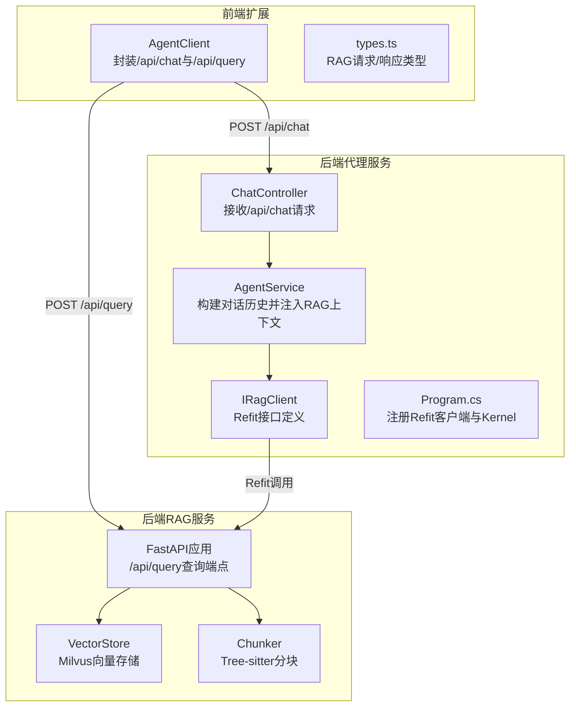
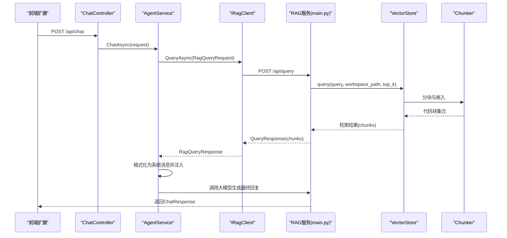
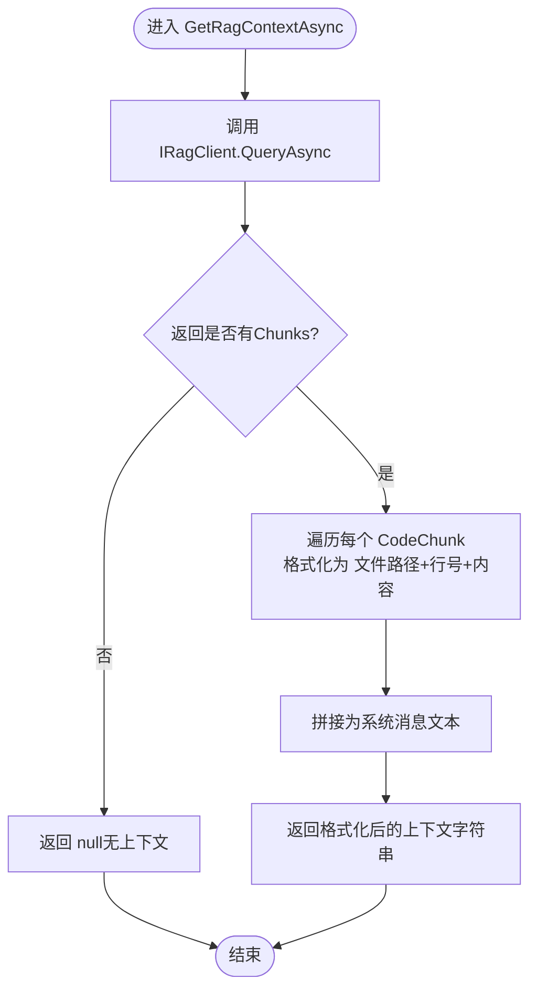
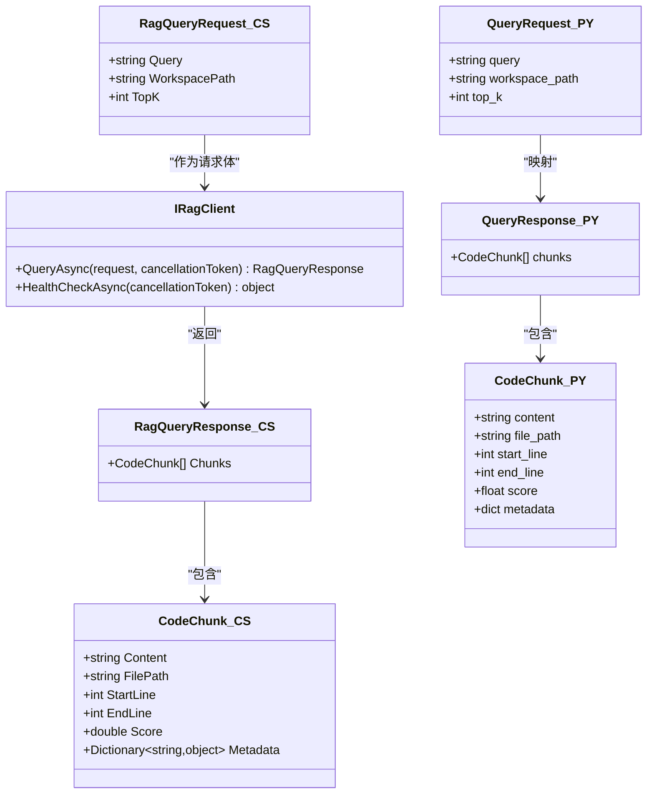
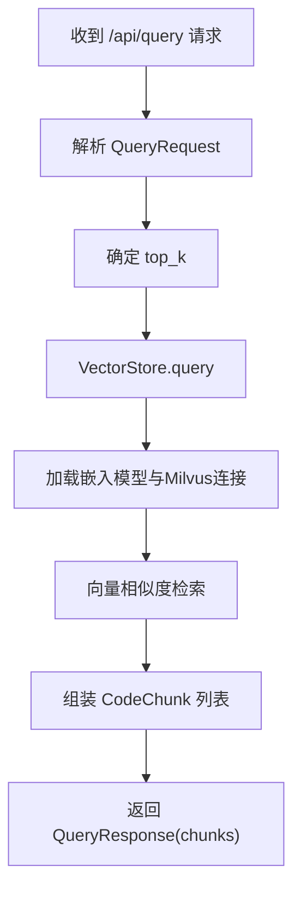
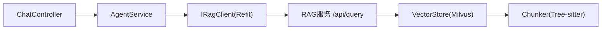

# 上下文管理

<cite>
**本文引用的文件列表**
- [IRagClient.cs](file://backend-agent/Services/IRagClient.cs)
- [AgentService.cs](file://backend-agent/Services/AgentService.cs)
- [ChatController.cs](file://backend-agent/Controllers/ChatController.cs)
- [Program.cs](file://backend-agent/Program.cs)
- [AgentSettings.cs](file://backend-agent/Services/AgentSettings.cs)
- [ChatModels.cs](file://backend-agent/Models/ChatModels.cs)
- [main.py](file://backend-rag/app/main.py)
- [models.py](file://backend-rag/app/models.py)
- [vector_store.py](file://backend-rag/app/vector_store.py)
- [chunker.py](file://backend-rag/app/chunker.py)
- [AgentClient.ts](file://frontend-extension/src/services/AgentClient.ts)
- [types.ts](file://frontend-extension/src/core/types.ts)
- [appsettings.json](file://backend-agent/appsettings.json)
</cite>

## 目录
1. [简介](#简介)
2. [项目结构](#项目结构)
3. [核心组件](#核心组件)
4. [架构总览](#架构总览)
5. [详细组件分析](#详细组件分析)
6. [依赖关系分析](#依赖关系分析)
7. [性能考量](#性能考量)
8. [故障排查指南](#故障排查指南)
9. [结论](#结论)
10. [附录](#附录)

## 简介
本文件聚焦于“RAG上下文注入机制”的实现与使用，围绕以下目标展开：
- 解释 GetRagContextAsync 方法如何通过 IRagClient 接口调用 Python RAG 服务的 /api/query 端点，检索与用户问题相关的代码片段。
- 阐述 RagQueryRequest 请求参数（查询语句、工作区路径、TopK）的作用，并说明如何将 RAG 返回的多个 CodeChunk 对象格式化为包含文件路径和行号的系统消息。
- 讨论上下文注入对提升 AI 回答准确性的重要意义，以及在 RAG 服务不可用时的降级策略（返回 null 并继续推理）。
- 提供实际的 HTTP 请求/响应示例，帮助读者理解数据流与交互过程。

## 项目结构
该仓库采用前后端分离的多模块组织方式：
- 后端代理服务（backend-agent）：负责接收聊天请求、调用 RAG 客户端获取上下文、与大模型交互生成最终回复。
- 后端 RAG 服务（backend-rag）：提供 /api/query 查询接口，基于 Milvus 向量库进行语义检索，返回代码片段。
- 前端扩展（frontend-extension）：VS Code 扩展前端，封装 Agent 与 RAG 的 HTTP 调用，支持健康检查与上下文查询。

图表来源
- [ChatController.cs](file://backend-agent/Controllers/ChatController.cs#L1-L45)
- [AgentService.cs](file://backend-agent/Services/AgentService.cs#L46-L117)
- [IRagClient.cs](file://backend-agent/Services/IRagClient.cs#L1-L14)
- [Program.cs](file://backend-agent/Program.cs#L22-L31)
- [main.py](file://backend-rag/app/main.py#L65-L86)
- [vector_store.py](file://backend-rag/app/vector_store.py#L121-L200)
- [chunker.py](file://backend-rag/app/chunker.py#L104-L163)
- [AgentClient.ts](file://frontend-extension/src/services/AgentClient.ts#L31-L39)
- [types.ts](file://frontend-extension/src/core/types.ts#L133-L150)

章节来源
- [ChatController.cs](file://backend-agent/Controllers/ChatController.cs#L1-L45)
- [AgentService.cs](file://backend-agent/Services/AgentService.cs#L46-L117)
- [IRagClient.cs](file://backend-agent/Services/IRagClient.cs#L1-L14)
- [Program.cs](file://backend-agent/Program.cs#L22-L31)
- [main.py](file://backend-rag/app/main.py#L65-L86)
- [vector_store.py](file://backend-rag/app/vector_store.py#L121-L200)
- [chunker.py](file://backend-rag/app/chunker.py#L104-L163)
- [AgentClient.ts](file://frontend-extension/src/services/AgentClient.ts#L31-L39)
- [types.ts](file://frontend-extension/src/core/types.ts#L133-L150)

## 核心组件
- IRagClient：定义了 RAG 客户端接口，包含 /api/query 查询与 /health 健康检查两个端点。
- AgentService：在聊天流程中调用 IRagClient 获取上下文，将检索到的代码片段格式化为系统消息注入到对话历史中。
- ChatController：对外暴露 /api/chat 接口，委托 AgentService 处理请求。
- Program.cs：通过 AddRefitClient 注册 IRagClient，设置 RAG 服务地址与超时；同时注册 Semantic Kernel 与工具插件。
- ChatModels：定义 ChatRequest/ChatResponse 以及 RagQueryRequest/RagQueryResponse 等数据模型。
- backend-rag 主程序：FastAPI 应用提供 /api/query 查询端点，内部调用 VectorStore 进行检索。
- VectorStore：基于 Milvus 的向量存储，负责索引与查询。
- Chunker：Tree-sitter AST 分块器，按逻辑单元切分代码，保证语义完整性。
- 前端 AgentClient：封装 /api/chat 与 /api/query 的调用，支持健康检查。

章节来源
- [IRagClient.cs](file://backend-agent/Services/IRagClient.cs#L1-L14)
- [AgentService.cs](file://backend-agent/Services/AgentService.cs#L46-L117)
- [ChatController.cs](file://backend-agent/Controllers/ChatController.cs#L1-L45)
- [Program.cs](file://backend-agent/Program.cs#L22-L31)
- [ChatModels.cs](file://backend-agent/Models/ChatModels.cs#L32-L49)
- [main.py](file://backend-rag/app/main.py#L65-L86)
- [vector_store.py](file://backend-rag/app/vector_store.py#L121-L200)
- [chunker.py](file://backend-rag/app/chunker.py#L104-L163)
- [AgentClient.ts](file://frontend-extension/src/services/AgentClient.ts#L31-L39)
- [types.ts](file://frontend-extension/src/core/types.ts#L133-L150)

## 架构总览
RAG 上下文注入的关键流程如下：
- 前端通过 AgentClient 调用 /api/chat 发送聊天请求。
- 后端 ChatController 将请求转交给 AgentService。
- AgentService 调用 IRagClient.QueryAsync，构造 RagQueryRequest（包含 query、workspacePath、TopK），向 backend-rag 的 /api/query 发起查询。
- backend-rag 的 main.py 中的 query_context 端点接收请求，调用 VectorStore.query 完成语义检索，返回 RagQueryResponse（包含多个 CodeChunk）。
- AgentService 将返回的 CodeChunk 列表格式化为系统消息，注入到对话历史，随后与大模型交互生成最终回复。

图表来源
- [ChatController.cs](file://backend-agent/Controllers/ChatController.cs#L20-L42)
- [AgentService.cs](file://backend-agent/Services/AgentService.cs#L46-L117)
- [IRagClient.cs](file://backend-agent/Services/IRagClient.cs#L1-L14)
- [main.py](file://backend-rag/app/main.py#L65-L86)
- [vector_store.py](file://backend-rag/app/vector_store.py#L121-L200)
- [chunker.py](file://backend-rag/app/chunker.py#L104-L163)

## 详细组件分析

### GetRagContextAsync 方法与上下文注入
- 方法位置：AgentService.GetRagContextAsync
- 功能概述：
  - 调用 IRagClient.QueryAsync，传入 RagQueryRequest（query、workspacePath、TopK=5）。
  - 若返回的 Chunks 为空或数量为 0，则返回 null，表示无可用上下文。
  - 将每个 CodeChunk 的内容格式化为“文件路径+行号”前缀，拼接为系统消息字符串，用于后续注入到对话历史。
  - 异常捕获：当 RAG 服务不可用或网络异常时，记录警告日志并返回 null，确保主流程继续执行。
- 关键行为：
  - 上下文注入：在 ChatHistory 中添加一条系统消息，内容为“Relevant code context:”后跟格式化后的代码片段。
  - 降级策略：返回 null 时不注入上下文，由大模型基于已有对话历史与工具能力进行推理。

图表来源
- [AgentService.cs](file://backend-agent/Services/AgentService.cs#L119-L145)

章节来源
- [AgentService.cs](file://backend-agent/Services/AgentService.cs#L119-L145)

### IRagClient 接口与 /api/query 端点
- 接口定义：IRagClient.cs
  - Post("/api/query")：QueryAsync(RagQueryRequest, CancellationToken)
  - Get("/health")：HealthCheckAsync(CancellationToken)
- RAG 服务端实现：backend-rag/app/main.py
  - post("/api/query")：query_context(request: QueryRequest)
  - 内部调用 VectorStore.query，返回 QueryResponse(chunks)
- 数据模型映射：
  - backend-agent/Models/ChatModels.cs：RagQueryRequest(Query, WorkspacePath, TopK)、RagQueryResponse(Chunks)、CodeChunk(Content, FilePath, StartLine, EndLine, Score, Metadata)
  - backend-rag/app/models.py：QueryRequest(query, workspace_path, top_k)、QueryResponse(chunks)、CodeChunk(content, file_path, start_line, end_line, score, metadata)

图表来源
- [IRagClient.cs](file://backend-agent/Services/IRagClient.cs#L1-L14)
- [ChatModels.cs](file://backend-agent/Models/ChatModels.cs#L32-L49)
- [models.py](file://backend-rag/app/models.py#L1-L25)

章节来源
- [IRagClient.cs](file://backend-agent/Services/IRagClient.cs#L1-L14)
- [ChatModels.cs](file://backend-agent/Models/ChatModels.cs#L32-L49)
- [models.py](file://backend-rag/app/models.py#L1-L25)

### RAG 查询端点与检索流程
- 端点：backend-rag/app/main.py -> @app.post("/api/query")
- 参数：QueryRequest(query, workspace_path, top_k)
- 流程：
  - 读取 settings.default_top_k 或请求中的 top_k
  - 调用 VectorStore.query 执行语义检索
  - 返回 QueryResponse(chunks)
- 向量存储与分块：
  - VectorStore.index_workspace：遍历工作区文件，使用 Chunker 进行 AST 分块，生成嵌入并写入 Milvus
  - Chunker.TreeSitterChunker：按语言与 AST 节点类型进行逻辑分块，保证语义边界

图表来源
- [main.py](file://backend-rag/app/main.py#L65-L86)
- [vector_store.py](file://backend-rag/app/vector_store.py#L121-L200)
- [chunker.py](file://backend-rag/app/chunker.py#L104-L163)

章节来源
- [main.py](file://backend-rag/app/main.py#L65-L86)
- [vector_store.py](file://backend-rag/app/vector_store.py#L121-L200)
- [chunker.py](file://backend-rag/app/chunker.py#L104-L163)

### 前端调用与健康检查
- 前端 AgentClient.ts：
  - chat：POST /api/chat
  - queryContext：POST /api/query
  - healthCheck：分别 GET /health 检查 Agent 与 RAG 服务状态
- 类型定义：frontend-extension/src/core/types.ts
  - RagQueryRequest：query, workspacePath, topK?
  - RagQueryResponse：chunks: CodeChunk[]
  - CodeChunk：content, filePath, startLine, endLine, score, metadata?

章节来源
- [AgentClient.ts](file://frontend-extension/src/services/AgentClient.ts#L31-L39)
- [types.ts](file://frontend-extension/src/core/types.ts#L133-L150)

## 依赖关系分析
- 组件耦合：
  - AgentService 依赖 IRagClient，通过 Refit 进行 HTTP 调用，降低耦合度。
  - Program.cs 使用 AddRefitClient 注册 IRagClient，统一配置 BaseAddress 与超时。
  - ChatController 仅负责路由转发，不直接关心 RAG 实现细节。
- 外部依赖：
  - RAG 服务依赖 Milvus 向量数据库与 OpenAI 嵌入模型。
  - Chunker 依赖 Tree-sitter 语法解析库（按语言初始化）。
- 可能的循环依赖：
  - 当前结构清晰，未发现循环依赖迹象。

图表来源
- [ChatController.cs](file://backend-agent/Controllers/ChatController.cs#L20-L42)
- [AgentService.cs](file://backend-agent/Services/AgentService.cs#L46-L117)
- [IRagClient.cs](file://backend-agent/Services/IRagClient.cs#L1-L14)
- [main.py](file://backend-rag/app/main.py#L65-L86)
- [vector_store.py](file://backend-rag/app/vector_store.py#L121-L200)
- [chunker.py](file://backend-rag/app/chunker.py#L104-L163)

章节来源
- [Program.cs](file://backend-agent/Program.cs#L22-L31)
- [IRagClient.cs](file://backend-agent/Services/IRagClient.cs#L1-L14)
- [main.py](file://backend-rag/app/main.py#L65-L86)

## 性能考量
- TopK 设置：AgentService 默认 TopK=5，RAG 服务默认 top_k=5，兼顾召回质量与延迟。
- 向量检索：Milvus 使用 IVF_FLAT 索引与 COSINE 距离，查询性能稳定。
- 分块策略：Tree-sitter AST 分块优先保留函数/类等逻辑边界，减少无关噪声，提高检索精度。
- 超时控制：AgentService 侧 IRagClient 超时为 30 秒，前端 RAG 请求超时为 30 秒，避免阻塞。
- 日志与降级：RAG 不可用时返回 null 并继续推理，保障用户体验。

[本节为通用性能建议，无需特定文件来源]

## 故障排查指南
- RAG 服务不可用：
  - 现象：GetRagContextAsync 捕获异常并返回 null，不注入上下文。
  - 排查：检查 RAG 服务 /health 是否健康；确认 Milvus 连接参数与嵌入模型配置。
- 查询无结果：
  - 现象：返回的 Chunks 为空。
  - 排查：确认 workspacePath 正确且已索引；调整 TopK 或优化查询语句。
- 前端无法访问：
  - 现象：AgentClient.healthCheck 返回 rag=false。
  - 排查：核对 RAG 服务地址与端口；检查 CORS 配置与防火墙。
- 配置项：
  - AgentSettings.RagApiUrl：默认 http://localhost:8000
  - AgentSettings.ModelId、OpenAIApiKey：用于大模型调用
  - Program.cs 中 Refit 客户端 BaseAddress 与 Timeout

章节来源
- [AgentService.cs](file://backend-agent/Services/AgentService.cs#L119-L145)
- [Program.cs](file://backend-agent/Program.cs#L22-L31)
- [appsettings.json](file://backend-agent/appsettings.json#L9-L16)
- [AgentClient.ts](file://frontend-extension/src/services/AgentClient.ts#L41-L59)

## 结论
- GetRagContextAsync 通过 IRagClient 调用 /api/query，将 RAG 检索到的代码片段格式化为系统消息注入对话历史，显著提升了 AI 对代码上下文的理解与回答准确性。
- 在 RAG 服务不可用时，系统采用降级策略（返回 null 并继续推理），确保主流程稳定运行。
- 建议：
  - 保持 RAG 服务健康与 Milvus 正常运行；
  - 合理设置 TopK 与查询语句，平衡召回率与延迟；
  - 前端定期执行健康检查，及时发现服务异常。

[本节为总结性内容，无需特定文件来源]

## 附录

### 实际 HTTP 请求/响应示例
- 请求（前端 AgentClient.ts -> /api/query）
  - 方法：POST
  - 路径：/api/query
  - 请求体（RagQueryRequest）：
    - query: 用户问题
    - workspacePath: 工作区路径
    - topK: 可选，默认 5
- 响应（RAG 服务 -> AgentService）
  - 状态码：200 OK
  - 响应体（RagQueryResponse）：
    - chunks: 数组，元素为 CodeChunk
      - content: 代码片段内容
      - filePath: 文件路径
      - startLine: 起始行号
      - endLine: 结束行号
      - score: 相关性分数
      - metadata: 其他元信息（可选）

章节来源
- [AgentClient.ts](file://frontend-extension/src/services/AgentClient.ts#L31-L39)
- [types.ts](file://frontend-extension/src/core/types.ts#L133-L150)
- [models.py](file://backend-rag/app/models.py#L1-L25)
- [main.py](file://backend-rag/app/main.py#L65-L86)