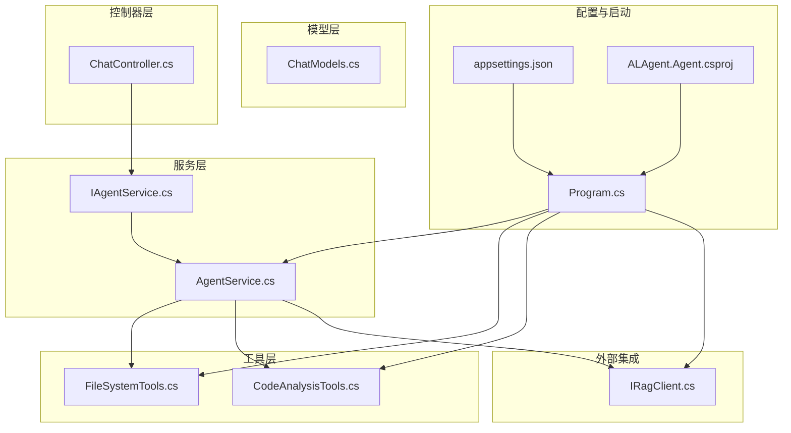
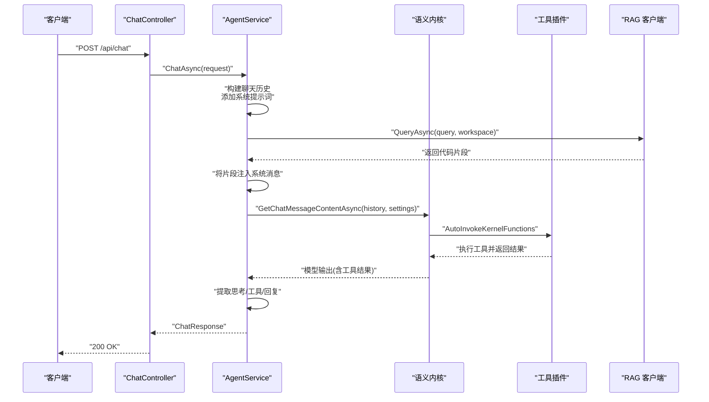
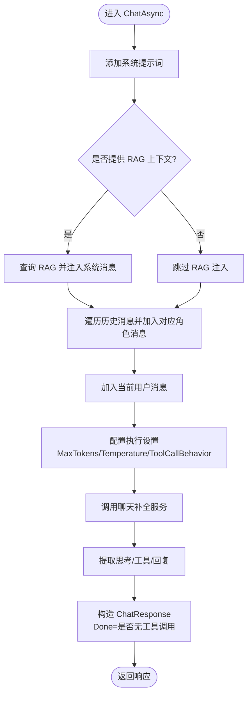
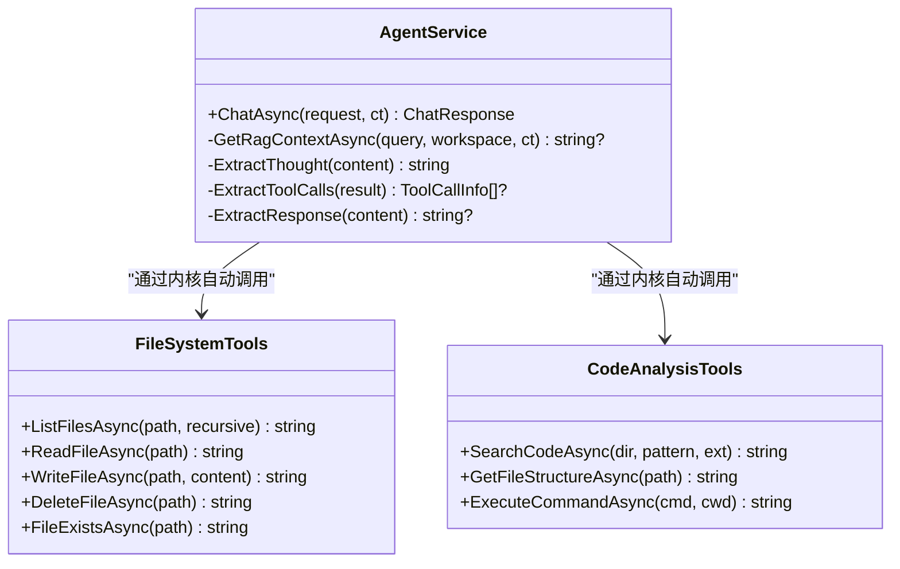
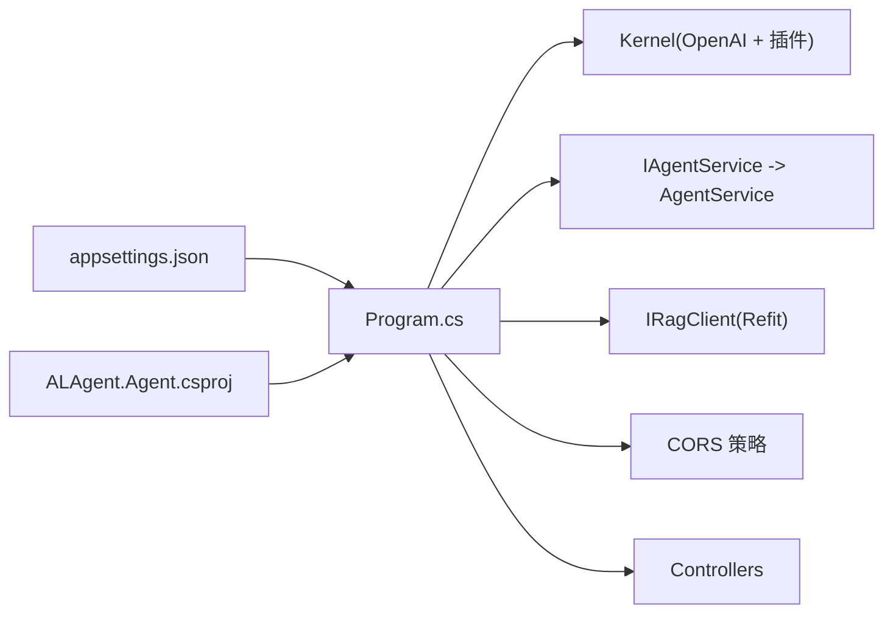
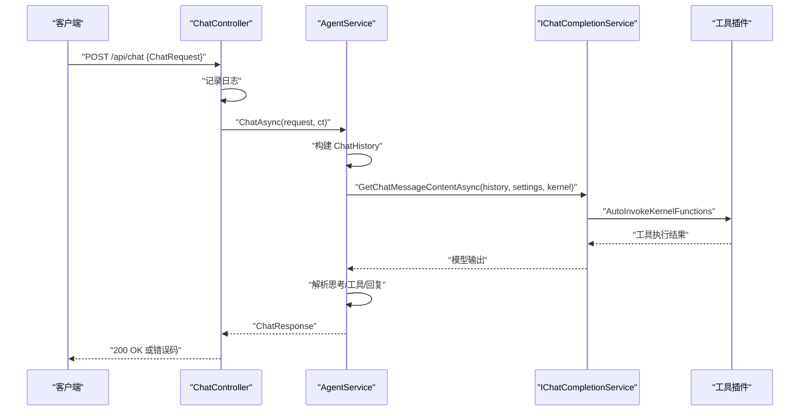
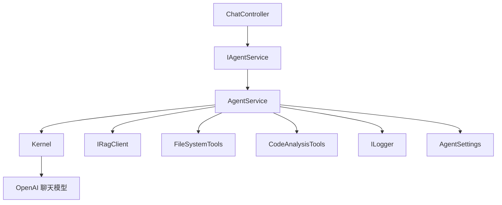
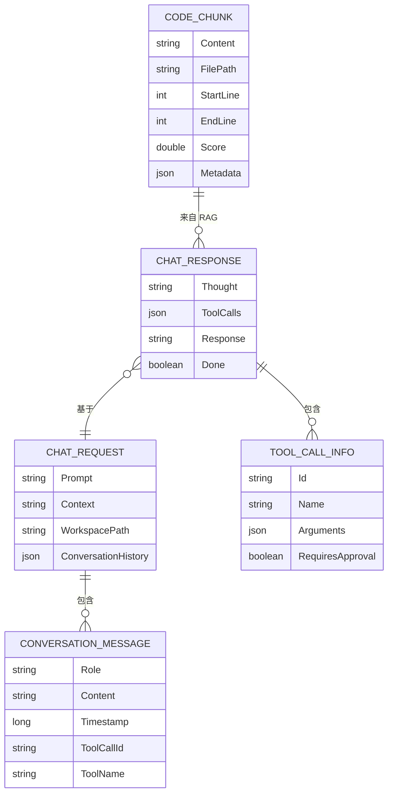

# 业务逻辑层

<cite>
**本文引用的文件列表**
- [IAgentService.cs](file://backend-agent/Services/IAgentService.cs)
- [AgentService.cs](file://backend-agent/Services/AgentService.cs)
- [ChatController.cs](file://backend-agent/Controllers/ChatController.cs)
- [Program.cs](file://backend-agent/Program.cs)
- [AgentSettings.cs](file://backend-agent/Services/AgentSettings.cs)
- [IRagClient.cs](file://backend-agent/Services/IRagClient.cs)
- [FileSystemTools.cs](file://backend-agent/Tools/FileSystemTools.cs)
- [CodeAnalysisTools.cs](file://backend-agent/Tools/CodeAnalysisTools.cs)
- [ChatModels.cs](file://backend-agent/Models/ChatModels.cs)
- [appsettings.json](file://backend-agent/appsettings.json)
- [ALAgent.Agent.csproj](file://backend-agent/ALAgent.Agent.csproj)
</cite>

## 目录
1. [引言](#引言)
2. [项目结构](#项目结构)
3. [核心组件](#核心组件)
4. [架构总览](#架构总览)
5. [详细组件分析](#详细组件分析)
6. [依赖关系分析](#依赖关系分析)
7. [性能与并发特性](#性能与并发特性)
8. [故障排查指南](#故障排查指南)
9. [结论](#结论)
10. [附录](#附录)

## 引言
本文件聚焦于业务逻辑层的 AgentService 核心推理流程，系统性梳理从 API 控制器到服务实现的完整调用链路，涵盖：
- ChatAsync 方法从接收请求到生成响应的全流程：聊天历史构建、RAG 上下文注入、语义内核调用、工具调用行为配置与响应解析
- IAgentService 接口如何体现依赖倒置原则，以及依赖注入在 Program.cs 中的注册机制
- 系统提示词的设计意图与结构
- 代码追踪示例（从 API 到服务）
- 异常传播、日志记录策略与异步流控制机制

## 项目结构
后端采用 ASP.NET Core + Semantic Kernel 架构，核心模块划分如下：
- 控制器层：ChatController 提供 REST API 入口
- 服务层：IAgentService 定义抽象，AgentService 实现具体推理逻辑
- 工具层：FileSystemTools、CodeAnalysisTools 注册为内核插件，支持文件系统与代码分析能力
- 模型层：ChatModels 定义请求/响应与消息结构
- 配置层：Program.cs 注册内核、RAG 客户端、服务与中间件；appsettings.json 提供运行时参数

图表来源
- [ChatController.cs](file://backend-agent/Controllers/ChatController.cs#L1-L45)
- [IAgentService.cs](file://backend-agent/Services/IAgentService.cs#L1-L9)
- [AgentService.cs](file://backend-agent/Services/AgentService.cs#L1-L180)
- [FileSystemTools.cs](file://backend-agent/Tools/FileSystemTools.cs#L1-L151)
- [CodeAnalysisTools.cs](file://backend-agent/Tools/CodeAnalysisTools.cs#L1-L252)
- [ChatModels.cs](file://backend-agent/Models/ChatModels.cs#L1-L50)
- [Program.cs](file://backend-agent/Program.cs#L1-L67)
- [appsettings.json](file://backend-agent/appsettings.json#L1-L17)
- [ALAgent.Agent.csproj](file://backend-agent/ALAgent.Agent.csproj#L1-L18)

章节来源
- [Program.cs](file://backend-agent/Program.cs#L1-L67)
- [appsettings.json](file://backend-agent/appsettings.json#L1-L17)
- [ALAgent.Agent.csproj](file://backend-agent/ALAgent.Agent.csproj#L1-L18)

## 核心组件
- IAgentService：定义 ChatAsync 抽象接口，隔离上层控制器与具体实现，遵循依赖倒置原则
- AgentService：实现 ChatAsync，负责聊天历史构建、RAG 上下文注入、语义内核调用、工具自动调用与响应解析
- ChatController：接收 HTTP 请求，调用 IAgentService 并返回标准化响应
- IRagClient：通过 Refit 客户端访问 RAG 服务，提供代码片段检索
- FileSystemTools / CodeAnalysisTools：注册为内核插件，提供文件系统与代码分析工具
- ChatModels：统一请求/响应数据结构，包含对话历史、工具调用信息等

章节来源
- [IAgentService.cs](file://backend-agent/Services/IAgentService.cs#L1-L9)
- [AgentService.cs](file://backend-agent/Services/AgentService.cs#L1-L180)
- [ChatController.cs](file://backend-agent/Controllers/ChatController.cs#L1-L45)
- [IRagClient.cs](file://backend-agent/Services/IRagClient.cs#L1-L14)
- [FileSystemTools.cs](file://backend-agent/Tools/FileSystemTools.cs#L1-L151)
- [CodeAnalysisTools.cs](file://backend-agent/Tools/CodeAnalysisTools.cs#L1-L252)
- [ChatModels.cs](file://backend-agent/Models/ChatModels.cs#L1-L50)

## 架构总览
整体调用链从 HTTP 入口开始，经由控制器进入服务层，再通过语义内核与工具插件完成推理与工具调用，最后返回结构化响应。

图表来源
- [ChatController.cs](file://backend-agent/Controllers/ChatController.cs#L1-L45)
- [AgentService.cs](file://backend-agent/Services/AgentService.cs#L46-L117)
- [IRagClient.cs](file://backend-agent/Services/IRagClient.cs#L1-L14)
- [FileSystemTools.cs](file://backend-agent/Tools/FileSystemTools.cs#L1-L151)
- [CodeAnalysisTools.cs](file://backend-agent/Tools/CodeAnalysisTools.cs#L1-L252)

## 详细组件分析

### IAgentService 接口与依赖倒置
- 角色定位：定义 ChatAsync 抽象，使控制器仅依赖抽象接口，不直接依赖具体实现
- 依赖倒置原则：上层（控制器）不依赖下层（实现），二者共同依赖抽象；抽象稳定，实现可变
- 优势：便于替换实现、单元测试 Mock、扩展新服务实现

章节来源
- [IAgentService.cs](file://backend-agent/Services/IAgentService.cs#L1-L9)
- [ChatController.cs](file://backend-agent/Controllers/ChatController.cs#L1-L45)

### AgentService.ChatAsync 推理流程
- 聊天历史构建
  - 添加系统提示词（包含工具清单与行为约束）
  - 可选注入 RAG 相关代码上下文（若存在）
  - 追加历史消息（用户、助手、工具结果）
  - 添加当前用户消息
- 执行设置
  - 最大 Token 数、温度、工具调用行为（自动调用内核函数）
- 语义内核调用
  - 获取聊天补全服务实例
  - 传入历史与执行设置，等待模型输出
- 响应解析
  - 提取“思考”内容（首行或显式标记段落）
  - 自动工具调用行为已由内核处理，此处保留占位
  - 提取最终回复文本（去除思考标记后的剩余部分）
  - 计算 Done 标志：当无工具调用时结束

图表来源
- [AgentService.cs](file://backend-agent/Services/AgentService.cs#L46-L117)
- [IRagClient.cs](file://backend-agent/Services/IRagClient.cs#L1-L14)

章节来源
- [AgentService.cs](file://backend-agent/Services/AgentService.cs#L46-L117)

### 系统提示词设计意图与结构
- 设计意图
  - 明确角色定位：专业编码助理，帮助理解与修改代码
  - 规范推理流程：先思考、再检索、最后行动
  - 工具可用性：明确列出可用工具（文件系统、代码搜索、命令执行等）
  - 行为约束：强调在需要时才进行高风险操作（如写文件、执行命令），并要求用户批准
- 结构要点
  - 分步骤说明（思考、检索、行动）
  - 工具清单与用途
  - 行为规范（解释推理过程、提供可操作建议）

章节来源
- [AgentService.cs](file://backend-agent/Services/AgentService.cs#L16-L32)

### 工具调用行为配置与内核集成
- 工具注册
  - 在 Program.cs 中将 FileSystemTools 与 CodeAnalysisTools 注册为内核插件
- 工具调用行为
  - ChatAsync 使用 AutoInvokeKernelFunctions，使内核自动识别并调用匹配的工具函数
- 工具能力
  - 文件系统：列举目录、读取文件、写入文件、删除文件、存在性检查
  - 代码分析：按正则搜索代码、获取文件结构（多语言）、执行命令（带工作目录）

图表来源
- [AgentService.cs](file://backend-agent/Services/AgentService.cs#L1-L180)
- [FileSystemTools.cs](file://backend-agent/Tools/FileSystemTools.cs#L1-L151)
- [CodeAnalysisTools.cs](file://backend-agent/Tools/CodeAnalysisTools.cs#L1-L252)

章节来源
- [Program.cs](file://backend-agent/Program.cs#L32-L49)
- [FileSystemTools.cs](file://backend-agent/Tools/FileSystemTools.cs#L1-L151)
- [CodeAnalysisTools.cs](file://backend-agent/Tools/CodeAnalysisTools.cs#L1-L252)

### 依赖注入与配置
- Program.cs 注册项
  - 配置绑定：AgentSettings 从配置节读取参数
  - CORS：允许前端通信来源
  - RAG 客户端：使用 Refit 创建 IRagClient，设置 BaseAddress 与超时
  - 语义内核：创建 Kernel，注册 OpenAI 聊天模型与工具插件
  - 服务：IAgentService -> AgentService
  - 控制器：注册 MVC
- 配置文件
  - appsettings.json 提供 OpenAI API Key、模型 ID、RAG 地址、Token 数与温度等参数

图表来源
- [Program.cs](file://backend-agent/Program.cs#L1-L67)
- [appsettings.json](file://backend-agent/appsettings.json#L1-L17)
- [ALAgent.Agent.csproj](file://backend-agent/ALAgent.Agent.csproj#L1-L18)

章节来源
- [Program.cs](file://backend-agent/Program.cs#L1-L67)
- [appsettings.json](file://backend-agent/appsettings.json#L1-L17)
- [ALAgent.Agent.csproj](file://backend-agent/ALAgent.Agent.csproj#L1-L18)

### 代码追踪示例：从 API 控制器到服务实现
- ChatController.Chat
  - 接收 ChatRequest，记录日志，调用 IAgentService.ChatAsync
  - 捕获取消与异常，返回标准化状态码与错误信息
- AgentService.ChatAsync
  - 构建 ChatHistory，注入系统提示词与可选 RAG 上下文
  - 设置执行参数（最大 Token、温度、工具自动调用）
  - 通过内核聊天补全服务生成响应
  - 解析思考、工具与回复，构造 ChatResponse

图表来源
- [ChatController.cs](file://backend-agent/Controllers/ChatController.cs#L1-L45)
- [AgentService.cs](file://backend-agent/Services/AgentService.cs#L46-L117)

章节来源
- [ChatController.cs](file://backend-agent/Controllers/ChatController.cs#L1-L45)
- [AgentService.cs](file://backend-agent/Services/AgentService.cs#L46-L117)

### 异常传播、日志记录与异步流控制
- 异常传播
  - AgentService.ChatAsync 捕获内部异常并记录日志后重新抛出，交由上层控制器处理
  - ChatController 对 OperationCanceledException 返回特定状态码，其他异常返回 500
- 日志记录
  - 控制器记录请求摘要与错误
  - 服务层记录 RAG 查询失败与通用错误
- 异步流控制
  - 所有外部调用均使用 CancellationToken 传递
  - RAG 查询与内核调用均为异步，避免阻塞

章节来源
- [AgentService.cs](file://backend-agent/Services/AgentService.cs#L112-L117)
- [ChatController.cs](file://backend-agent/Controllers/ChatController.cs#L25-L43)

## 依赖关系分析
- 组件耦合
  - 控制器依赖 IAgentService（抽象），降低与具体实现耦合
  - AgentService 依赖 Kernel、IRagClient、AgentSettings、ILogger
  - 工具类通过内核插件机制被间接调用，保持低耦合
- 外部依赖
  - OpenAI 聊天模型（Semantic Kernel）
  - RAG 服务（Refit 客户端）
  - 文件系统与命令执行（操作系统级）

图表来源
- [ChatController.cs](file://backend-agent/Controllers/ChatController.cs#L1-L45)
- [IAgentService.cs](file://backend-agent/Services/IAgentService.cs#L1-L9)
- [AgentService.cs](file://backend-agent/Services/AgentService.cs#L1-L180)
- [Program.cs](file://backend-agent/Program.cs#L32-L49)

章节来源
- [Program.cs](file://backend-agent/Program.cs#L1-L67)
- [AgentService.cs](file://backend-agent/Services/AgentService.cs#L1-L180)

## 性能与并发特性
- 并发模型
  - 所有关键路径为异步，避免阻塞线程池
  - RAG 查询与内核调用均支持取消令牌
- 性能优化点
  - RAG 返回 TopK 控制上下文规模
  - 限制单次读取文件大小，避免内存压力
  - 工具调用自动合并与去重（由内核行为决定）
- 资源管理
  - 内核作为单例，减少初始化开销
  - Refit 客户端复用连接池

章节来源
- [AgentService.cs](file://backend-agent/Services/AgentService.cs#L119-L145)
- [FileSystemTools.cs](file://backend-agent/Tools/FileSystemTools.cs#L52-L77)
- [Program.cs](file://backend-agent/Program.cs#L32-L49)

## 故障排查指南
- 常见问题
  - RAG 服务不可达：检查 RagApiUrl 与网络连通性；确认健康检查端点
  - OpenAI 凭据无效：确认 OpenAIApiKey 与模型 ID 配置正确
  - 工具调用失败：检查工具输入参数与权限（如写文件、执行命令需用户批准）
- 日志定位
  - 控制器：请求到达与异常堆栈
  - 服务层：RAG 查询失败与通用错误
- 快速验证
  - 使用 /health 健康检查端点
  - 简化请求仅包含 Prompt，排除复杂历史与工具调用

章节来源
- [ChatController.cs](file://backend-agent/Controllers/ChatController.cs#L25-L43)
- [AgentService.cs](file://backend-agent/Services/AgentService.cs#L112-L145)
- [Program.cs](file://backend-agent/Program.cs#L64-L66)

## 结论
AgentService 将系统提示词、RAG 上下文与语义内核工具调用有机结合，形成清晰的推理闭环。通过 IAgentService 的抽象与 Program.cs 的依赖注入，实现了良好的可维护性与可扩展性。建议后续关注：
- 工具调用审批流程的可视化与交互
- RAG 上下文的动态裁剪与缓存
- 更细粒度的日志与指标采集

## 附录
- 数据模型概览

图表来源
- [ChatModels.cs](file://backend-agent/Models/ChatModels.cs#L1-L50)