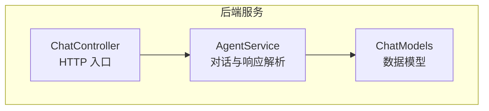
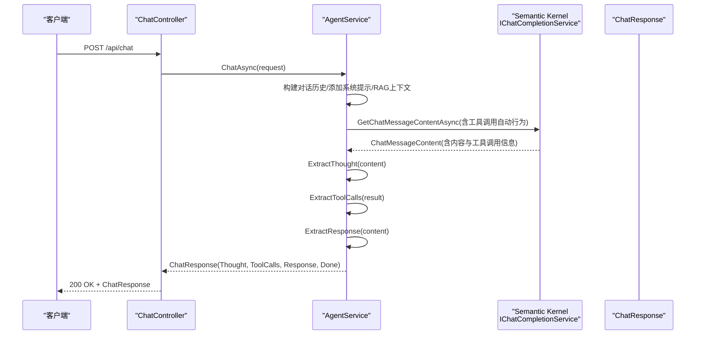
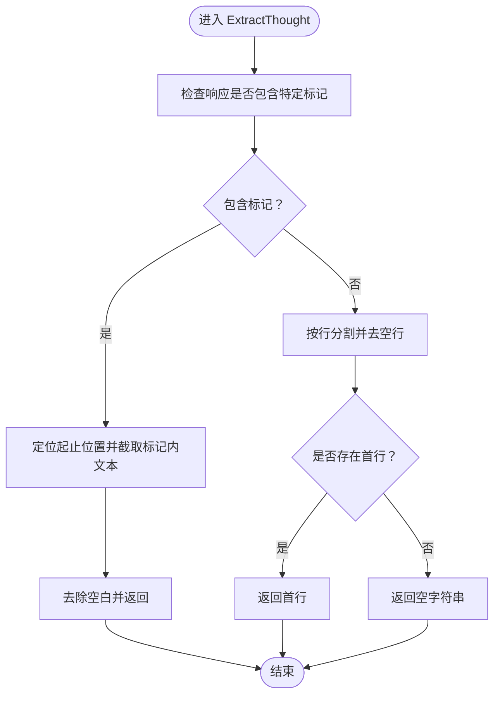
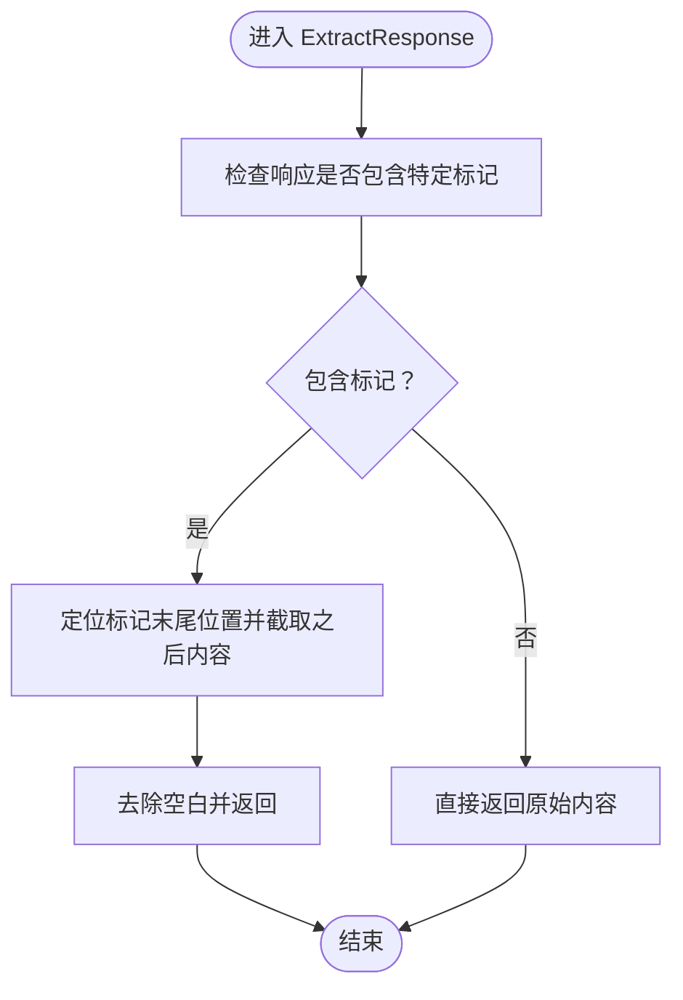
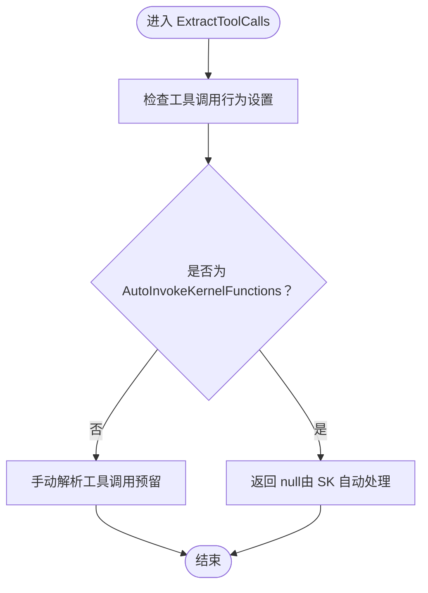
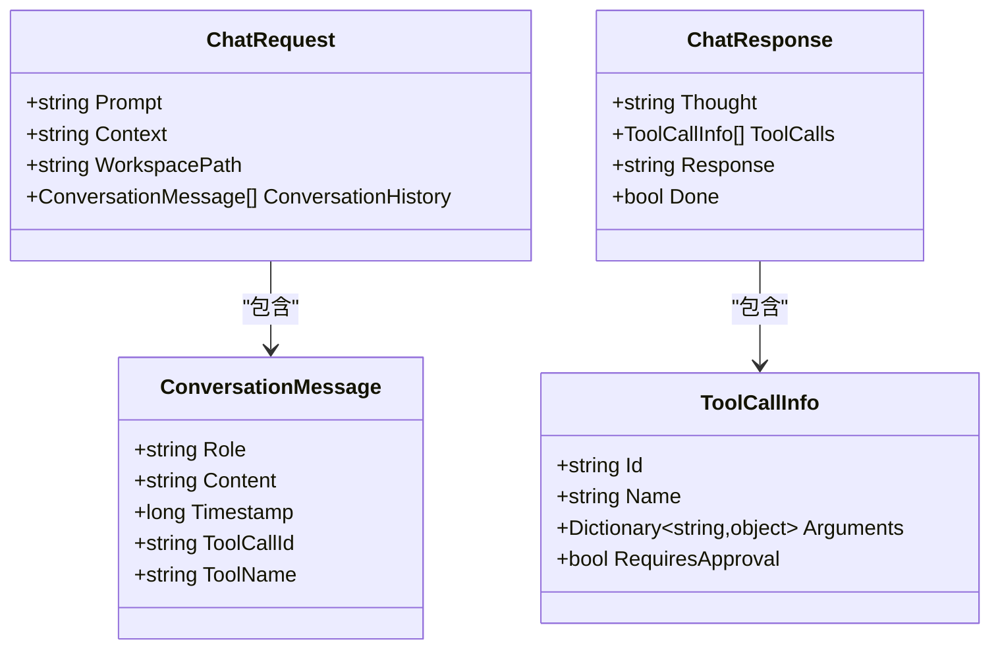
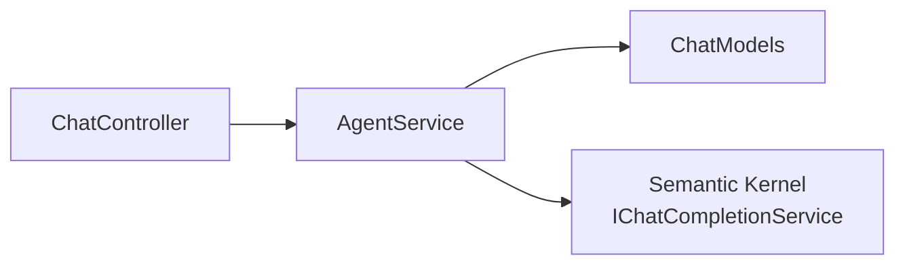

# 响应解析

<cite>
**本文引用的文件**
- [AgentService.cs](file://backend-agent/Services/AgentService.cs)
- [ChatModels.cs](file://backend-agent/Models/ChatModels.cs)
- [ChatController.cs](file://backend-agent/Controllers/ChatController.cs)
</cite>

## 目录
1. [简介](#简介)
2. [项目结构](#项目结构)
3. [核心组件](#核心组件)
4. [架构总览](#架构总览)
5. [详细组件分析](#详细组件分析)
6. [依赖关系分析](#依赖关系分析)
7. [性能考量](#性能考量)
8. [故障排查指南](#故障排查指南)
9. [结论](#结论)

## 简介
本篇文档聚焦于 AgentService 中对 AI 响应进行解析的三个核心方法：ExtractThought、ExtractResponse 和 ExtractToolCalls。我们将说明：
- ExtractThought 如何从 AI 响应中提取“思考过程”（优先解析特定标记内的内容；若不存在，则取首行作为思考）。
- ExtractResponse 如何移除“思考部分”，仅保留最终面向用户的回复。
- ExtractToolCalls 的当前实现（返回 null）及其原因（工具调用由 Semantic Kernel 的 AutoInvokeKernelFunctions 模式自动处理）。
- ChatResponse 对象的构造过程以及 Thought、Response、ToolCalls、Done 四个字段的业务含义与使用场景。

## 项目结构
后端采用 C#/.NET 与 Semantic Kernel 集成，AgentService 负责构建对话历史、调用大模型并解析响应；ChatController 提供 HTTP 接口；ChatModels 定义请求与响应的数据模型。

图表来源
- [ChatController.cs](file://backend-agent/Controllers/ChatController.cs#L1-L45)
- [AgentService.cs](file://backend-agent/Services/AgentService.cs#L1-L117)
- [ChatModels.cs](file://backend-agent/Models/ChatModels.cs#L1-L31)

章节来源
- [ChatController.cs](file://backend-agent/Controllers/ChatController.cs#L1-L45)
- [AgentService.cs](file://backend-agent/Services/AgentService.cs#L1-L117)
- [ChatModels.cs](file://backend-agent/Models/ChatModels.cs#L1-L31)

## 核心组件
- AgentService.ChatAsync：构建对话历史、配置执行参数（含工具调用自动行为）、调用聊天完成服务，并在返回后调用三个解析方法生成 ChatResponse。
- ExtractThought：提取思考/推理内容。
- ExtractResponse：移除思考部分后的最终回复。
- ExtractToolCalls：当前返回 null，因为工具调用由 Semantic Kernel 自动处理。
- ChatResponse：封装一次对话的思考、工具调用、回复与完成状态。

章节来源
- [AgentService.cs](file://backend-agent/Services/AgentService.cs#L46-L117)
- [AgentService.cs](file://backend-agent/Services/AgentService.cs#L147-L179)
- [ChatModels.cs](file://backend-agent/Models/ChatModels.cs#L10-L15)

## 架构总览
下图展示了从控制器到服务再到模型的调用链路，以及响应解析的关键步骤。

图表来源
- [ChatController.cs](file://backend-agent/Controllers/ChatController.cs#L20-L31)
- [AgentService.cs](file://backend-agent/Services/AgentService.cs#L46-L117)
- [AgentService.cs](file://backend-agent/Services/AgentService.cs#L147-L179)
- [ChatModels.cs](file://backend-agent/Models/ChatModels.cs#L10-L15)

## 详细组件分析

### ExtractThought：思考过程提取
- 优先策略：当响应包含特定标记时，解析标记之间的文本作为“思考”。该标记的起止位置通过字符串定位计算得到。
- 备选策略：若未检测到标记，则取响应内容按行分割后的首行作为“思考”。
- 边界处理：空内容或无有效行时返回空字符串，确保后续逻辑安全。

图表来源
- [AgentService.cs](file://backend-agent/Services/AgentService.cs#L147-L160)

章节来源
- [AgentService.cs](file://backend-agent/Services/AgentService.cs#L147-L160)

### ExtractResponse：移除思考部分后的最终回复
- 若响应包含特定标记，解析到标记末尾后截取剩余部分作为最终回复。
- 若不包含标记，直接返回原始内容。
- 返回前会去除首尾空白，保证用户侧展示整洁。

图表来源
- [AgentService.cs](file://backend-agent/Services/AgentService.cs#L169-L178)

章节来源
- [AgentService.cs](file://backend-agent/Services/AgentService.cs#L169-L178)

### ExtractToolCalls：工具调用提取（当前实现）
- 当前实现：返回 null。
- 设计原因：在 ChatAsync 中已将工具调用行为设置为 AutoInvokeKernelFunctions，这意味着工具调用由 Semantic Kernel 自动执行并把结果注入到后续对话轮次中，无需手动提取工具调用列表。
- 可扩展性：该方法保留了未来需要“手动”解析工具调用的能力（例如在非自动模式下），但当前代码路径不会走到该分支。

图表来源
- [AgentService.cs](file://backend-agent/Services/AgentService.cs#L82-L88)
- [AgentService.cs](file://backend-agent/Services/AgentService.cs#L162-L167)

章节来源
- [AgentService.cs](file://backend-agent/Services/AgentService.cs#L82-L88)
- [AgentService.cs](file://backend-agent/Services/AgentService.cs#L162-L167)

### ChatResponse：响应对象的构造与字段语义
- 构造位置：在 ChatAsync 的解析阶段，根据 ExtractThought、ExtractToolCalls、ExtractResponse 的结果构造 ChatResponse。
- 字段语义：
  - Thought：本次回复的“思考/推理”内容，用于向用户或前端展示模型的内部逻辑。
  - ToolCalls：工具调用列表。当前实现为 null，表示工具调用由 SK 自动处理。
  - Response：最终面向用户的回复文本，已移除思考部分。
  - Done：是否结束本轮交互。当前实现基于 ToolCalls 是否为空决定。
- 使用场景：
  - 前端可先显示 Thought 以增强可解释性，再显示 Response 作为最终答案。
  - 当 Done 为 true 时，前端可停止等待工具调用结果；否则需继续轮询或等待工具结果回填。

图表来源
- [ChatModels.cs](file://backend-agent/Models/ChatModels.cs#L1-L31)

章节来源
- [ChatModels.cs](file://backend-agent/Models/ChatModels.cs#L10-L15)
- [AgentService.cs](file://backend-agent/Services/AgentService.cs#L101-L110)

## 依赖关系分析
- 控制器依赖服务：ChatController 将请求转发给 IAgentService.ChatAsync。
- 服务依赖模型：AgentService 在 ChatAsync 中创建 ChatResponse 并返回。
- 工具调用依赖：AgentService 在执行设置中启用 AutoInvokeKernelFunctions，使工具调用由 SK 自动处理，从而影响 ExtractToolCalls 的返回值。

图表来源
- [ChatController.cs](file://backend-agent/Controllers/ChatController.cs#L20-L31)
- [AgentService.cs](file://backend-agent/Services/AgentService.cs#L46-L117)
- [ChatModels.cs](file://backend-agent/Models/ChatModels.cs#L10-L15)

章节来源
- [ChatController.cs](file://backend-agent/Controllers/ChatController.cs#L20-L31)
- [AgentService.cs](file://backend-agent/Services/AgentService.cs#L46-L117)
- [ChatModels.cs](file://backend-agent/Models/ChatModels.cs#L10-L15)

## 性能考量
- 解析复杂度：三个解析方法均为线性扫描与简单字符串操作，时间复杂度 O(n)，空间复杂度与输入长度线性相关。
- 自动工具调用：由于工具调用由 SK 自动处理，AgentService 不需要额外的工具调用解析逻辑，减少分支判断与内存分配。
- 建议：
  - 保持解析逻辑简洁，避免不必要的正则或深层字符串处理。
  - 若未来需要更复杂的标记解析，可考虑引入轻量级分词/切片策略，但需评估性能与可维护性。

## 故障排查指南
- 现象：Response 为空或异常
  - 检查 ExtractResponse 的标记匹配逻辑是否正确识别响应格式。
  - 确认输入内容是否包含预期标记，或是否走到了首行作为思考的备选路径。
- 现象：ToolCalls 始终为 null
  - 这是预期行为，因为已启用 AutoInvokeKernelFunctions。如需手动控制，请调整执行设置。
- 现象：Done 始终为 true
  - 当前 Done 基于 ToolCalls 是否为空决定。若工具调用由 SK 自动处理且未产生显式 ToolCalls 列表，Done 将为 true。
- 现象：日志报错
  - ChatController 捕获异常并记录错误日志，可在日志中查看具体异常堆栈。

章节来源
- [AgentService.cs](file://backend-agent/Services/AgentService.cs#L101-L110)
- [AgentService.cs](file://backend-agent/Services/AgentService.cs#L162-L167)
- [ChatController.cs](file://backend-agent/Controllers/ChatController.cs#L33-L42)

## 结论
- ExtractThought 与 ExtractResponse 提供了清晰的“思考-回复”分离机制，便于前端展示可解释性与最终答案。
- ExtractToolCalls 当前返回 null，符合 AutoInvokeKernelFunctions 的设计意图，避免重复解析与潜在的并发问题。
- ChatResponse 的 Done 字段与 ToolCalls 字段共同决定了交互流程的下一步动作：若无工具调用则视为完成，若有则需等待工具结果回填。