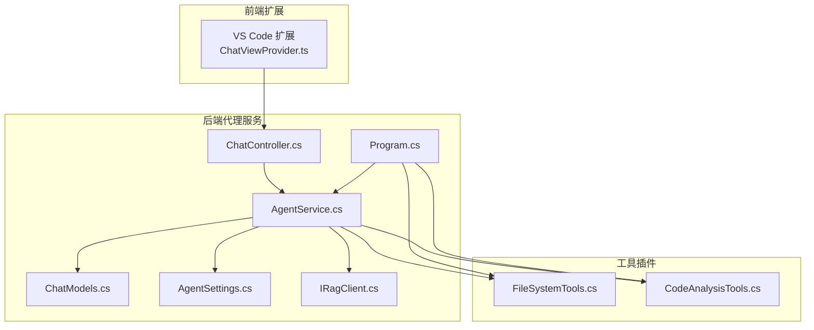
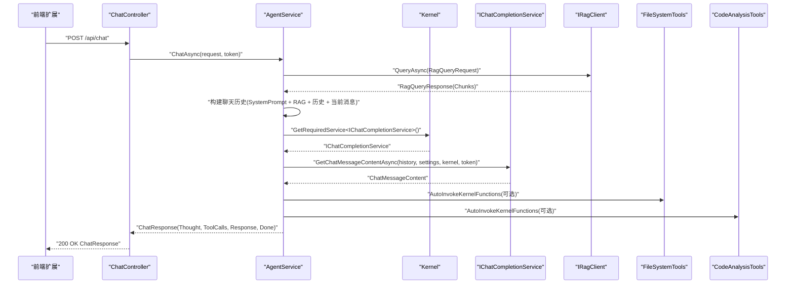
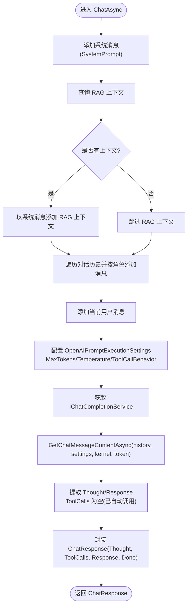
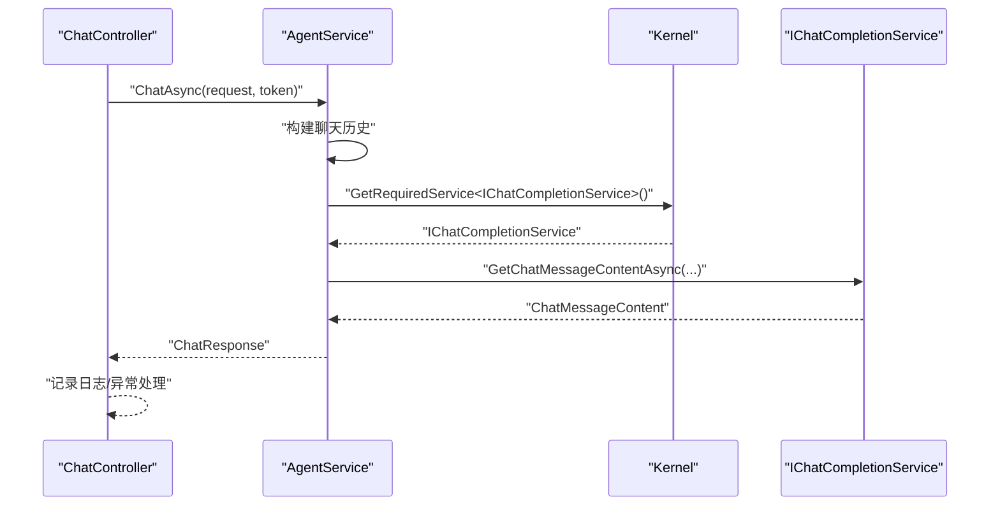
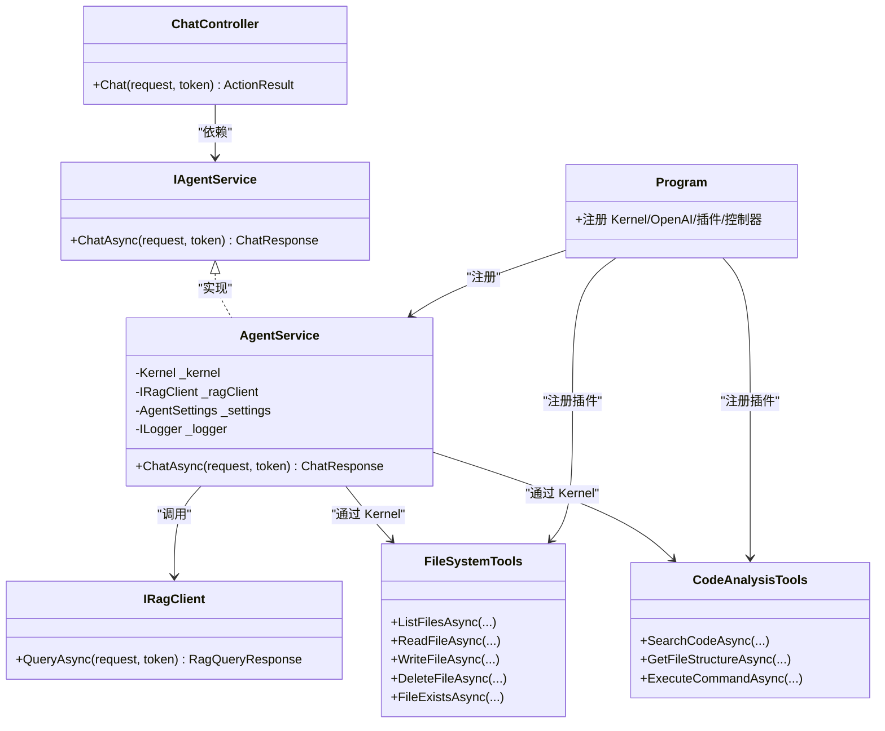

# 推理流程管理

<cite>
**本文引用的文件**
- [AgentService.cs](file://backend-agent/Services/AgentService.cs)
- [IAgentService.cs](file://backend-agent/Services/IAgentService.cs)
- [ChatController.cs](file://backend-agent/Controllers/ChatController.cs)
- [ChatModels.cs](file://backend-agent/Models/ChatModels.cs)
- [AgentSettings.cs](file://backend-agent/Services/AgentSettings.cs)
- [Program.cs](file://backend-agent/Program.cs)
- [IRagClient.cs](file://backend-agent/Services/IRagClient.cs)
- [appsettings.json](file://backend-agent/appsettings.json)
- [CodeAnalysisTools.cs](file://backend-agent/Tools/CodeAnalysisTools.cs)
- [FileSystemTools.cs](file://backend-agent/Tools/FileSystemTools.cs)
</cite>

## 目录
1. [引言](#引言)
2. [项目结构](#项目结构)
3. [核心组件](#核心组件)
4. [架构总览](#架构总览)
5. [详细组件分析](#详细组件分析)
6. [依赖关系分析](#依赖关系分析)
7. [性能考量](#性能考量)
8. [故障排查指南](#故障排查指南)
9. [结论](#结论)

## 引言
本文件聚焦于 AgentService 中 ChatAsync 方法的完整推理流程，系统性阐述从接收 ChatRequest 请求到生成 ChatResponse 响应的全过程。重点覆盖：
- 聊天历史构建：系统消息、RAG 上下文、对话历史、用户当前消息的依次添加与组织
- OpenAIPromptExecutionSettings 执行参数配置：MaxTokens、Temperature、ToolCallBehavior 的作用与取值来源
- 通过 IChatCompletionService 获取大模型响应的异步调用机制
- 系统提示词(SystemPrompt)的设计原则及其对 AI 行为引导的作用
- 从 ChatController 调用 AgentService 的完整调用链
- 异常处理策略、日志记录与异步流控制的最佳实践

## 项目结构
后端采用 ASP.NET Core + Semantic Kernel 架构，服务层负责对话编排与工具函数调用，控制器层负责 HTTP 入口与错误处理，模型层定义请求/响应数据结构，工具层提供文件系统与代码分析能力，RAG 客户端用于检索相关代码片段。

图表来源
- [ChatController.cs](file://backend-agent/Controllers/ChatController.cs#L1-L45)
- [AgentService.cs](file://backend-agent/Services/AgentService.cs#L1-L180)
- [ChatModels.cs](file://backend-agent/Models/ChatModels.cs#L1-L50)
- [AgentSettings.cs](file://backend-agent/Services/AgentSettings.cs#L1-L11)
- [Program.cs](file://backend-agent/Program.cs#L1-L67)
- [IRagClient.cs](file://backend-agent/Services/IRagClient.cs#L1-L14)
- [FileSystemTools.cs](file://backend-agent/Tools/FileSystemTools.cs#L1-L151)
- [CodeAnalysisTools.cs](file://backend-agent/Tools/CodeAnalysisTools.cs#L1-L252)

章节来源
- [Program.cs](file://backend-agent/Program.cs#L1-L67)
- [ChatController.cs](file://backend-agent/Controllers/ChatController.cs#L1-L45)
- [AgentService.cs](file://backend-agent/Services/AgentService.cs#L1-L180)
- [ChatModels.cs](file://backend-agent/Models/ChatModels.cs#L1-L50)
- [AgentSettings.cs](file://backend-agent/Services/AgentSettings.cs#L1-L11)
- [IRagClient.cs](file://backend-agent/Services/IRagClient.cs#L1-L14)
- [FileSystemTools.cs](file://backend-agent/Tools/FileSystemTools.cs#L1-L151)
- [CodeAnalysisTools.cs](file://backend-agent/Tools/CodeAnalysisTools.cs#L1-L252)

## 核心组件
- ChatController：HTTP 入口，接收 ChatRequest，调用 IAgentService.ChatAsync，并统一处理异常与返回结果。
- AgentService：核心推理引擎，负责构建聊天历史、拉取 RAG 上下文、配置执行参数、调用 IChatCompletionService、解析响应并封装为 ChatResponse。
- IAgentService：服务接口，定义 ChatAsync 合同。
- ChatModels：定义 ChatRequest、ChatResponse、ConversationMessage、ToolCallInfo、RagQueryRequest/RagQueryResponse 等数据结构。
- AgentSettings：读取配置项，如 MaxTokens、Temperature、ModelId、RagApiUrl 等。
- Program：注册 Kernel、OpenAI Chat Completion、工具插件、RAG 客户端与控制器。
- IRagClient：通过 Refit 定义 RAG 查询接口，支持健康检查。
- 工具插件：FileSystemTools 与 CodeAnalysisTools 提供文件系统操作与代码检索能力，作为 Semantic Kernel 插件注册。

章节来源
- [ChatController.cs](file://backend-agent/Controllers/ChatController.cs#L1-L45)
- [AgentService.cs](file://backend-agent/Services/AgentService.cs#L1-L180)
- [IAgentService.cs](file://backend-agent/Services/IAgentService.cs#L1-L9)
- [ChatModels.cs](file://backend-agent/Models/ChatModels.cs#L1-L50)
- [AgentSettings.cs](file://backend-agent/Services/AgentSettings.cs#L1-L11)
- [Program.cs](file://backend-agent/Program.cs#L1-L67)
- [IRagClient.cs](file://backend-agent/Services/IRagClient.cs#L1-L14)
- [FileSystemTools.cs](file://backend-agent/Tools/FileSystemTools.cs#L1-L151)
- [CodeAnalysisTools.cs](file://backend-agent/Tools/CodeAnalysisTools.cs#L1-L252)

## 架构总览
下图展示了从 HTTP 请求到大模型响应与工具调用的完整链路，以及各组件间的依赖关系。

图表来源
- [ChatController.cs](file://backend-agent/Controllers/ChatController.cs#L1-L45)
- [AgentService.cs](file://backend-agent/Services/AgentService.cs#L46-L117)
- [Program.cs](file://backend-agent/Program.cs#L32-L49)
- [IRagClient.cs](file://backend-agent/Services/IRagClient.cs#L1-L14)
- [FileSystemTools.cs](file://backend-agent/Tools/FileSystemTools.cs#L1-L151)
- [CodeAnalysisTools.cs](file://backend-agent/Tools/CodeAnalysisTools.cs#L1-L252)

## 详细组件分析

### ChatAsync 方法推理流程详解
- 聊天历史构建
  - 首先添加系统消息(SystemPrompt)，明确 AI 的角色与可用工具，确保后续推理遵循既定规则。
  - 若 RAG 返回上下文，则以系统消息形式注入“相关代码上下文”，增强对当前问题的背景理解。
  - 迭代请求中的对话历史，按角色区分添加用户消息、助手消息；工具结果以系统消息形式补充上下文，便于模型在后续回合中结合工具输出进行推理。
  - 最后添加当前用户消息，形成完整的上下文序列。
- 执行参数配置
  - 从 AgentSettings 读取 MaxTokens 与 Temperature，分别控制最大生成长度与采样多样性。
  - ToolCallBehavior 设置为 AutoInvokeKernelFunctions，使模型在需要时自动触发已注册的工具函数，无需手动提取工具调用再调用。
- 大模型响应获取
  - 通过 Kernel 获取 IChatCompletionService 实例，调用 GetChatMessageContentAsync 并传入聊天历史、执行设置与 Kernel。
  - 在 AutoInvoke 模式下，工具调用会自动执行，结果以系统消息形式回填至聊天历史，随后模型基于完整上下文生成最终回答。
- 响应解析与封装
  - 从模型输出中提取“思考/推理”片段作为 Thought，若未显式标记则取首行。
  - 由于使用 AutoInvoke，此处返回空表示工具调用已由框架自动处理。
  - 从输出中移除“思考/推理”部分，得到最终可呈现的 Response，并根据是否存在工具调用来决定 Done 标志。

图表来源
- [AgentService.cs](file://backend-agent/Services/AgentService.cs#L46-L117)

章节来源
- [AgentService.cs](file://backend-agent/Services/AgentService.cs#L46-L117)
- [AgentSettings.cs](file://backend-agent/Services/AgentSettings.cs#L1-L11)
- [appsettings.json](file://backend-agent/appsettings.json#L1-L17)

### 系统提示词(SystemPrompt)设计原则与作用
- 设计原则
  - 明确角色定位：强调“专家级编码助手”的职责，提升回答的专业性与可信度。
  - 步骤化思维：要求“先思考、再行动”，有助于模型在复杂任务中给出可解释的推理过程。
  - 工具清单与边界：列出可用工具与需要用户批准的操作，避免越权或误用。
  - 可操作性：强调“清晰、可执行”的回复，便于用户理解与采纳。
- 对 AI 行为的引导
  - 规范推理路径：通过“先思考、再行动”的指令，降低幻觉风险，提高逻辑一致性。
  - 控制工具使用：明确哪些操作需要用户批准，保障安全与可控。
  - 统一输出风格：鼓励解释推理过程，提升用户体验与可追溯性。

章节来源
- [AgentService.cs](file://backend-agent/Services/AgentService.cs#L16-L32)

### OpenAIPromptExecutionSettings 执行参数
- MaxTokens
  - 限制单次生成的最大 token 数，平衡响应长度与成本。
  - 来源：AgentSettings.MaxTokens，默认来自配置文件。
- Temperature
  - 控制采样多样性，数值越高越随机，越低越稳定。
  - 来源：AgentSettings.Temperature，默认来自配置文件。
- ToolCallBehavior.AutoInvokeKernelFunctions
  - 自动调用已注册的工具函数，简化工具调用链路，减少手写解析工具调用的复杂度。

章节来源
- [AgentService.cs](file://backend-agent/Services/AgentService.cs#L82-L88)
- [AgentSettings.cs](file://backend-agent/Services/AgentSettings.cs#L1-L11)
- [appsettings.json](file://backend-agent/appsettings.json#L1-L17)

### 通过 IChatCompletionService 获取大模型响应
- 服务获取
  - 通过 Kernel.GetRequiredService<IChatCompletionService>() 获取聊天补全服务实例。
- 异步调用
  - 使用 GetChatMessageContentAsync(history, settings, kernel, cancellationToken) 发起异步请求。
- 工具调用
  - 在 AutoInvoke 模式下，模型输出的工具调用会被自动解析并执行，执行结果以系统消息回填至历史，随后模型继续生成最终回答。

章节来源
- [AgentService.cs](file://backend-agent/Services/AgentService.cs#L90-L99)
- [Program.cs](file://backend-agent/Program.cs#L32-L49)

### 从 ChatController 到 AgentService 的调用链
- ChatController.Chat 接收 ChatRequest，记录日志，调用 IAgentService.ChatAsync，并对取消与异常进行统一处理。
- AgentService.ChatAsync 内部完成历史构建、RAG 查询、执行参数配置、调用 IChatCompletionService、解析响应并封装为 ChatResponse。

图表来源
- [ChatController.cs](file://backend-agent/Controllers/ChatController.cs#L20-L44)
- [AgentService.cs](file://backend-agent/Services/AgentService.cs#L46-L117)
- [Program.cs](file://backend-agent/Program.cs#L32-L49)

章节来源
- [ChatController.cs](file://backend-agent/Controllers/ChatController.cs#L1-L45)
- [AgentService.cs](file://backend-agent/Services/AgentService.cs#L46-L117)

### 工具插件与函数调用
- 文件系统工具
  - list_files、read_file、write_file、delete_file、file_exists 等，作为 Kernel 函数注册，供模型在 AutoInvoke 模式下直接调用。
- 代码分析工具
  - search_code、get_file_structure、execute_command 等，支持正则检索、文件结构分析与命令执行（需用户批准）。
- 注册方式
  - 在 Program 中通过 Kernel.Plugins.AddFromType 将两类工具注册为插件，供 ChatAsync 使用。

章节来源
- [FileSystemTools.cs](file://backend-agent/Tools/FileSystemTools.cs#L1-L151)
- [CodeAnalysisTools.cs](file://backend-agent/Tools/CodeAnalysisTools.cs#L1-L252)
- [Program.cs](file://backend-agent/Program.cs#L44-L48)

## 依赖关系分析
- 组件耦合
  - AgentService 依赖 Kernel、IRagClient、AgentSettings、ILogger，耦合集中在推理编排与外部服务交互。
  - ChatController 仅依赖 IAgentService 与 ILogger，保持薄控制器职责。
- 外部依赖
  - OpenAI Chat Completion 通过 Kernel 注入。
  - RAG 客户端通过 Refit 接口 IRagClient 访问后端 RAG 服务。
- 工具函数
  - 通过 Semantic Kernel 插件机制注册，实现与模型的无缝集成。

图表来源
- [ChatController.cs](file://backend-agent/Controllers/ChatController.cs#L1-L45)
- [IAgentService.cs](file://backend-agent/Services/IAgentService.cs#L1-L9)
- [AgentService.cs](file://backend-agent/Services/AgentService.cs#L1-L180)
- [IRagClient.cs](file://backend-agent/Services/IRagClient.cs#L1-L14)
- [FileSystemTools.cs](file://backend-agent/Tools/FileSystemTools.cs#L1-L151)
- [CodeAnalysisTools.cs](file://backend-agent/Tools/CodeAnalysisTools.cs#L1-L252)
- [Program.cs](file://backend-agent/Program.cs#L32-L49)

章节来源
- [Program.cs](file://backend-agent/Program.cs#L1-L67)
- [AgentService.cs](file://backend-agent/Services/AgentService.cs#L1-L180)
- [ChatController.cs](file://backend-agent/Controllers/ChatController.cs#L1-L45)
- [IRagClient.cs](file://backend-agent/Services/IRagClient.cs#L1-L14)
- [FileSystemTools.cs](file://backend-agent/Tools/FileSystemTools.cs#L1-L151)
- [CodeAnalysisTools.cs](file://backend-agent/Tools/CodeAnalysisTools.cs#L1-L252)

## 性能考量
- Token 与温度
  - 合理设置 MaxTokens 与 Temperature，可在保证质量的同时控制成本与时延。
- RAG 上下文
  - 限制 TopK 与上下文拼接长度，避免历史过长导致上下文截断或延迟增加。
- 工具调用
  - AutoInvoke 能减少手写解析开销，但需注意工具执行的 IO 成本（如文件读写、命令执行），建议在必要时才触发。
- 异步与超时
  - 控制 RAG 查询与文件系统操作的超时，避免阻塞主线程。
- 日志与可观测性
  - 在关键节点记录耗时与上下文摘要，便于定位性能瓶颈。

[本节为通用指导，不直接分析具体文件]

## 故障排查指南
- 常见异常与处理
  - OperationCanceledException：在 ChatController 中捕获并返回特定状态码，便于前端感知取消。
  - 其他异常：统一记录错误日志并返回 500。
  - RAG 查询失败：AgentService 记录警告日志并返回空上下文，不影响主流程。
- 日志记录
  - ChatController 记录请求摘要与错误堆栈。
  - AgentService 记录 RAG 查询失败与一般性错误。
- 异步流控制
  - 使用 CancellationToken 传递取消信号，确保长时间运行的任务可被及时中断。
  - 对外部调用设置合理超时，避免资源泄露。

章节来源
- [ChatController.cs](file://backend-agent/Controllers/ChatController.cs#L20-L44)
- [AgentService.cs](file://backend-agent/Services/AgentService.cs#L112-L117)

## 结论
AgentService 的 ChatAsync 方法通过严谨的历史构建、可控的执行参数与自动化的工具调用，实现了从请求到响应的闭环推理。配合 ChatController 的统一入口与错误处理、Program 的依赖注入与插件注册，形成了高内聚、低耦合的服务架构。建议在生产环境中进一步完善 RAG 上下文裁剪、工具调用审批与可观测性指标，以提升稳定性与可维护性。