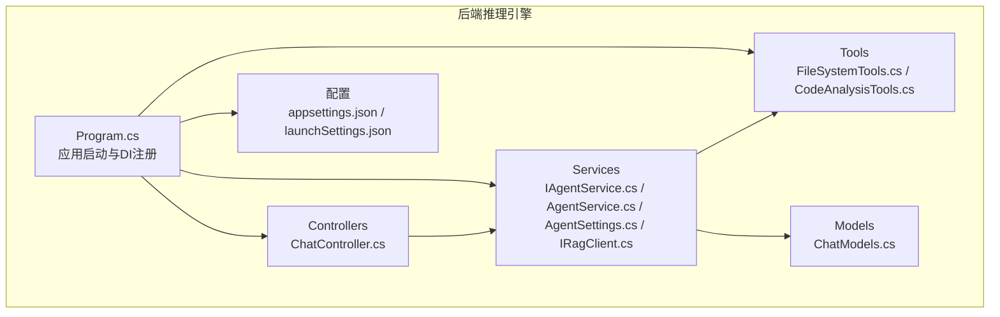
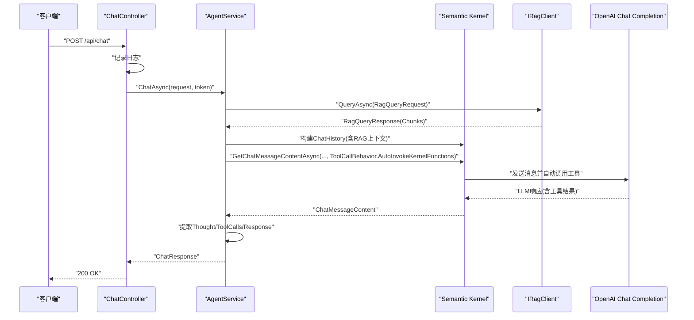
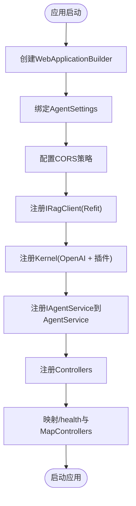
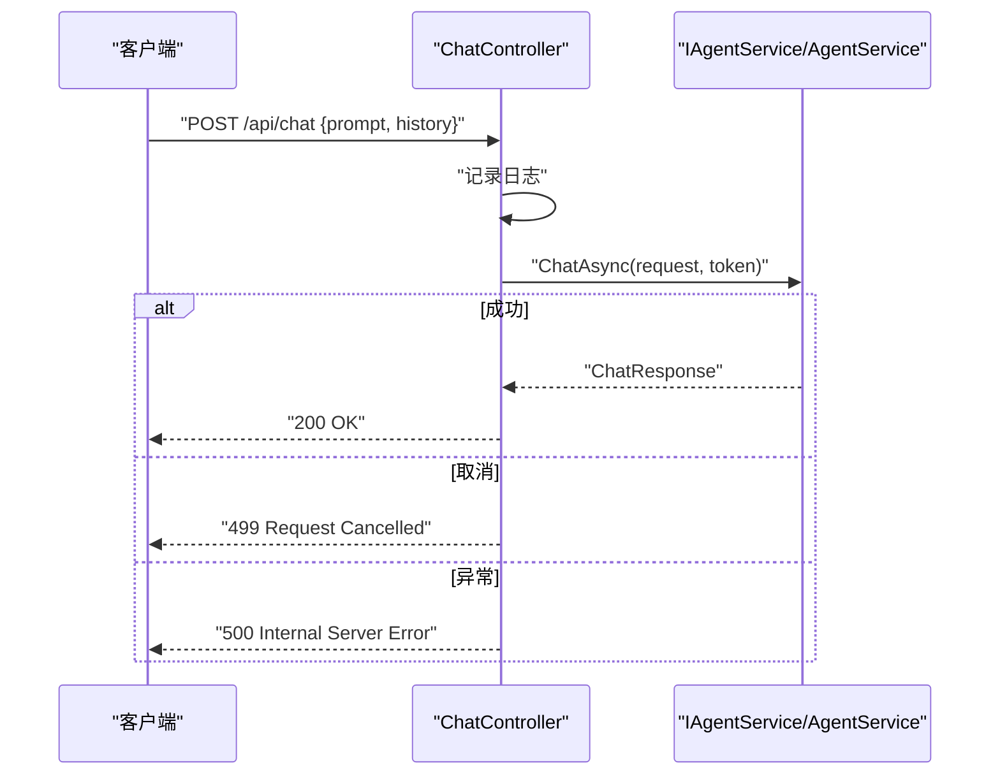
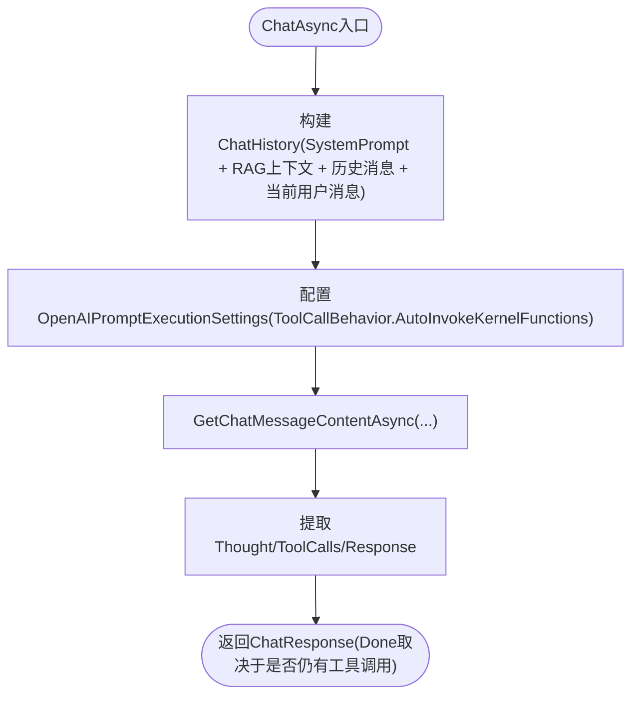
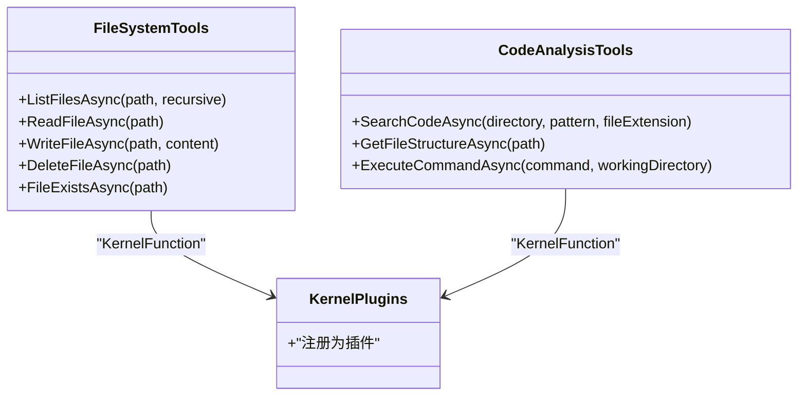
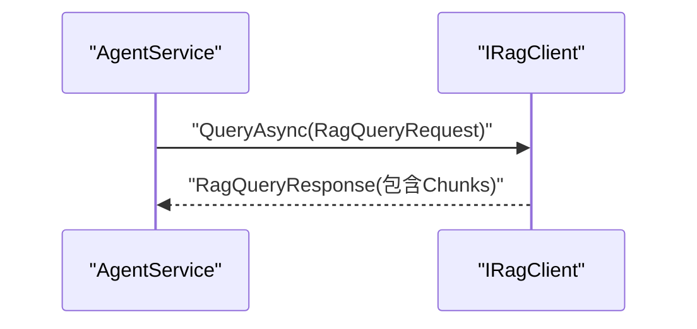
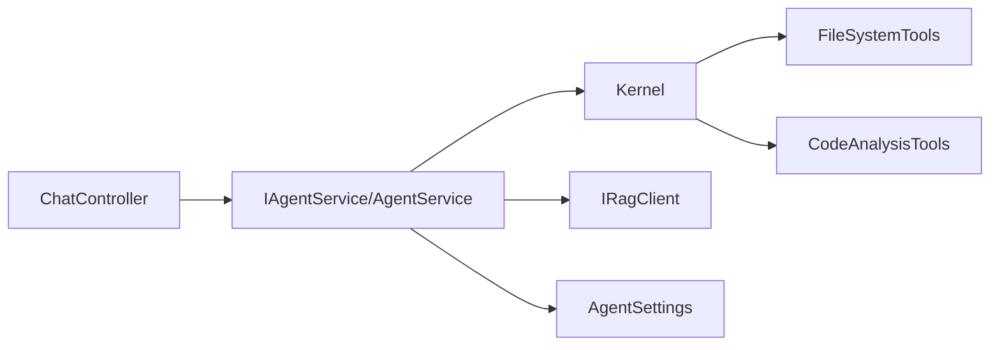

# 后端推理引擎

<cite>
**本文引用的文件**
- [Program.cs](file://backend-agent/Program.cs)
- [ChatController.cs](file://backend-agent/Controllers/ChatController.cs)
- [IAgentService.cs](file://backend-agent/Services/IAgentService.cs)
- [AgentService.cs](file://backend-agent/Services/AgentService.cs)
- [AgentSettings.cs](file://backend-agent/Services/AgentSettings.cs)
- [IRagClient.cs](file://backend-agent/Services/IRagClient.cs)
- [ChatModels.cs](file://backend-agent/Models/ChatModels.cs)
- [FileSystemTools.cs](file://backend-agent/Tools/FileSystemTools.cs)
- [CodeAnalysisTools.cs](file://backend-agent/Tools/CodeAnalysisTools.cs)
- [appsettings.json](file://backend-agent/appsettings.json)
- [launchSettings.json](file://backend-agent/Properties/launchSettings.json)
- [ALAgent.Agent.csproj](file://backend-agent/ALAgent.Agent.csproj)
</cite>

## 目录
1. [简介](#简介)
2. [项目结构](#项目结构)
3. [核心组件](#核心组件)
4. [架构总览](#架构总览)
5. [详细组件分析](#详细组件分析)
6. [依赖关系分析](#依赖关系分析)
7. [性能考量](#性能考量)
8. [故障排查指南](#故障排查指南)
9. [结论](#结论)
10. [附录](#附录)

## 简介
本文件面向.NET后端推理引擎，系统性记录从应用启动、API路由到核心业务逻辑的实现细节。重点覆盖：
- 应用启动与依赖注入：如何注册Semantic Kernel、RAG客户端、工具插件与服务。
- API路由：ChatController如何接收请求并委托给IAgentService/AgentService处理。
- 核心推理流程：基于Semantic Kernel的意图识别、工具选择、RAG上下文增强与响应生成。
- 关注点分离与可测试性：通过IAgentService接口隔离实现，便于单元测试与替换。
- 调用链追踪：从HTTP请求到最终LLM响应的完整路径示例。
- 线程安全、异步处理与错误传播机制。

## 项目结构
后端推理引擎位于 backend-agent 子项目，采用分层组织：
- Controllers：API入口，负责路由与异常处理。
- Services：业务服务与配置，包含IAgentService接口、AgentService实现、AgentSettings配置、IRagClient接口。
- Tools：工具集，作为Semantic Kernel插件注册，提供文件系统与代码分析能力。
- Models：请求/响应与RAG查询模型。
- 配置：appsettings.json与launchSettings.json。

图表来源
- [Program.cs](file://backend-agent/Program.cs#L1-L67)
- [ChatController.cs](file://backend-agent/Controllers/ChatController.cs#L1-L45)
- [IAgentService.cs](file://backend-agent/Services/IAgentService.cs#L1-L9)
- [AgentService.cs](file://backend-agent/Services/AgentService.cs#L1-L180)
- [AgentSettings.cs](file://backend-agent/Services/AgentSettings.cs#L1-L11)
- [IRagClient.cs](file://backend-agent/Services/IRagClient.cs#L1-L14)
- [FileSystemTools.cs](file://backend-agent/Tools/FileSystemTools.cs#L1-L151)
- [CodeAnalysisTools.cs](file://backend-agent/Tools/CodeAnalysisTools.cs#L1-L252)
- [ChatModels.cs](file://backend-agent/Models/ChatModels.cs#L1-L50)
- [appsettings.json](file://backend-agent/appsettings.json#L1-L17)
- [launchSettings.json](file://backend-agent/Properties/launchSettings.json#L1-L15)

章节来源
- [Program.cs](file://backend-agent/Program.cs#L1-L67)
- [ALAgent.Agent.csproj](file://backend-agent/ALAgent.Agent.csproj#L1-L18)

## 核心组件
- Program.cs：应用启动与依赖注入注册，包括CORS、RAG客户端、Semantic Kernel、工具插件与服务注册。
- ChatController：HTTP入口，接收ChatRequest，记录日志，调用IAgentService并返回ChatResponse。
- IAgentService/AgentService：推理引擎核心，构建对话历史、拉取RAG上下文、调用Semantic Kernel执行函数调用、解析响应。
- IRagClient：通过Refit调用RAG服务，提供查询能力。
- Tools：FileSystemTools与CodeAnalysisTools作为Semantic Kernel插件，提供文件系统与代码分析能力。
- Models：定义ChatRequest/ChatResponse、ConversationMessage、ToolCallInfo、RagQueryRequest/RagQueryResponse等数据模型。

章节来源
- [Program.cs](file://backend-agent/Program.cs#L1-L67)
- [ChatController.cs](file://backend-agent/Controllers/ChatController.cs#L1-L45)
- [IAgentService.cs](file://backend-agent/Services/IAgentService.cs#L1-L9)
- [AgentService.cs](file://backend-agent/Services/AgentService.cs#L1-L180)
- [IRagClient.cs](file://backend-agent/Services/IRagClient.cs#L1-L14)
- [FileSystemTools.cs](file://backend-agent/Tools/FileSystemTools.cs#L1-L151)
- [CodeAnalysisTools.cs](file://backend-agent/Tools/CodeAnalysisTools.cs#L1-L252)
- [ChatModels.cs](file://backend-agent/Models/ChatModels.cs#L1-L50)

## 架构总览
下图展示从HTTP请求到LLM响应的端到端调用链，以及各组件间的依赖关系。

图表来源
- [ChatController.cs](file://backend-agent/Controllers/ChatController.cs#L1-L45)
- [AgentService.cs](file://backend-agent/Services/AgentService.cs#L1-L180)
- [IRagClient.cs](file://backend-agent/Services/IRagClient.cs#L1-L14)

## 详细组件分析

### 应用启动与依赖注入（Program.cs）
- 配置AgentSettings并绑定到配置节。
- 注册CORS策略，允许前端通信来源。
- 使用Refit注册IRagClient，设置BaseAddress与超时。
- 注册Kernel为单例，配置OpenAI Chat Completion，并将FileSystemTools与CodeAnalysisTools作为插件注册到Kernel。
- 注册IAgentService到AgentService的Scoped生命周期。
- 注册控制器与健康检查端点。

图表来源
- [Program.cs](file://backend-agent/Program.cs#L1-L67)

章节来源
- [Program.cs](file://backend-agent/Program.cs#L1-L67)
- [appsettings.json](file://backend-agent/appsettings.json#L1-L17)
- [ALAgent.Agent.csproj](file://backend-agent/ALAgent.Agent.csproj#L1-L18)

### API路由与请求处理（ChatController.cs）
- 控制器通过构造函数注入IAgentService与ILogger。
- POST /api/chat 接收ChatRequest，记录日志，调用IAgentService.ChatAsync。
- 捕获取消与异常，返回相应状态码与错误信息。

图表来源
- [ChatController.cs](file://backend-agent/Controllers/ChatController.cs#L1-L45)

章节来源
- [ChatController.cs](file://backend-agent/Controllers/ChatController.cs#L1-L45)

### 推理引擎核心（AgentService.cs）
- 构建系统提示词与对话历史，按角色添加用户、助手与工具结果消息。
- 通过IRagClient查询RAG上下文，拼接为系统消息加入历史。
- 配置OpenAIPromptExecutionSettings，启用AutoInvokeKernelFunctions以自动调用工具。
- 获取IChatCompletionService并执行GetChatMessageContentAsync，等待LLM与工具的联合输出。
- 解析响应：提取Thought、ToolCalls与Response；根据是否存在工具调用决定Done标志。

图表来源
- [AgentService.cs](file://backend-agent/Services/AgentService.cs#L1-L180)

章节来源
- [AgentService.cs](file://backend-agent/Services/AgentService.cs#L1-L180)

### 工具插件（FileSystemTools.cs / CodeAnalysisTools.cs）
- FileSystemTools：list_files、read_file、write_file、delete_file、file_exists等，作为Kernel函数暴露。
- CodeAnalysisTools：search_code、get_file_structure、execute_command等，支持多语言结构分析与命令执行。
- 两者均使用[KernelFunction]特性注册为插件，供Semantic Kernel在推理过程中自动调用。

图表来源
- [FileSystemTools.cs](file://backend-agent/Tools/FileSystemTools.cs#L1-L151)
- [CodeAnalysisTools.cs](file://backend-agent/Tools/CodeAnalysisTools.cs#L1-L252)
- [Program.cs](file://backend-agent/Program.cs#L1-L67)

章节来源
- [FileSystemTools.cs](file://backend-agent/Tools/FileSystemTools.cs#L1-L151)
- [CodeAnalysisTools.cs](file://backend-agent/Tools/CodeAnalysisTools.cs#L1-L252)
- [Program.cs](file://backend-agent/Program.cs#L1-L67)

### RAG客户端（IRagClient.cs）
- 通过Refit声明式接口，提供QueryAsync与HealthCheckAsync方法。
- 在Program.cs中以AddRefitClient注册，BaseAddress来自配置节Agent:RagApiUrl。

图表来源
- [IRagClient.cs](file://backend-agent/Services/IRagClient.cs#L1-L14)
- [AgentService.cs](file://backend-agent/Services/AgentService.cs#L1-L180)
- [Program.cs](file://backend-agent/Program.cs#L1-L67)

章节来源
- [IRagClient.cs](file://backend-agent/Services/IRagClient.cs#L1-L14)
- [Program.cs](file://backend-agent/Program.cs#L1-L67)

### 数据模型（ChatModels.cs）
- ChatRequest：包含Prompt、Context、WorkspacePath与ConversationHistory。
- ChatResponse：包含Thought、ToolCalls、Response与Done。
- ConversationMessage：描述每条消息的角色、内容、时间戳及工具调用元信息。
- ToolCallInfo：描述工具调用的标识、名称、参数与是否需要审批。
- RagQueryRequest/RagQueryResponse：RAG查询请求与响应，包含代码块列表。

章节来源
- [ChatModels.cs](file://backend-agent/Models/ChatModels.cs#L1-L50)

## 依赖关系分析
- 组件耦合与内聚
  - ChatController仅依赖IAgentService，保持控制器薄层与高内聚。
  - AgentService依赖Kernel、IRagClient、AgentSettings与日志器，职责清晰。
  - Tools作为插件被Kernel统一管理，避免AgentService直接耦合具体工具实现。
- 外部依赖
  - Semantic Kernel：负责LLM推理与函数调用。
  - Refit：用于与RAG服务通信。
  - OpenAI Chat Completion：作为IChatCompletionService实现。
- 循环依赖
  - 未发现循环依赖迹象，依赖方向自上而下。

图表来源
- [ChatController.cs](file://backend-agent/Controllers/ChatController.cs#L1-L45)
- [AgentService.cs](file://backend-agent/Services/AgentService.cs#L1-L180)
- [Program.cs](file://backend-agent/Program.cs#L1-L67)
- [IRagClient.cs](file://backend-agent/Services/IRagClient.cs#L1-L14)
- [AgentSettings.cs](file://backend-agent/Services/AgentSettings.cs#L1-L11)
- [FileSystemTools.cs](file://backend-agent/Tools/FileSystemTools.cs#L1-L151)
- [CodeAnalysisTools.cs](file://backend-agent/Tools/CodeAnalysisTools.cs#L1-L252)

章节来源
- [Program.cs](file://backend-agent/Program.cs#L1-L67)
- [AgentService.cs](file://backend-agent/Services/AgentService.cs#L1-L180)

## 性能考量
- 异步与并发
  - 所有外部调用（RAG查询、文件读写、命令执行）均为异步，避免阻塞主线程。
  - Kernel函数调用由AutoInvokeKernelFunctions自动处理，减少手动轮询成本。
- 资源限制
  - 文件读取存在大小限制，防止大文件导致内存压力。
  - RAG查询TopK默认为5，控制上下文规模。
- 超时与重试
  - Refit客户端设置了超时，建议在生产环境结合指数退避策略进行重试。
- 日志与可观测性
  - 控制器与服务均记录关键事件，便于定位性能瓶颈与异常。

## 故障排查指南
- 健康检查
  - 应用提供/health端点，可用于快速确认服务可用性。
- 错误传播
  - ChatController捕获取消与异常，返回499或500并记录日志。
  - AgentService在内部捕获异常并记录，随后重新抛出，确保上层可感知。
- RAG不可用
  - GetRagContextAsync在失败时记录警告并返回空上下文，保证主流程不中断。
- 配置问题
  - 确认Agent:OpenAIApiKey、Agent:ModelId、Agent:RagApiUrl等配置项正确。
- 端口与CORS
  - 开发环境默认监听5000，CORS策略允许vscode-webview来源。

章节来源
- [Program.cs](file://backend-agent/Program.cs#L1-L67)
- [ChatController.cs](file://backend-agent/Controllers/ChatController.cs#L1-L45)
- [AgentService.cs](file://backend-agent/Services/AgentService.cs#L1-L180)
- [appsettings.json](file://backend-agent/appsettings.json#L1-L17)
- [launchSettings.json](file://backend-agent/Properties/launchSettings.json#L1-L15)

## 结论
该后端推理引擎通过清晰的分层设计与依赖注入，实现了从HTTP请求到LLM响应的完整推理链路。借助Semantic Kernel的函数调用能力与工具插件体系，AgentService能够灵活地进行意图识别、工具选择与上下文增强。IAgentService接口有效解耦实现，提升可测试性与可维护性。配合Refit的RAG集成与严格的异步/错误处理机制，整体具备良好的扩展性与稳定性。

## 附录
- API定义（POST /api/chat）
  - 请求体：ChatRequest（包含Prompt、WorkspacePath、ConversationHistory等）
  - 响应体：ChatResponse（包含Thought、ToolCalls、Response、Done）
  - 状态码：200成功；499请求取消；500服务器错误
- 配置项
  - Agent:OpenAIApiKey：OpenAI API密钥
  - Agent:ModelId：模型标识
  - Agent:RagApiUrl：RAG服务地址
  - Agent:MaxTokens/Temperature：推理参数
- 运行与调试
  - 默认开发端口：5000
  - 允许来源：http://localhost:* 与 vscode-webview://*