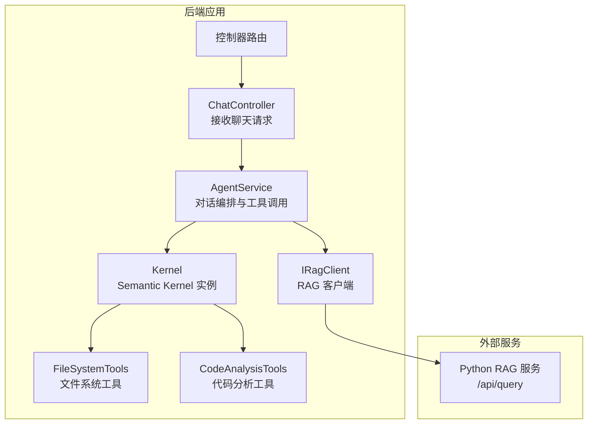
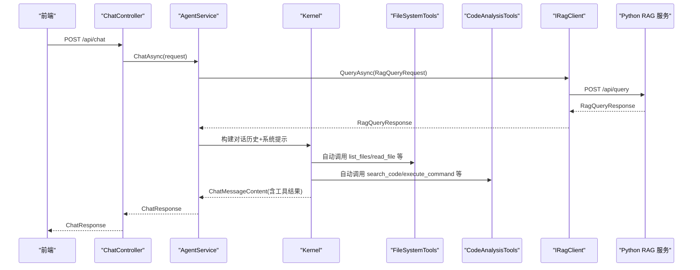
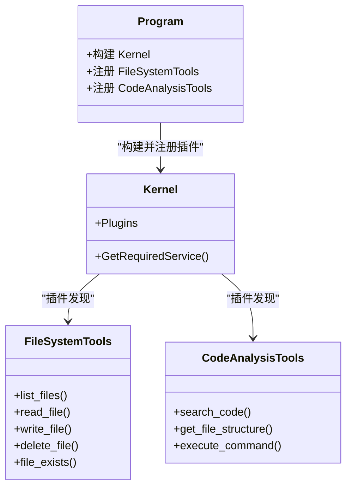
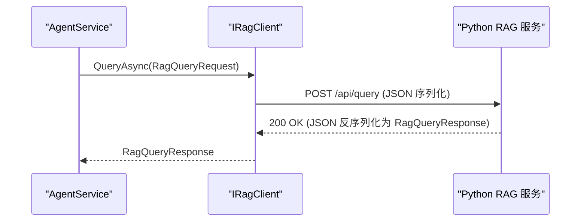
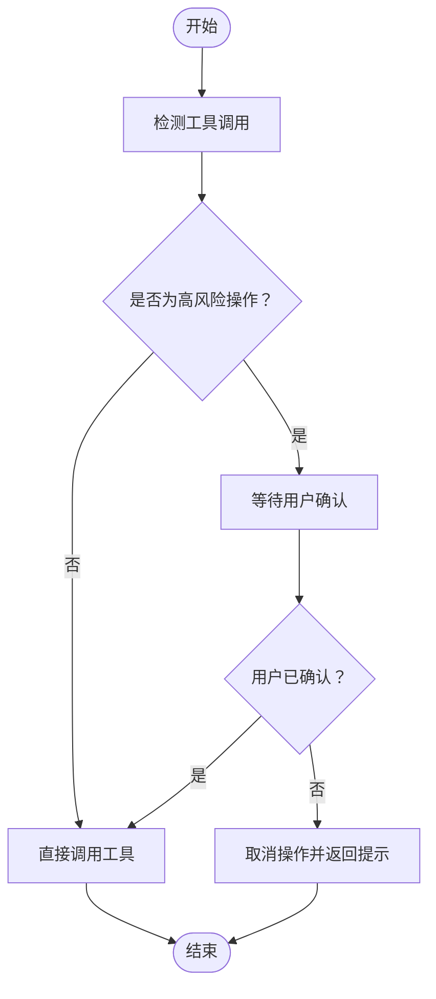
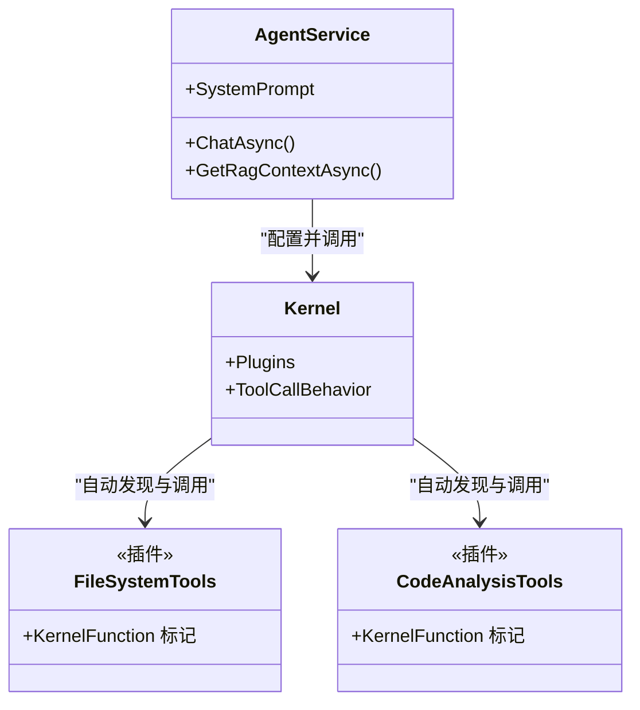
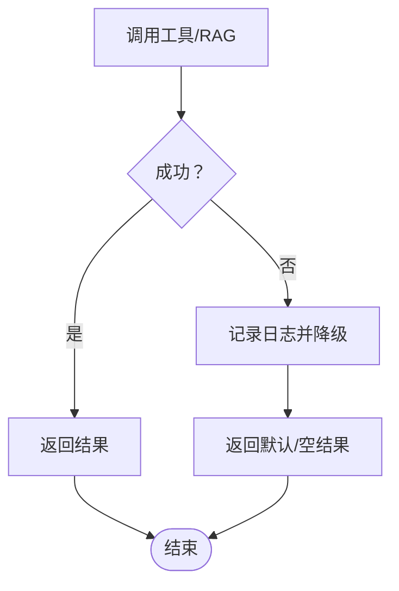
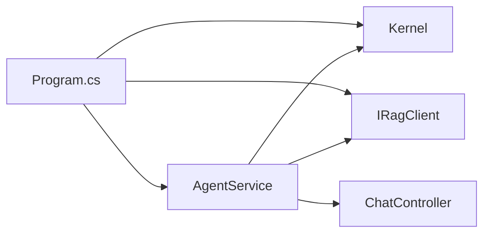

# 工具系统集成

<cite>
**本文引用的文件**
- [Program.cs](file://backend-agent/Program.cs)
- [IRagClient.cs](file://backend-agent/Services/IRagClient.cs)
- [AgentService.cs](file://backend-agent/Services/AgentService.cs)
- [IAgentService.cs](file://backend-agent/Services/IAgentService.cs)
- [AgentSettings.cs](file://backend-agent/Services/AgentSettings.cs)
- [ChatController.cs](file://backend-agent/Controllers/ChatController.cs)
- [ChatModels.cs](file://backend-agent/Models/ChatModels.cs)
- [FileSystemTools.cs](file://backend-agent/Tools/FileSystemTools.cs)
- [CodeAnalysisTools.cs](file://backend-agent/Tools/CodeAnalysisTools.cs)
- [ALAgent.Agent.csproj](file://backend-agent/ALAgent.Agent.csproj)
</cite>

## 目录
1. [简介](#简介)
2. [项目结构](#项目结构)
3. [核心组件](#核心组件)
4. [架构总览](#架构总览)
5. [详细组件分析](#详细组件分析)
6. [依赖关系分析](#依赖关系分析)
7. [性能考量](#性能考量)
8. [故障排查指南](#故障排查指南)
9. [结论](#结论)
10. [附录](#附录)

## 简介
本文件面向推理引擎的工具集成架构，重点阐述以下内容：
- Semantic Kernel 如何通过依赖注入发现并自动调用 FileSystemTools 与 CodeAnalysisTools 的功能（基于插件注册与函数调用行为）。
- IRagClient 接口如何封装与 Python RAG 服务的 HTTP 通信，包括请求体序列化与响应反序列化。
- 工具调用的安全审批机制设计，尤其是写操作与命令执行的用户确认流程。
- 工具注册与发现机制的技术细节，以及工具元数据在提示工程中的作用。
- 工具调用失败的降级策略与重试机制。

## 项目结构
后端采用 ASP.NET Core 架构，核心由控制器、服务层、模型与工具组成；推理引擎使用 Semantic Kernel 进行函数调用与对话编排；RAG 客户端通过 Refit 与 Python 后端通信。

图表来源
- [Program.cs](file://backend-agent/Program.cs#L32-L49)
- [AgentService.cs](file://backend-agent/Services/AgentService.cs#L46-L117)
- [IRagClient.cs](file://backend-agent/Services/IRagClient.cs#L6-L13)
- [ChatController.cs](file://backend-agent/Controllers/ChatController.cs#L20-L44)

章节来源
- [Program.cs](file://backend-agent/Program.cs#L1-L67)
- [ChatController.cs](file://backend-agent/Controllers/ChatController.cs#L1-L45)

## 核心组件
- 依赖注入与内核构建：在启动时注册 Kernel，并通过插件注册方式加载工具类，使工具方法成为可被函数调用的插件。
- 服务层：AgentService 负责组织系统提示、历史消息、RAG 上下文，并驱动 Semantic Kernel 执行对话与工具调用。
- 控制器：ChatController 将前端请求转发给 AgentService 并返回标准化响应。
- RAG 客户端：IRagClient 使用 Refit 声明式接口，自动进行请求体序列化与响应反序列化。
- 工具集：FileSystemTools 提供读写文件、列出目录等能力；CodeAnalysisTools 提供搜索代码、分析文件结构、执行命令等能力。

章节来源
- [Program.cs](file://backend-agent/Program.cs#L32-L49)
- [AgentService.cs](file://backend-agent/Services/AgentService.cs#L46-L117)
- [ChatController.cs](file://backend-agent/Controllers/ChatController.cs#L20-L44)
- [IRagClient.cs](file://backend-agent/Services/IRagClient.cs#L6-L13)
- [FileSystemTools.cs](file://backend-agent/Tools/FileSystemTools.cs#L1-L151)
- [CodeAnalysisTools.cs](file://backend-agent/Tools/CodeAnalysisTools.cs#L1-L252)

## 架构总览
推理引擎通过 Semantic Kernel 的插件机制实现“工具即函数”，AgentService 在对话中根据需要自动调用这些工具。RAG 客户端负责从 Python RAG 服务检索相关代码片段，作为上下文增强对话质量。

图表来源
- [ChatController.cs](file://backend-agent/Controllers/ChatController.cs#L20-L44)
- [AgentService.cs](file://backend-agent/Services/AgentService.cs#L46-L117)
- [IRagClient.cs](file://backend-agent/Services/IRagClient.cs#L6-L13)
- [FileSystemTools.cs](file://backend-agent/Tools/FileSystemTools.cs#L1-L151)
- [CodeAnalysisTools.cs](file://backend-agent/Tools/CodeAnalysisTools.cs#L1-L252)

## 详细组件分析

### 依赖注入与工具发现（Semantic Kernel 插件）
- 内核构建：在启动时创建 KernelBuilder 并注册 OpenAI 模型，随后通过插件注册将工具类暴露为插件。
- 插件注册：使用 AddFromType 将 FileSystemTools 与 CodeAnalysisTools 注册为插件，工具类上的函数标记使其成为可调用的函数。
- 函数调用行为：AgentService 配置 ToolCallBehavior 为 AutoInvokeKernelFunctions，使 Kernel 自动解析并调用工具函数，无需手动提取工具调用。

图表来源
- [Program.cs](file://backend-agent/Program.cs#L32-L49)
- [AgentService.cs](file://backend-agent/Services/AgentService.cs#L82-L100)
- [FileSystemTools.cs](file://backend-agent/Tools/FileSystemTools.cs#L1-L151)
- [CodeAnalysisTools.cs](file://backend-agent/Tools/CodeAnalysisTools.cs#L1-L252)

章节来源
- [Program.cs](file://backend-agent/Program.cs#L32-L49)
- [AgentService.cs](file://backend-agent/Services/AgentService.cs#L82-L100)

### IRagClient 接口与 Python RAG 通信
- 接口定义：IRagClient 使用 Refit 的特性标注 HTTP 方法与路径，自动进行请求体序列化与响应反序列化。
- 请求体：RagQueryRequest 包含查询语句、工作区路径与 TopK 参数，随请求体发送。
- 响应体：RagQueryResponse 包含 CodeChunk 列表，包含文件路径、起止行号与内容片段。
- 客户端配置：在 Program 中通过 AddRefitClient 注册客户端，设置基础地址与超时时间。

图表来源
- [IRagClient.cs](file://backend-agent/Services/IRagClient.cs#L6-L13)
- [AgentService.cs](file://backend-agent/Services/AgentService.cs#L119-L145)
- [ChatModels.cs](file://backend-agent/Models/ChatModels.cs#L32-L49)
- [Program.cs](file://backend-agent/Program.cs#L22-L31)

章节来源
- [IRagClient.cs](file://backend-agent/Services/IRagClient.cs#L6-L13)
- [AgentService.cs](file://backend-agent/Services/AgentService.cs#L119-L145)
- [ChatModels.cs](file://backend-agent/Models/ChatModels.cs#L32-L49)
- [Program.cs](file://backend-agent/Program.cs#L22-L31)

### 工具调用的安全审批机制
- 设计要点：工具方法注释明确标示“需要用户批准”的写操作与命令执行，用于提示前端或上层逻辑触发审批流程。
- 实现建议：当前代码未直接实现审批拦截逻辑，可在 AgentService 或工具调用前增加审批检查与确认流程，例如：
  - 对 write_file、delete_file、execute_command 设置 RequiresApproval 标记。
  - 在工具调用前弹出确认对话框或等待用户确认。
  - 若用户拒绝，则中断工具调用并返回安全提示。
- 工具元数据：工具名称、描述与参数描述由函数标记提供，有助于在提示工程中精确描述工具能力。

图表来源
- [FileSystemTools.cs](file://backend-agent/Tools/FileSystemTools.cs#L78-L100)
- [CodeAnalysisTools.cs](file://backend-agent/Tools/CodeAnalysisTools.cs#L109-L163)
- [ChatModels.cs](file://backend-agent/Models/ChatModels.cs#L25-L31)

章节来源
- [FileSystemTools.cs](file://backend-agent/Tools/FileSystemTools.cs#L78-L100)
- [CodeAnalysisTools.cs](file://backend-agent/Tools/CodeAnalysisTools.cs#L109-L163)
- [ChatModels.cs](file://backend-agent/Models/ChatModels.cs#L25-L31)

### 工具注册与发现机制的技术细节
- 插件注册：通过 AddFromType 将工具类注册为插件，Kernel 在运行时扫描并发现函数标记，生成可用函数列表。
- 函数标记：工具方法使用函数标记声明名称与描述，Kernel 在函数调用时读取这些元数据。
- 提示工程中的作用：AgentService 的系统提示中列举了可用工具名称与用途，帮助模型选择合适的工具与参数。

图表来源
- [AgentService.cs](file://backend-agent/Services/AgentService.cs#L16-L33)
- [Program.cs](file://backend-agent/Program.cs#L44-L46)
- [FileSystemTools.cs](file://backend-agent/Tools/FileSystemTools.cs#L1-L151)
- [CodeAnalysisTools.cs](file://backend-agent/Tools/CodeAnalysisTools.cs#L1-L252)

章节来源
- [AgentService.cs](file://backend-agent/Services/AgentService.cs#L16-L33)
- [Program.cs](file://backend-agent/Program.cs#L44-L46)

### 工具调用失败的降级策略与重试机制
- RAG 失败降级：AgentService 在获取 RAG 上下文时捕获异常并记录警告日志，返回空上下文，保证主流程继续执行。
- 工具调用失败：FileSystemTools 与 CodeAnalysisTools 在各方法内部捕获异常并返回错误信息字符串，避免异常传播到上层。
- 重试建议：当前未实现显式的重试逻辑。可在 IRagClient 或工具方法中引入指数退避重试，结合超时控制与最大重试次数，提升鲁棒性。

图表来源
- [AgentService.cs](file://backend-agent/Services/AgentService.cs#L119-L145)
- [FileSystemTools.cs](file://backend-agent/Tools/FileSystemTools.cs#L15-L49)
- [CodeAnalysisTools.cs](file://backend-agent/Tools/CodeAnalysisTools.cs#L17-L77)

章节来源
- [AgentService.cs](file://backend-agent/Services/AgentService.cs#L119-L145)
- [FileSystemTools.cs](file://backend-agent/Tools/FileSystemTools.cs#L15-L49)
- [CodeAnalysisTools.cs](file://backend-agent/Tools/CodeAnalysisTools.cs#L17-L77)

## 依赖关系分析
- 组件耦合：AgentService 依赖 Kernel、IRagClient 与配置；Kernel 依赖工具插件；控制器依赖服务层。
- 外部依赖：Semantic Kernel 与 OpenAI 连接器用于对话与函数调用；Refit 用于 HTTP 客户端；ASP.NET Core 用于 Web 框架。
- 依赖注入：Program 中集中注册服务与客户端，确保生命周期与作用域正确。

图表来源
- [Program.cs](file://backend-agent/Program.cs#L1-L67)
- [ALAgent.Agent.csproj](file://backend-agent/ALAgent.Agent.csproj#L10-L15)
- [AgentService.cs](file://backend-agent/Services/AgentService.cs#L46-L117)
- [ChatController.cs](file://backend-agent/Controllers/ChatController.cs#L20-L44)

章节来源
- [Program.cs](file://backend-agent/Program.cs#L1-L67)
- [ALAgent.Agent.csproj](file://backend-agent/ALAgent.Agent.csproj#L10-L15)

## 性能考量
- 工具调用限制：文件读取设置了大小上限，防止大文件导致内存压力；目录枚举与文件搜索设置了最大结果数量，避免过多输出。
- RAG 查询：TopK 参数限制返回片段数量，减少上下文长度与网络传输开销。
- 超时控制：RAG 客户端设置了较短超时，避免阻塞请求处理。
- 建议优化：对频繁调用的工具增加缓存；对命令执行增加超时与资源限制；对 RAG 查询增加并发控制与重试。

章节来源
- [FileSystemTools.cs](file://backend-agent/Tools/FileSystemTools.cs#L63-L68)
- [CodeAnalysisTools.cs](file://backend-agent/Tools/CodeAnalysisTools.cs#L24-L34)
- [Program.cs](file://backend-agent/Program.cs#L22-L31)
- [AgentSettings.cs](file://backend-agent/Services/AgentSettings.cs#L1-L11)

## 故障排查指南
- RAG 服务不可达：检查 RAG 地址配置与网络连通性；查看健康检查端点；确认请求超时设置合理。
- 工具调用异常：查看工具方法返回的错误信息字符串；确认输入参数（路径、正则表达式等）合法；检查权限与文件系统状态。
- 对话无工具调用：确认系统提示中列出的工具名称与模型支持情况；检查 ToolCallBehavior 是否启用自动调用。
- 日志定位：控制器与服务层均记录请求与异常信息，便于快速定位问题。

章节来源
- [ChatController.cs](file://backend-agent/Controllers/ChatController.cs#L20-L44)
- [AgentService.cs](file://backend-agent/Services/AgentService.cs#L119-L145)
- [FileSystemTools.cs](file://backend-agent/Tools/FileSystemTools.cs#L15-L49)
- [CodeAnalysisTools.cs](file://backend-agent/Tools/CodeAnalysisTools.cs#L17-L77)

## 结论
该系统以 Semantic Kernel 为核心，通过插件机制将文件系统与代码分析工具无缝集成至对话流程；通过 IRagClient 与 Python RAG 服务实现上下文增强；在安全方面以“需要用户批准”的标注提示审批流程的存在。当前实现具备良好的扩展性与可维护性，建议后续补充审批拦截与重试机制，进一步提升安全性与稳定性。

## 附录
- 关键配置项：模型 ID、API 密钥、RAG 服务地址、最大 Token 数、温度等。
- 数据模型：聊天请求/响应、对话消息、工具调用信息、RAG 查询与响应、代码片段。

章节来源
- [AgentSettings.cs](file://backend-agent/Services/AgentSettings.cs#L1-L11)
- [ChatModels.cs](file://backend-agent/Models/ChatModels.cs#L1-L50)