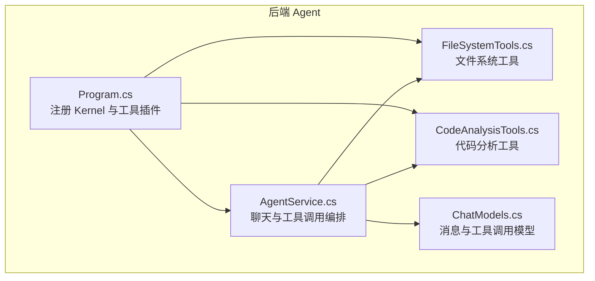
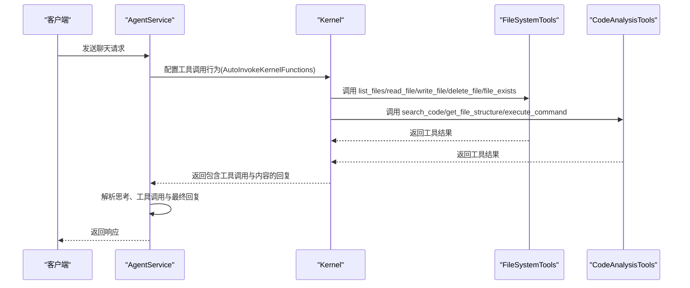
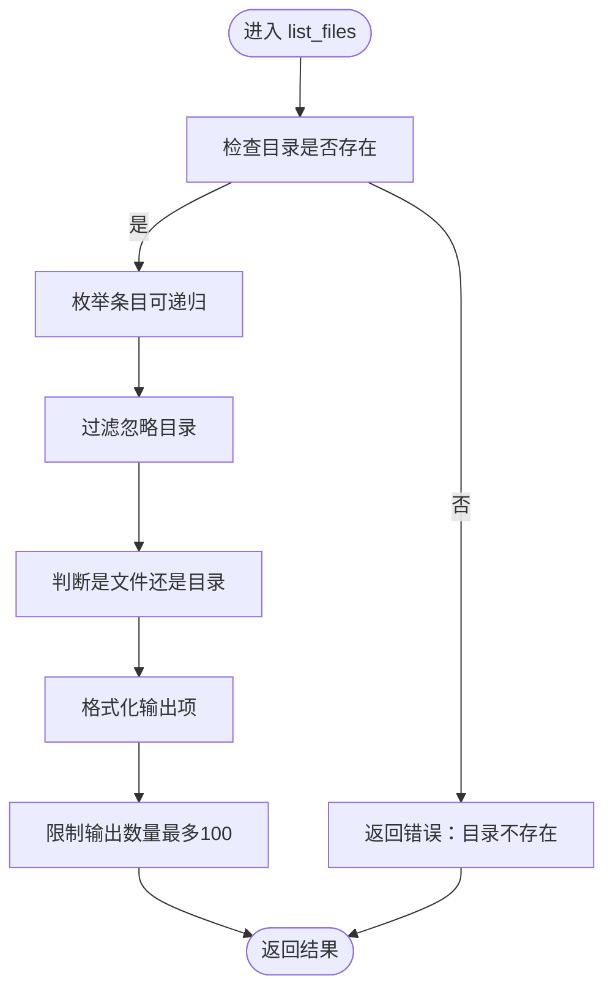
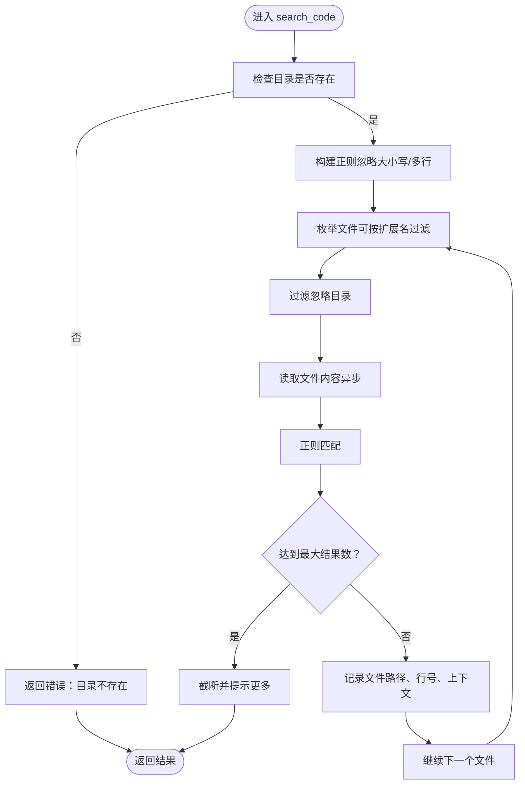
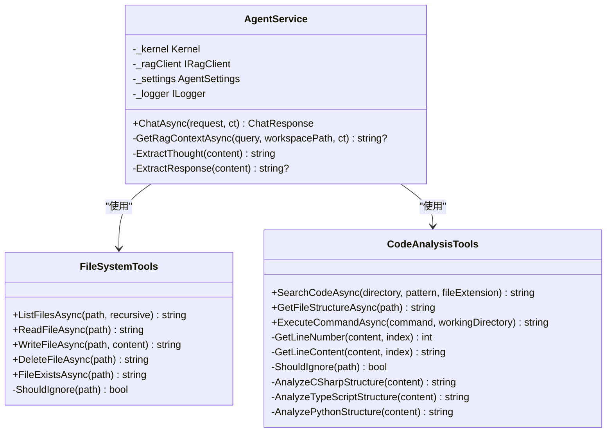
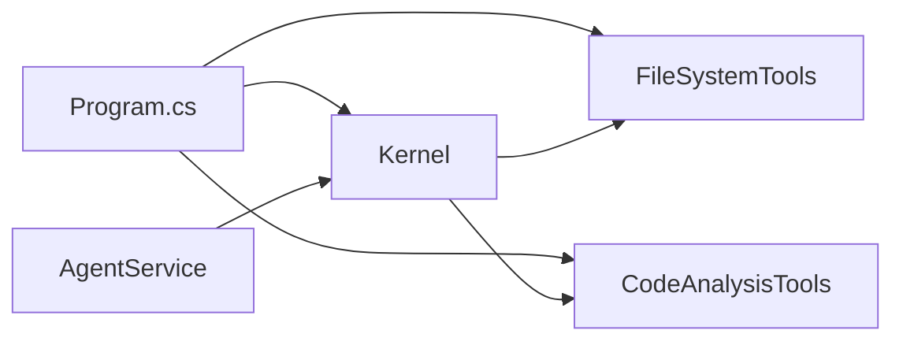
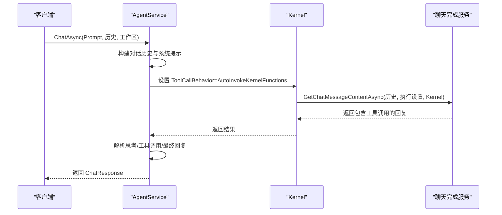
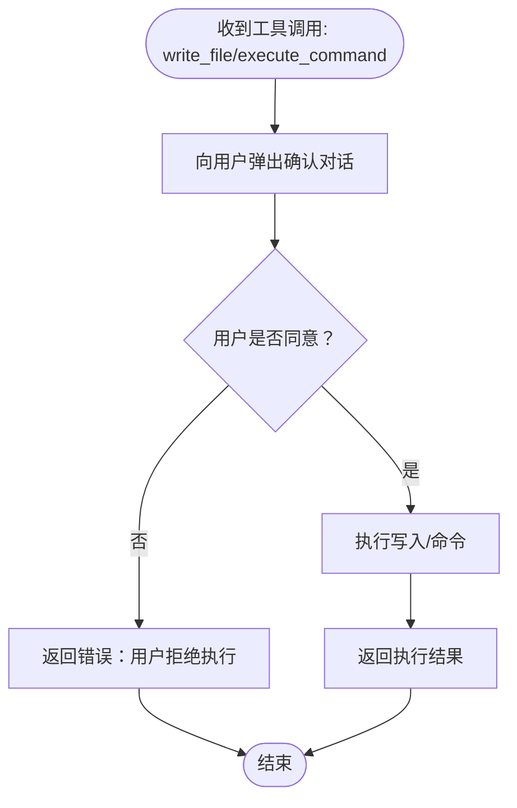

# 本地工具集成

<cite>
**本文引用的文件**
- [Program.cs](file://backend-agent/Program.cs)
- [AgentService.cs](file://backend-agent/Services/AgentService.cs)
- [FileSystemTools.cs](file://backend-agent/Tools/FileSystemTools.cs)
- [CodeAnalysisTools.cs](file://backend-agent/Tools/CodeAnalysisTools.cs)
- [ChatModels.cs](file://backend-agent/Models/ChatModels.cs)
</cite>

## 目录
1. [简介](#简介)
2. [项目结构](#项目结构)
3. [核心组件](#核心组件)
4. [架构总览](#架构总览)
5. [详细组件分析](#详细组件分析)
6. [依赖关系分析](#依赖关系分析)
7. [性能与安全考量](#性能与安全考量)
8. [故障排查指南](#故障排查指南)
9. [结论](#结论)
10. [附录：工具调用示例与序列图](#附录工具调用示例与序列图)

## 简介
本文件系统化文档化了本地工具类的实现机制，重点覆盖以下方面：
- FileSystemTools 中 list_files、read_file、write_file、delete_file、file_exists 等方法如何通过 Semantic Kernel 的 KernelFunction 属性暴露为可调用工具，并说明参数描述与错误处理策略。
- CodeAnalysisTools 中 search_code 与 get_file_structure 的功能实现，包括正则表达式搜索逻辑与多语言（C#、TypeScript、Python）代码结构分析的技术细节。
- 工具方法中的安全限制：文件大小限制（1MB）、忽略特定目录（node_modules/.git 等）、跨平台路径处理。
- 工具类通过依赖注入注册到 Kernel 容器并在 AgentService 中被自动发现与调用。
- 实际调用流程示例与写操作及命令执行需要用户确认的安全设计。

## 项目结构
后端 Agent 服务采用 ASP.NET Core + Semantic Kernel 架构，工具类以插件形式注册到 Kernel，AgentService 负责构建对话历史并触发函数调用。

图表来源
- [Program.cs](file://backend-agent/Program.cs#L32-L49)
- [AgentService.cs](file://backend-agent/Services/AgentService.cs#L16-L31)
- [FileSystemTools.cs](file://backend-agent/Tools/FileSystemTools.cs#L1-L151)
- [CodeAnalysisTools.cs](file://backend-agent/Tools/CodeAnalysisTools.cs#L1-L252)
- [ChatModels.cs](file://backend-agent/Models/ChatModels.cs#L1-L50)

章节来源
- [Program.cs](file://backend-agent/Program.cs#L32-L49)
- [AgentService.cs](file://backend-agent/Services/AgentService.cs#L16-L31)

## 核心组件
- FileSystemTools：提供文件与目录列举、读取、写入、删除、存在性检查等能力；通过 KernelFunction 暴露为工具。
- CodeAnalysisTools：提供代码正则搜索与多语言结构分析（C#/TypeScript/Python），并通过 KernelFunction 暴露为工具。
- AgentService：负责将系统提示、RAG 上下文、对话历史与工具结果整合，配置 Semantic Kernel 的工具调用行为，并返回响应。

章节来源
- [FileSystemTools.cs](file://backend-agent/Tools/FileSystemTools.cs#L1-L151)
- [CodeAnalysisTools.cs](file://backend-agent/Tools/CodeAnalysisTools.cs#L1-L252)
- [AgentService.cs](file://backend-agent/Services/AgentService.cs#L16-L31)

## 架构总览
工具类通过 AddFromType 注册到 Kernel 插件集合，AgentService 使用 AutoInvokeKernelFunctions 自动调用工具，工具返回结果作为系统消息回填至对话历史，驱动后续推理与输出。

图表来源
- [Program.cs](file://backend-agent/Program.cs#L44-L46)
- [AgentService.cs](file://backend-agent/Services/AgentService.cs#L82-L109)
- [FileSystemTools.cs](file://backend-agent/Tools/FileSystemTools.cs#L1-L151)
- [CodeAnalysisTools.cs](file://backend-agent/Tools/CodeAnalysisTools.cs#L1-L252)

## 详细组件分析

### FileSystemTools 组件分析
- KernelFunction 暴露的工具名称与参数描述
  - list_files：列出目录条目，支持递归；参数含路径与是否递归。
  - read_file：读取文件内容，带 1MB 大小限制。
  - write_file：写入文件内容，要求用户确认（见安全设计）。
  - delete_file：删除文件，要求用户确认（见安全设计）。
  - file_exists：检查路径是否存在（文件或目录）。
- 错误处理策略
  - 目录/文件不存在时返回明确错误信息。
  - 文件过大（>1MB）时拒绝读取。
  - 异常捕获统一返回错误字符串。
- 安全与过滤
  - 忽略常见开发目录与缓存目录（如 node_modules、.git、bin、obj、.vscode 等）。
  - 使用相对路径与跨平台路径处理（GetRelativePath、Path.GetExtension）。
- 性能与限制
  - 列表输出最多前 100 条，避免过长输出。
  - 读取使用异步 I/O，写入使用异步写入。

图表来源
- [FileSystemTools.cs](file://backend-agent/Tools/FileSystemTools.cs#L9-L45)

章节来源
- [FileSystemTools.cs](file://backend-agent/Tools/FileSystemTools.cs#L9-L45)
- [FileSystemTools.cs](file://backend-agent/Tools/FileSystemTools.cs#L52-L77)
- [FileSystemTools.cs](file://backend-agent/Tools/FileSystemTools.cs#L79-L121)
- [FileSystemTools.cs](file://backend-agent/Tools/FileSystemTools.cs#L123-L151)

### CodeAnalysisTools 组件分析
- search_code：在指定目录内按扩展名过滤并使用正则匹配，逐文件读取内容进行匹配，限制最大返回条数，记录行号与上下文。
- get_file_structure：根据文件扩展名选择对应语言解析器，基于正则提取命名空间/类/接口/函数等结构信息。
- execute_command：跨平台执行命令（Windows 使用 powershell，Linux/macOS 使用 bash），收集标准输出与错误输出，返回退出码与内容。
- 错误处理与过滤
  - 目录不存在、文件不存在时返回错误。
  - 无法读取的文件跳过处理。
  - 异常捕获统一返回错误字符串。
  - 忽略常见开发目录与缓存目录（如 node_modules、.git、bin、obj、.vscode 等）。
- 性能与限制
  - 匹配结果上限控制（最多 20 条）。
  - 读取使用异步 I/O。

图表来源
- [CodeAnalysisTools.cs](file://backend-agent/Tools/CodeAnalysisTools.cs#L10-L77)

章节来源
- [CodeAnalysisTools.cs](file://backend-agent/Tools/CodeAnalysisTools.cs#L10-L77)
- [CodeAnalysisTools.cs](file://backend-agent/Tools/CodeAnalysisTools.cs#L80-L107)
- [CodeAnalysisTools.cs](file://backend-agent/Tools/CodeAnalysisTools.cs#L109-L163)
- [CodeAnalysisTools.cs](file://backend-agent/Tools/CodeAnalysisTools.cs#L190-L250)

### 类关系与职责

图表来源
- [FileSystemTools.cs](file://backend-agent/Tools/FileSystemTools.cs#L1-L151)
- [CodeAnalysisTools.cs](file://backend-agent/Tools/CodeAnalysisTools.cs#L1-L252)
- [AgentService.cs](file://backend-agent/Services/AgentService.cs#L16-L31)

## 依赖关系分析
- 依赖注入与注册
  - 在 Program.cs 中创建 Kernel 并通过 Plugins.AddFromType 将 FileSystemTools 与 CodeAnalysisTools 注册为插件。
  - AgentService 通过构造函数注入 Kernel，用于后续工具调用。
- 工具调用行为
  - AgentService 在执行聊天时设置 ToolCallBehavior 为 AutoInvokeKernelFunctions，使 Kernel 自动调用已注册工具并回传结果。

图表来源
- [Program.cs](file://backend-agent/Program.cs#L32-L49)
- [AgentService.cs](file://backend-agent/Services/AgentService.cs#L82-L109)

章节来源
- [Program.cs](file://backend-agent/Program.cs#L32-L49)
- [AgentService.cs](file://backend-agent/Services/AgentService.cs#L82-L109)

## 性能与安全考量
- 性能
  - 异步 I/O：读取与写入均使用异步 API，避免阻塞。
  - 结果上限：列表输出限制为前 100 条；搜索结果限制为前 20 条，防止大输出影响性能与成本。
  - 过滤策略：忽略常见大型或无关目录，减少遍历与读取开销。
- 安全
  - 文件大小限制：read_file 对超过 1MB 的文件直接拒绝读取。
  - 写操作与命令执行需用户确认：工具方法在描述中标注“需要用户批准”，前端在执行前会弹出确认流程，未批准则不执行。
  - 跨平台命令执行：根据操作系统选择合适的 Shell，避免直接使用系统默认 Shell，降低风险。
  - 路径处理：使用相对路径与跨平台路径 API，避免路径拼接错误与越权访问。
- 可靠性
  - 异常捕获：所有工具方法均在 try-catch 中返回错误字符串，避免异常传播。
  - 忽略不可读文件：搜索过程中对无法读取的文件进行跳过，保证稳定性。

章节来源
- [FileSystemTools.cs](file://backend-agent/Tools/FileSystemTools.cs#L52-L77)
- [CodeAnalysisTools.cs](file://backend-agent/Tools/CodeAnalysisTools.cs#L10-L77)
- [CodeAnalysisTools.cs](file://backend-agent/Tools/CodeAnalysisTools.cs#L109-L163)

## 故障排查指南
- 常见问题与定位
  - 工具未被识别：确认 Program.cs 中是否正确调用 Plugins.AddFromType 注册工具类。
  - 工具调用未触发：检查 AgentService 的 ToolCallBehavior 是否设置为 AutoInvokeKernelFunctions。
  - 目录/文件不存在：工具方法会返回明确错误信息，检查输入路径与权限。
  - 文件过大：read_file 对超过 1MB 的文件拒绝读取，建议拆分或压缩。
  - 命令执行失败：查看返回的退出码与错误输出，确认命令合法性与工作目录。
- 日志与诊断
  - AgentService 在处理异常时记录错误日志，便于定位问题。
  - 工具方法统一返回错误字符串，便于前端展示与用户理解。

章节来源
- [Program.cs](file://backend-agent/Program.cs#L44-L46)
- [AgentService.cs](file://backend-agent/Services/AgentService.cs#L112-L116)
- [FileSystemTools.cs](file://backend-agent/Tools/FileSystemTools.cs#L18-L20)
- [CodeAnalysisTools.cs](file://backend-agent/Tools/CodeAnalysisTools.cs#L18-L21)

## 结论
本地工具类通过 Semantic Kernel 的 KernelFunction 机制无缝集成到 AgentService 的函数调用流程中。FileSystemTools 与 CodeAnalysisTools 分别覆盖文件系统操作与代码分析场景，具备完善的错误处理、安全限制与跨平台适配。依赖注入与自动工具调用的设计使得工具可被自动发现与调用，结合用户确认机制，确保了安全性与可控性。

## 附录：工具调用示例与序列图

### 示例：AgentService 聊天流程（含工具调用）
- 步骤
  - 构建系统提示与 RAG 上下文。
  - 将历史消息与当前用户消息加入对话历史。
  - 配置 ToolCallBehavior 为 AutoInvokeKernelFunctions。
  - 调用聊天完成服务，等待模型生成包含工具调用的回复。
  - 解析思考、工具调用与最终回复。
- 关键点
  - 工具调用由 Kernel 自动执行，AgentService 仅负责编排与结果解析。

图表来源
- [AgentService.cs](file://backend-agent/Services/AgentService.cs#L46-L111)

章节来源
- [AgentService.cs](file://backend-agent/Services/AgentService.cs#L46-L111)

### 示例：写文件与命令执行的用户确认流程
- 设计要点
  - 工具方法描述中标注“需要用户批准”。
  - 前端在收到工具调用后弹出确认对话，用户同意后再执行。
  - 用户拒绝时返回错误信息，不执行写入或命令。
- 流程示意

图表来源
- [CodeAnalysisTools.cs](file://backend-agent/Tools/CodeAnalysisTools.cs#L109-L111)
- [FileSystemTools.cs](file://backend-agent/Tools/FileSystemTools.cs#L79-L81)

章节来源
- [CodeAnalysisTools.cs](file://backend-agent/Tools/CodeAnalysisTools.cs#L109-L111)
- [FileSystemTools.cs](file://backend-agent/Tools/FileSystemTools.cs#L79-L81)