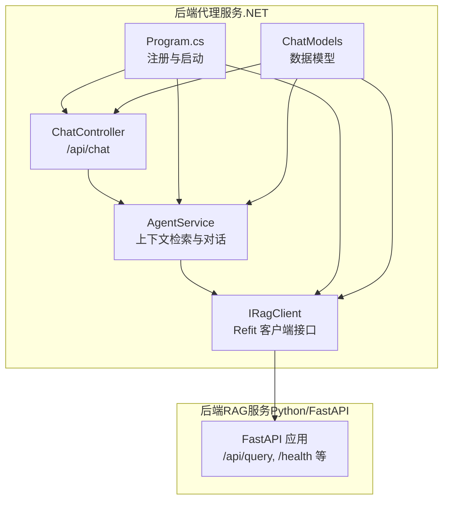
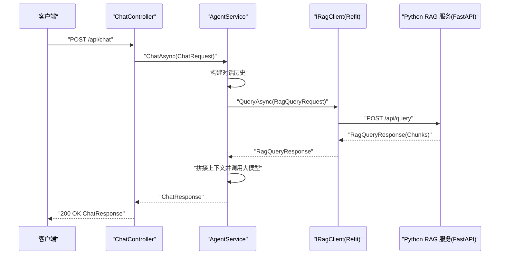
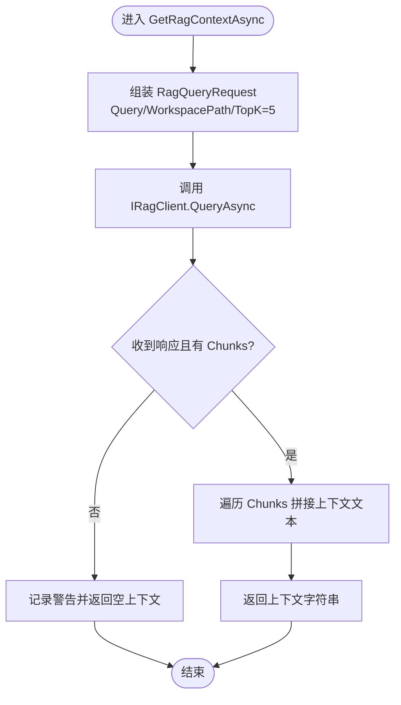
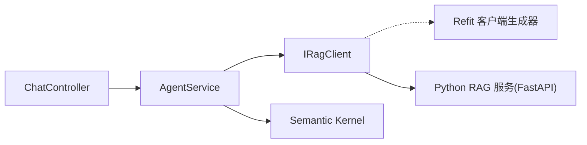

# 远程服务集成

<cite>
**本文引用的文件**
- [IRagClient.cs](file://backend-agent/Services/IRagClient.cs)
- [AgentService.cs](file://backend-agent/Services/AgentService.cs)
- [ChatController.cs](file://backend-agent/Controllers/ChatController.cs)
- [Program.cs](file://backend-agent/Program.cs)
- [ChatModels.cs](file://backend-agent/Models/ChatModels.cs)
- [IAgentService.cs](file://backend-agent/Services/IAgentService.cs)
- [AgentSettings.cs](file://backend-agent/Services/AgentSettings.cs)
- [ALAgent.Agent.csproj](file://backend-agent/ALAgent.Agent.csproj)
- [appsettings.json](file://backend-agent/appsettings.json)
- [appsettings.Development.json](file://backend-agent/appsettings.Development.json)
- [main.py](file://backend-rag/app/main.py)
</cite>

## 目录
1. [引言](#引言)
2. [项目结构](#项目结构)
3. [核心组件](#核心组件)
4. [架构总览](#架构总览)
5. [详细组件分析](#详细组件分析)
6. [依赖关系分析](#依赖关系分析)
7. [性能考量](#性能考量)
8. [故障排查指南](#故障排查指南)
9. [结论](#结论)
10. [附录](#附录)

## 引言
本文件面向需要理解“Python RAG 服务远程集成机制”的读者，重点说明以下内容：
- IRagClient 接口如何通过 Refit 定义 /api/query（POST）与 /health（GET）两个端点契约；
- AgentService 如何通过依赖注入获取 IRagClient 实例，并在 GetRagContextAsync 中调用 QueryAsync 进行上下文检索；
- RagQueryRequest 与 RagQueryResponse 数据模型在跨服务通信中的职责；
- 错误处理策略：RAG 服务不可用时的日志警告与降级处理；
- 超时控制、异步调用模式与服务间通信安全考虑；
- 实际请求/响应示例与 TopK 参数在检索中的应用。

## 项目结构
后端代理服务（backend-agent）负责对外提供聊天接口，并在内部通过 Refit 客户端访问 Python RAG 服务（backend-rag）。关键文件与职责如下：
- 控制器层：ChatController 提供 /api/chat 入口，接收用户请求并委派给 AgentService。
- 服务层：AgentService 负责构建对话历史、调用 RAG 上下文检索、与大模型交互并返回结果。
- 客户端接口：IRagClient 使用 Refit 声明式地定义 RAG 服务的 HTTP 端点契约。
- 模型层：ChatModels 定义聊天与 RAG 查询的数据模型。
- 启动配置：Program.cs 注册 Refit 客户端、Semantic Kernel、CORS 与健康检查端点。
- 配置：appsettings.json 提供 RAG 服务地址、模型参数等运行时配置。

图表来源
- [ChatController.cs](file://backend-agent/Controllers/ChatController.cs#L1-L45)
- [AgentService.cs](file://backend-agent/Services/AgentService.cs#L1-L180)
- [IRagClient.cs](file://backend-agent/Services/IRagClient.cs#L1-L14)
- [Program.cs](file://backend-agent/Program.cs#L1-L67)
- [ChatModels.cs](file://backend-agent/Models/ChatModels.cs#L1-L50)
- [main.py](file://backend-rag/app/main.py#L55-L90)

章节来源
- [Program.cs](file://backend-agent/Program.cs#L1-L67)
- [ChatController.cs](file://backend-agent/Controllers/ChatController.cs#L1-L45)
- [AgentService.cs](file://backend-agent/Services/AgentService.cs#L1-L180)
- [IRagClient.cs](file://backend-agent/Services/IRagClient.cs#L1-L14)
- [ChatModels.cs](file://backend-agent/Models/ChatModels.cs#L1-L50)

## 核心组件
- IRagClient（Refit 客户端接口）
  - 定义 /api/query 的 POST 请求，请求体为 RagQueryRequest，响应为 RagQueryResponse。
  - 定义 /health 的 GET 请求，返回对象类型用于健康检查。
- AgentService（聊天与上下文检索服务）
  - 通过构造函数注入 IRagClient、Kernel、AgentSettings 与日志器。
  - 在 GetRagContextAsync 中调用 QueryAsync 获取代码片段上下文；若无结果或异常则记录警告并降级为空上下文。
- ChatController（HTTP 入口）
  - 提供 /api/chat，接收 ChatRequest 并返回 ChatResponse；对取消与异常进行统一处理。
- ChatModels（数据模型）
  - ChatRequest/ChatResponse：聊天请求与响应结构。
  - RagQueryRequest/RagQueryResponse：RAG 查询请求与响应结构。
  - CodeChunk：单个代码片段，包含内容、路径、行号范围、相似度分数与元数据。
- Program.cs（启动与配置）
  - 注册 Refit 客户端 IRagClient，设置 BaseAddress 与默认超时。
  - 注册 Semantic Kernel、工具插件与控制器。
  - 暴露 /health 健康检查端点。
- AgentSettings（运行时配置）
  - 包含 RAG 服务地址、模型 ID、最大 Token 数、温度等参数。

章节来源
- [IRagClient.cs](file://backend-agent/Services/IRagClient.cs#L1-L14)
- [AgentService.cs](file://backend-agent/Services/AgentService.cs#L1-L180)
- [ChatController.cs](file://backend-agent/Controllers/ChatController.cs#L1-L45)
- [ChatModels.cs](file://backend-agent/Models/ChatModels.cs#L1-L50)
- [Program.cs](file://backend-agent/Program.cs#L1-L67)
- [AgentSettings.cs](file://backend-agent/Services/AgentSettings.cs#L1-L11)

## 架构总览
后端代理服务通过 Refit 客户端向 Python RAG 服务发起 HTTP 请求，实现“语义检索+对话增强”的一体化能力。整体调用链路如下：

图表来源
- [ChatController.cs](file://backend-agent/Controllers/ChatController.cs#L1-L45)
- [AgentService.cs](file://backend-agent/Services/AgentService.cs#L1-L180)
- [IRagClient.cs](file://backend-agent/Services/IRagClient.cs#L1-L14)
- [main.py](file://backend-rag/app/main.py#L65-L90)

## 详细组件分析

### IRagClient 接口与端点契约
- /api/query（POST）
  - 请求体：RagQueryRequest（包含 Query、WorkspacePath、TopK）。
  - 响应体：RagQueryResponse（包含 Chunks 列表）。
  - 使用 Refit 的 Post 属性声明，自动序列化请求体并反序列化响应体。
- /health（GET）
  - 返回对象类型，用于健康检查。
  - Python 侧对应 FastAPI 的 /health，返回健康状态与存储连接信息。

章节来源
- [IRagClient.cs](file://backend-agent/Services/IRagClient.cs#L1-L14)
- [ChatModels.cs](file://backend-agent/Models/ChatModels.cs#L32-L50)
- [main.py](file://backend-rag/app/main.py#L55-L63)

### AgentService 的上下文检索流程
- 依赖注入
  - 通过构造函数注入 IRagClient、Kernel、AgentSettings 与日志器。
- GetRagContextAsync 流程
  - 组装 RagQueryRequest（默认 TopK=5），调用 QueryAsync。
  - 若返回 Chunks 为空，记录警告并返回空字符串（降级）。
  - 将 Chunks 拼接为系统提示，供后续对话使用。
- ChatAsync 主流程
  - 构建系统提示与对话历史。
  - 调用 GetRagContextAsync 获取上下文并加入系统消息。
  - 配置执行参数（MaxTokens、Temperature、工具调用行为）。
  - 通过 Semantic Kernel 的 ChatCompletionService 获取回复并解析 Thought/ToolCalls/Response。

图表来源
- [AgentService.cs](file://backend-agent/Services/AgentService.cs#L119-L145)
- [ChatModels.cs](file://backend-agent/Models/ChatModels.cs#L32-L50)

章节来源
- [AgentService.cs](file://backend-agent/Services/AgentService.cs#L1-L180)
- [ChatModels.cs](file://backend-agent/Models/ChatModels.cs#L1-L50)

### 数据模型与跨服务通信
- RagQueryRequest
  - 字段：Query、WorkspacePath、TopK（默认 5）。
  - 作用：作为 /api/query 的请求载荷，驱动 RAG 服务的语义检索。
- RagQueryResponse
  - 字段：Chunks（列表）。
  - 作用：承载检索到的代码片段集合。
- CodeChunk
  - 字段：Content、FilePath、StartLine、EndLine、Score、Metadata。
  - 作用：单条检索结果，包含片段内容、位置信息、相似度分数与可选元数据。
- ChatRequest/ChatResponse
  - 作用：前端与后端代理服务之间的聊天协议。

章节来源
- [ChatModels.cs](file://backend-agent/Models/ChatModels.cs#L1-L50)

### 错误处理与降级策略
- RAG 服务不可用或查询失败
  - AgentService 在 GetRagContextAsync 中捕获异常并记录警告日志，返回空上下文，确保主流程不中断。
- 控制器层
  - ChatController 对 OperationCanceledException 记录日志并返回 499；对其他异常记录错误并返回 500。
- 健康检查
  - 后端代理服务暴露 /health；Python RAG 服务暴露 /health，返回健康状态与存储连接信息。

章节来源
- [AgentService.cs](file://backend-agent/Services/AgentService.cs#L119-L145)
- [ChatController.cs](file://backend-agent/Controllers/ChatController.cs#L1-L45)
- [Program.cs](file://backend-agent/Program.cs#L63-L66)
- [main.py](file://backend-rag/app/main.py#L55-L63)

### 超时控制与异步调用模式
- 超时控制
  - Program.cs 中通过 ConfigureHttpClient 设置 HttpClient.Timeout 为 30 秒，避免长时间阻塞。
- 异步调用
  - IRagClient 所有方法均返回 Task/Task<T>，AgentService 与 ChatController 均采用 async/await 模式，保证高并发下的良好吞吐。
- 取消令牌
  - 所有方法均支持 CancellationToken，便于请求取消与资源释放。

章节来源
- [Program.cs](file://backend-agent/Program.cs#L22-L30)
- [IRagClient.cs](file://backend-agent/Services/IRagClient.cs#L1-L14)
- [AgentService.cs](file://backend-agent/Services/AgentService.cs#L1-L180)
- [ChatController.cs](file://backend-agent/Controllers/ChatController.cs#L1-L45)

### 服务间通信安全考虑
- CORS
  - 后端代理服务启用默认 CORS 策略，允许来自 http://localhost:* 与 vscode-webview:* 的请求，便于 VS Code 扩展访问。
- 认证与授权
  - 当前未见显式认证/授权逻辑；建议在生产环境为 /api/query 与 /api/chat 添加鉴权中间件或 API Key 校验。
- 网络边界
  - RAG 服务地址由配置项提供，默认指向本地 8000 端口；建议在容器化部署时通过环境变量或密钥管理服务注入。

章节来源
- [Program.cs](file://backend-agent/Program.cs#L11-L21)
- [appsettings.json](file://backend-agent/appsettings.json#L8-L16)
- [appsettings.Development.json](file://backend-agent/appsettings.Development.json#L8-L15)

### 实际请求/响应示例与 TopK 应用
- 请求示例（/api/query）
  - 方法：POST
  - 路径：/api/query
  - 请求体：RagQueryRequest
    - Query：检索关键词或问题
    - WorkspacePath：工作区路径
    - TopK：返回的片段数量（默认 5）
- 响应示例（/api/query）
  - 结构：RagQueryResponse
    - Chunks：CodeChunk 列表
      - Content：片段内容
      - FilePath：文件路径
      - StartLine/EndLine：行号范围
      - Score：相似度分数
      - Metadata：可选元数据
- TopK 参数
  - 在 AgentService 中默认设置为 5；Python 侧会优先使用请求中的 top_k，否则回退到配置的默认值。

章节来源
- [IRagClient.cs](file://backend-agent/Services/IRagClient.cs#L1-L14)
- [AgentService.cs](file://backend-agent/Services/AgentService.cs#L119-L145)
- [ChatModels.cs](file://backend-agent/Models/ChatModels.cs#L32-L50)
- [main.py](file://backend-rag/app/main.py#L65-L90)

## 依赖关系分析
- 组件耦合
  - AgentService 依赖 IRagClient 与 Semantic Kernel；IRagClient 由 Refit 生成的 HttpClient 实现。
  - ChatController 仅依赖 IAgentService，保持控制器薄层职责。
- 外部依赖
  - Refit：声明式 HTTP 客户端，简化契约定义与序列化。
  - Microsoft.SemanticKernel：大模型接入与工具调用。
  - FastAPI（Python RAG 服务）：提供 /api/query 与 /health 端点。

图表来源
- [ChatController.cs](file://backend-agent/Controllers/ChatController.cs#L1-L45)
- [AgentService.cs](file://backend-agent/Services/AgentService.cs#L1-L180)
- [IRagClient.cs](file://backend-agent/Services/IRagClient.cs#L1-L14)
- [Program.cs](file://backend-agent/Program.cs#L1-L67)
- [main.py](file://backend-rag/app/main.py#L55-L90)

章节来源
- [ALAgent.Agent.csproj](file://backend-agent/ALAgent.Agent.csproj#L1-L18)
- [Program.cs](file://backend-agent/Program.cs#L1-L67)

## 性能考量
- 超时与并发
  - 合理设置 HttpClient 超时，避免阻塞影响整体吞吐。
  - 使用 async/await 与非阻塞 I/O，提升并发处理能力。
- TopK 与检索成本
  - TopK 越大，检索与拼接上下文的成本越高；默认 5 已在召回质量与性能间取得平衡。
- 缓存与降级
  - 当前未实现 RAG 结果缓存；可在 AgentService 层引入基于 Query/WorkspacePath 的缓存以减少重复检索。
  - 已具备降级策略：当 RAG 不可用时返回空上下文，保证主流程稳定。

## 故障排查指南
- RAG 服务不可达
  - 检查 RAG 服务是否启动、端口是否正确、CORS 是否允许。
  - 查看后端代理服务日志中 GetRagContextAsync 的警告信息。
- 超时或取消
  - 检查 HttpClient.Timeout 设置；确认客户端是否正确传递 CancellationToken。
- 健康检查
  - 访问 /health 确认后端代理服务健康；访问 /api/query 的 /health 确认 Python RAG 服务健康。
- 配置问题
  - 确认 Agent:RagApiUrl、Agent:ModelId、Agent:OpenAIApiKey 等配置项正确。

章节来源
- [Program.cs](file://backend-agent/Program.cs#L22-L30)
- [AgentService.cs](file://backend-agent/Services/AgentService.cs#L119-L145)
- [ChatController.cs](file://backend-agent/Controllers/ChatController.cs#L1-L45)
- [appsettings.json](file://backend-agent/appsettings.json#L8-L16)
- [appsettings.Development.json](file://backend-agent/appsettings.Development.json#L8-L15)

## 结论
该远程集成方案通过 Refit 将 .NET 代理服务与 Python RAG 服务解耦，实现了清晰的契约与可靠的异步调用。AgentService 在获取上下文失败时采用降级策略，保障了用户体验。建议在生产环境中补充鉴权、缓存与可观测性能力，以进一步提升安全性与稳定性。

## 附录
- 关键实现路径参考
  - IRagClient 端点契约：[IRagClient.cs](file://backend-agent/Services/IRagClient.cs#L1-L14)
  - RAG 查询调用与上下文拼接：[AgentService.cs](file://backend-agent/Services/AgentService.cs#L119-L145)
  - 聊天入口与异常处理：[ChatController.cs](file://backend-agent/Controllers/ChatController.cs#L1-L45)
  - 数据模型定义：[ChatModels.cs](file://backend-agent/Models/ChatModels.cs#L1-L50)
  - 启动与 Refit 客户端注册：[Program.cs](file://backend-agent/Program.cs#L22-L30)
  - Python RAG 服务端点实现：[main.py](file://backend-rag/app/main.py#L55-L90)