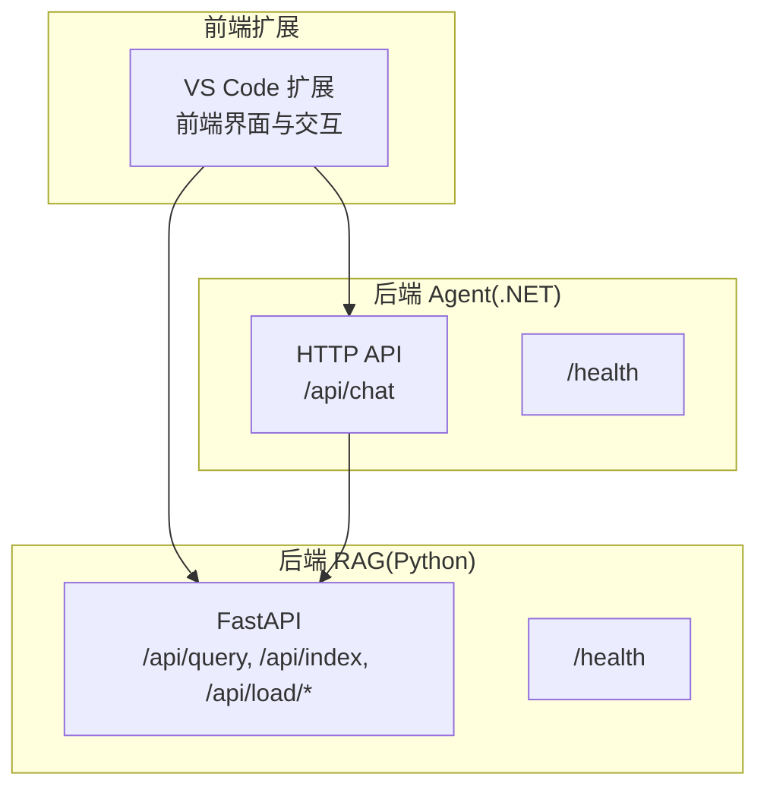
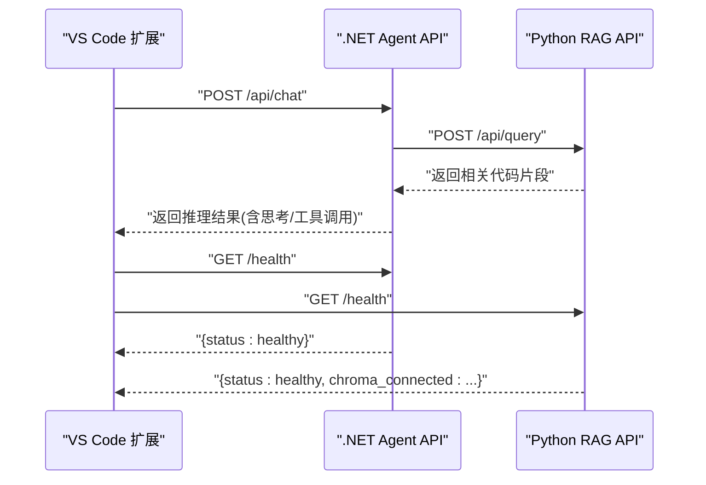
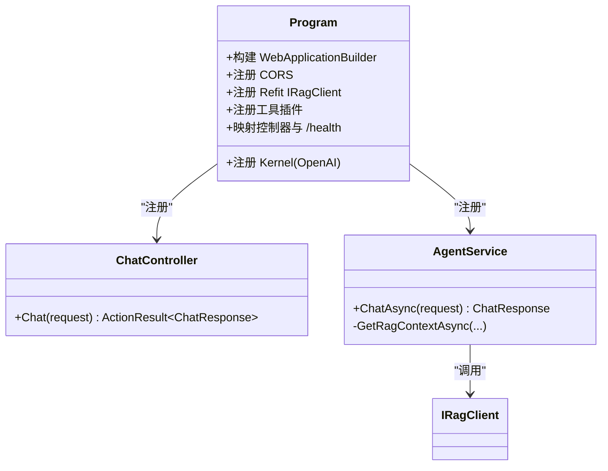
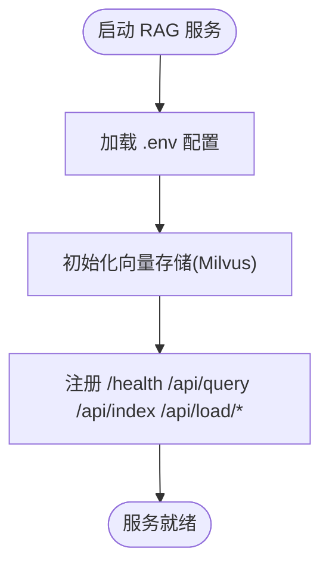
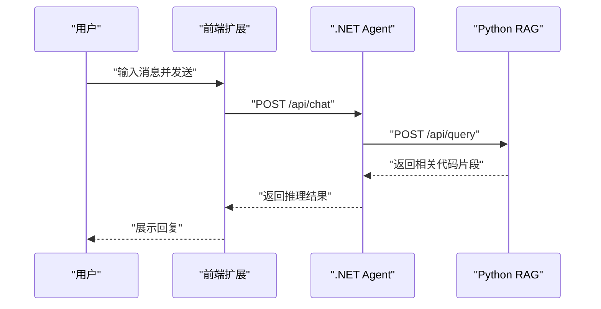

# 快速入门指南

<cite>
**本文引用的文件**
- [QUICK_START.md](file://QUICK_START.md)
- [backend-agent/appsettings.json](file://backend-agent/appsettings.json)
- [backend-agent/appsettings.Development.json](file://backend-agent/appsettings.Development.json)
- [backend-agent/Program.cs](file://backend-agent/Program.cs)
- [backend-agent/Properties/launchSettings.json](file://backend-agent/Properties/launchSettings.json)
- [backend-agent/Controllers/ChatController.cs](file://backend-agent/Controllers/ChatController.cs)
- [backend-agent/Services/AgentService.cs](file://backend-agent/Services/AgentService.cs)
- [backend-rag/.env.example](file://backend-rag/.env.example)
- [backend-rag/pyproject.toml](file://backend-rag/pyproject.toml)
- [backend-rag/app/main.py](file://backend-rag/app/main.py)
- [backend-rag/app/config.py](file://backend-rag/app/config.py)
- [frontend-extension/package.json](file://frontend-extension/package.json)
- [frontend-extension/src/extension.ts](file://frontend-extension/src/extension.ts)
- [frontend-extension/src/services/AgentClient.ts](file://frontend-extension/src/services/AgentClient.ts)
</cite>

## 目录
1. [简介](#简介)
2. [项目结构](#项目结构)
3. [核心组件](#核心组件)
4. [架构总览](#架构总览)
5. [详细组件分析](#详细组件分析)
6. [依赖与环境准备](#依赖与环境准备)
7. [安装与启动步骤](#安装与启动步骤)
8. [配置说明](#配置说明)
9. [健康检查与首次交互](#健康检查与首次交互)
10. [常见问题排查](#常见问题排查)
11. [性能与最佳实践](#性能与最佳实践)
12. [结论](#结论)

## 简介
本指南面向首次部署与运行 ALAgent 的开发者，提供从零开始的完整流程：克隆仓库、安装前端依赖、安装后端 .NET 依赖、安装 Python RAG 依赖，并分别启动前端扩展、.NET Agent 与 Python RAG 服务。文档还涵盖环境变量与配置文件设置、健康检查与首次交互测试、以及常见初始化问题的排查方案。

## 项目结构
ALAgent 采用三模块架构：
- 前端扩展：VS Code 扩展（TypeScript + React），负责用户界面与与后端通信。
- 后端 Agent：.NET 应用，作为推理引擎，调用 RAG 服务并执行工具函数。
- 后端 RAG：Python FastAPI 服务，负责代码/文档索引与检索。



图表来源
- [backend-agent/Controllers/ChatController.cs](file://backend-agent/Controllers/ChatController.cs#L20-L32)
- [backend-rag/app/main.py](file://backend-rag/app/main.py#L65-L86)
- [frontend-extension/src/services/AgentClient.ts](file://frontend-extension/src/services/AgentClient.ts#L31-L39)

章节来源
- [QUICK_START.md](file://QUICK_START.md#L1-L20)

## 核心组件
- 前端扩展：通过 VS Code 配置项读取 Agent 与 RAG 的 API 地址，使用 Axios 发送请求并展示结果。
- .NET Agent：提供 /api/chat 接口，集成 Semantic Kernel 与工具插件，调用 RAG 获取上下文。
- Python RAG：提供 /api/query、/api/index、/api/load/* 等接口，支持多种数据源加载与检索。

章节来源
- [frontend-extension/src/extension.ts](file://frontend-extension/src/extension.ts#L11-L20)
- [frontend-extension/src/services/AgentClient.ts](file://frontend-extension/src/services/AgentClient.ts#L31-L39)
- [backend-agent/Controllers/ChatController.cs](file://backend-agent/Controllers/ChatController.cs#L20-L32)
- [backend-rag/app/main.py](file://backend-rag/app/main.py#L65-L86)

## 架构总览
下图展示了从前端到后端的典型请求链路与健康检查流程。



图表来源
- [frontend-extension/src/services/AgentClient.ts](file://frontend-extension/src/services/AgentClient.ts#L31-L39)
- [backend-agent/Controllers/ChatController.cs](file://backend-agent/Controllers/ChatController.cs#L20-L32)
- [backend-rag/app/main.py](file://backend-rag/app/main.py#L55-L63)
- [backend-agent/Program.cs](file://backend-agent/Program.cs#L63-L65)

## 详细组件分析

### 前端扩展（VS Code）
- 激活时读取 VS Code 设置中的 Agent 与 RAG API 地址，默认值来自 package.json 的贡献配置。
- 使用 AgentClient 封装 Axios 实例，分别访问 /api/chat 与 /api/query，并提供 /health 健康检查。
- 支持命令打开聊天视图与清空历史记录。

```mermaid
classDiagram
class AgentClient {
+chat(request) AgentResponse
+queryContext(request) RagQueryResponse
+healthCheck() {agent : boolean, rag : boolean}
}
class VSCodeExtension {
+activate()
+deactivate()
}
VSCodeExtension --> AgentClient : "创建并注入"
```

图表来源
- [frontend-extension/src/extension.ts](file://frontend-extension/src/extension.ts#L11-L20)
- [frontend-extension/src/services/AgentClient.ts](file://frontend-extension/src/services/AgentClient.ts#L31-L39)

章节来源
- [frontend-extension/src/extension.ts](file://frontend-extension/src/extension.ts#L11-L20)
- [frontend-extension/src/services/AgentClient.ts](file://frontend-extension/src/services/AgentClient.ts#L31-L39)
- [frontend-extension/package.json](file://frontend-extension/package.json#L47-L66)

### .NET Agent（推理引擎）
- 注册 CORS，允许前端 webview 访问。
- 通过 Refit 客户端连接 RAG 服务，超时时间与基础地址可由配置决定。
- 注入 Semantic Kernel，注册文件系统与代码分析工具插件。
- 提供 /api/chat 接口与 /health 健康检查。



图表来源
- [backend-agent/Program.cs](file://backend-agent/Program.cs#L11-L65)
- [backend-agent/Controllers/ChatController.cs](file://backend-agent/Controllers/ChatController.cs#L20-L32)
- [backend-agent/Services/AgentService.cs](file://backend-agent/Services/AgentService.cs#L46-L117)

章节来源
- [backend-agent/Program.cs](file://backend-agent/Program.cs#L11-L65)
- [backend-agent/Controllers/ChatController.cs](file://backend-agent/Controllers/ChatController.cs#L20-L32)
- [backend-agent/Services/AgentService.cs](file://backend-agent/Services/AgentService.cs#L46-L117)

### Python RAG（语义检索服务）
- FastAPI 应用，提供 /health、/api/query、/api/index、/api/load/* 等端点。
- 通过 pydantic-settings 从 .env 加载配置，支持 Milvus 连接、嵌入模型、默认 Top-K 等。
- 生命周期中进行 Milvus 连接信息日志输出。



图表来源
- [backend-rag/app/main.py](file://backend-rag/app/main.py#L28-L53)
- [backend-rag/app/main.py](file://backend-rag/app/main.py#L55-L63)
- [backend-rag/app/config.py](file://backend-rag/app/config.py#L47-L51)

章节来源
- [backend-rag/app/main.py](file://backend-rag/app/main.py#L28-L53)
- [backend-rag/app/main.py](file://backend-rag/app/main.py#L55-L63)
- [backend-rag/app/config.py](file://backend-rag/app/config.py#L47-L51)

## 依赖与环境准备
- 前端扩展：Node.js 18+，VS Code 插件开发工具链。
- 后端 Agent：.NET 9 SDK。
- 后端 RAG：Python 3.11+，uv 工具与 uv venv 虚拟环境管理。

章节来源
- [QUICK_START.md](file://QUICK_START.md#L16-L22)
- [backend-rag/pyproject.toml](file://backend-rag/pyproject.toml#L1-L10)

## 安装与启动步骤

### 步骤一：克隆仓库
- 在本地克隆仓库后，进入根目录。

章节来源
- [QUICK_START.md](file://QUICK_START.md#L1-L15)

### 步骤二：安装前端依赖并启动扩展
- 进入前端扩展目录，安装依赖并监听编译：
  - cd frontend-extension
  - npm install
  - npm run watch
- 在 VS Code 中按 F5 启动调试，加载扩展。

章节来源
- [QUICK_START.md](file://QUICK_START.md#L23-L32)
- [frontend-extension/package.json](file://frontend-extension/package.json#L68-L77)

### 步骤三：启动 .NET Agent
- 进入后端 Agent 目录，设置 OpenAI API 密钥（可通过 appsettings.json 或环境变量），然后运行：
  - cd backend-agent
  - dotnet run --urls=http://localhost:5000

章节来源
- [QUICK_START.md](file://QUICK_START.md#L33-L39)
- [backend-agent/appsettings.json](file://backend-agent/appsettings.json#L9-L16)
- [backend-agent/Properties/launchSettings.json](file://backend-agent/Properties/launchSettings.json#L8-L12)

### 步骤四：安装并启动 Python RAG 服务
- 进入后端 RAG 目录，创建虚拟环境并安装依赖：
  - cd backend-rag
  - uv venv
  - source .venv/bin/activate  # Windows: .venv\Scripts\activate
  - uv pip install -e .
- 复制并编辑 .env 示例文件，配置 OPENAI_API_KEY 等参数：
  - cp .env.example .env
  - 编辑 .env 并设置 OPENAI_API_KEY
- 启动服务：
  - fastapi dev app/main.py --port 8000

章节来源
- [QUICK_START.md](file://QUICK_START.md#L41-L55)
- [backend-rag/.env.example](file://backend-rag/.env.example#L1-L28)
- [backend-rag/pyproject.toml](file://backend-rag/pyproject.toml#L1-L38)

## 配置说明

### VS Code 设置
- 在 VS Code 设置中配置以下键：
  - alagent.agentApiUrl：.NET Agent API 地址，默认 http://localhost:5000
  - alagent.ragApiUrl：Python RAG API 地址，默认 http://localhost:8000
  - alagent.openaiApiKey：OpenAI API Key（安全存储）

章节来源
- [QUICK_START.md](file://QUICK_START.md#L66-L73)
- [frontend-extension/package.json](file://frontend-extension/package.json#L47-L66)

### .NET Agent 配置
- appsettings.json 与 appsettings.Development.json 中的关键项：
  - Agent:OpenAIApiKey：OpenAI API Key
  - Agent:ModelId：模型标识，默认 gpt-4o
  - Agent:RagApiUrl：RAG 服务地址，默认 http://localhost:8000
  - Agent:MaxTokens、Agent:Temperature：推理参数
- launchSettings.json 默认绑定到 http://localhost:5000

章节来源
- [backend-agent/appsettings.json](file://backend-agent/appsettings.json#L9-L16)
- [backend-agent/appsettings.Development.json](file://backend-agent/appsettings.Development.json#L8-L15)
- [backend-agent/Properties/launchSettings.json](file://backend-agent/Properties/launchSettings.json#L8-L12)

### Python RAG 配置
- .env 文件中的关键变量（示例）：
  - OPENAI_API_KEY：用于嵌入模型
  - MILVUS_HOST、MILVUS_PORT、MILVUS_USER、MILVUS_PASSWORD、MILVUS_DB_NAME：Milvus 连接参数
  - HOST、PORT：服务监听地址与端口
  - DEFAULT_TOP_K：默认检索 Top-K
  - 其他：评估、分块、GitHub Token 等
- app/config.py 通过 pydantic-settings 从 .env 加载上述字段。

章节来源
- [backend-rag/.env.example](file://backend-rag/.env.example#L1-L28)
- [backend-rag/app/config.py](file://backend-rag/app/config.py#L6-L45)

## 健康检查与首次交互

### 健康检查
- 访问各服务的 /health 端点以确认服务可用：
  - .NET Agent：http://localhost:5000/health
  - Python RAG：http://localhost:8000/health

章节来源
- [.NET Agent /health](file://backend-agent/Program.cs#L63-L65)
- [Python RAG /health](file://backend-rag/app/main.py#L55-L63)

### 首次交互测试
- 在 VS Code 中打开扩展侧边栏，输入示例消息，点击发送。
- 前端扩展会调用 .NET Agent 的 /api/chat，Agent 再调用 RAG 的 /api/query 获取上下文，最终返回结果。



图表来源
- [frontend-extension/src/services/AgentClient.ts](file://frontend-extension/src/services/AgentClient.ts#L31-L39)
- [backend-agent/Controllers/ChatController.cs](file://backend-agent/Controllers/ChatController.cs#L20-L32)
- [backend-rag/app/main.py](file://backend-rag/app/main.py#L65-L86)

## 常见问题排查

- 端口冲突
  - .NET Agent 默认端口：5000；Python RAG 默认端口：8000
  - 如端口被占用，请在启动时指定不同端口或释放占用进程
  - 参考端口配置表与启动命令

- API 密钥缺失
  - .NET Agent：在 appsettings.json 或环境变量中设置 Agent:OpenAIApiKey
  - Python RAG：在 .env 中设置 OPENAI_API_KEY
  - 若未设置，推理或检索会失败

- CORS 与跨域
  - .NET Agent 已启用默认 CORS 策略，允许 http://localhost:* 与 vscode-webview 协议访问
  - 若自定义域名或端口，请确保前端与后端配置一致

- RAG 服务不可达
  - 确认 RAG 服务已启动且端口正确
  - 检查 .env 中 Milvus 连接参数是否正确
  - 前端扩展需与 VS Code 设置中的 alagent.ragApiUrl 保持一致

章节来源
- [QUICK_START.md](file://QUICK_START.md#L57-L63)
- [backend-agent/Program.cs](file://backend-agent/Program.cs#L11-L20)
- [backend-rag/.env.example](file://backend-rag/.env.example#L1-L28)
- [frontend-extension/src/extension.ts](file://frontend-extension/src/extension.ts#L15-L18)

## 性能与最佳实践
- 合理设置 Agent:MaxTokens 与 Agent:Temperature，平衡质量与速度。
- RAG 服务的 DEFAULT_TOP_K 可根据场景调整，提升召回效果。
- 使用 uv venv 管理 Python 依赖，避免全局污染。
- 在 VS Code 中通过命令面板打开扩展侧边栏，便于快速测试。

[本节为通用建议，无需特定文件来源]

## 结论
按照本指南完成依赖安装与服务启动后，即可在 VS Code 中通过扩展与 ALAgent 进行交互。若遇到问题，优先检查端口、API 密钥与配置文件一致性，并通过 /health 端点确认服务状态。