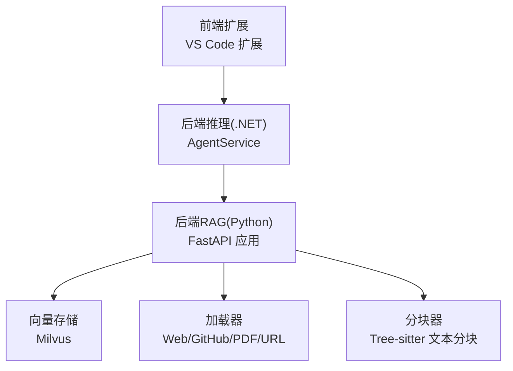
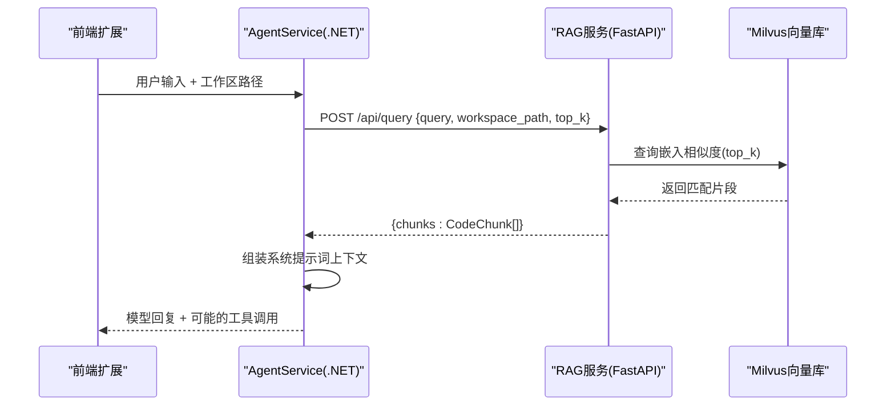
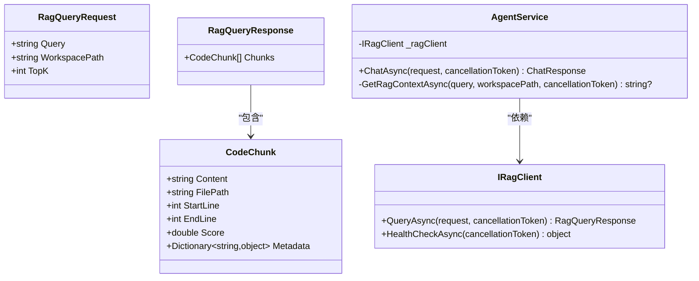
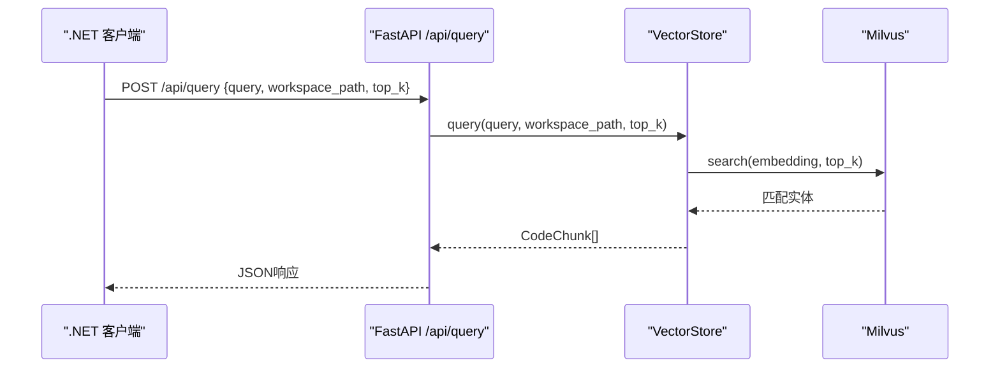
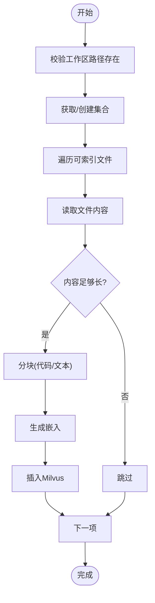
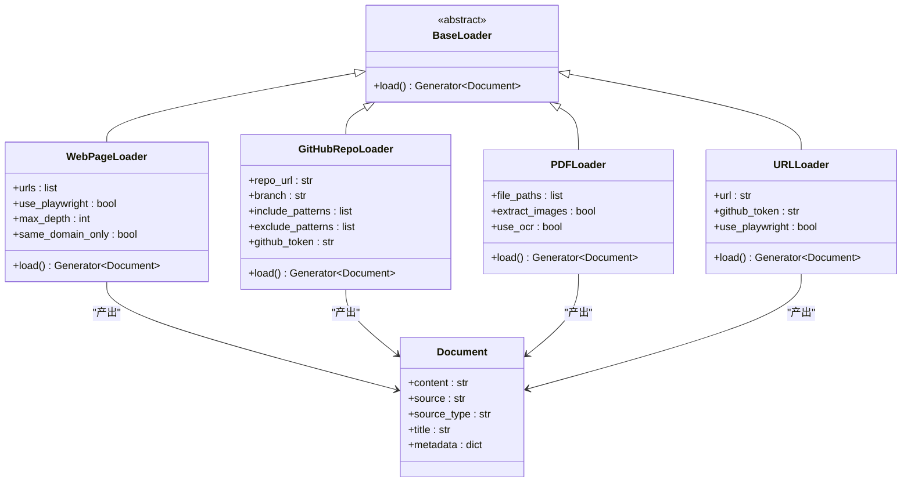
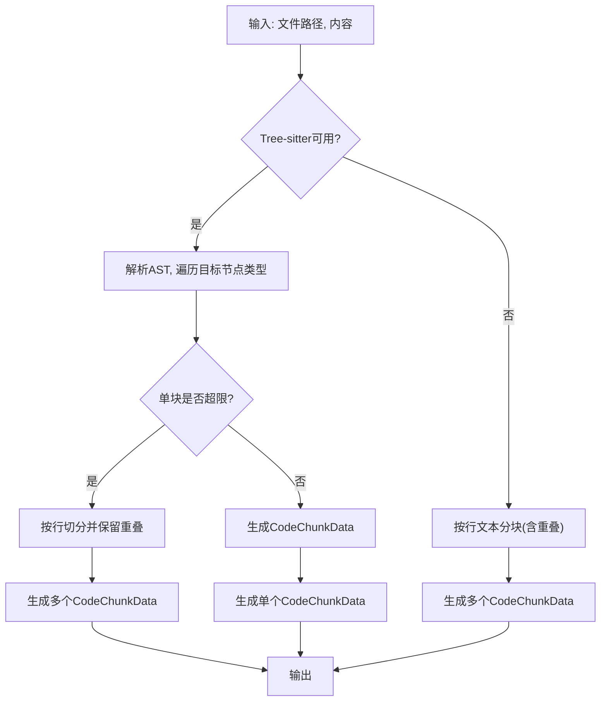
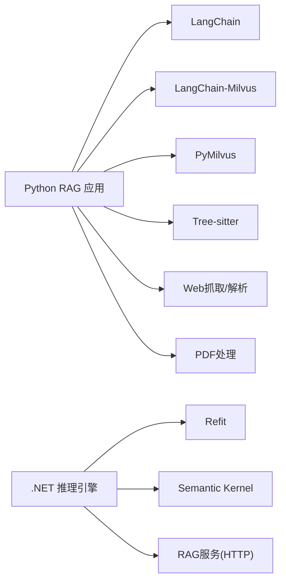

# RAG服务扩展指南

<cite>
**本文引用的文件**
- [IRagClient.cs](file://backend-agent/Services/IRagClient.cs)
- [ChatModels.cs](file://backend-agent/Models/ChatModels.cs)
- [AgentService.cs](file://backend-agent/Services/AgentService.cs)
- [main.py](file://backend-rag/app/main.py)
- [models.py](file://backend-rag/app/models.py)
- [vector_store.py](file://backend-rag/app/vector_store.py)
- [chunker.py](file://backend-rag/app/chunker.py)
- [loaders.py](file://backend-rag/app/loaders.py)
- [config.py](file://backend-rag/app/config.py)
- [pyproject.toml](file://backend-rag/pyproject.toml)
- [QUICK_START.md](file://QUICK_START.md)
- [test_chunker.py](file://backend-rag/tests/test_chunker.py)
</cite>

## 目录
1. [简介](#简介)
2. [项目结构](#项目结构)
3. [核心组件](#核心组件)
4. [架构总览](#架构总览)
5. [详细组件分析](#详细组件分析)
6. [依赖关系分析](#依赖关系分析)
7. [性能与可扩展性](#性能与可扩展性)
8. [故障排查指南](#故障排查指南)
9. [结论](#结论)
10. [附录：接口与协议规范](#附录接口与协议规范)

## 简介
本指南面向需要扩展RAG服务以支持新数据源与检索逻辑的开发者。基于IRagClient接口，本文提供在.NET侧实现自定义RAG客户端或替换现有Python服务的完整路径；同时覆盖/api/query与/health接口的协议规范、请求/响应模型结构、超时与重试策略建议，并给出扩展chunker.py以支持新文件类型解析、集成额外向量数据库的实践方法，以及接口适配、序列化兼容性与版本演进的最佳实践。

## 项目结构
整体采用“前端扩展 + 后端推理(.NET) + 后端RAG(Python)”的分层架构：
- 前端扩展：VS Code扩展，负责交互与工具调用
- 后端推理(.NET)：使用Semantic Kernel进行对话与工具编排，通过Refit调用RAG服务
- 后端RAG(Python)：FastAPI服务，提供查询、索引与多来源加载能力，基于LangChain与Milvus

图表来源
- [QUICK_START.md](file://QUICK_START.md#L1-L93)
- [IRagClient.cs](file://backend-agent/Services/IRagClient.cs#L1-L14)
- [AgentService.cs](file://backend-agent/Services/AgentService.cs#L1-L180)
- [main.py](file://backend-rag/app/main.py#L1-L343)
- [vector_store.py](file://backend-rag/app/vector_store.py#L1-L469)
- [loaders.py](file://backend-rag/app/loaders.py#L1-L462)
- [chunker.py](file://backend-rag/app/chunker.py#L1-L280)

章节来源
- [QUICK_START.md](file://QUICK_START.md#L1-L93)

## 核心组件
- .NET侧RAG客户端接口：IRagClient，定义/api/query与/health两个端点
- .NET侧请求/响应模型：RagQueryRequest/RagQueryResponse与CodeChunk
- Python侧FastAPI应用：提供/api/query、/health、/api/index、/api/load/*等端点
- 向量存储：Milvus，按工作区隔离集合，支持全局文档集合
- 加载器：WebPageLoader、GitHubRepoLoader、PDFLoader、URLLoader
- 分块器：TreeSitterChunker，支持AST与文本两种分块策略

章节来源
- [IRagClient.cs](file://backend-agent/Services/IRagClient.cs#L1-L14)
- [ChatModels.cs](file://backend-agent/Models/ChatModels.cs#L1-L50)
- [main.py](file://backend-rag/app/main.py#L1-L343)
- [vector_store.py](file://backend-rag/app/vector_store.py#L1-L469)
- [loaders.py](file://backend-rag/app/loaders.py#L1-L462)
- [chunker.py](file://backend-rag/app/chunker.py#L1-L280)

## 架构总览
.NET推理引擎通过Refit调用Python RAG服务，RAG服务内部完成向量化与检索。检索结果以CodeChunk形式返回，供.NET侧拼接为上下文。

图表来源
- [IRagClient.cs](file://backend-agent/Services/IRagClient.cs#L1-L14)
- [AgentService.cs](file://backend-agent/Services/AgentService.cs#L119-L139)
- [main.py](file://backend-rag/app/main.py#L65-L90)
- [vector_store.py](file://backend-rag/app/vector_store.py#L377-L435)

## 详细组件分析

### .NET侧RAG客户端与模型
- 接口定义
  - /api/query：POST，请求体为RagQueryRequest，响应为RagQueryResponse
  - /health：GET，返回对象（用于健康检查）
- 请求/响应模型
  - RagQueryRequest：包含Query、WorkspacePath、TopK
  - RagQueryResponse：包含Chunks列表，每项为CodeChunk
  - CodeChunk：包含Content、FilePath、StartLine、EndLine、Score、Metadata
- 调用流程
  - AgentService在对话前调用IRagClient.QueryAsync获取上下文，组装到系统消息中

图表来源
- [IRagClient.cs](file://backend-agent/Services/IRagClient.cs#L1-L14)
- [ChatModels.cs](file://backend-agent/Models/ChatModels.cs#L1-L50)
- [AgentService.cs](file://backend-agent/Services/AgentService.cs#L1-L180)

章节来源
- [IRagClient.cs](file://backend-agent/Services/IRagClient.cs#L1-L14)
- [ChatModels.cs](file://backend-agent/Models/ChatModels.cs#L1-L50)
- [AgentService.cs](file://backend-agent/Services/AgentService.cs#L119-L139)

### Python侧FastAPI与检索流程
- 端点
  - GET /health：返回健康状态与向量库连接状态
  - POST /api/query：语义检索，返回CodeChunk列表
  - POST /api/index：索引工作区，返回统计信息
  - POST /api/load/*：加载外部数据（web、github、pdf、url）
- 检索流程
  - 读取配置与向量存储实例
  - 计算top_k，调用VectorStore.query
  - 将Milvus搜索结果映射为CodeChunk返回

图表来源
- [main.py](file://backend-rag/app/main.py#L65-L90)
- [vector_store.py](file://backend-rag/app/vector_store.py#L377-L435)

章节来源
- [main.py](file://backend-rag/app/main.py#L55-L90)
- [vector_store.py](file://backend-rag/app/vector_store.py#L377-L435)

### 向量存储与索引
- 隔离策略
  - 按工作区生成唯一集合名，避免跨项目污染
  - 支持强制重建索引
- 全局文档集合
  - 用于外部来源（网页、PDF、GitHub文件等）统一索引
- 检索参数
  - COSINE距离，nprobe等参数可调
- 健康检查
  - 通过列举集合判断连接状态

图表来源
- [vector_store.py](file://backend-rag/app/vector_store.py#L121-L204)

章节来源
- [vector_store.py](file://backend-rag/app/vector_store.py#L1-L469)

### 加载器体系
- WebPageLoader：静态/Playwright渲染，HTML转Markdown，可爬链接
- GitHubRepoLoader：浅克隆仓库，按模式过滤与扩展名筛选
- PDFLoader：提取文本与表格，保留元信息
- URLLoader：自动识别类型并委派对应加载器

图表来源
- [loaders.py](file://backend-rag/app/loaders.py#L1-L462)

章节来源
- [loaders.py](file://backend-rag/app/loaders.py#L1-L462)

### 分块器与新语言支持
- TreeSitterChunker
  - 优先使用AST按函数/类等逻辑单元分块
  - 不可用时回退到按行的文本分块，支持重叠
  - 支持多种语言的节点类型映射
- 新语言扩展步骤
  - 在LANGUAGE_MAP添加扩展名到语言标识的映射
  - 在CHUNK_NODE_TYPES补充该语言的逻辑节点类型集合
  - 安装对应tree-sitter语言包并在初始化中注册Parser
  - 运行测试验证分块行为

图表来源
- [chunker.py](file://backend-rag/app/chunker.py#L1-L280)
- [test_chunker.py](file://backend-rag/tests/test_chunker.py#L1-L88)

章节来源
- [chunker.py](file://backend-rag/app/chunker.py#L1-L280)
- [test_chunker.py](file://backend-rag/tests/test_chunker.py#L1-L88)

## 依赖关系分析
- Python RAG服务依赖
  - FastAPI、LangChain、LangChain-OpenAI、LangChain-Milvus、PyMilvus
  - Tree-sitter及其语言绑定
  - Web抓取与PDF处理库
- .NET推理引擎依赖
  - Refit（HTTP客户端声明式接口）
  - Semantic Kernel（对话与工具）

图表来源
- [pyproject.toml](file://backend-rag/pyproject.toml#L1-L67)
- [IRagClient.cs](file://backend-agent/Services/IRagClient.cs#L1-L14)

章节来源
- [pyproject.toml](file://backend-rag/pyproject.toml#L1-L67)

## 性能与可扩展性
- 分块策略
  - 合理设置max_chunk_size与chunk_overlap，平衡召回与上下文长度
  - 对大函数/类进行二次切分，确保语义完整性
- 向量检索
  - Milvus索引类型与nlist/nprobe可调优
  - COSINE距离，注意与距离/相似度的转换
- 并发与批处理
  - 批量生成嵌入与批量插入Milvus
  - 外部加载器并发下载/解析（注意资源限制）
- 超时与重试
  - 建议在.NET侧对RAG查询设置合理超时与指数退避重试
  - Python侧端点应返回明确错误码与日志，便于上层重试决策

[本节为通用性能建议，不直接分析具体文件]

## 故障排查指南
- 健康检查失败
  - 检查Milvus连接参数与网络连通性
  - 查看/health返回的连接状态字段
- 查询无结果
  - 确认集合已建立且有实体
  - 检查embedding模型与维度一致性
- 分块异常
  - 确认Tree-sitter语言包安装正确
  - 检查新语言映射与节点类型集合
- 外部加载失败
  - Web抓取：检查User-Agent、反爬策略与Playwright可用性
  - GitHub：确认token权限与浅克隆深度
  - PDF：确认页面解析与表格提取逻辑

章节来源
- [main.py](file://backend-rag/app/main.py#L55-L63)
- [vector_store.py](file://backend-rag/app/vector_store.py#L448-L457)
- [loaders.py](file://backend-rag/app/loaders.py#L1-L462)
- [chunker.py](file://backend-rag/app/chunker.py#L1-L280)

## 结论
通过清晰的接口契约与模块化设计，RAG服务可在不破坏现有功能的前提下，平滑扩展新的数据源与检索逻辑。建议遵循以下原则：
- 保持请求/响应模型稳定，逐步引入字段并通过默认值兼容旧客户端
- 在Python侧完善加载器与分块器，保证新格式的高质量索引
- 在.NET侧通过Refit接口与重试策略提升鲁棒性
- 使用独立集合与命名空间隔离不同来源的数据，确保检索可控

[本节为总结性内容，不直接分析具体文件]

## 附录：接口与协议规范

### 协议与端点
- /api/query
  - 方法：POST
  - 请求体：RagQueryRequest
  - 响应体：RagQueryResponse
  - 错误：500时返回异常详情
- /health
  - 方法：GET
  - 响应体：对象（包含状态与向量库连接信息）

章节来源
- [IRagClient.cs](file://backend-agent/Services/IRagClient.cs#L1-L14)
- [main.py](file://backend-rag/app/main.py#L55-L63)

### 请求/响应模型定义
- RagQueryRequest
  - 字段：Query、WorkspacePath、TopK
- RagQueryResponse
  - 字段：Chunks（列表），元素为CodeChunk
- CodeChunk
  - 字段：Content、FilePath、StartLine、EndLine、Score、Metadata

章节来源
- [ChatModels.cs](file://backend-agent/Models/ChatModels.cs#L1-L50)
- [models.py](file://backend-rag/app/models.py#L1-L88)

### 超时与重试策略建议
- .NET侧
  - 对RAG查询设置超时（如10-30秒），超过则降级或提示用户重试
  - 实施指数退避重试（如1s、2s、4s），上限不超过60s
  - 对网络异常与5xx错误触发重试，对4xx错误直接失败
- Python侧
  - 端点内捕获异常并返回HTTP 500，记录日志
  - 对外部依赖（Milvus、OpenAI）增加超时与重试包装

章节来源
- [AgentService.cs](file://backend-agent/Services/AgentService.cs#L119-L139)
- [main.py](file://backend-rag/app/main.py#L65-L90)

### 扩展chunker.py以支持新文件类型
- 步骤
  - 在LANGUAGE_MAP中添加扩展名到语言标识的映射
  - 在CHUNK_NODE_TYPES中补充该语言的逻辑节点类型集合
  - 在TreeSitterChunker._ensure_initialized中注册对应Parser
  - 编写单元测试验证分块效果
- 注意事项
  - 保持分块大小与重叠参数合理
  - 对大文件进行二次切分，避免超出上下文限制

章节来源
- [chunker.py](file://backend-rag/app/chunker.py#L1-L280)
- [test_chunker.py](file://backend-rag/tests/test_chunker.py#L1-L88)

### 集成额外向量数据库
- 设计思路
  - 抽象出VectorStore接口（当前为Milvus实现），新增其他实现（如Chroma、Pinecone、Weaviate）
  - 保持相同的query/index_document等方法签名
  - 在配置中切换实现，不影响上层调用
- 关键点
  - 统一嵌入维度与距离度量（如COSINE）
  - 保证索引参数与查询参数的兼容性
  - 提供健康检查方法以便/health端点复用

章节来源
- [vector_store.py](file://backend-rag/app/vector_store.py#L1-L469)
- [config.py](file://backend-rag/app/config.py#L1-L51)

### 接口适配、序列化兼容性与版本演进
- 接口适配
  - .NET侧通过Refit接口声明与JSON序列化，确保字段名与Python一致
  - 若需新增字段，建议在Python端提供默认值，.NET侧忽略未知字段
- 序列化兼容性
  - 使用Pydantic BaseModel与C# record，字段类型尽量一一对应
  - 对可选字段使用可空类型，避免反序列化失败
- 版本演进
  - 为FastAPI应用提供版本号，/health返回版本信息
  - 对于不兼容变更，先提供双栈兼容期，再逐步迁移
  - 在QUICK_START中更新端口与环境变量说明

章节来源
- [main.py](file://backend-rag/app/main.py#L1-L54)
- [QUICK_START.md](file://QUICK_START.md#L1-L93)