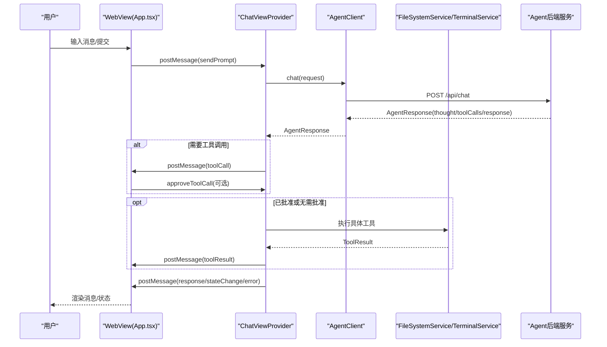
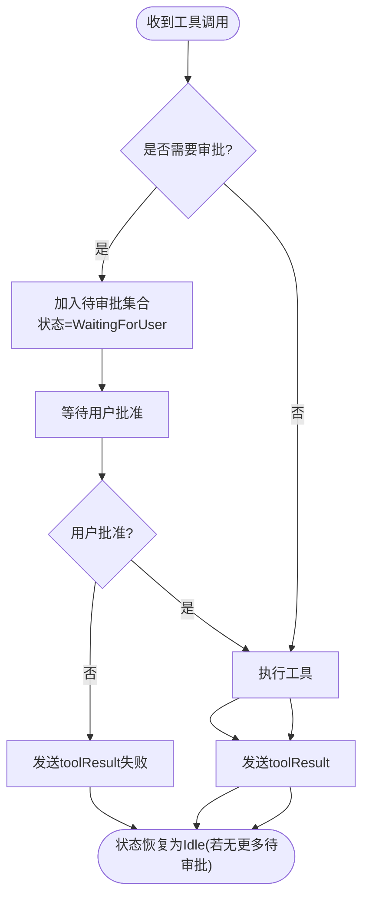
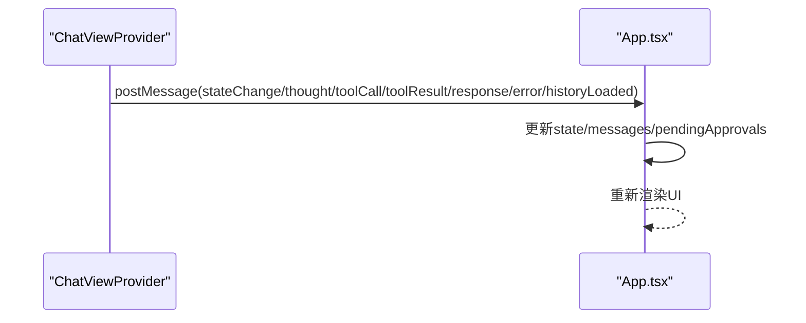
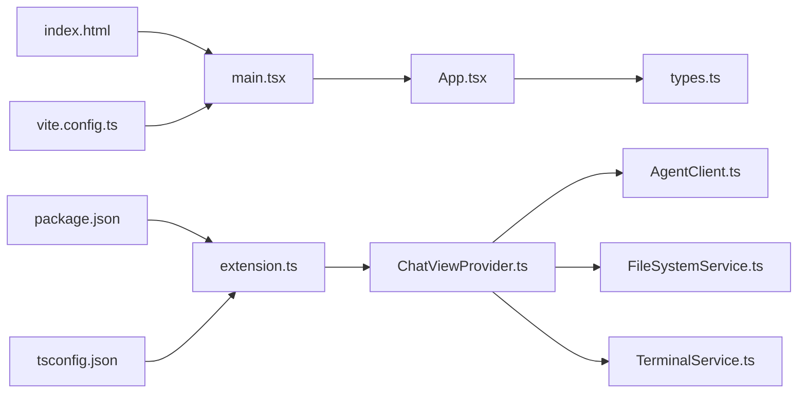

# 前端定制开发指南

<cite>
**本文引用的文件**
- [frontend-extension/src/core/ChatViewProvider.ts](file://frontend-extension/src/core/ChatViewProvider.ts)
- [frontend-extension/src/services/AgentClient.ts](file://frontend-extension/src/services/AgentClient.ts)
- [frontend-extension/src/webview/App.tsx](file://frontend-extension/src/webview/App.tsx)
- [frontend-extension/src/core/types.ts](file://frontend-extension/src/core/types.ts)
- [frontend-extension/src/extension.ts](file://frontend-extension/src/extension.ts)
- [frontend-extension/src/services/FileSystemService.ts](file://frontend-extension/src/services/FileSystemService.ts)
- [frontend-extension/src/services/TerminalService.ts](file://frontend-extension/src/services/TerminalService.ts)
- [frontend-extension/src/webview/main.tsx](file://frontend-extension/src/webview/main.tsx)
- [frontend-extension/src/webview/index.html](file://frontend-extension/src/webview/index.html)
- [frontend-extension/vite.config.ts](file://frontend-extension/vite.config.ts)
- [frontend-extension/tsconfig.json](file://frontend-extension/tsconfig.json)
- [frontend-extension/package.json](file://frontend-extension/package.json)
</cite>

## 目录
1. [简介](#简介)
2. [项目结构](#项目结构)
3. [核心组件](#核心组件)
4. [架构总览](#架构总览)
5. [详细组件分析](#详细组件分析)
6. [依赖关系分析](#依赖关系分析)
7. [性能考量](#性能考量)
8. [故障排查指南](#故障排查指南)
9. [结论](#结论)
10. [附录](#附录)

## 简介
本指南面向VS Code扩展前端开发者，聚焦于WebView界面与消息通信机制的定制开发。重点说明：
- ChatViewProvider如何管理聊天视图生命周期与消息路由
- AgentClient如何封装与后端Agent/RAG服务的HTTP通信
- App.tsx中React组件的状态管理与事件响应
- 如何自定义UI组件、新增消息类型、处理工具调用确认对话框
- 跨域安全、消息序列化格式兼容性与用户体验一致性最佳实践

## 项目结构
前端扩展采用“VS Code扩展宿主 + WebView React应用”的双层架构：
- 扩展宿主负责注册Webview视图、初始化服务、与后端Agent/RAG通信
- WebView侧为React应用，通过postMessage与扩展宿主通信，渲染聊天界面与工具调用流程

```mermaid
graph TB
subgraph "VS Code扩展宿主"
EXT["extension.ts<br/>激活与命令注册"]
CVP["ChatViewProvider.ts<br/>Webview视图提供者"]
AG["AgentClient.ts<br/>HTTP客户端"]
FS["FileSystemService.ts<br/>文件系统服务"]
TS["TerminalService.ts<br/>终端服务"]
end
subgraph "WebView React应用"
HTML["index.html<br/>入口HTML"]
MAIN["main.tsx<br/>根节点挂载"]
APP["App.tsx<br/>聊天界面与状态管理"]
TYPES["types.ts<br/>消息协议与类型定义"]
end
EXT --> CVP
CVP --> AG
CVP --> FS
CVP --> TS
CVP <- --> APP
HTML --> MAIN --> APP
APP --> TYPES
```

图表来源
- [frontend-extension/src/extension.ts](file://frontend-extension/src/extension.ts#L1-L74)
- [frontend-extension/src/core/ChatViewProvider.ts](file://frontend-extension/src/core/ChatViewProvider.ts#L1-L325)
- [frontend-extension/src/services/AgentClient.ts](file://frontend-extension/src/services/AgentClient.ts#L1-L61)
- [frontend-extension/src/services/FileSystemService.ts](file://frontend-extension/src/services/FileSystemService.ts#L1-L133)
- [frontend-extension/src/services/TerminalService.ts](file://frontend-extension/src/services/TerminalService.ts#L1-L100)
- [frontend-extension/src/webview/index.html](file://frontend-extension/src/webview/index.html#L1-L13)
- [frontend-extension/src/webview/main.tsx](file://frontend-extension/src/webview/main.tsx#L1-L12)
- [frontend-extension/src/webview/App.tsx](file://frontend-extension/src/webview/App.tsx#L1-L312)
- [frontend-extension/src/core/types.ts](file://frontend-extension/src/core/types.ts#L1-L151)

章节来源
- [frontend-extension/src/extension.ts](file://frontend-extension/src/extension.ts#L1-L74)
- [frontend-extension/vite.config.ts](file://frontend-extension/vite.config.ts#L1-L29)
- [frontend-extension/tsconfig.json](file://frontend-extension/tsconfig.json#L1-L29)
- [frontend-extension/package.json](file://frontend-extension/package.json#L1-L100)

## 核心组件
- ChatViewProvider：实现WebviewViewProvider接口，负责WebView生命周期、HTML注入、消息接收与分发、状态机驱动、工具调用执行与结果回传。
- AgentClient：封装Axios实例，统一Agent与RAG服务的HTTP请求、超时与健康检查。
- App.tsx：React聊天界面，维护消息列表、输入框、状态指示器、工具调用确认对话框，并通过postMessage与扩展宿主通信。
- 类型系统（types.ts）：使用Zod对消息协议进行严格校验，确保前后端消息格式一致与安全。

章节来源
- [frontend-extension/src/core/ChatViewProvider.ts](file://frontend-extension/src/core/ChatViewProvider.ts#L1-L325)
- [frontend-extension/src/services/AgentClient.ts](file://frontend-extension/src/services/AgentClient.ts#L1-L61)
- [frontend-extension/src/webview/App.tsx](file://frontend-extension/src/webview/App.tsx#L1-L312)
- [frontend-extension/src/core/types.ts](file://frontend-extension/src/core/types.ts#L1-L151)

## 架构总览
消息流从用户输入到后端Agent，再到工具调用与结果回传，最终回到WebView渲染。扩展宿主负责消息路由与工具执行，WebView负责UI与交互。



图表来源
- [frontend-extension/src/webview/App.tsx](file://frontend-extension/src/webview/App.tsx#L136-L175)
- [frontend-extension/src/core/ChatViewProvider.ts](file://frontend-extension/src/core/ChatViewProvider.ts#L55-L149)
- [frontend-extension/src/services/AgentClient.ts](file://frontend-extension/src/services/AgentClient.ts#L31-L39)
- [frontend-extension/src/services/FileSystemService.ts](file://frontend-extension/src/services/FileSystemService.ts#L1-L133)
- [frontend-extension/src/services/TerminalService.ts](file://frontend-extension/src/services/TerminalService.ts#L1-L100)

## 详细组件分析

### ChatViewProvider：聊天视图生命周期与消息路由
职责与要点：
- 注册Webview视图，设置webview选项与内容安全策略（CSP），注入样式与脚本资源
- 接收来自WebView的消息，使用Zod Schema进行严格校验，再分发到对应处理器
- 维护会话历史、状态机（Idle/Thinking/Executing/WaitingForUser/Error）
- 处理用户提示、取消请求、工具调用审批
- 将后端返回的思考、工具调用、工具结果、最终回复、错误等消息回传给WebView

关键流程图（工具调用与审批）


图表来源
- [frontend-extension/src/core/ChatViewProvider.ts](file://frontend-extension/src/core/ChatViewProvider.ts#L151-L268)

章节来源
- [frontend-extension/src/core/ChatViewProvider.ts](file://frontend-extension/src/core/ChatViewProvider.ts#L31-L149)
- [frontend-extension/src/core/ChatViewProvider.ts](file://frontend-extension/src/core/ChatViewProvider.ts#L151-L268)
- [frontend-extension/src/core/ChatViewProvider.ts](file://frontend-extension/src/core/ChatViewProvider.ts#L270-L325)

### AgentClient：HTTP通信封装
职责与要点：
- 维护两个Axios实例分别指向Agent与RAG服务，统一超时与Content-Type
- 提供chat与queryContext方法，返回标准化响应
- 提供updateConfig动态更新服务地址
- 提供healthCheck用于运行时探测服务可用性

章节来源
- [frontend-extension/src/services/AgentClient.ts](file://frontend-extension/src/services/AgentClient.ts#L1-L61)

### App.tsx：React组件状态管理与事件响应
职责与要点：
- 使用useState维护消息列表、输入值、Agent状态、待审批集合
- useEffect监听来自扩展宿主的消息，按类型更新UI状态
- 支持提交、取消、工具调用审批等事件
- 渲染消息、工具调用面板、结果状态、状态指示器与取消按钮
- 使用acquireVsCodeApi访问postMessage与状态持久化

消息处理流程（从扩展宿主到UI）


图表来源
- [frontend-extension/src/webview/App.tsx](file://frontend-extension/src/webview/App.tsx#L48-L134)

章节来源
- [frontend-extension/src/webview/App.tsx](file://frontend-extension/src/webview/App.tsx#L1-L312)

### 类型系统与消息协议（types.ts）
- 使用Zod对消息协议进行严格校验，确保消息字段、类型与枚举值一致
- 定义AgentState、消息类型、工具调用与结果、Agent/RAG请求/响应等核心类型
- 通过Schema在扩展宿主与WebView两端形成强一致的契约

章节来源
- [frontend-extension/src/core/types.ts](file://frontend-extension/src/core/types.ts#L1-L151)

### 文件与终端服务
- FileSystemService：列出文件、读取/写入文件、删除、创建目录、路径解析与大小限制
- TerminalService：执行命令、交互式终端、输出缓冲与超时控制

章节来源
- [frontend-extension/src/services/FileSystemService.ts](file://frontend-extension/src/services/FileSystemService.ts#L1-L133)
- [frontend-extension/src/services/TerminalService.ts](file://frontend-extension/src/services/TerminalService.ts#L1-L100)

## 依赖关系分析
- 扩展宿主依赖：ChatViewProvider依赖AgentClient、FileSystemService、TerminalService；通过VS Code API注册Webview视图与命令
- WebView依赖：App.tsx依赖types.ts中的消息协议；通过acquireVsCodeApi与宿主通信
- 构建与打包：Vite负责React应用构建，输出至dist/webview；扩展打包由esbuild完成



图表来源
- [frontend-extension/src/extension.ts](file://frontend-extension/src/extension.ts#L1-L74)
- [frontend-extension/src/core/ChatViewProvider.ts](file://frontend-extension/src/core/ChatViewProvider.ts#L1-L325)
- [frontend-extension/src/services/AgentClient.ts](file://frontend-extension/src/services/AgentClient.ts#L1-L61)
- [frontend-extension/src/services/FileSystemService.ts](file://frontend-extension/src/services/FileSystemService.ts#L1-L133)
- [frontend-extension/src/services/TerminalService.ts](file://frontend-extension/src/services/TerminalService.ts#L1-L100)
- [frontend-extension/src/webview/App.tsx](file://frontend-extension/src/webview/App.tsx#L1-L312)
- [frontend-extension/src/webview/main.tsx](file://frontend-extension/src/webview/main.tsx#L1-L12)
- [frontend-extension/src/webview/index.html](file://frontend-extension/src/webview/index.html#L1-L13)
- [frontend-extension/vite.config.ts](file://frontend-extension/vite.config.ts#L1-L29)
- [frontend-extension/tsconfig.json](file://frontend-extension/tsconfig.json#L1-L29)
- [frontend-extension/package.json](file://frontend-extension/package.json#L1-L100)

章节来源
- [frontend-extension/src/extension.ts](file://frontend-extension/src/extension.ts#L1-L74)
- [frontend-extension/vite.config.ts](file://frontend-extension/vite.config.ts#L1-L29)
- [frontend-extension/tsconfig.json](file://frontend-extension/tsconfig.json#L1-L29)
- [frontend-extension/package.json](file://frontend-extension/package.json#L1-L100)

## 性能考量
- 请求超时与取消：AgentClient设置较长超时以适配大模型推理；ChatViewProvider使用AbortController支持取消请求，避免长时间阻塞
- 工具调用批处理：工具调用按顺序执行，减少并发风险；待审批工具集合用于跟踪未完成调用
- UI渲染优化：React组件使用useCallback与useEffect稳定引用，避免不必要的重渲染
- 资源加载：WebView注入本地资源，启用CSP，避免外部资源引入带来的性能与安全问题

章节来源
- [frontend-extension/src/services/AgentClient.ts](file://frontend-extension/src/services/AgentClient.ts#L1-L61)
- [frontend-extension/src/core/ChatViewProvider.ts](file://frontend-extension/src/core/ChatViewProvider.ts#L90-L149)

## 故障排查指南
常见问题与定位建议：
- 消息格式不匹配：检查types.ts中的Zod Schema定义，确保扩展宿主与WebView两端消息类型一致
- 跨域与CSP：确认ChatViewProvider生成的CSP策略与资源URI正确，避免脚本与样式被阻止
- 工具调用失败：检查FileSystemService/TerminalService的异常抛出与错误信息回传，关注权限、路径与超时
- 健康检查：使用AgentClient.healthCheck判断Agent/RAG服务可用性，必要时更新配置

章节来源
- [frontend-extension/src/core/types.ts](file://frontend-extension/src/core/types.ts#L1-L151)
- [frontend-extension/src/core/ChatViewProvider.ts](file://frontend-extension/src/core/ChatViewProvider.ts#L290-L325)
- [frontend-extension/src/services/AgentClient.ts](file://frontend-extension/src/services/AgentClient.ts#L41-L61)
- [frontend-extension/src/services/FileSystemService.ts](file://frontend-extension/src/services/FileSystemService.ts#L1-L133)
- [frontend-extension/src/services/TerminalService.ts](file://frontend-extension/src/services/TerminalService.ts#L1-L100)

## 结论
该前端扩展通过严格的类型协议与清晰的职责划分，实现了从用户输入到后端Agent、再到工具调用与结果回传的完整闭环。开发者可在保持消息协议一致性的前提下，按需扩展UI组件、新增消息类型与工具调用，同时遵循跨域与序列化规范，确保安全性与用户体验的一致性。

## 附录

### 自定义UI组件开发示例
- 新增消息类型：在types.ts中扩展消息协议Schema与类型定义，确保扩展宿主与WebView两端同步更新
- 在App.tsx中添加对应的UI渲染逻辑与事件处理
- 示例路径参考：
  - [消息协议定义](file://frontend-extension/src/core/types.ts#L7-L91)
  - [消息处理分支](file://frontend-extension/src/webview/App.tsx#L48-L134)

章节来源
- [frontend-extension/src/core/types.ts](file://frontend-extension/src/core/types.ts#L7-L91)
- [frontend-extension/src/webview/App.tsx](file://frontend-extension/src/webview/App.tsx#L48-L134)

### 新增消息类型与处理步骤
- 在types.ts中新增Schema与类型
- 在ChatViewProvider中添加消息分发逻辑
- 在App.tsx中添加UI与事件处理
- 示例路径参考：
  - [扩展宿主消息分发](file://frontend-extension/src/core/ChatViewProvider.ts#L55-L81)
  - [WebView消息处理](file://frontend-extension/src/webview/App.tsx#L48-L134)

章节来源
- [frontend-extension/src/core/ChatViewProvider.ts](file://frontend-extension/src/core/ChatViewProvider.ts#L55-L81)
- [frontend-extension/src/webview/App.tsx](file://frontend-extension/src/webview/App.tsx#L48-L134)

### 处理工具调用确认对话框
- 在ChatViewProvider中根据requiresApproval将工具调用放入待审批集合
- 在App.tsx中渲染工具调用卡片与确认按钮，触发approveToolCall消息
- 示例路径参考：
  - [工具调用与审批流程](file://frontend-extension/src/core/ChatViewProvider.ts#L151-L268)
  - [工具调用UI与确认按钮](file://frontend-extension/src/webview/App.tsx#L229-L267)

章节来源
- [frontend-extension/src/core/ChatViewProvider.ts](file://frontend-extension/src/core/ChatViewProvider.ts#L151-L268)
- [frontend-extension/src/webview/App.tsx](file://frontend-extension/src/webview/App.tsx#L229-L267)

### 跨域安全与消息序列化最佳实践
- 跨域与CSP：WebView注入本地资源，设置CSP策略，避免外链脚本与样式
- 序列化与校验：使用Zod Schema对消息进行编解码校验，保证前后端一致
- 用户体验一致性：统一状态标签、错误提示与滚动行为，保持交互一致性
- 示例路径参考：
  - [CSP与资源注入](file://frontend-extension/src/core/ChatViewProvider.ts#L290-L325)
  - [消息Schema定义](file://frontend-extension/src/core/types.ts#L7-L91)

章节来源
- [frontend-extension/src/core/ChatViewProvider.ts](file://frontend-extension/src/core/ChatViewProvider.ts#L290-L325)
- [frontend-extension/src/core/types.ts](file://frontend-extension/src/core/types.ts#L7-L91)