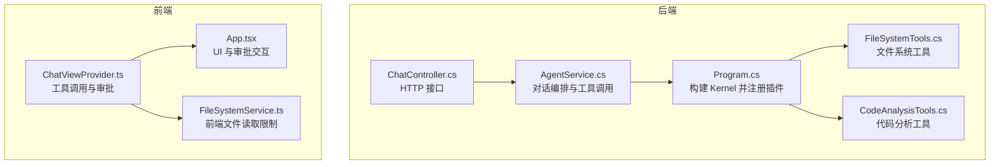
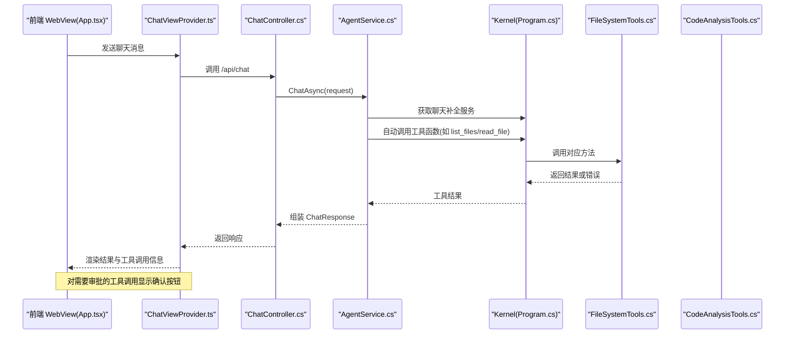
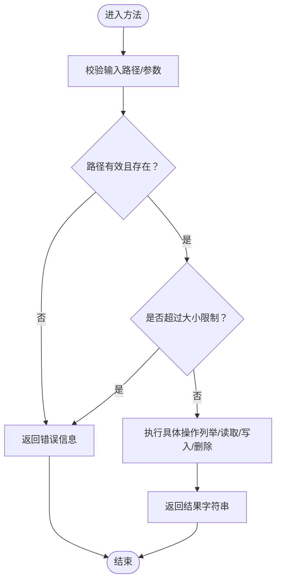
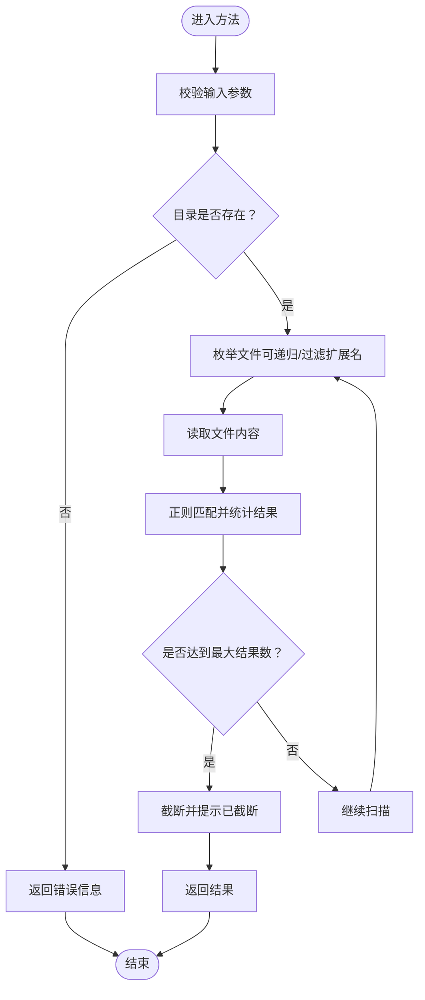
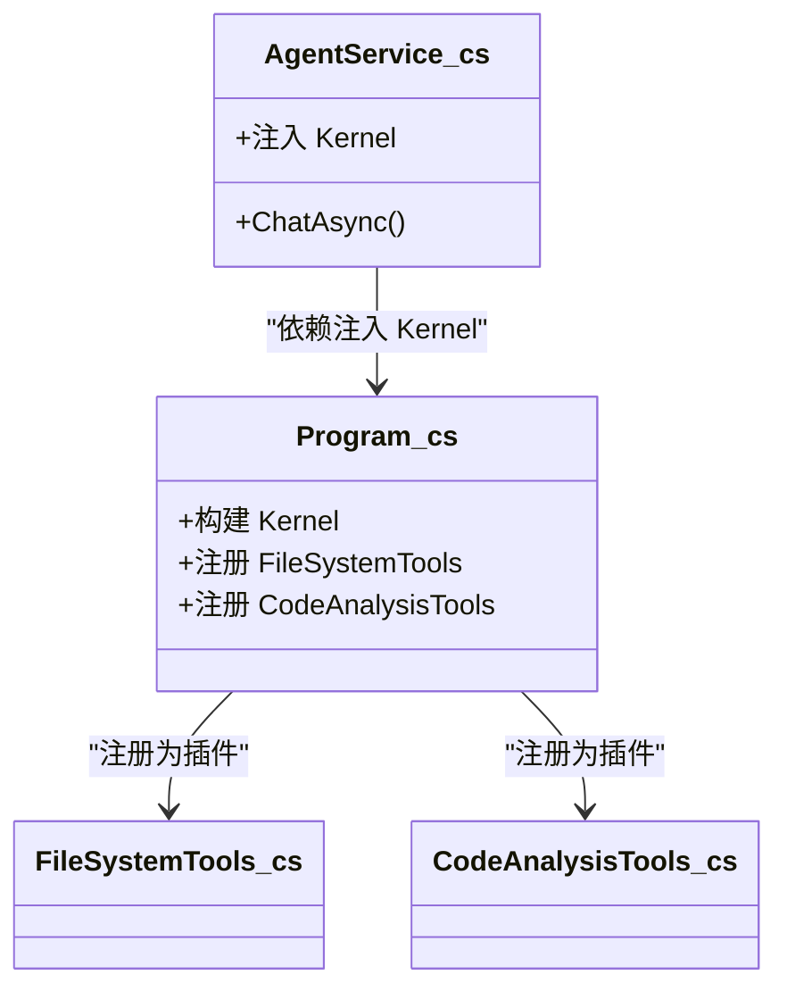
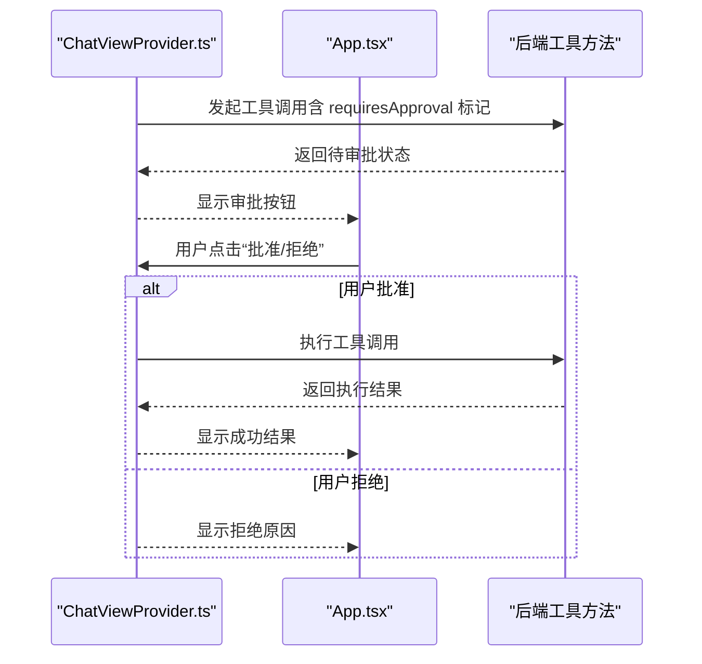
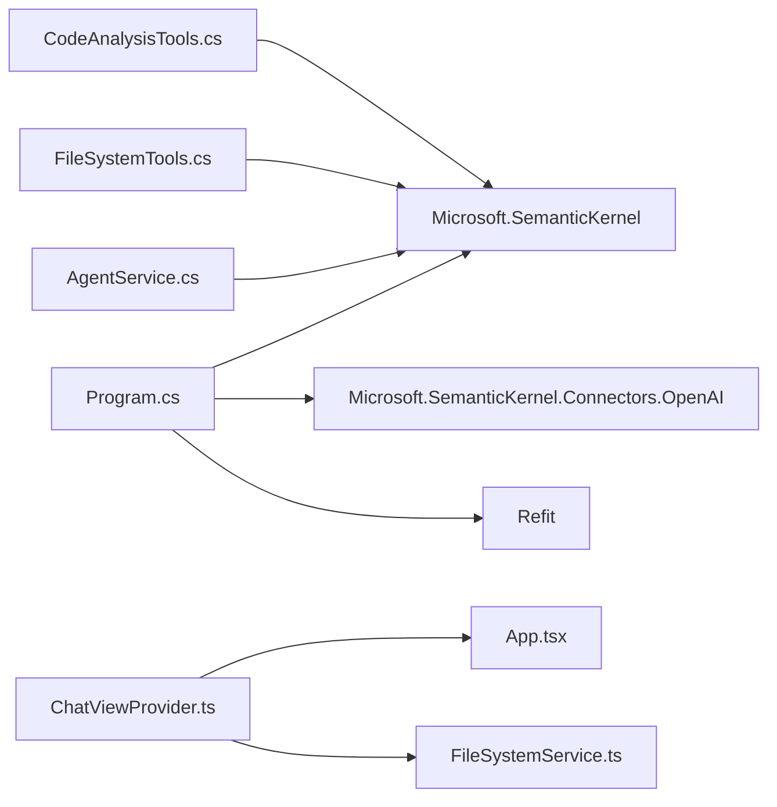

# 工具开发指南

<cite>
**本文引用的文件**
- [Program.cs](file://backend-agent/Program.cs)
- [AgentService.cs](file://backend-agent/Services/AgentService.cs)
- [ChatController.cs](file://backend-agent/Controllers/ChatController.cs)
- [ChatModels.cs](file://backend-agent/Models/ChatModels.cs)
- [AgentSettings.cs](file://backend-agent/Services/AgentSettings.cs)
- [FileSystemTools.cs](file://backend-agent/Tools/FileSystemTools.cs)
- [CodeAnalysisTools.cs](file://backend-agent/Tools/CodeAnalysisTools.cs)
- [ChatViewProvider.ts](file://frontend-extension/src/core/ChatViewProvider.ts)
- [App.tsx](file://frontend-extension/src/webview/App.tsx)
- [FileSystemService.ts](file://frontend-extension/src/services/FileSystemService.ts)
- [ALAgent.Agent.csproj](file://backend-agent/ALAgent.Agent.csproj)
</cite>

## 目录
1. [简介](#简介)
2. [项目结构](#项目结构)
3. [核心组件](#核心组件)
4. [架构总览](#架构总览)
5. [详细组件分析](#详细组件分析)
6. [依赖关系分析](#依赖关系分析)
7. [性能与安全考虑](#性能与安全考虑)
8. [故障排查指南](#故障排查指南)
9. [结论](#结论)
10. [附录：开发模板与最佳实践](#附录开发模板与最佳实践)

## 简介
本指南面向希望基于 Semantic Kernel 开发“工具类插件”的开发者，结合项目中的 FileSystemTools 与 CodeAnalysisTools 实例，系统讲解：
- 如何使用 [KernelFunction] 与 [Description] 属性定义可调用的工具方法
- 参数描述、返回类型与错误处理的设计
- 异步实现模式与同步实现模式的选择
- 安全限制（文件大小限制、路径遍历防护）
- 敏感操作（写入、删除、命令执行）的用户审批流程
- 工具注册到 Kernel 的过程与依赖注入配置
- 日志记录、性能监控与单元测试建议

## 项目结构
后端采用 ASP.NET Core + Semantic Kernel 架构，前端为 VS Code 扩展的 WebView。工具类位于 Tools 目录，通过依赖注入在 Program 中注册为 Kernel 插件；服务层负责对话编排与工具调用；控制器对外提供聊天接口。

图表来源
- [Program.cs](file://backend-agent/Program.cs#L32-L49)
- [AgentService.cs](file://backend-agent/Services/AgentService.cs#L46-L117)
- [ChatController.cs](file://backend-agent/Controllers/ChatController.cs#L20-L44)
- [FileSystemTools.cs](file://backend-agent/Tools/FileSystemTools.cs#L1-L151)
- [CodeAnalysisTools.cs](file://backend-agent/Tools/CodeAnalysisTools.cs#L1-L252)
- [ChatViewProvider.ts](file://frontend-extension/src/core/ChatViewProvider.ts#L151-L271)
- [App.tsx](file://frontend-extension/src/webview/App.tsx#L221-L271)
- [FileSystemService.ts](file://frontend-extension/src/services/FileSystemService.ts#L65-L88)

章节来源
- [Program.cs](file://backend-agent/Program.cs#L32-L49)
- [AgentService.cs](file://backend-agent/Services/AgentService.cs#L46-L117)
- [ChatController.cs](file://backend-agent/Controllers/ChatController.cs#L20-L44)

## 核心组件
- Kernel 注册与插件装载：在 Program 中通过 AddFromType 将工具类注册为插件，供 AgentService 使用。
- AgentService：负责构建对话历史、配置执行设置、自动调用工具函数，并解析模型输出。
- 控制器：接收前端请求，调用 AgentService，返回结构化响应。
- 工具类：FileSystemTools 提供文件/目录列举、读取、写入、删除、存在性检查；CodeAnalysisTools 提供代码搜索、文件结构分析、命令执行。

章节来源
- [Program.cs](file://backend-agent/Program.cs#L32-L49)
- [AgentService.cs](file://backend-agent/Services/AgentService.cs#L46-L117)
- [ChatController.cs](file://backend-agent/Controllers/ChatController.cs#L20-L44)
- [FileSystemTools.cs](file://backend-agent/Tools/FileSystemTools.cs#L1-L151)
- [CodeAnalysisTools.cs](file://backend-agent/Tools/CodeAnalysisTools.cs#L1-L252)

## 架构总览
下图展示了从 HTTP 请求到工具调用再到前端审批的整体流程。

图表来源
- [ChatController.cs](file://backend-agent/Controllers/ChatController.cs#L20-L44)
- [AgentService.cs](file://backend-agent/Services/AgentService.cs#L46-L117)
- [Program.cs](file://backend-agent/Program.cs#L32-L49)
- [FileSystemTools.cs](file://backend-agent/Tools/FileSystemTools.cs#L1-L151)
- [CodeAnalysisTools.cs](file://backend-agent/Tools/CodeAnalysisTools.cs#L1-L252)
- [App.tsx](file://frontend-extension/src/webview/App.tsx#L221-L271)
- [ChatViewProvider.ts](file://frontend-extension/src/core/ChatViewProvider.ts#L151-L271)

## 详细组件分析

### 文件系统工具（FileSystemTools）
- 方法与职责
  - 列举文件与目录：支持递归枚举、忽略常见目录、限制返回条目数量。
  - 读取文件：带大小限制（例如 1MB），避免大文件拖慢系统。
  - 写入文件：自动创建缺失目录，返回写入字符数统计。
  - 删除文件：同步实现，返回删除状态。
  - 存在性检查：区分文件与目录是否存在。
- 属性与签名
  - 使用 [KernelFunction] 与 [Description] 标注方法名与用途。
  - 参数使用 [Description] 进行参数说明。
  - 返回类型统一为字符串，便于与模型对话集成。
- 错误处理
  - 捕获异常并返回错误信息，避免中断对话流程。
- 安全限制
  - 读取时对文件大小进行限制。
  - 忽略常见开发目录与缓存目录，减少无关内容。
- 异步实现模式
  - 大多数方法采用异步实现，提升 I/O 性能。
  - 删除方法采用同步实现，保持简单直接。

图表来源
- [FileSystemTools.cs](file://backend-agent/Tools/FileSystemTools.cs#L1-L151)

章节来源
- [FileSystemTools.cs](file://backend-agent/Tools/FileSystemTools.cs#L1-L151)

### 代码分析工具（CodeAnalysisTools）
- 方法与职责
  - 代码搜索：按正则表达式在指定目录中检索匹配项，限制最大返回数量。
  - 文件结构分析：根据扩展名选择不同语言的结构分析策略。
  - 命令执行：跨平台执行 shell 命令，收集标准输出与错误输出。
- 属性与签名
  - 使用 [KernelFunction] 与 [Description] 标注方法名与用途。
  - 参数使用 [Description] 进行参数说明。
  - 返回类型统一为字符串，便于与模型对话集成。
- 错误处理
  - 捕获异常并返回错误信息，避免中断对话流程。
- 安全限制
  - 读取文件时跳过不可读文件，避免阻塞。
  - 命令执行仅通过系统 shell，未做命令白名单过滤。
- 异步实现模式
  - 多数方法采用异步实现，提升 I/O 性能。
  - 结构分析方法为纯内存处理，采用同步实现。

图表来源
- [CodeAnalysisTools.cs](file://backend-agent/Tools/CodeAnalysisTools.cs#L1-L252)

章节来源
- [CodeAnalysisTools.cs](file://backend-agent/Tools/CodeAnalysisTools.cs#L1-L252)

### 工具注册与依赖注入
- 在 Program 中通过 AddFromType 将工具类注册为 Kernel 插件，随后由 AgentService 注入使用。
- Kernel 配置包含 OpenAI 聊天补全连接信息与插件集合。

图表来源
- [Program.cs](file://backend-agent/Program.cs#L32-L49)
- [AgentService.cs](file://backend-agent/Services/AgentService.cs#L34-L44)
- [FileSystemTools.cs](file://backend-agent/Tools/FileSystemTools.cs#L1-L151)
- [CodeAnalysisTools.cs](file://backend-agent/Tools/CodeAnalysisTools.cs#L1-L252)

章节来源
- [Program.cs](file://backend-agent/Program.cs#L32-L49)
- [AgentService.cs](file://backend-agent/Services/AgentService.cs#L34-L44)

### 前端审批流程（敏感操作）
- 当工具方法标注为“需要用户审批”时，前端会显示确认按钮，等待用户同意后再执行。
- ChatViewProvider.ts 负责发送工具调用请求、等待审批、执行或拒绝。

图表来源
- [ChatViewProvider.ts](file://frontend-extension/src/core/ChatViewProvider.ts#L151-L271)
- [App.tsx](file://frontend-extension/src/webview/App.tsx#L221-L271)
- [CodeAnalysisTools.cs](file://backend-agent/Tools/CodeAnalysisTools.cs#L109-L163)
- [FileSystemTools.cs](file://backend-agent/Tools/FileSystemTools.cs#L79-L121)

章节来源
- [ChatViewProvider.ts](file://frontend-extension/src/core/ChatViewProvider.ts#L151-L271)
- [App.tsx](file://frontend-extension/src/webview/App.tsx#L221-L271)
- [CodeAnalysisTools.cs](file://backend-agent/Tools/CodeAnalysisTools.cs#L109-L163)
- [FileSystemTools.cs](file://backend-agent/Tools/FileSystemTools.cs#L79-L121)

## 依赖关系分析
- 后端依赖
  - Microsoft.SemanticKernel 与 Microsoft.SemanticKernel.Connectors.OpenAI
  - Refit 用于 RAG 客户端
- 前端依赖
  - VS Code 扩展运行时与 WebView API
  - 本地文件系统访问受前端限制（如 1MB 读取限制）

图表来源
- [Program.cs](file://backend-agent/Program.cs#L32-L49)
- [AgentService.cs](file://backend-agent/Services/AgentService.cs#L34-L44)
- [FileSystemTools.cs](file://backend-agent/Tools/FileSystemTools.cs#L1-L151)
- [CodeAnalysisTools.cs](file://backend-agent/Tools/CodeAnalysisTools.cs#L1-L252)
- [ChatViewProvider.ts](file://frontend-extension/src/core/ChatViewProvider.ts#L151-L271)
- [App.tsx](file://frontend-extension/src/webview/App.tsx#L221-L271)
- [FileSystemService.ts](file://frontend-extension/src/services/FileSystemService.ts#L65-L88)
- [ALAgent.Agent.csproj](file://backend-agent/ALAgent.Agent.csproj#L10-L15)

章节来源
- [ALAgent.Agent.csproj](file://backend-agent/ALAgent.Agent.csproj#L10-L15)
- [Program.cs](file://backend-agent/Program.cs#L32-L49)

## 性能与安全考虑
- 性能
  - 异步 I/O：文件列举、读取、命令执行均采用异步，避免阻塞线程。
  - 结果限制：文件列举限制返回条目数量；代码搜索限制最大结果数。
  - 缓存与上下文：AgentService 可结合 RAG 上下文减少重复检索。
- 安全
  - 文件大小限制：读取与前端读取均限制为 1MB，防止大文件导致资源耗尽。
  - 路径遍历防护：工具内部忽略常见开发目录与缓存目录，减少潜在风险。
  - 敏感操作审批：写入、删除、命令执行均需用户审批，降低误操作风险。
- 日志与监控
  - 控制器与服务层均包含日志记录，便于追踪错误与性能问题。
  - 建议引入指标采集（如执行时间、失败率）与告警机制。

章节来源
- [FileSystemTools.cs](file://backend-agent/Tools/FileSystemTools.cs#L64-L76)
- [FileSystemService.ts](file://frontend-extension/src/services/FileSystemService.ts#L77-L82)
- [ChatController.cs](file://backend-agent/Controllers/ChatController.cs#L27-L44)
- [AgentService.cs](file://backend-agent/Services/AgentService.cs#L112-L117)

## 故障排查指南
- 工具未被识别
  - 检查是否通过 AddFromType 正确注册插件。
  - 确认方法使用 [KernelFunction] 与 [Description] 标注。
- 工具调用无响应
  - 查看 AgentService 是否启用自动调用工具行为。
  - 检查工具方法是否抛出异常或返回错误信息。
- 前端审批不生效
  - 确认工具方法标注为“需要用户审批”，并在前端显示审批按钮。
  - 检查 ChatViewProvider 的审批状态管理逻辑。
- 文件过大或权限不足
  - 检查文件大小限制与目录权限。
  - 确认工作目录与当前用户权限。

章节来源
- [Program.cs](file://backend-agent/Program.cs#L32-L49)
- [AgentService.cs](file://backend-agent/Services/AgentService.cs#L82-L117)
- [ChatViewProvider.ts](file://frontend-extension/src/core/ChatViewProvider.ts#L151-L271)
- [FileSystemTools.cs](file://backend-agent/Tools/FileSystemTools.cs#L64-L76)

## 结论
通过 FileSystemTools 与 CodeAnalysisTools 的实现，可以清晰地看到基于 Semantic Kernel 的工具开发范式：使用属性标注方法、统一返回类型、严格的安全限制与审批流程、以及完善的依赖注入与调用链路。遵循本文的模板与最佳实践，即可快速扩展更多工具插件并安全地集成到对话系统中。

## 附录：开发模板与最佳实践

### 一、工具类开发模板
- 类型与命名
  - 工具类命名以 Tools 结尾，方法名语义明确。
- 属性标注
  - 使用 [KernelFunction] 指定工具名称；使用 [Description] 描述用途与参数。
- 参数与返回
  - 参数使用 [Description] 说明含义；返回统一为字符串，便于与模型对话集成。
- 异步实现
  - I/O 密集操作优先使用异步方法；CPU 密集操作可考虑同步或后台任务。
- 错误处理
  - 捕获异常并返回错误信息；避免抛出未处理异常影响对话流程。
- 安全限制
  - 文件大小限制、忽略无关目录、必要时进行路径规范化。
- 审批流程
  - 对写入、删除、命令执行等敏感操作标注“需要用户审批”。

章节来源
- [FileSystemTools.cs](file://backend-agent/Tools/FileSystemTools.cs#L1-L151)
- [CodeAnalysisTools.cs](file://backend-agent/Tools/CodeAnalysisTools.cs#L1-L252)

### 二、注册到 Kernel 的步骤
- 在 Program 中创建 KernelBuilder，添加聊天补全连接信息。
- 使用 Plugins.AddFromType<T>() 注册工具类。
- Build 返回 Kernel，注入到服务层使用。

章节来源
- [Program.cs](file://backend-agent/Program.cs#L32-L49)

### 三、依赖注入配置
- Kernel 单例注册：在 Program 中通过 AddSingleton 注册 Kernel。
- 服务注册：将 AgentService 等服务注册为 Scoped。
- 控制器注册：自动注册控制器。

章节来源
- [Program.cs](file://backend-agent/Program.cs#L32-L57)

### 四、日志记录与性能监控建议
- 日志
  - 控制器与服务层记录请求、错误与关键事件。
- 性能
  - 记录工具执行时间、失败次数与超时情况。
  - 对高频工具增加缓存与限流策略。
- 监控
  - 建议接入指标系统（如 Prometheus/OpenTelemetry）与告警。

章节来源
- [ChatController.cs](file://backend-agent/Controllers/ChatController.cs#L27-L44)
- [AgentService.cs](file://backend-agent/Services/AgentService.cs#L112-L117)

### 五、单元测试建议
- 工具方法测试
  - 输入边界：空路径、不存在路径、超大文件、特殊字符路径。
  - 行为验证：列举结果数量限制、读取大小限制、命令输出与错误输出。
- 集成测试
  - 通过 Kernel 调用工具，验证返回格式与错误处理。
- 前端审批测试
  - 模拟审批流程，验证批准/拒绝后的结果展示。

章节来源
- [FileSystemTools.cs](file://backend-agent/Tools/FileSystemTools.cs#L1-L151)
- [CodeAnalysisTools.cs](file://backend-agent/Tools/CodeAnalysisTools.cs#L1-L252)
- [ChatViewProvider.ts](file://frontend-extension/src/core/ChatViewProvider.ts#L151-L271)