# 扩展开发指南

<cite>
**本文档中引用的文件**  
- [FileSystemTools.cs](file://backend-agent/Tools/FileSystemTools.cs)
- [CodeAnalysisTools.cs](file://backend-agent/Tools/CodeAnalysisTools.cs)
- [IRagClient.cs](file://backend-agent/Services/IRagClient.cs)
- [AgentService.cs](file://backend-agent/Services/AgentService.cs)
- [ChatController.cs](file://backend-agent/Controllers/ChatController.cs)
- [Program.cs](file://backend-agent/Program.cs)
- [ChatModels.cs](file://backend-agent/Models/ChatModels.cs)
- [main.py](file://backend-rag/app/main.py)
- [vector_store.py](file://backend-rag/app/vector_store.py)
- [extension.ts](file://frontend-extension/src/extension.ts)
- [ChatViewProvider.ts](file://frontend-extension/src/core/ChatViewProvider.ts)
- [AgentClient.ts](file://frontend-extension/src/services/AgentClient.ts)
- [FileSystemService.ts](file://frontend-extension/src/services/FileSystemService.ts)
- [QUICK_START.md](file://QUICK_START.md)
</cite>

## 目录
1. [简介](#简介)
2. [项目结构](#项目结构)
3. [核心组件](#核心组件)
4. [语义内核插件扩展](#语义内核插件扩展)
5. [RAG服务集成与扩展](#rag服务集成与扩展)
6. [前端WebView扩展](#前端webview扩展)
7. [最佳实践与安全考量](#最佳实践与安全考量)
8. [测试建议](#测试建议)
9. [总结](#总结)

## 简介
ALAgent是一个自主编码代理VS Code扩展，由三个核心组件构成：前端扩展、.NET推理引擎和Python RAG服务。本指南旨在为开发者提供详细的扩展开发指导，重点介绍如何新增工具类、集成自定义服务、实现RAG客户端接口以及扩展前端功能。通过分析FileSystemTools和CodeAnalysisTools的实现，我们将深入探讨Semantic Kernel插件的创建方法、IRagClient接口的实现机制以及前端WebView消息处理的定制方式。

## 项目结构
ALAgent项目采用微服务架构，分为三个主要部分：前端扩展、后端推理引擎和后端RAG服务。这种架构设计实现了关注点分离，使得各个组件可以独立开发、部署和扩展。

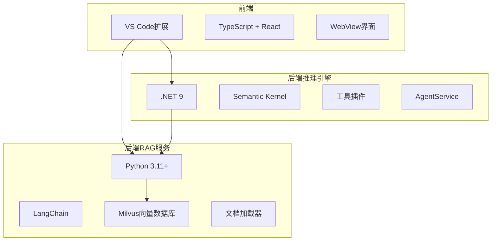

**图示来源**  
- [QUICK_START.md](file://QUICK_START.md#L5-L12)

**本节来源**  
- [QUICK_START.md](file://QUICK_START.md#L5-L12)

## 核心组件
ALAgent的核心功能由三个主要组件协同实现：前端扩展负责用户交互，后端推理引擎处理智能决策，后端RAG服务提供上下文检索。这些组件通过清晰的API接口进行通信，形成了一个高效的开发辅助系统。

**本节来源**  
- [QUICK_START.md](file://QUICK_START.md#L5-L12)
- [ChatController.cs](file://backend-agent/Controllers/ChatController.cs#L7-L45)
- [extension.ts](file://frontend-extension/src/extension.ts#L11-L74)

## 语义内核插件扩展
Semantic Kernel插件是ALAgent功能扩展的核心机制。通过创建新的工具类，开发者可以为AI代理添加各种功能，如文件系统操作、代码分析等。插件的创建遵循特定的模式和规范，确保与Semantic Kernel框架的无缝集成。

### 工具类创建规范
创建新的Semantic Kernel插件需要遵循以下步骤和规范：

1. **类定义**：创建一个公共类，通常以"Tools"结尾
2. **方法装饰**：使用`[KernelFunction]`和`[Description]`属性标记工具方法
3. **异步实现**：所有工具方法应为异步方法，返回`Task<string>`
4. **错误处理**：在try-catch块中实现，返回用户友好的错误信息
5. **参数描述**：使用`[Description]`属性描述每个参数的用途

```mermaid
classDiagram
class FileSystemTools {
+ListFilesAsync(path : string, recursive : bool) string
+ReadFileAsync(path : string) string
+WriteFileAsync(path : string, content : string) string
+DeleteFileAsync(path : string) string
+FileExistsAsync(path : string) string
}
class CodeAnalysisTools {
+SearchCodeAsync(directory : string, pattern : string, fileExtension : string?) string
+GetFileStructureAsync(path : string) string
+ExecuteCommandAsync(command : string, workingDirectory : string?) string
}
note right of FileSystemTools
文件系统工具类
提供文件和目录操作功能
end note
note right of CodeAnalysisTools
代码分析工具类
提供代码搜索和结构分析功能
end note
```

**图示来源**  
- [FileSystemTools.cs](file://backend-agent/Tools/FileSystemTools.cs#L7-L151)
- [CodeAnalysisTools.cs](file://backend-agent/Tools/CodeAnalysisTools.cs#L8-L252)

**本节来源**  
- [FileSystemTools.cs](file://backend-agent/Tools/FileSystemTools.cs#L7-L151)
- [CodeAnalysisTools.cs](file://backend-agent/Tools/CodeAnalysisTools.cs#L8-L252)

### 工具方法实现示例
以下是一个典型的工具方法实现模式，以`ListFilesAsync`为例：

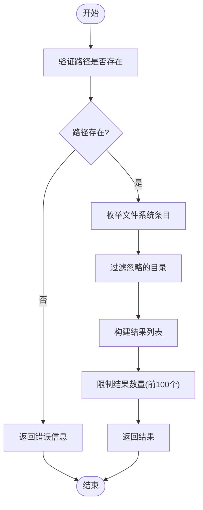

**图示来源**  
- [FileSystemTools.cs](file://backend-agent/Tools/FileSystemTools.cs#L11-L45)

**本节来源**  
- [FileSystemTools.cs](file://backend-agent/Tools/FileSystemTools.cs#L11-L45)

### 工具注册机制
工具插件在应用程序启动时通过`Program.cs`文件中的依赖注入系统进行注册。Semantic Kernel框架会自动发现并加载这些工具，使其可供AI代理调用。

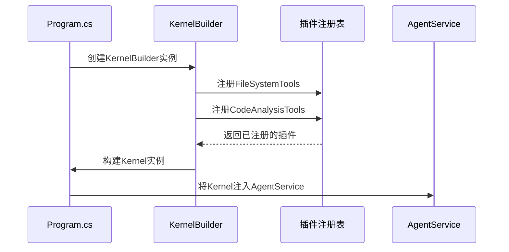

**图示来源**  
- [Program.cs](file://backend-agent/Program.cs#L45-L47)
- [AgentService.cs](file://backend-agent/Services/AgentService.cs#L34-L44)

**本节来源**  
- [Program.cs](file://backend-agent/Program.cs#L45-L47)
- [AgentService.cs](file://backend-agent/Services/AgentService.cs#L34-L44)

## RAG服务集成与扩展
RAG（检索增强生成）服务是ALAgent智能能力的关键组成部分，它通过语义搜索为AI代理提供相关的代码上下文。IRagClient接口定义了与RAG服务通信的标准方式，开发者可以通过实现此接口来集成自定义的数据源。

### IRagClient接口实现
`IRagClient`接口使用Refit库定义了与RAG服务通信的HTTP API契约。该接口包含两个主要方法：`QueryAsync`用于检索相关代码片段，`HealthCheckAsync`用于检查服务健康状态。

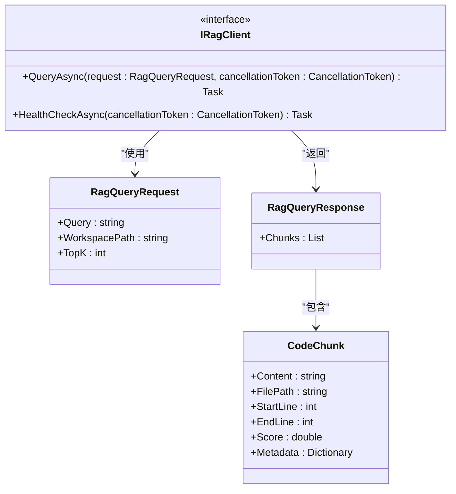

**图示来源**  
- [IRagClient.cs](file://backend-agent/Services/IRagClient.cs#L6-L13)
- [ChatModels.cs](file://backend-agent/Models/ChatModels.cs#L32-L49)

**本节来源**  
- [IRagClient.cs](file://backend-agent/Services/IRagClient.cs#L6-L13)
- [ChatModels.cs](file://backend-agent/Models/ChatModels.cs#L32-L49)

### RAG服务工作流程
当AI代理需要上下文信息时，会通过`AgentService`调用RAG服务。以下是完整的请求处理流程：

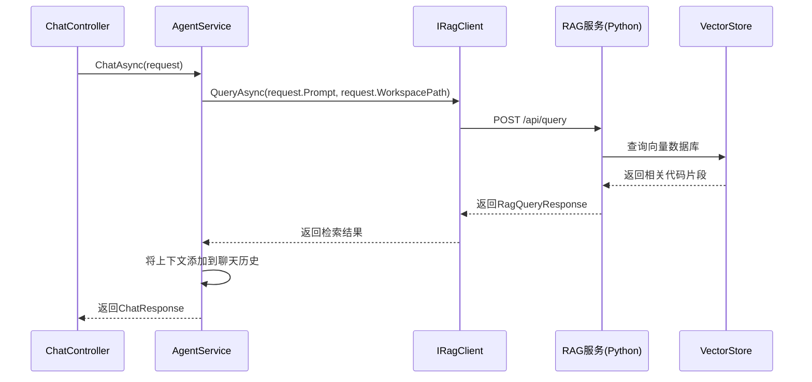

**图示来源**  
- [AgentService.cs](file://backend-agent/Services/AgentService.cs#L55-L59)
- [main.py](file://backend-rag/app/main.py#L65-L86)

**本节来源**  
- [AgentService.cs](file://backend-agent/Services/AgentService.cs#L55-L59)
- [main.py](file://backend-rag/app/main.py#L65-L86)

### 自定义数据源扩展
RAG服务支持多种数据源的集成，包括GitHub仓库、PDF文档、网页内容等。开发者可以通过实现新的加载器来扩展数据源支持。

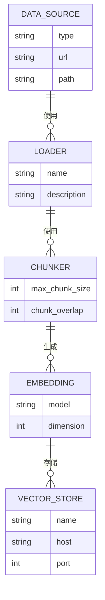

**图示来源**  
- [main.py](file://backend-rag/app/main.py#L143-L342)
- [vector_store.py](file://backend-rag/app/vector_store.py#L42-L469)

**本节来源**  
- [main.py](file://backend-rag/app/main.py#L143-L342)
- [vector_store.py](file://backend-rag/app/vector_store.py#L42-L469)

## 前端WebView扩展
前端扩展是用户与ALAgent交互的主要界面，基于VS Code的WebView技术构建。通过`ChatViewProvider`类，开发者可以定制用户界面、处理消息通信并集成VS Code的原生功能。

### WebView消息处理机制
前端扩展使用消息传递机制在WebView和VS Code扩展主机之间进行通信。这种设计模式实现了界面渲染与业务逻辑的分离。

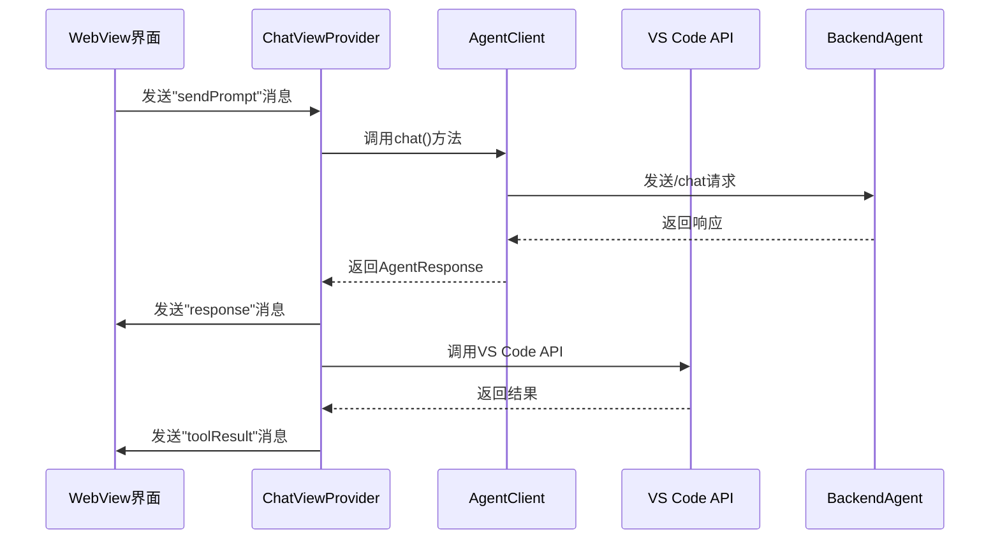

**图示来源**  
- [ChatViewProvider.ts](file://frontend-extension/src/core/ChatViewProvider.ts#L55-L81)
- [AgentClient.ts](file://frontend-extension/src/services/AgentClient.ts#L31-L34)

**本节来源**  
- [ChatViewProvider.ts](file://frontend-extension/src/core/ChatViewProvider.ts#L55-L81)
- [AgentClient.ts](file://frontend-extension/src/services/AgentClient.ts#L31-L34)

### 扩展点定制方法
开发者可以通过以下方式定制前端扩展功能：

1. **消息类型扩展**：在`types.ts`中定义新的消息类型
2. **UI组件定制**：修改`webview`目录下的React组件
3. **VS Code集成**：使用VS Code API访问编辑器功能
4. **状态管理**：扩展`AgentState`枚举以支持新的状态

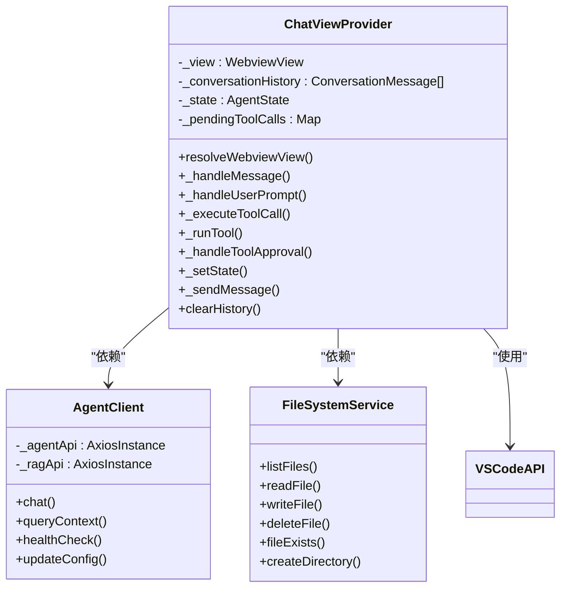

**图示来源**  
- [ChatViewProvider.ts](file://frontend-extension/src/core/ChatViewProvider.ts#L15-L325)
- [AgentClient.ts](file://frontend-extension/src/services/AgentClient.ts#L4-L61)
- [FileSystemService.ts](file://frontend-extension/src/services/FileSystemService.ts#L13-L133)

**本节来源**  
- [ChatViewProvider.ts](file://frontend-extension/src/core/ChatViewProvider.ts#L15-L325)
- [AgentClient.ts](file://frontend-extension/src/services/AgentClient.ts#L4-L61)
- [FileSystemService.ts](file://frontend-extension/src/services/FileSystemService.ts#L13-L133)

## 最佳实践与安全考量
在扩展ALAgent功能时，必须遵循一系列最佳实践和安全准则，以确保系统的稳定性、安全性和用户体验。

### 工具安全审批机制
对于可能影响系统安全的操作（如文件写入、命令执行），必须实现用户审批机制。这种设计模式确保了AI代理的操作透明性和用户控制权。

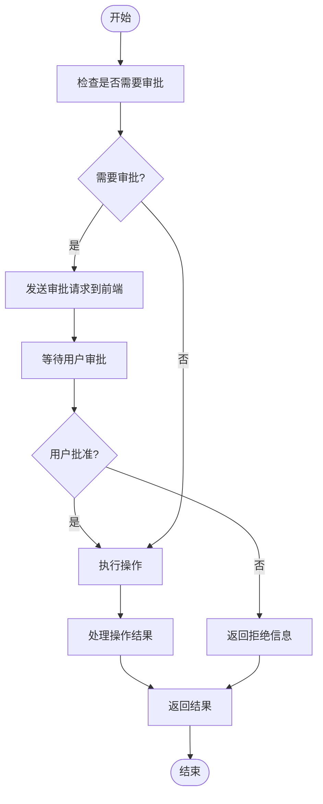

**图示来源**  
- [CodeAnalysisTools.cs](file://backend-agent/Tools/CodeAnalysisTools.cs#L109-L110)
- [ChatViewProvider.ts](file://frontend-extension/src/core/ChatViewProvider.ts#L162-L166)

**本节来源**  
- [CodeAnalysisTools.cs](file://backend-agent/Tools/CodeAnalysisTools.cs#L109-L110)
- [ChatViewProvider.ts](file://frontend-extension/src/core/ChatViewProvider.ts#L162-L166)

### 错误处理策略
健壮的错误处理是确保系统稳定性的关键。所有工具方法都应在try-catch块中实现，并返回用户友好的错误信息，而不是暴露内部异常细节。

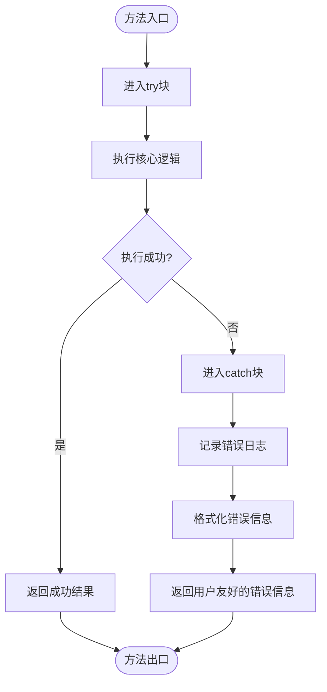

**图示来源**  
- [FileSystemTools.cs](file://backend-agent/Tools/FileSystemTools.cs#L15-L49)
- [CodeAnalysisTools.cs](file://backend-agent/Tools/CodeAnalysisTools.cs#L74-L77)

**本节来源**  
- [FileSystemTools.cs](file://backend-agent/Tools/FileSystemTools.cs#L15-L49)
- [CodeAnalysisTools.cs](file://backend-agent/Tools/CodeAnalysisTools.cs#L74-L77)

### 性能优化建议
为了确保ALAgent的响应性能，开发者应遵循以下优化建议：

1. **限制结果数量**：避免返回过多数据，如`ListFilesAsync`限制为前100个结果
2. **文件大小限制**：设置合理的文件大小上限，如`ReadFileAsync`限制为1MB
3. **异步操作**：所有I/O操作应使用异步方法，避免阻塞主线程
4. **缓存机制**：对于频繁访问的数据，考虑实现缓存策略

**本节来源**  
- [FileSystemTools.cs](file://backend-agent/Tools/FileSystemTools.cs#L65-L68)
- [FileSystemTools.cs](file://backend-agent/Tools/FileSystemTools.cs#L42-L44)

## 测试建议
为了确保扩展功能的正确性和稳定性，建议采用多层次的测试策略。

### 单元测试
为每个工具方法编写单元测试，验证其在各种输入条件下的行为。测试应覆盖正常情况、边界情况和错误情况。

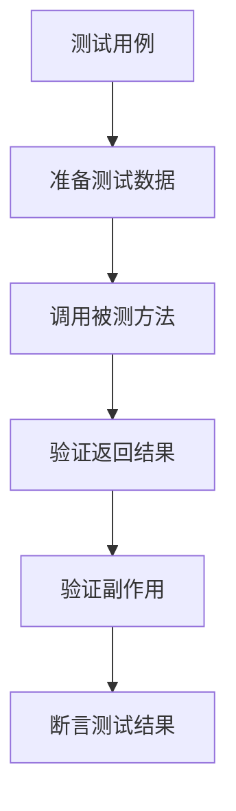

**本节来源**  
- [QUICK_START.md](file://QUICK_START.md#L85-L93)

### 集成测试
测试工具插件与Semantic Kernel框架的集成，确保AI代理能够正确识别和调用新工具。

### 端到端测试
模拟完整的用户交互流程，从前端界面输入到后端处理再到结果返回，验证整个系统的协同工作。

## 总结
本指南详细介绍了ALAgent的扩展开发方法，涵盖了从后端工具插件创建到前端界面定制的各个方面。通过遵循本文档中的指导原则和最佳实践，开发者可以有效地扩展ALAgent的功能，为其添加新的工具类、集成自定义服务并定制用户界面。关键要点包括：

1. **语义内核插件**：遵循标准模式创建工具类，使用适当的属性标记方法和参数
2. **RAG服务集成**：通过实现IRagClient接口或扩展RAG服务来支持新的数据源
3. **前端扩展**：利用WebView消息机制定制用户界面和交互流程
4. **安全与性能**：实施用户审批机制，进行健壮的错误处理，并优化性能

通过这些扩展机制，ALAgent可以不断进化，适应各种开发场景和需求，成为更强大的开发辅助工具。