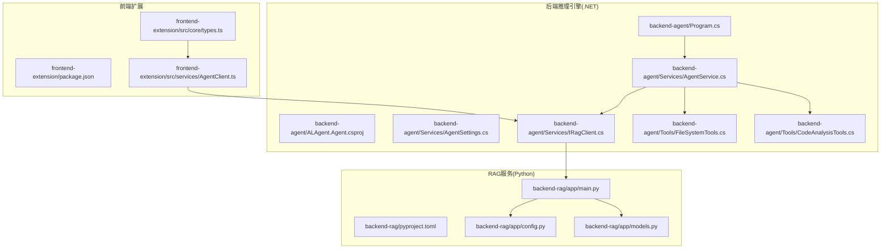
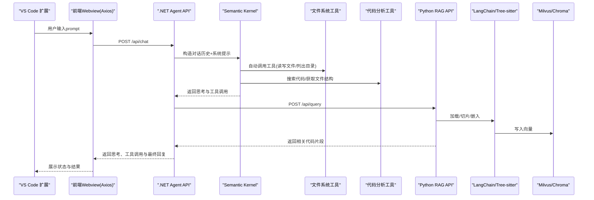
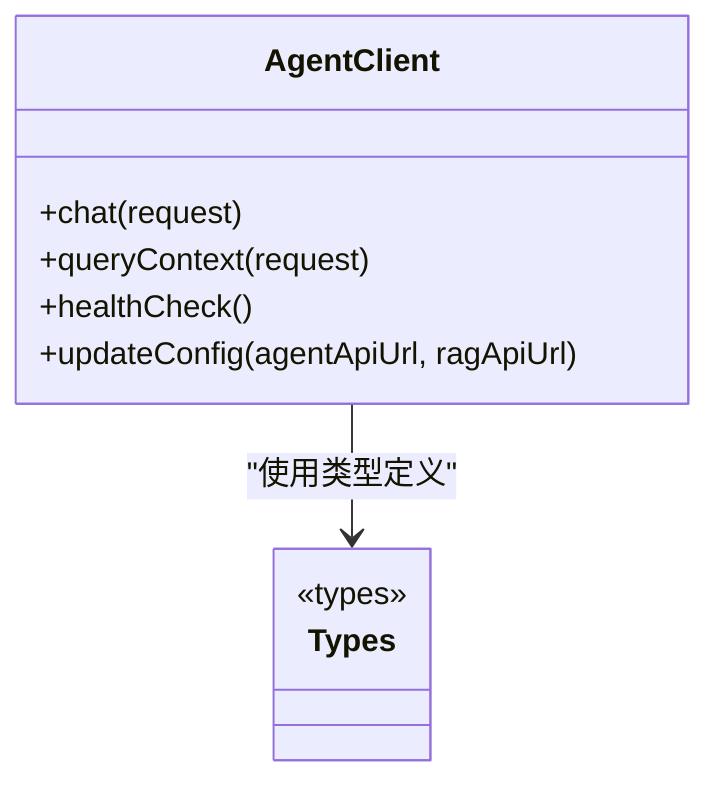
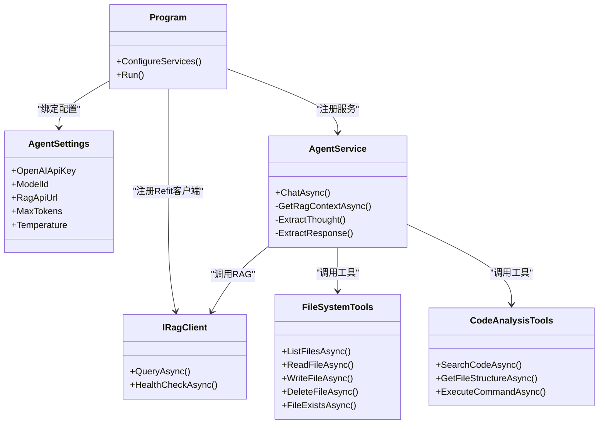
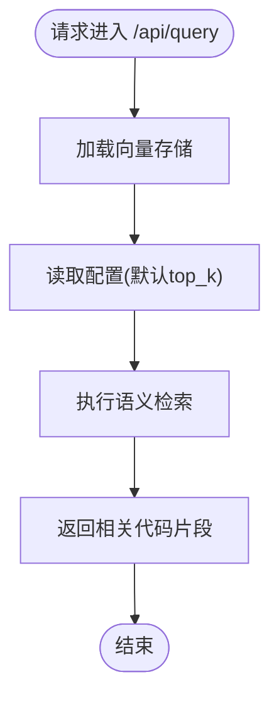
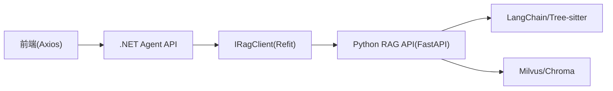

# 技术栈与依赖

<cite>
**本文引用的文件**
- [package.json](file://frontend-extension/package.json)
- [vite.config.ts](file://frontend-extension/vite.config.ts)
- [tsconfig.json](file://frontend-extension/tsconfig.json)
- [AgentClient.ts](file://frontend-extension/src/services/AgentClient.ts)
- [types.ts](file://frontend-extension/src/core/types.ts)
- [pyproject.toml](file://backend-rag/pyproject.toml)
- [main.py](file://backend-rag/app/main.py)
- [config.py](file://backend-rag/app/config.py)
- [models.py](file://backend-rag/app/models.py)
- [ALAgent.Agent.csproj](file://backend-agent/ALAgent.Agent.csproj)
- [Program.cs](file://backend-agent/Program.cs)
- [AgentSettings.cs](file://backend-agent/Services/AgentSettings.cs)
- [IRagClient.cs](file://backend-agent/Services/IRagClient.cs)
- [AgentService.cs](file://backend-agent/Services/AgentService.cs)
- [FileSystemTools.cs](file://backend-agent/Tools/FileSystemTools.cs)
- [CodeAnalysisTools.cs](file://backend-agent/Tools/CodeAnalysisTools.cs)
- [QUICK_START.md](file://QUICK_START.md)
</cite>

## 目录
1. [引言](#引言)
2. [项目结构](#项目结构)
3. [核心组件](#核心组件)
4. [架构总览](#架构总览)
5. [详细组件分析](#详细组件分析)
6. [依赖关系分析](#依赖关系分析)
7. [性能考虑](#性能考虑)
8. [故障排查指南](#故障排查指南)
9. [结论](#结论)
10. [附录](#附录)

## 引言
本节概述ALAgent项目的三层技术栈：前端扩展（TypeScript + React + Vite + VS Code Extension API）、后端推理引擎（.NET 9 + Semantic Kernel + Refit）与RAG服务（Python + FastAPI + LangChain + Pydantic + Tree-sitter + ChromaDB/Milvus）。我们将基于仓库中的配置文件与源码，系统梳理各层技术选型、依赖版本、功能定位与集成方式，并给出版本兼容性提示、依赖冲突解决策略与升级建议，同时提供官方文档资源链接以便进一步学习。

## 项目结构
ALAgent采用多模块分层架构：
- 前端扩展：VS Code 扩展宿主，使用TypeScript + React + Vite构建Webview界面，通过VS Code Extension API与编辑器交互。
- 后端推理引擎：.NET 9 Web应用，使用Semantic Kernel进行推理与工具调用，通过Refit消费RAG服务。
- RAG服务：Python FastAPI服务，使用LangChain进行链式处理与数据加载，Pydantic进行请求/响应建模，Tree-sitter进行语法切片，向量存储采用Milvus（通过langchain-milvus）。

图表来源
- [package.json](file://frontend-extension/package.json#L1-L100)
- [types.ts](file://frontend-extension/src/core/types.ts#L1-L151)
- [AgentClient.ts](file://frontend-extension/src/services/AgentClient.ts#L1-L61)
- [ALAgent.Agent.csproj](file://backend-agent/ALAgent.Agent.csproj#L1-L18)
- [Program.cs](file://backend-agent/Program.cs#L1-L67)
- [AgentSettings.cs](file://backend-agent/Services/AgentSettings.cs#L1-L10)
- [IRagClient.cs](file://backend-agent/Services/IRagClient.cs#L1-L14)
- [AgentService.cs](file://backend-agent/Services/AgentService.cs#L32-L179)
- [FileSystemTools.cs](file://backend-agent/Tools/FileSystemTools.cs#L1-L151)
- [CodeAnalysisTools.cs](file://backend-agent/Tools/CodeAnalysisTools.cs#L1-L252)
- [pyproject.toml](file://backend-rag/pyproject.toml#L1-L67)
- [main.py](file://backend-rag/app/main.py#L1-L343)
- [config.py](file://backend-rag/app/config.py#L1-L51)
- [models.py](file://backend-rag/app/models.py#L1-L88)

章节来源
- [QUICK_START.md](file://QUICK_START.md#L1-L93)

## 核心组件
本节从三层视角梳理关键技术栈与依赖版本，并解释其功能定位与协作方式。

- 前端扩展（TypeScript + React + Vite + VS Code Extension API）
  - TypeScript：类型安全与开发体验保障，配合ESLint与TS编译器。
  - React + @vitejs/plugin-react：构建Webview界面，提供组件化UI。
  - Vite：快速构建与热更新，提升开发效率。
  - VS Code Extension API：注册视图容器、视图、命令与配置项，桥接VS Code与Webview。
  - Axios：HTTP客户端，封装对.NET Agent API与Python RAG API的调用。
  - Zod：消息协议与数据校验，确保前后端通信结构一致。
  - 依赖版本参考：
    - TypeScript、@types/*、@vitejs/plugin-react、vite、@vscode/webview-ui-toolkit、axios、react、react-dom、zod等见前端package.json。
    - VS Code引擎版本要求见前端package.json中engines字段。
  - 功能定位：
    - 作为用户交互入口，负责消息协议编解码、状态机管理、工具调用审批与结果展示。
    - 通过Axios与.NET Agent API、Python RAG API进行异步通信。

- 后端推理引擎（.NET 9 + Semantic Kernel + Refit）
  - .NET 9：目标框架，提供高性能运行时与现代化特性。
  - Semantic Kernel：推理内核，集成OpenAI聊天补全，自动函数调用（工具），插件化工具注册。
  - Refit：声明式HTTP客户端生成器，自动生成IRagClient接口实现，简化RAG服务调用。
  - 依赖版本参考：
    - Microsoft.SemanticKernel、Microsoft.SemanticKernel.Connectors.OpenAI、Refit、Refit.HttpClientFactory见.csproj。
  - 功能定位：
    - 接收前端prompt与历史消息，注入RAG上下文，执行工具调用，返回思考过程、工具调用与最终回复。
    - 通过Refit消费RAG服务，实现代码上下文检索与工具链路闭环。

- RAG服务（Python + FastAPI + LangChain + Pydantic + Tree-sitter + Milvus/Chroma）
  - FastAPI：高性能异步Web框架，自动生成OpenAPI文档，内置CORS支持。
  - LangChain：链式处理与数据加载，支持多种数据源（网页、GitHub、PDF、URL）。
  - Pydantic：请求/响应模型校验与序列化，保证API契约清晰。
  - Tree-sitter：语法树解析与代码切片，提升语义分块质量。
  - Milvus：向量数据库（通过langchain-milvus），支撑语义检索。
  - 依赖版本参考：
    - fastapi、uvicorn、langchain、langchain-openai、langchain-community、langchain-milvus、pymilvus、tree-sitter、pydantic、pydantic-settings、httpx、tiktoken、pytest、ruff、mypy等见pyproject.toml。
  - 功能定位：
    - 提供查询与索引接口，支持多源文档加载与嵌入入库，返回相关代码片段。

章节来源
- [package.json](file://frontend-extension/package.json#L1-L100)
- [vite.config.ts](file://frontend-extension/vite.config.ts#L1-L200)
- [tsconfig.json](file://frontend-extension/tsconfig.json#L1-L200)
- [AgentClient.ts](file://frontend-extension/src/services/AgentClient.ts#L1-L61)
- [types.ts](file://frontend-extension/src/core/types.ts#L1-L151)
- [ALAgent.Agent.csproj](file://backend-agent/ALAgent.Agent.csproj#L1-L18)
- [Program.cs](file://backend-agent/Program.cs#L1-L67)
- [AgentSettings.cs](file://backend-agent/Services/AgentSettings.cs#L1-L10)
- [IRagClient.cs](file://backend-agent/Services/IRagClient.cs#L1-L14)
- [AgentService.cs](file://backend-agent/Services/AgentService.cs#L32-L179)
- [FileSystemTools.cs](file://backend-agent/Tools/FileSystemTools.cs#L1-L151)
- [CodeAnalysisTools.cs](file://backend-agent/Tools/CodeAnalysisTools.cs#L1-L252)
- [pyproject.toml](file://backend-rag/pyproject.toml#L1-L67)
- [main.py](file://backend-rag/app/main.py#L1-L343)
- [config.py](file://backend-rag/app/config.py#L1-L51)
- [models.py](file://backend-rag/app/models.py#L1-L88)

## 架构总览
下图展示了三层之间的交互流程：前端通过Axios调用.NET Agent API，Agent通过Refit调用Python RAG API，RAG服务内部使用LangChain与Tree-sitter进行数据处理与向量检索。

图表来源
- [AgentClient.ts](file://frontend-extension/src/services/AgentClient.ts#L1-L61)
- [Program.cs](file://backend-agent/Program.cs#L1-L67)
- [AgentService.cs](file://backend-agent/Services/AgentService.cs#L32-L179)
- [IRagClient.cs](file://backend-agent/Services/IRagClient.cs#L1-L14)
- [main.py](file://backend-rag/app/main.py#L1-L343)
- [models.py](file://backend-rag/app/models.py#L1-L88)

## 详细组件分析

### 前端组件分析（TypeScript + React + Vite + VS Code Extension API）
- 技术要点
  - 使用Zod对消息协议进行强类型校验，确保前后端通信一致性。
  - Axios实例分别指向.NET Agent API与Python RAG API，设置合理超时与内容类型。
  - 通过VS Code Extension API注册视图容器、视图与命令，暴露配置项（Agent/RAG API地址、OpenAI密钥）。
  - Vite配置与TypeScript配置确保开发体验与构建产物质量。
- 关键实现路径
  - 消息协议与类型定义：[types.ts](file://frontend-extension/src/core/types.ts#L1-L151)
  - HTTP客户端封装：[AgentClient.ts](file://frontend-extension/src/services/AgentClient.ts#L1-L61)
  - 扩展入口与贡献项：[package.json](file://frontend-extension/package.json#L1-L100)
  - 构建与开发配置：[vite.config.ts](file://frontend-extension/vite.config.ts#L1-L200)、[tsconfig.json](file://frontend-extension/tsconfig.json#L1-L200)

图表来源
- [AgentClient.ts](file://frontend-extension/src/services/AgentClient.ts#L1-L61)
- [types.ts](file://frontend-extension/src/core/types.ts#L1-L151)

章节来源
- [package.json](file://frontend-extension/package.json#L1-L100)
- [AgentClient.ts](file://frontend-extension/src/services/AgentClient.ts#L1-L61)
- [types.ts](file://frontend-extension/src/core/types.ts#L1-L151)
- [vite.config.ts](file://frontend-extension/vite.config.ts#L1-L200)
- [tsconfig.json](file://frontend-extension/tsconfig.json#L1-L200)

### 后端推理引擎组件分析（.NET 9 + Semantic Kernel + Refit）
- 技术要点
  - .NET 9 + WebApplicationBuilder：快速搭建Web API，启用CORS以支持Webview通信。
  - Semantic Kernel：注册OpenAI聊天补全，注册文件系统与代码分析工具为插件，开启自动函数调用。
  - Refit：通过AddRefitClient生成IRagClient，统一RAG服务调用。
  - 配置注入：AgentSettings承载OpenAI密钥、模型ID、RAG服务地址等。
- 关键实现路径
  - 依赖与框架配置：[Program.cs](file://backend-agent/Program.cs#L1-L67)
  - 依赖声明：[ALAgent.Agent.csproj](file://backend-agent/ALAgent.Agent.csproj#L1-L18)
  - 配置模型：[AgentSettings.cs](file://backend-agent/Services/AgentSettings.cs#L1-L10)
  - RAG客户端接口：[IRagClient.cs](file://backend-agent/Services/IRagClient.cs#L1-L14)
  - 推理服务与工具调用：[AgentService.cs](file://backend-agent/Services/AgentService.cs#L32-L179)
  - 工具实现：[FileSystemTools.cs](file://backend-agent/Tools/FileSystemTools.cs#L1-L151)、[CodeAnalysisTools.cs](file://backend-agent/Tools/CodeAnalysisTools.cs#L1-L252)

图表来源
- [Program.cs](file://backend-agent/Program.cs#L1-L67)
- [AgentSettings.cs](file://backend-agent/Services/AgentSettings.cs#L1-L10)
- [IRagClient.cs](file://backend-agent/Services/IRagClient.cs#L1-L14)
- [AgentService.cs](file://backend-agent/Services/AgentService.cs#L32-L179)
- [FileSystemTools.cs](file://backend-agent/Tools/FileSystemTools.cs#L1-L151)
- [CodeAnalysisTools.cs](file://backend-agent/Tools/CodeAnalysisTools.cs#L1-L252)

章节来源
- [Program.cs](file://backend-agent/Program.cs#L1-L67)
- [ALAgent.Agent.csproj](file://backend-agent/ALAgent.Agent.csproj#L1-L18)
- [AgentSettings.cs](file://backend-agent/Services/AgentSettings.cs#L1-L10)
- [IRagClient.cs](file://backend-agent/Services/IRagClient.cs#L1-L14)
- [AgentService.cs](file://backend-agent/Services/AgentService.cs#L32-L179)
- [FileSystemTools.cs](file://backend-agent/Tools/FileSystemTools.cs#L1-L151)
- [CodeAnalysisTools.cs](file://backend-agent/Tools/CodeAnalysisTools.cs#L1-L252)

### RAG服务组件分析（Python + FastAPI + LangChain + Pydantic + Tree-sitter + Milvus）
- 技术要点
  - FastAPI：提供健康检查、查询、索引与多源加载接口，内置CORS。
  - LangChain：统一的数据加载与链式处理，支持Playwright渲染、GitHub克隆、PDF解析等。
  - Pydantic：严格的数据模型定义，确保请求/响应一致性。
  - Tree-sitter：按语言解析代码，进行高保真切片。
  - Milvus：向量存储，支持大规模语义检索。
- 关键实现路径
  - 应用入口与路由：[main.py](file://backend-rag/app/main.py#L1-L343)
  - 配置模型：[config.py](file://backend-rag/app/config.py#L1-L51)
  - 请求/响应模型：[models.py](file://backend-rag/app/models.py#L1-L88)
  - 依赖声明与版本：[pyproject.toml](file://backend-rag/pyproject.toml#L1-L67)

图表来源
- [main.py](file://backend-rag/app/main.py#L65-L90)
- [models.py](file://backend-rag/app/models.py#L1-L40)
- [config.py](file://backend-rag/app/config.py#L1-L51)

章节来源
- [pyproject.toml](file://backend-rag/pyproject.toml#L1-L67)
- [main.py](file://backend-rag/app/main.py#L1-L343)
- [config.py](file://backend-rag/app/config.py#L1-L51)
- [models.py](file://backend-rag/app/models.py#L1-L88)

## 依赖关系分析
- 前端到后端
  - 前端通过Axios调用.NET Agent API（/api/chat），Agent通过Refit调用Python RAG API（/api/query）。
- 后端到RAG
  - AgentService在推理过程中调用IRagClient.QueryAsync，将用户prompt与工作区路径传递给RAG服务。
- RAG内部
  - main.py根据请求类型选择对应loader（Web、GitHub、PDF、URL），使用Tree-sitter进行切片，LangChain生成嵌入并写入Milvus。
- 配置与环境
  - 前端配置项包含Agent/RAG API地址与OpenAI密钥；后端.NET与Python均通过配置/环境变量注入密钥与模型参数。

图表来源
- [AgentClient.ts](file://frontend-extension/src/services/AgentClient.ts#L1-L61)
- [IRagClient.cs](file://backend-agent/Services/IRagClient.cs#L1-L14)
- [main.py](file://backend-rag/app/main.py#L1-L343)
- [models.py](file://backend-rag/app/models.py#L1-L88)

章节来源
- [AgentClient.ts](file://frontend-extension/src/services/AgentClient.ts#L1-L61)
- [IRagClient.cs](file://backend-agent/Services/IRagClient.cs#L1-L14)
- [main.py](file://backend-rag/app/main.py#L1-L343)
- [models.py](file://backend-rag/app/models.py#L1-L88)

## 性能考虑
- 前端
  - Vite热更新与React组件化可显著提升开发效率；Axios超时设置需平衡LLM推理时间与用户体验。
- 后端推理引擎
  - Semantic Kernel的自动函数调用会增加网络往返，建议在AgentService中合并工具调用与LLM推理，减少不必要的重复请求。
  - 文件系统与代码分析工具存在IO与正则匹配开销，建议限制扫描范围与结果数量。
- RAG服务
  - Tree-sitter解析与LangChain嵌入生成是CPU密集型操作，建议在索引阶段并行化处理，并控制chunk大小与重叠度以平衡召回与精度。
  - Milvus连接池与查询top_k参数直接影响延迟，应结合业务场景调优。

## 故障排查指南
- 健康检查
  - 前端可通过AgentClient.healthCheck分别探测.NET Agent API与Python RAG API的可用性。
  - .NET与Python均提供/health端点，用于快速判断服务与向量存储连通性。
- 常见问题
  - 端口冲突：确认.NET Agent API（默认5000）与Python RAG API（默认8000）未被占用。
  - API密钥缺失：检查VS Code设置与后端配置/环境变量是否正确注入OpenAI密钥。
  - 跨域问题：.NET启用CORS允许Webview来源，Python启用CORS中间件。
- 参考路径
  - 健康检查端点与CORS配置：[Program.cs](file://backend-agent/Program.cs#L1-L67)、[main.py](file://backend-rag/app/main.py#L1-L120)
  - 前端健康检查方法：[AgentClient.ts](file://frontend-extension/src/services/AgentClient.ts#L1-L61)

章节来源
- [Program.cs](file://backend-agent/Program.cs#L1-L67)
- [main.py](file://backend-rag/app/main.py#L1-L120)
- [AgentClient.ts](file://frontend-extension/src/services/AgentClient.ts#L1-L61)

## 结论
ALAgent通过三层技术栈实现了从VS Code扩展到推理引擎再到RAG服务的完整链路。前端以TypeScript + React + Vite提供流畅的交互体验，后端利用Semantic Kernel与Refit实现强大的推理与工具调用能力，RAG服务依托FastAPI + LangChain + Tree-sitter + Milvus实现高质量的代码上下文检索。遵循本文提供的版本兼容性提示与升级建议，可有效降低依赖冲突风险并提升系统稳定性。

## 附录
- 版本兼容性提示
  - 前端：Node.js 18+、TypeScript 5.x、Vite 5.x、React 18.x、VS Code 1.85+。
  - 后端：.NET 9 SDK、Semantic Kernel 1.25.0、Refit 7.2.1。
  - RAG：Python 3.11+、FastAPI 0.109+、LangChain 0.1+、Pydantic 2.5+、Tree-sitter 0.21+、Milvus 2.4+。
- 升级建议
  - 前端：优先升级Vite与React至稳定版本，保持与VS Code Extension API兼容；逐步升级TypeScript以获得更好的类型推断。
  - 后端：关注Semantic Kernel与Refit的API变更，注意工具函数签名与自动函数调用行为的兼容性。
  - RAG：LangChain与Tree-sitter版本更新频繁，建议锁定次要版本并定期评估迁移成本；Milvus升级需同步评估向量索引与兼容性。
- 官方文档资源
  - .NET 9：https://learn.microsoft.com/zh-cn/dotnet/
  - Semantic Kernel：https://learn.microsoft.com/zh-cn/semantic-kernel/
  - Refit：https://github.com/reactiveui/refit
  - FastAPI：https://fastapi.tiangolo.com/
  - LangChain：https://python.langchain.com/
  - Pydantic：https://docs.pydantic.dev/
  - Tree-sitter：https://tree-sitter.github.io/
  - Milvus：https://milvus.io/docs/

章节来源
- [QUICK_START.md](file://QUICK_START.md#L1-L93)
- [package.json](file://frontend-extension/package.json#L1-L100)
- [ALAgent.Agent.csproj](file://backend-agent/ALAgent.Agent.csproj#L1-L18)
- [pyproject.toml](file://backend-rag/pyproject.toml#L1-L67)