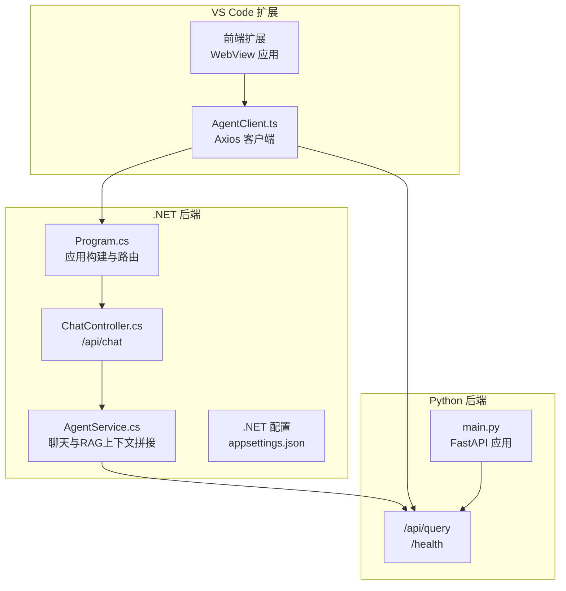
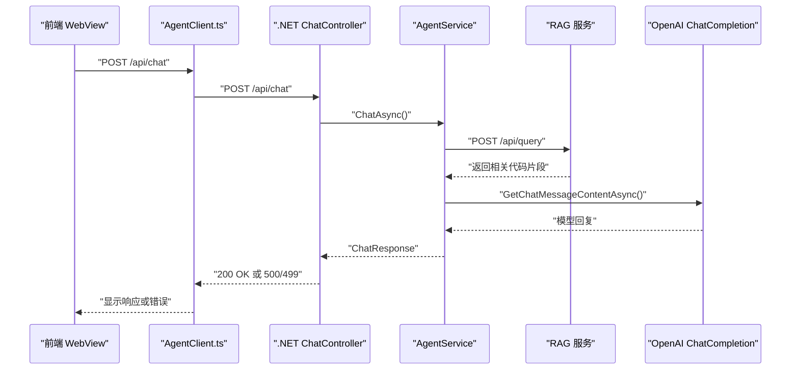
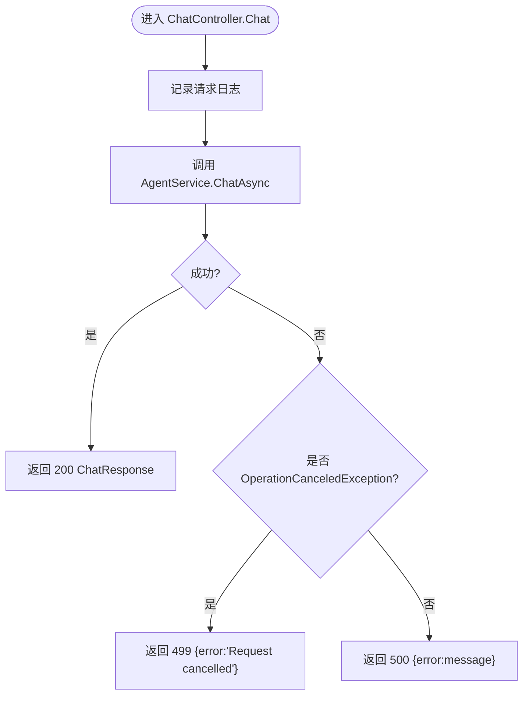
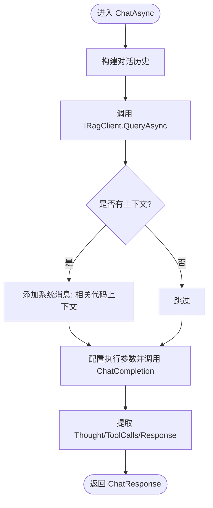
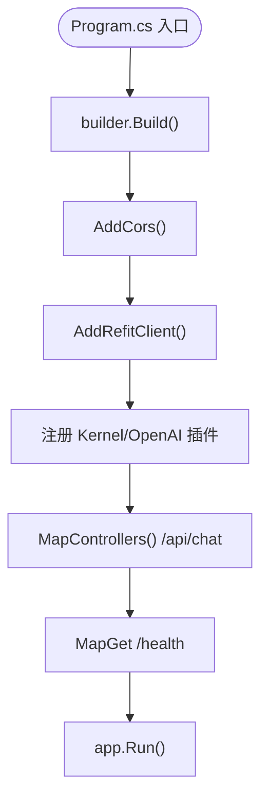
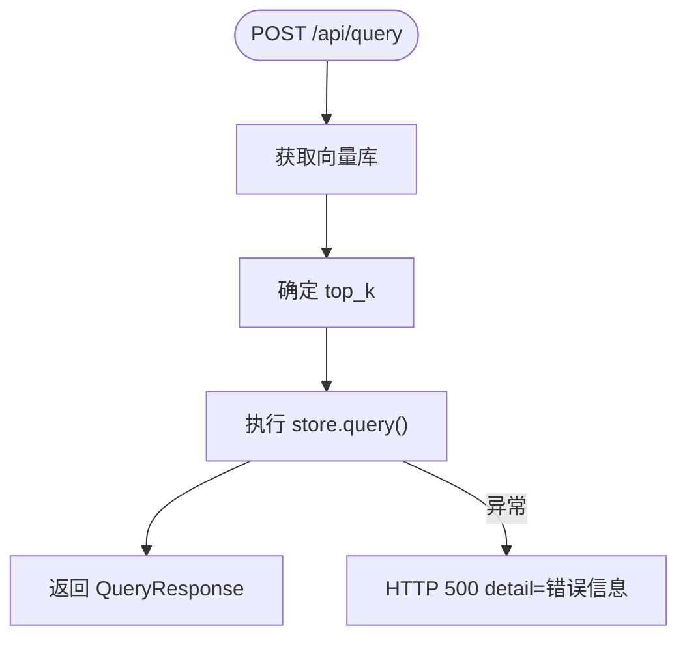
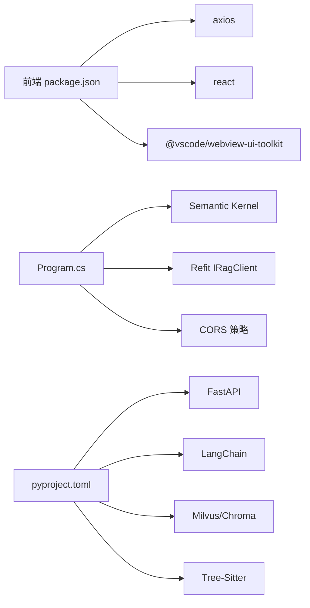

# 故障排除

<cite>
**本文引用的文件**
- [ChatController.cs](file://backend-agent/Controllers/ChatController.cs)
- [AgentService.cs](file://backend-agent/Services/AgentService.cs)
- [AgentClient.ts](file://frontend-extension/src/services/AgentClient.ts)
- [Program.cs](file://backend-agent/Program.cs)
- [appsettings.json](file://backend-agent/appsettings.json)
- [IRagClient.cs](file://backend-agent/Services/IRagClient.cs)
- [ChatModels.cs](file://backend-agent/Models/ChatModels.cs)
- [main.py](file://backend-rag/app/main.py)
- [App.tsx](file://frontend-extension/src/webview/App.tsx)
- [launchSettings.json](file://backend-agent/Properties/launchSettings.json)
- [AgentSettings.cs](file://backend-agent/Services/AgentSettings.cs)
- [pyproject.toml](file://backend-rag/pyproject.toml)
- [package.json](file://frontend-extension/package.json)
- [appsettings.Development.json](file://backend-agent/appsettings.Development.json)
</cite>

## 目录
1. [简介](#简介)
2. [项目结构](#项目结构)
3. [核心组件](#核心组件)
4. [架构总览](#架构总览)
5. [详细组件分析](#详细组件分析)
6. [依赖关系分析](#依赖关系分析)
7. [性能与超时注意事项](#性能与超时注意事项)
8. [故障排除指南](#故障排除指南)
9. [结论](#结论)
10. [附录](#附录)

## 简介
本手册面向使用 ALAgent 的用户，聚焦常见问题的诊断与解决，包括：
- 服务启动失败（端口占用、依赖缺失）
- API 调用错误（500 错误、超时）
- RAG 检索不准
- 前端无响应

我们将以 ChatController 和 AgentClient 的错误处理逻辑为依据，结合后端 .NET 与 Python 服务的健康检查与日志策略，提供可操作的诊断步骤与修复建议，并给出调试技巧（启用详细日志、使用 Postman 测试 API、浏览器开发者工具检查 WebView 通信）。

## 项目结构
ALAgent 由三部分组成：
- 后端智能体服务（.NET）：提供聊天接口与工具调用能力，集成 RAG 客户端
- 后端 RAG 服务（Python/FastAPI）：提供语义检索与索引能力
- 前端扩展（VS Code WebView）：通过 AgentClient 发起请求，渲染对话与工具调用



图表来源
- [Program.cs](file://backend-agent/Program.cs#L1-L67)
- [ChatController.cs](file://backend-agent/Controllers/ChatController.cs#L1-L45)
- [AgentService.cs](file://backend-agent/Services/AgentService.cs#L1-L180)
- [AgentClient.ts](file://frontend-extension/src/services/AgentClient.ts#L1-L61)
- [main.py](file://backend-rag/app/main.py#L1-L120)

章节来源
- [Program.cs](file://backend-agent/Program.cs#L1-L67)
- [ChatController.cs](file://backend-agent/Controllers/ChatController.cs#L1-L45)
- [AgentService.cs](file://backend-agent/Services/AgentService.cs#L1-L180)
- [AgentClient.ts](file://frontend-extension/src/services/AgentClient.ts#L1-L61)
- [main.py](file://backend-rag/app/main.py#L1-L120)

## 核心组件
- ChatController：接收 /api/chat 请求，记录日志，捕获取消与异常，返回 499 或 500
- AgentService：组装对话历史与 RAG 上下文，调用 OpenAI ChatCompletion，解析响应
- AgentClient：封装 /api/chat 与 /api/query 的调用，内置健康检查
- Program：注册 Kernel、工具插件、CORS、/health 健康端点
- main.py：FastAPI 提供 /health 与 /api/query；统一 500 错误包装
- 前端 App：监听消息、渲染状态、处理工具调用审批与取消

章节来源
- [ChatController.cs](file://backend-agent/Controllers/ChatController.cs#L1-L45)
- [AgentService.cs](file://backend-agent/Services/AgentService.cs#L1-L180)
- [AgentClient.ts](file://frontend-extension/src/services/AgentClient.ts#L1-L61)
- [Program.cs](file://backend-agent/Program.cs#L1-L67)
- [main.py](file://backend-rag/app/main.py#L1-L120)
- [App.tsx](file://frontend-extension/src/webview/App.tsx#L1-L312)

## 架构总览
下面的序列图展示一次典型聊天请求从前端到后端的完整流程，以及错误处理路径。



图表来源
- [AgentClient.ts](file://frontend-extension/src/services/AgentClient.ts#L1-L61)
- [ChatController.cs](file://backend-agent/Controllers/ChatController.cs#L1-L45)
- [AgentService.cs](file://backend-agent/Services/AgentService.cs#L1-L180)
- [IRagClient.cs](file://backend-agent/Services/IRagClient.cs#L1-L14)
- [main.py](file://backend-rag/app/main.py#L1-L120)

## 详细组件分析

### 组件一：ChatController（错误处理与日志）
- 记录请求摘要日志
- 捕获取消异常返回 499，并携带错误信息
- 捕获其他异常返回 500，并携带错误信息
- 未捕获异常将向上抛出



图表来源
- [ChatController.cs](file://backend-agent/Controllers/ChatController.cs#L1-L45)

章节来源
- [ChatController.cs](file://backend-agent/Controllers/ChatController.cs#L1-L45)

### 组件二：AgentService（RAG 上下文与工具调用）
- 组装系统提示与历史消息
- 从 RAG 获取上下文，失败时仅记录警告并忽略
- 使用 Semantic Kernel 调用 ChatCompletion，自动函数调用
- 解析思考与响应内容，返回 ChatResponse



图表来源
- [AgentService.cs](file://backend-agent/Services/AgentService.cs#L1-L180)
- [IRagClient.cs](file://backend-agent/Services/IRagClient.cs#L1-L14)

章节来源
- [AgentService.cs](file://backend-agent/Services/AgentService.cs#L1-L180)
- [IRagClient.cs](file://backend-agent/Services/IRagClient.cs#L1-L14)

### 组件三：AgentClient（前端请求封装与健康检查）
- 两个 Axios 实例分别指向 Agent 与 RAG 服务
- 默认超时：Agent 2 分钟，RAG 30 秒
- 提供 /health 健康检查，分别探测 Agent 与 RAG
- 封装 /api/chat 与 /api/query

```mermaid
classDiagram
class AgentClient {
+updateConfig(agentApiUrl, ragApiUrl)
+chat(request) Promise~AgentResponse~
+queryContext(request) Promise~RagQueryResponse~
+healthCheck() Promise~{agent : boolean, rag : boolean}~
}
```

图表来源
- [AgentClient.ts](file://frontend-extension/src/services/AgentClient.ts#L1-L61)

章节来源
- [AgentClient.ts](file://frontend-extension/src/services/AgentClient.ts#L1-L61)

### 组件四：Program（.NET 应用构建与健康端点）
- 注册 Kernel、工具插件、CORS
- 注入 IRagClient 并设置 BaseAddress 与超时
- 暴露 /health 健康端点



图表来源
- [Program.cs](file://backend-agent/Program.cs#L1-L67)

章节来源
- [Program.cs](file://backend-agent/Program.cs#L1-L67)

### 组件五：main.py（RAG 服务）
- /health 返回健康状态与向量库连接状态
- /api/query 执行语义检索，异常统一包装为 500
- 支持多种加载器与索引端点



图表来源
- [main.py](file://backend-rag/app/main.py#L1-L120)

章节来源
- [main.py](file://backend-rag/app/main.py#L1-L120)

## 依赖关系分析
- 前端依赖 axios、React、VS Code WebView Toolkit
- .NET 依赖 Semantic Kernel、Refit、CORS
- Python 依赖 FastAPI、LangChain、Milvus、Tree-Sitter 等



图表来源
- [package.json](file://frontend-extension/package.json#L1-L100)
- [Program.cs](file://backend-agent/Program.cs#L1-L67)
- [pyproject.toml](file://backend-rag/pyproject.toml#L1-L67)

章节来源
- [package.json](file://frontend-extension/package.json#L1-L100)
- [pyproject.toml](file://backend-rag/pyproject.toml#L1-L67)

## 性能与超时注意事项
- 前端 AgentClient 对 LLM 调用默认超时 2 分钟，RAG 查询默认 30 秒
- .NET 侧对 RAG 客户端设置 30 秒超时
- RAG 服务内部查询异常会直接返回 500，前端应重试或提示用户

章节来源
- [AgentClient.ts](file://frontend-extension/src/services/AgentClient.ts#L1-L61)
- [Program.cs](file://backend-agent/Program.cs#L1-L67)
- [main.py](file://backend-rag/app/main.py#L1-L120)

## 故障排除指南

### 一、服务启动失败（端口占用、依赖缺失）

- 症状
  - 启动 .NET 后端报端口被占用或无法启动
  - 启动 Python RAG 服务报模块缺失或版本不兼容
  - VS Code 扩展无法连接后端

- 诊断步骤
  1) 检查 .NET 后端端口
     - 查看启动配置中绑定地址，默认 http://localhost:5000
     - 如冲突，修改启动配置或停止占用进程
  2) 检查 .NET 配置
     - 确认 appsettings.json 中 Agent:OpenAIApiKey、ModelId、RagApiUrl 设置
     - 开发环境可参考 appsettings.Development.json
  3) 检查 Python 依赖
     - 使用 pyproject.toml 的依赖清单安装
     - 确保 Python 版本满足要求（>=3.11）
  4) 检查健康端点
     - .NET: GET /health
     - RAG: GET /health

- 解决方案
  - 修改 .NET 启动端口或释放占用端口
  - 完善 .NET 配置（OpenAI 密钥、模型、RAG 地址）
  - 在 Python 环境中安装 pyproject.toml 中列出的依赖
  - 通过健康检查确认服务可用后再进行后续测试

章节来源
- [launchSettings.json](file://backend-agent/Properties/launchSettings.json#L1-L15)
- [appsettings.json](file://backend-agent/appsettings.json#L1-L17)
- [appsettings.Development.json](file://backend-agent/appsettings.Development.json#L1-L16)
- [Program.cs](file://backend-agent/Program.cs#L1-L67)
- [pyproject.toml](file://backend-rag/pyproject.toml#L1-L67)

### 二、API 调用错误（500 错误、超时）

- 症状
  - /api/chat 返回 500
  - /api/chat 返回 499（请求被取消）
  - /api/query 返回 500
  - 前端长时间无响应

- 诊断步骤
  1) 检查 .NET 控制器日志
     - ChatController 记录请求摘要与异常日志
     - 取消异常会返回 499
  2) 检查 RAG 服务日志
     - main.py 对异常统一记录并返回 500
  3) 使用 Postman 测试
     - 直接访问 /api/chat 与 /api/query，观察响应码与错误详情
  4) 检查超时
     - 前端 AgentClient 默认 LLM 调用 2 分钟，RAG 30 秒
     - .NET 对 RAG 客户端设置 30 秒超时

- 解决方案
  - 修正 OpenAI API Key 与模型配置
  - 优化 RAG 查询 TopK 与工作区路径
  - 适当增加超时时间（谨慎调整）
  - 重试失败请求，必要时清理缓存或重新索引

章节来源
- [ChatController.cs](file://backend-agent/Controllers/ChatController.cs#L1-L45)
- [AgentService.cs](file://backend-agent/Services/AgentService.cs#L1-L180)
- [AgentClient.ts](file://frontend-extension/src/services/AgentClient.ts#L1-L61)
- [Program.cs](file://backend-agent/Program.cs#L1-L67)
- [main.py](file://backend-rag/app/main.py#L1-L120)

### 三、RAG 检索不准

- 症状
  - /api/query 返回空结果或相关度低
  - /api/query 抛出异常导致 500

- 诊断步骤
  1) 检查 RAG 健康状态
     - GET /health，确认向量库连接正常
  2) 检查查询参数
     - 确认 Query、WorkspacePath、TopK 正确传入
  3) 检查索引状态
     - 是否已对目标工作区建立索引
     - 索引是否过期或损坏
  4) 检查 RAG 日志
     - main.py 记录查询错误并返回 500

- 解决方案
  - 重新索引工作区（/api/index）
  - 调整 TopK 与查询语句
  - 检查 Milvus/Chroma 连接配置
  - 清理并重建向量库

章节来源
- [main.py](file://backend-rag/app/main.py#L1-L120)
- [ChatModels.cs](file://backend-agent/Models/ChatModels.cs#L1-L50)

### 四、前端无响应

- 症状
  - 输入框不可用或发送按钮禁用
  - WebView 不显示消息或状态指示卡住
  - 工具调用弹窗出现但无后续结果

- 诊断步骤
  1) 检查 WebView 通信
     - App.tsx 监听来自 VS Code 的消息类型（stateChange、response、error、toolCall、toolResult）
     - 确认前端已发送 ready 消息
  2) 检查 AgentClient 健康检查
     - healthCheck() 会分别探测 /health，若不可达则前端无法发起请求
  3) 检查网络连通性
     - 确认 Agent 与 RAG 服务地址正确（VS Code 扩展配置项）
  4) 使用浏览器开发者工具
     - Network 面板查看 /api/chat 与 /api/query 的请求/响应
     - Console 面板查看前端错误

- 解决方案
  - 修复 Agent/RAG 地址配置
  - 确保后端服务健康可用
  - 重载 WebView 或重启 VS Code
  - 在前端控制台查看错误并根据错误类型定位后端问题

章节来源
- [App.tsx](file://frontend-extension/src/webview/App.tsx#L1-L312)
- [AgentClient.ts](file://frontend-extension/src/services/AgentClient.ts#L1-L61)
- [package.json](file://frontend-extension/package.json#L1-L100)

## 结论
本手册基于 ChatController 与 AgentClient 的错误处理与日志策略，结合 .NET/.NET 与 Python 服务的健康检查与超时配置，提供了系统化的故障排除流程。建议在日常使用中：
- 启用详细日志（.NET Development 配置）
- 使用 Postman 直接测试 API
- 利用浏览器开发者工具检查 WebView 通信
- 优先排查健康端点与网络连通性
- 针对 RAG 问题，先确认索引与查询参数，再逐步缩小范围

## 附录

### A. 常见错误码与含义
- 499：请求被取消（前端或后端取消）
- 500：服务器内部错误（后端异常或 RAG 查询异常）

章节来源
- [ChatController.cs](file://backend-agent/Controllers/ChatController.cs#L1-L45)
- [main.py](file://backend-rag/app/main.py#L1-L120)

### B. 调试技巧清单
- 启用详细日志
  - .NET：Development 环境日志级别更高
- 使用 Postman
  - 直接调用 /api/chat 与 /api/query，观察响应
- 浏览器开发者工具
  - Network：查看请求/响应与超时
  - Console：查看前端错误与异常堆栈
- VS Code 扩展
  - 检查配置项：alagent.agentApiUrl、alagent.ragApiUrl、alagent.openaiApiKey

章节来源
- [appsettings.Development.json](file://backend-agent/appsettings.Development.json#L1-L16)
- [package.json](file://frontend-extension/package.json#L1-L100)