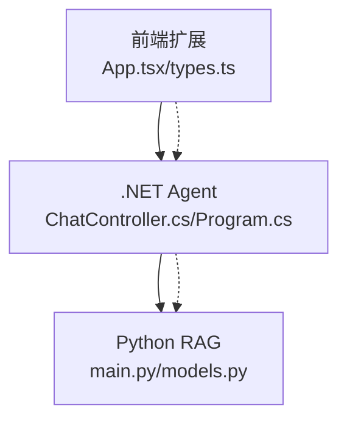
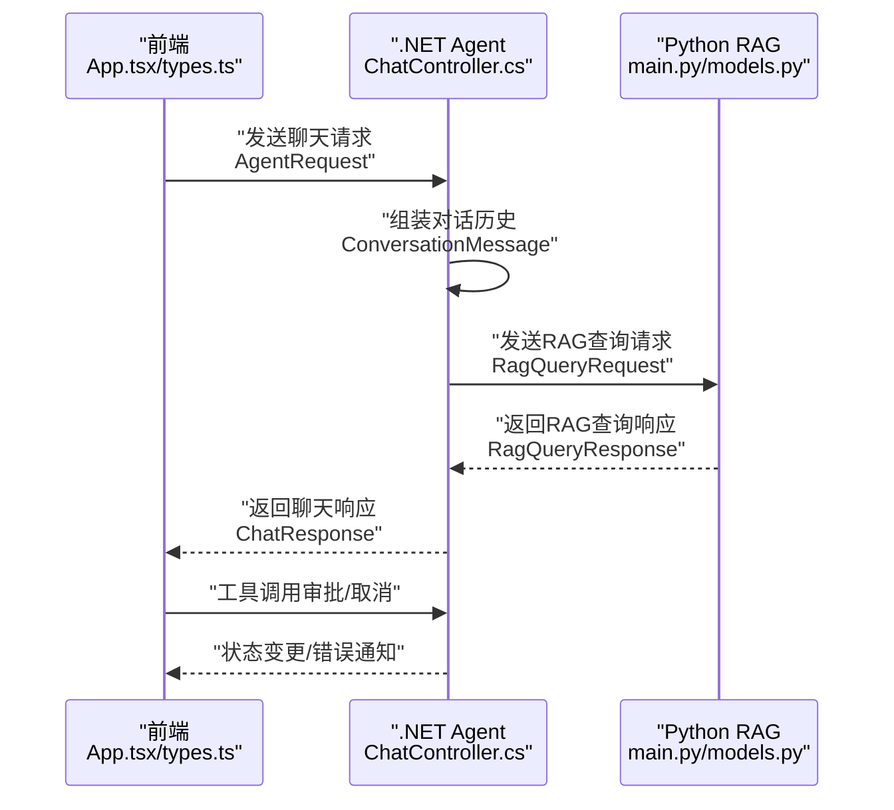
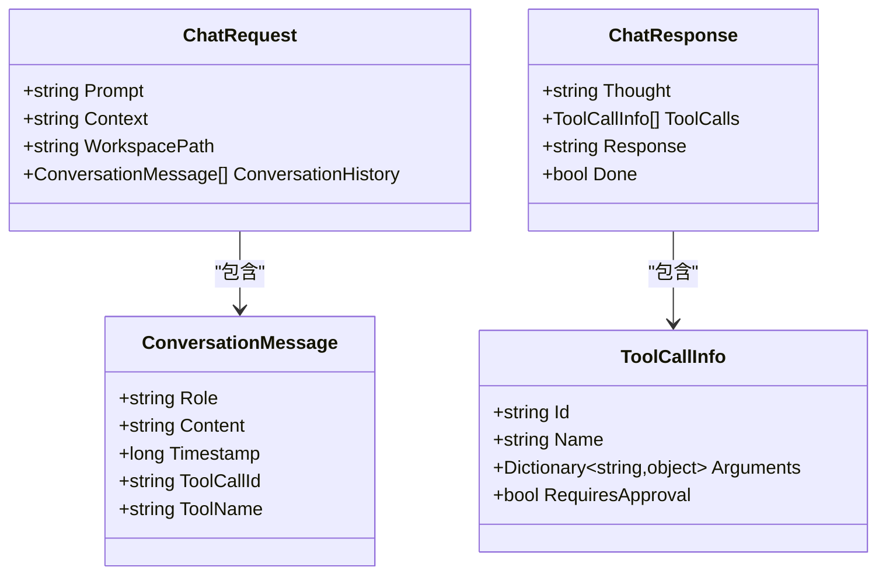
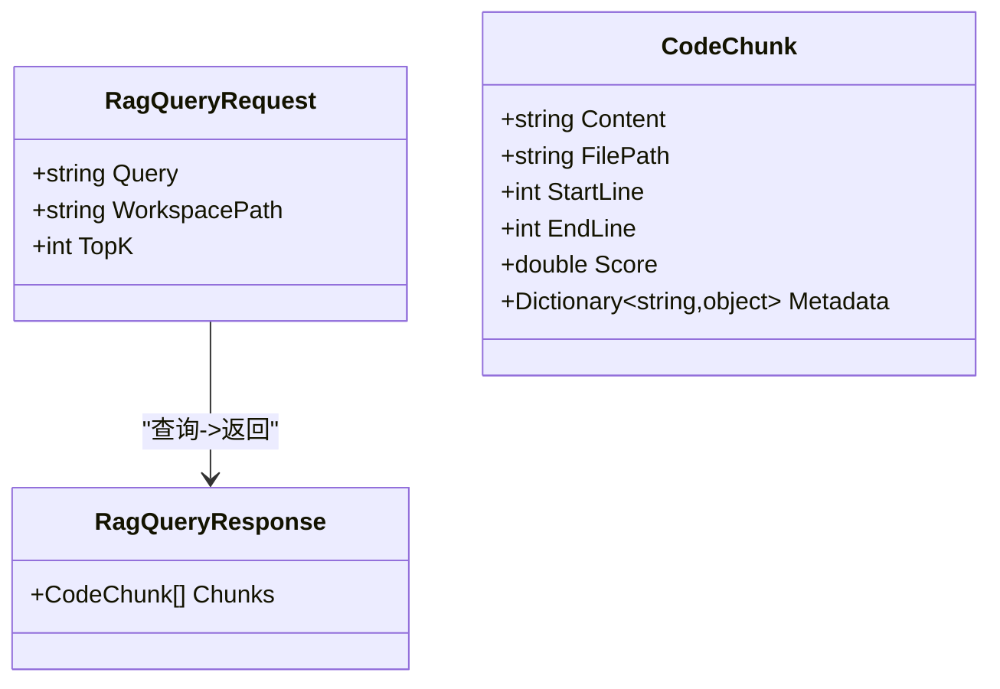
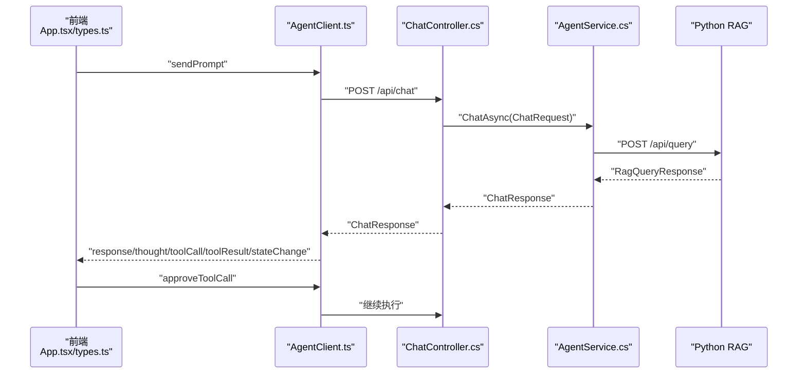
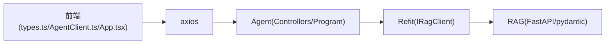

# 数据模型与通信协议

<cite>
**本文引用的文件**
- [ChatModels.cs](file://backend-agent/Models/ChatModels.cs)
- [ChatController.cs](file://backend-agent/Controllers/ChatController.cs)
- [Program.cs](file://backend-agent/Program.cs)
- [types.ts](file://frontend-extension/src/core/types.ts)
- [AgentClient.ts](file://frontend-extension/src/services/AgentClient.ts)
- [App.tsx](file://frontend-extension/src/webview/App.tsx)
- [models.py](file://backend-rag/app/models.py)
- [main.py](file://backend-rag/app/main.py)
- [pyproject.toml](file://backend-rag/pyproject.toml)
- [appsettings.json](file://backend-agent/appsettings.json)
</cite>

## 目录
1. [引言](#引言)
2. [项目结构](#项目结构)
3. [核心组件](#核心组件)
4. [架构总览](#架构总览)
5. [详细组件分析](#详细组件分析)
6. [依赖分析](#依赖分析)
7. [性能考虑](#性能考虑)
8. [故障排查指南](#故障排查指南)
9. [结论](#结论)
10. [附录：字段规范与示例](#附录字段规范与示例)

## 引言
本文件面向跨端协作的聊天与RAG系统，聚焦以下核心数据模型：
- 聊天请求/响应：ChatRequest、ChatResponse
- 对话历史：ConversationMessage
- 工具调用信息：ToolCallInfo
- RAG 查询请求/响应：RagQueryRequest、RagQueryResponse、CodeChunk

目标是：
- 统一三端（C#/.NET、TypeScript/前端、Python/RAG）的字段命名与语义
- 明确序列化一致性（JSON命名策略）与字段映射关系
- 描述数据在前端、.NET Agent与Python RAG之间的流动与转换
- 提供版本兼容与模型演进策略建议（新增可选字段）

## 项目结构
系统由三部分组成：
- 前端扩展（VS Code WebView）：负责用户交互、消息状态机与消息协议
- .NET Agent 后端：接收前端请求，组织对话历史与工具调用，调用 RAG 并返回结果
- Python RAG 后端：提供向量检索与索引加载能力

图表来源
- [ChatController.cs](file://backend-agent/Controllers/ChatController.cs#L1-L45)
- [Program.cs](file://backend-agent/Program.cs#L1-L67)
- [types.ts](file://frontend-extension/src/core/types.ts#L1-L151)
- [AgentClient.ts](file://frontend-extension/src/services/AgentClient.ts#L1-L61)
- [main.py](file://backend-rag/app/main.py#L1-L343)
- [models.py](file://backend-rag/app/models.py#L1-L88)

章节来源
- [ChatController.cs](file://backend-agent/Controllers/ChatController.cs#L1-L45)
- [Program.cs](file://backend-agent/Program.cs#L1-L67)
- [types.ts](file://frontend-extension/src/core/types.ts#L1-L151)
- [AgentClient.ts](file://frontend-extension/src/services/AgentClient.ts#L1-L61)
- [main.py](file://backend-rag/app/main.py#L1-L343)
- [models.py](file://backend-rag/app/models.py#L1-L88)

## 核心组件
本节梳理三端的核心数据模型与字段语义，并给出字段约束与业务含义。

- ChatRequest（.NET）
  - Prompt: 字符串，必填；用户输入提示词
  - Context: 字符串，可选；上下文补充
  - WorkspacePath: 字符串，必填；工作区路径
  - ConversationHistory: 列表，必填；对话历史项
- ChatResponse（.NET）
  - Thought: 字符串，必填；思考内容
  - ToolCalls: 列表，可选；工具调用信息
  - Response: 字符串，可选；最终回答
  - Done: 布尔，必填；是否结束
- ConversationMessage（.NET）
  - Role: 字符串，必填；角色（user/assistant/system/tool）
  - Content: 字符串，必填；消息内容
  - Timestamp: 整数，必填；时间戳（毫秒或秒）
  - ToolCallId: 字符串，可选；关联工具调用ID
  - ToolName: 字符串，可选；工具名称
- ToolCallInfo（.NET）
  - Id: 字符串，必填；工具调用唯一标识
  - Name: 字符串，必填；工具名称
  - Arguments: 字典，必填；参数对象
  - RequiresApproval: 布尔，必填；是否需要审批
- RagQueryRequest（.NET）
  - Query: 字符串，必填；查询文本
  - WorkspacePath: 字符串，必填；工作区路径
  - TopK: 整数，默认5；返回结果数量
- RagQueryResponse（.NET）
  - Chunks: 列表，必填；代码片段集合
- CodeChunk（.NET）
  - Content: 字符串，必填；代码内容
  - FilePath: 字符串，必填；源文件路径
  - StartLine: 整数，必填；起始行号
  - EndLine: 整数，必填；结束行号
  - Score: 浮点数，必填；相关性分数
  - Metadata: 字典，可选；附加元数据

章节来源
- [ChatModels.cs](file://backend-agent/Models/ChatModels.cs#L1-L50)

## 架构总览
下图展示了从前端到.NET Agent再到Python RAG的端到端数据流。

图表来源
- [AgentClient.ts](file://frontend-extension/src/services/AgentClient.ts#L1-L61)
- [ChatController.cs](file://backend-agent/Controllers/ChatController.cs#L1-L45)
- [main.py](file://backend-rag/app/main.py#L1-L343)
- [models.py](file://backend-rag/app/models.py#L1-L88)
- [types.ts](file://frontend-extension/src/core/types.ts#L1-L151)

## 详细组件分析

### 聊天模型（ChatRequest/ChatResponse/ConversationMessage/ToolCallInfo）
- 字段映射与命名策略
  - C# 使用驼峰命名（record 属性默认为驼峰）
  - TypeScript 使用驼峰命名（接口字段）
  - Python 使用蛇形命名（pydantic Field alias_to_value），但FastAPI默认使用驼峰输出
  - 结论：三端均采用驼峰命名，序列化一致性良好
- 约束与业务含义
  - ChatRequest：Prompt/WorkspacePath 必填；Context 可选；ConversationHistory 必填且包含多条消息
  - ChatResponse：Thought 必填；ToolCalls 可选；Response 可选；Done 必填
  - ConversationMessage：Role 支持 user/assistant/system/tool；Timestamp 用于排序与回放
  - ToolCallInfo：Arguments 为通用字典，RequiresApproval 控制前端审批流程
- 错误处理
  - .NET 控制器捕获取消与异常，返回 499/500 并携带错误信息

图表来源
- [ChatModels.cs](file://backend-agent/Models/ChatModels.cs#L1-L50)

章节来源
- [ChatModels.cs](file://backend-agent/Models/ChatModels.cs#L1-L50)
- [ChatController.cs](file://backend-agent/Controllers/ChatController.cs#L1-L45)

### RAG 查询模型（RagQueryRequest/RagQueryResponse/CodeChunk）
- 字段映射与命名策略
  - C# 驼峰命名
  - TypeScript 驼峰命名
  - Python 使用 snake_case 定义（Field alias_to_value），但FastAPI默认输出驼峰
  - 结论：三端一致的驼峰命名，序列化一致性良好
- 约束与业务含义
  - RagQueryRequest：Query/WorkspacePath 必填；TopK 默认5，范围通常为 1..20
  - RagQueryResponse：Chunks 为 CodeChunk 列表
  - CodeChunk：Content/FilePath/StartLine/EndLine/Score 必填；Metadata 可选
- RAG 服务端行为
  - FastAPI 接口返回 QueryResponse，内部使用 VectorStore 执行查询
  - 异常统一转为 HTTP 500

图表来源
- [ChatModels.cs](file://backend-agent/Models/ChatModels.cs#L32-L49)
- [models.py](file://backend-rag/app/models.py#L1-L88)

章节来源
- [ChatModels.cs](file://backend-agent/Models/ChatModels.cs#L32-L49)
- [models.py](file://backend-rag/app/models.py#L1-L88)
- [main.py](file://backend-rag/app/main.py#L65-L90)

### 前端消息协议与状态机
- 消息类型
  - WebviewToExtensionMessage：sendPrompt/cancelRequest/approveToolCall/ready
  - ExtensionToWebviewMessage：stateChange/thought/toolCall/toolResult/response/error/historyLoaded
- 字段映射
  - AgentRequest/AgentResponse 与 ChatRequest/ChatResponse 一一对应
  - ToolCall/ToolResult 与 ToolCallInfo 对应
  - ConversationMessage 的 role 包含 user/assistant/system/tool
- 审批流程
  - 当 ToolCall.requiresApproval 为真时，前端显示批准/拒绝按钮
  - 用户批准后，前端发送 approveToolCall，Agent 侧据此继续执行

图表来源
- [AgentClient.ts](file://frontend-extension/src/services/AgentClient.ts#L1-L61)
- [types.ts](file://frontend-extension/src/core/types.ts#L1-L151)
- [App.tsx](file://frontend-extension/src/webview/App.tsx#L1-L312)
- [ChatController.cs](file://backend-agent/Controllers/ChatController.cs#L1-L45)
- [main.py](file://backend-rag/app/main.py#L65-L90)

章节来源
- [types.ts](file://frontend-extension/src/core/types.ts#L1-L151)
- [AgentClient.ts](file://frontend-extension/src/services/AgentClient.ts#L1-L61)
- [App.tsx](file://frontend-extension/src/webview/App.tsx#L1-L312)

## 依赖分析
- 前端依赖
  - axios：HTTP 客户端，用于调用 Agent/RAG API
  - zod：运行时类型校验，确保消息协议一致性
- 后端依赖
  - .NET：ASP.NET Core 控制器、Refit 客户端、Semantic Kernel
  - Python：FastAPI、Pydantic、Vector Store（Milvus/Chroma）

图表来源
- [AgentClient.ts](file://frontend-extension/src/services/AgentClient.ts#L1-L61)
- [types.ts](file://frontend-extension/src/core/types.ts#L1-L151)
- [Program.cs](file://backend-agent/Program.cs#L1-L67)
- [main.py](file://backend-rag/app/main.py#L1-L343)
- [pyproject.toml](file://backend-rag/pyproject.toml#L1-L67)

章节来源
- [AgentClient.ts](file://frontend-extension/src/services/AgentClient.ts#L1-L61)
- [Program.cs](file://backend-agent/Program.cs#L1-L67)
- [pyproject.toml](file://backend-rag/pyproject.toml#L1-L67)

## 性能考虑
- 超时与并发
  - 前端 Agent/RAG 请求分别设置了合理超时（2分钟/30秒）
  - .NET Agent 注入了 Refit 客户端并配置了超时
- 序列化开销
  - 三端统一驼峰命名，避免额外字段映射开销
- 向量检索
  - RAG 服务端根据 TopK 进行检索，建议在客户端限制 TopK 上限以控制网络与计算成本

[本节为通用指导，不直接分析具体文件]

## 故障排查指南
- 常见错误与处理
  - .NET 控制器捕获取消与异常，返回 499/500 并携带错误信息
  - 前端健康检查分别探测 Agent/RAG 服务可用性
- 建议排查步骤
  - 确认 Agent/RAG 服务地址与端口正确（.NET appsettings.json）
  - 检查网络连通性与CORS配置
  - 查看前端控制台与后端日志中的错误详情

章节来源
- [ChatController.cs](file://backend-agent/Controllers/ChatController.cs#L1-L45)
- [AgentClient.ts](file://frontend-extension/src/services/AgentClient.ts#L1-L61)
- [appsettings.json](file://backend-agent/appsettings.json#L1-L17)

## 结论
- 三端在 JSON 命名策略上保持一致（驼峰），确保序列化一致性
- 字段映射清晰，业务语义明确，便于跨端协作
- 建议在新增字段时保持可选，以保证向后兼容
- 前端通过审批流程与状态机提升用户体验与安全性

[本节为总结，不直接分析具体文件]

## 附录：字段规范与示例

### 字段规范与约束
- ChatRequest
  - Prompt: 必填，字符串
  - Context: 可选，字符串
  - WorkspacePath: 必填，字符串
  - ConversationHistory: 必填，列表，元素为 ConversationMessage
- ChatResponse
  - Thought: 必填，字符串
  - ToolCalls: 可选，列表，元素为 ToolCallInfo
  - Response: 可选，字符串
  - Done: 必填，布尔
- ConversationMessage
  - Role: 必填，枚举字符串（user/assistant/system/tool）
  - Content: 必填，字符串
  - Timestamp: 必填，整数
  - ToolCallId: 可选，字符串
  - ToolName: 可选，字符串
- ToolCallInfo
  - Id: 必填，字符串
  - Name: 必填，字符串
  - Arguments: 必填，字典
  - RequiresApproval: 必填，布尔
- RagQueryRequest
  - Query: 必填，字符串
  - WorkspacePath: 必填，字符串
  - TopK: 可选，默认5，范围 1..20
- RagQueryResponse
  - Chunks: 必填，列表，元素为 CodeChunk
- CodeChunk
  - Content: 必填，字符串
  - FilePath: 必填，字符串
  - StartLine: 必填，整数
  - EndLine: 必填，整数
  - Score: 必填，浮点数
  - Metadata: 可选，字典

### 示例 JSON 负载
- 聊天请求（AgentRequest）
  - {
    "prompt": "如何实现一个线程安全的单例模式？",
    "context": "项目使用 C# 实现",
    "workspacePath": "/projects/myapp",
    "conversationHistory": [
      {
        "role": "user",
        "content": "你好",
        "timestamp": 1719900000000
      }
    ]
  }
- 聊天响应（AgentResponse）
  - {
    "thought": "需要先分析现有代码结构",
    "toolCalls": [
      {
        "id": "call_001",
        "name": "FileSystemTools.ReadFiles",
        "arguments": { "path": "/projects/myapp" },
        "requiresApproval": true
      }
    ],
    "response": "请稍等，正在读取文件...",
    "done": false
  }
- RAG 查询请求（RagQueryRequest）
  - {
    "query": "线程安全的单例模式实现",
    "workspacePath": "/projects/myapp",
    "topK": 5
  }
- RAG 查询响应（RagQueryResponse）
  - {
    "chunks": [
      {
        "content": "public class Singleton { ... }",
        "filePath": "/projects/myapp/Singleton.cs",
        "startLine": 1,
        "endLine": 50,
        "score": 0.95,
        "metadata": { "language": "csharp" }
      }
    ]
  }

[本节为示例说明，不直接分析具体文件]