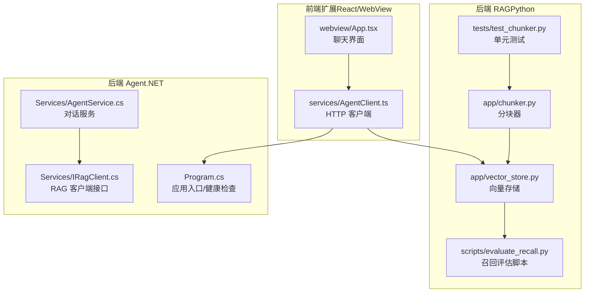
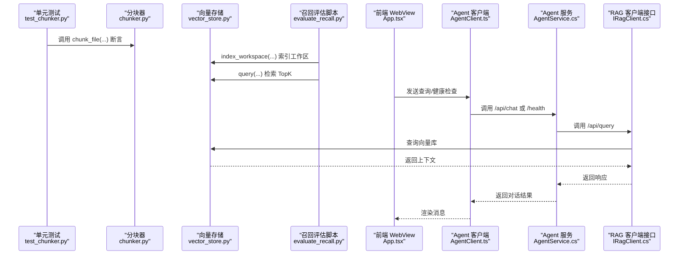
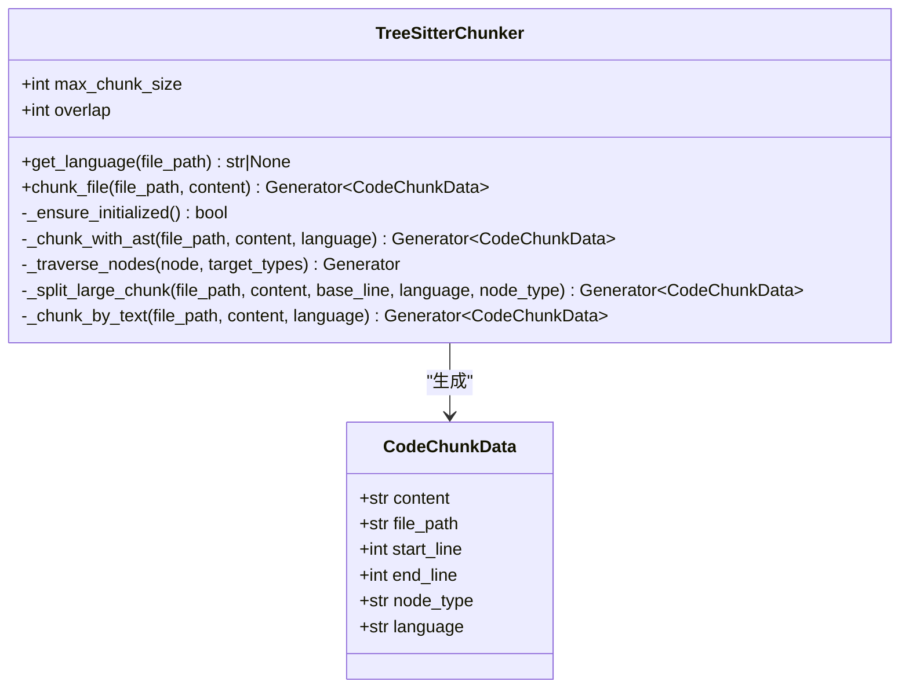
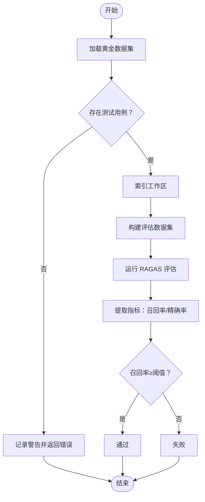
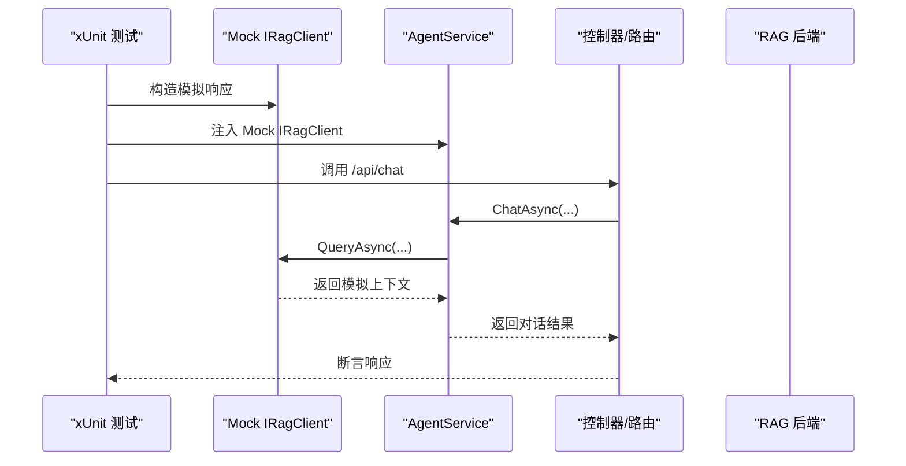
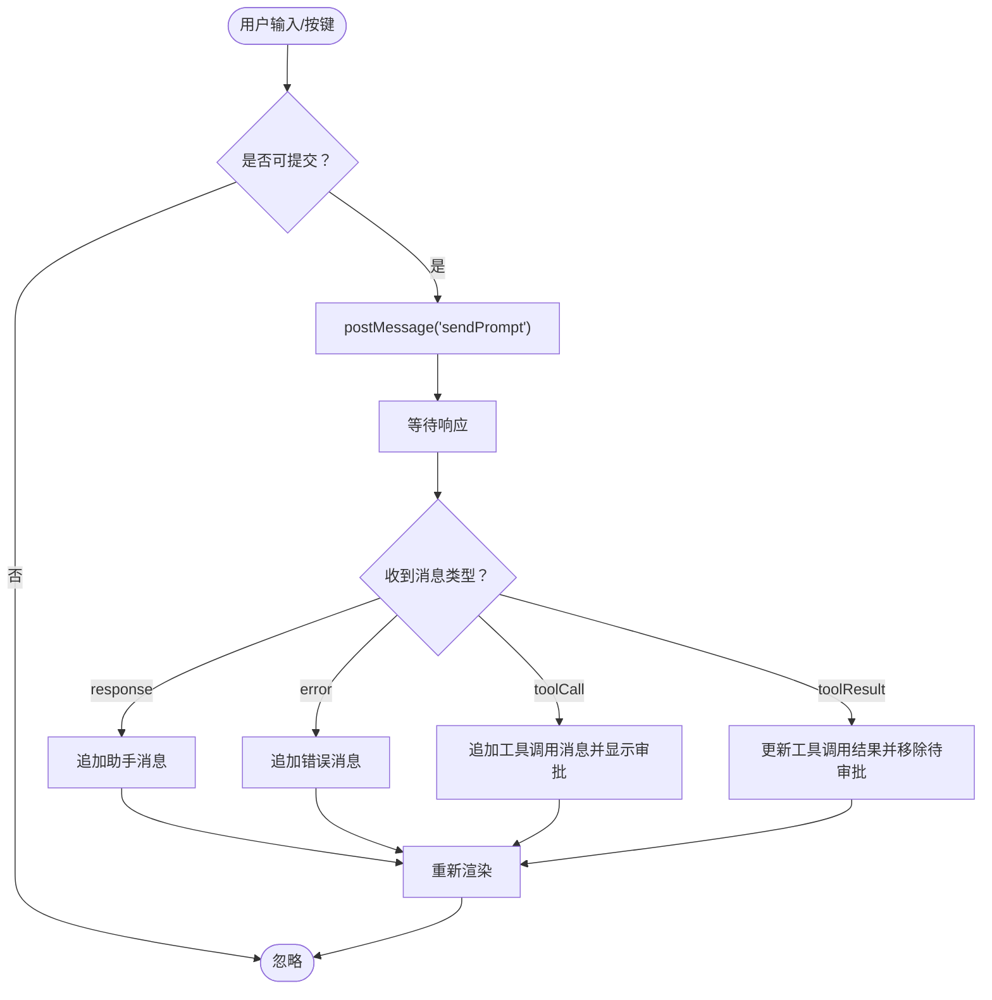
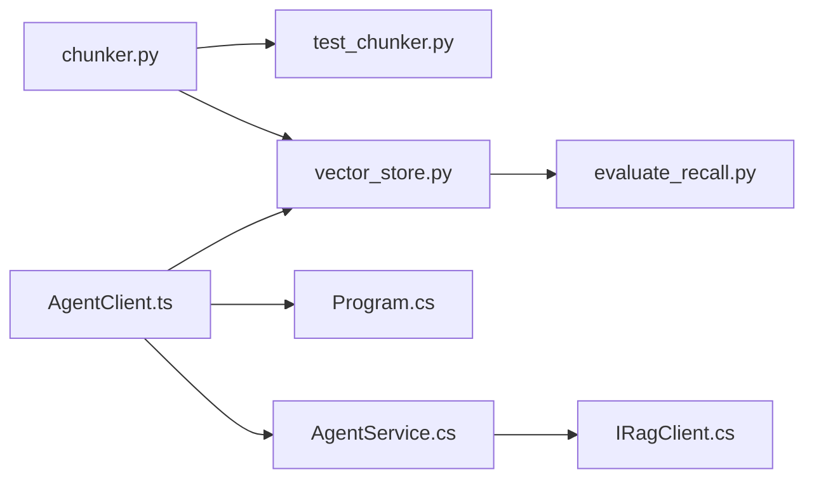

# 测试策略

<cite>
**本文引用的文件**
- [backend-rag/tests/test_chunker.py](file://backend-rag/tests/test_chunker.py)
- [backend-rag/app/chunker.py](file://backend-rag/app/chunker.py)
- [backend-rag/scripts/evaluate_recall.py](file://backend-rag/scripts/evaluate_recall.py)
- [backend-rag/app/vector_store.py](file://backend-rag/app/vector_store.py)
- [backend-rag/pyproject.toml](file://backend-rag/pyproject.toml)
- [backend-agent/Services/IRagClient.cs](file://backend-agent/Services/IRagClient.cs)
- [backend-agent/Services/AgentService.cs](file://backend-agent/Services/AgentService.cs)
- [backend-agent/Program.cs](file://backend-agent/Program.cs)
- [frontend-extension/src/webview/App.tsx](file://frontend-extension/src/webview/App.tsx)
- [frontend-extension/src/services/AgentClient.ts](file://frontend-extension/src/services/AgentClient.ts)
- [.gitignore](file://.gitignore)
</cite>

## 目录
1. [引言](#引言)
2. [项目结构](#项目结构)
3. [核心组件](#核心组件)
4. [架构总览](#架构总览)
5. [详细组件分析](#详细组件分析)
6. [依赖关系分析](#依赖关系分析)
7. [性能考量](#性能考量)
8. [故障排查指南](#故障排查指南)
9. [结论](#结论)
10. [附录](#附录)

## 引言
本文件系统化阐述项目的测试方法论，覆盖单元测试、集成测试与端到端测试三个层次，并结合仓库中的具体实现给出可操作的实践建议：
- 以 backend-rag 的分块器单元测试为例，说明如何验证不同编程语言的代码切分准确性；
- 解释 evaluate_recall.py 如何评估 RAG 检索召回率，作为集成测试的关键指标；
- 讨论 .NET 后端（Agent 服务）的测试框架与模拟 RAG 客户端的方法；
- 提供前端 WebView 组件的测试策略建议；
- 强调测试覆盖率目标、CI/CD 集成与回归测试流程。

## 项目结构
项目采用多模块分层组织：
- 后端 RAG（Python）：负责代码分块、向量化与检索评估；
- 后端 Agent（.NET）：负责对话编排、工具调用与与 RAG 客户端交互；
- 前端扩展（VS Code WebView + React）：负责用户交互与消息展示。

图表来源
- [backend-rag/app/chunker.py](file://backend-rag/app/chunker.py#L1-L280)
- [backend-rag/app/vector_store.py](file://backend-rag/app/vector_store.py#L1-L469)
- [backend-rag/scripts/evaluate_recall.py](file://backend-rag/scripts/evaluate_recall.py#L1-L240)
- [backend-rag/tests/test_chunker.py](file://backend-rag/tests/test_chunker.py#L1-L88)
- [backend-agent/Services/IRagClient.cs](file://backend-agent/Services/IRagClient.cs#L1-L14)
- [backend-agent/Services/AgentService.cs](file://backend-agent/Services/AgentService.cs#L1-L120)
- [backend-agent/Program.cs](file://backend-agent/Program.cs#L41-L66)
- [frontend-extension/src/webview/App.tsx](file://frontend-extension/src/webview/App.tsx#L1-L312)
- [frontend-extension/src/services/AgentClient.ts](file://frontend-extension/src/services/AgentClient.ts#L1-L60)

章节来源
- [backend-rag/app/chunker.py](file://backend-rag/app/chunker.py#L1-L280)
- [backend-rag/app/vector_store.py](file://backend-rag/app/vector_store.py#L1-L469)
- [backend-rag/scripts/evaluate_recall.py](file://backend-rag/scripts/evaluate_recall.py#L1-L240)
- [backend-rag/tests/test_chunker.py](file://backend-rag/tests/test_chunker.py#L1-L88)
- [backend-agent/Services/IRagClient.cs](file://backend-agent/Services/IRagClient.cs#L1-L14)
- [backend-agent/Services/AgentService.cs](file://backend-agent/Services/AgentService.cs#L1-L120)
- [backend-agent/Program.cs](file://backend-agent/Program.cs#L41-L66)
- [frontend-extension/src/webview/App.tsx](file://frontend-extension/src/webview/App.tsx#L1-L312)
- [frontend-extension/src/services/AgentClient.ts](file://frontend-extension/src/services/AgentClient.ts#L1-L60)

## 核心组件
- 分块器（TreeSitterChunker）：基于 AST 的语义分块，支持多种语言；当不可用时回退为按文本行的分块策略。
- 向量存储（VectorStore）：基于 Milvus 的向量数据库，负责工作区索引、查询与全局文档索引。
- 召回评估脚本（evaluate_recall.py）：使用 RAGAS 对检索质量进行评估，输出召回率与精确率，并以阈值驱动通过/失败。
- 单元测试（test_chunker.py）：针对分块器的语言识别、按文件分块、回退策略与大块拆分等行为进行断言。
- .NET RAG 客户端接口（IRagClient）：定义与 RAG 后端交互的契约（查询、健康检查）。
- Agent 服务（AgentService）：在对话中注入 RAG 上下文，协调工具调用。
- 前端 WebView（App.tsx）与 HTTP 客户端（AgentClient.ts）：负责消息渲染、状态管理与与后端通信。

章节来源
- [backend-rag/app/chunker.py](file://backend-rag/app/chunker.py#L1-L280)
- [backend-rag/app/vector_store.py](file://backend-rag/app/vector_store.py#L1-L469)
- [backend-rag/scripts/evaluate_recall.py](file://backend-rag/scripts/evaluate_recall.py#L1-L240)
- [backend-rag/tests/test_chunker.py](file://backend-rag/tests/test_chunker.py#L1-L88)
- [backend-agent/Services/IRagClient.cs](file://backend-agent/Services/IRagClient.cs#L1-L14)
- [backend-agent/Services/AgentService.cs](file://backend-agent/Services/AgentService.cs#L1-L120)
- [frontend-extension/src/webview/App.tsx](file://frontend-extension/src/webview/App.tsx#L1-L312)
- [frontend-extension/src/services/AgentClient.ts](file://frontend-extension/src/services/AgentClient.ts#L1-L60)

## 架构总览
从测试视角看，系统的关键测试路径如下：
- 单元测试：验证分块器在不同语言与边界条件下的正确性；
- 集成测试：通过 evaluate_recall.py 将分块器与向量存储、检索链路打通，评估召回率；
- 端到端测试：从前端 WebView 发起请求，经 Agent 服务、RAG 客户端，最终到达 RAG 后端与 Milvus，形成闭环。

图表来源
- [backend-rag/tests/test_chunker.py](file://backend-rag/tests/test_chunker.py#L1-L88)
- [backend-rag/app/chunker.py](file://backend-rag/app/chunker.py#L1-L280)
- [backend-rag/app/vector_store.py](file://backend-rag/app/vector_store.py#L1-L469)
- [backend-rag/scripts/evaluate_recall.py](file://backend-rag/scripts/evaluate_recall.py#L1-L240)
- [frontend-extension/src/webview/App.tsx](file://frontend-extension/src/webview/App.tsx#L1-L312)
- [frontend-extension/src/services/AgentClient.ts](file://frontend-extension/src/services/AgentClient.ts#L1-L60)
- [backend-agent/Services/AgentService.cs](file://backend-agent/Services/AgentService.cs#L1-L120)
- [backend-agent/Services/IRagClient.cs](file://backend-agent/Services/IRagClient.cs#L1-L14)

## 详细组件分析

### 单元测试：RAG 分块逻辑验证（test_chunker.py）
- 目标：验证 TreeSitterChunker 在不同语言与边界条件下的分块行为，确保输出的 CodeChunkData 具备正确的元数据与大小控制。
- 关键断言点：
  - 语言识别：根据文件扩展名映射到对应语言；
  - 文件分块：按 AST 逻辑单元（函数、类等）优先切分，超出最大长度时进一步拆分并保留重叠；
  - 回退策略：不支持的语言或解析失败时，回退到按文本行的分块；
  - 大块拆分：超过阈值的块应被拆分为多个子块，且允许重叠。
- 测试组织：
  - 使用 pytest 类型的测试类与方法，分别覆盖语言映射、按文件分块、回退策略与大块拆分；
  - 通过参数化与构造示例代码，覆盖多种语言与边界场景。

图表来源
- [backend-rag/app/chunker.py](file://backend-rag/app/chunker.py#L1-L280)

章节来源
- [backend-rag/tests/test_chunker.py](file://backend-rag/tests/test_chunker.py#L1-L88)
- [backend-rag/app/chunker.py](file://backend-rag/app/chunker.py#L1-L280)

### 集成测试：召回率评估（evaluate_recall.py）
- 目标：以 RAGAS 为基础，对检索质量进行端到端评估，关键指标为 Context Recall@K（默认 K=5），并设定阈值（默认 0.8）。
- 流程：
  - 加载黄金数据集（包含问题、期望内容与应返回的文件列表）；
  - 确保工作区已索引（index_workspace），将代码分块、嵌入并写入 Milvus；
  - 针对每个测试用例执行检索（query），提取 TopK 上下文；
  - 使用 RAGAS 评估 context_recall 与 context_precision；
  - 输出评估结果并根据阈值判定通过/失败。
- 关键断言点：
  - 成功加载黄金数据集；
  - 工作区索引成功（返回文件数与块数）；
  - 评估指标达标（召回率≥阈值）。

图表来源
- [backend-rag/scripts/evaluate_recall.py](file://backend-rag/scripts/evaluate_recall.py#L1-L240)
- [backend-rag/app/vector_store.py](file://backend-rag/app/vector_store.py#L1-L469)

章节来源
- [backend-rag/scripts/evaluate_recall.py](file://backend-rag/scripts/evaluate_recall.py#L1-L240)
- [backend-rag/app/vector_store.py](file://backend-rag/app/vector_store.py#L1-L469)

### .NET 后端测试策略（xUnit + 模拟 RAG 客户端）
- 测试框架：使用 xUnit 进行单元测试与集成测试，结合 Moq 或内置 Mock 实现依赖注入与外部服务模拟。
- 模拟 RAG 客户端：
  - 通过接口 IRagClient 定义契约，便于在测试中替换为内存实现或 Mock；
  - 在 AgentService 中注入 IRagClient，以便在测试中传入模拟实例；
  - 验证对话服务在有无 RAG 上下文时的行为差异，以及错误处理路径。
- 健康检查与端到端：
  - 利用 Program.cs 中的 /health 端点进行健康检查测试；
  - 结合前端 AgentClient.ts 的 HTTP 客户端，发起 /api/chat 与 /api/query 请求，验证端到端流程。

图表来源
- [backend-agent/Services/IRagClient.cs](file://backend-agent/Services/IRagClient.cs#L1-L14)
- [backend-agent/Services/AgentService.cs](file://backend-agent/Services/AgentService.cs#L1-L120)
- [backend-agent/Program.cs](file://backend-agent/Program.cs#L41-L66)
- [frontend-extension/src/services/AgentClient.ts](file://frontend-extension/src/services/AgentClient.ts#L1-L60)

章节来源
- [backend-agent/Services/IRagClient.cs](file://backend-agent/Services/IRagClient.cs#L1-L14)
- [backend-agent/Services/AgentService.cs](file://backend-agent/Services/AgentService.cs#L1-L120)
- [backend-agent/Program.cs](file://backend-agent/Program.cs#L41-L66)
- [frontend-extension/src/services/AgentClient.ts](file://frontend-extension/src/services/AgentClient.ts#L1-L60)

### 前端 WebView 组件测试策略（React/VS Code WebView）
- 组件职责：消息渲染、状态切换、工具调用与审批流程、输入提交与取消。
- 测试建议：
  - 单元测试：使用 React Testing Library 或 Jest + React Testing Library，对消息类型分支、状态标签、键盘事件与按钮点击进行断言；
  - 集成测试：通过 Mock VS Code API 与消息通道，验证消息接收、状态变更与工具调用序列；
  - 端到端测试：在真实 WebView 环境中，结合后端 Agent 服务与 RAG 客户端，验证完整交互链路。
- 关键断言点：
  - 收到“response”、“error”、“toolCall/toolResult”等消息时的状态与 DOM 更新；
  - 输入框禁用/启用与发送按钮状态；
  - 审批弹窗与批准/拒绝按钮的交互。

图表来源
- [frontend-extension/src/webview/App.tsx](file://frontend-extension/src/webview/App.tsx#L1-L312)
- [frontend-extension/src/services/AgentClient.ts](file://frontend-extension/src/services/AgentClient.ts#L1-L60)

章节来源
- [frontend-extension/src/webview/App.tsx](file://frontend-extension/src/webview/App.tsx#L1-L312)
- [frontend-extension/src/services/AgentClient.ts](file://frontend-extension/src/services/AgentClient.ts#L1-L60)

## 依赖关系分析
- Python RAG 侧：
  - 分块器依赖树解析库（tree-sitter）与语言解析器，初始化失败时回退到文本分块；
  - 向量存储依赖 Milvus 与 OpenAI Embedding，索引与查询均通过单例工厂函数获取；
  - 评估脚本依赖 RAGAS 与向量存储，先索引再查询，最后评估。
- .NET Agent 侧：
  - AgentService 依赖 Kernel、IRagClient 与设置，通过注入的 IRagClient 与 RAG 后端交互；
  - Program.cs 提供 /health 健康检查端点，便于集成测试与监控。
- 前端侧：
  - AgentClient.ts 封装对 Agent 与 RAG 的 HTTP 调用，支持健康检查与查询；
  - App.tsx 通过 VS Code 扩展消息通道与后端通信。

图表来源
- [backend-rag/app/chunker.py](file://backend-rag/app/chunker.py#L1-L280)
- [backend-rag/app/vector_store.py](file://backend-rag/app/vector_store.py#L1-L469)
- [backend-rag/scripts/evaluate_recall.py](file://backend-rag/scripts/evaluate_recall.py#L1-L240)
- [backend-rag/tests/test_chunker.py](file://backend-rag/tests/test_chunker.py#L1-L88)
- [backend-agent/Services/AgentService.cs](file://backend-agent/Services/AgentService.cs#L1-L120)
- [backend-agent/Services/IRagClient.cs](file://backend-agent/Services/IRagClient.cs#L1-L14)
- [backend-agent/Program.cs](file://backend-agent/Program.cs#L41-L66)
- [frontend-extension/src/services/AgentClient.ts](file://frontend-extension/src/services/AgentClient.ts#L1-L60)

章节来源
- [backend-rag/app/chunker.py](file://backend-rag/app/chunker.py#L1-L280)
- [backend-rag/app/vector_store.py](file://backend-rag/app/vector_store.py#L1-L469)
- [backend-rag/scripts/evaluate_recall.py](file://backend-rag/scripts/evaluate_recall.py#L1-L240)
- [backend-rag/tests/test_chunker.py](file://backend-rag/tests/test_chunker.py#L1-L88)
- [backend-agent/Services/AgentService.cs](file://backend-agent/Services/AgentService.cs#L1-L120)
- [backend-agent/Services/IRagClient.cs](file://backend-agent/Services/IRagClient.cs#L1-L14)
- [backend-agent/Program.cs](file://backend-agent/Program.cs#L41-L66)
- [frontend-extension/src/services/AgentClient.ts](file://frontend-extension/src/services/AgentClient.ts#L1-L60)

## 性能考量
- 分块器性能：
  - AST 解析成本较高，建议在首次使用时懒初始化解析器，并缓存解析器实例；
  - 对于超大文件，合理设置 max_chunk_size 与 overlap，避免过小导致上下文碎片化。
- 向量存储性能：
  - Milvus 索引参数（如 nlist）影响检索速度与精度，需结合数据规模调优；
  - 批量插入与 flush 策略需平衡吞吐与延迟。
- 评估脚本性能：
  - 评估前先索引工作区，避免重复索引带来的开销；
  - 控制 TopK 与评估数据规模，防止内存与网络瓶颈。

[本节为通用指导，无需列出章节来源]

## 故障排查指南
- 分块器初始化失败：
  - 现象：日志提示 tree-sitter 不可用，回退到文本分块；
  - 措施：确认依赖安装与环境变量；必要时降级为文本分块策略。
- 向量存储连接失败：
  - 现象：Milvus 连接异常或集合不存在；
  - 措施：检查连接参数、网络连通性与 Milvus 服务状态；必要时重建集合。
- 评估召回率不达标：
  - 现象：召回率低于阈值；
  - 措施：优化分块策略（增大 max_chunk_size、调整 overlap）、更换嵌入模型或增加索引参数调优。
- 前端消息未更新：
  - 现象：收到响应但界面未刷新；
  - 措施：检查消息通道监听与 postMessage 调用；确认状态更新逻辑与依赖项变更触发重渲染。

章节来源
- [backend-rag/app/chunker.py](file://backend-rag/app/chunker.py#L1-L280)
- [backend-rag/app/vector_store.py](file://backend-rag/app/vector_store.py#L1-L469)
- [backend-rag/scripts/evaluate_recall.py](file://backend-rag/scripts/evaluate_recall.py#L1-L240)
- [frontend-extension/src/webview/App.tsx](file://frontend-extension/src/webview/App.tsx#L1-L312)

## 结论
本项目在测试层面形成了从单元到集成再到端到端的完整闭环：
- 单元测试聚焦分块器的正确性与鲁棒性；
- 集成测试通过召回评估脚本衡量检索质量；
- 端到端测试贯通前端、Agent 服务与 RAG 后端；
- .NET 后端可通过接口抽象与模拟实现快速开展单元与集成测试；
- 建议持续完善测试覆盖率、引入 CI/CD 自动化与回归测试流程，确保迭代质量。

[本节为总结性内容，无需列出章节来源]

## 附录

### 测试覆盖率目标与工具
- Python（pytest + pytest-cov）：
  - 在 pyproject.toml 中已配置 pytest 测试路径与 asyncio 模式，建议在 CI 中开启覆盖率统计并设置阈值（例如函数行覆盖率≥80%，分支覆盖率≥70%）。
- .NET（xUnit + Coverlet）：
  - 建议在 .csproj 中添加 Coverlet 折叠器，结合 GitHub Actions 或 Azure Pipelines 收集覆盖率报告。
- 前端（Jest + React Testing Library）：
  - 建议在测试中覆盖主要分支与交互路径，目标函数覆盖率≥80%。

章节来源
- [backend-rag/pyproject.toml](file://backend-rag/pyproject.toml#L1-L67)
- [.gitignore](file://.gitignore#L1-L46)

### CI/CD 集成与回归测试流程
- 触发条件：PR/MR 合并请求、主分支推送；
- 步骤建议：
  - 安装依赖与虚拟环境；
  - 运行 Python 单元测试与覆盖率统计；
  - 启动 Milvus 与 OpenAI API（或使用测试替身）；
  - 运行 evaluate_recall.py 并产出评估报告；
  - 运行 .NET 单元测试与覆盖率；
  - 运行前端测试；
  - 上传覆盖率报告与评估结果至制品库；
  - 若评估召回率不达标或测试失败，则阻断合并。
- 回归测试：
  - 定期运行全量测试套件；
  - 对关键路径（分块器、向量存储、Agent 服务、前端交互）进行回归验证；
  - 对比历史覆盖率与评估指标，发现回归趋势。

[本节为通用指导，无需列出章节来源]