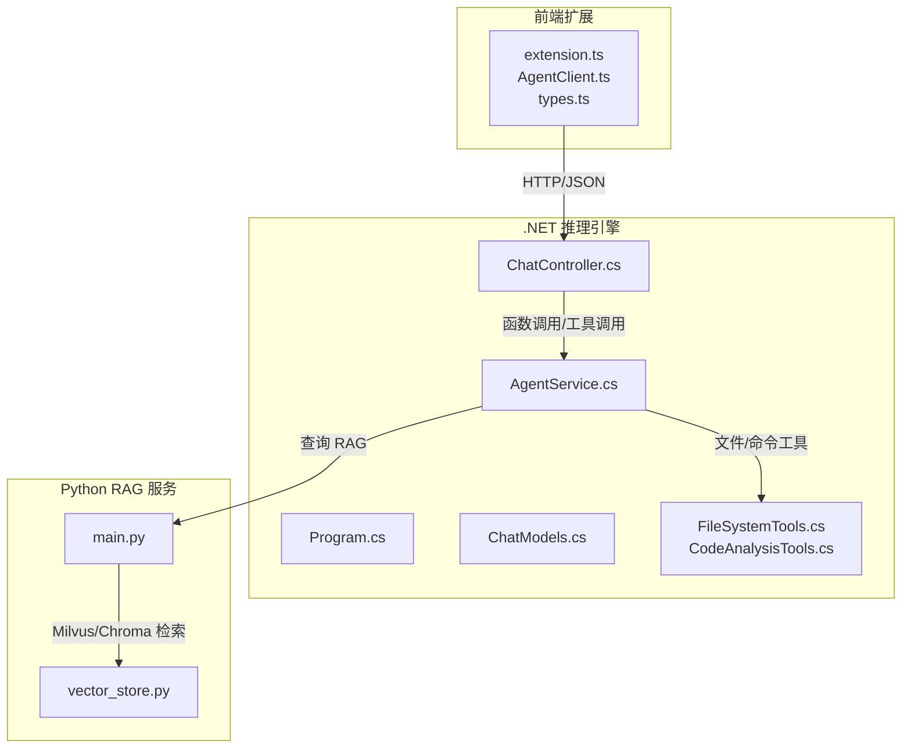
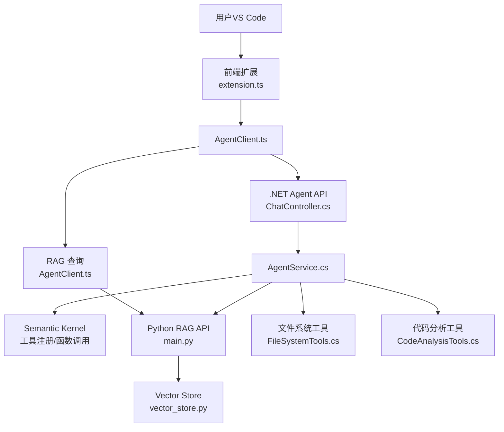
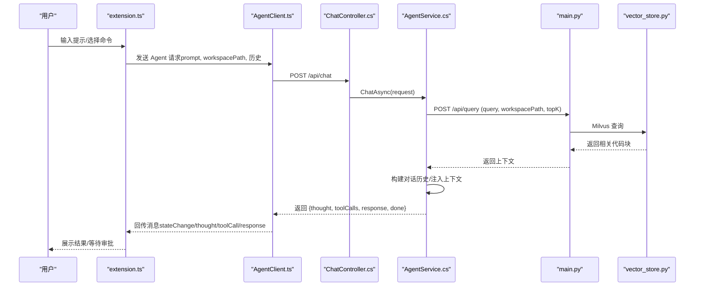
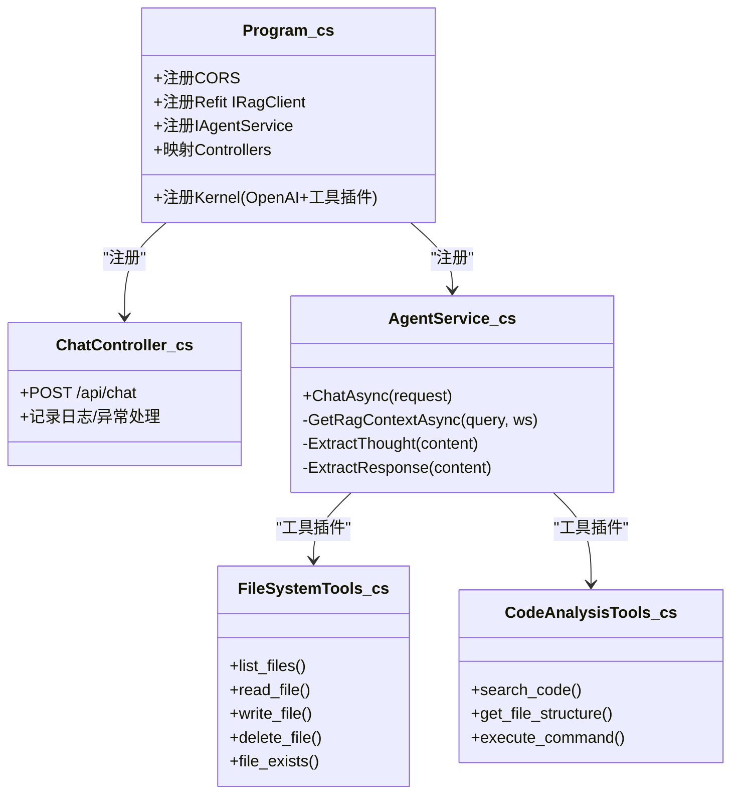
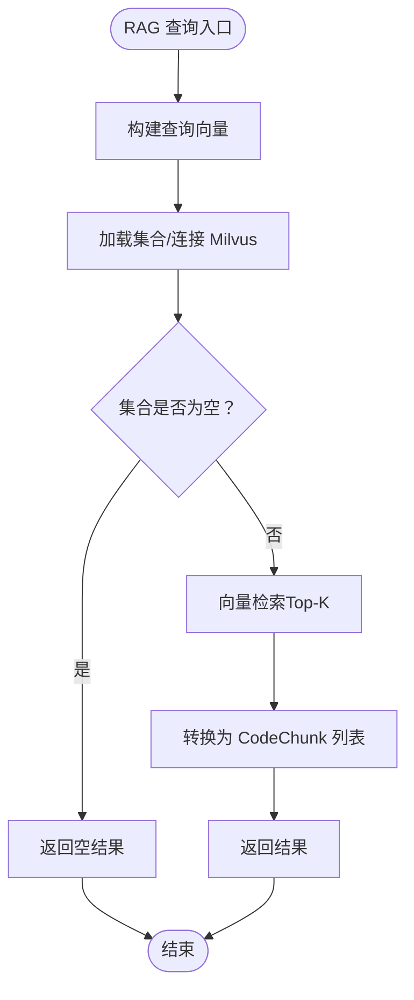
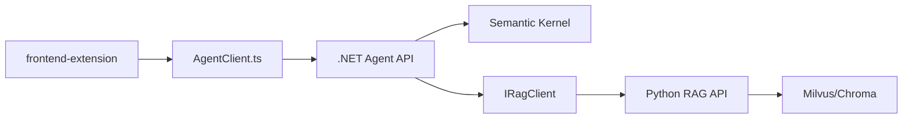

# 系统概述

<cite>
**本文引用的文件**
- [QUICK_START.md](file://QUICK_START.md)
- [Program.cs](file://backend-agent/Program.cs)
- [ChatController.cs](file://backend-agent/Controllers/ChatController.cs)
- [AgentService.cs](file://backend-agent/Services/AgentService.cs)
- [IAgentService.cs](file://backend-agent/Services/IAgentService.cs)
- [AgentSettings.cs](file://backend-agent/Services/AgentSettings.cs)
- [ChatModels.cs](file://backend-agent/Models/ChatModels.cs)
- [CodeAnalysisTools.cs](file://backend-agent/Tools/CodeAnalysisTools.cs)
- [FileSystemTools.cs](file://backend-agent/Tools/FileSystemTools.cs)
- [main.py](file://backend-rag/app/main.py)
- [vector_store.py](file://backend-rag/app/vector_store.py)
- [extension.ts](file://frontend-extension/src/extension.ts)
- [AgentClient.ts](file://frontend-extension/src/services/AgentClient.ts)
- [types.ts](file://frontend-extension/src/core/types.ts)
</cite>

## 目录
1. [简介](#简介)
2. [项目结构](#项目结构)
3. [核心组件](#核心组件)
4. [架构总览](#架构总览)
5. [详细组件分析](#详细组件分析)
6. [依赖关系分析](#依赖关系分析)
7. [性能考虑](#性能考虑)
8. [故障排查指南](#故障排查指南)
9. [结论](#结论)
10. [附录](#附录)

## 简介
ALAgent 是一个面向 VS Code 的 AI 驱动的自主编码代理，旨在通过“前端扩展 + .NET 推理引擎 + Python RAG 服务”的微服务架构，实现智能代码理解、自然语言交互与上下文感知建议。系统支持：
- 在 VS Code 中通过扩展界面进行对话式编程
- 后端 .NET 引擎基于 Semantic Kernel 进行函数调用与工具编排
- Python RAG 服务提供语义检索与代码片段召回
- 文件系统与代码分析工具的本地执行能力

本概述将从整体架构、数据流、组件职责与典型使用场景出发，帮助初学者快速理解，同时为高级开发者阐明微服务拆分、Semantic Kernel 集成与工具调用机制。

## 项目结构
仓库采用多模块组织方式：
- frontend-extension：VS Code 扩展前端（TypeScript + React），负责用户交互与消息协议
- backend-agent：.NET 推理引擎（ASP.NET Core + Semantic Kernel），负责对话处理、工具调用与与 RAG 服务集成
- backend-rag：Python RAG 服务（FastAPI），负责向量索引、语义检索与外部资源加载

图表来源
- [Program.cs](file://backend-agent/Program.cs#L1-L67)
- [ChatController.cs](file://backend-agent/Controllers/ChatController.cs#L1-L45)
- [AgentService.cs](file://backend-agent/Services/AgentService.cs#L1-L180)
- [ChatModels.cs](file://backend-agent/Models/ChatModels.cs#L1-L50)
- [CodeAnalysisTools.cs](file://backend-agent/Tools/CodeAnalysisTools.cs#L1-L252)
- [FileSystemTools.cs](file://backend-agent/Tools/FileSystemTools.cs#L1-L151)
- [main.py](file://backend-rag/app/main.py#L1-L343)
- [vector_store.py](file://backend-rag/app/vector_store.py#L1-L469)
- [extension.ts](file://frontend-extension/src/extension.ts#L1-L74)
- [AgentClient.ts](file://frontend-extension/src/services/AgentClient.ts#L1-L61)
- [types.ts](file://frontend-extension/src/core/types.ts#L1-L151)

章节来源
- [QUICK_START.md](file://QUICK_START.md#L1-L93)

## 核心组件
- 前端扩展（extension.ts、AgentClient.ts、types.ts）
  - 负责注册侧边栏视图、发送用户提示、接收状态与结果、健康检查
  - 通过 AgentClient 封装对 .NET Agent API 与 Python RAG API 的调用
- .NET 推理引擎（Program.cs、ChatController.cs、AgentService.cs、ChatModels.cs、工具类）
  - Program.cs 注册 Semantic Kernel、CORS、Refit 客户端与控制器
  - ChatController 提供 /api/chat 入口，记录日志并转发请求
  - AgentService 构建对话历史、注入 RAG 上下文、调用 LLM 并自动执行工具
  - 工具类提供文件系统与代码分析能力，配合 Semantic Kernel 函数调用
- Python RAG 服务（main.py、vector_store.py）
  - 提供 /api/query、/api/index、/api/load/* 等接口
  - 使用 Milvus 存储嵌入，按工作区或全局集合检索，返回相关代码片段

章节来源
- [extension.ts](file://frontend-extension/src/extension.ts#L1-L74)
- [AgentClient.ts](file://frontend-extension/src/services/AgentClient.ts#L1-L61)
- [types.ts](file://frontend-extension/src/core/types.ts#L1-L151)
- [Program.cs](file://backend-agent/Program.cs#L1-L67)
- [ChatController.cs](file://backend-agent/Controllers/ChatController.cs#L1-L45)
- [AgentService.cs](file://backend-agent/Services/AgentService.cs#L1-L180)
- [ChatModels.cs](file://backend-agent/Models/ChatModels.cs#L1-L50)
- [CodeAnalysisTools.cs](file://backend-agent/Tools/CodeAnalysisTools.cs#L1-L252)
- [FileSystemTools.cs](file://backend-agent/Tools/FileSystemTools.cs#L1-L151)
- [main.py](file://backend-rag/app/main.py#L1-L343)
- [vector_store.py](file://backend-rag/app/vector_store.py#L1-L469)

## 架构总览
系统采用前后端分离的微服务架构：
- 前端扩展通过 HTTP 与后端通信，使用 JSON 协议传递提示、历史与工具调用结果
- .NET Agent API 作为推理中枢，负责对话管理、工具编排与 RAG 上下文注入
- Python RAG API 作为检索中枢，负责向量索引与语义搜索
- 工具层由 .NET 侧的文件系统与代码分析工具组成，通过 Semantic Kernel 自动函数调用

图表来源
- [extension.ts](file://frontend-extension/src/extension.ts#L1-L74)
- [AgentClient.ts](file://frontend-extension/src/services/AgentClient.ts#L1-L61)
- [ChatController.cs](file://backend-agent/Controllers/ChatController.cs#L1-L45)
- [AgentService.cs](file://backend-agent/Services/AgentService.cs#L1-L180)
- [CodeAnalysisTools.cs](file://backend-agent/Tools/CodeAnalysisTools.cs#L1-L252)
- [FileSystemTools.cs](file://backend-agent/Tools/FileSystemTools.cs#L1-L151)
- [main.py](file://backend-rag/app/main.py#L1-L343)
- [vector_store.py](file://backend-rag/app/vector_store.py#L1-L469)

## 详细组件分析

### 前端扩展与消息协议
- extension.ts
  - 初始化 AgentClient、FileSystemService、TerminalService
  - 注册侧边栏视图与命令（打开聊天、清空历史）
  - 监听配置变更动态更新 API 地址
- AgentClient.ts
  - 维护两个 Axios 实例分别指向 .NET Agent API 与 Python RAG API
  - 提供 chat、queryContext、healthCheck 方法
- types.ts
  - 定义消息协议（Webview <-> Extension）、状态机、工具调用与响应结构
  - 明确字段类型与校验规则，保证前后端一致性

图表来源
- [extension.ts](file://frontend-extension/src/extension.ts#L1-L74)
- [AgentClient.ts](file://frontend-extension/src/services/AgentClient.ts#L1-L61)
- [types.ts](file://frontend-extension/src/core/types.ts#L1-L151)
- [ChatController.cs](file://backend-agent/Controllers/ChatController.cs#L1-L45)
- [AgentService.cs](file://backend-agent/Services/AgentService.cs#L1-L180)
- [main.py](file://backend-rag/app/main.py#L1-L343)
- [vector_store.py](file://backend-rag/app/vector_store.py#L1-L469)

章节来源
- [extension.ts](file://frontend-extension/src/extension.ts#L1-L74)
- [AgentClient.ts](file://frontend-extension/src/services/AgentClient.ts#L1-L61)
- [types.ts](file://frontend-extension/src/core/types.ts#L1-L151)

### .NET 推理引擎与 Semantic Kernel 集成
- Program.cs
  - 注册 CORS（允许 vs code webview）
  - 注册 Refit 客户端 IRagClient，指向 RAG API
  - 注册 Kernel，添加 OpenAI Chat Completion，并注册文件系统与代码分析工具插件
  - 注册 IAgentService 实现
- ChatController.cs
  - /api/chat 控制器入口，记录日志、捕获取消与异常、返回统一响应
- AgentService.cs
  - 构建系统提示与对话历史，注入 RAG 上下文
  - 使用 OpenAIPromptExecutionSettings 配置温度、最大 token、工具行为
  - 通过 IChatCompletionService 获取模型回复，解析思考、工具调用与最终响应
  - 对 RAG 查询进行容错处理，避免影响主流程
- 工具类
  - FileSystemTools：列出目录、读写文件、删除文件、存在性检查
  - CodeAnalysisTools：正则搜索代码、获取文件结构、执行命令（需用户批准）

图表来源
- [Program.cs](file://backend-agent/Program.cs#L1-L67)
- [ChatController.cs](file://backend-agent/Controllers/ChatController.cs#L1-L45)
- [AgentService.cs](file://backend-agent/Services/AgentService.cs#L1-L180)
- [FileSystemTools.cs](file://backend-agent/Tools/FileSystemTools.cs#L1-L151)
- [CodeAnalysisTools.cs](file://backend-agent/Tools/CodeAnalysisTools.cs#L1-L252)

章节来源
- [Program.cs](file://backend-agent/Program.cs#L1-L67)
- [ChatController.cs](file://backend-agent/Controllers/ChatController.cs#L1-L45)
- [AgentService.cs](file://backend-agent/Services/AgentService.cs#L1-L180)
- [FileSystemTools.cs](file://backend-agent/Tools/FileSystemTools.cs#L1-L151)
- [CodeAnalysisTools.cs](file://backend-agent/Tools/CodeAnalysisTools.cs#L1-L252)

### Python RAG 服务与向量检索
- main.py
  - FastAPI 应用，CORS 允许所有来源
  - /api/query：语义检索，返回相关代码块
  - /api/index：索引工作区，按 Tree-sitter 分块并存储嵌入
  - /api/load/*：加载网页、GitHub 仓库、PDF、URL 等外部资源
  - /health：健康检查
- vector_store.py
  - Milvus 向量存储，按工作区路径生成集合名
  - 支持工作区集合与全局文档集合
  - 文本分块、嵌入生成、插入 Milvus、查询与评分转换
  - 健康检查连接状态

图表来源
- [main.py](file://backend-rag/app/main.py#L1-L343)
- [vector_store.py](file://backend-rag/app/vector_store.py#L1-L469)

章节来源
- [main.py](file://backend-rag/app/main.py#L1-L343)
- [vector_store.py](file://backend-rag/app/vector_store.py#L1-L469)

## 依赖关系分析
- 前端扩展依赖 AgentClient.ts 与 types.ts，后者定义消息协议与状态机
- .NET Agent API 依赖 Semantic Kernel、工具插件与 IRagClient
- AgentService 依赖 Kernel、IRagClient 与 AgentSettings
- RAG 服务依赖 Milvus、LangChain 嵌入与自定义分块器
- 前后端通过 HTTP/JSON 通信，前端通过 Axios 访问 /api/chat 与 /api/query

图表来源
- [extension.ts](file://frontend-extension/src/extension.ts#L1-L74)
- [AgentClient.ts](file://frontend-extension/src/services/AgentClient.ts#L1-L61)
- [Program.cs](file://backend-agent/Program.cs#L1-L67)
- [AgentService.cs](file://backend-agent/Services/AgentService.cs#L1-L180)
- [main.py](file://backend-rag/app/main.py#L1-L343)
- [vector_store.py](file://backend-rag/app/vector_store.py#L1-L469)

章节来源
- [Program.cs](file://backend-agent/Program.cs#L1-L67)
- [AgentService.cs](file://backend-agent/Services/AgentService.cs#L1-L180)
- [main.py](file://backend-rag/app/main.py#L1-L343)
- [vector_store.py](file://backend-rag/app/vector_store.py#L1-L469)

## 性能考虑
- RAG 查询超时与重试
  - .NET Agent API 对 RAG 客户端设置较短超时，避免阻塞主流程
  - 建议在生产环境为 RAG API 设置合理的超时与重试策略
- 向量检索参数
  - Milvus 搜索参数（nprobe）与索引类型会影响延迟与召回
  - 可根据数据规模调整 Top-K 与分块大小
- 工具调用与文件 IO
  - 文件读取限制大小，避免大文件导致内存压力
  - 命令执行需用户批准，建议在沙箱或受限环境中运行
- 日志与可观测性
  - 控制器与服务均记录关键事件，便于定位问题
  - 建议引入分布式追踪与指标采集

## 故障排查指南
- 健康检查
  - 前端扩展通过 AgentClient.healthCheck 检查 .NET Agent API 与 Python RAG API
  - RAG 服务提供 /health，可检查 Milvus 连接状态
- 常见错误
  - RAG 查询失败：检查 Milvus 是否可用、集合是否存在、嵌入维度是否匹配
  - 工具调用失败：检查文件权限、命令执行环境与路径
  - 会话取消：捕获取消异常并返回 499，前端应提示用户重试
- 配置项
  - .NET Agent API：AgentSettings 中的 OpenAI API Key、ModelId、MaxTokens、Temperature
  - RAG 服务：OPENAI_API_KEY、Milvus 连接参数、分块大小与重叠

章节来源
- [AgentClient.ts](file://frontend-extension/src/services/AgentClient.ts#L1-L61)
- [main.py](file://backend-rag/app/main.py#L1-L343)
- [vector_store.py](file://backend-rag/app/vector_store.py#L1-L469)
- [AgentSettings.cs](file://backend-agent/Services/AgentSettings.cs#L1-L11)

## 结论
ALAgent 通过清晰的微服务拆分与工具化编排，实现了从自然语言到代码操作的闭环。前端扩展提供直观交互，.NET 推理引擎借助 Semantic Kernel 实现上下文感知与工具调用，Python RAG 服务提供可靠的语义检索能力。该架构既适合初学者快速上手，也为高级开发者提供了扩展与优化的空间。

## 附录
- 快速启动流程参考
  - 前端扩展、.NET Agent API、Python RAG 服务的安装与运行步骤
  - 端口与配置项说明
  - RAG 回召评估脚本与成功标准

章节来源
- [QUICK_START.md](file://QUICK_START.md#L1-L93)