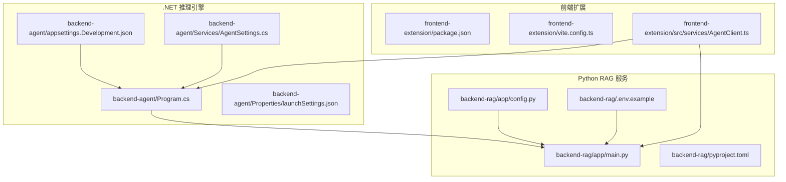
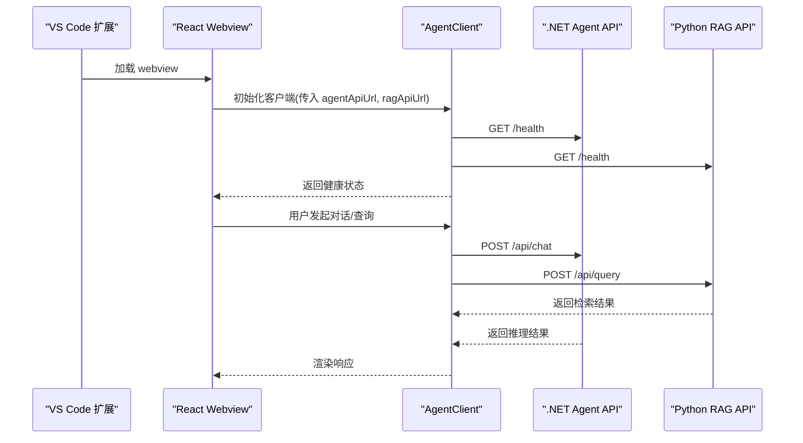
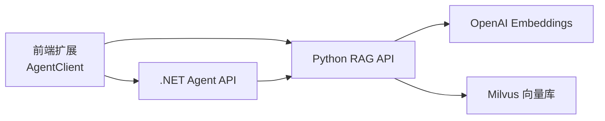
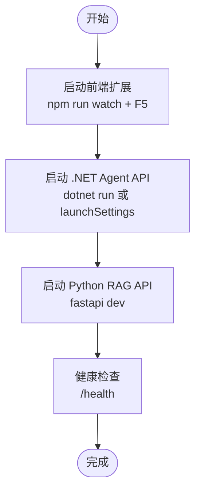

# 本地部署

<cite>
**本文引用的文件**
- [QUICK_START.md](file://QUICK_START.md)
- [frontend-extension/vite.config.ts](file://frontend-extension/vite.config.ts)
- [frontend-extension/package.json](file://frontend-extension/package.json)
- [frontend-extension/src/services/AgentClient.ts](file://frontend-extension/src/services/AgentClient.ts)
- [backend-agent/Program.cs](file://backend-agent/Program.cs)
- [backend-agent/Properties/launchSettings.json](file://backend-agent/Properties/launchSettings.json)
- [backend-agent/appsettings.Development.json](file://backend-agent/appsettings.Development.json)
- [backend-agent/Services/AgentSettings.cs](file://backend-agent/Services/AgentSettings.cs)
- [backend-rag/app/main.py](file://backend-rag/app/main.py)
- [backend-rag/app/config.py](file://backend-rag/app/config.py)
- [backend-rag/pyproject.toml](file://backend-rag/pyproject.toml)
- [backend-rag/.env.example](file://backend-rag/.env.example)
</cite>

## 目录
1. [简介](#简介)
2. [项目结构](#项目结构)
3. [核心组件](#核心组件)
4. [架构总览](#架构总览)
5. [详细组件分析](#详细组件分析)
6. [依赖关系分析](#依赖关系分析)
7. [性能与端口配置](#性能与端口配置)
8. [启动与验证流程](#启动与验证流程)
9. [常见问题排查](#常见问题排查)
10. [调试建议](#调试建议)
11. [结论](#结论)

## 简介
本指南面向需要在本地完整运行 AL Agent 的开发者，覆盖以下三类服务的本地部署与验证：
- 前端扩展（VS Code 扩展 + React Webview）
- .NET 推理引擎（后端 Agent API）
- Python RAG 服务（后端 RAG API）

文档将说明各服务的启动方式、端口与环境变量配置、跨域与健康检查端点验证，并提供常见问题的排查与调试建议。

## 项目结构
项目采用多模块分层组织：
- frontend-extension：VS Code 扩展前端，包含 React Webview 与打包脚本
- backend-agent：.NET 后端推理引擎，提供聊天与工具调用能力
- backend-rag：Python 后端 RAG 服务，提供语义检索与索引能力

图表来源
- [frontend-extension/package.json](file://frontend-extension/package.json#L68-L99)
- [frontend-extension/vite.config.ts](file://frontend-extension/vite.config.ts#L1-L29)
- [frontend-extension/src/services/AgentClient.ts](file://frontend-extension/src/services/AgentClient.ts#L1-L61)
- [backend-agent/Program.cs](file://backend-agent/Program.cs#L1-L67)
- [backend-agent/Properties/launchSettings.json](file://backend-agent/Properties/launchSettings.json#L1-L15)
- [backend-agent/appsettings.Development.json](file://backend-agent/appsettings.Development.json#L1-L16)
- [backend-agent/Services/AgentSettings.cs](file://backend-agent/Services/AgentSettings.cs#L1-L11)
- [backend-rag/app/main.py](file://backend-rag/app/main.py#L1-L139)
- [backend-rag/app/config.py](file://backend-rag/app/config.py#L1-L51)
- [backend-rag/pyproject.toml](file://backend-rag/pyproject.toml#L1-L67)
- [backend-rag/.env.example](file://backend-rag/.env.example#L1-L28)

章节来源
- [QUICK_START.md](file://QUICK_START.md#L1-L93)

## 核心组件
- 前端扩展（React + VS Code Webview）
  - 使用 Vite 构建 webview 资源，支持路径别名与输出目录配置
  - 通过 AgentClient 统一访问 .NET Agent API 与 Python RAG API
- .NET 推理引擎
  - 默认监听 5000 端口，启用 CORS 支持 VS Code webview 与动态端口
  - 通过配置节读取 RAG API 地址，默认 http://localhost:8000
- Python RAG 服务
  - 默认监听 8000 端口，提供 /health、/api/query、/api/index 等端点
  - 通过 .env 文件加载环境变量，支持 OpenAI、Milvus、GitHub 等配置

章节来源
- [frontend-extension/vite.config.ts](file://frontend-extension/vite.config.ts#L1-L29)
- [frontend-extension/src/services/AgentClient.ts](file://frontend-extension/src/services/AgentClient.ts#L1-L61)
- [backend-agent/Program.cs](file://backend-agent/Program.cs#L1-L67)
- [backend-agent/Properties/launchSettings.json](file://backend-agent/Properties/launchSettings.json#L1-L15)
- [backend-agent/appsettings.Development.json](file://backend-agent/appsettings.Development.json#L1-L16)
- [backend-rag/app/main.py](file://backend-rag/app/main.py#L55-L139)
- [backend-rag/app/config.py](file://backend-rag/app/config.py#L1-L51)
- [backend-rag/.env.example](file://backend-rag/.env.example#L1-L28)

## 架构总览
下图展示了三者之间的交互关系与数据流。

图表来源
- [frontend-extension/src/services/AgentClient.ts](file://frontend-extension/src/services/AgentClient.ts#L1-L61)
- [backend-agent/Program.cs](file://backend-agent/Program.cs#L60-L66)
- [backend-rag/app/main.py](file://backend-rag/app/main.py#L55-L86)

## 详细组件分析

### 前端扩展（Vite 配置与构建）
- 路径别名：@、@core、@services、@webview，便于模块化导入
- 输出目录：dist/webview，入口为 src/webview/index.html
- 开发模式：配合 VS Code 扩展脚本进行 watch 构建与调试

章节来源
- [frontend-extension/vite.config.ts](file://frontend-extension/vite.config.ts#L1-L29)
- [frontend-extension/package.json](file://frontend-extension/package.json#L68-L99)

### .NET 推理引擎（Agent API）
- CORS 策略：允许 http://localhost:* 与 vscode-webview://*，并允许任意头与方法
- 健康检查：GET /health 返回状态与时间戳
- RAG 客户端：基于 Refit，BaseAddress 来自配置节 Agent:RagApiUrl，默认 http://localhost:8000
- 日志级别：Development 配置中默认 Debug

章节来源
- [backend-agent/Program.cs](file://backend-agent/Program.cs#L1-L67)
- [backend-agent/appsettings.Development.json](file://backend-agent/appsettings.Development.json#L1-L16)
- [backend-agent/Services/AgentSettings.cs](file://backend-agent/Services/AgentSettings.cs#L1-L11)

### Python RAG 服务（FastAPI）
- 健康检查：GET /health 返回状态与向量存储连接状态
- 端点：
  - GET /：返回服务信息与可用端点列表
  - POST /api/query：语义检索
  - POST /api/index：工作区索引
  - POST /api/load/*：多种数据源加载（web、github、pdf、url）
- CORS：允许所有来源、方法与头
- 环境变量：通过 pydantic-settings 从 .env 加载，包括 OpenAI、Milvus、GitHub、Chunking、Retrieval 等

章节来源
- [backend-rag/app/main.py](file://backend-rag/app/main.py#L55-L139)
- [backend-rag/app/main.py](file://backend-rag/app/main.py#L141-L343)
- [backend-rag/app/config.py](file://backend-rag/app/config.py#L1-L51)
- [backend-rag/.env.example](file://backend-rag/.env.example#L1-L28)

## 依赖关系分析
- 前端扩展依赖 .NET Agent API 与 Python RAG API
- .NET Agent API 依赖 RAG API 进行检索
- Python RAG API 依赖 OpenAI Embedding 与 Milvus 向量库

图表来源
- [frontend-extension/src/services/AgentClient.ts](file://frontend-extension/src/services/AgentClient.ts#L1-L61)
- [backend-agent/Program.cs](file://backend-agent/Program.cs#L22-L31)
- [backend-rag/app/config.py](file://backend-rag/app/config.py#L1-L51)

## 性能与端口配置
- 端口约定
  - .NET Agent API：默认 5000（可通过命令行参数或 launchSettings 覆盖）
  - Python RAG API：默认 8000（可在 .env 中修改）
- 端口冲突处理
  - .NET：使用 dotnet run --urls 指定端口；或修改 launchSettings.json 中的 applicationUrl
  - Python：在 .env 中设置 PORT=XXXX
- 环境变量
  - .NET：Agent:OpenAIApiKey、Agent:ModelId 等
  - Python：OPENAI_API_KEY、MILVUS_*、GITHUB_TOKEN、HOST、PORT、DEBUG、MAX_CHUNK_SIZE、CHUNK_OVERLAP、DEFAULT_TOP_K 等

章节来源
- [QUICK_START.md](file://QUICK_START.md#L57-L93)
- [backend-agent/Properties/launchSettings.json](file://backend-agent/Properties/launchSettings.json#L1-L15)
- [backend-agent/appsettings.Development.json](file://backend-agent/appsettings.Development.json#L1-L16)
- [backend-rag/.env.example](file://backend-rag/.env.example#L1-L28)
- [backend-rag/app/config.py](file://backend-rag/app/config.py#L1-L51)

## 启动与验证流程
- 前端扩展
  - 安装依赖并启动 watch：在 frontend-extension 目录执行安装与 watch 脚本
  - 在 VS Code 中按 F5 启动扩展调试
  - 验证：打开 webview，确认初始化成功
- .NET 推理引擎
  - 方式一：使用 launchSettings.json 启动（默认 5000）
  - 方式二：dotnet run --urls=http://localhost:5000
  - 验证：访问 http://localhost:5000/health
- Python RAG 服务
  - 创建虚拟环境并安装依赖：参考 pyproject.toml
  - 复制 .env.example 并填写 OPENAI_API_KEY 等
  - 启动：fastapi dev app/main.py --port 8000
  - 验证：访问 http://localhost:8000/health

图表来源
- [QUICK_START.md](file://QUICK_START.md#L23-L56)
- [backend-agent/Program.cs](file://backend-agent/Program.cs#L60-L66)
- [backend-rag/app/main.py](file://backend-rag/app/main.py#L55-L63)

章节来源
- [QUICK_START.md](file://QUICK_START.md#L23-L56)
- [frontend-extension/package.json](file://frontend-extension/package.json#L68-L99)
- [backend-agent/Properties/launchSettings.json](file://backend-agent/Properties/launchSettings.json#L1-L15)
- [backend-rag/pyproject.toml](file://backend-rag/pyproject.toml#L1-L67)

## 常见问题排查
- 端口冲突
  - 症状：启动失败或端口被占用
  - 解决：.NET 使用 --urls 指定新端口；Python 在 .env 设置 PORT
- 依赖缺失
  - .NET：确保安装 .NET 9 SDK
  - Python：使用 uv 创建虚拟环境并安装 pyproject.toml 中的依赖
- 跨域配置错误
  - .NET：已内置 CORS 策略，允许 http://localhost:* 与 vscode-webview://*
  - Python：已允许所有来源、方法与头
- 健康检查失败
  - .NET：确认 Agent:RagApiUrl 指向正确地址（默认 http://localhost:8000）
  - Python：确认 OPENAI_API_KEY、Milvus 连接正常

章节来源
- [backend-agent/Program.cs](file://backend-agent/Program.cs#L11-L20)
- [backend-rag/app/main.py](file://backend-rag/app/main.py#L45-L52)
- [backend-agent/appsettings.Development.json](file://backend-agent/appsettings.Development.json#L1-L16)
- [backend-rag/.env.example](file://backend-rag/.env.example#L1-L28)

## 调试建议
- 启用详细日志
  - .NET：Development 配置中默认 Debug 级别，可结合 ASP.NET Core 日志查看器
  - Python：FastAPI 默认 INFO 级别，可在 .env 中设置 DEBUG=true 提升日志级别
- 请求追踪
  - 使用浏览器开发者工具或 VS Code 的网络面板，观察前端到 .NET 与 RAG 的请求与响应
  - 在 AgentClient 中添加请求拦截与重试逻辑（可选）
- 环境变量与配置
  - .NET：通过 appsettings.Development.json 或环境变量覆盖
  - Python：通过 .env 文件统一管理

章节来源
- [backend-agent/appsettings.Development.json](file://backend-agent/appsettings.Development.json#L1-L16)
- [backend-rag/app/config.py](file://backend-rag/app/config.py#L1-L51)
- [frontend-extension/src/services/AgentClient.ts](file://frontend-extension/src/services/AgentClient.ts#L1-L61)

## 结论
通过以上步骤，您可以在本地成功启动并验证 AL Agent 的三类服务。建议优先完成环境变量与端口配置，再逐一启动各服务并通过 /health 端点进行验证。遇到问题时，优先检查端口占用、依赖安装与跨域策略，并结合日志与网络面板进行定位。