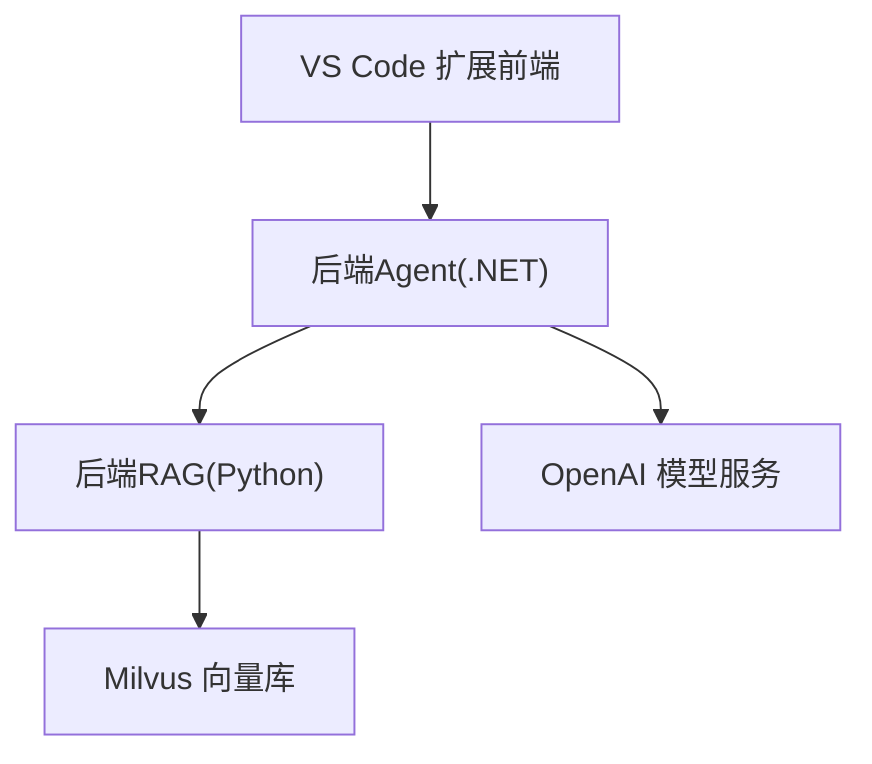
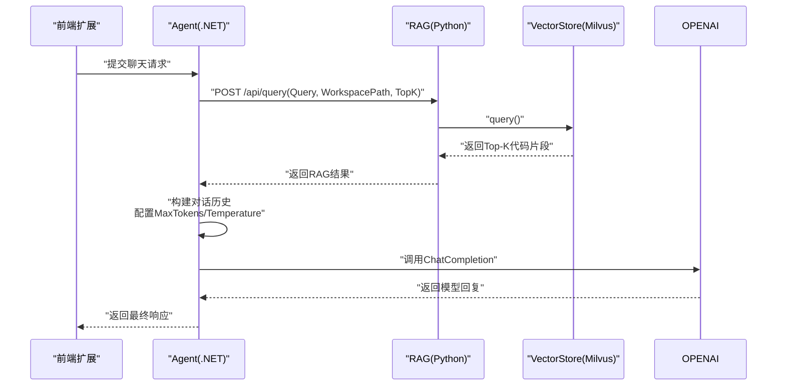
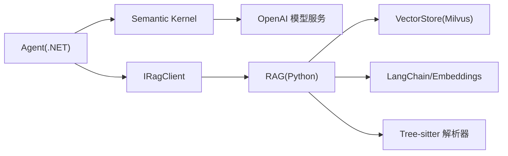

# 性能优化

<cite>
**本文引用的文件**
- [backend-agent/appsettings.json](file://backend-agent/appsettings.json)
- [backend-agent/appsettings.Development.json](file://backend-agent/appsettings.Development.json)
- [backend-agent/Program.cs](file://backend-agent/Program.cs)
- [backend-agent/Services/AgentSettings.cs](file://backend-agent/Services/AgentSettings.cs)
- [backend-agent/Services/AgentService.cs](file://backend-agent/Services/AgentService.cs)
- [backend-agent/Services/IRagClient.cs](file://backend-agent/Services/IRagClient.cs)
- [backend-agent/Models/ChatModels.cs](file://backend-agent/Models/ChatModels.cs)
- [backend-rag/app/main.py](file://backend-rag/app/main.py)
- [backend-rag/app/config.py](file://backend-rag/app/config.py)
- [backend-rag/app/vector_store.py](file://backend-rag/app/vector_store.py)
- [backend-rag/app/chunker.py](file://backend-rag/app/chunker.py)
- [backend-rag/.env.example](file://backend-rag/.env.example)
- [backend-rag/pyproject.toml](file://backend-rag/pyproject.toml)
- [QUICK_START.md](file://QUICK_START.md)
</cite>

## 目录
1. [引言](#引言)
2. [项目结构](#项目结构)
3. [核心组件](#核心组件)
4. [架构总览](#架构总览)
5. [详细组件分析](#详细组件分析)
6. [依赖关系分析](#依赖关系分析)
7. [性能考量](#性能考量)
8. [故障排查指南](#故障排查指南)
9. [结论](#结论)
10. [附录](#附录)

## 引言
本文件聚焦于生产环境中的性能调优配置，围绕以下关键点展开：
- 后端Agent（.NET）中Agent配置项（如MaxTokens、Temperature）与RagApiUrl连接效率对响应延迟的影响；
- 后端RAG（Python）中.env示例参数（如CHUNK_OVERLAP、MAX_CHUNK_SIZE、DEFAULT_TOP_K）对检索精度与速度的权衡；
- 并发处理、向量数据库连接池、缓存策略（如Redis集成建议）、异步I/O优化；
- 面向不同规模部署（小型团队 vs 企业级）的推荐配置组合；
- 基于监控指标（如P95延迟、吞吐量）的持续迭代优化方法。

## 项目结构
整体采用“前端扩展 + 后端Agent（.NET）+ 后端RAG（Python）”三层架构。Agent负责对话编排与工具调用，RAG负责语义检索与上下文召回。

图表来源
- [QUICK_START.md](file://QUICK_START.md#L1-L93)
- [backend-agent/Program.cs](file://backend-agent/Program.cs#L1-L67)
- [backend-rag/app/main.py](file://backend-rag/app/main.py#L1-L120)
- [backend-rag/app/vector_store.py](file://backend-rag/app/vector_store.py#L1-L120)

章节来源
- [QUICK_START.md](file://QUICK_START.md#L1-L93)

## 核心组件
- Agent配置与运行时参数：MaxTokens、Temperature、RagApiUrl、ModelId、OpenAIApiKey。
- RAG检索参数：MAX_CHUNK_SIZE、CHUNK_OVERLAP、DEFAULT_TOP_K。
- 关键服务与接口：
  - AgentService：构建对话历史、调用RAG、调用OpenAI模型、解析结果。
  - IRagClient：定义RAG查询接口。
  - VectorStore：基于Milvus的向量检索与索引管理。
  - TreeSitterChunker：基于AST的代码分块器。

章节来源
- [backend-agent/Services/AgentSettings.cs](file://backend-agent/Services/AgentSettings.cs#L1-L11)
- [backend-agent/Services/AgentService.cs](file://backend-agent/Services/AgentService.cs#L1-L180)
- [backend-agent/Services/IRagClient.cs](file://backend-agent/Services/IRagClient.cs#L1-L14)
- [backend-rag/app/vector_store.py](file://backend-rag/app/vector_store.py#L1-L120)
- [backend-rag/app/chunker.py](file://backend-rag/app/chunker.py#L1-L120)

## 架构总览
Agent与RAG之间的交互流程如下：

图表来源
- [backend-agent/Services/AgentService.cs](file://backend-agent/Services/AgentService.cs#L46-L117)
- [backend-agent/Services/IRagClient.cs](file://backend-agent/Services/IRagClient.cs#L1-L14)
- [backend-rag/app/main.py](file://backend-rag/app/main.py#L65-L90)
- [backend-rag/app/vector_store.py](file://backend-rag/app/vector_store.py#L377-L435)

## 详细组件分析

### Agent配置项对延迟与质量的影响
- MaxTokens：限制单次模型输出长度，直接影响网络往返次数与总Token消耗。在高复杂度任务中适当提高可减少多轮对话；但会增加单次推理时间与成本。
- Temperature：控制采样随机性。较低温度提升确定性与速度；较高温度增强创造性但可能增加重复与重算。
- ModelId/OpenAIApiKey：模型选择与鉴权直接影响可用性与性能上限。
- RagApiUrl：Agent通过Refit客户端访问RAG服务，超时默认30秒，连接基地址来自配置。网络抖动或RAG延迟会直接放大到端到端延迟。

优化要点
- 将MaxTokens与Temperature作为A/B测试维度，结合P95延迟与吞吐量评估收益。
- 对于长上下文任务，优先通过RAG提升检索质量，再在Agent侧控制MaxTokens以平衡延迟。
- 在生产环境使用更严格的超时与重试策略，避免阻塞线程资源。

章节来源
- [backend-agent/appsettings.json](file://backend-agent/appsettings.json#L1-L17)
- [backend-agent/appsettings.Development.json](file://backend-agent/appsettings.Development.json#L1-L16)
- [backend-agent/Program.cs](file://backend-agent/Program.cs#L22-L31)
- [backend-agent/Services/AgentService.cs](file://backend-agent/Services/AgentService.cs#L82-L99)

### RAG检索参数对精度与速度的权衡
- MAX_CHUNK_SIZE：决定单段文本长度。增大可提升上下文完整性，但会增加嵌入生成与向量检索开销；过小则导致检索碎片化，降低相关性。
- CHUNK_OVERLAP：重叠窗口有助于跨边界保持语义连贯，但会增加索引体量与检索候选数。
- DEFAULT_TOP_K：影响召回数量。增大Top-K可提升召回率，但会显著增加向量搜索与排序成本；减小Top-K可加速但可能漏检关键信息。

优化要点
- 使用Recall@K等指标评估不同组合的效果，结合P95延迟进行权衡。
- 对大仓库采用更大MAX_CHUNK_SIZE与适度CHUNK_OVERLAP，同时将DEFAULT_TOP_K设为较小值以保证低延迟。
- 对外部文档（网页/PDF/GitHub）采用统一的文本切分策略，确保检索一致性。

章节来源
- [backend-rag/.env.example](file://backend-rag/.env.example#L1-L28)
- [backend-rag/app/config.py](file://backend-rag/app/config.py#L1-L51)
- [backend-rag/app/vector_store.py](file://backend-rag/app/vector_store.py#L121-L205)
- [backend-rag/app/chunker.py](file://backend-rag/app/chunker.py#L1-L120)

### AgentService处理逻辑与性能瓶颈
- 对话历史构建：系统提示 + RAG上下文 + 历史消息，长度增长会线性增加Token消耗与模型推理时间。
- 工具调用：AutoInvokeKernelFunctions自动执行工具，减少手动分支判断，但工具执行本身可能引入额外延迟。
- RAG调用：默认TopK=5，若无命中则跳过上下文注入，避免无效开销。

优化要点
- 控制对话历史长度，必要时裁剪旧消息。
- 将RAG失败降级为无上下文模式，避免阻塞主流程。
- 对工具调用结果进行缓存与去重，减少重复执行。

章节来源
- [backend-agent/Services/AgentService.cs](file://backend-agent/Services/AgentService.cs#L46-L145)

### VectorStore与Milvus检索路径
- 连接懒加载：首次使用时建立连接，避免启动时不必要的连接开销。
- 索引策略：IVF_FLAT + COSINE距离，nlist参数影响倒排表数量；nprobe控制搜索候选数，越大越准但越慢。
- 查询流程：生成查询向量 → 加载集合 → 搜索TopK → 输出结果。

优化要点
- 调整nprobe与nlist以平衡精度与延迟；对高频查询启用预加载集合。
- 对大规模仓库按工作区隔离集合，避免全局扫描。
- 定期维护集合统计与健康检查，防止数据倾斜。

章节来源
- [backend-rag/app/vector_store.py](file://backend-rag/app/vector_store.py#L42-L120)
- [backend-rag/app/vector_store.py](file://backend-rag/app/vector_store.py#L377-L435)

### 并发处理与异步I/O建议
- Agent端：
  - 使用异步API（如I/O密集型工具调用）避免阻塞主线程。
  - 对RAG查询与OpenAI调用采用并发限流与超时控制，防止雪崩。
- RAG端：
  - FastAPI默认基于事件循环，适合高并发；建议配合Uvicorn多进程/多线程部署。
  - 向量库操作尽量批量插入与查询，减少网络往返。
- 缓存策略（建议）：
  - Redis用于短期热点缓存（如最近查询结果、工具调用结果），注意失效策略与一致性。
  - 对RAG检索结果进行轻量级缓存，结合版本化工作区路径，避免陈旧上下文。

章节来源
- [backend-agent/Services/AgentService.cs](file://backend-agent/Services/AgentService.cs#L119-L145)
- [backend-rag/app/main.py](file://backend-rag/app/main.py#L1-L120)
- [backend-rag/pyproject.toml](file://backend-rag/pyproject.toml#L1-L67)

## 依赖关系分析
- Agent依赖：
  - Refit客户端访问RAG服务；
  - Semantic Kernel与OpenAI ChatCompletion；
  - 自定义工具（文件系统、代码分析）。
- RAG依赖：
  - Milvus向量库；
  - LangChain与OpenAI Embeddings；
  - Tree-sitter解析器（可选）。

图表来源
- [backend-agent/Program.cs](file://backend-agent/Program.cs#L22-L49)
- [backend-agent/Services/IRagClient.cs](file://backend-agent/Services/IRagClient.cs#L1-L14)
- [backend-rag/app/vector_store.py](file://backend-rag/app/vector_store.py#L1-L120)
- [backend-rag/app/chunker.py](file://backend-rag/app/chunker.py#L1-L120)
- [backend-rag/pyproject.toml](file://backend-rag/pyproject.toml#L1-L67)

章节来源
- [backend-agent/Program.cs](file://backend-agent/Program.cs#L1-L67)
- [backend-rag/pyproject.toml](file://backend-rag/pyproject.toml#L1-L67)

## 性能考量

### 配置项与延迟关系
- MaxTokens与Temperature：
  - 提高MaxTokens会增加模型推理时间与网络往返次数，需结合P95延迟评估。
  - Temperature升高可能增加重算与重复，建议在非创意场景下调低。
- RagApiUrl与网络：
  - Refit默认超时30秒，生产环境应根据RAG延迟调整超时与重试策略，避免阻塞。
  - 本地开发与生产环境的RAG地址差异会影响端到端延迟，需在配置中明确区分。

章节来源
- [backend-agent/appsettings.json](file://backend-agent/appsettings.json#L1-L17)
- [backend-agent/appsettings.Development.json](file://backend-agent/appsettings.Development.json#L1-L16)
- [backend-agent/Program.cs](file://backend-agent/Program.cs#L22-L31)
- [backend-agent/Services/AgentService.cs](file://backend-agent/Services/AgentService.cs#L82-L99)

### 检索参数与精度/速度权衡
- MAX_CHUNK_SIZE与CHUNK_OVERLAP：
  - 增大MAX_CHUNK_SIZE可提升上下文完整性，但会增加嵌入与检索成本；适度重叠有助于跨边界连贯。
- DEFAULT_TOP_K：
  - 较大TopK提升召回率，但显著增加向量搜索与排序时间；建议先以较小TopK快速过滤，再按需扩大。

章节来源
- [backend-rag/.env.example](file://backend-rag/.env.example#L1-L28)
- [backend-rag/app/config.py](file://backend-rag/app/config.py#L1-L51)
- [backend-rag/app/vector_store.py](file://backend-rag/app/vector_store.py#L377-L435)

### 并发与异步I/O
- Agent端：
  - 使用异步工具与I/O操作，避免阻塞。
  - 对RAG与OpenAI调用实施并发限流与超时控制。
- RAG端：
  - FastAPI/Uvicorn多进程/多线程部署，批量插入与查询，减少网络往返。
- 缓存：
  - Redis短期缓存热点查询与工具结果，注意版本化与失效策略。

章节来源
- [backend-agent/Services/AgentService.cs](file://backend-agent/Services/AgentService.cs#L119-L145)
- [backend-rag/app/main.py](file://backend-rag/app/main.py#L1-L120)
- [backend-rag/pyproject.toml](file://backend-rag/pyproject.toml#L1-L67)

### 不同规模部署的推荐配置组合
- 小型团队（低并发、单机）
  - Agent：MaxTokens中等、Temperature较低、RagApiUrl指向本地RAG。
  - RAG：MAX_CHUNK_SIZE适中、CHUNK_OVERLAP中等、DEFAULT_TOP_K较小。
  - 并发：单进程Uvicorn，无需连接池与Redis缓存。
- 企业级（高并发、分布式）
  - Agent：MaxTokens可略增、Temperature维持稳定；RagApiUrl指向高可用RAG集群。
  - RAG：MAX_CHUNK_SIZE较大、CHUNK_OVERLAP较大、DEFAULT_TOP_K适中；启用Milvus连接池与预加载集合。
  - 并发：多进程Uvicorn，Redis缓存热点查询与工具结果；对RAG查询加限流与熔断。
  - 监控：P95延迟、吞吐量、错误率、RAG命中率、Milvus查询耗时。

章节来源
- [backend-rag/app/vector_store.py](file://backend-rag/app/vector_store.py#L42-L120)
- [backend-rag/app/main.py](file://backend-rag/app/main.py#L1-L120)
- [backend-rag/pyproject.toml](file://backend-rag/pyproject.toml#L1-L67)

### 监控指标与持续迭代
- 关键指标
  - P95延迟：端到端（Agent+RAG+模型）与RAG内部（检索）延迟。
  - 吞吐量：每秒请求数，区分正常与异常请求。
  - 召回质量：Recall@K、Precision@K、MRR等。
  - 资源利用率：CPU、内存、Milvus查询耗时、网络RTT。
- 迭代方法
  - A/B测试不同MaxTokens/Temperature/RAG参数组合。
  - 基于P95与吞吐量的回归阈值，动态调整DEFAULT_TOP_K与CHUNK参数。
  - 结合召回质量指标，逐步微调以达到延迟与精度的最佳平衡。

章节来源
- [QUICK_START.md](file://QUICK_START.md#L85-L93)

## 故障排查指南
- RAG不可用或超时
  - 检查RAG健康检查端点与Milvus连接状态。
  - 核对RagApiUrl与网络连通性，确认Refit超时设置。
- 检索结果为空
  - 确认工作区已索引且集合非空；检查DEFAULT_TOP_K是否过大导致稀疏。
  - 调整MAX_CHUNK_SIZE与CHUNK_OVERLAP，确保覆盖关键逻辑单元。
- 模型响应异常
  - 检查OpenAI鉴权与配额；适当降低MaxTokens与Temperature以减少重算。
- 性能退化
  - 观察P95延迟与吞吐量趋势；必要时缩小TopK、减少MaxTokens或降低CHUNK_OVERLAP。

章节来源
- [backend-rag/app/main.py](file://backend-rag/app/main.py#L55-L63)
- [backend-rag/app/vector_store.py](file://backend-rag/app/vector_store.py#L448-L457)
- [backend-agent/Program.cs](file://backend-agent/Program.cs#L22-L31)
- [backend-agent/Services/AgentService.cs](file://backend-agent/Services/AgentService.cs#L119-L145)

## 结论
生产环境的性能优化需要从“配置项、检索参数、并发与异步、缓存与连接池、监控与迭代”五个维度协同推进。通过将Agent与RAG的关键参数与监控指标绑定，可以形成闭环优化流程，持续在延迟与精度之间找到最佳平衡点。

## 附录

### 关键参数对照表
- Agent（.NET）
  - MaxTokens：控制单次输出长度
  - Temperature：控制采样随机性
  - RagApiUrl：RAG服务地址
  - ModelId/OpenAIApiKey：模型与鉴权
- RAG（Python）
  - MAX_CHUNK_SIZE：分块最大长度
  - CHUNK_OVERLAP：重叠窗口
  - DEFAULT_TOP_K：召回数量

章节来源
- [backend-agent/appsettings.json](file://backend-agent/appsettings.json#L1-L17)
- [backend-rag/.env.example](file://backend-rag/.env.example#L1-L28)
- [backend-rag/app/config.py](file://backend-rag/app/config.py#L1-L51)