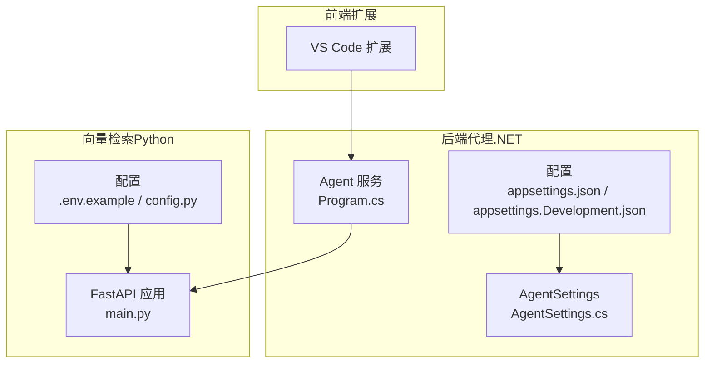
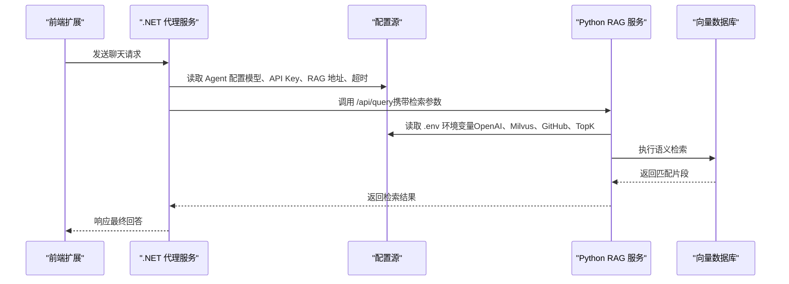
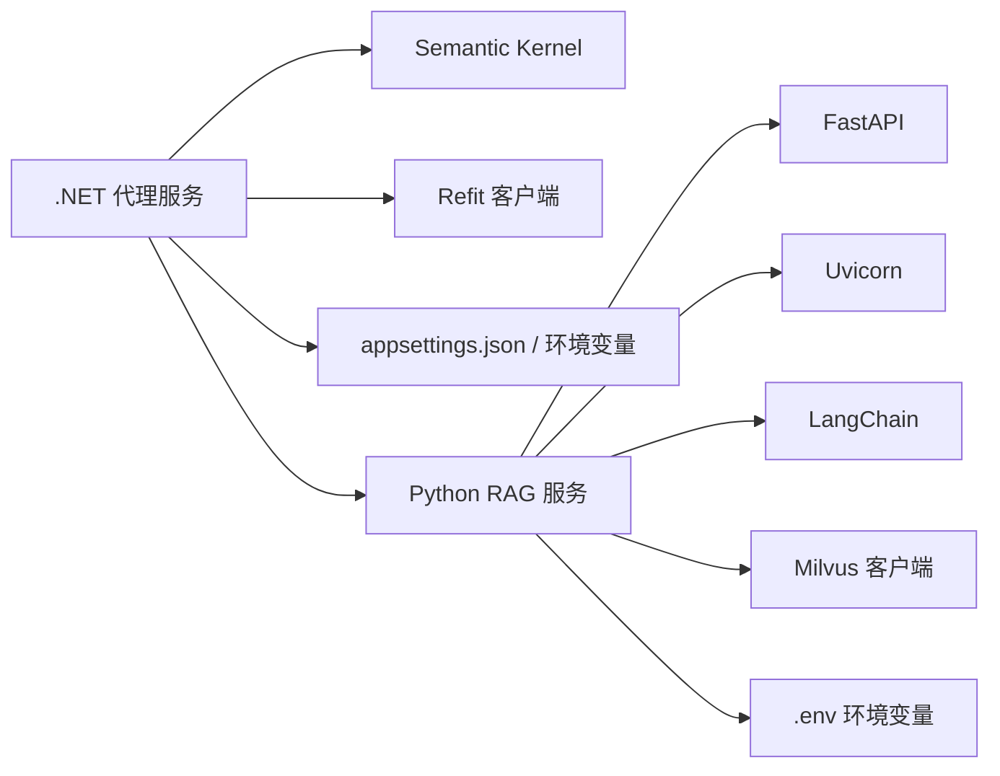

# 生产环境配置

<cite>
**本文引用的文件**
- [backend-agent/appsettings.json](file://backend-agent/appsettings.json)
- [backend-agent/appsettings.Development.json](file://backend-agent/appsettings.Development.json)
- [backend-agent/Program.cs](file://backend-agent/Program.cs)
- [backend-agent/Services/AgentSettings.cs](file://backend-agent/Services/AgentSettings.cs)
- [backend-agent/Properties/launchSettings.json](file://backend-agent/Properties/launchSettings.json)
- [backend-rag/.env.example](file://backend-rag/.env.example)
- [backend-rag/app/config.py](file://backend-rag/app/config.py)
- [backend-rag/app/main.py](file://backend-rag/app/main.py)
- [backend-rag/pyproject.toml](file://backend-rag/pyproject.toml)
- [.gitignore](file://.gitignore)
</cite>

## 目录
1. [引言](#引言)
2. [项目结构](#项目结构)
3. [核心组件](#核心组件)
4. [架构总览](#架构总览)
5. [详细组件分析](#详细组件分析)
6. [依赖关系分析](#依赖关系分析)
7. [性能考虑](#性能考虑)
8. [故障排查指南](#故障排查指南)
9. [结论](#结论)
10. [附录](#附录)

## 引言
本文件面向从开发环境迁移到生产环境的工程团队，系统性说明配置迁移策略与最佳实践。重点覆盖：
- appsettings.json 与 .env.example 中的关键生产级配置项（API 密钥、向量数据库连接、模型服务端点、超时等）
- 敏感信息的安全管理（环境变量与密钥管理服务建议）
- 配置验证与校验流程
- 性能调优参数（并发连接、缓存策略、RAG 检索阈值）
- 不同部署场景（云服务器、私有化部署）的配置示例与安全加固（HTTPS、请求限制）

## 项目结构
后端由两部分组成：
- .NET 后端代理服务（backend-agent）：负责与前端交互、调用 RAG 服务、集成模型服务
- Python 向量检索服务（backend-rag）：提供语义检索、索引与加载能力

图表来源
- [backend-agent/Program.cs](file://backend-agent/Program.cs#L1-L67)
- [backend-agent/appsettings.json](file://backend-agent/appsettings.json#L1-L17)
- [backend-agent/appsettings.Development.json](file://backend-agent/appsettings.Development.json#L1-L16)
- [backend-agent/Services/AgentSettings.cs](file://backend-agent/Services/AgentSettings.cs#L1-L11)
- [backend-rag/app/main.py](file://backend-rag/app/main.py#L1-L343)
- [backend-rag/.env.example](file://backend-rag/.env.example#L1-L28)
- [backend-rag/app/config.py](file://backend-rag/app/config.py#L1-L51)

章节来源
- [backend-agent/Program.cs](file://backend-agent/Program.cs#L1-L67)
- [backend-agent/appsettings.json](file://backend-agent/appsettings.json#L1-L17)
- [backend-agent/appsettings.Development.json](file://backend-agent/appsettings.Development.json#L1-L16)
- [backend-agent/Services/AgentSettings.cs](file://backend-agent/Services/AgentSettings.cs#L1-L11)
- [backend-rag/app/main.py](file://backend-rag/app/main.py#L1-L343)
- [backend-rag/.env.example](file://backend-rag/.env.example#L1-L28)
- [backend-rag/app/config.py](file://backend-rag/app/config.py#L1-L51)

## 核心组件
- .NET 代理服务通过 Program.cs 注册 RAG 客户端，设置基础地址与默认超时；同时读取 Agent 节点配置（模型 ID、API Key、RAG 地址、最大 Token、温度等）。
- Python RAG 服务通过 Pydantic Settings 从 .env 文件加载环境变量，包含 OpenAI API Key、Milvus 连接参数、GitHub Token、服务监听地址、分块与检索参数等。

章节来源
- [backend-agent/Program.cs](file://backend-agent/Program.cs#L1-L67)
- [backend-agent/Services/AgentSettings.cs](file://backend-agent/Services/AgentSettings.cs#L1-L11)
- [backend-rag/app/config.py](file://backend-rag/app/config.py#L1-L51)

## 架构总览
下图展示生产环境配置在系统中的位置与流向。

图表来源
- [backend-agent/Program.cs](file://backend-agent/Program.cs#L1-L67)
- [backend-rag/app/main.py](file://backend-rag/app/main.py#L65-L90)
- [backend-rag/app/config.py](file://backend-rag/app/config.py#L1-L51)

## 详细组件分析

### .NET 代理服务配置（appsettings.json 与 Program.cs）
- 关键生产级配置项
  - API 密钥管理：Agent:OpenAIApiKey（用于模型服务认证）
  - 模型服务端点：Agent:ModelId（模型标识）
  - RAG 服务端点：Agent:RagApiUrl（代理服务调用的后端地址）
  - 超时设置：客户端默认超时为 30 秒
  - 推理参数：Agent:MaxTokens、Agent:Temperature
- 开发与生产差异
  - appsettings.Development.json 提供更详细的日志级别
  - appsettings.json 提供默认生产配置
- 安全与运行时
  - 默认允许所有主机访问（生产中建议收紧）
  - CORS 策略对本地前端与 VS Code WebView 放宽，生产需按域名白名单配置

章节来源
- [backend-agent/appsettings.json](file://backend-agent/appsettings.json#L1-L17)
- [backend-agent/appsettings.Development.json](file://backend-agent/appsettings.Development.json#L1-L16)
- [backend-agent/Program.cs](file://backend-agent/Program.cs#L1-L67)
- [backend-agent/Services/AgentSettings.cs](file://backend-agent/Services/AgentSettings.cs#L1-L11)

### Python RAG 服务配置（.env.example 与 config.py）
- 关键生产级配置项
  - OpenAI API Key：OPENAI_API_KEY
  - 向量数据库连接：MILVUS_HOST、MILVUS_PORT、MILVUS_USER、MILVUS_PASSWORD、MILVUS_DB_NAME
  - GitHub 访问：GITHUB_TOKEN（私有仓库需要）
  - 服务监听：HOST、PORT、DEBUG
  - 分块策略：MAX_CHUNK_SIZE、CHUNK_OVERLAP
  - 检索阈值：DEFAULT_TOP_K
- 配置加载机制
  - 使用 Pydantic Settings 从 .env 文件加载，大小写不敏感，支持默认值

章节来源
- [backend-rag/.env.example](file://backend-rag/.env.example#L1-L28)
- [backend-rag/app/config.py](file://backend-rag/app/config.py#L1-L51)
- [backend-rag/app/main.py](file://backend-rag/app/main.py#L1-L343)

### 配置迁移策略（开发到生产）
- 逐步替换
  - 将 appsettings.Development.json 的日志级别与 Agent 参数迁移到 appsettings.json
  - 在 .NET 侧将 RagApiUrl 指向生产 RAG 服务地址
  - 在 Python 侧将 .env.example 中的敏感项填入 .env（注意不要提交 .env）
- 环境隔离
  - 使用不同的 appsettings.{Environment}.json 或环境变量区分环境
  - .NET 通过 ASPNETCORE_ENVIRONMENT 切换环境
  - Python 通过 .env 文件区分环境

章节来源
- [backend-agent/appsettings.json](file://backend-agent/appsettings.json#L1-L17)
- [backend-agent/appsettings.Development.json](file://backend-agent/appsettings.Development.json#L1-L16)
- [backend-agent/Properties/launchSettings.json](file://backend-agent/Properties/launchSettings.json#L1-L15)
- [backend-rag/.env.example](file://backend-rag/.env.example#L1-L28)

### 敏感信息安全管理
- 环境变量优先
  - .NET：Agent:OpenAIApiKey 从环境变量注入（建议通过密钥管理服务）
  - Python：OPENAI_API_KEY、MILVUS_USER/PASSWORD、GITHUB_TOKEN 从 .env 注入
- 密钥管理服务建议
  - 使用平台密钥管理服务（如 Azure Key Vault、AWS Secrets Manager、HashiCorp Vault）集中存储与轮换
  - 在容器编排中以 Secret 形式挂载，避免硬编码在镜像或配置文件中
- 隐私与合规
  - .gitignore 已忽略 .env、.env.local 等环境文件，防止误提交
  - 生产环境禁止将 .env 提交至版本库

章节来源
- [backend-agent/Program.cs](file://backend-agent/Program.cs#L1-L67)
- [backend-rag/app/config.py](file://backend-rag/app/config.py#L1-L51)
- [.gitignore](file://.gitignore#L1-L46)

### 配置验证最佳实践
- 结构化校验
  - .NET：通过强类型 AgentSettings 映射配置节，避免字符串解析错误
  - Python：通过 Pydantic Settings 自动校验类型与默认值
- 运行前检查
  - 启动时打印关键配置（如 Milvus 连接信息、模型 ID、RAG 地址）
  - 健康检查端点返回状态与依赖健康状况
- 动态更新
  - 对于可热更新的参数（如 TopK、分块大小），在运行时重新加载配置或通过管理接口下发

章节来源
- [backend-agent/Services/AgentSettings.cs](file://backend-agent/Services/AgentSettings.cs#L1-L11)
- [backend-rag/app/config.py](file://backend-rag/app/config.py#L1-L51)
- [backend-rag/app/main.py](file://backend-rag/app/main.py#L28-L63)

### 性能调优参数
- 并发连接数
  - .NET 侧 RAG 客户端默认超时 30 秒，可根据网络与下游延迟调整
  - Python 侧建议结合 Uvicorn 的 workers 与进程数进行压测，确定最优并发
- 缓存策略
  - 可在代理层增加查询结果缓存（基于查询内容哈希），减少重复检索
  - 向量数据库层面开启合适的索引与分区策略
- RAG 检索阈值
  - DEFAULT_TOP_K 控制召回数量，结合评估指标（如召回率）进行调优
  - MAX_CHUNK_SIZE 与 CHUNK_OVERLAP 影响上下文质量与检索速度的平衡

章节来源
- [backend-agent/Program.cs](file://backend-agent/Program.cs#L1-L67)
- [backend-rag/.env.example](file://backend-rag/.env.example#L1-L28)
- [backend-rag/app/config.py](file://backend-rag/app/config.py#L1-L51)

### 不同部署场景配置示例与安全加固
- 云服务器（公有云）
  - .NET 代理服务
    - 允许主机：仅允许特定域名或 IP
    - CORS：仅允许来自前端域名的请求
    - HTTPS：启用反向代理（Nginx/Traefik）终止 TLS，代理转发至 .NET
  - Python RAG 服务
    - HOST 绑定内网地址，通过反向代理暴露端口
    - Milvus 与 OpenAI 通过平台提供的安全网络访问
- 私有化部署
  - 严格限制 AllowedHosts 与 CORS 白名单
  - 使用内部证书与双向 TLS，或通过内网负载均衡器统一加密
  - 将 .env 放置于受控目录，仅授予最小权限
- 输入请求限制
  - 在反向代理层限制请求体大小、速率与并发连接数
  - 对 /api/query 与 /api/index 等端点增加限流与熔断

章节来源
- [backend-agent/appsettings.json](file://backend-agent/appsettings.json#L1-L17)
- [backend-rag/app/main.py](file://backend-rag/app/main.py#L1-L343)

## 依赖关系分析
- .NET 代理服务依赖
  - Semantic Kernel（模型服务）
  - Refit（RAG 客户端）
  - 配置来源于 appsettings.json 与环境变量
- Python RAG 服务依赖
  - FastAPI、Uvicorn、LangChain、Milvus 客户端
  - 配置来源于 .env 文件

图表来源
- [backend-agent/Program.cs](file://backend-agent/Program.cs#L1-L67)
- [backend-rag/app/main.py](file://backend-rag/app/main.py#L1-L343)
- [backend-rag/pyproject.toml](file://backend-rag/pyproject.toml#L1-L67)

章节来源
- [backend-agent/Program.cs](file://backend-agent/Program.cs#L1-L67)
- [backend-rag/app/main.py](file://backend-rag/app/main.py#L1-L343)
- [backend-rag/pyproject.toml](file://backend-rag/pyproject.toml#L1-L67)

## 性能考虑
- 超时与重试
  - .NET 侧默认 30 秒，建议根据下游延迟与队列长度动态调整
  - 对 RAG 服务增加指数退避重试与熔断保护
- 并发与资源
  - Python 侧通过多进程/多线程提升吞吐，结合队列与限流
  - 向量数据库连接池大小与查询并发需与硬件资源匹配
- 缓存与预热
  - 对热点查询建立 LRU 缓存，定期预热常用索引
  - 分块策略与 TopK 参数需结合业务场景反复评估

## 故障排查指南
- 健康检查
  - .NET 代理服务提供 /health 健康端点
  - Python RAG 服务提供 /health 健康端点与 Milvus 连接状态
- 常见问题定位
  - API Key 未配置或错误：检查 Agent:OpenAIApiKey 与 OPENAI_API_KEY
  - RAG 地址不可达：确认 Agent:RagApiUrl 与反向代理配置
  - Milvus 连接失败：核对 .env 中的 HOST/PORT/USER/PASSWORD/DB_NAME
  - 查询超时：检查 .NET 侧超时设置与 Python 侧处理耗时
- 日志与监控
  - .NET：开发环境日志更详细，生产建议降级到 Information
  - Python：启动日志包含 Milvus 连接信息，便于快速定位

章节来源
- [backend-agent/Program.cs](file://backend-agent/Program.cs#L1-L67)
- [backend-rag/app/main.py](file://backend-rag/app/main.py#L55-L63)

## 结论
生产环境配置迁移的核心在于“以环境变量为中心、以强类型配置为边界、以健康检查为哨兵”。通过严格的密钥管理、合理的超时与并发策略、以及针对不同部署场景的安全加固，可以显著提升系统的稳定性与安全性。

## 附录

### 配置项对照表（生产级）
- .NET 代理服务（Agent 节点）
  - OpenAIApiKey：模型服务认证
  - ModelId：模型标识
  - RagApiUrl：RAG 服务地址
  - MaxTokens：最大输出 Token
  - Temperature：采样温度
  - AllowedHosts：允许的主机
  - CORS：允许的来源与方法
- Python RAG 服务（.env）
  - OPENAI_API_KEY：嵌入模型 API Key
  - MILVUS_HOST/PORT/USER/PASSWORD/DB_NAME：向量数据库连接
  - GITHUB_TOKEN：私有仓库访问
  - HOST/PORT/DEBUG：服务监听与调试开关
  - MAX_CHUNK_SIZE/CHUNK_OVERLAP：分块策略
  - DEFAULT_TOP_K：检索阈值

章节来源
- [backend-agent/appsettings.json](file://backend-agent/appsettings.json#L1-L17)
- [backend-agent/Program.cs](file://backend-agent/Program.cs#L1-L67)
- [backend-rag/.env.example](file://backend-rag/.env.example#L1-L28)
- [backend-rag/app/config.py](file://backend-rag/app/config.py#L1-L51)