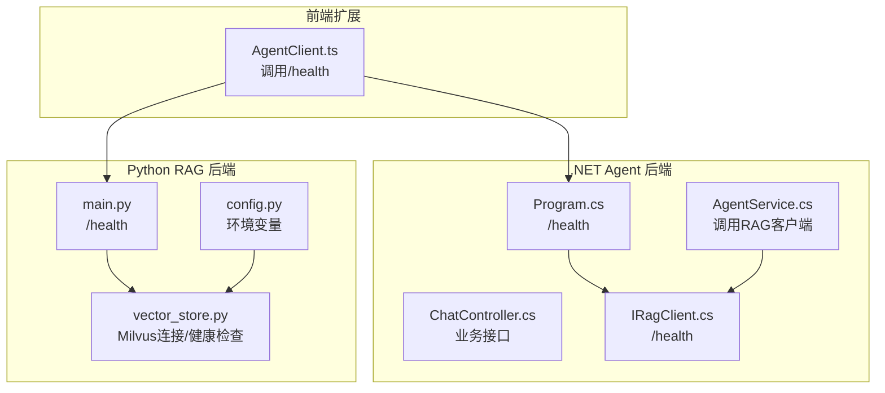
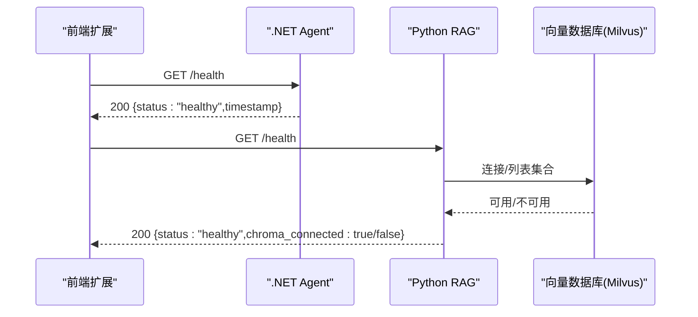
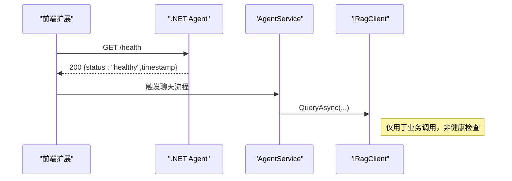
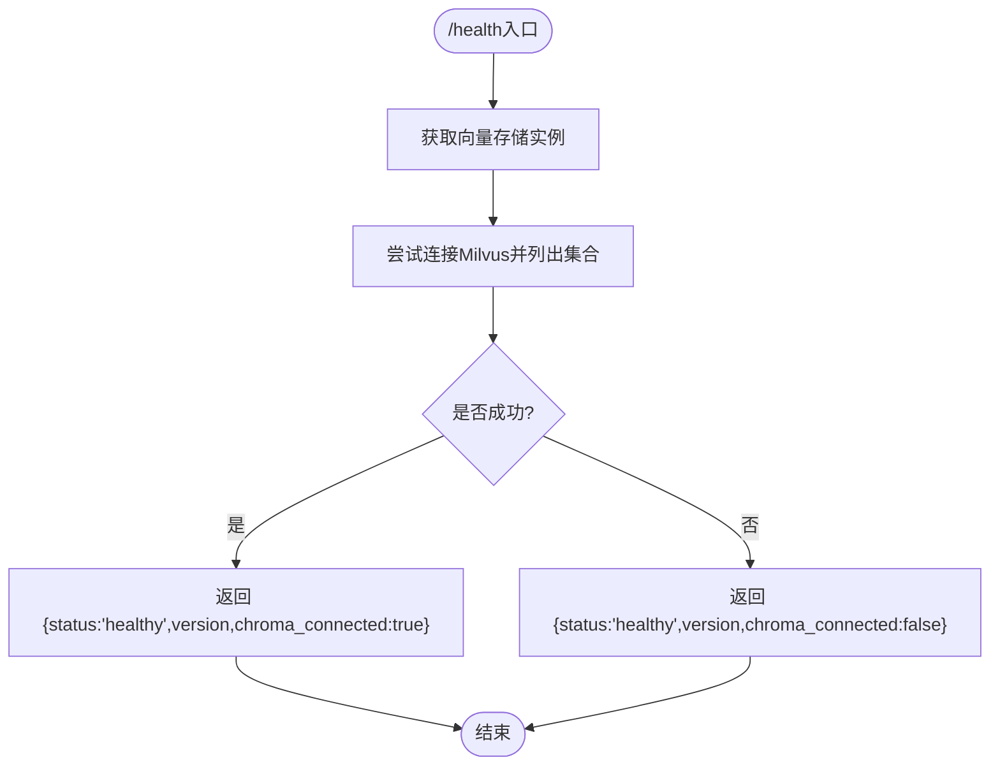
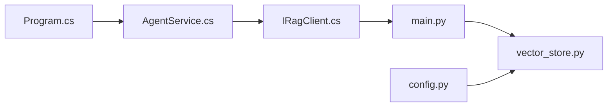

# 健康检查与告警

<cite>
**本文引用的文件**
- [ChatController.cs](file://backend-agent/Controllers/ChatController.cs)
- [Program.cs](file://backend-agent/Program.cs)
- [IRagClient.cs](file://backend-agent/Services/IRagClient.cs)
- [AgentService.cs](file://backend-agent/Services/AgentService.cs)
- [AgentSettings.cs](file://backend-agent/Services/AgentSettings.cs)
- [appsettings.json](file://backend-agent/appsettings.json)
- [appsettings.Development.json](file://backend-agent/appsettings.Development.json)
- [main.py](file://backend-rag/app/main.py)
- [vector_store.py](file://backend-rag/app/vector_store.py)
- [models.py](file://backend-rag/app/models.py)
- [config.py](file://backend-rag/app/config.py)
- [.env.example](file://backend-rag/.env.example)
- [AgentClient.ts](file://frontend-extension/src/services/AgentClient.ts)
</cite>

## 目录
1. [简介](#简介)
2. [项目结构](#项目结构)
3. [核心组件](#核心组件)
4. [架构总览](#架构总览)
5. [详细组件分析](#详细组件分析)
6. [依赖关系分析](#依赖关系分析)
7. [性能考虑](#性能考虑)
8. [故障排查指南](#故障排查指南)
9. [结论](#结论)
10. [附录](#附录)

## 简介
本文件围绕系统中的健康检查与告警机制展开，重点覆盖以下内容：
- 如何通过HTTP GET请求访问.NET Agent与Python RAG服务的健康状态
- 返回格式与状态码约定（健康时返回“healthy”，200表示正常；当服务不可用时返回503）
- 在ChatController.cs与main.py中健康检查的实现逻辑，以及对依赖服务（RAG服务、向量数据库）连通性的验证
- 集成Prometheus进行周期性探针监控，并基于响应延迟与失败率设置告警规则（使用Alertmanager）
- 在Kubernetes或Docker环境中配置liveness/readiness探针以实现自动恢复
- 故障模拟测试与告警通知渠道（邮件、Slack）配置指导

## 项目结构
系统由三部分组成：前端扩展、.NET Agent后端与Python RAG后端。健康检查贯穿两端，分别提供独立的/health端点用于快速判断服务可用性。

图表来源
- [Program.cs](file://backend-agent/Program.cs#L63-L66)
- [ChatController.cs](file://backend-agent/Controllers/ChatController.cs#L20-L43)
- [AgentService.cs](file://backend-agent/Services/AgentService.cs#L119-L145)
- [IRagClient.cs](file://backend-agent/Services/IRagClient.cs#L1-L14)
- [main.py](file://backend-rag/app/main.py#L55-L63)
- [vector_store.py](file://backend-rag/app/vector_store.py#L448-L457)
- [config.py](file://backend-rag/app/config.py#L1-L50)

章节来源
- [Program.cs](file://backend-agent/Program.cs#L63-L66)
- [main.py](file://backend-rag/app/main.py#L55-L63)

## 核心组件
- .NET Agent健康检查端点：在应用启动时注册GET /health，返回包含状态与时间戳的对象。
- Python RAG健康检查端点：在FastAPI应用上注册GET /health，返回包含状态、版本与向量存储连通性字段的对象。
- RAG客户端健康检查：.NET Agent通过Refit接口调用RAG服务的/health端点，作为依赖健康检查的一部分。
- 前端健康检查工具：前端扩展通过并行请求两个/health端点，汇总agent与rag的可用性结果。

章节来源
- [Program.cs](file://backend-agent/Program.cs#L63-L66)
- [main.py](file://backend-rag/app/main.py#L55-L63)
- [IRagClient.cs](file://backend-agent/Services/IRagClient.cs#L1-L14)
- [AgentClient.ts](file://frontend-extension/src/services/AgentClient.ts#L41-L59)

## 架构总览
下图展示了健康检查在整体架构中的位置与调用链路。

图表来源
- [Program.cs](file://backend-agent/Program.cs#L63-L66)
- [main.py](file://backend-rag/app/main.py#L55-L63)
- [vector_store.py](file://backend-rag/app/vector_store.py#L448-L457)

## 详细组件分析

### .NET Agent 健康检查实现
- 注册方式：在应用启动时通过MapGet注册/health端点，返回对象包含status与timestamp。
- 调用路径：前端扩展通过AgentClient封装的HTTP客户端访问该端点，作为Agent侧健康检查的依据。
- 依赖关系：AgentService在处理聊天请求时会调用RAG客户端的查询接口，但健康检查本身不依赖RAG查询；RAG健康检查由IRagClient的/health端点负责。

图表来源
- [Program.cs](file://backend-agent/Program.cs#L63-L66)
- [AgentService.cs](file://backend-agent/Services/AgentService.cs#L119-L145)
- [IRagClient.cs](file://backend-agent/Services/IRagClient.cs#L1-L14)

章节来源
- [Program.cs](file://backend-agent/Program.cs#L63-L66)
- [AgentService.cs](file://backend-agent/Services/AgentService.cs#L119-L145)
- [IRagClient.cs](file://backend-agent/Services/IRagClient.cs#L1-L14)

### Python RAG 健康检查实现
- 端点定义：FastAPI路由GET /health，返回HealthResponse对象，包含status、version与chroma_connected字段。
- 健康检查逻辑：通过获取向量存储实例并调用其is_healthy方法，内部尝试建立Milvus连接并列出集合，以此判定服务可用性。
- 配置来源：向量存储连接参数来自环境变量（MILVUS_HOST、MILVUS_PORT等），由config.py加载。

图表来源
- [main.py](file://backend-rag/app/main.py#L55-L63)
- [vector_store.py](file://backend-rag/app/vector_store.py#L448-L457)
- [config.py](file://backend-rag/app/config.py#L1-L50)

章节来源
- [main.py](file://backend-rag/app/main.py#L55-L63)
- [vector_store.py](file://backend-rag/app/vector_store.py#L448-L457)
- [config.py](file://backend-rag/app/config.py#L1-L50)

### 健康检查返回格式与状态码
- .NET Agent
  - 返回格式：包含status与timestamp的对象
  - 成功状态码：200
- Python RAG
  - 返回格式：包含status、version与chroma_connected的对象
  - 成功状态码：200
  - 当依赖服务（Milvus）不可用时，返回503（由健康检查逻辑触发）

章节来源
- [Program.cs](file://backend-agent/Program.cs#L63-L66)
- [main.py](file://backend-rag/app/main.py#L55-L63)
- [models.py](file://backend-rag/app/models.py#L41-L46)

### 前端健康检查工具
- 并行探测：前端扩展同时对Agent与RAG的/health端点发起请求，汇总结果为{agent: boolean, rag: boolean}。
- 超时与容错：前端对每个端点请求设置了合理超时，异常即视为不可用。

章节来源
- [AgentClient.ts](file://frontend-extension/src/services/AgentClient.ts#L41-L59)

## 依赖关系分析
- .NET Agent对RAG的依赖：通过Refit接口IRagClient调用RAG服务的/health端点，作为外部依赖健康检查。
- RAG对向量数据库的依赖：健康检查通过vector_store.py的is_healthy方法验证Milvus连通性。
- 配置耦合：RAG的Milvus连接参数来源于环境变量，Agent通过配置项指定RAG服务地址。

图表来源
- [AgentService.cs](file://backend-agent/Services/AgentService.cs#L119-L145)
- [IRagClient.cs](file://backend-agent/Services/IRagClient.cs#L1-L14)
- [main.py](file://backend-rag/app/main.py#L55-L63)
- [vector_store.py](file://backend-rag/app/vector_store.py#L448-L457)
- [config.py](file://backend-rag/app/config.py#L1-L50)
- [Program.cs](file://backend-agent/Program.cs#L63-L66)

章节来源
- [AgentService.cs](file://backend-agent/Services/AgentService.cs#L119-L145)
- [IRagClient.cs](file://backend-agent/Services/IRagClient.cs#L1-L14)
- [main.py](file://backend-rag/app/main.py#L55-L63)
- [vector_store.py](file://backend-rag/app/vector_store.py#L448-L457)
- [config.py](file://backend-rag/app/config.py#L1-L50)
- [Program.cs](file://backend-agent/Program.cs#L63-L66)

## 性能考虑
- 健康检查应尽量轻量：当前RAG健康检查会尝试连接并列举集合，属于轻量级操作；Agent健康检查直接返回内存对象。
- 超时与并发：前端对两个端点采用并行请求，减少总等待时间；同时设置合理的超时阈值，避免阻塞。
- 依赖链路：Agent健康检查不依赖RAG查询，RAG健康检查依赖Milvus；建议在监控中分别观测两条链路的延迟与错误率。

[本节为通用性能建议，无需特定文件来源]

## 故障排查指南
- Agent无法访问RAG
  - 检查Agent配置中的RagApiUrl是否正确指向RAG服务地址
  - 使用AgentClient.ts的healthCheck方法确认RAG端点可达
- RAG无法连接Milvus
  - 检查环境变量MILVUS_HOST/MILVUS_PORT/MILVUS_USER/MILVUS_PASSWORD/MILVUS_DB_NAME
  - 确认Milvus服务运行且网络连通
- 健康检查返回503
  - RAG健康检查逻辑会在Milvus不可用时返回503；需优先修复Milvus连接问题
- 日志定位
  - .NET Agent：查看控制台日志输出
  - Python RAG：查看FastAPI应用日志（INFO级别）

章节来源
- [appsettings.json](file://backend-agent/appsettings.json#L9-L15)
- [AgentSettings.cs](file://backend-agent/Services/AgentSettings.cs#L1-L10)
- [config.py](file://backend-rag/app/config.py#L1-L50)
- [vector_store.py](file://backend-rag/app/vector_store.py#L448-L457)
- [main.py](file://backend-rag/app/main.py#L55-L63)

## 结论
本系统在两端均提供了简洁可靠的健康检查端点，能够快速判断服务可用性与依赖连通性。通过前端并行探测与后端轻量健康检查逻辑，可有效支撑自动化运维与监控告警体系。建议在生产环境中配合Prometheus与Alertmanager进行周期性探针与告警，同时在容器编排平台配置liveness/readiness探针以实现自动恢复。

[本节为总结性内容，无需特定文件来源]

## 附录

### 访问/health端点的方法
- .NET Agent
  - 请求：GET http://<agent-host>:<port>/health
  - 返回：包含status与timestamp的对象
- Python RAG
  - 请求：GET http://<rag-host>:<port>/health
  - 返回：包含status、version与chroma_connected的对象

章节来源
- [Program.cs](file://backend-agent/Program.cs#L63-L66)
- [main.py](file://backend-rag/app/main.py#L55-L63)

### 健康检查与依赖服务验证
- Agent健康检查：不依赖RAG查询，直接返回内存对象
- RAG健康检查：验证Milvus连接与集合可用性
- 前端健康检查：并行探测Agent与RAG

章节来源
- [Program.cs](file://backend-agent/Program.cs#L63-L66)
- [main.py](file://backend-rag/app/main.py#L55-L63)
- [vector_store.py](file://backend-rag/app/vector_store.py#L448-L457)
- [AgentClient.ts](file://frontend-extension/src/services/AgentClient.ts#L41-L59)

### Prometheus与Alertmanager配置建议
- 探针配置
  - 对Agent与RAG分别配置HTTP探针，目标为各自的/health端点
  - 设置超时与间隔：例如30秒间隔、5秒超时
- 告警规则（PromQL示例思路）
  - 失败率：sum(rate(http_requests_total{job="agent",status!~"2.."}[5m])) / sum(rate(http_requests_total{job="agent"}[5m])) > 0.05
  - 延迟：histogram_quantile(0.95, sum by(le) (rate(http_request_duration_seconds_bucket{job="agent"}[5m]))) > 2
  - 依赖失败：sum_over_time({__name__=~"(agent_health|rag_health)", status!="healthy"}[5m]) > 0
- Alertmanager通知
  - 支持邮件、Slack等通道，按团队SLA配置静默窗口与重复抑制

[本节为通用配置建议，无需特定文件来源]

### Kubernetes/Docker 探针配置建议
- livenessProbe
  - 方式：HTTP GET /health
  - 初始延迟：10秒
  - 周期：30秒
  - 超时：5秒
  - 失败阈值：3
- readinessProbe
  - 方式：HTTP GET /health
  - 初始延迟：5秒
  - 周期：10秒
  - 超时：3秒
  - 失败阈值：3
- 容器重启策略
  - restartPolicy: Always
  - PodDisruptionBudget：确保最小可用副本数

[本节为通用配置建议，无需特定文件来源]

### 故障模拟测试与验证
- 模拟Milvus不可用：停止Milvus或修改MILVUS_HOST/PORT，观察RAG健康检查返回503
- 模拟Agent无法访问RAG：停止RAG服务或调整RagApiUrl，观察Agent侧业务调用失败
- 前端并行探测：使用AgentClient.ts的healthCheck方法，确认agent与rag的可用性标记

章节来源
- [vector_store.py](file://backend-rag/app/vector_store.py#L448-L457)
- [config.py](file://backend-rag/app/config.py#L1-L50)
- [AgentClient.ts](file://frontend-extension/src/services/AgentClient.ts#L41-L59)