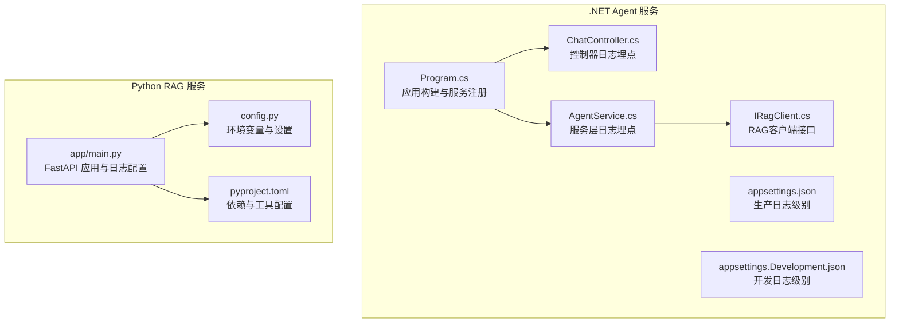
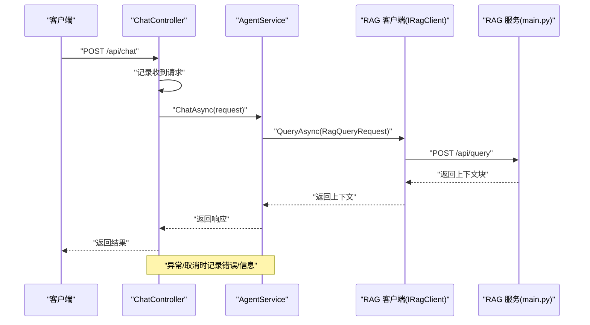
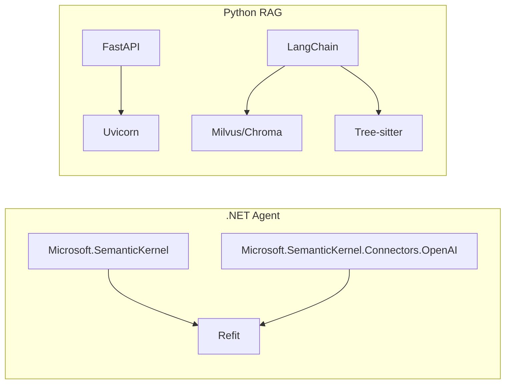

# 日志管理

<cite>
**本文引用的文件**
- [Program.cs](file://backend-agent/Program.cs)
- [appsettings.json](file://backend-agent/appsettings.json)
- [appsettings.Development.json](file://backend-agent/appsettings.Development.json)
- [ChatController.cs](file://backend-agent/Controllers/ChatController.cs)
- [AgentService.cs](file://backend-agent/Services/AgentService.cs)
- [IRagClient.cs](file://backend-agent/Services/IRagClient.cs)
- [main.py](file://backend-rag/app/main.py)
- [config.py](file://backend-rag/app/config.py)
- [pyproject.toml](file://backend-rag/pyproject.toml)
- [ALAgent.Agent.csproj](file://backend-agent/ALAgent.Agent.csproj)
</cite>

## 目录
1. [简介](#简介)
2. [项目结构](#项目结构)
3. [核心组件](#核心组件)
4. [架构总览](#架构总览)
5. [详细组件分析](#详细组件分析)
6. [依赖分析](#依赖分析)
7. [性能考虑](#性能考虑)
8. [故障排查指南](#故障排查指南)
9. [结论](#结论)
10. [附录](#附录)

## 简介
本文件面向.NET与Python服务的日志管理，结合仓库现有实现，系统性梳理日志配置、埋点实践、统一格式与集中化采集方案，并给出调试与排障建议。重点覆盖：
- ASP.NET Core内置日志提供程序与日志级别配置
- 控制器与服务层的关键日志埋点（请求入参、工具调用、RAG查询耗时等）
- 统一日志格式（JSON结构化日志）与追踪字段（traceId、时间戳、服务名、操作类型）
- 集成Serilog或ELK栈进行集中式日志收集与分析
- 日志轮转策略与保留周期配置
- 常见问题（请求失败、工具拒绝执行）的日志检索方法
- 敏感信息（如API密钥）脱敏处理

## 项目结构
本仓库包含两个后端服务：.NET Agent服务与Python RAG服务。日志配置与埋点分别位于各自服务中：
- .NET Agent服务：Program.cs负责应用构建；appsettings.json与appsettings.Development.json控制日志级别；ChatController.cs与AgentService.cs包含业务日志埋点。
- Python RAG服务：app/main.py通过标准库logging配置基础格式；config.py加载环境变量并影响运行行为。

图表来源
- [Program.cs](file://backend-agent/Program.cs#L1-L67)
- [appsettings.json](file://backend-agent/appsettings.json#L1-L17)
- [appsettings.Development.json](file://backend-agent/appsettings.Development.json#L1-L16)
- [ChatController.cs](file://backend-agent/Controllers/ChatController.cs#L1-L45)
- [AgentService.cs](file://backend-agent/Services/AgentService.cs#L1-L180)
- [IRagClient.cs](file://backend-agent/Services/IRagClient.cs#L1-L14)
- [main.py](file://backend-rag/app/main.py#L1-L343)
- [config.py](file://backend-rag/app/config.py#L1-L51)
- [pyproject.toml](file://backend-rag/pyproject.toml#L1-L67)

章节来源
- [Program.cs](file://backend-agent/Program.cs#L1-L67)
- [appsettings.json](file://backend-agent/appsettings.json#L1-L17)
- [appsettings.Development.json](file://backend-agent/appsettings.Development.json#L1-L16)
- [main.py](file://backend-rag/app/main.py#L1-L343)

## 核心组件
- ASP.NET Core日志配置与级别
  - 默认日志级别与Microsoft.AspNetCore日志级别在appsettings.json与appsettings.Development.json中定义，开发环境默认更细粒度。
- 控制器日志埋点
  - ChatController.cs在接收请求、异常处理、取消场景处记录日志，便于定位用户输入与错误。
- 服务层日志埋点
  - AgentService.cs在RAG上下文获取失败时记录警告，在异常时记录错误，便于追踪工具链调用与模型推理。
- Python服务日志
  - app/main.py使用logging.basicConfig设置基础格式；多处endpoint捕获异常并记录错误，便于定位数据加载与索引过程中的问题。

章节来源
- [appsettings.json](file://backend-agent/appsettings.json#L1-L17)
- [appsettings.Development.json](file://backend-agent/appsettings.Development.json#L1-L16)
- [ChatController.cs](file://backend-agent/Controllers/ChatController.cs#L1-L45)
- [AgentService.cs](file://backend-agent/Services/AgentService.cs#L1-L180)
- [main.py](file://backend-rag/app/main.py#L1-L343)

## 架构总览
.NET Agent服务通过控制器接收聊天请求，调用AgentService进行对话与工具决策，必要时向RAG服务发起查询；Python RAG服务提供语义检索能力。日志贯穿请求入口、服务处理、外部调用与异常路径。

图表来源
- [ChatController.cs](file://backend-agent/Controllers/ChatController.cs#L1-L45)
- [AgentService.cs](file://backend-agent/Services/AgentService.cs#L1-L180)
- [IRagClient.cs](file://backend-agent/Services/IRagClient.cs#L1-L14)
- [main.py](file://backend-rag/app/main.py#L1-L343)

## 详细组件分析

### .NET Agent服务日志配置与级别
- 应用构建与服务注册
  - Program.cs负责构建WebApplicationBuilder，注册CORS、Refit客户端、Semantic Kernel、服务与控制器。
- 日志级别配置
  - appsettings.json与appsettings.Development.json分别定义Default与Microsoft.AspNetCore的日志级别，开发环境默认更细。
- 建议新增内置日志提供程序
  - 在Program.cs中可添加Console、Debug、EventLog等内置提供程序，以满足不同部署环境输出需求。

章节来源
- [Program.cs](file://backend-agent/Program.cs#L1-L67)
- [appsettings.json](file://backend-agent/appsettings.json#L1-L17)
- [appsettings.Development.json](file://backend-agent/appsettings.Development.json#L1-L16)

### 控制器日志埋点（ChatController.cs）
- 关键埋点
  - 接收请求时记录提示词片段，便于审计与回溯。
  - 捕获取消异常时记录“请求被取消”信息，返回特定状态码。
  - 捕获通用异常时记录错误日志并返回500。
- 建议增强
  - 记录请求ID/TraceId、用户标识、请求耗时等，便于跨服务追踪。
  - 对敏感字段（如提示词）进行脱敏处理。

章节来源
- [ChatController.cs](file://backend-agent/Controllers/ChatController.cs#L1-L45)

### 服务层日志埋点（AgentService.cs）
- 关键埋点
  - RAG上下文获取失败时记录警告，避免阻断主流程。
  - 异常时记录错误日志，便于定位模型推理与工具调用问题。
- 建议增强
  - 记录工具调用决策（如是否自动调用）、RAG查询耗时、响应解析耗时等指标。
  - 将TraceId注入到RAG客户端请求头，实现端到端追踪。

章节来源
- [AgentService.cs](file://backend-agent/Services/AgentService.cs#L1-L180)

### RAG服务日志（Python main.py）
- 日志配置
  - 使用logging.basicConfig设置基础格式，便于快速查看。
- 关键埋点
  - 应用启动/关闭、健康检查、各数据加载与索引endpoint均记录信息/错误日志。
- 建议增强
  - 使用结构化日志（JSON）输出，包含时间戳、服务名、操作类型、TraceId等字段。
  - 对异常路径抛出HTTP异常前记录详细上下文，便于前端与网关侧检索。

章节来源
- [main.py](file://backend-rag/app/main.py#L1-L343)

### RAG客户端接口（IRagClient.cs）
- 作用
  - 定义与RAG服务交互的契约，AgentService通过该接口发起查询。
- 建议
  - 在调用前记录请求参数摘要与TraceId；在异常时记录错误详情与重试策略。

章节来源
- [IRagClient.cs](file://backend-agent/Services/IRagClient.cs#L1-L14)

### Python设置与环境变量（config.py）
- 作用
  - 从环境变量加载配置，包括OpenAI、Milvus、GitHub、服务器参数等。
- 建议
  - 在启动时记录关键配置摘要（不包含敏感值），便于审计与排障。

章节来源
- [config.py](file://backend-rag/app/config.py#L1-L51)

## 依赖分析
- .NET Agent依赖
  - Microsoft.SemanticKernel、Microsoft.SemanticKernel.Connectors.OpenAI、Refit用于模型推理与RAG客户端通信。
- Python RAG依赖
  - FastAPI、Uvicorn、LangChain、Milvus、Tree-sitter、Playwright、PyGithub、PyPDF等，支撑检索与数据加载。

图表来源
- [ALAgent.Agent.csproj](file://backend-agent/ALAgent.Agent.csproj#L1-L18)
- [pyproject.toml](file://backend-rag/pyproject.toml#L1-L67)

章节来源
- [ALAgent.Agent.csproj](file://backend-agent/ALAgent.Agent.csproj#L1-L18)
- [pyproject.toml](file://backend-rag/pyproject.toml#L1-L67)

## 性能考虑
- 日志级别与开销
  - 开发环境提高日志级别有助于诊断，但会增加I/O与序列化开销；生产环境应保持合理级别。
- 结构化日志与异步写入
  - 使用结构化日志（JSON）便于下游解析；在高并发场景建议采用异步写入或缓冲队列降低阻塞。
- 轮转与保留
  - 按大小与时间双维度轮转，设置合理的保留周期，避免磁盘占用过高。

## 故障排查指南
- 请求失败
  - 检查控制器与服务层错误日志，确认异常堆栈与请求参数摘要。
  - 在.NET侧确认RAG客户端超时与健康检查状态；在Python侧检查向量存储连接与索引状态。
- 工具拒绝执行
  - 查看服务层关于工具调用的决策日志与模型响应解析日志，定位拒绝原因。
- RAG查询耗时异常
  - 在AgentService中记录RAG查询开始/结束时间，计算耗时并输出到结构化日志。
- 敏感信息脱敏
  - 对API密钥、访问令牌、提示词等字段进行脱敏处理，仅输出必要摘要。

章节来源
- [ChatController.cs](file://backend-agent/Controllers/ChatController.cs#L1-L45)
- [AgentService.cs](file://backend-agent/Services/AgentService.cs#L1-L180)
- [main.py](file://backend-rag/app/main.py#L1-L343)

## 结论
本仓库已具备基础的日志配置与埋点，建议在此基础上引入统一的结构化日志格式与集中化采集方案，完善TraceId贯穿、敏感信息脱敏与轮转策略，以提升可观测性与运维效率。

## 附录

### 统一日志格式建议（JSON）
- 字段建议
  - 时间戳、服务名、操作类型、TraceId、级别、消息、请求参数摘要、响应状态、耗时、异常堆栈、环境信息。
- 示例字段（不展示具体值）
  - timestamp、service、operation、traceId、level、message、requestSummary、status、durationMs、exception、env

### 集成Serilog或ELK栈
- Serilog
  - 在.NET Agent中安装Serilog扩展，配置JSON输出、轮转与保留策略，结合Serilog.Enrichers.Span等扩展注入TraceId。
- ELK
  - 在Python侧使用结构化日志输出，配合Filebeat/Kafka/Logstash收集，Elasticsearch聚合分析，Kibana可视化。

### 日志轮转与保留
- 轮转策略
  - 按大小（如100MB）与时间（如每日）双触发；保留最近N份副本。
- 保留周期
  - 生产环境建议7-30天，视合规要求与存储成本调整。

### 敏感信息脱敏
- 处理原则
  - API密钥、令牌、密码等只输出摘要或掩码；对提示词等用户输入仅输出长度与哈希摘要。
- 实施要点
  - 在日志序列化阶段统一脱敏；避免在日志中直接打印原始明文。