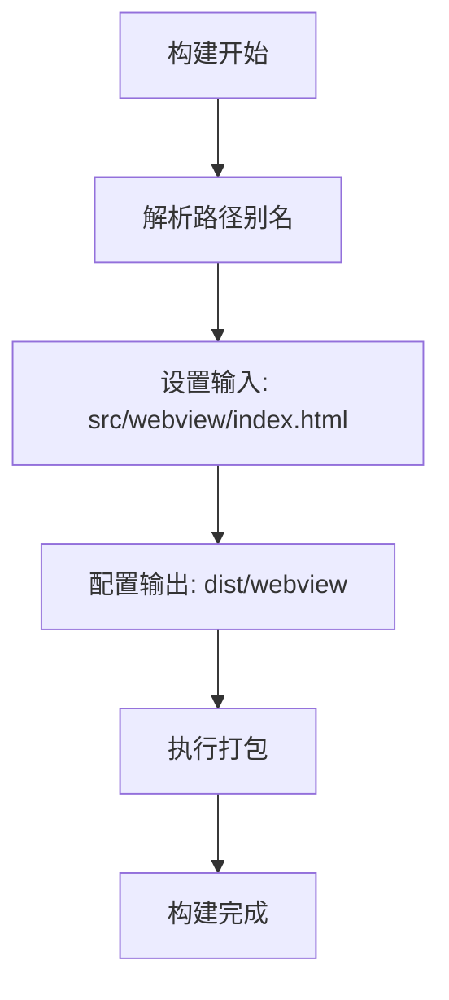
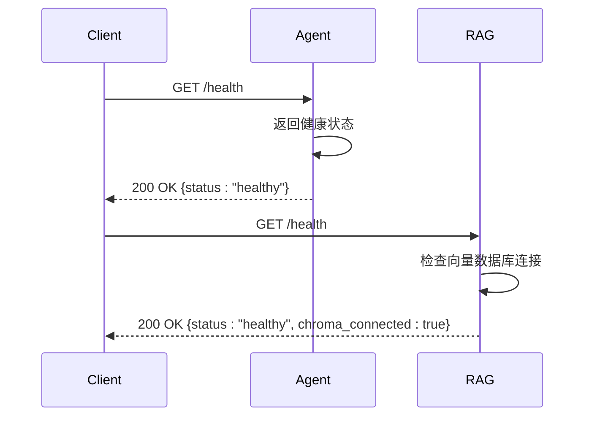
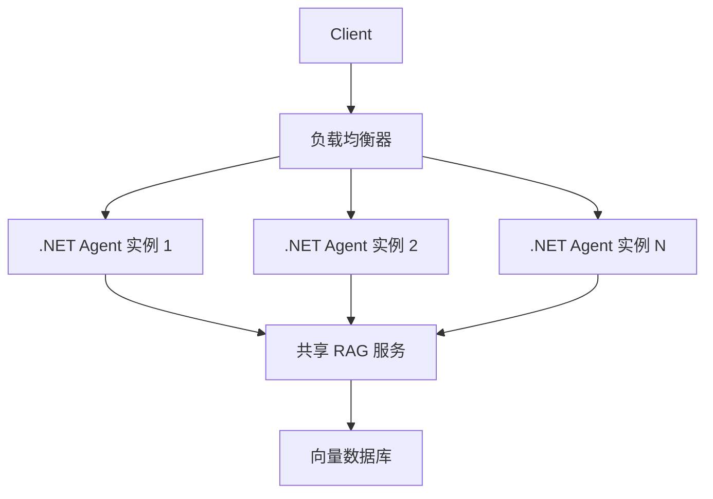

# 部署与运维

<cite>
**本文档引用的文件**  
- [launchSettings.json](file://backend-agent/Properties/launchSettings.json)
- [appsettings.Development.json](file://backend-agent/appsettings.Development.json)
- [appsettings.json](file://backend-agent/appsettings.json)
- [Program.cs](file://backend-agent/Program.cs)
- [ChatController.cs](file://backend-agent/Controllers/ChatController.cs)
- [AgentService.cs](file://backend-agent/Services/AgentService.cs)
- [AgentSettings.cs](file://backend-agent/Services/AgentSettings.cs)
- [vite.config.ts](file://frontend-extension/vite.config.ts)
- [package.json](file://frontend-extension/package.json)
- [main.py](file://backend-rag/app/main.py)
- [config.py](file://backend-rag/app/config.py)
- [.env.example](file://backend-rag/.env.example)
- [AgentClient.ts](file://frontend-extension/src/services/AgentClient.ts)
- [QUICK_START.md](file://QUICK_START.md)
</cite>

## 目录
1. [简介](#简介)
2. [开发环境配置](#开发环境配置)
3. [前端构建与打包](#前端构建与打包)
4. [生产部署选项](#生产部署选项)
5. [健康检查与监控](#健康检查与监控)
6. [资源需求与扩展建议](#资源需求与扩展建议)
7. [安全加固措施](#安全加固措施)
8. [故障恢复策略](#故障恢复策略)
9. [总结](#总结)

## 简介

本指南提供从本地开发到生产部署的完整运维说明。系统由三个核心组件构成：VS Code前端扩展、.NET推理引擎（backend-agent）和Python RAG服务（backend-rag）。文档涵盖开发配置、构建流程、部署选项、监控机制和安全策略，确保系统稳定高效运行。

## 开发环境配置

### 后端服务端口与环境变量

#### .NET Agent 服务配置

.NET Agent 服务通过 `launchSettings.json` 配置开发环境启动参数：

- **端口**：服务默认在 `http://localhost:5000` 启动
- **环境变量**：设置 `ASPNETCORE_ENVIRONMENT` 为 `Development`

**Section sources**
- [launchSettings.json](file://backend-agent/Properties/launchSettings.json#L1-L14)

#### 配置文件说明

系统使用分层配置管理：

- `appsettings.json`：包含生产环境默认配置
- `appsettings.Development.json`：覆盖开发环境特定设置

关键配置项包括：
- `Agent:OpenAIApiKey`：OpenAI API 密钥
- `Agent:ModelId`：使用的模型ID（默认 gpt-4o）
- `Agent:RagApiUrl`：RAG服务API地址（默认 http://localhost:8000）

**Section sources**
- [appsettings.json](file://backend-agent/appsettings.json#L1-L16)
- [appsettings.Development.json](file://backend-agent/appsettings.Development.json#L1-L15)

#### Python RAG 服务配置

Python RAG 服务使用 `.env` 文件管理环境变量：

```env
# 服务器设置
HOST=0.0.0.0
PORT=8000
DEBUG=true

# OpenAI 设置
OPENAI_API_KEY=your-openai-api-key-here

# Milvus 向量数据库设置
MILVUS_HOST=localhost
MILVUS_PORT=19530

# 检索设置
DEFAULT_TOP_K=5
```

**Section sources**
- [.env.example](file://backend-rag/.env.example#L1-L27)

### 前端扩展配置

VS Code 扩展通过 `package.json` 的 `contributes.configuration` 定义用户可配置项：

- `alagent.agentApiUrl`：.NET Agent API 地址（默认 http://localhost:5000）
- `alagent.ragApiUrl`：Python RAG API 地址（默认 http://localhost:8000）
- `alagent.openaiApiKey`：OpenAI API 密钥

**Section sources**
- [package.json](file://frontend-extension/package.json#L47-L65)

## 前端构建与打包

### Vite 构建配置

前端扩展使用 Vite 进行构建，配置文件 `vite.config.ts` 定义了关键构建参数：

- **输出目录**：`dist/webview`
- **输入文件**：`src/webview/index.html`
- **文件命名**：使用 `[name].[ext]` 格式
- **路径别名**：支持 `@`、`@core`、`@services` 等别名



**Diagram sources**
- [vite.config.ts](file://frontend-extension/vite.config.ts#L1-L29)

### 构建脚本

`package.json` 中的构建脚本定义了完整的构建流程：

- `build:webview`：执行 `vite build` 构建前端
- `build:extension`：使用 esbuild 构建扩展主程序
- `build`：同时执行前端和扩展构建

**Section sources**
- [package.json](file://frontend-extension/package.json#L68-L72)

## 生产部署选项

### Docker 容器化部署

#### .NET Agent Dockerfile

```dockerfile
FROM mcr.microsoft.com/dotnet/aspnet:9.0 AS runtime
WORKDIR /app
COPY ./backend-agent/dist ./
ENTRYPOINT ["dotnet", "ALAgent.Agent.dll"]
```

#### Python RAG Dockerfile

```dockerfile
FROM python:3.11-slim
WORKDIR /app
COPY ./backend-rag .
RUN pip install -e .
CMD ["fastapi", "run", "app/main.py", "--host", "0.0.0.0", "--port", "8000"]
```

### Kubernetes 编排

```yaml
apiVersion: apps/v1
kind: Deployment
metadata:
  name: al-agent-backend
spec:
  replicas: 3
  selector:
    matchLabels:
      app: al-agent
  template:
    metadata:
      labels:
        app: al-agent
    spec:
      containers:
      - name: agent
        image: al-agent/backend:latest
        ports:
        - containerPort: 5000
        env:
        - name: Agent__OpenAIApiKey
          valueFrom:
            secretKeyRef:
              name: al-agent-secrets
              key: openai-api-key
```

### 独立服务部署

可直接使用 .NET 和 Python 命令行工具部署：

```bash
# .NET Agent
dotnet run --urls=http://0.0.0.0:5000 --environment=Production

# Python RAG
fastapi run app/main.py --host=0.0.0.0 --port=8000
```

## 健康检查与监控

### 健康检查端点

系统提供 `/health` 端点用于健康检查：

#### .NET Agent 健康检查

```csharp
app.MapGet("/health", () => Results.Ok(new { 
    status = "healthy", 
    timestamp = DateTime.UtcNow 
}));
```

#### Python RAG 健康检查

```python
@app.get("/health", response_model=HealthResponse)
async def health_check():
    store = get_vector_store()
    return HealthResponse(
        status="healthy",
        chroma_connected=store.is_healthy()
    )
```



**Diagram sources**
- [Program.cs](file://backend-agent/Program.cs#L63-L65)
- [main.py](file://backend-rag/app/main.py#L55-L63)

### 日志记录

#### .NET Agent 日志配置

- 开发环境：`LogLevel.Default=Debug`
- 生产环境：`LogLevel.Default=Information`

#### Python RAG 日志配置

```python
logging.basicConfig(
    level=logging.INFO,
    format="%(asctime)s - %(name)s - %(levelname)s - %(message)s"
)
```

**Section sources**
- [appsettings.json](file://backend-agent/appsettings.json#L2-L6)
- [main.py](file://backend-rag/app/main.py#L20-L25)

### 指标收集

建议集成以下监控工具：

- **.NET**：Application Insights 或 Prometheus Exporter
- **Python**：Prometheus Client 或 OpenTelemetry
- **前端**：浏览器性能监控

## 资源需求与扩展建议

### 资源需求估算

| 组件 | CPU | 内存 | 存储 |
|------|-----|------|------|
| .NET Agent | 1-2 核 | 512MB-1GB | 100MB |
| Python RAG | 2-4 核 | 2-4GB | 向量数据库存储 |
| 向量数据库 | 2-4 核 | 4-8GB | 大量磁盘空间 |

### 扩展建议

#### 水平扩展

- **.NET Agent**：无状态服务，可轻松水平扩展
- **Python RAG**：计算密集型，建议根据负载扩展实例

#### 垂直扩展

- 增加内存以支持更大的上下文窗口
- 使用更强大的CPU加速向量计算



**Diagram sources**
- [Program.cs](file://backend-agent/Program.cs#L58-L67)
- [main.py](file://backend-rag/app/main.py#L38-L43)

## 安全加固措施

### API 密钥保护

#### 环境变量管理

- 使用环境变量而非硬编码存储 API 密钥
- 生产环境使用密钥管理系统（如 Azure Key Vault、AWS Secrets Manager）

#### 配置示例

```json
{
  "Agent": {
    "OpenAIApiKey": "", // 从环境变量读取
    "RagApiUrl": "http://localhost:8000"
  }
}
```

**Section sources**
- [AgentSettings.cs](file://backend-agent/Services/AgentSettings.cs#L1-L11)
- [Program.cs](file://backend-agent/Program.cs#L35-L42)

### 输入验证

#### .NET Agent 输入验证

使用 ASP.NET Core 内置验证机制：

```csharp
[HttpPost("chat")]
public async Task<ActionResult<ChatResponse>> Chat(
    [FromBody] ChatRequest request,
    CancellationToken cancellationToken)
```

#### Python RAG 输入验证

使用 Pydantic 模型进行严格类型检查：

```python
class QueryRequest(BaseModel):
    query: str
    workspace_path: str
    top_k: Optional[int] = None
```

**Section sources**
- [ChatController.cs](file://backend-agent/Controllers/ChatController.cs#L20-L24)
- [main.py](file://backend-rag/app/main.py#L66-L67)

### 网络隔离

#### CORS 配置

##### .NET Agent CORS

```csharp
builder.Services.AddCors(options =>
{
    options.AddDefaultPolicy(policy =>
    {
        policy.WithOrigins("http://localhost:*", "vscode-webview://*")
              .AllowAnyHeader()
              .AllowAnyMethod();
    });
});
```

##### Python RAG CORS

```python
app.add_middleware(
    CORSMiddleware,
    allow_origins=["*"],
    allow_credentials=True,
    allow_methods=["*"],
    allow_headers=["*"],
)
```

**Section sources**
- [Program.cs](file://backend-agent/Program.cs#L11-L20)
- [main.py](file://backend-rag/app/main.py#L45-L52)

## 故障恢复策略

### 错误处理

#### .NET Agent 错误处理

```csharp
try
{
    var response = await _agentService.ChatAsync(request, cancellationToken);
    return Ok(response);
}
catch (OperationCanceledException)
{
    return StatusCode(499, new { error = "Request cancelled" });
}
catch (Exception ex)
{
    _logger.LogError(ex, "Error processing chat request");
    return StatusCode(500, new { error = ex.Message });
}
```

#### Python RAG 错误处理

```python
try:
    chunks = store.query(query=request.query, workspace_path=request.workspace_path)
    return QueryResponse(chunks=chunks)
except Exception as e:
    logger.error(f"Query error: {e}")
    raise HTTPException(status_code=500, detail=str(e))
```

**Section sources**
- [ChatController.cs](file://backend-agent/Controllers/ChatController.cs#L25-L42)
- [main.py](file://backend-rag/app/main.py#L87-L89)

### 重试机制

建议在客户端实现重试逻辑：

```typescript
public async chat(request: AgentRequest): Promise<AgentResponse> {
    const maxRetries = 3;
    for (let i = 0; i < maxRetries; i++) {
        try {
            const response = await this._agentApi.post<AgentResponse>('/api/chat', request);
            return response.data;
        } catch (error) {
            if (i === maxRetries - 1) throw error;
            await new Promise(resolve => setTimeout(resolve, 1000 * (i + 1)));
        }
    }
}
```

**Section sources**
- [AgentClient.ts](file://frontend-extension/src/services/AgentClient.ts#L31-L34)

## 总结

本指南详细说明了从本地开发到生产部署的完整运维流程。关键要点包括：

- **开发配置**：正确设置端口和环境变量
- **构建流程**：使用 Vite 构建前端，esbuild 构建扩展
- **部署选项**：支持 Docker、Kubernetes 和独立部署
- **监控**：实现健康检查和日志记录
- **安全**：保护 API 密钥，验证输入，配置网络隔离
- **可靠性**：实施错误处理和重试机制

通过遵循本指南，可以确保系统稳定、安全、可扩展地运行。