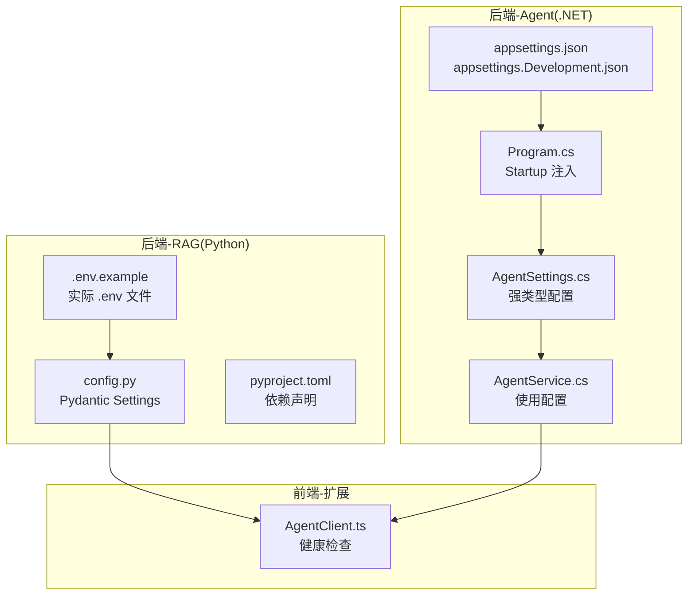
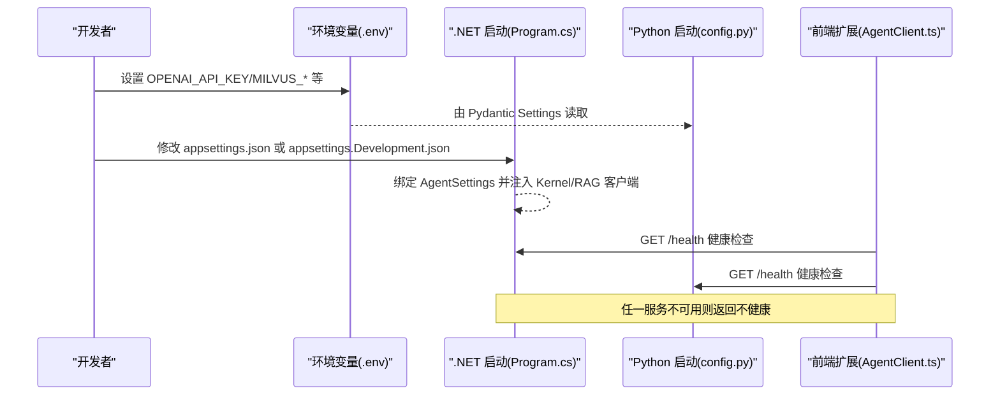
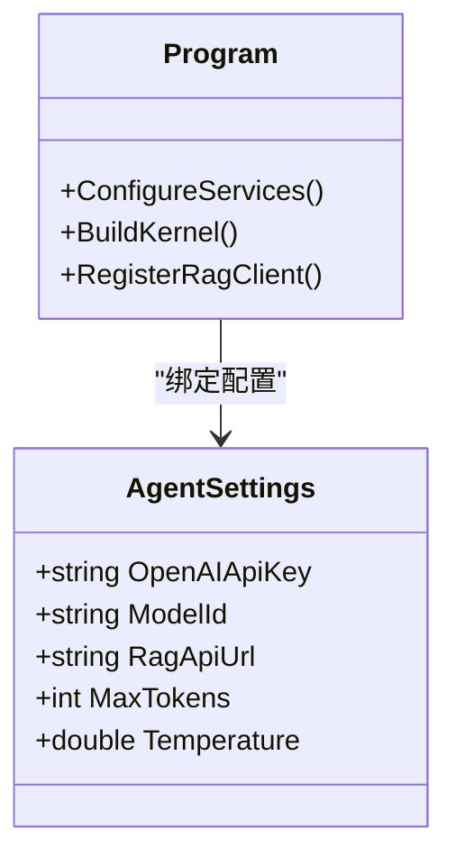
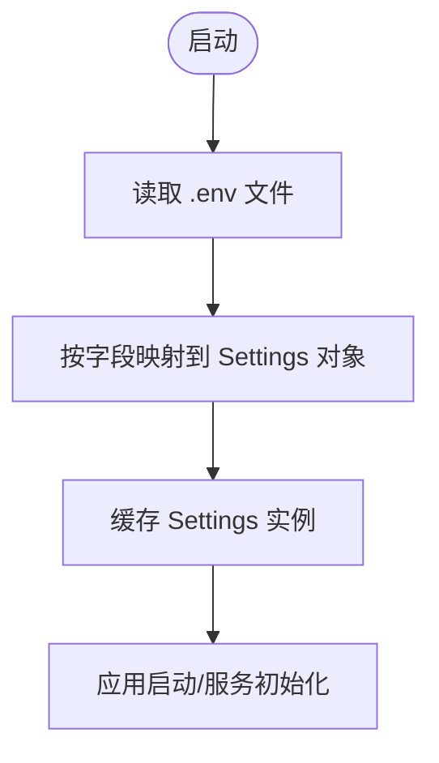
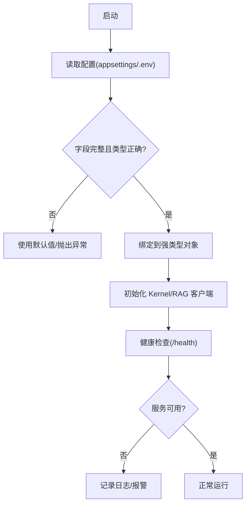
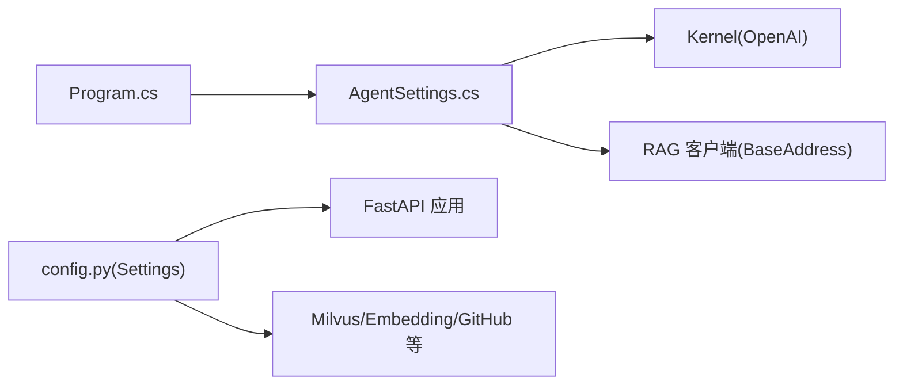

# 配置与环境

<cite>
**本文引用的文件**
- [appsettings.json](file://backend-agent/appsettings.json)
- [appsettings.Development.json](file://backend-agent/appsettings.Development.json)
- [Program.cs](file://backend-agent/Program.cs)
- [AgentSettings.cs](file://backend-agent/Services/AgentSettings.cs)
- [.env.example](file://backend-rag/.env.example)
- [config.py](file://backend-rag/app/config.py)
- [pyproject.toml](file://backend-rag/pyproject.toml)
- [launchSettings.json](file://backend-agent/Properties/launchSettings.json)
- [AgentService.cs](file://backend-agent/Services/AgentService.cs)
- [AgentClient.ts](file://frontend-extension/src/services/AgentClient.ts)
</cite>

## 目录
1. [简介](#简介)
2. [项目结构](#项目结构)
3. [核心组件](#核心组件)
4. [架构总览](#架构总览)
5. [详细组件分析](#详细组件分析)
6. [依赖关系分析](#依赖关系分析)
7. [性能考虑](#性能考虑)
8. [故障排查指南](#故障排查指南)
9. [结论](#结论)
10. [附录](#附录)

## 简介
本文件系统性梳理了本仓库的配置与环境管理方案，涵盖：
- .NET 后端的 appsettings.json 层级配置与运行时注入
- Python 后端的 .env 环境变量与 Pydantic Settings 强类型封装
- AgentSettings.cs 中的强类型配置封装及其在 Startup 的绑定
- 配置加载优先级与覆盖规则（环境变量覆盖文件配置）
- 敏感信息的安全管理策略（API 密钥等）
- 开发与生产环境的差异化配置实践
- 配置验证机制与常见错误排查方法

## 项目结构
本仓库采用前后端分离的多模块组织方式：
- backend-agent：.NET Web API，负责聊天与工具调用，使用 appsettings.json 与 AgentSettings 强类型配置
- backend-rag：Python FastAPI RAG 服务，使用 .env 与 Pydantic Settings
- frontend-extension：VS Code 扩展前端，通过健康检查对接后端服务

图表来源
- [appsettings.json](file://backend-agent/appsettings.json#L1-L17)
- [appsettings.Development.json](file://backend-agent/appsettings.Development.json#L1-L16)
- [Program.cs](file://backend-agent/Program.cs#L1-L67)
- [AgentSettings.cs](file://backend-agent/Services/AgentSettings.cs#L1-L11)
- [.env.example](file://backend-rag/.env.example#L1-L28)
- [config.py](file://backend-rag/app/config.py#L1-L51)
- [pyproject.toml](file://backend-rag/pyproject.toml#L1-L67)
- [AgentClient.ts](file://frontend-extension/src/services/AgentClient.ts#L41-L60)

章节来源
- [appsettings.json](file://backend-agent/appsettings.json#L1-L17)
- [appsettings.Development.json](file://backend-agent/appsettings.Development.json#L1-L16)
- [Program.cs](file://backend-agent/Program.cs#L1-L67)
- [.env.example](file://backend-rag/.env.example#L1-L28)
- [config.py](file://backend-rag/app/config.py#L1-L51)
- [pyproject.toml](file://backend-rag/pyproject.toml#L1-L67)
- [AgentClient.ts](file://frontend-extension/src/services/AgentClient.ts#L41-L60)

## 核心组件
- .NET 配置体系
  - appsettings.json：默认配置，包含日志级别、允许主机、Agent 分区下的 LLM 与 RAG 相关参数
  - appsettings.Development.json：开发环境覆盖，提升日志级别
  - Program.cs：在 Startup 中将“Agent”节点映射到 AgentSettings 强类型对象，并注册 Kernel 与 RAG 客户端
  - AgentSettings.cs：定义 Agent 的强类型配置字段，提供默认值
- Python 配置体系
  - .env.example：示例环境变量，包含 OpenAI、Milvus、GitHub、评估、服务器、分块与检索等配置键
  - config.py：使用 Pydantic Settings 加载 .env，字段与 .env 键一一对应
  - pyproject.toml：声明 pydantic-settings、python-dotenv 等依赖，确保 .env 能被正确解析

章节来源
- [appsettings.json](file://backend-agent/appsettings.json#L1-L17)
- [appsettings.Development.json](file://backend-agent/appsettings.Development.json#L1-L16)
- [Program.cs](file://backend-agent/Program.cs#L1-L67)
- [AgentSettings.cs](file://backend-agent/Services/AgentSettings.cs#L1-L11)
- [.env.example](file://backend-rag/.env.example#L1-L28)
- [config.py](file://backend-rag/app/config.py#L1-L51)
- [pyproject.toml](file://backend-rag/pyproject.toml#L1-L67)

## 架构总览
下图展示了配置在系统中的加载与使用路径，以及跨语言服务间的依赖关系。

图表来源
- [Program.cs](file://backend-agent/Program.cs#L1-L67)
- [config.py](file://backend-rag/app/config.py#L1-L51)
- [AgentClient.ts](file://frontend-extension/src/services/AgentClient.ts#L41-L60)

## 详细组件分析

### .NET 端配置：appsettings.json 与 AgentSettings.cs
- 配置分区与字段
  - “Agent”分区包含：
    - OpenAIApiKey：LLM 接口密钥
    - ModelId：LLM 模型标识
    - RagApiUrl：RAG 服务地址
    - MaxTokens：最大生成长度
    - Temperature：采样温度
  - 日志与 AllowedHosts 在根节点配置
- 加载与绑定
  - Program.cs 将 builder.Configuration 的“Agent”节点绑定到 AgentSettings 类型
  - Kernel 初始化时从 AgentSettings 获取 ModelId 与 OpenAIApiKey
  - RAG 客户端的 BaseAddress 来自 AgentSettings.RagApiUrl，同时设置默认超时
- 默认值与覆盖
  - AgentSettings.cs 提供默认值；appsettings.json 作为文件配置源
  - ASP.NET Core 运行时支持环境变量覆盖文件配置（见下一节）

图表来源
- [AgentSettings.cs](file://backend-agent/Services/AgentSettings.cs#L1-L11)
- [Program.cs](file://backend-agent/Program.cs#L1-L67)

章节来源
- [appsettings.json](file://backend-agent/appsettings.json#L1-L17)
- [appsettings.Development.json](file://backend-agent/appsettings.Development.json#L1-L16)
- [Program.cs](file://backend-agent/Program.cs#L1-L67)
- [AgentSettings.cs](file://backend-agent/Services/AgentSettings.cs#L1-L11)

### Python 端配置：.env 与 Pydantic Settings
- 配置键与用途
  - OPENAI_API_KEY：用于嵌入模型调用
  - MILVUS_*：Milvus 向量库连接参数（主机、端口、用户、密码、数据库名）
  - GITHUB_TOKEN：私有仓库访问令牌
  - EVALUATION_DATASET：评估数据集路径
  - HOST/PORT/DEBUG：服务监听与调试开关
  - MAX_CHUNK_SIZE/CHUNK_OVERLAP：文档分块策略
  - DEFAULT_TOP_K：检索召回数量
- 加载机制
  - config.py 使用 Pydantic Settings，字段通过 env 参数映射到 .env 键
  - get_settings() 使用缓存实例，避免重复解析 .env
  - pyproject.toml 声明 pydantic-settings 与 python-dotenv，确保 .env 解析能力

图表来源
- [config.py](file://backend-rag/app/config.py#L1-L51)
- [pyproject.toml](file://backend-rag/pyproject.toml#L1-L67)

章节来源
- [.env.example](file://backend-rag/.env.example#L1-L28)
- [config.py](file://backend-rag/app/config.py#L1-L51)
- [pyproject.toml](file://backend-rag/pyproject.toml#L1-L67)

### 配置加载优先级与覆盖规则
- .NET 端
  - appsettings.json 为默认配置，appsettings.Development.json 在开发环境覆盖默认值
  - 环境变量可覆盖 appsettings 中的同名键（ASP.NET Core 默认行为）
  - Program.cs 通过 Configure<T>() 将“Agent”节点绑定到强类型对象，随后在 Kernel 与 RAG 客户端中使用
- Python 端
  - .env 中的键与 config.py 字段一一对应，Pydantic Settings 会自动读取 .env
  - 环境变量同样可覆盖 .env 中的值（Pydantic Settings 行为）
- 覆盖顺序建议
  - 开发：本地 .env 与 appsettings.Development.json
  - 生产：系统环境变量或托管平台的机密配置，优先于文件配置

章节来源
- [appsettings.json](file://backend-agent/appsettings.json#L1-L17)
- [appsettings.Development.json](file://backend-agent/appsettings.Development.json#L1-L16)
- [Program.cs](file://backend-agent/Program.cs#L1-L67)
- [.env.example](file://backend-rag/.env.example#L1-L28)
- [config.py](file://backend-rag/app/config.py#L1-L51)

### 敏感信息安全管理
- .NET
  - 将 OpenAIApiKey 放置于 AgentSettings 中，避免硬编码
  - 建议通过环境变量注入，避免提交到版本控制
  - 在生产环境使用托管平台的机密管理（如 Azure Key Vault、AWS Secrets Manager）
- Python
  - 将 OPENAI_API_KEY、MILVUS_USER/PASSWORD、GITHUB_TOKEN 等放入 .env
  - .env 示例文件已提供，实际 .env 不应提交到仓库
  - 使用专用的 CI/CD 机密注入，避免明文暴露

章节来源
- [AgentSettings.cs](file://backend-agent/Services/AgentSettings.cs#L1-L11)
- [Program.cs](file://backend-agent/Program.cs#L1-L67)
- [.env.example](file://backend-rag/.env.example#L1-L28)
- [config.py](file://backend-rag/app/config.py#L1-L51)

### 开发与生产环境配置
- 开发环境
  - ASP.NET Core：通过 launchSettings.json 设置 ASPNETCORE_ENVIRONMENT 为 Development
  - appsettings.Development.json 提升日志级别，便于调试
- 生产环境
  - 使用环境变量或托管机密注入
  - 关闭 DEBUG，限制 AllowedHosts，启用 HTTPS
  - RAG 服务地址指向生产域名/IP

章节来源
- [launchSettings.json](file://backend-agent/Properties/launchSettings.json#L1-L15)
- [appsettings.Development.json](file://backend-agent/appsettings.Development.json#L1-L16)

### 配置验证机制与常见错误排查
- .NET
  - 启动阶段通过 Configure<T>() 将配置绑定到 AgentSettings，若缺少必要键，将使用默认值
  - Kernel 初始化时需要有效的 OpenAIApiKey 与 ModelId；若为空，将导致 LLM 调用失败
  - RAG 客户端 BaseAddress 来自 RagApiUrl；若为空或无效，将导致网络请求失败
  - 建议在启动时进行健康检查（/health），前端扩展也提供健康检查逻辑
- Python
  - Pydantic Settings 在构造时会校验字段类型与默认值；若 .env 缺失关键键，将使用默认值
  - 若未设置 OPENAI_API_KEY，嵌入调用会失败
  - Milvus 连接参数缺失会导致向量库初始化失败
- 常见问题与排查
  - 格式错误：.env 中的布尔值/整数需符合类型要求；.NET JSON 中的数值/布尔需正确
  - 必填项缺失：OpenAI API 密钥、RAG 地址、Milvus 主机/端口等
  - 覆盖冲突：确认环境变量是否覆盖了 appsettings 或 .env
  - 网络连通性：RAG 服务是否可达，端口是否开放

图表来源
- [Program.cs](file://backend-agent/Program.cs#L1-L67)
- [AgentClient.ts](file://frontend-extension/src/services/AgentClient.ts#L41-L60)

章节来源
- [Program.cs](file://backend-agent/Program.cs#L1-L67)
- [AgentClient.ts](file://frontend-extension/src/services/AgentClient.ts#L41-L60)

## 依赖关系分析
- .NET
  - Program.cs 依赖 AgentSettings，Kernel 依赖 OpenAI 配置
  - RAG 客户端依赖 AgentSettings.RagApiUrl
- Python
  - config.py 依赖 pydantic-settings 与 python-dotenv
  - 服务启动依赖 Settings 对象提供的各项参数

图表来源
- [Program.cs](file://backend-agent/Program.cs#L1-L67)
- [AgentSettings.cs](file://backend-agent/Services/AgentSettings.cs#L1-L11)
- [config.py](file://backend-rag/app/config.py#L1-L51)

章节来源
- [Program.cs](file://backend-agent/Program.cs#L1-L67)
- [AgentSettings.cs](file://backend-agent/Services/AgentSettings.cs#L1-L11)
- [config.py](file://backend-rag/app/config.py#L1-L51)

## 性能考虑
- 配置读取
  - .NET 使用缓存绑定，避免重复解析
  - Python 使用 @lru_cache 缓存 Settings 实例
- 网络超时
  - .NET RAG 客户端设置了默认超时，建议根据网络状况调整
- 日志级别
  - 开发环境提升日志级别有助于定位问题，但生产环境应适度降低以减少开销

章节来源
- [Program.cs](file://backend-agent/Program.cs#L1-L67)
- [config.py](file://backend-rag/app/config.py#L1-L51)

## 故障排查指南
- .NET
  - 检查 OpenAIApiKey 是否为空；若为空，LLM 调用会失败
  - 检查 RagApiUrl 是否可达；若不可达，RAG 查询会失败
  - 查看 /health 端点返回状态；前端扩展也会进行健康检查
- Python
  - 检查 .env 是否存在且键名正确；OPENAI_API_KEY、MILVUS_HOST/PORT 等必须有效
  - 确认 pydantic-settings 与 python-dotenv 已安装
- 通用
  - 确认环境变量覆盖顺序；必要时在启动前打印当前配置值进行核对
  - 在生产环境使用机密管理替代明文 .env

章节来源
- [Program.cs](file://backend-agent/Program.cs#L1-L67)
- [AgentClient.ts](file://frontend-extension/src/services/AgentClient.ts#L41-L60)
- [.env.example](file://backend-rag/.env.example#L1-L28)
- [config.py](file://backend-rag/app/config.py#L1-L51)

## 结论
本仓库提供了清晰的跨语言配置体系：
- .NET 使用强类型配置与 appsettings 层级覆盖，结合环境变量实现灵活部署
- Python 使用 Pydantic Settings 与 .env，具备良好的类型安全与默认值管理
- 建议在生产环境中优先使用环境变量或托管机密，严格区分开发与生产配置，并通过健康检查与日志进行持续监控

## 附录
- 配置项速查
  - .NET Agent：OpenAIApiKey、ModelId、RagApiUrl、MaxTokens、Temperature
  - Python：OPENAI_API_KEY、MILVUS_HOST、MILVUS_PORT、MILVUS_USER、MILVUS_PASSWORD、MILVUS_DB_NAME、GITHUB_TOKEN、EVALUATION_DATASET、HOST、PORT、DEBUG、MAX_CHUNK_SIZE、CHUNK_OVERLAP、DEFAULT_TOP_K