# API接口参考

<cite>
**本文档引用的文件**
- [app/main.py](file://app/main.py)
- [app/api/v1/router.py](file://app/api/v1/router.py)
- [app/api/v1/endpoints/cart.py](file://app/api/v1/endpoints/cart.py)
- [app/schemas/cart.py](file://app/schemas/cart.py)
- [app/services/cart_service.py](file://app/services/cart_service.py)
- [app/models/cart.py](file://app/models/cart.py)
- [app/db/session.py](file://app/db/session.py)
</cite>

## 目录
1. [简介](#简介)
2. [项目结构](#项目结构)
3. [核心组件](#核心组件)
4. [架构总览](#架构总览)
5. [详细组件分析](#详细组件分析)
6. [依赖关系分析](#依赖关系分析)
7. [性能与约束说明](#性能与约束说明)
8. [故障排查指南](#故障排查指南)
9. [结论](#结论)

## 简介
本文件为 CartService 的公共 API 接口参考，覆盖以下端点：
- POST /api/v1/carts（创建购物车）
- GET /api/v1/carts/{cart_id}（查询购物车）
- POST /api/v1/carts/{cart_id}/items（添加商品）
- PATCH /api/v1/carts/{cart_id}/items/{item_id}（更新商品数量）
- DELETE /api/v1/carts/{cart_id}/items/{item_id}（删除商品）
- DELETE /api/v1/carts/{cart_id}（清空购物车）
- POST /api/v1/carts/{cart_id}/merge（合并购物车）
- GET /health（健康检查）

所有请求与响应数据结构均以 app/schemas/cart.py 中的 Pydantic 模型为准；端点实现位于 app/api/v1/endpoints/cart.py，并通过 app/services/cart_service.py 调用数据库操作。

## 项目结构
- 应用入口在 app/main.py 中注册路由前缀 /api/v1，并提供 /health 健康检查。
- 路由器 app/api/v1/router.py 将 /carts 前缀挂载到 cart 端点模块。
- 端点实现位于 app/api/v1/endpoints/cart.py，使用依赖注入获取数据库会话。
- 数据模型定义于 app/models/cart.py，包含购物车与购物车项的表结构与约束。
- 业务逻辑封装在 app/services/cart_service.py，负责查询、创建、更新、删除、合并与总价计算。
- 数据验证与序列化使用 app/schemas/cart.py 定义的 Pydantic 模型。

图表来源
- [app/main.py](file://app/main.py#L1-L17)
- [app/api/v1/router.py](file://app/api/v1/router.py#L1-L6)
- [app/api/v1/endpoints/cart.py](file://app/api/v1/endpoints/cart.py#L1-L65)
- [app/services/cart_service.py](file://app/services/cart_service.py#L1-L125)
- [app/db/session.py](file://app/db/session.py#L1-L24)
- [app/models/cart.py](file://app/models/cart.py#L1-L37)
- [app/schemas/cart.py](file://app/schemas/cart.py#L1-L46)

章节来源
- [app/main.py](file://app/main.py#L1-L17)
- [app/api/v1/router.py](file://app/api/v1/router.py#L1-L6)

## 核心组件
- 端点模块：提供 REST API 入口，绑定路径、方法与响应模型。
- 服务层：封装业务逻辑，执行数据库读写与聚合计算。
- 数据模型：定义表结构、索引与约束，确保数据一致性。
- Pydantic 模型：定义请求与响应的数据结构与校验规则。
- 数据库会话：提供异步数据库连接与生命周期管理。

章节来源
- [app/api/v1/endpoints/cart.py](file://app/api/v1/endpoints/cart.py#L1-L65)
- [app/services/cart_service.py](file://app/services/cart_service.py#L1-L125)
- [app/models/cart.py](file://app/models/cart.py#L1-L37)
- [app/schemas/cart.py](file://app/schemas/cart.py#L1-L46)
- [app/db/session.py](file://app/db/session.py#L1-L24)

## 架构总览
下图展示从客户端到数据库的调用链路与数据流。

图表来源
- [app/api/v1/endpoints/cart.py](file://app/api/v1/endpoints/cart.py#L1-L65)
- [app/services/cart_service.py](file://app/services/cart_service.py#L1-L125)
- [app/db/session.py](file://app/db/session.py#L1-L24)
- [app/models/cart.py](file://app/models/cart.py#L1-L37)

## 详细组件分析

### 1. 创建购物车
- 方法与路径
  - POST /api/v1/carts
- 请求参数
  - 路径参数：无
  - 查询参数：无
  - 请求头：Content-Type: application/json
- 请求体 Schema（来自 Pydantic）
  - CartCreate
    - user_id: UUID | None（可选）
- 成功响应
  - 状态码：201 Created
  - 响应体 Schema（来自 Pydantic）
    - CartResponse
      - id: UUID
      - user_id: UUID | None
      - status: 字符串（默认 "active"）
      - created_at: 时间戳
      - updated_at: 时间戳
      - items: 列表（默认 []）
      - total_price: Decimal（默认 0.00）
- 可能的错误
  - 500 Internal Server Error：数据库异常或服务内部错误
- 实现要点
  - 端点调用服务层创建购物车并返回标准化响应模型

章节来源
- [app/api/v1/endpoints/cart.py](file://app/api/v1/endpoints/cart.py#L24-L29)
- [app/services/cart_service.py](file://app/services/cart_service.py#L24-L31)
- [app/schemas/cart.py](file://app/schemas/cart.py#L28-L42)

### 2. 查询购物车
- 方法与路径
  - GET /api/v1/carts/{cart_id}
- 请求参数
  - 路径参数
    - cart_id: UUID（路径占位）
  - 查询参数：无
  - 请求头：无
- 请求体：无
- 成功响应
  - 状态码：200 OK
  - 响应体 Schema（来自 Pydantic）
    - CartResponse
      - id: UUID
      - user_id: UUID | None
      - status: 字符串
      - created_at: 时间戳
      - updated_at: 时间戳
      - items: 列表（包含 CartItemResponse）
      - total_price: Decimal（实时计算）
- 错误
  - 404 Not Found：购物车不存在
  - 500 Internal Server Error：数据库异常
- 实现要点
  - 端点先获取购物车及其项，再调用服务层计算总价，最后返回响应模型

章节来源
- [app/api/v1/endpoints/cart.py](file://app/api/v1/endpoints/cart.py#L14-L23)
- [app/services/cart_service.py](file://app/services/cart_service.py#L14-L23)
- [app/services/cart_service.py](file://app/services/cart_service.py#L122-L125)
- [app/schemas/cart.py](file://app/schemas/cart.py#L17-L42)

### 3. 添加商品
- 方法与路径
  - POST /api/v1/carts/{cart_id}/items
- 请求参数
  - 路径参数
    - cart_id: UUID（路径占位）
  - 查询参数：无
  - 请求头：Content-Type: application/json
- 请求体 Schema（来自 Pydantic）
  - CartItemCreate
    - product_id: 字符串
    - quantity: 整数（>0，默认1）
    - unit_price: Decimal（>0）
- 成功响应
  - 状态码：201 Created
  - 响应体 Schema（来自 Pydantic）
    - CartItemResponse
      - id: UUID
      - cart_id: UUID
      - product_id: 字符串
      - quantity: 整数
      - unit_price: Decimal
      - added_at: 时间戳
- 错误
  - 404 Not Found：购物车不存在
  - 500 Internal Server Error：数据库异常
- 实现要点
  - 若同商品已存在则合并数量并更新单价；否则新增商品项

章节来源
- [app/api/v1/endpoints/cart.py](file://app/api/v1/endpoints/cart.py#L31-L36)
- [app/services/cart_service.py](file://app/services/cart_service.py#L33-L61)
- [app/schemas/cart.py](file://app/schemas/cart.py#L7-L15)
- [app/schemas/cart.py](file://app/schemas/cart.py#L17-L26)

### 4. 更新商品数量
- 方法与路径
  - PATCH /api/v1/carts/{cart_id}/items/{item_id}
- 请求参数
  - 路径参数
    - cart_id: UUID（路径占位）
    - item_id: UUID（路径占位）
  - 查询参数：无
  - 请求头：Content-Type: application/json
- 请求体 Schema（来自 Pydantic）
  - CartItemUpdate
    - quantity: 整数（>0）
- 成功响应
  - 状态码：200 OK
  - 响应体 Schema（来自 Pydantic）
    - CartItemResponse
      - id: UUID
      - cart_id: UUID
      - product_id: 字符串
      - quantity: 整数
      - unit_price: Decimal
      - added_at: 时间戳
- 错误
  - 404 Not Found：商品项不存在
  - 500 Internal Server Error：数据库异常
- 实现要点
  - 仅允许更新数量字段，保持单价不变

章节来源
- [app/api/v1/endpoints/cart.py](file://app/api/v1/endpoints/cart.py#L38-L43)
- [app/services/cart_service.py](file://app/services/cart_service.py#L63-L76)
- [app/schemas/cart.py](file://app/schemas/cart.py#L13-L15)
- [app/schemas/cart.py](file://app/schemas/cart.py#L17-L26)

### 5. 删除商品
- 方法与路径
  - DELETE /api/v1/carts/{cart_id}/items/{item_id}
- 请求参数
  - 路径参数
    - cart_id: UUID（路径占位）
    - item_id: UUID（路径占位）
  - 查询参数：无
  - 请求头：无
- 请求体：无
- 成功响应
  - 状态码：204 No Content
- 错误
  - 404 Not Found：商品项不存在
  - 500 Internal Server Error：数据库异常
- 实现要点
  - 删除指定商品项

章节来源
- [app/api/v1/endpoints/cart.py](file://app/api/v1/endpoints/cart.py#L45-L49)
- [app/services/cart_service.py](file://app/services/cart_service.py#L78-L88)

### 6. 清空购物车
- 方法与路径
  - DELETE /api/v1/carts/{cart_id}
- 请求参数
  - 路径参数
    - cart_id: UUID（路径占位）
  - 查询参数：无
  - 请求头：无
- 请求体：无
- 成功响应
  - 状态码：204 No Content
- 错误
  - 404 Not Found：购物车不存在
  - 500 Internal Server Error：数据库异常
- 实现要点
  - 将购物车状态标记为废弃，并删除所有商品项

章节来源
- [app/api/v1/endpoints/cart.py](file://app/api/v1/endpoints/cart.py#L51-L55)
- [app/services/cart_service.py](file://app/services/cart_service.py#L90-L96)

### 7. 合并购物车
- 方法与路径
  - POST /api/v1/carts/{cart_id}/merge
- 请求参数
  - 路径参数
    - cart_id: UUID（目标购物车）
  - 查询参数：无
  - 请求头：Content-Type: application/json
- 请求体 Schema（来自 Pydantic）
  - CartMergeRequest
    - source_cart_id: UUID（源购物车）
- 成功响应
  - 状态码：200 OK
  - 响应体 Schema（来自 Pydantic）
    - CartResponse
      - id: UUID
      - user_id: UUID | None
      - status: 字符串
      - created_at: 时间戳
      - updated_at: 时间戳
      - items: 列表（包含 CartItemResponse）
      - total_price: Decimal（实时计算）
- 错误
  - 404 Not Found：目标或源购物车不存在
  - 500 Internal Server Error：数据库异常
- 实现要点
  - 将源购物车的商品逐项合并至目标购物车；若同商品存在则累加数量；最后刷新目标购物车并重新计算总价

章节来源
- [app/api/v1/endpoints/cart.py](file://app/api/v1/endpoints/cart.py#L57-L65)
- [app/services/cart_service.py](file://app/services/cart_service.py#L98-L121)
- [app/schemas/cart.py](file://app/schemas/cart.py#L44-L46)
- [app/schemas/cart.py](file://app/schemas/cart.py#L28-L42)

### 8. 健康检查
- 方法与路径
  - GET /health
- 请求参数：无
- 请求体：无
- 成功响应
  - 状态码：200 OK
  - 响应体：{"status": "healthy"}
- 错误：无（该端点不抛出业务异常）
- 实现要点
  - 应用启动时即注册，用于容器编排与监控

章节来源
- [app/main.py](file://app/main.py#L12-L17)

## 依赖关系分析
- 端点依赖
  - 使用依赖注入获取数据库会话，保证事务边界与资源释放。
  - 返回值统一通过 Pydantic 模型进行序列化。
- 服务层依赖
  - 通过 SQLAlchemy 异步会话执行查询与写入。
  - 对外暴露静态方法，便于端点直接调用。
- 模型与约束
  - 购物车项唯一性约束：同一购物车内的商品需唯一。
  - 数量正数约束：quantity > 0。
  - 外键级联删除：购物车删除时自动清理其项。
- 数据验证
  - Pydantic 模型对输入进行强类型与范围校验，减少脏数据进入数据库。

```mermaid
classDiagram
class Cart {
+id : UUID
+user_id : UUID | None
+status : string
+created_at : datetime
+updated_at : datetime
+items : CartItem[]
}
class CartItem {
+id : UUID
+cart_id : UUID
+product_id : string
+quantity : int
+unit_price : Decimal
+added_at : datetime
+cart : Cart
}
class CartService {
+get_cart(...)
+create_cart(...)
+add_item(...)
+update_item(...)
+remove_item(...)
+clear_cart(...)
+merge_carts(...)
+calculate_total(...)
}
class CartCreate
class CartResponse
class CartItemCreate
class CartItemUpdate
class CartItemResponse
class CartMergeRequest
Cart "1" o-- "many" CartItem : "关系"
CartService --> Cart : "读取/写入"
CartService --> CartItem : "读取/写入"
CartCreate --> Cart : "创建"
CartResponse --> Cart : "序列化"
CartItemCreate --> CartItem : "创建"
CartItemUpdate --> CartItem : "更新"
CartItemResponse --> CartItem : "序列化"
CartMergeRequest --> Cart : "合并"
```

图表来源
- [app/models/cart.py](file://app/models/cart.py#L1-L37)
- [app/services/cart_service.py](file://app/services/cart_service.py#L1-L125)
- [app/schemas/cart.py](file://app/schemas/cart.py#L1-L46)

章节来源
- [app/db/session.py](file://app/db/session.py#L1-L24)
- [app/api/v1/endpoints/cart.py](file://app/api/v1/endpoints/cart.py#L1-L65)
- [app/services/cart_service.py](file://app/services/cart_service.py#L1-L125)
- [app/models/cart.py](file://app/models/cart.py#L1-L37)
- [app/schemas/cart.py](file://app/schemas/cart.py#L1-L46)

## 性能与约束说明
- 数据库约束
  - 购物车项唯一性：cart_id + product_id 唯一，避免重复插入。
  - 数量正数：quantity > 0，防止负数或零数量。
  - 级联删除：购物车删除时自动清理项，避免悬挂数据。
- 计算复杂度
  - 合并购物车：对源购物车项遍历，目标购物车查找同商品平均 O(n)；整体 O(n*m)（n 为目标项数，m 为源项数）。
  - 计算总价：遍历购物车项，时间复杂度 O(n)。
- 并发与事务
  - 使用异步会话与显式提交，确保数据一致性。
  - 在关键路径上使用 selectinload 预加载项，减少 N+1 查询风险。
- 建议
  - 对高频合并场景可考虑批量处理或缓存热点商品映射以降低循环成本。
  - 对大购物车建议分页查询与懒加载策略。

章节来源
- [app/models/cart.py](file://app/models/cart.py#L22-L37)
- [app/services/cart_service.py](file://app/services/cart_service.py#L98-L121)
- [app/services/cart_service.py](file://app/services/cart_service.py#L122-L125)

## 故障排查指南
- 404 Not Found
  - 场景：访问不存在的购物车或商品项。
  - 排查：确认 cart_id 或 item_id 是否正确；检查数据库中是否存在对应记录。
- 500 Internal Server Error
  - 场景：数据库连接失败、SQL 执行异常或服务内部异常。
  - 排查：查看应用日志与数据库连接配置；确认依赖注入是否正常工作。
- 数据校验失败
  - 场景：请求体字段缺失或不符合约束（如 quantity <= 0、unit_price <= 0）。
  - 排查：对照 Pydantic 模型字段要求修正请求体。
- 合并异常
  - 场景：目标或源购物车不存在。
  - 排查：确认两个 cart_id 均有效且存在；检查合并逻辑是否被并发修改影响。

章节来源
- [app/services/cart_service.py](file://app/services/cart_service.py#L14-L23)
- [app/services/cart_service.py](file://app/services/cart_service.py#L63-L76)
- [app/services/cart_service.py](file://app/services/cart_service.py#L78-L88)
- [app/services/cart_service.py](file://app/services/cart_service.py#L98-L121)
- [app/schemas/cart.py](file://app/schemas/cart.py#L7-L15)
- [app/schemas/cart.py](file://app/schemas/cart.py#L13-L15)

## 结论
本接口参考基于 FastAPI 与 SQLAlchemy 异步实现，结合 Pydantic 模型完成严格的请求/响应校验与序列化。端点职责清晰、错误处理明确、数据模型具备必要的约束保障。建议在生产环境中配合监控与日志系统，持续关注高并发场景下的性能表现与数据一致性。