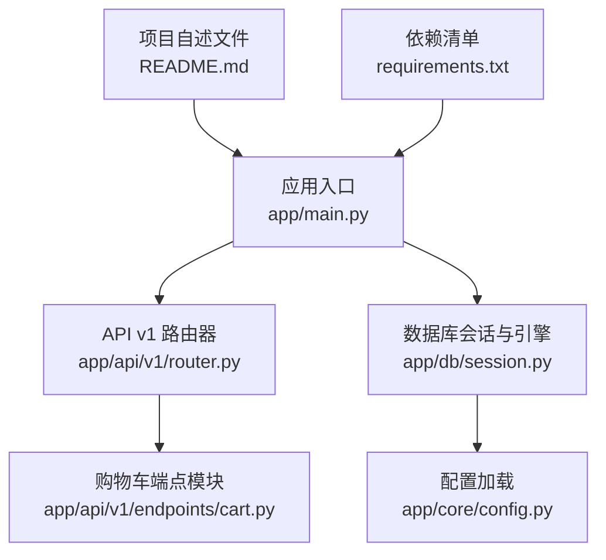
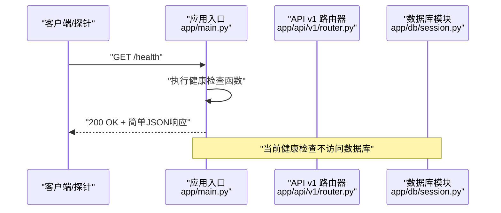
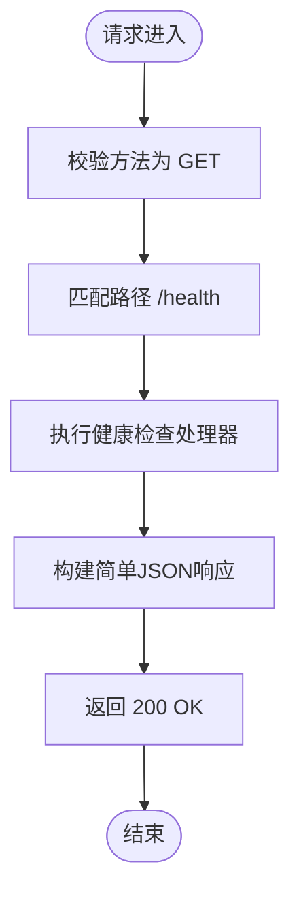
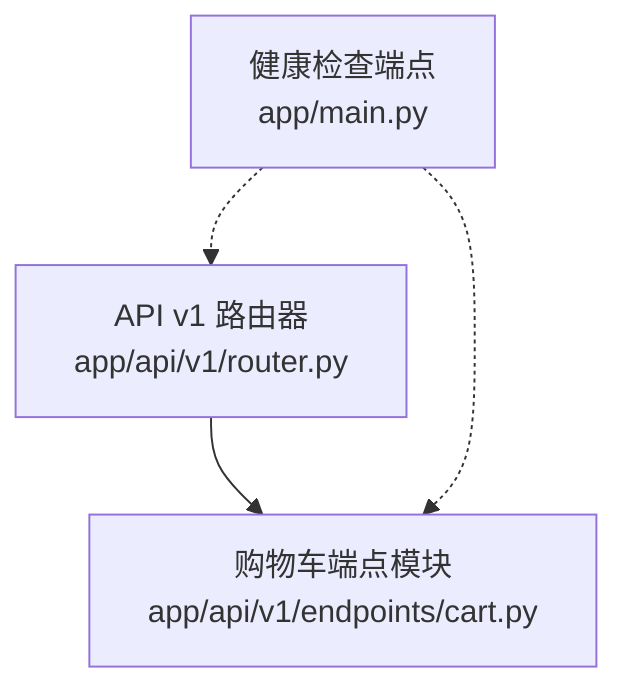
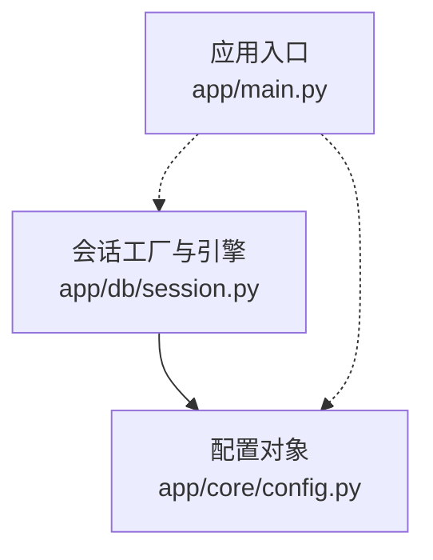
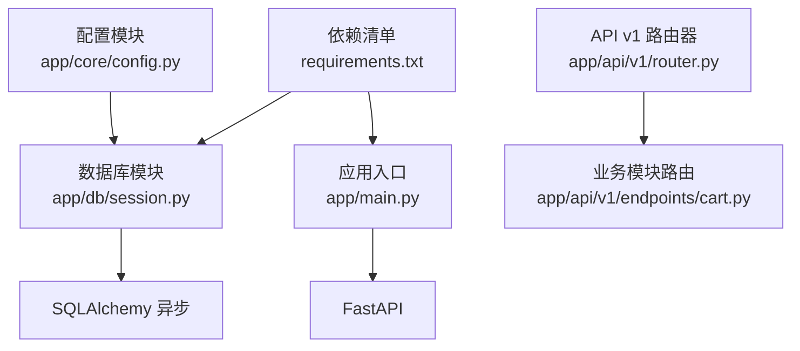

# 健康检查

<cite>
**本文引用的文件**
- [app/main.py](file://app/main.py)
- [app/api/v1/router.py](file://app/api/v1/router.py)
- [app/api/v1/endpoints/cart.py](file://app/api/v1/endpoints/cart.py)
- [app/db/session.py](file://app/db/session.py)
- [app/core/config.py](file://app/core/config.py)
- [README.md](file://README.md)
- [requirements.txt](file://requirements.txt)
</cite>

## 目录
1. [简介](#简介)
2. [项目结构](#项目结构)
3. [核心组件](#核心组件)
4. [架构总览](#架构总览)
5. [详细组件分析](#详细组件分析)
6. [依赖分析](#依赖分析)
7. [性能考虑](#性能考虑)
8. [故障排查指南](#故障排查指南)
9. [结论](#结论)

## 简介
本节面向“GET /health”健康检查接口的使用与实现进行系统化说明。该接口用于系统健康检查，通常由 Kubernetes、负载均衡器或监控系统调用，以确认服务处于可运行状态。当前实现为简单存活检查，成功时返回 200 OK 及简单 JSON 响应（如 {"status":"healthy"}）。根据实现位置与项目结构，该接口位于应用入口处，无需认证，不涉及数据库连接检查；未来可扩展为更全面的健康检查（例如数据库连通性检测），但当前版本仅提供基础存活能力。

- 接口定位与访问方式：参见项目自述文件中对健康检查地址的说明。
- 认证与安全：该接口无需认证，不应返回任何敏感信息。
- 高可用性意义：作为探针端点，有助于编排系统快速识别实例健康状况，从而进行流量调度与自动恢复。

**章节来源**
- [README.md](file://README.md#L100-L105)

## 项目结构
- 应用入口负责定义 FastAPI 实例、挂载路由，并在根路径暴露健康检查端点。
- API v1 路由器负责聚合各业务模块路由（如购物车模块），但健康检查并不在此处注册。
- 数据库引擎与会话在独立模块中初始化，当前健康检查未直接使用数据库连接。

**图表来源**
- [app/main.py](file://app/main.py#L1-L17)
- [app/api/v1/router.py](file://app/api/v1/router.py#L1-L6)
- [app/api/v1/endpoints/cart.py](file://app/api/v1/endpoints/cart.py#L1-L65)
- [app/db/session.py](file://app/db/session.py#L1-L24)
- [app/core/config.py](file://app/core/config.py#L1-L18)
- [README.md](file://README.md#L100-L105)
- [requirements.txt](file://requirements.txt#L1-L9)

**章节来源**
- [app/main.py](file://app/main.py#L1-L17)
- [app/api/v1/router.py](file://app/api/v1/router.py#L1-L6)
- [app/api/v1/endpoints/cart.py](file://app/api/v1/endpoints/cart.py#L1-L65)
- [app/db/session.py](file://app/db/session.py#L1-L24)
- [app/core/config.py](file://app/core/config.py#L1-L18)
- [README.md](file://README.md#L100-L105)
- [requirements.txt](file://requirements.txt#L1-L9)

## 核心组件
- 健康检查端点：位于应用入口文件中，使用框架装饰器在根路径注册，处理 GET 请求，返回固定 JSON 结果。
- 路由组织：API v1 路由器负责聚合业务路由，健康检查不在业务模块内注册。
- 数据库连接：数据库引擎与会话在独立模块中初始化，当前健康检查未使用数据库连接。
- 配置加载：数据库 URL 等配置通过设置对象加载，供数据库模块使用。

**章节来源**
- [app/main.py](file://app/main.py#L1-L17)
- [app/api/v1/router.py](file://app/api/v1/router.py#L1-L6)
- [app/db/session.py](file://app/db/session.py#L1-L24)
- [app/core/config.py](file://app/core/config.py#L1-L18)

## 架构总览
下图展示了健康检查从客户端到应用入口的调用链路，以及与数据库模块的关系。健康检查当前为纯内存态的存活检查，不依赖数据库连接。

**图表来源**
- [app/main.py](file://app/main.py#L13-L16)
- [app/api/v1/router.py](file://app/api/v1/router.py#L1-L6)
- [app/db/session.py](file://app/db/session.py#L1-L24)

## 详细组件分析

### 健康检查端点（GET /health）
- 定义位置：应用入口文件中，使用框架装饰器在根路径注册。
- 请求与响应：
  - 方法：GET
  - 路径：/
  - 请求体：无
  - 响应：200 OK，返回简单 JSON（如 {"status":"healthy"}）
- 认证与安全：无需认证；不应返回任何敏感信息。
- 扩展建议：未来可扩展为更全面的健康检查，例如数据库连通性检测、外部依赖可用性检查等。

**图表来源**
- [app/main.py](file://app/main.py#L13-L16)

**章节来源**
- [app/main.py](file://app/main.py#L13-L16)
- [README.md](file://README.md#L100-L105)

### 路由与模块关系
- API v1 路由器负责包含业务模块路由（如购物车模块），健康检查并不在此处注册。
- 业务模块路由文件中包含多个端点，但均不涉及健康检查逻辑。

**图表来源**
- [app/api/v1/router.py](file://app/api/v1/router.py#L1-L6)
- [app/api/v1/endpoints/cart.py](file://app/api/v1/endpoints/cart.py#L1-L65)
- [app/main.py](file://app/main.py#L13-L16)

**章节来源**
- [app/api/v1/router.py](file://app/api/v1/router.py#L1-L6)
- [app/api/v1/endpoints/cart.py](file://app/api/v1/endpoints/cart.py#L1-L65)

### 数据库连接与配置
- 数据库引擎与会话在独立模块中初始化，使用异步引擎与会话工厂。
- 配置通过设置对象加载，包含数据库 URL 等关键参数。
- 当前健康检查未使用数据库连接，因此不会触发数据库连接行为。

**图表来源**
- [app/db/session.py](file://app/db/session.py#L1-L24)
- [app/core/config.py](file://app/core/config.py#L1-L18)
- [app/main.py](file://app/main.py#L1-L17)

**章节来源**
- [app/db/session.py](file://app/db/session.py#L1-L24)
- [app/core/config.py](file://app/core/config.py#L1-L18)

## 依赖分析
- 应用入口依赖 FastAPI 框架，用于定义路由与响应。
- API v1 路由器依赖业务模块路由，但健康检查不在此处注册。
- 数据库模块依赖 SQLAlchemy 异步引擎与会话工厂，当前健康检查不使用数据库。
- 依赖清单显示项目使用 FastAPI、Uvicorn、SQLAlchemy 异步、Pydantic、Pydantic Settings、Alembic、python-dotenv 等技术栈。

**图表来源**
- [app/main.py](file://app/main.py#L1-L17)
- [app/api/v1/router.py](file://app/api/v1/router.py#L1-L6)
- [app/api/v1/endpoints/cart.py](file://app/api/v1/endpoints/cart.py#L1-L65)
- [app/db/session.py](file://app/db/session.py#L1-L24)
- [app/core/config.py](file://app/core/config.py#L1-L18)
- [requirements.txt](file://requirements.txt#L1-L9)

**章节来源**
- [requirements.txt](file://requirements.txt#L1-L9)

## 性能考虑
- 健康检查当前为纯内存态的存活检查，开销极低，适合高频探测。
- 若未来扩展为包含数据库连通性检查，需注意：
  - 将数据库检查与主业务隔离，避免影响主请求延迟。
  - 控制检查频率与超时时间，防止探针风暴。
  - 对数据库检查结果进行缓存或短周期复用，减少重复开销。

[本节为通用指导，不直接分析具体文件]

## 故障排查指南
- 健康检查返回非 200：
  - 检查应用是否正常启动（参考自述文件中的启动与访问说明）。
  - 确认探针目标地址与端口正确。
- 返回异常或错误：
  - 查看应用日志输出，定位异常堆栈。
  - 如未来扩展数据库检查，请确认数据库连接字符串与可达性。
- 高频探针导致性能问题：
  - 调整探针间隔与超时，避免过于频繁的探测。
  - 对数据库检查进行限流或缓存。

**章节来源**
- [README.md](file://README.md#L93-L105)
- [app/db/session.py](file://app/db/session.py#L1-L24)

## 结论
- GET /health 当前为简单存活检查，无需认证，适合用作探针端点。
- 其实现位于应用入口，不依赖数据库连接，具备低开销、高可用的特点。
- 建议将其配置为探针端点，用于编排系统的健康判定与流量调度。
- 未来可按需扩展为更全面的健康检查（如数据库连通性），但需注意性能与安全边界。

[本节为总结性内容，不直接分析具体文件]