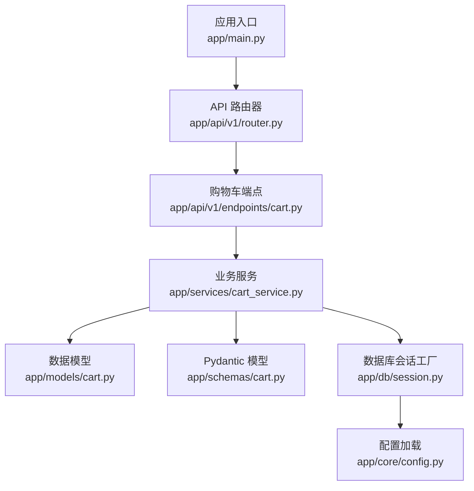
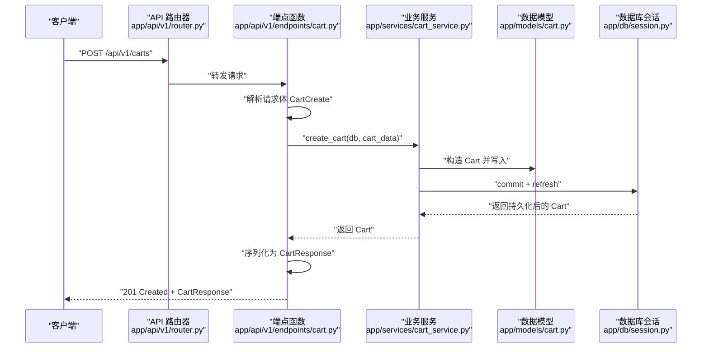
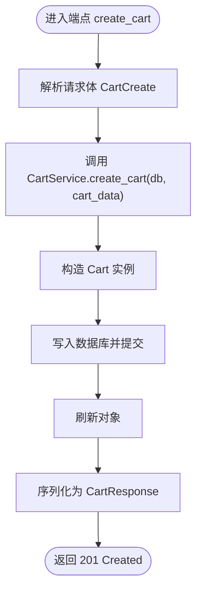
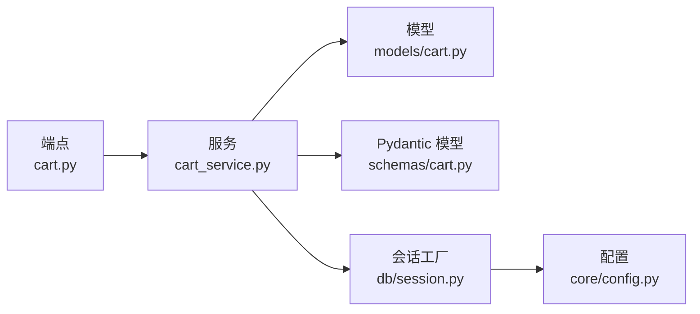

# 创建购物车

<cite>
**本文引用的文件**
- [app/main.py](file://app/main.py)
- [app/api/v1/router.py](file://app/api/v1/router.py)
- [app/api/v1/endpoints/cart.py](file://app/api/v1/endpoints/cart.py)
- [app/schemas/cart.py](file://app/schemas/cart.py)
- [app/models/cart.py](file://app/models/cart.py)
- [app/services/cart_service.py](file://app/services/cart_service.py)
- [app/db/session.py](file://app/db/session.py)
- [app/core/config.py](file://app/core/config.py)
</cite>

## 目录
1. [简介](#简介)
2. [项目结构](#项目结构)
3. [核心组件](#核心组件)
4. [架构总览](#架构总览)
5. [详细组件分析](#详细组件分析)
6. [依赖关系分析](#依赖关系分析)
7. [性能与并发特性](#性能与并发特性)
8. [故障排查指南](#故障排查指南)
9. [结论](#结论)

## 简介
本文件针对 POST /api/v1/carts 接口进行完整 API 文档化，说明其职责：为匿名用户（user_id 为 null）或登录用户（提供 user_id）创建新的购物车。请求体使用 CartCreate 模型，响应返回 CartResponse 完整购物车信息（包含购物车 ID、状态、创建时间、更新时间、商品列表以及总价）。接口在成功时返回 201 Created。文档同时解释该接口如何通过依赖注入获取异步数据库会话，并给出请求与响应示例。

## 项目结构
该服务采用 FastAPI + SQLAlchemy Async 的分层架构：
- 路由与控制器：位于 app/api/v1/endpoints/cart.py
- 数据模型：位于 app/models/cart.py
- Pydantic 模型（请求/响应）：位于 app/schemas/cart.py
- 业务服务：位于 app/services/cart_service.py
- 数据库会话与引擎：位于 app/db/session.py
- 应用入口与路由挂载：位于 app/main.py 与 app/api/v1/router.py
- 配置加载：位于 app/core/config.py

图表来源
- [app/main.py](file://app/main.py#L1-L17)
- [app/api/v1/router.py](file://app/api/v1/router.py#L1-L6)
- [app/api/v1/endpoints/cart.py](file://app/api/v1/endpoints/cart.py#L1-L65)
- [app/services/cart_service.py](file://app/services/cart_service.py#L1-L125)
- [app/models/cart.py](file://app/models/cart.py#L1-L37)
- [app/schemas/cart.py](file://app/schemas/cart.py#L1-L46)
- [app/db/session.py](file://app/db/session.py#L1-L24)
- [app/core/config.py](file://app/core/config.py#L1-L18)

章节来源
- [app/main.py](file://app/main.py#L1-L17)
- [app/api/v1/router.py](file://app/api/v1/router.py#L1-L6)

## 核心组件
- 端点函数：POST /api/v1/carts 对应 create_cart，负责接收 CartCreate 请求体并调用业务服务创建购物车，返回 CartResponse。
- 业务服务：CartService.create_cart 将 CartCreate 映射为模型并持久化，返回已创建的 Cart 实例。
- 数据模型：Cart 表示购物车实体，包含 id、user_id、status、created_at、updated_at 及关联的商品项集合。
- Pydantic 模型：
  - CartCreate：仅包含 user_id 字段（可为 null）
  - CartResponse：包含购物车基本信息、商品列表 items、以及 total_price 字段
- 数据库会话：通过依赖注入 get_db 提供 AsyncSession，确保每个请求拥有独立的异步会话。

章节来源
- [app/api/v1/endpoints/cart.py](file://app/api/v1/endpoints/cart.py#L24-L28)
- [app/services/cart_service.py](file://app/services/cart_service.py#L24-L30)
- [app/models/cart.py](file://app/models/cart.py#L10-L21)
- [app/schemas/cart.py](file://app/schemas/cart.py#L28-L46)
- [app/db/session.py](file://app/db/session.py#L18-L24)

## 架构总览
POST /api/v1/carts 的调用链路如下：

图表来源
- [app/api/v1/router.py](file://app/api/v1/router.py#L1-L6)
- [app/api/v1/endpoints/cart.py](file://app/api/v1/endpoints/cart.py#L24-L28)
- [app/services/cart_service.py](file://app/services/cart_service.py#L24-L30)
- [app/models/cart.py](file://app/models/cart.py#L10-L21)
- [app/db/session.py](file://app/db/session.py#L18-L24)

## 详细组件分析

### 接口定义与行为
- 方法与路径：POST /api/v1/carts
- 认证与授权：未声明需要认证头；支持匿名用户（user_id 为 null）与登录用户（提供 user_id）
- 请求体：CartCreate
  - 字段：user_id（可为 null）
- 响应体：CartResponse
  - 字段：id、user_id（可为 null）、status、created_at、updated_at、items（列表）、total_price
- 状态码：201 Created
- 错误处理：
  - 当底层数据库操作异常时，FastAPI 默认抛出 500 错误（由框架捕获未处理异常）

章节来源
- [app/api/v1/endpoints/cart.py](file://app/api/v1/endpoints/cart.py#L24-L28)
- [app/schemas/cart.py](file://app/schemas/cart.py#L28-L46)

### 请求与响应示例
- 请求示例（JSON）
  - 匿名用户：user_id 为 null
  - 登录用户：提供有效的 user_id
- 成功响应示例（JSON）
  - 返回完整的 CartResponse，包含购物车基本信息、items 列表以及 total_price

说明
- 具体 JSON 示例请参考以下“章节来源”中的路径，按需自行生成示例数据。

章节来源
- [app/schemas/cart.py](file://app/schemas/cart.py#L28-L46)
- [app/api/v1/endpoints/cart.py](file://app/api/v1/endpoints/cart.py#L24-L28)

### 依赖注入与数据库会话
- 依赖注入
  - 端点函数 create_cart 使用 Depends(get_db) 获取 AsyncSession
  - get_db 是一个异步上下文管理器，确保每个请求获得独立会话并在请求结束时关闭
- 异步数据库引擎
  - 通过 settings.DATABASE_URL 初始化异步引擎
  - AsyncSessionLocal 作为会话工厂，提供 AsyncSession 实例

章节来源
- [app/api/v1/endpoints/cart.py](file://app/api/v1/endpoints/cart.py#L1-L10)
- [app/db/session.py](file://app/db/session.py#L1-L24)
- [app/core/config.py](file://app/core/config.py#L1-L18)

### 业务流程与数据流
- 端点层
  - 解析 CartCreate 请求体
  - 调用 CartService.create_cart
- 服务层
  - 构造 Cart 实例（user_id 可为 null）
  - 写入数据库并刷新对象
- 模型层
  - Cart 模型映射 carts 表，包含状态、时间戳等字段
- 响应层
  - 使用 CartResponse 序列化返回，包含 items 与 total_price

图表来源
- [app/api/v1/endpoints/cart.py](file://app/api/v1/endpoints/cart.py#L24-L28)
- [app/services/cart_service.py](file://app/services/cart_service.py#L24-L30)
- [app/models/cart.py](file://app/models/cart.py#L10-L21)
- [app/schemas/cart.py](file://app/schemas/cart.py#L32-L46)

## 依赖关系分析
- 组件耦合
  - 端点层仅依赖服务层接口，保持低耦合
  - 服务层依赖模型与 Pydantic 模型，便于数据转换
  - 数据库会话通过依赖注入解耦，便于测试与替换
- 外部依赖
  - FastAPI 负责路由与依赖注入
  - SQLAlchemy Async 负责 ORM 与异步数据库访问
  - Pydantic 负责请求/响应校验与序列化

图表来源
- [app/api/v1/endpoints/cart.py](file://app/api/v1/endpoints/cart.py#L1-L65)
- [app/services/cart_service.py](file://app/services/cart_service.py#L1-L125)
- [app/models/cart.py](file://app/models/cart.py#L1-L37)
- [app/schemas/cart.py](file://app/schemas/cart.py#L1-L46)
- [app/db/session.py](file://app/db/session.py#L1-L24)
- [app/core/config.py](file://app/core/config.py#L1-L18)

## 性能与并发特性
- 异步数据库访问
  - 使用 SQLAlchemy Async Engine 与 AsyncSession，适合高并发场景
- 会话生命周期
  - 每个请求独立会话，避免跨请求状态污染
- 事务边界
  - create_cart 在单次提交中完成插入与刷新，减少往返
- 扩展建议
  - 对于高频写入，可考虑批量操作与连接池参数优化
  - 对响应序列化，可利用 from_attributes 特性提升性能

章节来源
- [app/db/session.py](file://app/db/session.py#L1-L24)
- [app/services/cart_service.py](file://app/services/cart_service.py#L24-L30)

## 故障排查指南
- 500 错误（数据库连接失败）
  - 现象：请求返回 500，通常由数据库连接异常导致
  - 排查要点：
    - 检查 DATABASE_URL 配置是否正确
    - 确认数据库服务可用且网络连通
    - 查看应用日志以定位具体异常栈
- 404 错误（其他端点）
  - 虽非本接口直接返回，但服务中存在 404 场景（如查询不存在的购物车或商品项），可参考以理解错误处理风格
- 依赖注入问题
  - 若出现会话未获取或提前关闭，检查 get_db 的使用方式与路由挂载

章节来源
- [app/core/config.py](file://app/core/config.py#L1-L18)
- [app/db/session.py](file://app/db/session.py#L1-L24)
- [app/services/cart_service.py](file://app/services/cart_service.py#L14-L23)

## 结论
POST /api/v1/carts 接口设计简洁，职责清晰：为匿名或登录用户创建购物车。通过依赖注入与异步会话，系统具备良好的可维护性与并发能力。请求体与响应体均采用强类型 Pydantic 模型，保证了数据一致性与易用性。在生产环境中，建议关注数据库连接稳定性与日志监控，以降低 500 错误发生概率。